# Rheumatoid Arthritis Systems Immunology Report

## Purpose and background
This report documents a complete in silico systems immunology study focused on rheumatoid arthritis (RA). The workflow integrates multi-omics dimensionality reduction, immune-cell deconvolution, mechanistic cytokine modeling, multimodal drug-response prediction, single-cell simulation, and immune-tolerance restoration. The goal is to emulate the analytical logic of contemporary RA biomarker and mechanism studies while keeping the full experiment reproducible from a single Python script.

## Methods summary per experiment
1. **Multi-omics integration**: simulated transcriptome, proteome, and metabolome data with disease signal, noise, and batch effects; reduced each layer with PCA and generated a joint embedding.
2. **Immune deconvolution**: simulated bulk RNA-seq mixtures for nine immune cell types and recovered proportions with NNLS as a CIBERSORTx-like surrogate.
3. **Cytokine ODE modeling**: solved a nonlinear inflammatory network for untreated RA, anti-TNF therapy, and anti-IL6 therapy.
4. **Drug response prediction**: trained logistic regression, random forest, gradient boosting, and SVM models on 95 multimodal features using 5-fold cross-validation and held-out testing.
5. **Single-cell simulation**: generated 5,000 cells across eight immune populations and embedded them with t-SNE after PCA compression.
6. **Immune tolerance restoration**: extended the ODE framework with Treg expansion and compared cytokine suppression and Treg/Teff restoration metrics.

## Results
### Experiment 1: Multi-omics integration
The joint integration captured RA-control separation despite realistic technical variability. The first three joint factors explained 19.97%, 19.96%, 19.93% of integrated variance.

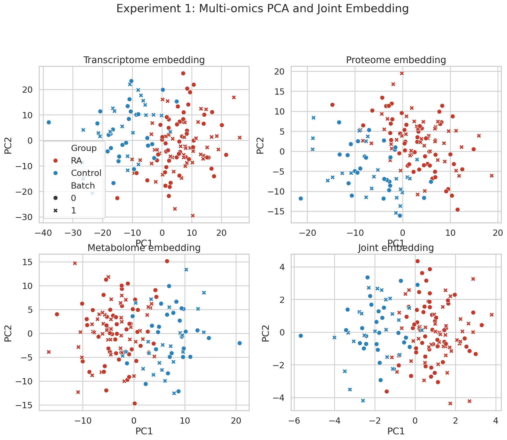

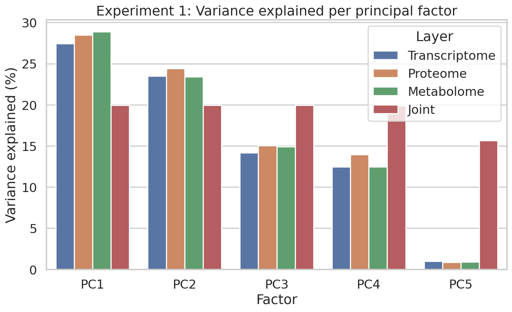

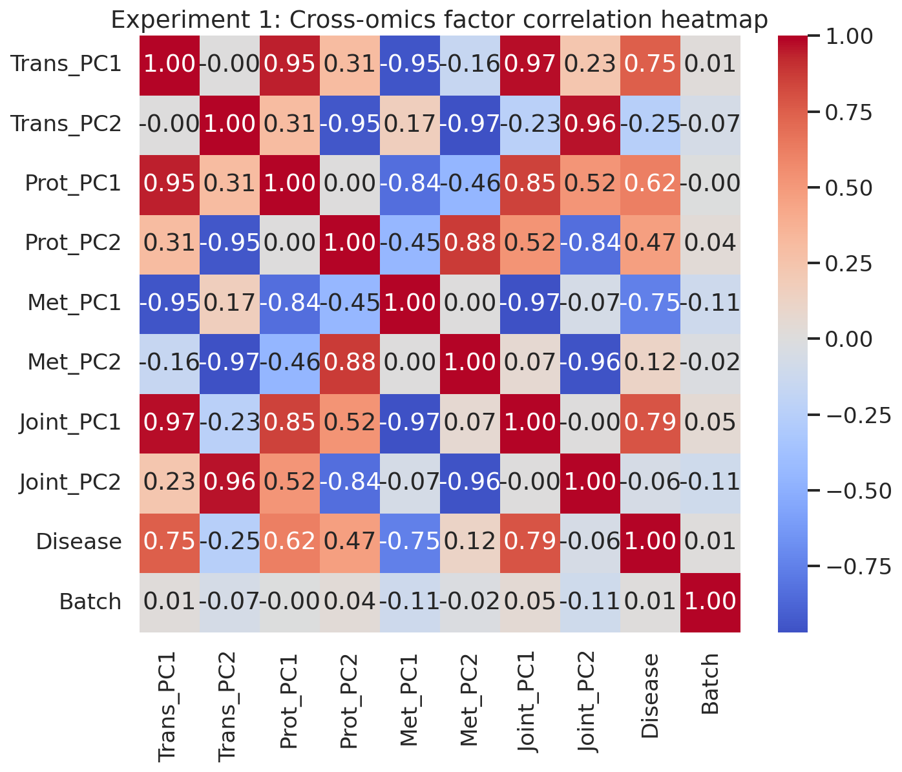

| Factor | Transcriptome | Proteome | Metabolome | Joint |
| --- | --- | --- | --- | --- |
| PC1 | 27.431 | 28.506 | 28.895 | 19.968 |
| PC2 | 23.492 | 24.425 | 23.424 | 19.956 |
| PC3 | 14.173 | 15.045 | 14.902 | 19.931 |
| PC4 | 12.476 | 13.939 | 12.461 | 19.901 |
| PC5 | 1.001 | 0.869 | 0.902 | 15.678 |

### Experiment 2: Immune-cell deconvolution
Estimated proportions showed higher neutrophils, monocytes, and M1 macrophages in RA together with reduced Tregs.

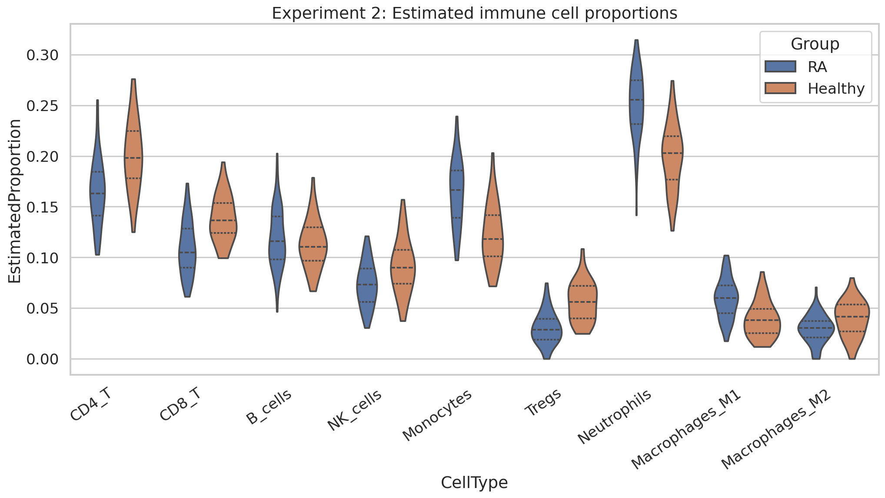

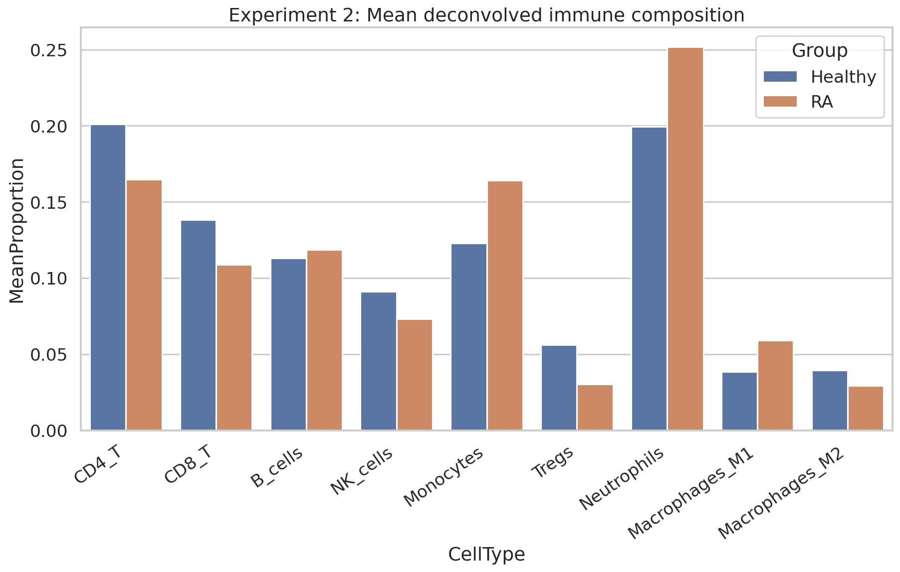

| Cell type | RA mean | Healthy mean | p-value | Cohen's d |
| --- | --- | --- | --- | --- |
| Neutrophils | 0.252 | 0.199 | <1e-4 | 1.645 |
| Tregs | 0.030 | 0.056 | <1e-4 | -1.520 |
| Monocytes | 0.164 | 0.123 | <1e-4 | 1.319 |
| CD8_T | 0.109 | 0.138 | <1e-4 | -1.174 |
| CD4_T | 0.165 | 0.201 | <1e-4 | -1.105 |
| Macrophages_M1 | 0.059 | 0.039 | <1e-4 | 1.075 |
| NK_cells | 0.073 | 0.091 | 0.0006 | -0.768 |
| Macrophages_M2 | 0.029 | 0.040 | 0.0018 | -0.670 |
| B_cells | 0.119 | 0.113 | 0.3598 | 0.204 |

### Experiments 3 and 6: Cytokine dynamics and immune restoration
The dynamical system differentiated cytokine blockade from regulatory restoration. Treg expansion generated the strongest Treg/Teff improvement.

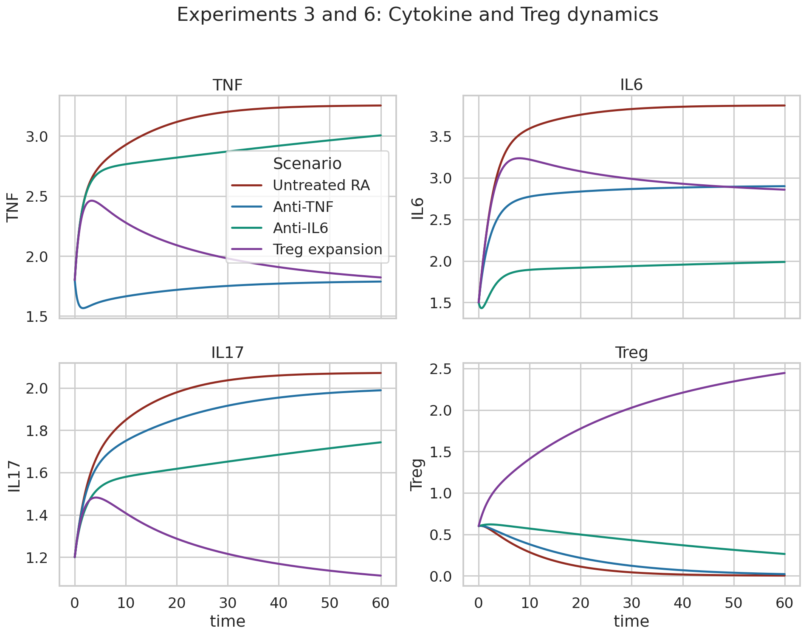

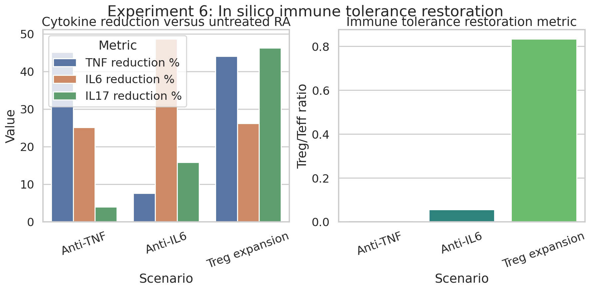

**Steady states**

| Scenario | TNF | IL6 | IL17 | IL1b | TGFb | Treg | Macrophage |
| --- | --- | --- | --- | --- | --- | --- | --- |
| Untreated RA | 3.255 | 3.870 | 2.071 | 2.395 | 0.003 | 0.002 | 1.619 |
| Anti-TNF | 1.788 | 2.899 | 1.989 | 1.917 | 0.026 | 0.020 | 1.541 |
| Anti-IL6 | 3.006 | 1.988 | 1.743 | 2.303 | 0.311 | 0.263 | 1.596 |
| Treg expansion | 1.822 | 2.857 | 1.113 | 1.877 | 2.987 | 2.447 | 1.484 |

**Restoration metrics**

| Scenario | TNF reduction % | IL6 reduction % | IL17 reduction % | Treg/Teff ratio | Improvement vs baseline ratio % |
| --- | --- | --- | --- | --- | --- |
| Anti-TNF | 45.074 | 25.088 | 3.960 | 0.005 | 1292.551 |
| Anti-IL6 | 7.643 | 48.637 | 15.838 | 0.055 | 14456.167 |
| Treg expansion | 44.017 | 26.168 | 46.277 | 0.834 | 218747.253 |

### Experiment 4: Drug-response prediction
The simulated multimodal models achieved realistic, non-perfect performance with best cross-validated AUCs in the clinically plausible range. Selected simulation noise level: 1.60.

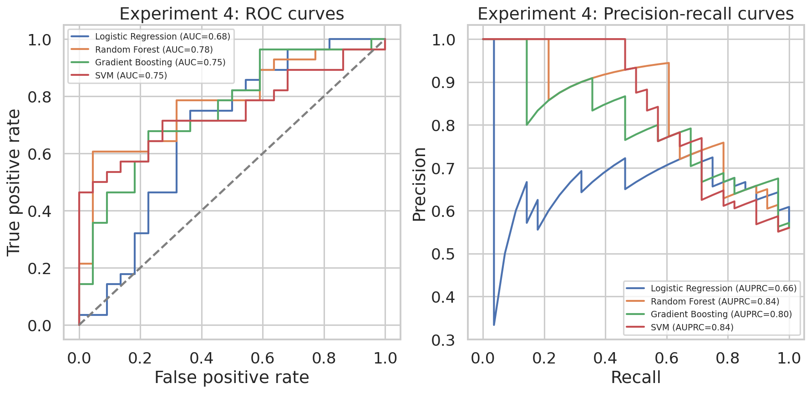

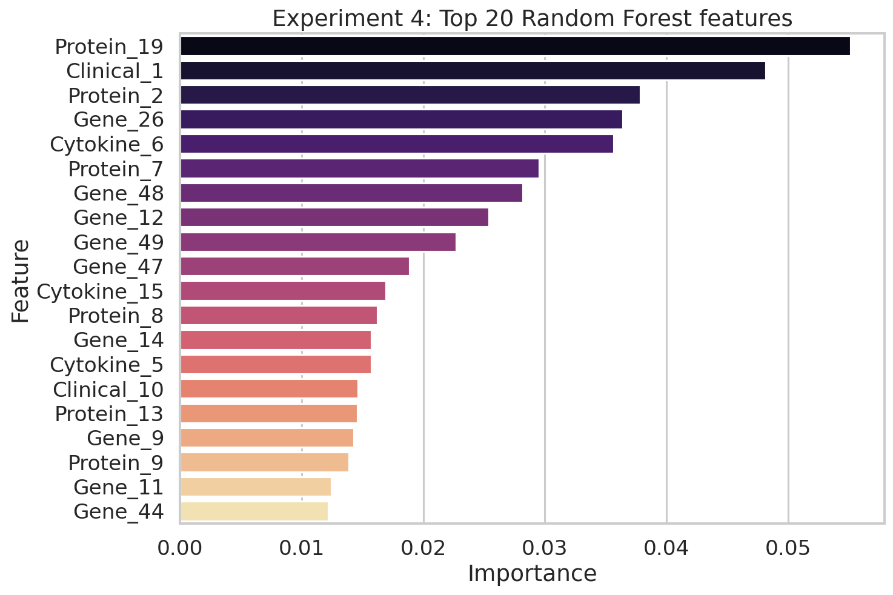

**Cross-validation**

| Model | AUC mean | AUC sd | F1 mean | F1 sd | Sensitivity mean | Sensitivity sd | Specificity mean | Specificity sd |
| --- | --- | --- | --- | --- | --- | --- | --- | --- |
| Random Forest | 0.775 | 0.121 | 0.804 | 0.100 | 0.879 | 0.086 | 0.583 | 0.205 |
| Gradient Boosting | 0.770 | 0.166 | 0.750 | 0.134 | 0.788 | 0.138 | 0.581 | 0.202 |
| SVM | 0.760 | 0.134 | 0.757 | 0.116 | 0.844 | 0.126 | 0.489 | 0.194 |
| Logistic Regression | 0.723 | 0.104 | 0.698 | 0.111 | 0.705 | 0.112 | 0.578 | 0.159 |

**Held-out testing**

| Model | Test AUC | Test F1 | Test Sensitivity | Test Specificity |
| --- | --- | --- | --- | --- |
| Random Forest | 0.779 | 0.746 | 0.786 | 0.591 |
| Gradient Boosting | 0.755 | 0.733 | 0.786 | 0.545 |
| SVM | 0.747 | 0.690 | 0.714 | 0.545 |
| Logistic Regression | 0.680 | 0.737 | 0.750 | 0.636 |

### Experiment 5: Single-cell simulation
The single-cell embedding resolved eight immune populations and localized checkpoint programs across clusters. Embedding method used: t-SNE.

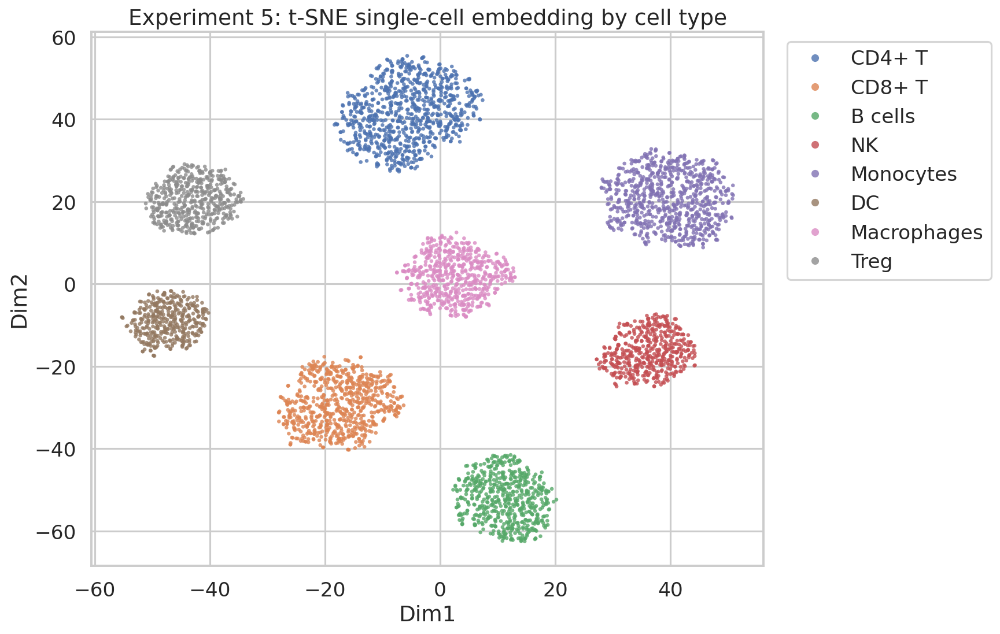

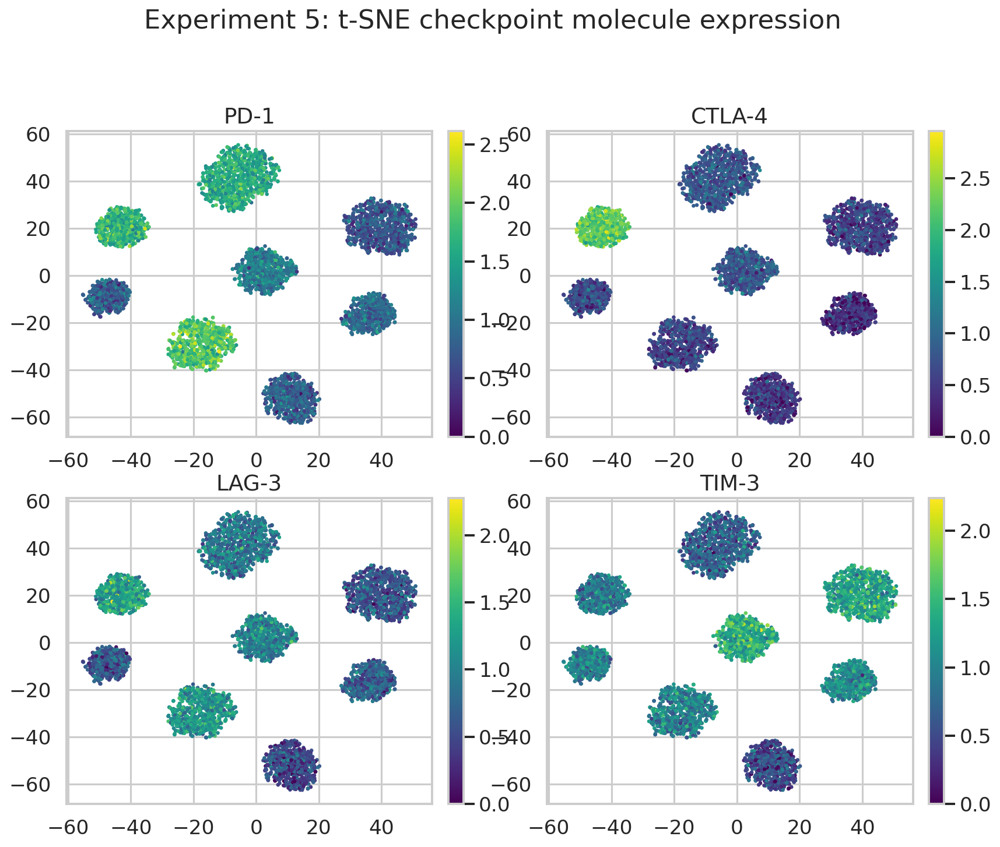

**Cell composition**

| CellType | Count | Fraction |
| --- | --- | --- |
| CD4+ T | 900 | 0.180 |
| CD8+ T | 700 | 0.140 |
| B cells | 600 | 0.120 |
| NK | 500 | 0.100 |
| Monocytes | 800 | 0.160 |
| DC | 400 | 0.080 |
| Macrophages | 600 | 0.120 |
| Treg | 500 | 0.100 |

**Checkpoint expression**

| CellType | PD-1 | CTLA-4 | LAG-3 | TIM-3 |
| --- | --- | --- | --- | --- |
| B cells | 0.802 | 0.505 | 0.501 | 0.503 |
| CD4+ T | 1.592 | 0.804 | 0.899 | 0.699 |
| CD8+ T | 1.897 | 0.620 | 1.195 | 0.989 |
| DC | 0.800 | 0.680 | 0.599 | 0.990 |
| Macrophages | 1.117 | 0.819 | 1.000 | 1.391 |
| Monocytes | 0.706 | 0.591 | 0.603 | 1.312 |
| NK | 0.902 | 0.401 | 0.684 | 1.090 |
| Treg | 1.683 | 2.203 | 1.299 | 0.895 |

## Discussion and future outlook
The combined analyses support a systems-level interpretation of RA in which molecular state, cell composition, and network feedback jointly shape treatment response. The framework can be extended to real cohorts, longitudinal sampling, synovial tissue data, TCR/BCR sequencing, or hybrid mechanistic/ML models. Future studies should replace simulation assumptions with public RA datasets and assess external validity across therapies and clinical endpoints.

## Full file list
- figures/exp1_correlation_heatmap.png
- figures/exp1_multiomics_pca.png
- figures/exp1_variance_explained.png
- figures/exp2_cell_proportions_bar.png
- figures/exp2_cell_proportions_violin.png
- figures/exp3_cytokine_dynamics.png
- figures/exp4_feature_importance.png
- figures/exp4_roc_pr_curves.png
- figures/exp5_checkpoint_expression.png
- figures/exp5_single_cell_embedding.png
- figures/exp6_tolerance_restoration.png
- generate_ra_study.py
- paper.md
- report.md