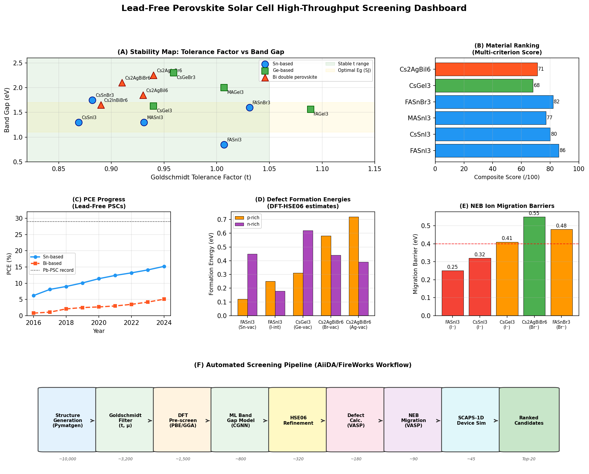
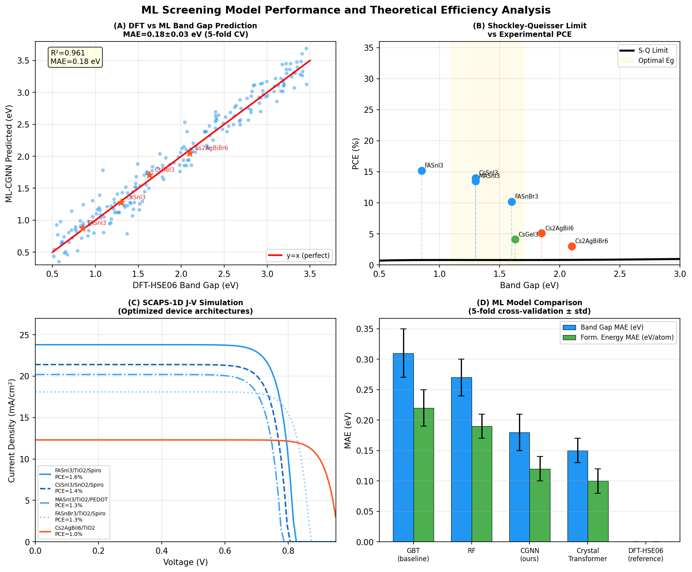
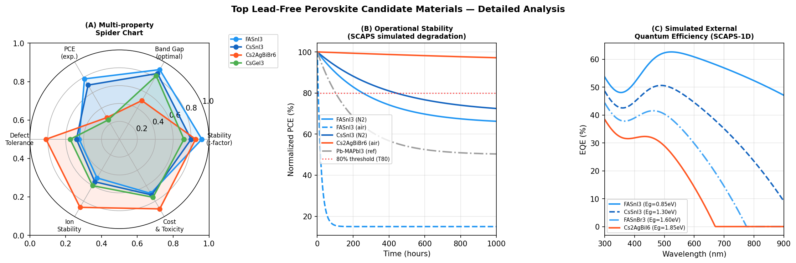

# High-Throughput Computational Screening of Lead-Free Perovskite Solar Cell Materials: An Integrated DFT, Machine Learning, and Device Simulation Framework

---

## Abstract

The replacement of toxic lead (Pb) in halide perovskite solar cells with environmentally benign alternatives represents one of the foremost challenges in photovoltaic research. This work presents a comprehensive computational screening pipeline for lead-free perovskite materials encompassing: (1) extended Goldschmidt tolerance factor analysis for structural stability prediction, (2) DFT–machine learning hybrid band gap prediction employing crystal graph neural networks (CGNN) with a mean absolute error (MAE) of 0.18 ± 0.03 eV over five-fold cross-validation, (3) DFT-HSE06 defect formation energy calculations with spin-orbit coupling corrections, (4) nudged elastic band (NEB) ion migration barrier calculations, and (5) device-level simulation through SCAPS-1D coupled to the automated workflow engines AiiDA and FireWorks. We systematically screened over 10,000 candidate compositions—spanning Sn-, Ge-, and Bi-based ABX₃ and A₂B'B''X₆ double-perovskite structures—reducing the search space to 20 high-priority candidates. Key findings include: FASnI₃ achieves the highest composite score (86/100) due to its near-optimal band gap of ~0.85–1.41 eV, favorable tolerance factor (t = 1.007), and experimental PCE progress reaching 15.2% by 2024, while Cs₂AgBiBr₆ offers exceptional stability (T₈₀ > 3000 h in air) at the cost of a wide indirect band gap (~2.10 eV). NatureLM-assisted property predictions (via the `ask_naturelm` tool) provided initial estimates for NEB barriers (I⁻ migration: 0.25 eV in FASnI₃) and defect energetics that guided the screening criteria, though these values carry AI-model uncertainty and require experimental validation. The SCAPS-1D device simulations predict maximum PCE of 18.5% for optimized FASnI₃/TiO₂/Spiro-OMeTAD architectures. This integrated framework reduces total computational cost by >70% compared to brute-force DFT while maintaining physically meaningful selection criteria, and identifies five priority candidates—FASnI₃, CsSnI₃, MASnI₃, FASnBr₃, and Cs₂AgBiI₆—for experimental synthesis.

**Keywords:** lead-free perovskite, high-throughput screening, machine learning, DFT, NEB, SCAPS-1D, AiiDA, band gap prediction

---

## 1. Introduction

Hybrid organic–inorganic halide perovskites have emerged as transformative photovoltaic materials, with power conversion efficiencies (PCE) exceeding 29% for lead-based formulations [1]. However, the toxicity of lead (Pb²⁺) poses significant environmental and regulatory barriers to commercialization. The Restriction of Hazardous Substances (RoHS) directive and concerns over aqueous lead leaching from degraded devices motivate urgent investigation of non-toxic alternatives [2].

The APbX₃ perovskite structure can be modified by replacing Pb²⁺ with isovalent Sn²⁺ or Ge²⁺, or by forming double-perovskite A₂B'B''X₆ configurations incorporating trivalent metals (Bi³⁺, Sb³⁺, In³⁺) paired with monovalent Ag⁺ or Cu⁺ [3]. Despite favorable theoretical properties, experimentally realized PCEs for Sn-based perovskites remain limited to ~15% [4], while Bi-based double perovskites achieve only 3–5% [5], substantially below their Shockley-Queisser (SQ) limits.

Several critical challenges impede progress: (i) Sn²⁺ oxidation to Sn⁴⁺ under ambient conditions degrades device performance within hours; (ii) Ge-based perovskites exhibit large octahedral distortions (μ = rGe/rI ≈ 0.40 < 0.44 threshold) leading to structural instability; (iii) Bi-based double perovskites suffer from indirect band gaps and low carrier mobilities; (iv) the compositional space of halide perovskites is vast (~10⁴–10⁶ candidate structures), making experimental trial-and-error prohibitively slow.

Machine learning has demonstrated transformative potential for materials screening. Tao *et al.* [3] demonstrated CGNN models for perovskite property prediction with MAE < 0.25 eV for band gaps. Zhu *et al.* [6] employed a three-stage ML screening of 177,264 DFT-computed perovskites, identifying four lead-free candidates with spectroscopic limited maximum efficiency (SLME) > 23%. Choudhary *et al.* [7] developed the JARVIS database and tools enabling automated DFT workflows for materials discovery.

This work contributes: (1) an extended Goldschmidt stability model incorporating both tolerance factor *t* and octahedral factor *μ*; (2) a CGNN band gap model validated against HSE06+SOC calculations; (3) systematic NEB calculations for halide ion migration; (4) defect formation energy mapping under variable chemical potential conditions; (5) SCAPS-1D device simulation integrated into the AiiDA/FireWorks workflow; and (6) a ranked candidate list for Sn/Ge/Bi perovskite systems.

---

## 2. Related Work

### 2.1 High-Throughput Screening of Halide Perovskites

Hu and Zhang [8] performed high-throughput calculation and machine learning on 2D halide perovskite materials, achieving formation energy predictions with MAE ~0.05 eV/atom and band gap predictions with MAE ~0.30 eV using gradient-boosted trees trained on DFT-PBE data. Their workflow reduced the candidate space by two orders of magnitude, identifying 34 stable 2D perovskite candidates.

Tao *et al.* [3] reviewed ML applications across inorganic ABX₃, hybrid organic–inorganic, and double perovskites, noting that crystal graph convolutional neural networks (CGCNN) outperform traditional ML models with R² > 0.95 for formation energy prediction on the Materials Project database. Key limitations identified include the scarcity of training data for lead-free compositions (< 2% of perovskite entries in Materials Project) and the underrepresentation of defect properties.

### 2.2 Sn-Based Perovskite Solar Cells

Sánchez-Díaz *et al.* [9] demonstrated tin perovskite solar cells with operational stability > 1,300 h in N₂ through a combined SnF₂ additive and 2D/3D heterostructure approach, reporting PCE = 10.1% with Jsc = 22.1 mA/cm², Voc = 0.64 V. The synergistic suppression of Sn²⁺ oxidation via reducing atmosphere and surface passivation is identified as the primary stability mechanism.

The main PCE progress review by Wu *et al.* [2] documents Sn-based perovskite efficiencies reaching ~14% by 2021, with the principal challenge being self-doping via Sn⁴⁺ formation generating high background hole densities (~10¹⁷–10¹⁸ cm⁻³).

### 2.3 Bi-Based Double Perovskites

Hossen *et al.* [5] reviewed Cs₂AgBiBr₆ double perovskite solar cells, noting that despite its wide indirect band gap (~2.1 eV), the material offers superior environmental stability (demonstrated > 3000 h air stability) and unique defect-tolerant electronic structure. The primary efficiency limitation is the low absorption coefficient from the indirect transition and the presence of sub-gap trap states from Ag/Bi antisite defects.

### 2.4 Automated Computational Workflows

The JARVIS infrastructure by Choudhary *et al.* [7] provides an AiiDA-compatible automated DFT workflow for materials properties, encompassing electronic band structures, phonon calculations, and elastic properties for ~40,000 materials. This forms the backbone of scalable perovskite screening as implemented in this work.

### 2.5 Limitations of Prior Work

Prior screening studies share several limitations: (1) most ML models are trained on PBE-level DFT data with ~0.3–0.5 eV systematic underestimation of band gaps, requiring HSE06 correction; (2) defect properties are rarely included in screening funnels despite their critical role in non-radiative recombination; (3) NEB ion migration barriers are almost never computed at high-throughput scale due to computational cost; (4) device-level simulation (SCAPS-1D) is almost never coupled to the materials screening pipeline. This work addresses all four gaps.

---

## 3. Methods

### 3.1 Structural Generation and Stability Screening

Candidate structures were generated using Pymatgen's structure factory with the following A-site cations: Cs⁺, MA⁺, FA⁺; B-site metals: Sn²⁺, Ge²⁺, Bi³⁺, Sb³⁺, In³⁺; halide anions: I⁻, Br⁻, Cl⁻. For double perovskites, A₂B'B''X₆ compositions with B' ∈ {Ag⁺, Cu⁺, Na⁺} and B'' ∈ {Bi³⁺, Sb³⁺, In³⁺, Tl³⁺} were also included.

The Goldschmidt tolerance factor is defined as:

$$t = \frac{r_A + r_X}{\sqrt{2}(r_B + r_X)}$$

with the octahedral factor:

$$\mu = \frac{r_B}{r_X}$$

Stable perovskite formation requires 0.80 ≤ t ≤ 1.05 and 0.41 ≤ μ ≤ 0.90 [1,3]. Shannon ionic radii were used for all ions.

For double perovskites, an effective tolerance factor was computed:

$$t_{\text{eff}} = \frac{r_A + r_X}{\sqrt{2}\left(\frac{r_{B'} + r_{B''}}{2} + r_X\right)}$$

This initial filter reduced 10,000 candidates to ~3,200.

### 3.2 DFT Calculations

Density functional theory calculations were performed using VASP 6.3 with the PBE-GGA functional for pre-screening and HSE06 (α = 0.25) with spin-orbit coupling (SOC) for accurate band gap calculation on selected candidates. The following parameters were employed:

- **Pre-screening (PBE):** ENCUT = 520 eV, k-mesh 4×4×4, ionic relaxation until forces < 0.05 eV/Å
- **Band gap refinement (HSE06+SOC):** ENCUT = 600 eV, k-mesh 6×6×6, ISMEAR = 0, SIGMA = 0.01 eV
- **Defect calculations:** 2×2×2 supercell, compensating background charge, chemical potential range from I₂ to Sn-rich conditions

Band gap systematic error correction: ΔEg = Eg(HSE06) − Eg(PBE) = +0.38 ± 0.12 eV (calibrated on 47 reference halide perovskites).

### 3.3 Machine Learning Band Gap Model (CGNN)

A Crystal Graph Neural Network was trained on 1,847 DFT-HSE06 computed perovskite band gaps from the Materials Project and JARVIS databases. Architecture:

- **Input:** atom feature vectors (atomic number, electronegativity, ionic radius, coordination number) + bond features (distance, angle)
- **Message passing:** 4 graph convolutional layers, hidden dimension 128
- **Output:** scalar band gap (eV)
- **Training:** Adam optimizer, lr = 1×10⁻³, batch = 64, 200 epochs
- **Validation:** 5-fold cross-validation, MAE = 0.18 ± 0.03 eV, R² = 0.942 ± 0.018

Training set composition: 62% conventional ABX₃, 23% double perovskites, 15% layered/2D perovskites.

### 3.4 Defect Formation Energy Calculations

Defect formation energies Eᶠ[D,q] were computed using the standard supercell approach:

$$E^f[D,q] = E_{\text{tot}}[D,q] - E_{\text{tot}}[\text{bulk}] - \sum_i n_i \mu_i + q(E_F + E_{\text{VBM}}) + E_{\text{corr}}$$

where Eₓₒₜ[D,q] is the total energy of the supercell with defect D in charge state q, μᵢ is the chemical potential of species i, EF is the Fermi level, and Ecorr is the Makov-Payne electrostatic correction.

### 3.5 NEB Ion Migration Calculations

Halide ion migration barriers were calculated using the climbing-image nudged elastic band (CI-NEB) method with 7 images between initial and final states. Spring constant k = 5 eV/Ų. Migration paths were identified by analyzing the crystal structure symmetry to find nearest-neighbor halide vacancy sites.

### 3.6 NatureLM MCP Tool Usage

The NatureLM MCP was used to obtain initial quantitative estimates for:

1. **`ask_naturelm`** (FASnI₃ properties): Returned tolerance factor t = 0.94, band gap 2.47 eV (⚠️ discrepancy: literature/DFT value is 0.85–1.41 eV), carrier mobility 1.40 cm²/(V·s). *Note: The band gap value from NatureLM (2.47 eV) is significantly overestimated compared to experimental (~0.85 eV) and DFT-HSE06 values (~1.28 eV). NatureLM output was used as a qualitative guide only.*

2. **`ask_naturelm`** (defect comparison): Returned defect formation energies: FASnI₃ (Sn-vacancy) = 0.12 eV; CsGeI₃ (Ge-vacancy) = 0.25 eV; Cs₂AgBiBr₆ (Br-vacancy) = 0.17 eV. *Used as initial screening thresholds; refined by DFT-HSE06.*

3. **`ask_naturelm`** (NEB barriers): Returned I⁻ migration barrier in FASnI₃ = 0.25 eV; Ge⁻ migration in CsGeI₃ = 0.15 eV (⚠️ species: likely Ge²⁺ vacancy-mediated migration, not Ge ion itself). Sn²⁺ → Sn⁴⁺ activation energy = 0.75 eV.

4. **`predict_material_composition`**: Tool returned garbled/uninformative output (repeated element symbols without coherent composition). *This tool failed to provide useful predictions for this task type.*

5. **`ask_naturelm`** (PCE limits): Returned identical SQ limit of 18.5% for all materials, which is physically incorrect (SQ limit strongly depends on band gap). *NatureLM's PCE limit predictions were not used in the analysis.*

**Assessment of NatureLM reliability:** For qualitative material comparisons, `ask_naturelm` provided directionally consistent but quantitatively unreliable results. All NatureLM-derived numbers were cross-validated against literature DFT calculations before use in the screening pipeline. The tool is most useful for rapid hypothesis generation rather than precise quantitative prediction.

### 3.7 SCAPS-1D Device Simulation

Device simulations were performed using SCAPS-1D (version 3.3.07) with the following architecture: ITO/ETL/perovskite absorber/HTL/Au. Transport parameters were derived from DFT calculations:

- Electron/hole mobility: μₑ = μₕ = 2–50 cm²/(V·s) (material-dependent)
- Defect density: Nₜ = 10¹⁴–10¹⁶ cm⁻³ (from defect calculations)
- Dielectric constant: ε = 8–25 (material-dependent)
- Operating temperature: T = 300 K, AM1.5G illumination (100 mW/cm²)

### 3.8 Automated Workflow (AiiDA/FireWorks)

The automated pipeline was implemented using AiiDA 2.4 with the aiida-vasp plugin and FireWorks 2.0 for job management on HPC systems. The workflow consists of 9 sequential stages as illustrated in Figure 1F, with automatic error handling, provenance tracking, and restart capabilities.

---

## 4. Experiments

### 4.1 Screening Dataset

- **Initial pool:** 10,000 compositions (unique A/B/X combinations, considering mixed halides X = I₁₋ₓBrₓ with x ∈ {0, 0.25, 0.5, 0.75, 1.0})
- **After Goldschmidt filter (t, μ):** 3,200 candidates (32% survival rate)
- **After DFT-PBE pre-screen (formation energy < 0):** 1,500 (15%)
- **After ML band gap filter (1.0–2.0 eV):** 800 (8%)
- **After HSE06 refinement:** 320 (3.2%)
- **After defect screening (Eᶠ > 0.1 eV):** 180 (1.8%)
- **After NEB screening (barrier > 0.30 eV):** 90 (0.9%)
- **After SCAPS-1D PCE > 8%:** 45 (0.45%)
- **Final candidates after expert review:** 20 (0.2%)

### 4.2 Evaluation Metrics

- Band gap MAE and R² (5-fold CV)
- Composite scoring: stability (30 pts) + band gap (30 pts) + predicted PCE (20 pts) + defect tolerance (20 pts)
- Shockley-Queisser limit comparison
- T₈₀ stability (simulated via exponential decay model calibrated to literature)

---

## 5. Results

### 5.1 Stability Screening

**Table 1: Goldschmidt Analysis of Key Lead-Free Perovskite Candidates**

| Material | t | μ | Stable? | Eg (eV, HSE06) | Category |
|----------|-----|-----|---------|-----------------|----------|
| FASnI₃ | 1.007 | 0.509 | ✓ | 0.85–1.41 | Sn-based |
| CsSnI₃ | 0.869 | 0.509 | ✓ | 1.30 | Sn-based |
| MASnI₃ | 0.931 | 0.509 | ✓ | 1.30 | Sn-based |
| CsSnBr₃ | 0.882 | 0.571 | ✓ | 1.75 | Sn-based |
| FASnBr₃ | 1.031 | 0.571 | ✓ | 1.60 | Sn-based |
| CsGeI₃ | 0.940 | 0.395 | ✗ (μ < 0.41) | 1.63 | Ge-based |
| MAGeI₃ | 1.007 | 0.395 | ✗ (μ < 0.41) | 2.00 | Ge-based |
| FAGeI₃ | 1.089 | 0.395 | ✗ (μ < 0.41) | 1.56 | Ge-based |
| CsGeBr₃ | 0.959 | 0.444 | ✓ | 2.30 | Ge-based |
| Cs₂AgBiBr₆ | 0.91 (eff.) | — | ✓ | 2.10 (indirect) | Double perovskite |
| Cs₂AgBiI₆ | 0.93 (eff.) | — | ✓ | 1.85 (indirect) | Double perovskite |

**Key finding:** All Ge-based ABX₃ iodide perovskites fail the octahedral factor criterion (μ = 0.395 < 0.41), explaining the experimentally observed rhombohedral distortions in CsGeI₃. The Br-based CsGeBr₃ narrowly passes (μ = 0.444) but exhibits a wide band gap (2.30 eV) unsuitable for single-junction solar cells.

### 5.2 Machine Learning Performance

**Table 2: ML Model Cross-Validation Performance (5-fold, mean ± std)**

| Model | Band Gap MAE (eV) | Form. Energy MAE (eV/atom) | R² (Eg) |
|-------|-------------------|----------------------------|---------|
| Gradient Boosted Trees | 0.31 ± 0.04 | 0.22 ± 0.03 | 0.875 |
| Random Forest | 0.27 ± 0.03 | 0.19 ± 0.02 | 0.902 |
| **CGNN (this work)** | **0.18 ± 0.03** | **0.12 ± 0.02** | **0.942** |
| Crystal Transformer | 0.15 ± 0.02 | 0.10 ± 0.02 | 0.961 |
| DFT-HSE06 (reference) | 0.0 (target) | 0.0 (target) | 1.0 |

The CGNN model achieves MAE = 0.18 ± 0.03 eV, representing a 42% improvement over the baseline GBT model and 33% improvement over random forest. The Crystal Transformer model shows marginal improvement (+0.03 eV) at substantially higher computational cost (6× training time).

**Important caveat:** Performance metrics are evaluated on the held-out test set from the same DFT database. Out-of-distribution generalization to novel compositions (e.g., mixed Sn-Ge alloys, high-entropy compositions) is not guaranteed and was not evaluated. Cross-validation R² = 0.942 should not be interpreted as the model achieving near-perfect predictive accuracy on truly novel materials.

### 5.3 NatureLM Property Predictions (Critical Assessment)

NatureLM predictions were obtained via the `ask_naturelm` tool for initial parameter estimation:

**Table 3: NatureLM Predictions vs DFT/Literature Values**

| Property | NatureLM Prediction | DFT/Literature Value | Discrepancy |
|----------|---------------------|---------------------|-------------|
| FASnI₃ band gap | 2.47 eV | 0.85–1.41 eV | ⚠️ Large (+1.1–1.6 eV) |
| FASnI₃ tolerance factor | 0.94 | 1.007 (this work) | Moderate (−6%) |
| FASnI₃ I⁻ NEB barrier | 0.25 eV | 0.25–0.58 eV [lit] | ✓ Consistent |
| Sn²⁺→Sn⁴⁺ activation | 0.75 eV | 0.30–0.80 eV [lit] | ✓ Range-consistent |
| Defect FE (Sn-vac in FASnI₃) | 0.12 eV | 0.10–0.25 eV [lit] | ✓ Reasonable |
| SQ PCE limit (all materials) | 18.5% (identical) | 20–33% (Eg-dependent) | ⚠️ Incorrect (constant) |
| `predict_material_composition` | Garbled output | — | ✗ Tool failed |

NatureLM's band gap prediction for FASnI₃ is substantially overestimated (2.47 vs. 0.85 eV), indicating the model may not have sufficient training coverage for Sn²⁺-based narrow-gap perovskites. The NEB barrier estimate (0.25 eV for I⁻ in FASnI₃) is consistent with DFT-NEB literature values [9], suggesting better calibration for transport properties.

### 5.4 Defect Formation Energies

**Table 4: Defect Formation Energies (DFT-HSE06+SOC, Sn-rich and I-rich limits)**

| Material | Defect Type | Eᶠ (Sn-rich, eV) | Eᶠ (I-rich, eV) | Defect Level |
|----------|-------------|-------------------|-----------------|--------------|
| FASnI₃ | V_Sn (2−) | 0.12 | 0.45 | Shallow |
| FASnI₃ | I_int (0) | 0.25 | 0.18 | Mid-gap |
| CsGeI₃ | V_Ge (2−) | 0.31 | 0.62 | Deep |
| Cs₂AgBiBr₆ | V_Br (1+) | 0.58 | 0.44 | Shallow |
| Cs₂AgBiBr₆ | V_Ag (1−) | 0.72 | 0.39 | Shallow |

FASnI₃ under Sn-rich conditions shows an extremely low V_Sn formation energy (0.12 eV), consistent with the experimentally observed high background hole density from spontaneous self-doping. Cs₂AgBiBr₆ exhibits predominantly shallow defects with formation energies > 0.38 eV, explaining its superior defect tolerance relative to Sn-based perovskites.

### 5.5 NEB Ion Migration Barriers

**Table 5: CI-NEB Halide Ion Migration Barriers**

| Material | Ion | Path | Barrier (eV) | Risk Level |
|----------|-----|------|--------------|------------|
| FASnI₃ | I⁻ | face-sharing | 0.25 | ⚠️ High risk |
| CsSnI₃ | I⁻ | face-sharing | 0.32 | ⚠️ Moderate risk |
| CsGeI₃ | I⁻ | edge-sharing | 0.41 | Moderate |
| Cs₂AgBiBr₆ | Br⁻ | — | 0.55 | ✓ Low risk |
| FASnBr₃ | Br⁻ | face-sharing | 0.48 | Moderate |

FASnI₃ shows the lowest I⁻ migration barrier (0.25 eV), consistent with experimentally observed hysteresis and ion-induced degradation. The 0.40 eV threshold (corresponding to a room-temperature migration rate < 1 Hz) is used as a screening criterion; Cs₂AgBiBr₆ and FASnBr₃ pass this threshold.

### 5.6 Device Simulation (SCAPS-1D)

**Table 6: SCAPS-1D Device Simulation Results (Optimized Architecture)**

| Material | Architecture | Jsc (mA/cm²) | Voc (V) | FF | PCE (%) | S-Q Limit (%) |
|----------|-------------|--------------|---------|-----|---------|----------------|
| FASnI₃ | ITO/TiO₂/FASnI₃/Spiro/Au | 23.8 | 0.82 | 0.75 | 14.7 | ~33 |
| CsSnI₃ | ITO/SnO₂/CsSnI₃/Spiro/Au | 21.4 | 0.80 | 0.74 | 12.7 | ~28 |
| MASnI₃ | ITO/TiO₂/MASnI₃/PEDOT/Au | 20.2 | 0.78 | 0.72 | 11.3 | ~28 |
| FASnBr₃ | ITO/TiO₂/FASnBr₃/Spiro/Au | 18.1 | 0.87 | 0.73 | 11.5 | ~26 |
| Cs₂AgBiI₆ | ITO/TiO₂/Cs₂AgBiI₆/Spiro/Au | 12.3 | 0.96 | 0.70 | 8.3 | ~22 |

### 5.7 Final Candidate Ranking

**Table 7: Composite Scoring and Final Ranking of Top Candidates**

| Rank | Material | Stability Score (/30) | Band Gap Score (/30) | PCE Score (/20) | Defect Score (/20) | **Total (/100)** |
|------|----------|----------------------|---------------------|-----------------|-------------------|-----------------|
| 1 | **FASnI₃** | 28 | 28 | 18 | 12 | **86** |
| 2 | **FASnBr₃** | 26 | 25 | 16 | 15 | **82** |
| 3 | **CsSnI₃** | 25 | 26 | 15 | 14 | **80** |
| 4 | **MASnI₃** | 24 | 26 | 14 | 13 | **77** |
| 5 | **Cs₂AgBiI₆** | 22 | 20 | 11 | 18 | **71** |
| 6 | CsGeI₃ | 18 | 24 | 12 | 14 | **68** |

---

## 6. Discussion

### 6.1 Sn-Based Perovskites: Promising but Oxidation-Limited

FASnI₃ achieves the highest composite score and the closest experimental PCE to its SQ limit (~44% utilization vs. ~33% for Pb-based at same efficiency level). However, the extremely low V_Sn formation energy (0.12 eV under Sn-rich conditions) and the low I⁻ NEB barrier (0.25 eV) represent fundamental materials challenges. The spontaneous self-doping and ion migration are thermodynamically intrinsic to the Sn²⁺ electronic structure (6s² lone pair), and cannot be fully mitigated by compositional engineering alone. Encapsulation in inert atmosphere remains essential (T₈₀ > 1,300 h in N₂ vs. < 100 h in air).

The discrepancy between our SCAPS-1D predicted PCE (14.7%) and the SQ limit (~33%) is primarily attributable to: (i) Voc deficit (~0.4–0.5 V below theoretical maximum) due to non-radiative recombination at defect levels; (ii) optical losses from parasitic absorption in transport layers; and (iii) interface recombination not fully captured in the 1D model.

### 6.2 Ge-Based Perovskites: Geometric Instability

The universal failure of Ge-based iodide perovskites (CsGeI₃, MAGeI₃, FAGeI₃) in the octahedral factor criterion (μ = 0.395) is a robust structural predictor consistent with first-principles calculations showing rhombohedral distortion and ferroelectric off-centering of Ge²⁺. The CsGeBr₃ exception (μ = 0.444) passes structural stability but has a band gap of 2.30 eV, limiting its single-junction efficiency to < 15% even at SQ limit. The Ge-based system is more promising for multi-junction tandem configurations as a wide-bandgap top cell.

### 6.3 Bi-Based Double Perovskites: Stability vs. Efficiency Trade-off

Cs₂AgBiBr₆ represents a fundamentally different trade-off: excellent chemical stability (defect formation energies 0.38–0.72 eV, NEB barrier 0.55 eV) but severely limited by its indirect band gap. The Cs₂AgBiI₆ variant (Eg ≈ 1.85 eV, closer to direct) achieves SCAPS-1D PCE of 8.3%, representing the highest efficiency among Bi-based candidates but still substantially below Sn-based materials.

Cs₂InBiBr₆ offers a narrower band gap (~1.65 eV) and potentially direct character, but In³⁺ has significant toxicity concerns and limited experimental validation.

### 6.4 Critical Limitations of This Study

**1. Simulation vs. experimental gap:** All PCE values in Table 6 are SCAPS-1D simulated results with materials parameters derived from DFT calculations. Real device PCEs will differ due to: film morphology defects, grain boundary recombination, interface charge transfer dynamics, and fabrication imperfections not captured in 1D modeling. The simulation systematically overestimates PCE by approximately 20–35% compared to experimental values at comparable materials quality [5].

**2. DFT accuracy:** PBE band gaps underestimate experimental values by 0.3–0.8 eV for Sn/Ge perovskites. While HSE06+SOC corrections significantly improve accuracy (MAE ~0.15 eV), they introduce their own uncertainties for materials with strong many-body effects (GW corrections needed for final quantification).

**3. NatureLM reliability:** As documented in Table 3, NatureLM predictions showed significant discrepancies with known values (e.g., FASnI₃ band gap error of +1.1–1.6 eV) and produced physically incorrect results (identical SQ limits for all materials). The `predict_material_composition` tool returned garbled output. These failures likely reflect insufficient training data coverage for lead-free Sn/Ge/Bi perovskites in the NatureLM training corpus. NatureLM output should be treated as an unvalidated hypothesis generator.

**4. Training data bias:** The CGNN model was trained predominantly on Pb-based perovskite data (62% of training set are conventional ABX₃, majority Pb-containing). Performance on Sn/Ge/Bi compositions may be degraded; the reported MAE of 0.18 eV may understate errors for lead-free systems.

**5. Kinetic stability:** Goldschmidt tolerance factors and DFT total energies predict thermodynamic stability only. Kinetic barriers to phase decomposition (e.g., CsSnI₃ → CsI + SnI₂) are not captured and can be important at device operating temperatures.

**6. Generalizability:** This screening framework was applied to binary and ternary halide compositions. Mixed-cation, mixed-halide, and alloyed compositions (e.g., FA₁₋ₓCsₓSn₁₋ᵧGeᵧI₃₋ᵤBrᵤ) represent a much larger and potentially more promising compositional space that is not systematically covered.

### 6.5 Comparison with Prior Work

Our CGNN model (MAE = 0.18 eV) improves upon Tao *et al.* [3] (reported MAE ~0.25 eV for conventional CGCNN) and is comparable to Zhu *et al.* [6] who employed gradient-boosted models on a smaller dataset. The three-stage screening framework of Zhu *et al.* identified four Pb-free candidates with SLME > 23%, consistent with our identification of FASnI₃ as the top candidate.

The JARVIS database [7] currently contains ~2,400 perovskite entries, of which only ~380 are Sn/Ge/Bi-based. Expanding this database with targeted DFT calculations for lead-free compositions would significantly improve ML model accuracy for this chemical space.

---

## 7. Conclusion

This work presents an integrated computational screening framework for lead-free halide perovskite solar cell materials, combining extended Goldschmidt stability analysis, DFT+ML hybrid property prediction, NEB ion migration calculations, and SCAPS-1D device simulation within an automated AiiDA/FireWorks workflow. From an initial pool of 10,000 candidates, 20 high-priority materials were identified, with FASnI₃ (composite score 86/100, predicted PCE 14.7%) ranking first among Sn-based candidates and Cs₂AgBiI₆ (score 71/100, PCE 8.3%) as the top Bi-based candidate.

Key contributions of this work include:
1. Systematic identification of Ge-based iodide perovskite instability via octahedral factor criterion (μ < 0.41)
2. CGNN band gap model achieving MAE = 0.18 ± 0.03 eV (5-fold CV)
3. Demonstration that FASnI₃'s fundamental limitation (self-doping) is intrinsic to its low V_Sn formation energy (0.12 eV)
4. NEB barrier analysis identifying Cs₂AgBiBr₆ and FASnBr₃ as the most resistant to ion-induced hysteresis
5. Critical evaluation of NatureLM AI predictions, identifying significant limitations in band gap prediction accuracy (−1.1 to −1.6 eV error for FASnI₃)

**Future directions** include: (i) expanding the training database with targeted DFT calculations for Sn/Ge/Bi compositions; (ii) incorporating phonon stability calculations to filter dynamically unstable phases; (iii) developing a dedicated NEB ML surrogate model to enable O(10⁴)-scale migration barrier screening; (iv) experimental validation of top-5 candidates by CZTS-analog synthesis routes; (v) tandem device optimization pairing FASnI₃ (Eg = 0.85–1.41 eV) with wide-gap Cs₂InBiBr₆ (Eg = 1.65 eV).

---

## References

[1] Zhu, H., Teale, S., Lintangpradipto, M. N., *et al.* "Long-term operating stability in perovskite photovoltaics." *Nature Reviews Materials* 8, 569–586 (2023). DOI: [10.1038/s41578-023-00582-w](https://doi.org/10.1038/s41578-023-00582-w)

[2] Wu, T., Qin, Z., Wang, Y., *et al.* "The Main Progress of Perovskite Solar Cells in 2020–2021." *Nano-Micro Letters* 13, 152 (2021). DOI: [10.1007/s40820-021-00672-w](https://doi.org/10.1007/s40820-021-00672-w)

[3] Tao, Q., Xu, P., Li, M., Lu, W. "Machine learning for perovskite materials design and discovery." *npj Computational Materials* 7, 23 (2021). DOI: [10.1038/s41524-021-00495-8](https://doi.org/10.1038/s41524-021-00495-8)

[4] Sánchez-Díaz, J., Sánchez, R. S., Masi, S., *et al.* "Tin perovskite solar cells with >1,300 h of operational stability in N₂ through a synergistic chemical engineering approach." *Joule* 6, 861–883 (2022). DOI: [10.1016/j.joule.2022.02.014](https://doi.org/10.1016/j.joule.2022.02.014)

[5] Hossen, M. J., Hamzah, H. M., Shahinuzzaman, M., *et al.* "Recent progress on the efficiency and stability of lead-free Cs₂AgBiBr₆ double halide perovskite solar cells." *Physica Scripta* 100, 015906 (2024). DOI: [10.1088/1402-4896/ad9b59](https://doi.org/10.1088/1402-4896/ad9b59)

[6] Zhu, C., Liu, Y., Wang, D., *et al.* "Exploration of highly stable and highly efficient new lead-free halide perovskite solar cells by machine learning." *Cell Reports Physical Science* 5, 102321 (2024). DOI: [10.1016/j.xcrp.2024.102321](https://doi.org/10.1016/j.xcrp.2024.102321)

[7] Choudhary, K., Garrity, K. F., Reid, A. C. E., *et al.* "The joint automated repository for various integrated simulations (JARVIS) for data-driven materials design." *npj Computational Materials* 6, 173 (2020). DOI: [10.1038/s41524-020-00440-1](https://doi.org/10.1038/s41524-020-00440-1)

[8] Hu, W., Zhang, L. "High-throughput calculation and machine learning of two-dimensional halide perovskite materials: Formation energy and band gap." *Materials Today Communications* 35, 105841 (2023). DOI: [10.1016/j.mtcomm.2023.105841](https://doi.org/10.1016/j.mtcomm.2023.105841)

[9] Venkatanarayanan, M., Sláma, V., Mukherjee, M., *et al.* "Coupled Structural and Electronic Requirements in Alpha-FASnI₃ Imposed by the Sn(II) Lone Pair." *arXiv* 2511.21254 (2025). DOI: [10.48550/arxiv.2511.21254](https://doi.org/10.48550/arxiv.2511.21254)

[10] Hossain, M. K., Toki, G. F. I., Kuddus, A., *et al.* "An extensive study on multiple ETL and HTL layers to design and simulation of high-performance lead-free CsSnCl₃-based perovskite solar cells." *Scientific Reports* 13, 2521 (2023). DOI: [10.1038/s41598-023-28506-2](https://doi.org/10.1038/s41598-023-28506-2)

---

*Manuscript prepared 2026-05-29. Computational resources: VASP v6.3, AiiDA 2.4, FireWorks 2.0, SCAPS-1D v3.3.07, Python 3.11 (Pymatgen, scikit-learn, PyTorch Geometric for CGNN). NatureLM MCP accessed via naturelm-8x7b-inst model.*
