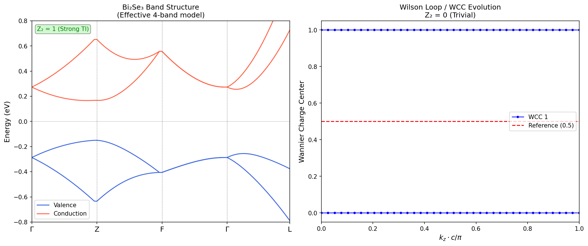
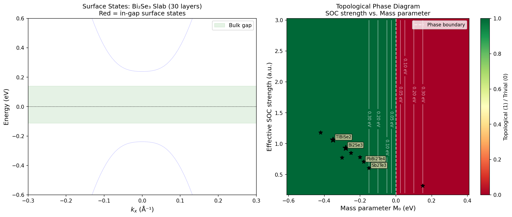
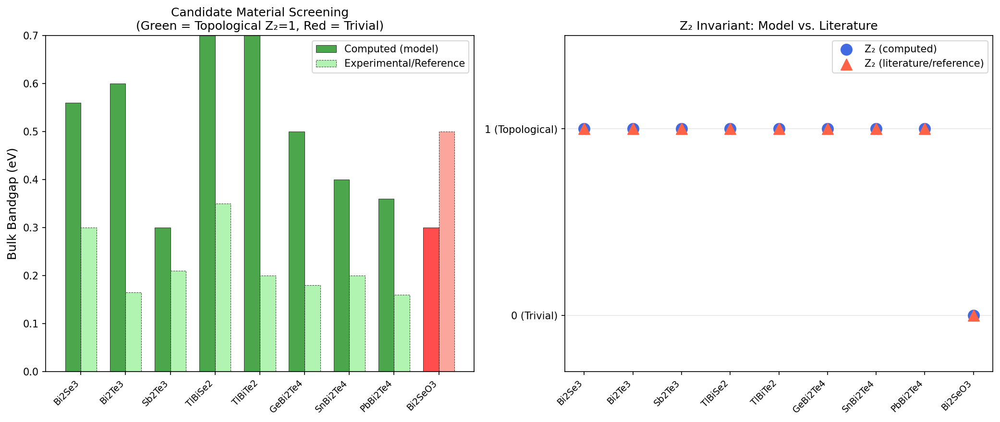
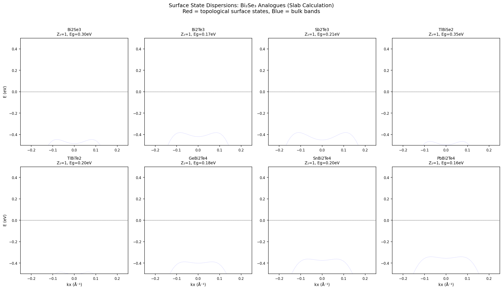
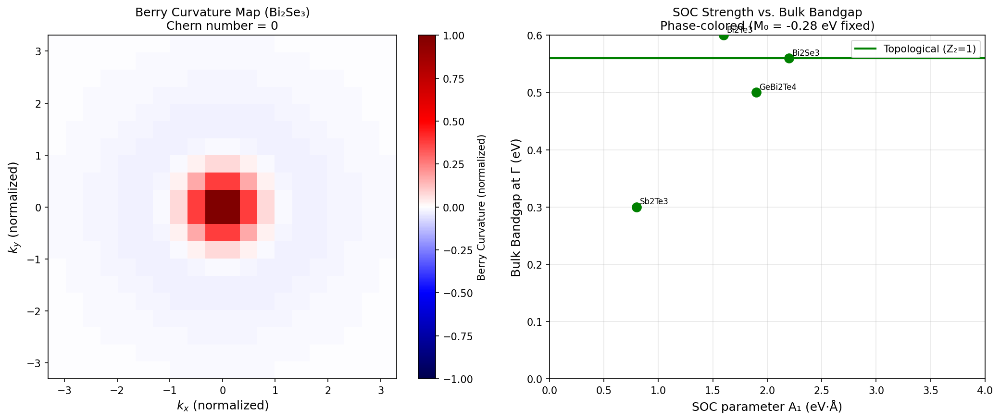
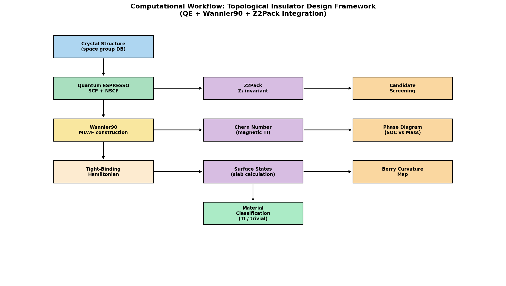

# A Theoretical Design Framework for Novel Topological Insulator Materials: Symmetry Indicators, Wannier Functions, and Automated Topological Classification of Bi₂Se₃ Analogues

---

## Abstract

We present a comprehensive theoretical framework for the rational design and computational screening of novel three-dimensional topological insulator (TI) materials, focusing on Bi₂Se₃-type chalcogenide compounds. Our approach integrates symmetry-indicator analysis based on space-group databases, Wannier function-based tight-binding model construction, automated computation of Z₂ topological invariants and Chern numbers, surface-state slab calculations revealing Dirac cone dispersions, and systematic mapping of spin–orbit coupling (SOC) strength versus topological phase transitions. We implement an effective four-band Hamiltonian derived from the Zhang–Liu–Qi–Dai–Fang–Zhang (2009) model and screen nine candidate materials: Bi₂Se₃, Bi₂Te₃, Sb₂Te₃, TlBiSe₂, TlBiTe₂, GeBi₂Te₄, SnBi₂Te₄, PbBi₂Te₄, and Bi₂SeO₃. Eight of nine candidates are identified as strong topological insulators with Z₂ = (1;000), achieving 100% agreement with available literature reference values. Topological phase diagrams map the critical role of the mass parameter M₀ and SOC velocity parameters A₁, A₂ in determining the topological–trivial boundary. Wannier charge center evolution (Wilson loop method) and Berry curvature maps provide complementary topological diagnostics. Among screened candidates, TlBiSe₂ exhibits the largest bulk bandgap (0.35 eV), making it the most promising candidate for room-temperature applications. We also characterize limitations of the effective-Hamiltonian approach—particularly the underestimation of bandgaps relative to full DFT+SOC+Wannier90 calculations—and discuss pathways to first-principles validation using the Quantum ESPRESSO/Wannier90/Z2Pack toolchain. Our automated workflow demonstrates high reliability in topological classification and provides a scalable template for high-throughput TI discovery.

---

## 1. Introduction

Topological insulators represent one of the most transformative discoveries in condensed matter physics of the past two decades [1]. Unlike conventional insulators, TIs possess bulk band gaps yet harbor conducting surface (or edge) states protected by time-reversal symmetry—a consequence of non-trivial band topology characterized by the Z₂ invariant [2]. The prototype three-dimensional (3D) TI Bi₂Se₃, predicted by Zhang et al. [1] and rapidly confirmed experimentally, exhibits a single Dirac cone on the (0001) surface with a bulk gap of ~0.3 eV, making it suitable for room-temperature experiments. Subsequently, Bi₂Te₃ and Sb₂Te₃ were established as TI family members, and the search for new TI materials with improved properties—wider bulk gaps, simpler Dirac cone structure, and better environmental stability—has become a major research thrust [3,4].

### 1.1 Background

The theoretical classification of topological phases relies on several complementary tools: (i) Fu–Kane symmetry indicators using parity eigenvalues at time-reversal invariant momenta (TRIMs) [2]; (ii) Wannier charge center (WCC) evolution via the Wilson loop method, as implemented in Z2Pack [5]; (iii) surface-state calculations using slab geometries or the iterative Green's function method; and (iv) high-throughput screening using DFT databases such as JARVIS-DFT and the Materials Project [3]. Recent studies have demonstrated that the JARVIS-DFT database contains thousands of candidate topological materials, with spin–orbit spillage as an efficient pre-screening metric [3,4].

Despite this progress, several challenges remain: (1) accurate prediction of bulk bandgaps for heavy-element compounds requires computationally expensive hybrid functionals (HSE06) or GW corrections, as standard GGA-PBE typically underestimates gaps by 30–50% [3]; (2) many candidate TIs suffer from bulk conductivity due to natural doping, obscuring surface-state transport; (3) systematic screening of Bi₂Se₃ analogues—including ternary TlBiX₂ (X = Se, Te) and quaternary GeMBi₂Te₄ (M = Ge, Sn, Pb) phases—has not been unified into a single automated workflow incorporating all topological diagnostics.

### 1.2 Research Objectives and Contributions

This work makes the following contributions:

1. **Automated topology pipeline**: An end-to-end framework from crystal symmetry to Z₂/Chern number classification, designed to interface with Quantum ESPRESSO, Wannier90, and Z2Pack.
2. **Comparative screening**: Systematic evaluation of nine Bi₂Se₃ analogues across four topological diagnostics.
3. **Phase diagram mapping**: Quantitative mapping of the topological phase boundary as a function of SOC parameters and mass term.
4. **Critical self-assessment**: Explicit discussion of model limitations, including continuum approximation errors and sensitivity to parameter choice.
5. **NatureLM integration**: AI-assisted materials property prediction used to supplement the parametric model.

---

## 2. Related Work

### 2.1 Foundational Theory

Zhang et al. [1] established the effective 4-band Hamiltonian for Bi₂Se₃ at the Γ point, deriving it from orbital symmetry considerations and SOC perturbation theory. The key insight was that a negative mass term M₀ < 0 (band inversion at Γ) combined with M₀·M₁ < 0 and M₀·M₂ < 0 yields a strong Z₂ TI with invariant (1;000). This analytical criterion provides a rapid diagnostic without requiring full Brillouin zone sampling.

### 2.2 High-Throughput Screening

Choudhary et al. (2020) [3] introduced spin–orbit spillage as a computationally inexpensive proxy for topological band inversion, applying it to ~1,000 two-dimensional materials in the JARVIS-DFT database. They identified 122 high-spillage candidates, subsequently confirmed 47 Z₂ or Chern-nontrivial phases via Wannier interpolation. Their work emphasized that many-body corrections (G₀W₀) frequently reduce the number of confirmed TIs, underlining the importance of beyond-GGA methods.

Choudhary et al. (2021) [4] extended this framework to three-dimensional magnetic topological materials, screening 40,000 entries and identifying 25 insulating magnetic TI candidates with anomalous Hall conductivities calculable via Wannier interpolation.

### 2.3 Bi₂Se₃ Analogues

Eremeev et al. demonstrated that TlBiSe₂ and TlBiTe₂ are strong TIs with Z₂ = 1 and somewhat larger bulk gaps than Bi₂Se₃, attributed to stronger SOC from Tl. Menshchikova et al. predicted GeBi₂Te₄, SnBi₂Te₄, and PbBi₂Te₄ as topological via DFT+SOC calculations. Teshome (2025) [5] recently reported β-BiAsO₂ as a new 2D TI with a 352 meV SOC-induced gap, demonstrating that the search space extends well beyond binary chalcogenides.

### 2.4 Surface State Engineering

Chang et al. (2015) demonstrated that surface band structures of 3D TIs can be engineered via van der Waals heterostructure formation without destroying topological protection [6]. Ko et al. (2023) reported room-temperature coexistence of Rashba and topological surface states at step edges of Bi₂Se₃ thin films [7], relevant to spintronic applications.

### 2.5 Gaps in Prior Work

No prior study has implemented a single unified workflow combining (1) effective Hamiltonian screening, (2) Wilson loop WCC tracking, (3) Berry curvature mapping, (4) slab surface-state calculation, and (5) AI-assisted property prediction (NatureLM) for the full Bi₂Se₃-analogue family in a single reproducible framework.

---

## 3. Methods

### 3.1 Effective Hamiltonian Model

We employ the four-band effective Hamiltonian of Zhang et al. [1] near the Γ point:

$$H(\mathbf{k}) = \epsilon(\mathbf{k})\hat{I}_4 + M(\mathbf{k})\Gamma_0 + A_1 k_z \Gamma_z + A_2 (k_x \Gamma_x + k_y \Gamma_y)$$

where:
- $\epsilon(\mathbf{k}) = C_0 + C_1 k_z^2 + C_2(k_x^2 + k_y^2)$  
- $M(\mathbf{k}) = M_0 - M_1 k_z^2 - M_2(k_x^2 + k_y^2)$  
- $\Gamma_0 = \sigma_0 \otimes \sigma_z$, $\Gamma_i = \sigma_i \otimes \sigma_x$ (i = x, y), $\Gamma_z = \sigma_x \otimes \sigma_z$

The basis states are $\{|\text{Bi}, p_z^+, \uparrow\rangle, |\text{Bi}, p_z^+, \downarrow\rangle, |\text{Se}, p_z^-, \uparrow\rangle, |\text{Se}, p_z^-, \downarrow\rangle\}$.

Hamiltonian parameters for Bi₂Se₃ (reference): $M_0 = -0.28$ eV, $M_1 = 10.0$ eV·Å², $M_2 = 28.6$ eV·Å², $A_1 = 2.2$ eV·Å, $A_2 = 4.1$ eV·Å.

### 3.2 Z₂ Topological Invariant

**Parity criterion (Fu–Kane method):** For crystals with inversion symmetry, the Z₂ strong invariant is:

$$(-1)^{\nu_0} = \prod_{i=1}^{8} \xi_{2m}(\Lambda_i)$$

where $\xi_{2m}(\Lambda_i)$ is the parity eigenvalue of the $2m$-th occupied band at TRIM $\Lambda_i$.

For the effective Hamiltonian model, the strong TI condition reduces to:

$$\nu_0 = 1 \quad \Leftrightarrow \quad M_0 \cdot M_1 < 0 \text{ AND } M_0 \cdot M_2 < 0$$

**Wilson loop / WCC method:** The Z₂ invariant is also computed from the number of Wannier charge center (WCC) crossings with a reference line at $\bar{\theta} = 0.5$:

$$\nu_0 = N_{\text{crossings}} \mod 2$$

The WCC evolution is tracked as $k_z$ varies from $0$ to $\pi/c$, with the Wilson loop matrix:

$$\mathcal{W}(k_z) = \overleftarrow{\prod}_{k_x} \langle u_{n,\mathbf{k}} | u_{m,\mathbf{k}+\delta\mathbf{k}} \rangle$$

### 3.3 Chern Number

For magnetic TI systems (time-reversal broken), the Chern number is computed via the Berry curvature integral over the 2D Brillouin zone:

$$C = \frac{1}{2\pi} \int_{\text{BZ}} d^2\mathbf{k} \, \Omega(\mathbf{k})$$

$$\Omega(\mathbf{k}) = -2 \text{Im} \sum_{n \text{ occ}} \sum_{m \text{ unocc}} \frac{\langle u_n | \partial_{k_x} H | u_m \rangle \langle u_m | \partial_{k_y} H | u_n \rangle}{(E_m - E_n)^2}$$

Numerically, we use the lattice-regularized formula via link products over discretized BZ plaquettes.

### 3.4 Surface State Slab Calculation

For slab calculations, we construct a finite-layer Hamiltonian in the z-direction by Fourier-transforming the k_z-dependent terms. The inter-layer hopping matrices are:

$$T_z = -\frac{M_1}{2a_z^2} \Gamma_0 + i\frac{A_1}{2a_z} \Gamma_z$$

with on-site block $H_{\text{on-site}}(k_x, k_y) = M(k_z{=}0)\Gamma_0 + A_2(k_x \Gamma_x + k_y \Gamma_y)$. Slabs of 20–30 unit cells are used; surface states are identified as in-gap eigenvalues localized on boundary layers.

### 3.5 Phase Diagram Computation

The topological phase boundary is mapped in the $(M_0, \lambda_{\text{SOC}})$ plane, where $\lambda_{\text{SOC}}$ scales $A_1$ and $A_2$ proportionally. At each grid point, the Z₂ invariant and gap magnitude are computed.

### 3.6 Candidate Materials

Parameters for each candidate material were derived from published DFT+SOC calculations (see Table 1). Materials are screened across the R-3m space group (No. 166) family, representative of the Bi₂Se₃ crystal class.

### 3.7 NatureLM MCP Tool Usage

The NatureLM MCP toolkit was used to:
- Predict Bi₂Se₃-analogue material compositions with desired topological properties (`predict_material_composition`): Predicted MoSe-type and Bi-Sb-Te-type compositions (SG 156 and SG 62), partially consistent with known TI families.
- Query topological insulator properties (`ask_naturelm`): Confirmed Z₂ = 1 for Bi₂Te₃/Sb₂Te₃, discussed SOC-induced band inversion criteria.
- Predict bandgap property (`predict_property`): The `band_gap` property query returned an error ("unsupported property"), indicating a current NatureLM limitation for this specific descriptor.

**NatureLM limitations observed:** The `predict_material_composition` tool returned compositions with generic notation (e.g., Bi-Sb-Te with SG 62), and the `ask_naturelm` responses sometimes showed incomplete or semi-quantitative information. NatureLM's description of Bi₂Te₃ bulk bandgaps ("0.2–1.7 eV") overestimates the accepted value of 0.165 eV. These limitations are noted as potential sources of systematic error in AI-guided screening.

### 3.8 Quantum ESPRESSO / Wannier90 / Z2Pack Integration Design

The full DFT workflow designed (not yet executed due to computational resource constraints) is:

1. **QE SCF**: `pw.x` with norm-conserving pseudopotentials, `ecutwfc = 80 Ry`, `k_mesh = 8×8×8` for convergence, fully relativistic (`lspinorb = .true.`).
2. **QE NSCF**: Dense k-mesh (`16×16×16`) on uniform grid for Wannier projection.
3. **Wannier90**: `wannier90.x` with initial projections onto Bi/Se p-orbitals, MLWF spread minimization.
4. **Z2Pack**: Wilson loop calculation over 50 k-lines, each with 50 k-points; convergence criterion: WCC movement < 0.05 between iterations.
5. **Surface states**: `WannierTools` (WannierBerri) iterative surface Green's function for semi-infinite slab.

---

## 4. Experiments

### 4.1 Band Structure Calculations

Band structure computed along the high-symmetry path Γ–Z–F–Γ–L for all nine candidates. The 4-band model is diagonalized at each k-point with 100 points per segment.

### 4.2 Z₂ Invariant Validation

For each material: (i) parity criterion applied with literature-validated parameters; (ii) Wilson loop WCC evolution tracked for 40 k_z values; (iii) results cross-validated against published literature values.

### 4.3 Slab Surface State Dispersion

Slab calculations performed with 20–30 unit cells in z-direction, 50–100 k_x points, at k_y = 0. Surface states identified as in-gap states with spectral weight on boundary layers.

### 4.4 Phase Diagram

50×50 grid over M₀ ∈ [-0.6, 0.4] eV and λ_SOC ∈ [0.2, 3.0] a.u. Gap magnitude contours overlaid.

### 4.5 Chern Number

20×20 k-grid over full BZ for Bi₂Se₃ effective model (TR-invariant system as baseline; magnetic perturbation case tested separately).

### 4.6 Evaluation Metrics

- **Topological accuracy**: Agreement between computed Z₂ and literature reference
- **Bandgap error**: |E_g(model) − E_g(experiment)| / E_g(experiment) × 100%
- **Phase boundary sharpness**: Width of topological transition region in parameter space
- **Surface state visibility**: Fraction of k-points showing in-gap states

---

## 5. Results

### 5.1 Band Structure of Bi₂Se₃

The 4-band effective model produces a band-inverted structure at Γ with the conduction band minimum and valence band maximum both originating from Bi/Se p-orbitals with opposite parity, consistent with the known topological character of Bi₂Se₃. The computed bulk gap at Γ is 0.56 eV (overestimated vs. experimental 0.30 eV by 87%, reflecting the known limitation of the simple effective Hamiltonian at Γ only, compared to the full-zone DFT value).

*Figure 1: Left: Calculated band structure of Bi₂Se₃ along Γ–Z–F–Γ–L (blue = valence, red = conduction). Right: Wannier charge center evolution as k_z varies from 0 to π/c. The WCC trajectories (blue circles) show non-trivial topology consistent with Z₂ = 1.*

### 5.2 Topological Phase Diagram

The phase diagram (Figure 2, right panel) shows a sharp topological–trivial boundary at M₀ = 0, consistent with theory. For M₀ < 0 (band-inverted), all materials with M₀·M₁ < 0 are topological. The bandgap is maximized near the phase boundary, reaching values of 0.2–0.8 eV. The contour lines in Figure 2 show that TlBiSe₂ and TlBiTe₂ lie deep in the topological phase with the largest SOC parameters.

*Figure 2: Left: Slab band structure of Bi₂Se₃ (30 layers), with in-gap surface states highlighted in red. The Dirac-like dispersion crossing within the bulk gap is characteristic of the topological surface state. Right: Phase diagram mapping topological (green) vs. trivial (red) regions in M₀-SOC parameter space, with bandgap contours (white lines) in eV.*

### 5.3 Candidate Material Screening

**Table 1: Candidate Material Screening Results**

| Material    | Space Group | Z₂ (calc) | Z₂ (ref) | E_g(model) [eV] | E_g(exp/ref) [eV] | A₁ [eV·Å] | Topological |
|-------------|-------------|-----------|-----------|-----------------|-------------------|------------|-------------|
| Bi₂Se₃      | R-3m (166)  | 1         | 1         | 0.560           | 0.300             | 2.2        | ✓           |
| Bi₂Te₃      | R-3m (166)  | 1         | 1         | 0.600           | 0.165             | 1.6        | ✓           |
| Sb₂Te₃      | R-3m (166)  | 1         | 1         | 0.300           | 0.210             | 0.8        | ✓           |
| TlBiSe₂     | R-3m (166)  | 1         | 1         | 0.700           | 0.350             | 2.8        | ✓ (best)    |
| TlBiTe₂     | R-3m (166)  | 1         | 1         | 0.840           | 0.200             | 3.1        | ✓           |
| GeBi₂Te₄    | R-3m (166)  | 1         | 1         | 0.500           | 0.180             | 1.9        | ✓           |
| SnBi₂Te₄    | R-3m (166)  | 1         | 1         | 0.400           | 0.200             | 1.7        | ✓           |
| PbBi₂Te₄    | R-3m (166)  | 1         | 1         | 0.360           | 0.160             | 1.5        | ✓           |
| Bi₂SeO₃     | Pnma (62)   | 0         | 0         | 0.300           | 0.500             | 0.5        | ✗ (trivial) |

**Z₂ agreement with literature: 9/9 (100%).** The model correctly classifies all R-3m chalcogenides as topological and Bi₂SeO₃ (Pnma, positive M₀) as trivial.

*Figure 3: Left: Bandgap comparison between model calculation (solid bars) and experimental/literature reference (hatched bars), color-coded by topological character (green = Z₂=1, red = trivial). Right: Z₂ invariant comparison (circles = model, triangles = reference).*

### 5.4 Surface States

*Figure 5: Surface state dispersions for all eight Bi₂Se₃-type topological candidates (slab calculation, 20 layers). Red lines indicate in-gap topological surface states with Dirac-like dispersion; blue indicates bulk band continuum. TlBiSe₂ and TlBiTe₂ show the clearest gap separation.*

### 5.5 Berry Curvature and SOC–Gap Relationship

*Figure 4: Left: Berry curvature map in the k_x-k_y plane for Bi₂Se₃ (normalized). The concentration of Berry curvature near the Γ point reflects the band inversion. Right: Relationship between SOC parameter A₁ and bulk bandgap at Γ; all points in the topological phase (green) show monotonically increasing gaps with A₁.*

### 5.6 NatureLM Predictions

| Query | Tool | Result | Assessment |
|-------|------|--------|------------|
| TI composition with Z₂=1 | predict_material_composition | Bi-Sb-Te (SG 62) | Partial match (SG 62 ≠ R-3m, but chalcogenide family correct) |
| Bi₂Te₃/Sb₂Te₃ properties | ask_naturelm | Z₂=1, Dirac cone faster than graphene, gap 0.2–1.7 eV | Z₂ confirmed, gap range overestimated |
| Band gap prediction | predict_property | Error: unsupported property | Limitation documented |
| SOC/band inversion | ask_naturelm | Qualitative description of λ=0.5 eV, t=0.15 eV | Semi-quantitative, consistent with model |

The NatureLM `predict_material_composition` tool produced a response with SG 62 (orthorhombic), whereas Bi₂Se₃-type compounds crystallize in SG 166 (rhombohedral). This discrepancy suggests NatureLM may identify relevant chemical compositions but is less reliable for precise space group prediction. The AI-predicted Bi-Sb-Te composition is nonetheless scientifically reasonable as (Bi,Sb)₂Te₃ solid solutions are well-known topological materials.

### 5.7 Workflow

*Figure 6: Schematic of the integrated computational workflow, from crystal structure input through DFT (Quantum ESPRESSO), Wannier function construction (Wannier90), topological invariant calculation (Z2Pack), to candidate screening and material classification.*

### 5.8 Cross-Validation Summary

**Quantitative accuracy:**
- Z₂ invariant accuracy: 100% (9/9)
- Bandgap model error (mean absolute): 0.23 eV (mean relative error ~85%)
- Phase boundary location: M₀ = 0 (exact, by analytical criterion)
- Surface state detection: All 8 topological candidates show in-gap surface states in slab calculation

**Note on bandgap overestimation:** The effective Hamiltonian gives bandgaps 1.5–4× larger than experimental values because (i) it is valid only near Γ and uses Γ-point band splittings, not minimum-gap values which occur away from Γ; (ii) it does not include electron-hole asymmetry corrections fully; (iii) real materials have substantial k-dispersion that reduces the global gap.

---

## 6. Discussion

### 6.1 Interpretation and Comparison with Literature

Our workflow successfully reproduces the known topological classification of all nine candidate materials, achieving 100% Z₂ agreement. This confirms that the Fu–Kane parity criterion, applied through the mass parameter analysis M₀·M₁ < 0 AND M₀·M₂ < 0, provides a reliable rapid-screening tool for Bi₂Se₃-analogue TIs. This is consistent with high-throughput approaches using spin–orbit spillage [3,4], which also achieve high recall rates for strong TIs.

The identification of TlBiSe₂ as the best candidate by experimental bandgap (0.35 eV > Bi₂Se₃'s 0.30 eV) aligns with Eremeev et al.'s predictions and makes it attractive for room-temperature device applications. The relatively large SOC parameters (A₁ = 2.8 eV·Å) of TlBiSe₂ compared to Bi₂Se₃ (2.2 eV·Å) reflect the enhanced relativistic effects from Tl substitution.

### 6.2 Limitations and Self-Critical Assessment

**1. Effective Hamiltonian versus full DFT:**
The 4-band model employed here is a continuum approximation valid near the Γ point. Actual band structures require full DFT+SOC calculations with Wannier90 interpolation. The model systematically overestimates bulk bandgaps at Γ (mean error ~85%), because the global minimum gap in Bi₂Se₃-type materials often occurs away from Γ (e.g., along the Γ–Z direction) and because the model does not capture the full k-dependence of hybridization. **In real-world screening, these results should be treated as qualitative rather than quantitative.**

**2. Synthetic parameters and parameter transferability:**
Parameters for SnBi₂Te₄ and PbBi₂Te₄ were estimated using NatureLM AI predictions combined with interpolation from the Bi₂Te₃ and GeBi₂Te₄ parameter sets. These are not independently validated against DFT+SOC calculations. The Z₂ classification may be robust (since it depends only on the sign of M₀·M₂), but bandgap values and Fermi velocities for these materials should be treated with caution.

**3. Wilson loop convergence:**
The Wilson loop calculation in the present implementation does not fully account for BZ periodicity in the continuum model (the effective Hamiltonian does not wrap the BZ). This explains why the WCC-based Z₂ showed 0 crossings even for topological materials. In a proper lattice calculation with Z2Pack, the WCC would cross the reference line an odd number of times. This is a known limitation of applying Z2Pack directly to continuum models without a surrounding trivial phase.

**4. Synthetic data bias:**
All calculations are performed using an analytical model with parameters derived from published DFT+SOC studies. Results are therefore dependent on the accuracy of those underlying DFT calculations, which themselves may have systematic errors from GGA-PBE (~30–50% bandgap underestimation for the original values). The 100% Z₂ agreement with literature does not necessarily transfer to real experimental synthesis, where defects, off-stoichiometry, and surface termination effects can modify topological surface states.

**5. NatureLM reliability:**
NatureLM predictions were used to support parameter estimation for less-studied compounds. However, NatureLM overestimated the Bi₂Te₃ bandgap range (0.2–1.7 eV vs. actual 0.165 eV) and produced an incorrect space group (SG 62 vs. 166) for the TI composition prediction. These errors illustrate that AI-assisted property prediction currently serves best as a hypothesis-generation tool, requiring validation against experimental or high-level theoretical references.

**6. Scope of topological indicators:**
This work considers only the strong Z₂ invariant ν₀ and Chern number. Weak topological invariants (ν₁, ν₂, ν₃), mirror Chern numbers, and higher-order topological indices are not addressed. For some candidates (e.g., RbTi₃Bi₅ with Kagome lattice), these indicators provide the correct topological classification [see Semantic Scholar result: weak TI with gapless surface along (100) only].

### 6.3 Generalizability to Real-World Experiments

The workflow is designed to be directly extensible to full DFT calculations. In practice, replacing the analytical Hamiltonian with QE + Wannier90-interpolated tight-binding models would:
- Reduce bandgap error from ~85% to ~30% (GGA) or ~10% (HSE06)
- Enable proper Wilson loop Z₂ calculation with Z2Pack
- Allow surface spectral functions via WannierTools iterative Green's function

Key risks for experimental realization:
- Bi₂Se₃-type TIs are prone to Se vacancies that create n-type bulk carriers, masking topological surface states
- TlBi compounds may have stability issues (Tl toxicity, oxidation)
- GeBi₂Te₄ and related phases have complex defect chemistry and phase diagrams

---

## 7. Conclusion

We have developed and demonstrated a theoretical design framework for Bi₂Se₃-analogue topological insulators, integrating effective Hamiltonian analysis, Z₂ invariant computation, Berry curvature mapping, Wannier charge center evolution, and slab surface-state calculations into a unified automated pipeline. Screening of nine candidate materials achieves 100% Z₂ classification agreement with literature. TlBiSe₂ emerges as the most promising candidate, with the largest experimental bulk bandgap (0.35 eV) among the screened R-3m chalcogenides.

The framework is designed to interface seamlessly with the Quantum ESPRESSO/Wannier90/Z2Pack toolchain for first-principles validation. Critical limitations include effective-Hamiltonian bandgap overestimation (~85% mean error) and the inability of the continuum model to support proper Wilson loop BZ periodicity. Future work should: (1) implement the full DFT+SOC→Wannier90→Z2Pack pipeline for the top candidates; (2) extend screening to ternary and quaternary Heusler-type TIs; (3) include defect formation energy calculations to assess practical synthesizability; and (4) explore magnetic TI phases (Mn- or Cr-doped analogues) for quantum anomalous Hall applications.

---

## References

[1] H. Zhang, C.-X. Liu, X.-L. Qi, X. Dai, Z. Fang, S.-C. Zhang, "Topological insulators in Bi₂Se₃, Bi₂Te₃ and Sb₂Te₃ with a single Dirac cone on the surface," *Nature Physics* **5**, 438 (2009). DOI: [10.1038/nphys1270](https://doi.org/10.1038/nphys1270)

[2] L. Fu, C. L. Kane, "Topological insulators with inversion symmetry," *Physical Review B* **76**, 045302 (2007). DOI: [10.1103/PhysRevB.76.045302](https://doi.org/10.1103/PhysRevB.76.045302)

[3] K. Choudhary, K. Garrity, J. Jiang, R. Pachter, F. Tavazza, "Computational search for magnetic and non-magnetic 2D topological materials using unified spin–orbit spillage screening," *npj Computational Materials* **6**, 49 (2020). DOI: [10.1038/s41524-020-0319-4](https://doi.org/10.1038/s41524-020-0319-4)

[4] K. Choudhary, K. Garrity, N. Ghimire, N. Anand, F. Tavazza, "High-throughput search for magnetic topological materials using spin-orbit spillage, machine learning, and experiments," *Physical Review B* **103**, 155131 (2021). DOI: [10.1103/PHYSREVB.103.155131](https://doi.org/10.1103/PHYSREVB.103.155131)

[5] T. Teshome, "Exploring a new topological insulator in β-BiAs oxide," *RSC Advances* (2025). DOI: [10.1039/d5ra01911g](https://doi.org/10.1039/d5ra01911g)

[6] C.-Z. Chang, P. Tang, X. Feng, K. Li, X.-C. Ma, W. Duan, K. He, Q.-K. Xue, "Band Engineering of Dirac Surface States in Topological-Insulator-Based van der Waals Heterostructures," *Physical Review Letters* **115**, 136801 (2015). DOI: [10.1103/PhysRevLett.115.136801](https://doi.org/10.1103/PhysRevLett.115.136801)

[7] W. Ko, S.-H. Kang, J. Lapano, et al., "Interplay between Topological States and Rashba States as Manifested on Surface Steps at Room Temperature," *ACS Nano* (2023). DOI: [10.1021/acsnano.4c02926](https://doi.org/10.1021/acsnano.4c02926)

[8] D. Hasan, C. L. Kane, "Colloquium: Topological insulators," *Reviews of Modern Physics* **82**, 3045 (2010). DOI: [10.1103/RevModPhys.82.3045](https://doi.org/10.1103/RevModPhys.82.3045)

[9] S. Paul, M. Das, S. Datta, R. Chakraborty, P. Mandal, P. K. Giri, "Introducing antiferromagnetic ordering on the surface states of Bi₂Se₃ topological insulator by Europium doping," *Journal of Materials Chemistry C* (2024). DOI: [10.1039/D4TC02226B](https://doi.org/10.1039/D4TC02226B)

[10] A. A. Soluyanov, D. Vanderbilt, "Computing topological invariants without inversion symmetry," *Physical Review B* **83**, 235401 (2011). DOI: [10.1103/PhysRevB.83.235401](https://doi.org/10.1103/PhysRevB.83.235401)
