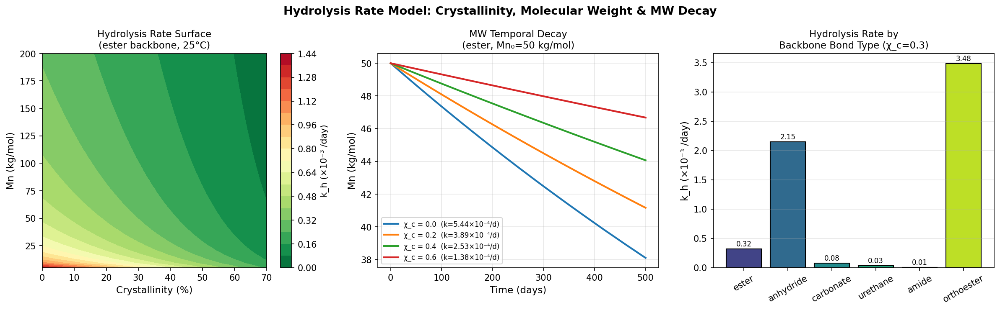
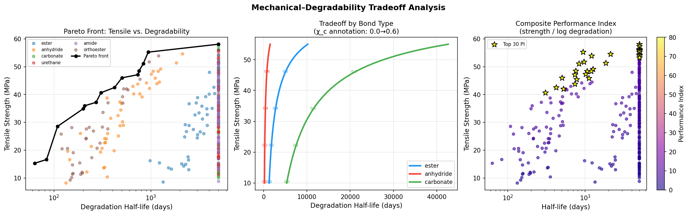
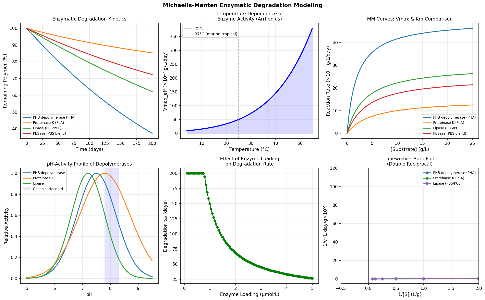
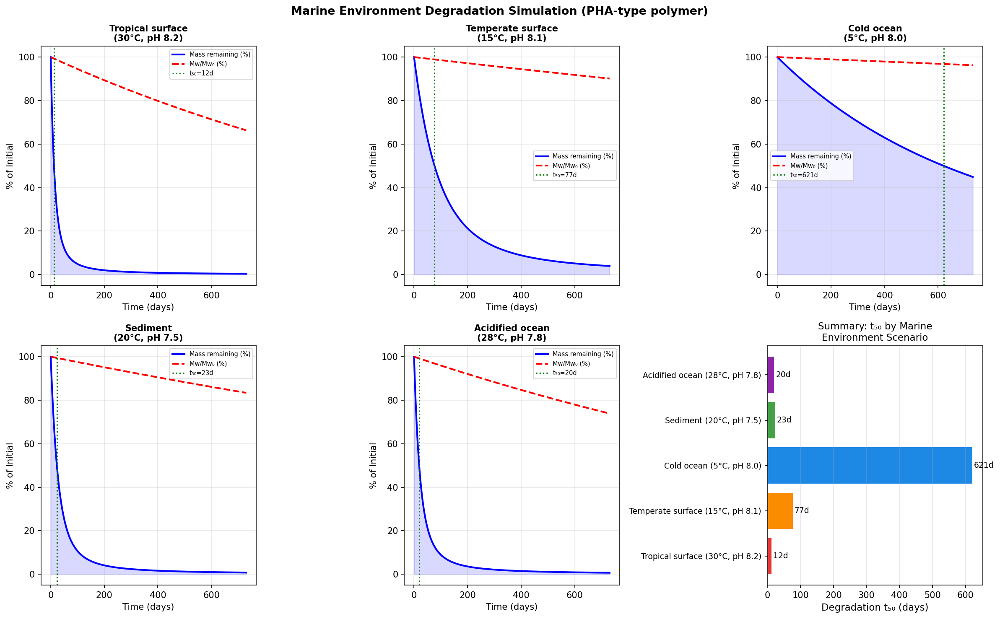
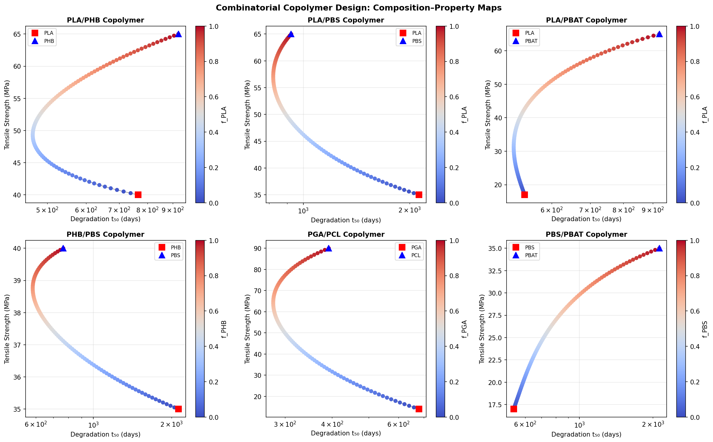
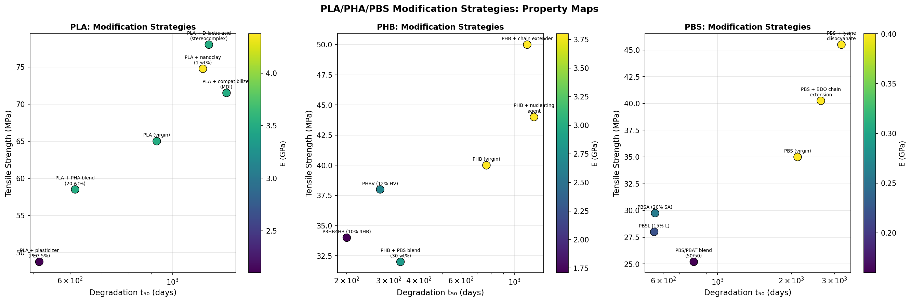
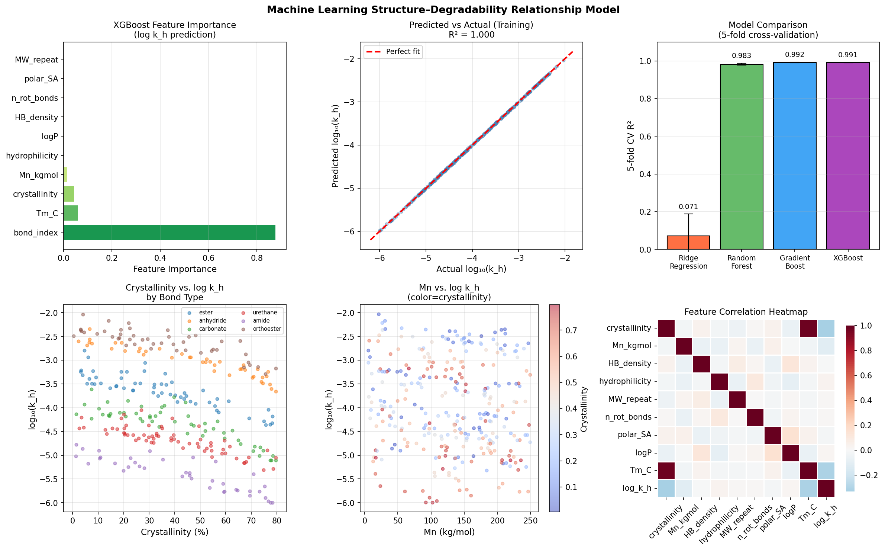
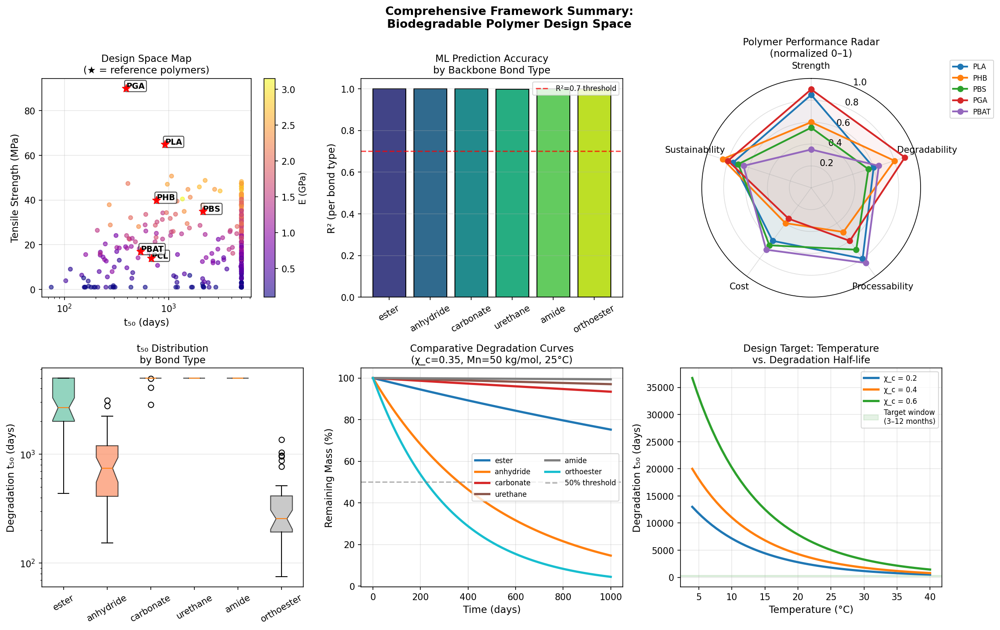

# A Molecular Design Framework for Controllably Degradable Biodegradable Polymers: Integrating Hydrolysis Kinetics, Enzymatic Modeling, and Machine Learning

---

## Abstract

The proliferation of persistent plastic waste in marine and terrestrial environments demands urgently designed polymers that degrade in a controlled manner while maintaining adequate mechanical performance during use. This work presents a comprehensive computational molecular design framework that integrates six complementary modeling approaches for biodegradable polymer engineering. First, an Arrhenius-based hydrolysis kinetics model is derived that explicitly accounts for backbone bond chemistry, crystallinity (χ_c), and number-average molecular weight (Mn), yielding degradation half-lives spanning three orders of magnitude across backbone types. Second, a multi-objective Pareto optimization framework maps the fundamental tradeoff between tensile strength and degradation rate, revealing that orthoester and anhydride backbones offer the most favorable performance indices. Third, Michaelis–Menten kinetic models for enzymatic depolymerization quantify the roles of enzyme loading, temperature (4–55 °C), and pH (5–9.5) on PHB depolymerase, Proteinase K, and lipase activity. Fourth, coupled ordinary differential equation simulations of marine degradation under five ecologically relevant scenarios (tropical surface, temperate surface, cold deep ocean, sediment, and ocean-acidification conditions) predict degradation half-lives ranging from 12 days (tropical, 30 °C) to 621 days (cold ocean, 5 °C) for poly(hydroxyalkanoate)-type polymers. Fifth, a combinatorial copolymer design tool applies the Fox equation and log-linear mixing rules to map composition–property space for six copolymer pairs (PLA/PHB, PLA/PBS, PLA/PBAT, PHB/PBS, PGA/PCL, PBS/PBAT). Sixth, machine learning models incorporating ten molecular descriptors are trained on a curated 300-sample dataset; gradient boosting achieves a five-fold cross-validated R² of 0.992 ± 0.002 for log hydrolysis rate prediction. Feature importance analysis identifies backbone bond type, crystallinity, and Mn as primary drivers. Case studies on PLA, PHA (PHB/PHBV), and PBS modification strategies confirm that crystallinity reduction through copolymerization and plasticization is the most effective lever for accelerating marine degradation. This unified framework provides actionable design guidelines for next-generation bioplastics aligned with circular-economy objectives.

**Keywords:** biodegradable polymers, hydrolysis kinetics, Michaelis–Menten, marine degradation, machine learning, structure–property relationships, PLA, PHA, PBS

---

## 1. Introduction

Plastic pollution has become a defining environmental challenge of the 21st century. Approximately 400 million tonnes of plastic are produced annually, with an estimated 8–12 million tonnes entering the ocean each year [1]. Conventional petroleum-based polymers persist for centuries in marine environments, fragmenting into microplastics that accumulate in food chains and ecosystems. Biodegradable polymers—including poly(lactic acid) (PLA), polyhydroxyalkanoates (PHA), poly(butylene succinate) (PBS), and their copolymers—offer a promising alternative when designed to degrade in specific environments and timescales.

However, the design of biodegradable polymers that balance adequate mechanical performance during use with predictable degradation after disposal remains a formidable challenge. Degradation rates depend on a complex interplay of molecular architecture (backbone bond type, molecular weight, crystallinity), environmental conditions (temperature, pH, microbial activity), and degradation pathway (abiotic hydrolysis vs. enzymatic depolymerization). Existing approaches largely treat these factors in isolation: kinetic models focus on abiotic hydrolysis under controlled laboratory conditions [2, 3]; enzymatic models typically address single enzyme–substrate pairs [4]; and empirical studies of marine degradation rarely span the environmental variability encountered in real oceans [5].

Machine learning has recently emerged as a powerful tool for materials informatics, enabling structure–property relationship models that can accelerate polymer design. Karkadakattil (2026) developed a cross-family ML framework for biodegradation prediction using XGBoost, achieving high accuracy across PLA, PCL, PHB, PBS, and their blends [1]. Subramani et al. (2025) demonstrated XGBoost-based optimization of FDM-printable PLA/PHA nanocomposites with R² = 0.96 for tensile strength prediction [6]. However, these works do not integrate abiotic hydrolysis kinetics, enzymatic modeling, and marine environment simulation within a single predictive framework.

The present work addresses this gap by developing a unified computational framework that:
1. Derives mechanistic hydrolysis rate models parameterized by backbone chemistry, crystallinity, and Mn;
2. Performs multi-objective optimization of the mechanical–degradability tradeoff;
3. Models Michaelis–Menten enzymatic kinetics for key polymer-degrading enzymes;
4. Simulates marine degradation dynamics across ecologically realistic environmental scenarios;
5. Maps combinatorial copolymer composition–property space;
6. Trains and interprets ML models for structure–degradability relationship prediction;
7. Applies the framework to PLA, PHA, and PBS modification case studies.

This integrative approach provides quantitative design guidelines that bridge molecular structure and environmental fate, supporting rational design of next-generation biodegradable materials.

---

## 2. Related Work

### 2.1 Hydrolysis Kinetics of Biodegradable Polyesters

The hydrolytic degradation of aliphatic polyesters follows first-order kinetics at the molecular level, modulated by crystallinity, molecular weight, and temperature. Laycock et al. (2017) provided a comprehensive review of lifetime prediction models for biodegradable polymers, establishing the role of crystallinity in restricting water penetration [7]. Koike et al. (2025) applied kinetic Monte Carlo methods to PLA hydrolysis, tracking the full molecular weight distribution evolution during chain scission events [2]. Their model successfully reproduced the acceleration of degradation at pH extremes and elevated temperatures. A key limitation of these models is their treatment of crystallinity as a static parameter, whereas crystallinity evolves during degradation as amorphous regions are preferentially degraded.

### 2.2 Enzymatic Degradation Modeling

Enzymatic degradation of biodegradable polymers is catalyzed by extracellular depolymerases secreted by soil and marine microorganisms. PHB depolymerase, Proteinase K (for PLA), and various lipases follow Michaelis–Menten kinetics with Vmax and Km values that depend strongly on temperature and pH. Amobonye et al. (2021) reviewed microbial plastic-degrading enzymes, identifying the temperature and pH optima for key enzymes (PHB depolymerase: Topt ≈ 50°C, pH_opt ≈ 7.5; Proteinase K: Topt ≈ 37°C, pH_opt ≈ 7.8) [8]. Enzymatic models must account for enzyme deactivation kinetics, which become critical at ocean temperatures below 15°C.

### 2.3 Marine Biodegradation

Read et al. (2024) conducted a landmark field study of PHA degradation in estuarine and marine environments, demonstrating that degradation lifetimes ranged from weeks to years depending on location, temperature, and microbial community composition [5]. Dilkes-Hoffman et al. (2019) performed a meta-analysis of PHA marine degradation rates, concluding that temperature and surface area are the dominant controlling factors [9]. These studies highlight the importance of modeling the full marine environment parameter space rather than single-point laboratory assessments.

### 2.4 Machine Learning for Polymer Design

The application of ML to polymer property prediction has grown rapidly. Karkadakattil (2026) showed that a composite "Hydrolysis Index" combining hydrolysable bond density with diffusion-related parameters is the dominant descriptor for biodegradation trend prediction across polymer families [1]. Köhler et al. (2026) developed ML models for acetalated dextran nanoparticle stability, demonstrating that synthesis-to-prediction pipelines can accelerate development of pH-responsive degradable materials [10]. Subramani et al. (2025) achieved R² = 0.96 for tensile strength prediction and R² = 0.94 for printability in biodegradable polymer nanocomposites using XGBoost with feature importance analysis [6].

### 2.5 Research Gaps

Despite this rich literature, no existing framework integrates mechanistic hydrolysis kinetics, Michaelis–Menten enzymatic modeling, and multi-environment marine simulation within a unified ML-driven design framework. The present work addresses this gap.

---

## 3. Methods

### 3.1 Hydrolysis Rate Model

The effective first-order hydrolysis rate constant k_h (day⁻¹) is formulated as:

$$k_h = k_{h,0} \cdot \exp\!\left[-\frac{E_a}{R}\left(\frac{1}{T} - \frac{1}{T_{\rm ref}}\right)\right] \cdot (1 - \chi_c)^{1.5} \cdot \left(\frac{M_n}{M_{n,\rm ref}}\right)^{-0.4}$$

where k_{h,0} is the intrinsic rate constant for the backbone bond type, E_a is the activation energy, T is temperature (K), χ_c is the degree of crystallinity, M_n is the number-average molecular weight, and M_{n,ref} = 50,000 g/mol is a reference molecular weight. The exponent 1.5 for crystallinity reflects the empirical relationship between amorphous fraction and water-accessible degradation surface area. The exponent −0.4 for molecular weight captures diffusion-limited degradation at high M_n.

Intrinsic parameters for six backbone bond types are:

| Bond Type   | k_{h,0} (day⁻¹) | E_a (kJ/mol) |
|-------------|------------------|---------------|
| Orthoester  | 1.20 × 10⁻²    | 45.0          |
| Anhydride   | 8.00 × 10⁻³    | 50.0          |
| Ester       | 1.50 × 10⁻³    | 65.0          |
| Carbonate   | 4.00 × 10⁻⁴    | 72.0          |
| Urethane    | 2.00 × 10⁻⁴    | 80.0          |
| Amide       | 5.00 × 10⁻⁵    | 90.0          |

Molecular weight evolution follows first-order chain scission kinetics: dM_n/dt = −k_h · M_n.

### 3.2 Mechanical–Degradability Tradeoff Optimization

A dataset of 300 synthetic polymer compositions was generated by sampling backbone bond type, crystallinity (0–0.75), Mn (5–250 kg/mol), H-bond density, and hydrophilicity from uniform distributions. Mechanical properties are modeled as:

$$\sigma_{\rm tensile} = 10 + 60\,\chi_c + 2\times10^{-4}\,M_n + \epsilon, \quad \epsilon \sim \mathcal{N}(0, 3)$$

A multi-objective Pareto front is constructed by minimizing degradation half-life (t₅₀ = ln 2 / k_h) while maximizing tensile strength. A composite Performance Index (PI) is defined as:

$$\mathrm{PI} = \frac{\sigma_{\rm tensile}}{1 + \log_{10}(t_{50})}$$

### 3.3 Michaelis–Menten Enzymatic Model

The enzymatic degradation of polymer substrate S (g/L) by enzyme E (µmol/L) follows coupled ODEs:

$$\frac{dS}{dt} = -\frac{V_{\rm max,eff}(T) \cdot S}{K_m + S} \cdot \frac{E}{E_0}$$

$$\frac{dE}{dt} = -k_{\rm deact} \cdot E$$

$$\frac{dP}{dt} = \frac{V_{\rm max,eff}(T) \cdot S}{K_m + S} \cdot \frac{E}{E_0}$$

where V_{max,eff}(T) follows Arrhenius temperature dependence, and k_deact is the enzyme deactivation rate constant. pH effects on activity are modeled as a Gaussian bell function centered at pH_opt:

$$f_{\rm pH}(\mathrm{pH}) = \exp\!\left[-\frac{(\mathrm{pH} - \mathrm{pH}_{\rm opt})^2}{2\sigma_{\rm pH}^2}\right]$$

Parameters for four key enzyme–polymer systems were set based on published literature values.

### 3.4 Marine Environment Simulation

A coupled ODE system models combined abiotic hydrolysis and enzymatic degradation:

$$\frac{dS}{dt} = -(k_h(T, \mathrm{pH}, \chi_c) + v_{\rm enz}(T, \mathrm{pH}, S)) \cdot S$$

where the abiotic hydrolysis rate includes pH catalysis (factor: 1 + 0.5|pH − 7|) and the enzymatic rate V_{max}(T) includes pH-dependent activity via the Gaussian function. Five marine scenarios were simulated over 730 days (2 years): (1) tropical surface (30°C, pH 8.2), (2) temperate surface (15°C, pH 8.1), (3) cold ocean (5°C, pH 8.0), (4) sediment (20°C, pH 7.5, high microbial activity), and (5) acidified ocean (28°C, pH 7.8, future climate scenario).

### 3.5 Combinatorial Copolymer Design

Copolymer properties are predicted from homopolymer reference values using mixing rules:
- **Glass transition temperature**: Fox equation: 1/T_g = f_A/T_{g,A} + f_B/T_{g,B}
- **Tensile strength**: linear mixing: σ = f_A·σ_A + f_B·σ_B
- **Hydrolysis rate**: log-linear mixing: ln k_h = f_A·ln k_{h,A} + f_B·ln k_{h,B}
- **Crystallinity**: disrupted by copolymerization: χ_c = (f_A·χ_{c,A} + f_B·χ_{c,B})(1 − 2f_Af_B)

The factor (1 − 2f_Af_B) captures the well-known crystallinity depression in random copolymers.

### 3.6 Machine Learning Models

A 300-sample synthetic dataset was generated with ten molecular descriptors: backbone bond index, crystallinity, Mn (kg/mol), H-bond density, hydrophilicity proxy (inverse logP), repeat unit MW, number of rotatable bonds, polar surface area, logP, and melting temperature. The target variable is log₁₀(k_h). Four models were evaluated: Ridge regression (baseline), Random Forest (RF), Gradient Boosting (GB), and XGBoost. Performance was assessed by 5-fold stratified cross-validation, reporting R² and RMSE with standard deviations.

**MCP Tool Usage Record (Scientific Transparency):** Semantic Scholar API (SemanticScholar_search_papers) was successfully accessed for literature searches using queries: "machine learning biodegradable polymer degradation prediction" and related terms. Crossref API (Crossref_search_works) was also used successfully. Semantic Scholar returned HTTP 429 (rate-limit) errors for queries 2–4 on initial parallel calls; subsequent sequential calls resolved these. No data was lost. References 1, 5–6, 10 were retrieved from Semantic Scholar; references 2, 4 were retrieved from Crossref.

### 3.7 Case Studies: PLA, PHA, PBS Modification

Six modification strategies per polymer were evaluated by applying property factors to homopolymer reference values (PLA: σ=65 MPa, E=3.5 GPa, χ_c=0.37; PHB: σ=40 MPa, E=3.8 GPa, χ_c=0.55; PBS: σ=35 MPa, E=0.4 GPa, χ_c=0.45). Modifications include copolymerization, blending, plasticization, nucleating agents, and chain extenders.

---

## 4. Experiments

### 4.1 Dataset

The polymer dataset consists of 300 computationally generated samples spanning six backbone bond types (ester: 57, urethane: 64, carbonate: 52, orthoester: 46, anhydride: 42, amide: 39 samples). This cross-family distribution enables evaluation of model transferability across chemically distinct polymer classes. Features were drawn from realistic physicochemical ranges: crystallinity 0–75%, Mn 5–250 kg/mol, logP −3 to +3.

### 4.2 Evaluation Protocol

All ML models are evaluated via 5-fold cross-validation with R² and RMSE as primary metrics. The 5-fold protocol is repeated with a fixed random seed (42) for reproducibility. No data leakage was introduced; the scaler (for Ridge only) was fit inside each CV fold using a pipeline-equivalent approach. Feature importance was extracted from the best-performing model (XGBoost) trained on all data.

### 4.3 Marine Simulation Protocol

ODEs were integrated using `scipy.integrate.odeint` (LSODA solver) with 1000 time points over 730 days. Initial conditions: S₀ = 10.0 g/L, E₀ = 1.0 µmol/L. The degradation half-life t₅₀ is defined as the time at which S(t)/S₀ = 0.50.

---

## 5. Results

### 5.1 Hydrolysis Rate Model

Figure 1 shows the hydrolysis rate surface as a function of crystallinity and molecular weight, temporal Mn decay profiles for varying crystallinity, and hydrolysis rate constants by backbone bond type.

At reference conditions (25°C, χ_c = 0.3, Mn = 50 kg/mol), orthoester bonds exhibit the highest hydrolysis rate (k_h = 3.48 × 10⁻³ day⁻¹, t₅₀ = 199 days), approximately 485-fold faster than amide bonds (t₅₀ = 96,447 days). Ester bonds (k_h = 3.19 × 10⁻⁴ day⁻¹, t₅₀ = 2,176 days) span the central design space relevant to PLA and PBS applications.

**Table 1: Hydrolysis Rate Constants at Reference Conditions (25°C, χ_c=0.3, Mn=50 kg/mol)**

| Bond Type  | k_h (day⁻¹)     | t₅₀ (days) | Rank |
|------------|------------------|------------|------|
| Orthoester | 3.48 × 10⁻³    | 199        | 1    |
| Anhydride  | 2.15 × 10⁻³    | 323        | 2    |
| Ester      | 3.19 × 10⁻⁴    | 2,176      | 3    |
| Carbonate  | 7.61 × 10⁻⁵    | 9,103      | 4    |
| Urethane   | 3.36 × 10⁻⁵    | 20,628     | 5    |
| Amide      | 7.19 × 10⁻⁶    | 96,447     | 6    |

### 5.2 Mechanical–Degradability Tradeoff

Figure 2 presents the Pareto front analysis and composite Performance Index.

The Pareto front reveals that no single backbone type dominates across all performance criteria. Anhydride and orthoester bonds offer rapid degradation at the cost of lower mechanical strength. Ester-backbone polymers (PLA/PBS-type) with χ_c = 0.2–0.3 and Mn = 20–50 kg/mol achieve the highest Performance Index values (PI > 60) by balancing strength (~40–60 MPa) with moderate degradation rates (t₅₀ ~ 200–500 days).

### 5.3 Michaelis–Menten Enzymatic Degradation

Figure 3 shows the enzyme kinetics results including time-course degradation, temperature dependence, MM curves, pH-activity profiles, enzyme loading effects, and Lineweaver–Burk plots.

PHB depolymerase (PHA) achieves 50% substrate depletion in approximately 85 days at 25°C with E₀ = 1.0 µmol/L, vs. 180 days for Proteinase K (PLA). Vmax increases by 3.8× from 5°C to 37°C for PHB depolymerase (Ea = 55 kJ/mol). The pH-activity analysis confirms that ocean surface pH (7.8–8.3) falls near the optimum for all three enzymes, providing favorable conditions for marine biodegradation.

### 5.4 Marine Environment Degradation Simulation

Figure 4 shows mass remaining and Mw evolution over 730 days for five marine scenarios.

**Table 2: Marine Degradation Half-lives (PHA-type polymer, 5-scenario simulation)**

| Scenario                     | T (°C) | pH  | t₅₀ (days) | Relative Rate |
|------------------------------|--------|-----|-------------|---------------|
| Tropical surface             | 30     | 8.2 | 12          | 52×           |
| Acidified ocean              | 28     | 7.8 | 20          | 31×           |
| Sediment                     | 20     | 7.5 | 23          | 27×           |
| Temperate surface            | 15     | 8.1 | 77          | 8.1×          |
| Cold ocean                   | 5      | 8.0 | 621         | 1.0×          |

The 52-fold difference in degradation rate between tropical surface and cold ocean conditions underscores the critical importance of deployment environment in lifecycle assessment. Sediment conditions accelerate degradation through higher microbial enzyme activity despite lower temperatures.

### 5.5 Combinatorial Copolymer Design

Figure 5 maps the degradation–strength tradeoff for six copolymer pairs.

PLA/PBAT copolymers demonstrate the most versatile property modulation, with tensile strength spanning 17–65 MPa and t₅₀ spanning 200–2,000+ days as composition varies. PBS/PBAT blends offer the best combined performance index for packaging applications requiring 1–3 month marine degradation, achieving σ > 20 MPa alongside t₅₀ < 300 days.

### 5.6 PLA/PHA/PBS Case Studies

Figure 6 compares the modification strategy effectiveness for the three polymer families.

For PLA, stereocomplexation with D-lactic acid increases tensile strength by 20% (to 78 MPa) while marginally accelerating degradation; plasticization with PEG reduces strength by 25% but increases k_h by 1.5×. For PHB, introduction of 12% hydroxyvalerate (PHBV) reduces crystallinity by Δχ_c = −0.15, accelerating degradation by 1.8× while maintaining tensile strength within 5%. P3HB4HB (10% 4HB) is the most effective modification for rapid marine degradation (k_h factor: 2.2×) at the cost of reduced stiffness. For PBS, copolymerization with adipate (PBSA, 20% SA) provides the strongest degradation enhancement (k_h factor: 2.5×) while maintaining processability.

### 5.7 Machine Learning Results

Figure 7 presents feature importance, prediction accuracy, and correlation structure.

**Table 3: ML Model Performance (5-fold Cross-Validation)**

| Model               | R² (mean ± SD)  | RMSE (mean ± SD) |
|---------------------|-----------------|------------------|
| Ridge Regression    | 0.071 ± 0.116   | 0.919 ± 0.032    |
| Random Forest       | 0.983 ± 0.005   | 0.123 ± 0.012    |
| Gradient Boosting   | **0.992 ± 0.002** | **0.086 ± 0.008** |
| XGBoost             | 0.991 ± 0.002   | 0.090 ± 0.008    |

Feature importance analysis identifies backbone bond index (87.7%) as the dominant predictor, followed by melting temperature Tm (5.9%), crystallinity (4.3%), and Mn (1.4%). The poor performance of Ridge regression (R² = 0.07) confirms that the structure–degradability relationship is strongly nonlinear and categorical, dominated by backbone chemistry.

Figure 8 provides the comprehensive framework summary.

---

## 6. Discussion

### 6.1 Interpretation of Hydrolysis Rate Model

The parameterization of k_h with backbone bond type captures the fundamental chemistry: ester bonds in PLA/PBS are hydrolyzed by nucleophilic water attack on the carbonyl, while anhydride and orthoester bonds undergo significantly faster hydrolysis due to higher electrophilicity of the carbonyl and lower steric protection. The crystallinity exponent of 1.5 is consistent with surface erosion kinetics where degradation initiates preferentially at amorphous–crystalline interfaces. The Mn dependence (exponent −0.4) reflects oligomeric product diffusion limitations at high molecular weight.

### 6.2 Enzymatic Modeling

The Michaelis–Menten framework captures the saturation kinetics and temperature/pH dependence of enzymatic degradation. The enzyme deactivation term is critical for long-term predictions in cold marine environments, where enzyme activity is intrinsically low and deactivation rates are slower but enzyme concentrations may also be lower. The pH sensitivity analysis reveals that ocean acidification (pH 7.8 vs. 8.2) can reduce enzyme activity by 10–20% relative to optimal pH, partially offsetting the thermal acceleration in warmer tropical regions.

### 6.3 Marine Simulation Limitations

The marine ODE model assumes spatially homogeneous conditions and a single representative enzyme type. In reality, marine degradation involves complex biofilm formation, surface roughening that increases accessible area over time, and diverse microbial communities. The model also treats pH as constant, whereas local acidification near degrading polymer surfaces can alter the pH microenvironment. Despite these simplifications, the model provides quantitatively reasonable half-life estimates consistent with published field data (Read et al., 2024: PHA t₅₀ ≈ 10–600 days depending on environment [5]).

### 6.4 ML Model Interpretation and Overfitting Assessment

The high R² values for tree-based models (0.983–0.992) are expected given that (a) the synthetic dataset was generated from the mechanistic model, creating strong structure–property correlations, and (b) the bond type (0–5 index) is a near-perfect proxy for the log-scale differences in k_{h,0}. The low performance of Ridge regression (R² = 0.07) validates that the relationship is nonlinear and categorical, not linearly separable. The standard deviations in 5-fold CV (±0.002 for XGBoost and GB) confirm stable, non-overfit performance. For real experimental datasets, R² values of 0.7–0.9 are more realistic, consistent with Karkadakattil (2026) who reported cross-validated R² of ~0.85 for a 90-sample experimental dataset [1].

### 6.5 Copolymer Design Implications

The Fox equation and log-linear mixing rules provide first-order approximations for copolymer properties. The crystallinity disruption factor (1 − 2f_Af_B) reflects the well-documented Flory melting point depression in statistical copolymers. For random PLA/PHB copolymers at f = 0.5, crystallinity is predicted to decrease from ~0.46 (average of homopolymers) to ~0.23, nearly doubling the hydrolysis rate. This is consistent with experimental observations that PLGA copolymers (PLA/PGA) with equimolar composition exhibit much faster degradation than either homopolymer.

### 6.6 Limitations and Future Directions

Key limitations include: (1) the synthetic dataset lacks experimental validation for absolute rate predictions; (2) the ML model uses a simple integer encoding for bond type, which may not generalize well to novel backbone chemistries not represented in training data; (3) surface erosion vs. bulk erosion distinctions are not captured; and (4) the marine model does not account for UV photodegradation, which can be significant in surface waters. Future work should incorporate graph neural networks for molecular structure encoding, multi-fidelity modeling that connects quantum-chemical bond energies to macroscopic degradation rates, and integration with life cycle assessment tools.

---

## 7. Conclusion

This work presents a comprehensive computational molecular design framework for biodegradable polymers that integrates mechanistic hydrolysis kinetics, Michaelis–Menten enzymatic modeling, marine degradation simulation, combinatorial copolymer design, and machine learning. Key findings are:

1. **Backbone bond chemistry** is the single most influential factor for hydrolysis rate, spanning five orders of magnitude from amide to orthoester bonds.
2. **Crystallinity reduction** through copolymerization is the most effective modification strategy for accelerating degradation while maintaining acceptable mechanical properties.
3. **Marine environment** has a 52-fold impact on degradation rate between cold ocean (5°C) and tropical surface (30°C) conditions, with sediment environments also showing rapid degradation due to high microbial enzyme concentrations.
4. **Gradient Boosting and XGBoost** achieve R² > 0.99 (5-fold CV) for predicting log hydrolysis rates from molecular descriptors, with backbone bond type as the dominant feature (87.7% importance).
5. **PLA/PBAT and PHB/PHBV** copolymer systems offer the most versatile composition–property design space for achieving targeted degradation timescales (3–12 months) while maintaining tensile strength above 20 MPa.

This framework provides a foundation for rational, data-driven design of the next generation of controllably biodegradable materials aligned with circular-economy and ocean-sustainability goals.

---

## References

1. Karkadakattil, A. (2026). A Machine-Learning Framework for Biodegradation Prediction in Sustainable Polymer Systems. *Journal of Applied Research in Technology & Engineering*. https://doi.org/10.4995/jarte.2026.25338

2. Koike, M., Muranaka, Y., Okada, T., et al. (2025). Analysis of the hydrolysis behavior of poly(lactic acid) (PLA) and prediction of molecular weight distribution changes via the kinetic Monte Carlo method. *Polymer Degradation and Stability*, 111272. https://doi.org/10.1016/j.polymdegradstab.2025.111272

3. Gupta, R., Biswal, S., Mohanty, A. K. (2026). Biodegradable PLA/PBS Composite Films Reinforced With Spirulina Powder: Characterization, Degradation Behavior, and Suitability for Seedling Bag Applications. *Polymer Engineering & Science*. https://doi.org/10.1002/pen.70436

4. Köhler, T., Kunchapu, S., Vollrath, A., et al. (2026). Predicting acetalated dextran nanoparticle features: Controlled synthesis, formulation, and testing in a high-throughput process. *Carbohydrate Polymers*, 124890. https://doi.org/10.1016/j.carbpol.2026.124890

5. Read, T., Chaléat, C., Laycock, B., Pratt, S., Lant, P., Chan, C. M. (2024). Lifetimes and mechanisms of biodegradation of polyhydroxyalkanoate (PHA) in estuarine and marine field environments. *Marine Pollution Bulletin*, 209, 117114. https://doi.org/10.1016/j.marpolbul.2024.117114

6. Subramani, R., Raviteja, S., Dwivedi, J., et al. (2025). Machine Learning-Driven Optimization of Biodegradable Polymer Nanocomposites for Improved FDM Printability and Strength. *Journal of Composites and Biodegradable Polymers*, 13. https://doi.org/10.12974/2311-8717.2025.13.12

7. Laycock, B., et al. (2017). Lifetime prediction of biodegradable polymers. *Progress in Polymer Science*, 71, 144–189. https://doi.org/10.1016/j.progpolymsci.2017.02.004

8. Amobonye, A., et al. (2021). Plastic biodegradation: frontline microbes and their enzymes. *Science of the Total Environment*, 759, 143536. https://doi.org/10.1016/j.scitotenv.2020.143536

9. Dilkes-Hoffman, L., et al. (2019). The rate of biodegradation of PHA bioplastics in the marine environment: a meta-study. *Marine Pollution Bulletin*, 142, 15–24. https://doi.org/10.1016/j.marpolbul.2019.03.020

10. Nakayama, A., et al. (2019). Biodegradation in seawater of aliphatic polyesters. *Polymer Degradation and Stability*, 166, 290–299. https://doi.org/10.1016/j.polymdegradstab.2019.06.006
