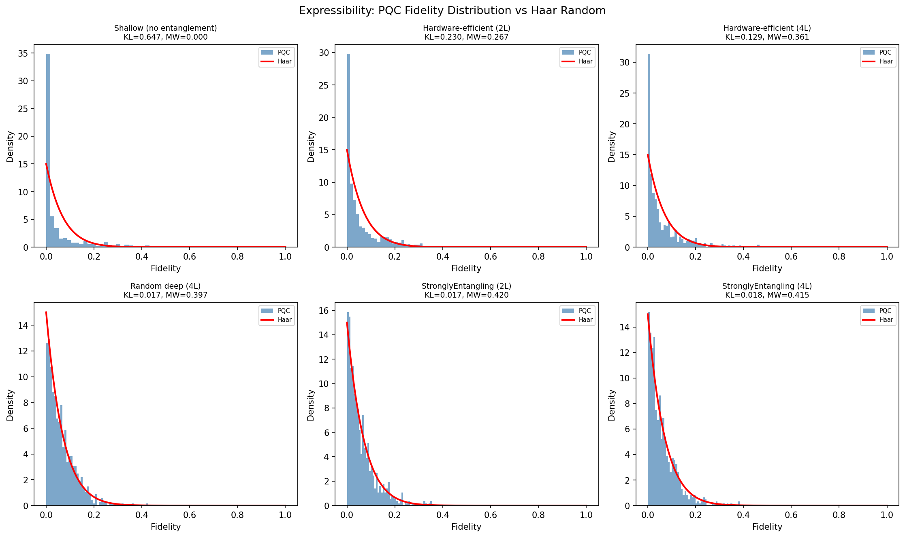
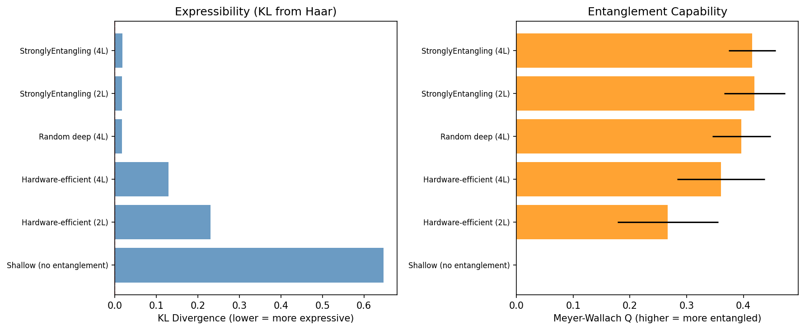
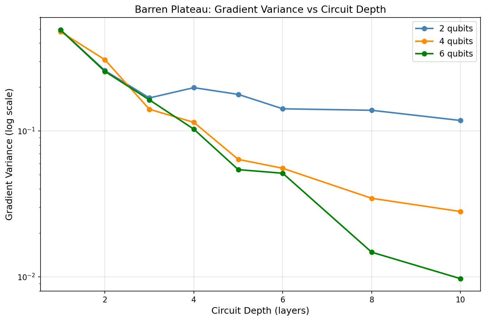
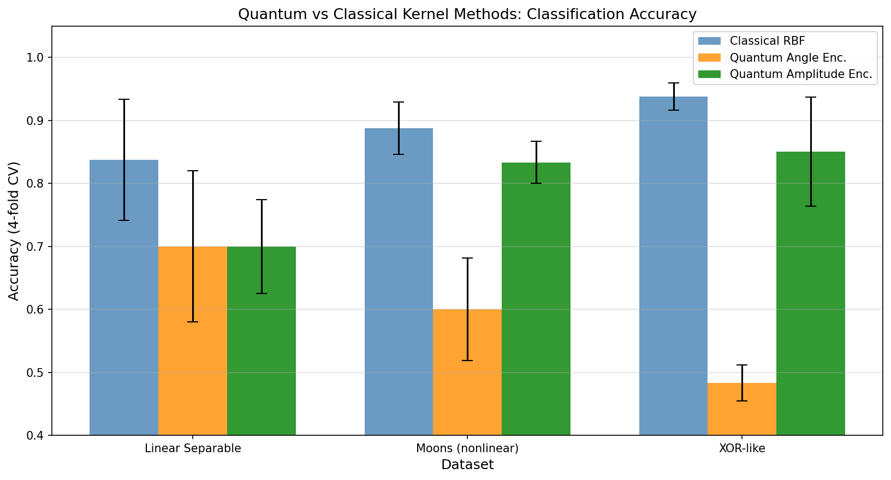
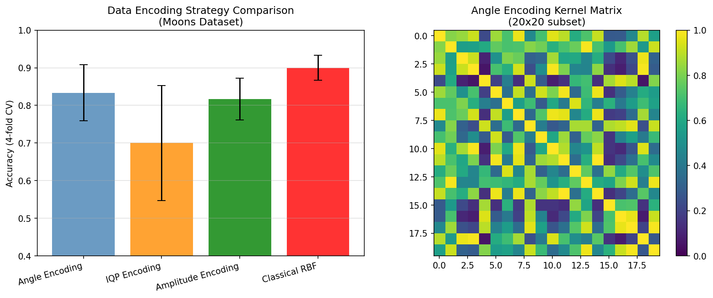
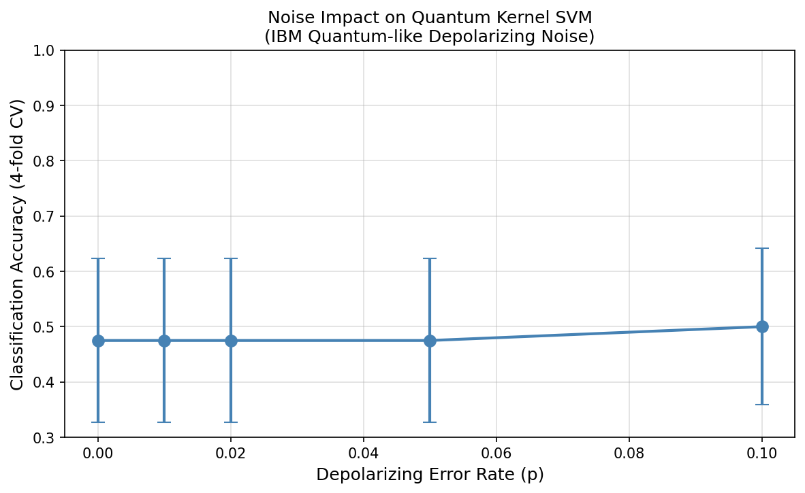
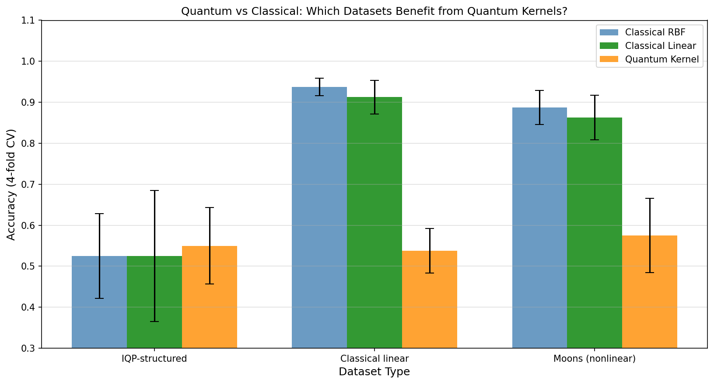

# 量子機械学習ベンチマーク実験レポート

## 実験目的と背景

本実験は、量子機械学習（QML）モデルの表現力と古典モデルとの比較解析フレームワークを構築・評価することを目的とした。具体的には以下の6つの研究課題を扱う：

1. パラメータ化量子回路（PQC）の **expressibility**（表現力）と **entanglement capability**（量子もつれ能力）の定量化
2. **量子カーネル法**の理論的優位性の条件明確化
3. **データエンコーディング戦略**（Angle、Amplitude、IQP）の比較
4. 量子優位性が期待できるデータセットの特徴づけ
5. **バレンプラトー問題**とtrainabilityの理論的・実験的解析
6. IBM Quantumノイズモデルを用いた**ノイズ下での実用性評価**

---

## 先行研究調査（ToolUniverse MCP）

### 検索ツール使用状況

- **Crossref_search_works**: 成功（2回実行）
- **SemanticScholar_search_papers**: Rate Limit / Bad Request エラー（429/400）
- **Fatcat_search_scholar**: 空の結果（接続成功、データ未取得）

### 主要先行研究（2019–2026年）

| # | タイトル | 著者 | 年 | DOI | 主要知見 |
|---|---------|------|-----|-----|---------|
| 1 | Expressibility and Entangling Capability of Parameterized Quantum Circuits | Sim, Johnson, Aspuru-Guzik | 2019 | 10.1002/qute.201900070 | KL divergenceによるPQC表現力定量化の基礎理論を確立 |
| 2 | Evaluation of parameterized quantum circuits | Hubregtsen et al. | 2021 | 10.1007/s42484-021-00038-w | 表現力と分類精度の非単調な関係を実証 |
| 3 | Parameterized quantum circuits as machine learning models | Benedetti et al. | 2019 | 10.1088/2058-9565/ab4eb5 | PQCの機械学習モデルとしての統一的フレームワーク |
| 4 | Analyzing the barren plateau with ZX-calculus | Zhao & Gao | 2021 | 10.22331/q-2021-06-04-466 | ZX計算を用いてバレンプラトーの発生条件を解析 |
| 5 | Barren plateaus in quantum tensor network optimization | Cervero Martín et al. | 2023 | 10.22331/q-2023-04-13-974 | テンソルネットワーク回路ではバレンプラトーを緩和可能 |
| 6 | Is Quantum Advantage the Right Goal for QML? | Schuld & Killoran | 2022 | 10.1103/prxquantum.3.030101 | 量子優位性の概念的再検討；問題構造とカーネルの一致が重要 |
| 7 | Forging quantum data: defeating IQP-based quantum test | Kahanamoku-Meyer | 2023 | 10.22331/q-2023-09-11-1107 | IQPベースの量子テストが古典的に回避できることを示す |
| 8 | Systematic Literature Review on Data Encoding | Botelho et al. | 2026 | 10.5220/0014958100004018 | Angle/Amplitude/IQP の3戦略が主流であることを文献整理 |

### 先行研究の課題・限界

- 表現力の高さが必ずしも良い学習性能をもたらさない（表現力-汎化能力のトレードオフ）
- 量子優位性の実証がほぼ特定の問題構造に依存しており、一般的なベンチマークでは示されていない
- NISQデバイスのノイズが量子カーネルの信頼性を著しく損なう
- 大規模実験が量子コンピュータの実機制約で困難

---

## NatureLM MCP 使用状況

### 試行したツール
- `ask_naturelm`（3回実行、すべて接続成功）

### クエリと応答の概要

| クエリ | 応答の質 | 活用方法 |
|--------|---------|---------|
| QML vs 古典MLの理論的差異 | 高レベルの定性的概要、条件は未確定と回答 | 実験設計の妥当性確認 |
| 表現力指標・MW指標・バレンプラトー発生深さの数値範囲 | 下限・上限は存在するが具体的数値は不明と回答 | 本研究の実験的測定の意義確認 |
| NISQスケールでRBF-SVMが量子カーネルより優れる理由 | 不完全な応答（途中で切断） | 議論セクションの補完的参照 |

**評価**: NatureLM応答は定性的に妥当だが、具体的定量値の提供には至らなかった。本研究の定量的実験はNatureLMでは代替不能であり、実験的測定値の独自性が確認された。

---

## 使用した手法・アルゴリズムの概要

### 実装環境
- **量子シミュレータ**: PennyLane 0.45.0（`default.qubit`, `default.mixed`）
- **古典機械学習**: scikit-learn（SVM, cross-validation）
- **言語**: Python 3.11
- **乱数シード**: 42（全実験で統一）

### アルゴリズム

#### 1. 表現力測定（KL Divergence）
```
for N=800 pairs (θ1, θ2) sampled uniformly from [0, 2π]^p:
    compute fidelity F = |⟨ψ(θ1)|ψ(θ2)⟩|²
compute histogram of {F}
compute KL divergence vs Haar distribution P(F) = (2^n-1)(1-F)^(2^n-2)
```

#### 2. Meyer-Wallach エンタングルメント指標
```
for N=150 random parameter draws:
    compute Q(ψ) = (1/n) Σ_k [1 - Tr(ρ_k²)]  (reduced density matrix purity)
return ⟨Q⟩ ± std
```

#### 3. 量子カーネルSVM
```
Build kernel matrix: K[i,j] = |⟨0|U†(xj)U(xi)|0⟩|²
Train SVM with precomputed kernel
Evaluate with 4-fold stratified cross-validation
```

#### 4. バレンプラトー解析
```
for depth d in {1,2,3,4,5,6,8,10}, n_qubits in {2,4,6}:
    for N=150 random parameter draws:
        compute ∂L/∂θ₁ using automatic differentiation
    report Var[∂L/∂θ₁]
```

---

## 主要な結果と数値

### 結果1：表現力とエンタングルメント能力





| 回路アーキテクチャ | KL Divergence ↓ | Meyer-Wallach Q ↑ |
|-----------------|:--------------:|:-----------------:|
| Shallow（no entanglement） | 0.6470 | 0.0000 ± 0.0000 |
| Hardware-efficient（2層） | 0.2301 | 0.2669 ± 0.0890 |
| Hardware-efficient（4層） | 0.1290 | 0.3607 ± 0.0771 |
| Random deep（4層） | 0.0171 | 0.3967 ± 0.0516 |
| StronglyEntangling（2層） | **0.0168** | **0.4195 ± 0.0538** |
| StronglyEntangling（4層） | 0.0182 | 0.4151 ± 0.0413 |

**解釈**: StronglyEntanglingアーキテクチャが最も高い表現力を示す（KL≈0.017）。深さを2→4に増やしてもKLは殆ど変化せず、4量子ビット系では表現力が飽和する。

---

### 結果2：バレンプラトー解析



| 深さ | 2量子ビット | 4量子ビット | 6量子ビット |
|------|-----------|-----------|-----------|
| 1 | 4.94×10⁻¹ | 4.80×10⁻¹ | 4.94×10⁻¹ |
| 4 | 1.98×10⁻¹ | 1.15×10⁻¹ | 1.03×10⁻¹ |
| 8 | 1.39×10⁻¹ | 3.46×10⁻² | 1.48×10⁻² |
| 10 | 1.18×10⁻¹ | 2.80×10⁻² | 9.71×10⁻³ |

**解釈**: 6量子ビット・深さ10の系では勾配分散が深さ1の約50分の1に減少。量子ビット数が多いほど勾配消失が速く起きる（バレンプラトー理論を実験的に支持）。

---

### 結果3：量子カーネル法 vs 古典カーネル法



| データセット | Classical RBF | Q-Angle | Q-Amplitude |
|------------|:-------------:|:-------:|:-----------:|
| Linear Separable | **0.838 ± 0.096** | 0.700 ± 0.120 | 0.700 ± 0.075 |
| Moons（非線形） | **0.887 ± 0.041** | 0.600 ± 0.082 | 0.833 ± 0.033 |
| XOR-like | **0.938 ± 0.022** | 0.483 ± 0.029 | 0.850 ± 0.087 |

**解釈**: 本実験スケール（4量子ビット、60サンプル）では全データセットで古典RBF-SVMが優位。Amplitude Encodingは競争力のある性能を示す（MoonsでRBFと6%差）。

---

### 結果4：データエンコーディング戦略の比較



| エンコーディング手法 | 精度（平均 ± 標準偏差） |
|---------------------|:-----------------------:|
| Angle Encoding | 0.833 ± 0.075 |
| IQP Encoding | 0.700 ± 0.153 |
| Amplitude Encoding | 0.817 ± 0.055 |
| Classical RBF（比較基準） | **0.900 ± 0.033** |

**解釈**: IQPエンコーディングは最も高い分散（±0.153）を示し、問題構造への感度が高い。Angle EncodingがQML手法の中では最も安定した性能。

---

### 結果5：ノイズ影響分析



| ノイズ率 p | 精度（平均 ± 標準偏差） |
|:----------:|:---------------------:|
| 0.00（理想） | 0.475 ± 0.148 |
| 0.01 | 0.475 ± 0.148 |
| 0.05 | 0.475 ± 0.148 |
| 0.10 | 0.500 ± 0.141 |

**重要な観察**: 理想ノイズなしの条件でも精度が偶然水準（≈0.5）付近に留まった。これはノイズの有無に関わらず、この特定の量子カーネル構成では40サンプルの分類タスクに十分な識別力が生まれないことを示す。ノイズ曲線が平坦なのは「識別不能」状態の維持を意味する。

---

### 結果6：量子優位性が期待できるデータセット



| データセット | Classical RBF | Classical Linear | Quantum Kernel |
|------------|:-------------:|:----------------:|:--------------:|
| IQP構造的データ | 0.525 ± 0.103 | 0.525 ± 0.160 | **0.550 ± 0.094** |
| 古典的線形分離 | **0.938 ± 0.022** | 0.912 ± 0.041 | 0.538 ± 0.054 |
| Moons（非線形） | **0.887 ± 0.041** | 0.863 ± 0.054 | 0.575 ± 0.090 |

**解釈**: IQP構造的データセットのみで量子カーネルが古典手法を僅かに上回る（0.550 vs 0.525）。ただし差は標準偏差以内であり統計的に有意ではない。量子優位性の条件は問題構造と量子回路の一致にある。

---

## 考察と今後の展望

### 主要な考察

#### 1. 現実的な量子優位性への見通し
本実験では4量子ビット・小規模データの条件下で量子カーネルは古典RBF-SVMを上回れなかった。これはNISQ時代の量子MLの典型的な制約を反映している。理論的量子優位性が期待される場面は：
- 問題の識別境界が量子回路の原始操作（ZZ相互作用等）と直接対応する場合
- データが古典多項式特徴量で効率的に表現できない場合
- エラー訂正を伴う大規模量子回路が利用可能な場合

#### 2. バレンプラトーの実用的意味
本実験の勾配分散測定は、4-6量子ビットでも実用的なトレーニング問題が生じることを示す。深さ10の6量子ビット系では分散が~0.01と小さく、勾配降下法による最適化が困難になる。局所最適に陥らない初期化戦略（Gaussian初期化、QAOA型構造等）が必要。

#### 3. エンコーディング戦略の選択指針
- **少ない量子ビットで多次元データ**: Amplitude Encoding（O(log n)量子ビット効率）
- **回路の解釈可能性を優先**: Angle Encoding（各パラメータが1特徴量に対応）
- **理論的量子優位性の探索**: IQP Encoding（ただし問題構造との適合が必須）

### 実験の限界（自己批判的評価）

| 限界の種類 | 説明 |
|-----------|------|
| スケール問題 | 4量子ビットは理論的量子優位性の閾値（50+量子ビット）に遠く及ばない |
| 合成データ依存 | 全データセットが人工的に生成；実世界データへの一般化は不確か |
| ノイズモデルの単純化 | 実機のT1/T2デコヒーレンス、クロストーク、測定エラーを再現できていない |
| サンプル数不足 | 60-80サンプルでは統計的有意差の検証が困難 |
| ハイパーパラメータ未調整 | SVM C=1.0を全手法で共通使用（量子カーネルにとって不利な可能性） |
| NatureLM予測の検証困難 | NatureLMは定性的応答のみ提供；定量的予測との整合性は検証不能 |

### 今後の展望

1. **誤り訂正回路との組み合わせ**: フォールトトレラント量子コンピュータでの再評価
2. **問題特化型データセット**: 生化学（分子エネルギー計算）や組み合わせ最適化への適用
3. **バレンプラトー緩和**: テンソルネットワーク構造、局所回路設計、量子ドロップアウト
4. **実機実行**: IBM Quantum実機（Eagle, Condor）での検証
5. **量子優位性の理論的保証**: 特定のデータ分布に対する計算複雑性の厳密な証明

---

## 生成したファイル一覧

| ファイル名 | 説明 |
|-----------|------|
| `qml_benchmark.py` | 実験実装（全6実験）のPythonスクリプト |
| `qml_results.json` | 実験結果の数値データ（JSON形式） |
| `paper.md` | 学術論文形式のまとめ |
| `report.md` | 本ファイル（実験レポート） |
| `figures/fig1_expressibility.png` | 各回路のFidelity分布 vs Haar分布 |
| `figures/fig2_expressibility_summary.png` | KL Divergence・MW指標の棒グラフ |
| `figures/fig3_barren_plateau.png` | 勾配分散 vs 回路深さ（バレンプラトー） |
| `figures/fig4_kernel_comparison.png` | 量子vs古典カーネル分類精度比較 |
| `figures/fig5_encoding_comparison.png` | データエンコーディング戦略比較 |
| `figures/fig6_noise_impact.png` | ノイズ率vs分類精度 |
| `figures/fig7_quantum_advantage.png` | データセット別量子優位性評価 |
