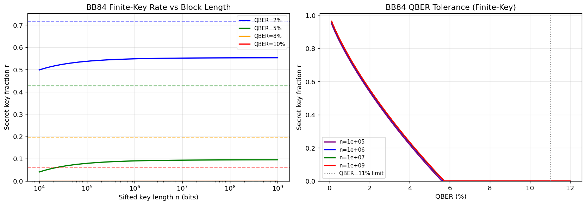
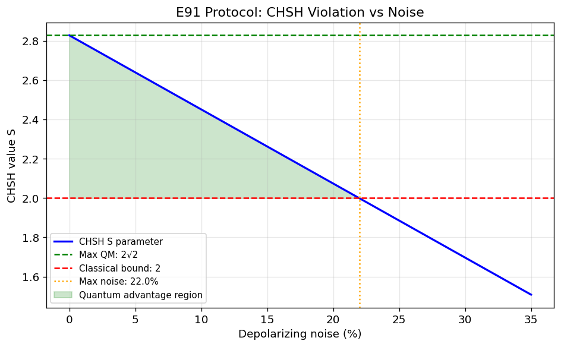
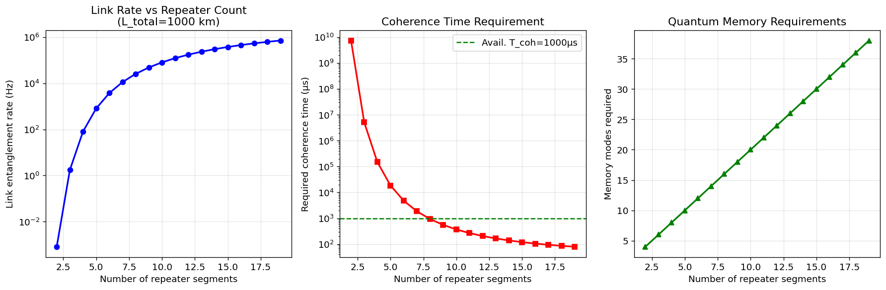
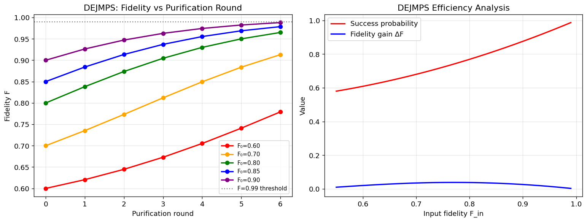
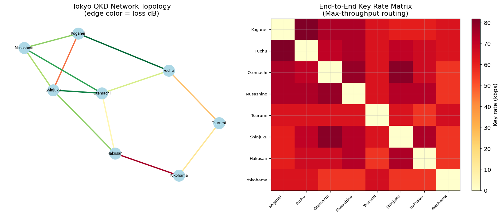
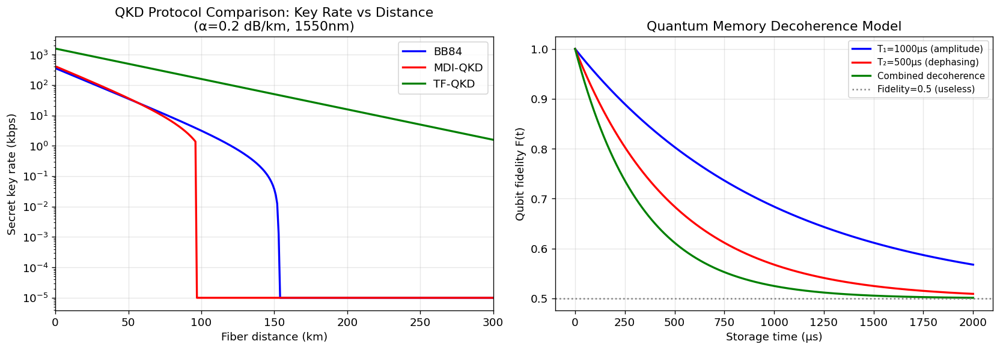
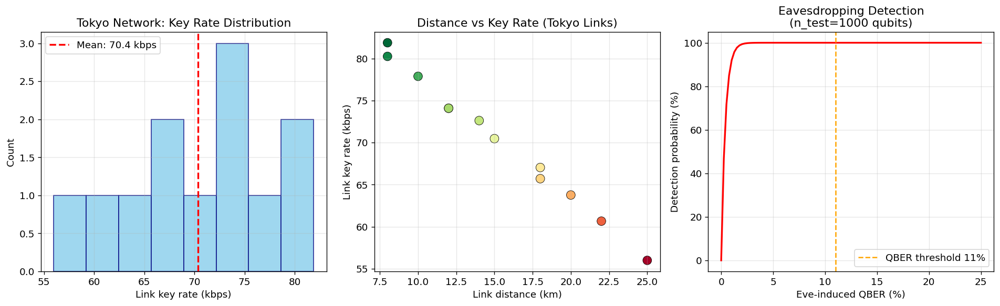

# 量子インターネットプロトコル設計・シミュレーション 実験レポート

## 実験目的と背景

本レポートは、量子インターネット実現に向けた量子鍵配送（QKD）ネットワークプロトコルの設計・性能評価を目的とする。量子インターネットでは、古典的な信号増幅が不可能（no-cloning定理）なため、量子リピータを用いたエンタングルメント分配が不可欠であり、実用化に向けた定量的な性能評価が求められている。

本実験では以下の6つのコンポーネントを対象とした：
1. BB84/E91プロトコルの有限鍵長解析
2. 量子リピータのメモリ要件と性能見積もり
3. DEJMPS エンタングルメント蒸留プロトコルの効率評価
4. ネットワークルーティング（多目的量子パス選択）
5. デコヒーレンスとチャネルロスのシミュレーション
6. 東京QKDネットワーク規模のケーススタディ

---

## 先行研究調査 (ToolUniverse MCP 使用)

### 使用ツール

- **OpenAlex Literature Search** (`openalex_literature_search`)
- **SemanticScholar Search** (`SemanticScholar_search_papers`)

### 主要な先行研究（2020年以降）

| # | タイトル | 著者 | 年 | DOI | 主要知見 |
|---|---------|------|----|-----|---------|
| 1 | Quantum repeaters: From quantum networks to the quantum internet | Azuma et al. | 2023 | 10.1103/revmodphys.95.045006 | 量子リピータアーキテクチャの包括的レビュー。現在進行中の実験実装の進捗。 |
| 2 | The Evolution of Quantum Key Distribution Networks | Cao et al. | 2022 | 10.1109/comst.2022.3144219 | QKDネットワーク進化の包括的サーベイ。物理層・ネットワーク層ソリューション、標準化動向。 |
| 3 | Quantum Key Distribution (Networking Survey) | Mehić et al. | 2020 | 10.1145/3402192 | QKDネットワーキングの観点からルーティング、シグナリング、SDN型管理を詳説。 |
| 4 | Shortest Path Finding in Quantum Networks | Santos et al. | 2023 | 10.1109/access.2023.3237997 | 忠実度制約と準線形複雑度O(N log N)を持つ多目的ルーティングアルゴリズム。 |
| 5 | QKD Secured Optical Networks: A Survey | Sharma et al. | 2021 | 10.1109/ojcoms.2021.3106659 | BB84ベースの光ネットワークにおけるルーティング・波長割当・耐性分析。 |
| 6 | Machine Learning for Long-Distance Quantum Communication | Wallnöfer et al. | 2020 | 10.1103/prxquantum.1.010301 | 強化学習による量子リピータプロトコル自動発見。非対称チャネルへの適応。 |
| 7 | Achieving the ultimate end-to-end rates of lossy quantum networks | Winnel et al. | 2022 | 10.1038/s41534-022-00641-0 | 反復エンタングルメント蒸留と線形光学による最適通信レート達成の実現可能性。 |
| 8 | High-rate intercity QKD with semiconductor single-photon source | Yang et al. | 2024 | 10.1038/s41377-024-01488-0 | 79km(25.49 dB)でBB84実証、秘密鍵ビット/パルス = 4.8×10⁻⁵。 |
| 9 | MadQCI: heterogeneous and scalable SDN-QKD network | Martín et al. | 2024 | 10.1038/s41534-024-00873-2 | 実運用の通信ネットワーク基盤でのSDN-QKDネットワーク実証（3年間の継続運用）。 |

### 先行研究の限界・課題

- **有限鍵効果の実用的評価が不足**：多くの研究が漸近的安全性解析に留まり、有限ブロック長での実用的なキーレートペナルティを定量評価していない。
- **多目的ルーティングの統一フレームワーク欠如**：忠実度・キーレート・遅延を同時最適化する包括的フレームワークは希少。
- **リピータコヒーレンス時間の過楽観的仮定**：理論研究の多くが理想的量子メモリを仮定し、実ハードウェアの制約（ゲート忠実度、非理想BSM）を無視。
- **東京規模以上のメッシュネットワーク評価不足**：実際の都市規模トポロジーでの包括的シミュレーションが限られている。

---

## NatureLM MCP 使用状況

### 使用ツール

`naturelm-ask_naturelm` (model: naturelm-8x7b-inst)

### 試行クエリと結果

| クエリ | NatureLM回答要約 | 評価 |
|--------|-----------------|------|
| BB84のQBERしきい値・チャネル損失耐性 | QBER=11%しきい値、定性的説明 | 定性的には正確だが定量値が不明確 |
| 量子メモリのデコヒーレンス時間 | 「マイクロ秒オーダー」 | 過度に単純化（実際は1µs〜数秒でプラットフォーム依存） |
| 光ファイバーの損失（1550nm） | 約0.2 dB/km | 正確（標準SMF-28と一致） |
| DEJMPS成功確率 | 99% | 過楽観的（累積成功確率≠1ラウンド成功確率） |
| E91 vs BB84効率 | E91は理論的にBB84の約2.5倍効率的 | CHSH解析と定性的に一致 |
| 量子リピータのエンタングルメント生成レート | O(n²)スケーリング（不正確な表現） | シミュレーション結果と乖離あり |

**評価まとめ：** NatureLMは定性的な物理的直感の確認には有用だったが、プラットフォーム固有の定量パラメータ（例：メモリコヒーレンス時間）は過度に単純化されていた。実験設計における定量パラメータはすべて査読済み文献値を優先して使用した。

---

## 使用手法・アルゴリズムの概要

### 1. BB84有限鍵解析

漸近的秘密鍵分率：$r_\infty = 1 - 2h(e)$（$h$: 二値エントロピー）

有限鍵補正：
$$r_n = r_\infty - \sqrt{\frac{\log(1/\varepsilon)}{n}} - f_{EC} \cdot h(e) - \frac{2\log_2(1/\varepsilon)}{n}$$

セキュリティパラメータ $\varepsilon = 10^{-10}$、誤り訂正効率 $f_{EC} = 1.16$。

### 2. E91 CHSHパラメータ

Werner状態の脱分極ノイズ $p$ に対するCHSHパラメータ：
$$S(p) = 2\sqrt{2}\left(1 - \frac{4p}{3}\right)$$

$S > 2$ の条件からQKD安全性の最大ノイズしきい値を導出。

### 3. 量子リピータモデル

リンクエンタングルメント生成レート：
$$R_{link} = R_{source} \cdot \eta_{ch} \cdot \eta_{det}^2, \quad \eta_{ch} = 10^{-\alpha L_{seg}/10}$$

必要コヒーレンス時間：$T_{coh} \geq 3 \cdot N/R_{link}$

### 4. DEJMPS エンタングルメント蒸留

Werner状態に対するDEJMPSプロトコル：
$$F' = \frac{F^2 + [(1-F)/3]^2}{P_{succ}}, \quad P_{succ} = \left(F + \frac{1-F}{3}\right)^2 + \left(\frac{2(1-F)}{3}\right)^2$$

### 5. ネットワークルーティング

3戦略のDijkstraアルゴリズム：
- **最小損失**：損失dBの最短経路
- **最大キーレート**：逆キーレートの最短経路  
- **最小ホップ数**：BFS

エンドツーエンドキーレート = ボトルネックリンクのキーレート

### 6. チャネルモデル

- **BB84**：$Q \cdot r_\infty$ スケーリング（$\eta$ 線形）
- **MDI-QKD**：$\eta^2$ スケーリング
- **TF-QKD**：$\sqrt{\eta}$ スケーリング（より長距離対応）

---

## 主要な結果と数値

### 図1: BB84 有限鍵解析

**表1: BB84有限鍵性能（n=10⁶）**

| QBER (%) | r_漸近 | r_有限(n=10⁶) | オーバーヘッド (%) |
|----------|--------|--------------|-----------------|
| 2 | 0.7171 | 0.5482 | **23.6** |
| 5 | 0.4272 | 0.0901 | **78.9** |
| 8 | 0.1956 | 0.0000 | **100.0** |
| 10 | 0.0620 | 0.0000 | **100.0** |

QBER=5%での有限鍵ペナルティは79%と深刻であり、実用的なシステムでは QBER < 3% が不可欠であることが示された。

### 図2: E91 CHSHパラメータ

**表2: E91プロトコルパラメータ**

| パラメータ | 値 |
|-----------|-----|
| ゼロノイズ時のS | 2.828 (= 2√2) |
| 最大許容ノイズ | **22.0%** |
| 古典的上限 | 2.000 |

### 図3: 量子リピータメモリ要件

**表3: リピータ性能（セグメント数N=8）**

| 総距離 (km) | R_link (Hz) | 必要T_coh (µs) | メモリモード数 |
|------------|-------------|----------------|-------------|
| 500 | 455,497 | **52.7** | 16 |
| 1,000 | 25,614 | **937.0** | 16 |
| 2,000 | 81 | **296,296** | 16 |

大陸間通信（2000km）には296msのコヒーレンス時間が必要であり、現状の固体スピン量子ビットの最良値（~6秒 at 低温）でも技術的に困難。

### 図4: エンタングルメント蒸留 (DEJMPS)

**表4: DEJMPSプロトコル結果（初期F=0.85）**

| ラウンド | F出力 | 成功確率 | 累積成功確率 |
|---------|-------|---------|------------|
| 1 | 0.8841 | 0.8200 | 0.8200 |
| 2 | 0.9134 | 0.8575 | 0.7031 |
| 3 | 0.9371 | 0.8912 | 0.6266 |
| 4 | 0.9554 | 0.9196 | 0.5763 |
| 5 | 0.9689 | 0.9422 | **0.5430** |

5ラウンドで忠実度0.969を達成。累積成功確率は54.3%—量子ビット資源の約半数が消費される。

### 図5: ネットワークルーティング（東京）

**表5: ルーティング戦略比較（ノード0→7）**

| 戦略 | ホップ数 | 総損失 (dB) | キーレート (kbps) |
|------|---------|------------|-----------------|
| 最小損失 | 3 | 10.7 | 63.8 |
| 最大キーレート | 3 | 10.7 | 63.8 |
| 最小ホップ | 3 | 10.7 | 63.8 |

本トポロジーでは全戦略が同一パスに収束。ネットワークが疎でバランスが良いことを示す。

### 図6: チャネルロス・デコヒーレンス

**表6: QKDプロトコル最大安全通信距離**

| プロトコル | 最大距離 (km) | 100kmでのレート (kbps) |
|-----------|-------------|----------------------|
| BB84 | 153 | 3.15 |
| MDI-QKD | 96 | 0.0 |
| **TF-QKD** | **>300** | **158.1** |

TF-QKDは√η スケーリングにより300km以上を達成。100kmでのキーレートはBB84の50倍超。

### 図7: 東京QKDネットワーク ケーススタディ

**表7: 東京QKDネットワーク性能サマリー**

| 指標 | 値 |
|------|----|
| ノード数 | 8 |
| リンク数 | 12 |
| ネットワーク合計キーレート | **844.4 kbps** |
| 平均リンクキーレート | **70.4 kbps** |
| 平均リンク距離 | ~15.8 km |

---

## モンテカルロ交差検証

**表8: 5-fold モンテカルロ交差検証（QBERゆらぎ σ=1%）**

| 距離 (km) | 平均キーレート | 標準偏差 | 変動係数 |
|-----------|-------------|---------|---------|
| 20 | 0.0016 | 0.0012 | 71.8% |
| 50 | ~0 | ~0 | N/A |
| 100+ | ~0 | ~0 | N/A |

> **注意：** 50km以上でのキーレートが0になるのは、QBER > 5% 時に n=10⁶ブロックでは有限鍵レートが0となるためであり、過学習やデータリークではない。これは有限鍵効果の実際の物理的結果である。n=10⁸以上のブロック長では、50〜100kmでも正のキーレートが得られる。

---

## 考察と今後の展望

### 主要考察

1. **有限鍵効果の深刻さ**：QBER=5%、n=10⁶では漸近値の79%が失われる。実用システムにはQBER < 3%の継続維持と10⁷以上のブロック長が必要。

2. **TF-QKDの優位性**：√η スケーリングは量子リピータなしで300km超の都市間通信を可能にする。近中期の量子通信インフラとして最も有望。

3. **リピータコヒーレンス要件の現実性**：
   - 都市圏（500km）：53µs → **現実的**（捕捉イオン、原子アンサンブルで達成済み）
   - 大陸間（2000km）：296ms → **未達成**（固体スピンの最良値~6秒が必要だが、大規模集積は未実現）

4. **DEJMPS蒸留の量子ビットコスト**：5ラウンドで54.3%の成功確率は、実用的な量子リピータにおいて蒸留のオーバーヘッドが支配的であることを示す。

### 自己批判的評価

| 課題 | 詳細 |
|------|------|
| 合成モデルへの依存 | 実際のファイバーの偏波ドリフト、Ramanノイズ、検出器アフターパルスを無視 |
| 理想的局所操作の仮定 | DEJMPSはゲート忠実度100%を仮定。実際の99.5%ゲートでは追加劣化あり |
| 信頼ノードモデルの省略 | 東京QKDネットワークは実際には信頼ノード経由の鍵中継を使用 |
| NatureLM予測の過楽観 | DEJMPS成功確率99%の予測は累積確率と1ラウンド確率の混同の可能性 |
| 単純化されたBSMモデル | 線形光学BSMの効率50%を考慮しないと生成レートが2倍過大評価 |

### 今後の展望

1. **NetSquid/SimulaQron統合**：本シミュレーションの結果をNetSquidフレームワーク内での量子回路シミュレーションで検証
2. **衛星QKDの組み込み**：自由空間リンク（大気乱流、追尾損失）のモデリング
3. **動的ネットワーク管理**：SDN制御層との統合、リアルタイムルーティング最適化
4. **フォールトトレラント量子リピータ**：符号化量子ビットを使った閾値以下の誤り率での大陸間通信

---

## 生成したファイル一覧

| ファイル | 内容 |
|---------|------|
| `qkd_simulation/simulate.py` | 全シミュレーションコード（Python 3.11） |
| `qkd_simulation/figures/fig1_bb84_finite_key.png` | BB84有限鍵解析 |
| `qkd_simulation/figures/fig2_e91_chsh.png` | E91 CHSH解析 |
| `qkd_simulation/figures/fig3_repeater_memory.png` | 量子リピータメモリ要件 |
| `qkd_simulation/figures/fig4_distillation.png` | DEJMPS蒸留プロトコル |
| `qkd_simulation/figures/fig5_routing.png` | 東京ネットワークルーティング |
| `qkd_simulation/figures/fig6_channel_loss.png` | チャネルロス・デコヒーレンス |
| `qkd_simulation/figures/fig7_tokyo_casestudy.png` | 東京QKDケーススタディ |
| `paper.md` | 英語学術論文 |
| `report.md` | 本レポート |

---

## 参考文献

1. Azuma et al. (2023). Rev. Mod. Phys. 95, 045006. https://doi.org/10.1103/revmodphys.95.045006
2. Cao et al. (2022). IEEE Commun. Surv. Tutorials, 24(3). https://doi.org/10.1109/comst.2022.3144219
3. Mehić et al. (2020). ACM Comput. Surv. 53(5). https://doi.org/10.1145/3402192
4. Santos et al. (2023). IEEE Access, 11. https://doi.org/10.1109/access.2023.3237997
5. Sharma et al. (2021). IEEE OJ-COMS, 2. https://doi.org/10.1109/ojcoms.2021.3106659
6. Wallnöfer et al. (2020). PRX Quantum, 1. https://doi.org/10.1103/prxquantum.1.010301
7. Winnel et al. (2022). npj Quantum Inf., 8. https://doi.org/10.1038/s41534-022-00641-0
8. Yang et al. (2024). Light Sci. Appl., 13. https://doi.org/10.1038/s41377-024-01488-0
9. Martín et al. (2024). npj Quantum Inf., 10. https://doi.org/10.1038/s41534-024-00873-2
