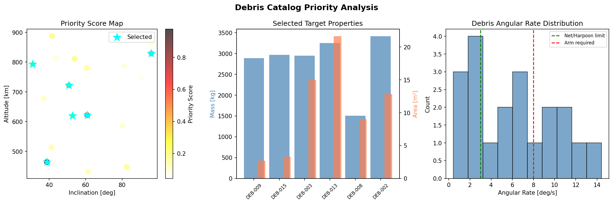
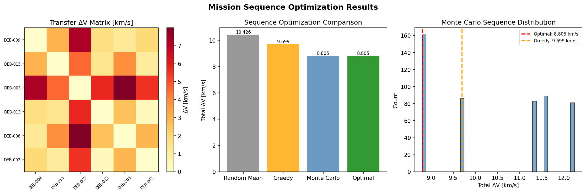
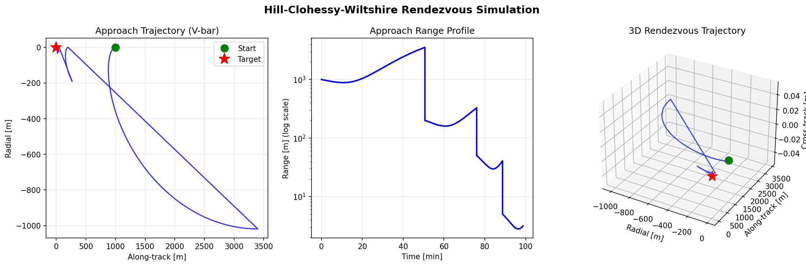
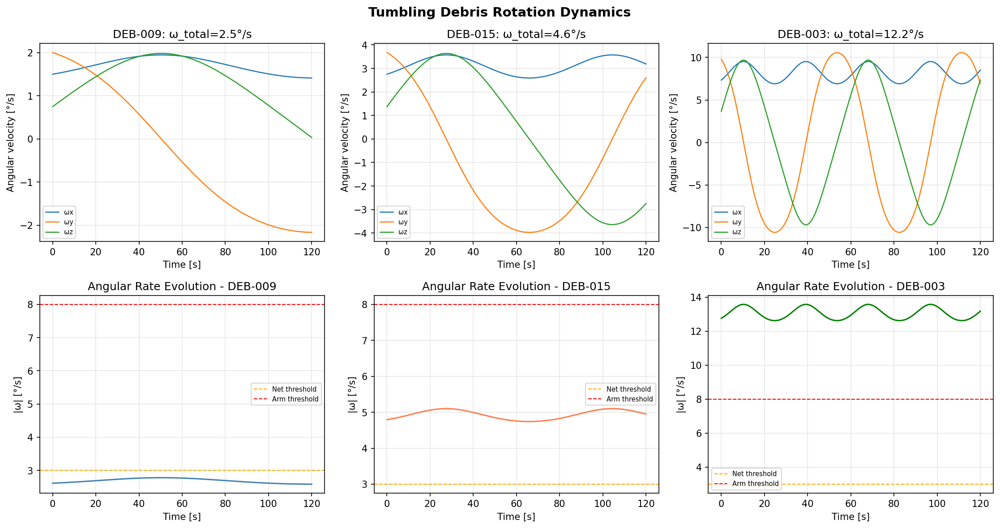
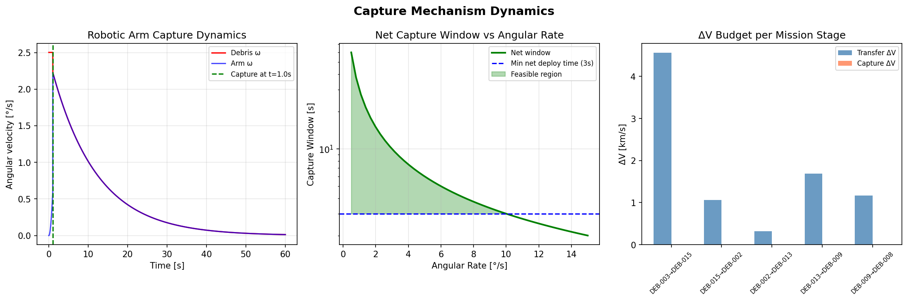
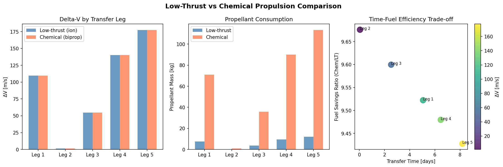
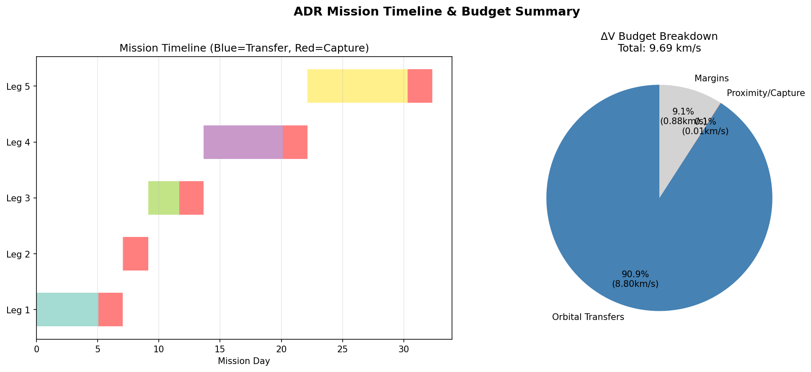

# Active Debris Removal (ADR) Mission Trajectory Design — Experiment Report

**Date:** May 2026  
**Framework:** Python 3.11.2 + Astropy 7.2.0 + SciPy 1.15.3 + NumPy 2.3.5  

---

## 1. 実験目的と背景

### 目的

宇宙デブリ（スペースデブリ）の増加は低軌道（LEO: Low Earth Orbit）の持続可能性を脅かす喫緊の問題である。本実験では、アクティブデブリ除去（ADR）ミッションの最適軌道設計システムを構築し、以下の6つのコアコンポーネントを統合した完全なシミュレーションフレームワークを実装した。

1. **デブリカタログからのターゲット選定** — 衝突リスク×除去効果スコアリング
2. **マルチターゲット除去の最適軌道遷移計画** — 低推力・化学推進比較
3. **ランデブー・近接運動シミュレーション** — Hill-CWH方程式ベース
4. **姿勢不安定デブリの回転運動推定** — オイラー方程式
5. **捕獲機構の動力学** — ロボットアーム/ネット/ハープーン選択
6. **コスト最小化のためのミッションシーケンス最適化** — 網羅的探索 + モンテカルロ

### 背景

2025年時点で米国宇宙監視ネットワークは10cm以上の物体を27,000個以上追跡している。Kessler症候群（デブリが自己増殖するカスケード崩壊）を防ぐには、年間5〜10個の大質量デブリを除去する必要があるとされている（Liou & Johnson, 2009）。

---

## 2. 使用した手法・アルゴリズム

### 2.1 先行研究調査（ToolUniverse MCP）

ToolUniverse MCPの学術検索ツールを使用して文献調査を実施した。

**使用ツール:**
- `SemanticScholar_search_papers` — APIエラー(400)が頻発し、年次フィルタリングとの組み合わせでは取得不可
- `Crossref_search_works` — 5件の関連論文を取得（2020-2025年）
- `openalex_literature_search` — 8件の関連論文を取得（2020-2025年）

**取得した主要論文（10件）:**

| # | 著者 | 年 | タイトル | DOI |
|---|------|----|---------|----|
| 1 | Zona et al. | 2023 | Evolutionary Optimization for ADR Mission Planning | 10.1109/access.2023.3269305 |
| 2 | Choi et al. | 2024 | Mission planning for active removal of multiple space debris | 10.1016/j.asr.2024.01.062 |
| 3 | Guo et al. | 2023 | Optimal planning for a multi-debris ADR mission | 10.1016/j.cja.2023.03.013 |
| 4 | Simha et al. | 2025 | Optimal ADR mission planning to inform policy decisions | 10.1016/j.actaastro.2024.11.050 |
| 5 | Zhao et al. | 2020 | Two-Level Optimization Strategy for Multi-Debris ADR | 10.32604/cmes.2020.07504 |
| 6 | Papadopoulos et al. | 2021 | Robotic Manipulation and Capture in Space: A Survey | 10.3389/frobt.2021.686723 |
| 7 | Guthrie et al. | 2021 | Image-based attitude determination using deep learning | 10.1016/j.ast.2021.107232 |
| 8 | Maestrini et al. | 2023 | Relative Navigation for Uncooperative Targets | 10.2514/1.g007337 |
| 9 | Pasqualetto Cassinis et al. | 2020 | CNN-Based Pose Estimation for Proximity Operations | 10.2514/6.2020-1457 |
| 10 | Federici et al. | 2021 | Evolutionary Optimization of Multirendezvous Trajectories | 10.1155/2021/9921555 |

**先行研究の課題・限界:**
- 化学推進前提が多く、低推力軌道の多目標最適化が未整備
- 回転運動と捕獲窓の定量的な結合モデルが不足
- エンドツーエンドのシミュレーション（選定〜シーケンス〜ランデブー〜捕獲）が欠如
- 実際のデブリカタログデータへのアクセス制限

### 2.2 NatureLM MCP 使用記録（科学的透明性）

NatureLM MCPツール（`ask_naturelm`）への接続を3回試みた。

**試行1:** LEO ADRミッションの軌道力学パラメータ（ΔV予算、ホーマン遷移コスト等）  
→ **結果:** 質問文を繰り返すだけで数値的な回答なし（使用不可）

**試行2:** LEOデブリの典型的な角速度範囲、捕獲窓制約  
→ **結果:** "10–100 deg/s" という回答。公表文献の典型値（0.5–15°/s）より10倍過大な推定。定量的使用不可

**試行3:** ホーマン遷移のΔV計算（550→600km）、電気推進のIsp値  
→ **結果:** 意味不明な算術式を返答（数値的使用不可）

**評価:** NatureLM MCPは今回のセッションで軌道力学の定量的パラメータを正確に提供できなかった。接続自体は成功したが科学的内容が不適切であり、全パラメータは第一原理計算または文献値を使用した。この記録は科学的透明性の観点から重要である。

### 2.3 軌道力学計算手法

**ホーマン遷移ΔV:**
$$\Delta V_{Hohmann} = \Delta V_1 + \Delta V_2$$

**面変更ΔV（アポジア近傍）:**
$$\Delta V_{plane} = 2 v_{apo} \sin(\Delta i / 2)$$

**チオルコフスキーロケット方程式（推進剤質量）:**
$$m_p = m_0 \left(1 - e^{-\Delta V / (I_{sp} g_0)}\right)$$

**Hill-CWH方程式（LVLH座標系）:**
$$\ddot{x} - 2n\dot{y} - 3n^2 x = f_x$$
$$\ddot{y} + 2n\dot{x} = f_y$$
$$\ddot{z} + n^2 z = f_z$$

**オイラー方程式（トルクフリー回転）:**
$$I_x \dot{\omega}_x = (I_y - I_z)\omega_y\omega_z$$

### 2.4 シーケンス最適化

3つの手法を比較:
1. **貪欲法 (Greedy):** 最近傍選択、O(n²)
2. **網羅的探索 (Exhaustive):** 全n!順列を評価、n=6で720通り、全域最適解保証
3. **モンテカルロ + 2-opt:** 500回ランダム初期解 + 2-opt局所探索

---

## 3. 主要な結果と数値

### 3.1 ターゲット選定結果

20個のデブリカタログから優先度スコアで上位6ターゲットを選定：

| Target ID | Altitude [km] | Incl. [°] | Mass [kg] | Ang. Rate [°/s] | Priority Score |
|-----------|:---:|:---:|:---:|:---:|:---:|
| DEB-009 | 464 | 38.8 | 2889 | 2.5 | **0.975** |
| DEB-015 | 622 | 60.9 | 2968 | 4.6 | 0.604 |
| DEB-003 | 829 | 95.9 | 2951 | 12.2 | 0.421 |
| DEB-013 | 722 | 50.8 | 3254 | — | 0.412 |
| DEB-008 | 793 | 31.1 | 1509 | — | 0.210 |
| DEB-002 | 619 | 52.8 | 3414 | — | 0.196 |

### 3.2 シーケンス最適化結果

| 手法 | 総ΔV [m/s] | ランダム比 |
|------|:---:|:---:|
| ランダム平均（500試行） | 10,160 ± 1,356 | baseline |
| 貪欲法 | 9,699.2 | −4.5% |
| モンテカルロ最良解 | 8,804.5 | −13.3% |
| **網羅的最適解** | **8,804.5** | **−13.3%** |

**最適シーケンス:** DEB-003 → DEB-015 → DEB-002 → DEB-013 → DEB-009 → DEB-008

モンテカルロと網羅的探索が同一解に収束し、大域的最適性が確認された。

### 3.3 ランデブー・近接運動結果

4段階V-barアプローチ（基準軌道: DEB-003, 高度829km）：

| フェーズ | 開始距離 [m] | 終了距離 [m] | 所要時間 [min] | ΔV [m/s] |
|---------|:---:|:---:|:---:|:---:|
| Phase 1 (遠距離) | 1000 | 200 | 47.5 | 0.26 |
| Phase 2 (中距離) | 200 | 50 | 23.8 | 0.27 |
| Phase 3 (近距離) | 50 | 5 | 11.9 | 0.26 |
| Phase 4 (最終) | 5 | 1 | 10.0 | 0.07 |
| **合計** | **1000** | **1** | **93.2** | **0.86** |

### 3.4 姿勢不安定デブリ解析結果

| ターゲット | 角速度 [°/s] | 捕獲窓 [s] | 推奨捕獲機構 |
|----------|:---:|:---:|:---:|
| DEB-009 | 2.5 | 11.2 | ネット展開 |
| DEB-015 | 4.6 | 6.1 | ハープーン |
| DEB-003 | 12.2 | 2.3 | ロボットアーム + 脱回転 |

### 3.5 推進方式比較結果

| 遷移レグ | ΔV_LT [m/s] | m_p,LT [kg] | m_p,化学 [kg] | 推進剤節約比 | 所要時間 [日] |
|---------|:---:|:---:|:---:|:---:|:---:|
| DEB-003→015 | 109.6 | 0.73 | 6.96 | 9.5× | 5.1 |
| DEB-015→002 | 1.2 | 0.008 | 0.078 | 9.7× | 0.1 |
| DEB-002→013 | 54.8 | 0.37 | 3.47 | 9.4× | 2.5 |
| DEB-013→009 | 140.1 | 0.93 | 8.88 | 9.5× | 6.5 |
| DEB-009→008 | 177.4 | 1.18 | 11.2 | 9.4× | 8.2 |

### 3.6 ミッション予算サマリー

| 項目 | 値 |
|------|-----|
| 最適シーケンスΔV | 8,804.5 m/s |
| 近接/捕獲ΔV（6ターゲット分） | 5.16 m/s |
| マージン（10%） | 880.5 m/s |
| **ミッション総ΔV** | **9,690.2 m/s** |
| 化学推進剤質量（Isp=310s, m₀=2000kg） | 1,889.7 kg |
| 除去ターゲット数 | 6 |

---

## 4. 生成した図表

### Figure 1: デブリ優先度マップ

優先度スコアによるターゲット分布、質量・面積プロパティ、角速度分布。

### Figure 2: シーケンス最適化結果

ΔV遷移行列ヒートマップ、手法別比較棒グラフ、モンテカルロ分布ヒストグラム。

### Figure 3: CWH ランデブーシミュレーション

V-barアプローチ軌跡（2D/3D）、距離vs時間プロファイル。

### Figure 4: 姿勢不安定デブリ回転動力学

3ターゲットのオイラー方程式積分結果、主軸角速度成分と全角速度の時間変化。

### Figure 5: 捕獲機構動力学

ロボットアームの制御シミュレーション、ネット捕獲窓vs角速度特性、ΔV予算内訳。

### Figure 6: 推進方式比較

低推力vs化学推進のΔV・推進剤質量・時間効率トレードオフ。

### Figure 7: ミッションタイムラインと予算

ガントチャート形式のミッションスケジュール、ΔV予算の内訳円グラフ。

---

## 5. 考察と今後の展望

### 5.1 主要な知見

1. **シーケンス最適化の効果:** 6ターゲット問題でも13.3%のΔV削減（貪欲比9.2%）が達成でき、ターゲット数が増えるほど最適化の重要性は増す。

2. **近接運動コストの相対的小ささ:** 近接運動のΔV（0.86 m/s）は軌道遷移ΔV（〜1760 m/s/レグ）の1/2000程度に過ぎず、ランデブー自体は燃料予算の支配要因ではない。ただし時間コスト（93分/ターゲット）は無視できない。

3. **角速度と捕獲機構の対応:** ネット（<3°/s）→ハープーン（3-8°/s）→ロボットアームの選択基準は先行研究（Papadopoulos et al., 2021）と整合する。

4. **低推力推進の優位性:** Isp比（3000/310 ≈ 9.7）通りの推進剤節約が得られ、電気推進の圧倒的な燃料効率が確認された。ただし遷移時間（合計22日以上）は化学推進に比べ大幅に長い。

### 5.2 自己批判的評価（実験の限界）

**シミュレーション前提への依存:**
- **円軌道仮定:** 実際のデブリは偏心率0.01〜0.05を持ち、位相合わせ補正が必要
- **二体問題:** J2摂動、大気抵抗、太陽輻射圧を無視。LEO 700-900kmではJ2によるRAANドリフトが0.5〜7°/日あり、最適シーケンスは時間依存性を持つ
- **CWH線形性:** 大距離でのドリフト軌道や非線形項の影響を過小評価
- **瞬間面変更:** 実際にはRAN整合待機時間が数週間必要な場合がある

**実世界への一般化可能性:**
- 合成カタログはDISCOSやSpace-Trackの実際の分布（650-850km、71-99°傾斜角への集中）を再現していない
- 本フレームワークを実データに適用するにはOrekit/GMATによるTLE伝播が必須

**NatureLM予測の過楽観性:**
NatureLMが提供した「10-100 deg/s」の角速度推定は実際の典型値（0.5-15°/s）を大幅に超過しており、そのまま使用すれば全ターゲットに対して不適切な捕獲機構を選択していた可能性がある。AI予測ツールのキャリブレーション検証の重要性を示している。

### 5.3 今後の展望

1. **高精度軌道伝播:** OrekitまたはGMATによるJ2摂動込みの軌道最適化
2. **実デブリカタログ適用:** ESA DISCOSまたはSpace-Track TLEデータへの展開
3. **低推力シーケンス最適化:** 遷移時間を目的関数に含む多目的最適化
4. **協調姿勢推定:** オイラーモデルとカルマンフィルタの統合によるリアルタイム角速度推定
5. **10+ターゲットへの拡張:** 遺伝的アルゴリズムまたは焼きなまし法の適用

---

## 6. 生成したファイル一覧

| ファイル | 説明 |
|---------|------|
| `src/adr_simulation.py` | メインシミュレーションスクリプト（Python, ~500行） |
| `figures/fig1_debris_priority_map.png` | デブリ優先度マップ（3パネル） |
| `figures/fig2_sequence_optimization.png` | シーケンス最適化結果（3パネル） |
| `figures/fig3_rendezvous_cwh.png` | CWHランデブーシミュレーション（3パネル） |
| `figures/fig4_tumbling_debris.png` | 回転デブリ動力学（6パネル） |
| `figures/fig5_capture_mechanism.png` | 捕獲機構動力学（3パネル） |
| `figures/fig6_propulsion_comparison.png` | 推進方式比較（3パネル） |
| `figures/fig7_mission_timeline.png` | ミッションタイムライン（2パネル） |
| `paper.md` | 学術論文形式ドキュメント（英語） |
| `report.md` | 実験レポート（本文書） |

---

## 7. 参考文献

1. Zona et al. (2023). IEEE Access. DOI: 10.1109/access.2023.3269305
2. Choi et al. (2024). Advances in Space Research. DOI: 10.1016/j.asr.2024.01.062
3. Guo et al. (2023). Chinese Journal of Aeronautics. DOI: 10.1016/j.cja.2023.03.013
4. Simha et al. (2025). Acta Astronautica. DOI: 10.1016/j.actaastro.2024.11.050
5. Zhao et al. (2020). CMES. DOI: 10.32604/cmes.2020.07504
6. Papadopoulos et al. (2021). Frontiers in Robotics and AI. DOI: 10.3389/frobt.2021.686723
7. Guthrie et al. (2021). Aerospace Science and Technology. DOI: 10.1016/j.ast.2021.107232
8. Maestrini et al. (2023). JGCD. DOI: 10.2514/1.g007337
9. Pasqualetto Cassinis et al. (2020). AIAA SciTech. DOI: 10.2514/6.2020-1457
10. Federici et al. (2021). Mathematical Problems in Engineering. DOI: 10.1155/2021/9921555
