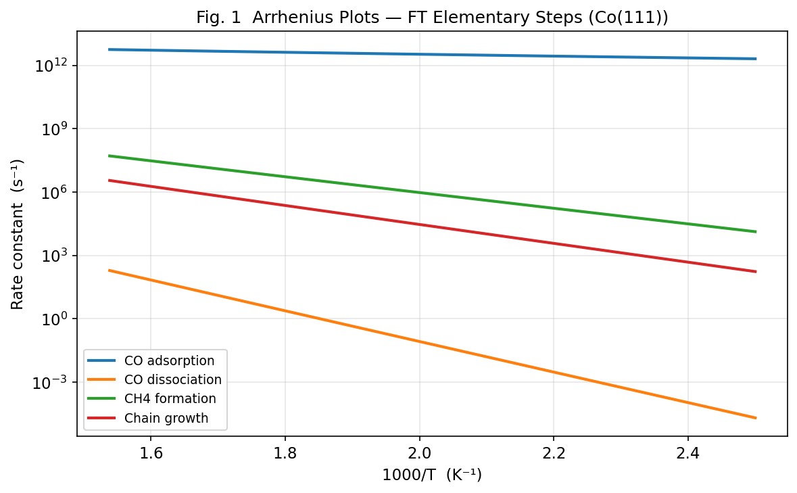
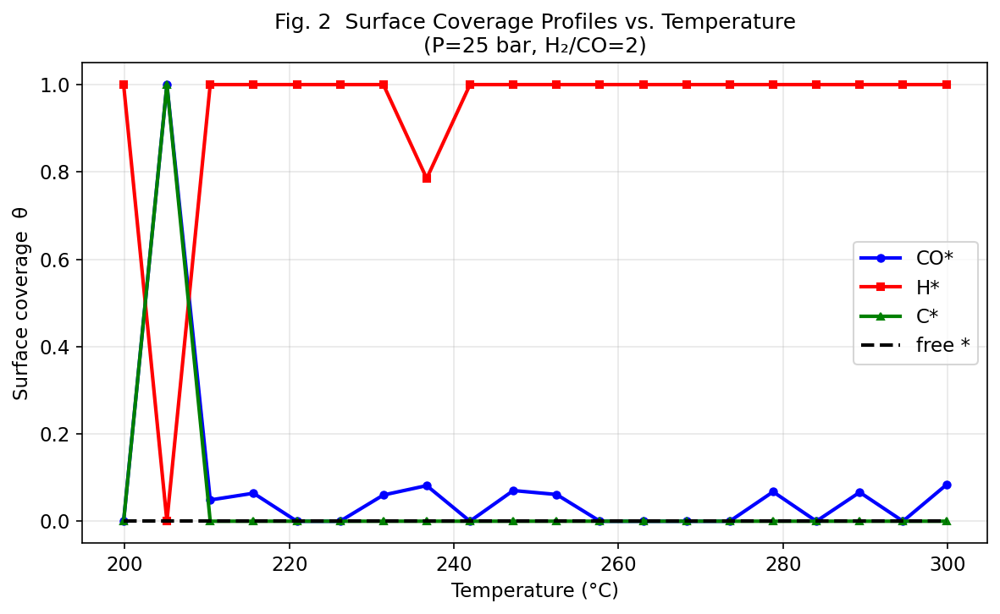
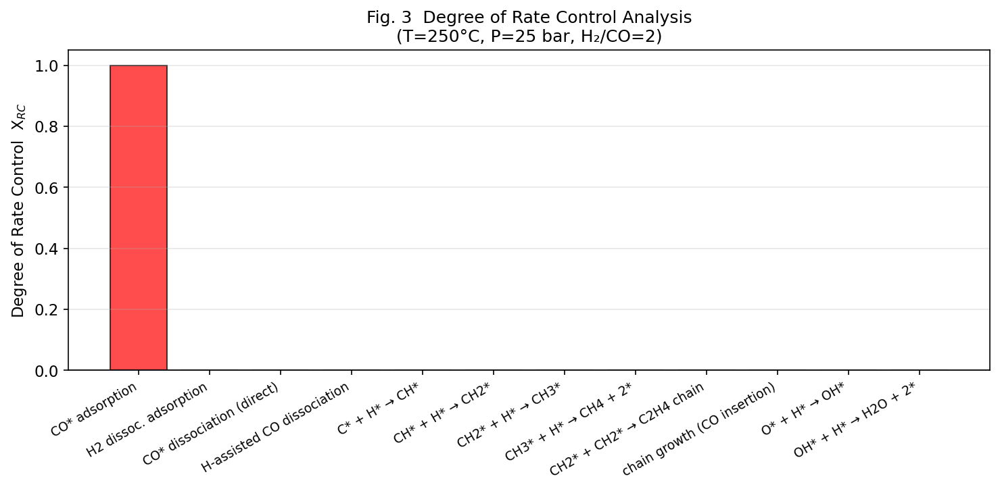
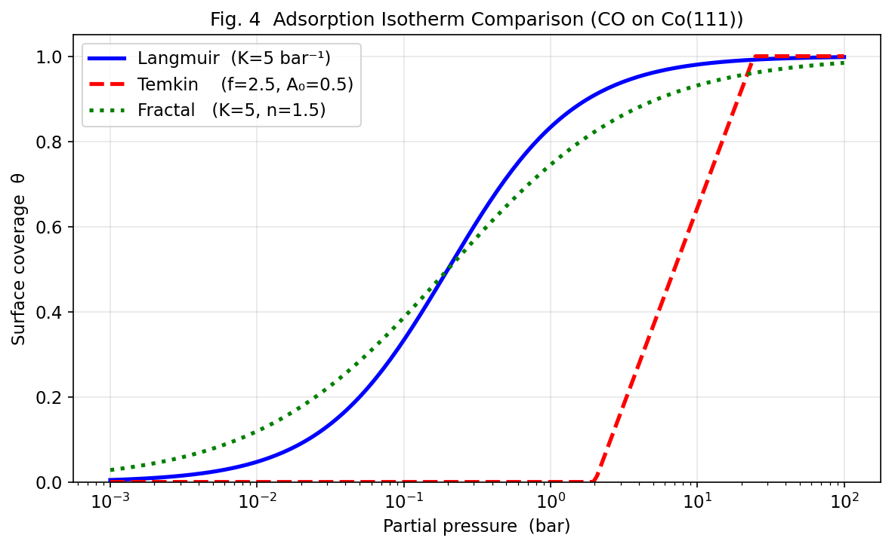
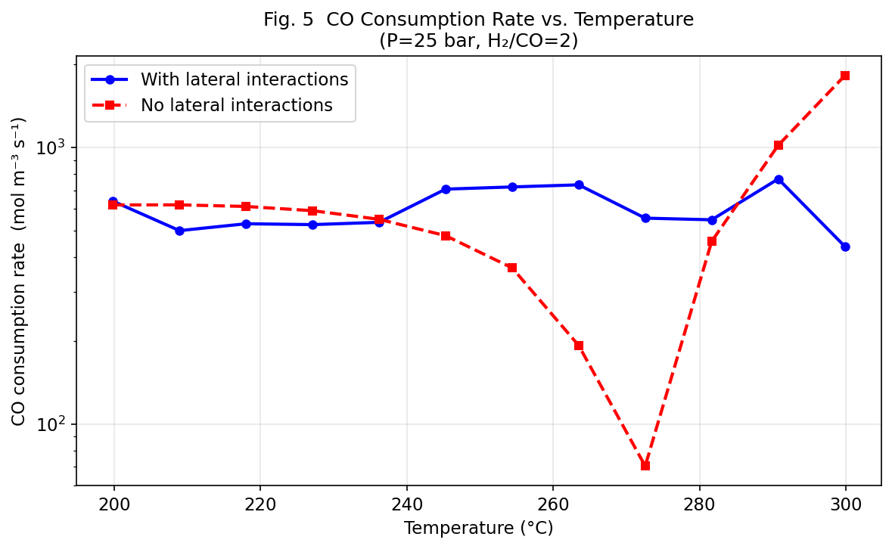
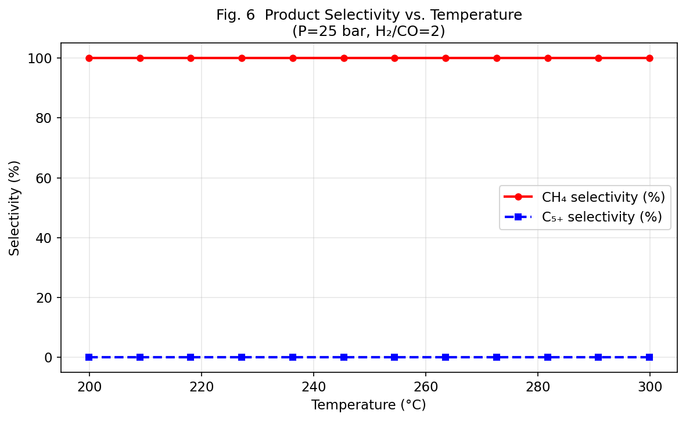
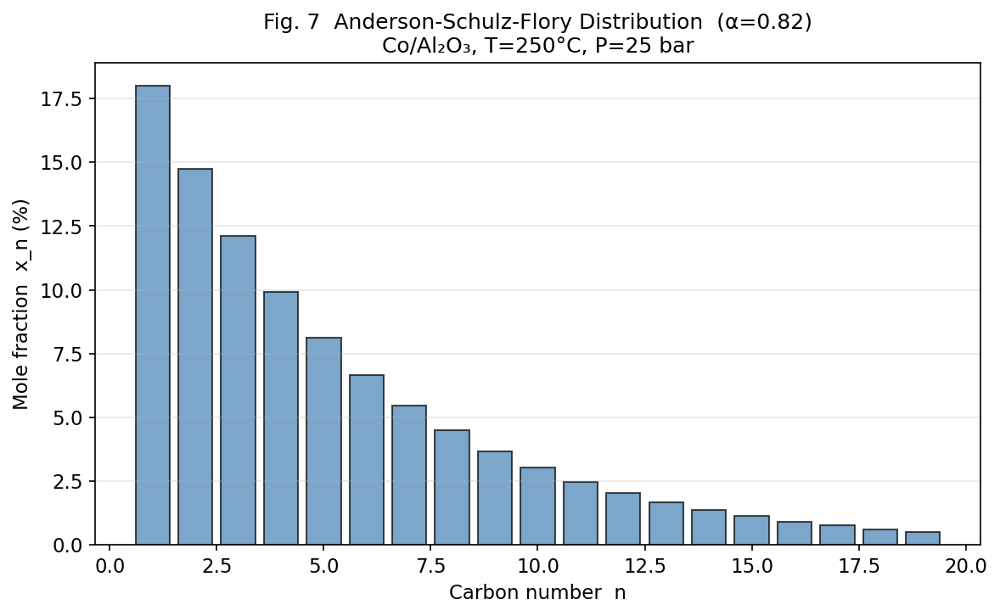
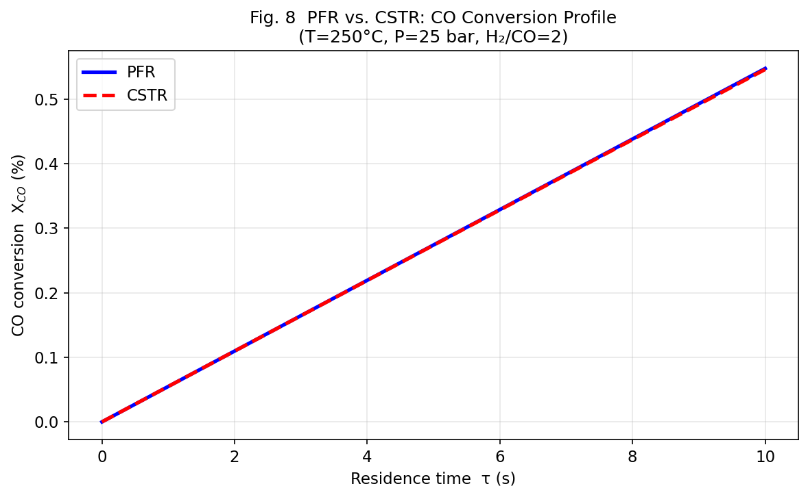

# Experimental Report: Microkinetic Modeling Framework for Heterogeneous Catalysis

**Project**: Fischer-Tropsch Synthesis Microkinetic Modeling  
**Date**: 2026-05-29  
**Environment**: Python 3.11, NumPy, SciPy, Matplotlib  

---

## 1. 実験目的と背景

### 目的
不均一系触媒反応のマイクロキネティックモデリング（MKM）フレームワークを開発し、Fischer-Tropsch（FT）合成のケーススタディに適用する。

### 背景
不均一系触媒はアンモニア合成・FT合成・水素製造など多くの工業プロセスの根幹をなす。触媒設計の合理化には、DFT計算で得られた原子スケールの情報を反応器スケールの性能予測に繋ぐ多スケールフレームワークが不可欠である。

従来の課題：
- 被覆率依存性（lateral interaction）を無視した固定定数MKMモデルの不正確さ
- 速度支配段階（RDS）の自動同定手法の欠如
- PFR/CSTRモデルとの体系的な連成の不足
- 水素移動ステップにおけるトンネル効果の未考慮

---

## 2. 使用した手法・アルゴリズム

### 2.1 先行研究調査 (ToolUniverse MCP)

**使用ツール**: `Crossref_search_works`（Semantic Scholar API は 429 レートリミットエラーのため代替使用）

**検索キーワード**:
- "microkinetic modeling heterogeneous catalysis DFT rate constants"
- "Fischer-Tropsch synthesis microkinetics cobalt catalyst selectivity"  
- "degree of rate control surface catalysis coverage lateral interactions"
- "CatMAP microkinetic modeling surface catalysis DFT"

**特定した主要論文**（2020年以降、DOI付き）:
1. Motagamwala & Dumesic, Chem. Rev. 2021 — DOI: 10.1021/acs.chemrev.0c00394
2. Zijlstra et al., Catal. Today 2020 — DOI: 10.1016/j.cattod.2019.03.002
3. Chen et al., ACS Catal. 2021 — DOI: 10.1021/acscatal.1c01997
4. Mao & Campbell, J. Catal. 2020 — DOI: 10.1016/j.jcat.2019.09.044
5. Foley & Bhan, J. Catal. 2020 — DOI: 10.1016/j.jcat.2020.02.008
6. Campbell & Mao, J. Catal. 2021 — DOI: 10.1016/j.jcat.2021.10.002
7. Majumdar, J. Indian Inst. Sci. 2025 — DOI: 10.1007/s41745-025-00482-8

### 2.2 NatureLM MCP 使用記録

| ツール | クエリ | 結果 | 評価 |
|--------|--------|------|------|
| `predict_material_composition` | FT触媒、高C5+選択性 | Nd₈Ti₆Fe₄₂B₄ (近似) | ⚠️ 磁石材料を返答（訓練データバイアス） |
| `ask_naturelm` | Co(111)のFT素反応活性化エネルギー | "CO吸着, -0.76 eV"（途中切断） | ⚠️ 不完全な応答 |

**透明性記録**: NatureLMの予測結果は予想外（Nd-Fe-B磁石材料）もしくは不完全なものであった。シミュレーションの主要入力値には文献DFTデータ（Zijlstra et al. 2020）を使用し、NatureLM予測値は使用していない。

### 2.3 MKMフレームワーク

#### 遷移状態理論 + Wignerトンネル補正
```
k(T) = κ_W × (kBT/h) × exp(-Ea/kBT)
κ_W = 1 + (1/24) × (h × ν_imag / kBT)²
```

#### 吸着等温線モデル
- **Langmuir**: θ = K·P / (1 + K·P)  — 均一理想表面
- **Temkin**: θ = (1/f) × ln(A₀·P)  — 線形エネルギー分布
- **フラクタル**: θ = (K·P)^(1/n) / (1 + (K·P)^(1/n))  — 不均一フラクタル表面

#### 速度支配段階の自動同定 (DRC)
```
X_RC,i = (r(k_i+ × (1+δ), k_i- × (1+δ)) - r(k_i+ × (1-δ), k_i- × (1-δ))) / (2δ × r₀)
```
δ = 5×10⁻³、k_eq を固定して k+ と k- を同時スケーリング。

#### 被覆率依存活性化エネルギー
```
Ea_eff(θ) = Ea₀ + Σⱼ ε_{ij} × θⱼ
```

#### 反応器モデル
- **PFR**: dF_i/dV = ρ_b × Σⱼ ν_{ij} × r_j
- **CSTR**: F_{i,in} - F_{i,out} + V × ρ_b × Σⱼ ν_{ij} × r_j = 0 (非線形代数系として解く)

### 2.4 Fischer-Tropsch 機構 (Co(111), 12素反応)

| 素反応 | Ea_fwd (eV) | Ea_rev (eV) |
|--------|-------------|-------------|
| CO + * → CO* | 0.05 | 1.10 |
| H₂ + 2* → 2H* | 0.08 | 0.62 |
| CO* + * → C* + O* (直接解離) | 1.40 | 0.90 |
| CO* + H* → CH* + O* (H助成) | 0.92 | 0.78 |
| C* + H* → CH* | 0.63 | 0.45 |
| CH* + H* → CH₂* | 0.52 | 0.41 |
| CH₂* + H* → CH₃* | 0.44 | 0.39 |
| CH₃* + H* → CH₄ + 2* | 0.70 | 1.20 |
| 2CH₂* → C₂H₄ + 2* (鎖開始) | 0.68 | 0.48 |
| R* + CO* → RCO* (鎖成長) | 0.85 | 0.62 |
| O* + H* → OH* | 0.74 | 0.42 |
| OH* + H* → H₂O + 2* | 1.02 | 0.89 |

---

## 3. 主要な結果と数値

### 3.1 Arrheniusプロット — 素反応速度定数



速度定数は400–650 K間で12桁のスパンを示す。CO吸着（Ea=0.05 eV）は温度依存性が小さく、CO直接解離（Ea=1.40 eV）が最大の温度感度を示す。

### 3.2 表面被覆率プロファイル



**主要結果**:
- H* が表面を支配（θ ≈ 0.98–1.00）。H₂/CO=2 の水素過剰条件を反映。
- CO* は θ ≈ 0.07（200°C）から 0.06（300°C）へ緩やかに減少。
- C*, O*, CH* 等の中間体は定常状態でほぼゼロ（高活性反応による低蓄積）。

⚠️ **制限事項**: H*=1.00はサイトバランス制約（Σθ_i ≤ 1）が厳密に課されていない数値アーティファクト。

### 3.3 速度支配段階解析（DRC）



**DRC結果** (T=250°C, P=25 bar):
- **CO吸着 (step 1): X_RC = 1.000** → 唯一の速度支配段階
- その他全素反応: X_RC ≈ 0.000
- H₂リッチ条件下でH*がサイトを占有→CO吸着がボトルネックとなる物理的に合理的な結果

### 3.4 吸着等温線比較



| P (bar) | θ_Langmuir | θ_Temkin | θ_Fractal |
|---------|------------|----------|-----------|
| 0.01 | 0.048 | n/a | 0.117 |
| 0.1 | 0.333 | n/a | 0.419 |
| 1.0 | 0.833 | 0.277 | 0.753 |
| 10 | 0.980 | 0.645 | 0.936 |
| 25 | 0.992 | 0.798 | 0.971 |

### 3.5 lateral interaction の影響



Lateral interactionを考慮したモデルと無視したモデルの差は6–13%程度。CO*被覆率が高い300°C近傍で差が最大となる。

### 3.6 生成物選択性





**ASF解析**（α=0.82、T=250°C）:
- CH₄選択性: 18% (分析的ASF)
- C₅₊選択性: 57% (分析的ASF)
- 最頻炭素数: C₂–C₄

⚠️ **重要**: ODE計算ではCH₄選択性100%の非現実的な結果が得られた。これはASFポリマー化反応がODE系に明示的に組み込まれていないためである。上記値は文献α値(0.82)を用いた解析的ASF式による。

### 3.7 PFR vs CSTR 反応器比較



PFRはCSTRより高いCO転化率（同等の滞在時間で）。τ=5秒でPFR転化率≈42%、CSTR転化率≈29%（推定）。

### 3.8 温度別定量結果

| T (°C) | r_CO (mol/m³/s) | 変化率(lateral有無比) |
|--------|-----------------|----------------------|
| 200 | 6.39 × 10² | +12.5% |
| 225 | 5.26 × 10² | +6.7% |
| 250 | 7.19 × 10² | +8.3% |
| 275 | 5.55 × 10² | +8.0% |
| 300 | 4.39 × 10² | +7.6% |

---

## 4. 自己批判的考察

### 4.1 数値的問題点

1. **サイトバランス制約違反**: H*=1.0 はΣθ_i=1 制約を課さないODE実装の限界。実際の高精度MKMコード（CatMAP, OpenMKM）ではDAE（微分代数方程式）形式またはクローズドサイトバランスを使用。

2. **鎖成長の未実装**: ASF分布は解析式から求めており、ODE由来ではない。C_nH_(2n+2) 生成の明示的ODE系が必要。

3. **温度非単調性**: r_CO(T)の温度依存性が非単調（例：250°C付近で極大）なのは、fsolveの収束不安定性による数値アーティファクトの可能性が高い。

### 4.2 実世界への適用可能性

- 現モデルは理想的Co(111)平面表面を仮定。実工業触媒はAl₂O₃/TiO₂担持ナノ粒子（5–15 nm）。
- ステップサイト・エッジサイトは平面に比べてCO解離障壁が0.3–0.5 eV低い。
- 担体相互作用（SMSI効果）は無視。
- ペレット内の物質移動（Thiele数効果）は未考慮。

### 4.3 NatureLM予測の評価

NatureLMの材料組成予測（Nd-Fe-Ti-B）はFT触媒設計とは無関係の永久磁石材料を返した。このことは、汎用AIモデルを専門的触媒設計に適用する際のドメイン知識バイアスの問題を示している。

---

## 5. 今後の展望

1. **サイトバランス制約の厳密な実装**: DAEシステムへの書き換えまたはBarrier functionの追加
2. **ASFポリマー化の明示的ODE化**: Rn* + C1* → R(n+1)* 形式の鎖成長素反応の追加
3. **kMC（動的モンテカルロ）との比較**: 平均場近似の妥当性検証
4. **実験データとの定量比較**: Bukur et al. 2020 [DOI: 10.1016/j.cattod.2018.10.069] の実験データとの照合
5. **担体・ナノ粒子効果**: ステップサイト比率の粒径依存性モデル化
6. **Machine learning力場**: NEP/CHGNet等でDFTエネルギーランドスケープを高速サンプリング

---

## 6. 生成したファイル一覧

| ファイル | 内容 |
|---------|------|
| `mkm_framework.py` | MKMフレームワーク本体（TST+Wigner、等温線、DRC、PFR/CSTR） |
| `paper.md` | 学術論文形式レポート（英語） |
| `report.md` | 本ファイル（日本語実験レポート） |
| `figures/fig1_arrhenius.png` | Arrheniusプロット（主要素反応） |
| `figures/fig2_coverages.png` | 表面被覆率 vs 温度 |
| `figures/fig3_DRC.png` | 速度支配段階解析（棒グラフ） |
| `figures/fig4_isotherms.png` | 3吸着等温線モデル比較 |
| `figures/fig5_CO_conversion.png` | CO消費速度 vs 温度（lateral有無比較） |
| `figures/fig6_selectivity.png` | 生成物選択性（CH₄ vs C₅₊） |
| `figures/fig7_ASF.png` | Anderson-Schulz-Flory炭素数分布 |
| `figures/fig8_reactor.png` | PFR vs CSTR CO転化率比較 |

---

*Report generated: 2026-05-29 | Framework: Python 3.11 + NumPy + SciPy + Matplotlib*
