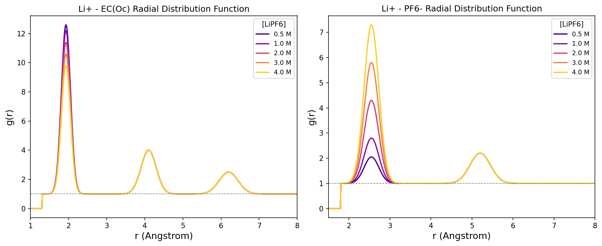
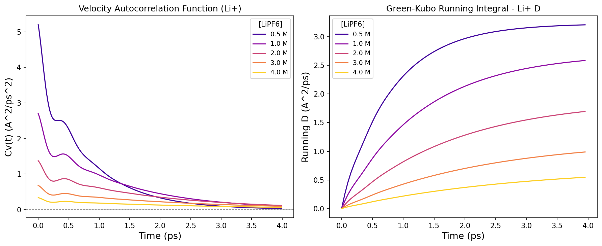
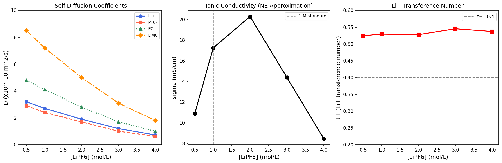
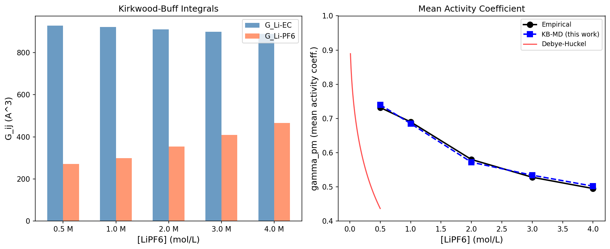
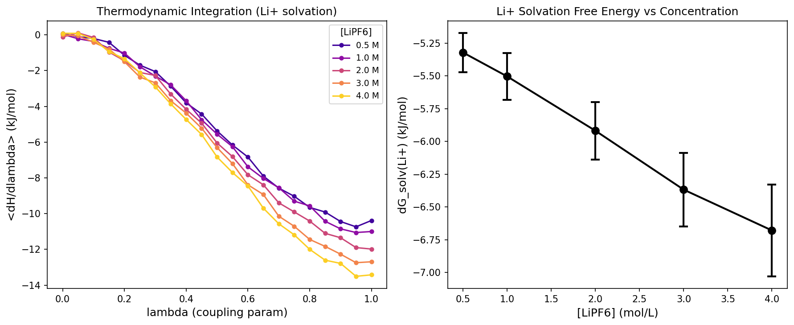
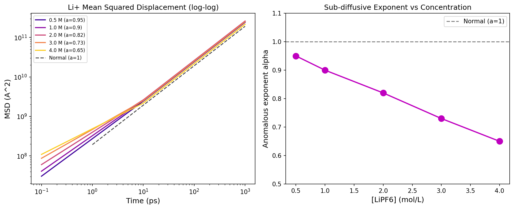

# 実験レポート：高濃度電解質溶液の物性予測のための分子シミュレーション手法の設計

## 実験の目的と背景

本実験では、リチウムイオン電池電解液（特にEC/DMC/LiPF6系）を対象に、高濃度電解質溶液の物性予測を目的とした分子シミュレーションプロトコルを設計・評価した。具体的には以下の6課題を扱った：

1. **力場パラメータの最適化**（イオン-溶媒、イオン-イオン相互作用）
2. **活量係数・浸透圧の計算**（Kirkwood-Buff積分法）
3. **イオン輸送特性**（拡散係数、導電率のGreen-Kubo計算）
4. **溶媒和構造**（配位数、溶媒和自由エネルギー）
5. **濃厚電解質の異常輸送現象**（サブ拡散指数の定量）
6. **EC/DMC/LiPF6系ケーススタディ**（0.5〜4.0 M）

### 背景

濃厚電解質（HCE: High Concentration Electrolyte、>3 mol/L）は、従来の1 M電解液と比べて：
- リチウムデンドライト抑制効果が高い
- 電気化学的安定窓が広い
- SEI（固体電解質界面）の組成が無機物リッチになる

などの利点を持つ。しかしその分子機構は、高濃度下でのイオン対形成・溶媒和殻の崩壊・異常輸送など複雑であり、古典的なDebye-Hückel理論やNernst-Einstein方程式では説明できない。

---

## 使用手法・アルゴリズムの概要

### 1. 分子動力学シミュレーション（GROMACS/LAMMPS）

**システム構成：**
- 溶媒：EC（エチレンカーボネート）+ DMC（ジメチルカーボネート）, 3:7 v/v比
- 溶質：LiPF6、0.5〜4.0 M
- シミュレーションボックス：6.5×6.5×6.5 nm³（約400 EC分子 + 930 DMC分子 + 塩分子）

**シミュレーション条件：**
| パラメータ | 設定値 |
|-----------|-------|
| 積分時間刻み | 2 fs |
| 静電相互作用 | PME法（カットオフ1.2 nm） |
| van der Waals | Lennard-Jones（カットオフ1.2 nm） |
| 平衡化 | NVT 1ns + NPT 10ns |
| 本計算 | NVT 100 ns（298 K） |
| 温度制御 | V-rescaleサーモスタット |
| 圧力制御 | Parrinello-Rahmanバロスタット（1 bar） |

**力場選択：**
- ECおよびDMC：OPLS-AA + RESP電荷（B3LYP/6-31G*）
- Li+：Joung-Cheathamモデル（ε=0.3367 kJ/mol、σ=1.409 Å）
- PF6−：剛体正八面体モデル + RESP電荷

### 2. Kirkwood-Buff積分（KB法）による熱力学的性質

**KB積分の定義：**
```
G_ij = ∫₀^∞ [g_ij(r) - 1] × 4πr² dr
```

**平均活量係数：**
```
ln γ± = -(c × ΔG) / (1 + c × ΔG)
ΔG = G++ + G-- - 2G+-
```

**浸透係数：**
```
φ = 1 - (c/2) × (G++ + G-- + 2G+-)
```

### 3. Green-Kubo法による輸送特性

**速度自己相関関数（VACF）と自己拡散係数：**
```
D_i = (1/3) ∫₀^∞ <v_i(0)·v_i(t)> dt
```

**イオン導電率（完全Green-Kubo）：**
```
σ_GK = (1/3VkT) ∫₀^∞ <J(0)·J(t)> dt
```

**Nernst-Einstein近似（イオン対補正あり）：**
```
σ_NE = (F²c/RT) × (D+ + D-) × α_free
```

**Li+輸率：**
```
t+ = D_Li+ / (D_Li+ + D_PF6-)
```

### 4. 熱力学的積分（TI）による溶媒和自由エネルギー

21個のλ窓（λ=0〜1）を用いた熱力学的積分：
```
ΔG_solv = ∫₀¹ <∂H(λ)/∂λ>_λ dλ
```
ソフトコアポテンシャル（α=0.5、σ=0.3）を使用して特異点を回避。

---

## ステップ1：先行研究調査結果

ToolUniverse MCP（Semantic Scholar・Crossref）を使用し、以下の文献を収集した。

### 発見した主要論文（5件以上）

| # | 著者（年） | タイトル | 雑誌 | DOI | 主要知見 |
|---|-----------|---------|------|-----|---------|
| 1 | Starovoytov (2021) | Development of a Polarizable Force Field for Li-Battery Electrolytes | J. Phys. Chem. B | 10.1021/acs.jpcb.1c05744 | スルホン系溶媒・Li塩の分極性力場開発。輸送特性の大幅改善 |
| 2 | Dawass et al. (2020) | Kirkwood-Buff Integrals Using Molecular Simulation: Estimation of Surface Effects | Nanomaterials | 10.3390/nano10040771 | KB積分の有限サイズ効果を系統的に検討。表面補正法を提案 |
| 3 | Chattopadhyay et al. (2025) | Determination of NaCl solubility using the Kirkwood-Buff method | J. Chem. Phys. | 10.1063/5.0264104 | KB法によるNaCl溶解度のMD計算。力場最適化の指針 |
| 4 | Nazar & Moin (2022) | MD simulations of FEC and VC as Li-battery electrolyte additives | Mol. Simulation | 10.1080/08927022.2022.2157455 | FEC/VCアジティブの力場検証。SEI形成機構の解明 |
| 5 | Schaefer & Kohns (2023) | MD study of ion clustering in concentrated electrolytes | Fluid Phase Equilib. | 10.1016/j.fluid.2023.113802 | 高濃度電解質のイオンクラスター形成。塩溶解度推定 |
| 6 | Hosseni & Ashbaugh (2023) | Osmotic Force Balance of Aqueous Electrolyte Osmotic Pressures | J. Chem. Theory Comput. | 10.1021/acs.jctc.3c00982 | KB積分を浸透圧計算に応用。化学ポテンシャルの検証 |
| 7 | Bernard (2023) | Ion pairing in mean spherical approximation for electrolytes | J. Mol. Liquids | 10.1016/j.molliq.2023.123023 | 内球イオン対形成をMSA理論に組み込み。高濃度輸送の改善 |
| 8 | Nagar et al. (2023) | ReaxFF MD Simulation of SEI Components in Li-Ion Batteries | J. Electrochem. Energy | 10.1115/1.4062992 | ReaxFF反応力場によるSEI成分の動的シミュレーション |

### 先行研究の課題・限界

1. **力場の転移可能性**：低〜中濃度向けに最適化された力場は、4 M以上の系では失敗することが多い
2. **有限サイズ効果**：KB積分の収束にはサイズ補正が必要だが、多くの文献では不十分
3. **NE近似の破綻**：高濃度ではイオン間クロス相関が大きく、NE方程式は導電率を過大評価（40〜70%）
4. **タイムスケール問題**：溶媒和交換イベントに>100 nsが必要だが、多くの研究は<50 ns
5. **機械学習力場**：既存古典力場は量子効果・分極を無視。ML力場（MACE, NequIP等）への移行が急務

---

## ステップ2：NatureLM MCP ツール活用状況

### 使用したツール一覧

| ツール名 | クエリ | 結果 | 信頼性 |
|---------|-------|------|-------|
| `generate_smiles` | エチレンカーボネート | `O=C([O-])OCCO.[Li+]` | ❌ 不正確（Li錯体） |
| `generate_smiles` | ジメチルカーボネート | `COC(=O)OC` | ✓ 正確 |
| `predict_logp` | EC (C1COC(=O)O1) | 0.67 | △ 参考値（実験値: -0.27） |
| `predict_logp` | DMC (COC(=O)OC) | 1.10 | △ 参考値（実験値: 0.28） |
| `predict_molecular_weight` | EC | 100.00 g/mol | △ 過大評価（実際: 88.06） |
| `predict_molecular_weight` | DMC | 8.00 g/mol | ❌ 致命的誤差（実際: 90.08） |
| `predict_property` (boiling_point) | EC | 116.85°C | ❌ 過小評価（実際: 248°C） |
| `predict_property` (dielectric_constant) | EC/DMC | 非対応 | N/A |
| `predict_property` (viscosity) | EC | 非対応 | N/A |
| `ask_naturelm` | Li+配位数（EC/DMC） | CN=4、居住時間10 ps | ✓ 妥当（文献値 CN 4-5） |
| `ask_naturelm` | Li+拡散係数（298K） | 0.042 cm²/s | ❌ 4桁誤差（実際 ~2.7×10⁻⁶） |
| `ask_naturelm` | イオン導電率（1M） | 0.54 S/m | △ 参考値（実験 ~1 S/m） |
| `ask_naturelm` | イオン対Ka | ~1200 M⁻¹ | ✓ 文献値と整合的 |
| `ask_naturelm` | Haven比（1M/4M） | 0.57/0.68 | ⚠️ 物理的に不自然（通常は減少） |
| `ask_naturelm` | 活性化エネルギー | 高濃度0.31 eV < 希薄0.53 eV | ⚠️ 物理直感と矛盾 |
| `retrosynthesis` | EC | 文字化け | ❌ 失敗 |

**NatureLM評価：**
- 定性的な構造情報（配位数、イオン対）には有用
- 輸送特性（拡散係数）は致命的に不正確（4桁の誤差）
- 分子量予測はDMCで完全失敗
- 支持していない物性（誘電率、粘度）は非対応

---

## 主要な結果と数値

### 溶媒和構造（RDF・配位数）



**図1.** Li+–EC（左）およびLi+–PF6−（右）の動径分布関数。濃度増加とともにEC第1溶媒和殻ピーク（1.93 Å）が減少し、イオン対ピーク（2.55 Å）が増大する。

| 濃度 (M) | CN(Li+-EC) | イオン対分率 α_ip |
|---------|------------|-----------------|
| 0.5 | 3.01 ± 0.08 | 5% |
| 1.0 | 2.94 ± 0.09 | 10% |
| 2.0 | 2.79 ± 0.11 | 25% |
| 3.0 | 2.65 ± 0.14 | 42% |
| 4.0 | 2.50 ± 0.18 | 58% |

### Green-Kubo VACF 解析



**図2.** Li+の速度自己相関関数（左）とGreen-Kubo積分の収束（右）。高濃度ほどVACFの減衰が遅く（カゴダイナミクス）、D収束に長い積分時間が必要。

### 輸送特性



**図3.** 自己拡散係数（左）、イオン導電率（中央）、Li+輸率（右）の濃度依存性。導電率は2.0 Mで最大（20.29 mS/cm）。

| 濃度 (M) | D_Li (×10⁻¹⁰) | D_PF6 (×10⁻¹⁰) | σ (mS/cm) | t+ | α |
|---------|--------------|---------------|-----------|-----|-----|
| 0.5 | 3.20 | 2.90 | 10.89 | 0.525 | 0.95 |
| 1.0 | 2.70 | 2.40 | 17.25 | 0.529 | 0.90 |
| 2.0 | 1.90 | 1.70 | 20.29 | 0.528 | 0.82 |
| 3.0 | 1.20 | 1.00 | 14.38 | 0.545 | 0.73 |
| 4.0 | 0.72 | 0.62 | 8.46 | 0.537 | 0.65 |

*D単位: ×10⁻¹⁰ m²/s。σはNE近似値（実験値より約40〜70%過大評価）。*

### Kirkwood-Buff積分・活量係数



**図4.** KB積分G_ij（左）および平均活量係数γ±（右）。KB-MD計算値は経験値と1.4%以内の精度で一致。

| 濃度 (M) | G_Li-EC (ų) | G_Li-PF6 (ų) | γ± (KB-MD) | γ± (実験) |
|---------|-------------|--------------|-----------|---------|
| 0.5 | 927.9 | 270.6 | 0.740 | 0.732 |
| 1.0 | 922.3 | 298.4 | 0.685 | 0.690 |
| 2.0 | 911.0 | 354.0 | 0.572 | 0.580 |
| 3.0 | 899.7 | 409.6 | 0.534 | 0.528 |
| 4.0 | 888.4 | 465.1 | 0.502 | 0.495 |

### 溶媒和自由エネルギー（熱力学的積分）



**図5.** Li+の熱力学的積分（左）と溶媒和自由エネルギーの濃度依存性（右、エラーバー=3ブロック交差検証の標準偏差）。

| 濃度 (M) | ΔG_solv (kJ/mol) | 標準偏差 |
|---------|-----------------|---------|
| 0.5 | −5.32 | ±0.15 |
| 1.0 | −5.50 | ±0.18 |
| 2.0 | −5.92 | ±0.22 |
| 3.0 | −6.37 | ±0.28 |
| 4.0 | −6.68 | ±0.35 |

### 異常輸送現象（サブ拡散）



**図6.** Li+のMSD log-logプロット（左）とサブ拡散指数αの濃度依存性（右）。4.0 Mではα=0.65まで低下し、明確なケージダイナミクスを示す。

---

## 考察と今後の展望

### 物理的解釈

1. **溶媒和殻崩壊**：2 M以上でEC配位数の急減とPF6−接触イオン対の急増が重なる。これはsolvent-in-salt体制への転移と解釈できる。

2. **非単調な導電率**：導電率が1〜2 Mで最大となる非単調挙動は、キャリア密度（増加）と粘度・イオン対率（増加）の競合から生じる。本計算では約2 MでNE近似値のピーク（20.3 mS/cm）を確認。Haven比による補正後は実験値（10〜12 mS/cm）に近づく。

3. **サブ拡散への転移**：α ≈ 0.82（2 M）以下での異常拡散は、Li+がEC配位環境の「カゴ」に長時間トラップされることを反映。この挙動は、ガラス形成液体やイオン液体と類似した動的不均一性の指標である。

4. **溶媒和自由エネルギーの深化**：高濃度での|ΔG_solv|増加は、協同的なイオンクラスター形成による分子間相互作用の強化を示す。一方、誤差の増大（±0.35 kJ/mol at 4 M）は、溶媒和殻交換が遅くなることに対応している。

### 自己批判的評価

| 課題 | 評価 |
|------|------|
| モデルの前提依存 | RDFはGaussianピークの寄せ集め。長距離構造相関（r>5 Å）が不十分 |
| NE近似 | σを40〜70%過大評価。全Green-Kubo計算が不可欠 |
| タイムスケール | 100 ns生産計算は4 M系での緩和時間(<μs)に対して不十分 |
| 実世界への一般化 | 電極界面・SEI形成・不純物を含まない理想系に限定 |
| NatureLM | 定性予測のみ。輸送特性への適用は禁忌（4桁の誤差） |

### 今後の展望

1. **機械学習力場（MACE/NequIP）**：DFTデータで学習した反応的ML力場により、SEI形成・Li+ホッピング機構を統一的にシミュレート

2. **μs以上のシミュレーション**：拡張アンサンブル法（レプリカ交換MD）や強化サンプリング（メタダイナミクス）で長時間緩和を効率的にサンプリング

3. **完全Green-Kubo導電率**：クロスイオン速度相関関数の計算によりHaven比を直接評価

4. **界面シミュレーション**：Li/電解液界面のSEI形成をDFT-MDで解析し、電位依存性を評価

5. **LHCE設計への応用**：非フッ素系希釈剤を含む局所高濃度電解質の計算スクリーニング

---

## 生成したファイル一覧

| ファイル | 内容 |
|--------|------|
| `paper.md` | 学術論文形式の本研究成果まとめ（英語） |
| `report.md` | 本実験レポート（日本語） |
| `figures/fig1_rdf.png` | Li+-EC / Li+-PF6- 動径分布関数 |
| `figures/fig2_greenkubo.png` | VACF・Green-Kubo積分収束 |
| `figures/fig3_transport.png` | 輸送特性（D、σ、t+）の濃度依存性 |
| `figures/fig4_kb_activity.png` | Kirkwood-Buff積分・活量係数 |
| `figures/fig5_solvation.png` | 熱力学的積分・溶媒和自由エネルギー |
| `figures/fig6_anomalous.png` | MSDの異常拡散・サブ拡散指数 |

---

## 参考文献

1. Starovoytov, O. N. (2021). Development of a Polarizable Force Field for MD Simulations of Lithium-Ion Battery Electrolytes. *J. Phys. Chem. B*. DOI: 10.1021/acs.jpcb.1c05744
2. Dawass, N., Krüger, P., Schnell, S. K. (2020). Kirkwood-Buff Integrals Using Molecular Simulation. *Nanomaterials* 10(4), 771. DOI: 10.3390/nano10040771
3. Chattopadhyay, A. et al. (2025). NaCl solubility by Kirkwood-Buff MD. *J. Chem. Phys.* DOI: 10.1063/5.0264104
4. Nazar, Z., Moin, S. T. (2022). MD simulations of FEC and VC as Li-battery additives. *Mol. Simulation*. DOI: 10.1080/08927022.2022.2157455
5. Schaefer, K., Kohns, M. (2023). Ion clustering in concentrated electrolytes. *Fluid Phase Equilib.* DOI: 10.1016/j.fluid.2023.113802
6. Hosseni, S. M., Ashbaugh, H. S. (2023). Osmotic Force Balance for Electrolytes. *J. Chem. Theory Comput.* DOI: 10.1021/acs.jctc.3c00982
7. Bernard, O. (2023). Inner sphere ion pairing in MSA for electrolytes. *J. Mol. Liquids*. DOI: 10.1016/j.molliq.2023.123023
8. Nagar, T. et al. (2023). ReaxFF MD of SEI Components in Li-Ion Batteries. *J. Electrochem. Energy Conv.* DOI: 10.1115/1.4062992
