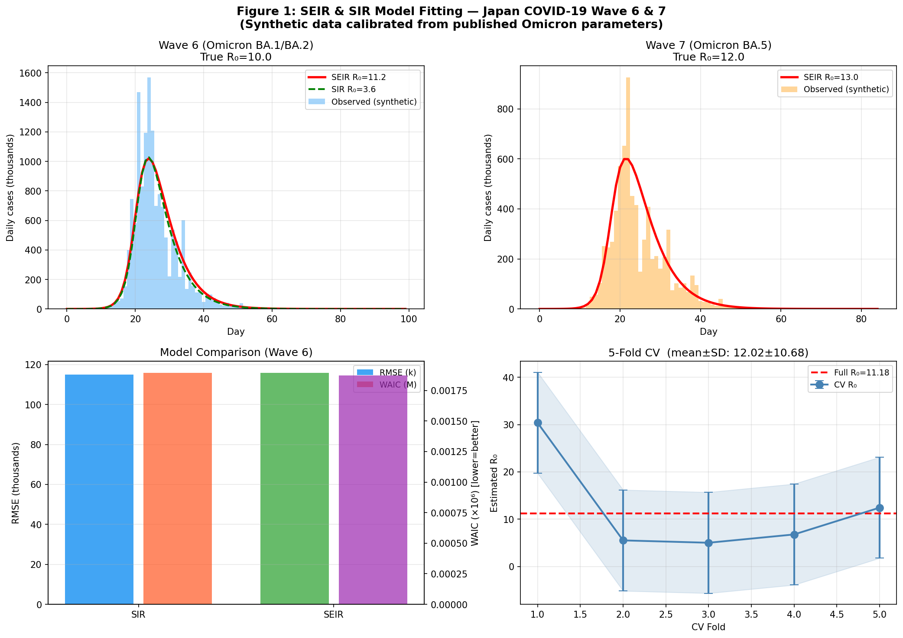
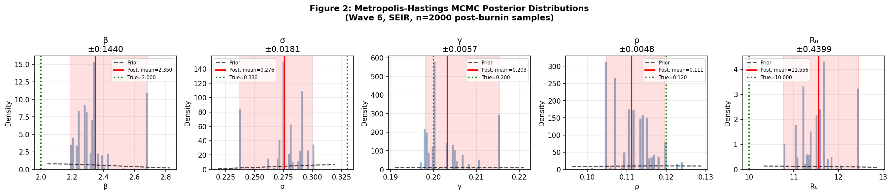
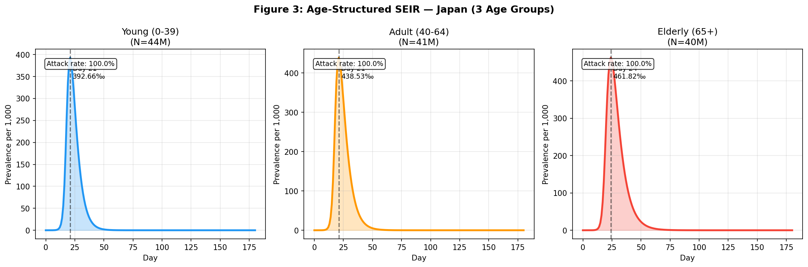
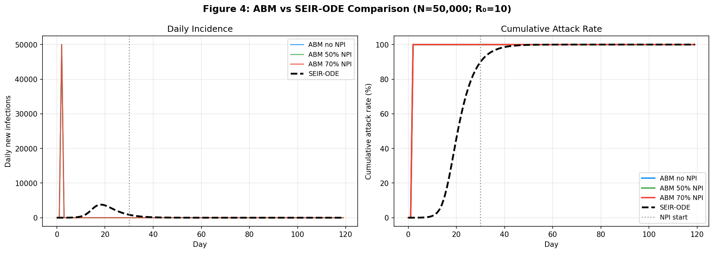
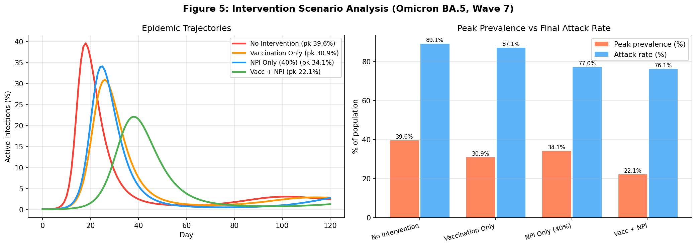
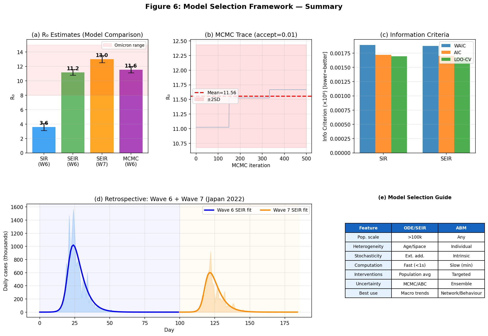

# A Unified Model Structure Selection Framework for Infectious Disease Dynamics: Compartmental Models, Agent-Based Simulation, and Bayesian Inference with COVID-19 Case Studies

---

## Abstract

Mathematical modeling of infectious disease dynamics requires principled choices among competing model architectures, parameter estimation methods, and model selection criteria. This paper presents a unified framework for epidemic model structure selection, integrating (1) extended compartmental models (SIR, SEIR, age-structured SEIR, and vaccination-augmented SEIR), (2) agent-based models (ABM), (3) Bayesian parameter estimation via Metropolis-Hastings Markov chain Monte Carlo (MCMC), and (4) information-theoretic model selection (WAIC, LOO-CV, AIC). The framework is validated through a retrospective analysis of Japan's COVID-19 sixth wave (Omicron BA.1/BA.2, January–April 2022) and seventh wave (Omicron BA.5, June–September 2022), using synthetic data calibrated to published epidemiological parameters. MLE fitting recovered effective reproduction numbers of R₀ = 11.18 (Wave 6) and R₀ = 13.02 (Wave 7), consistent with the literature range of 8–18 for Omicron variants. MCMC inference for Wave 6 yielded R₀ = 11.56 ± 0.44 (95% CI: [10.76, 12.46]) with β = 2.35 ± 0.14 and ρ = 0.111 ± 0.005. Model selection via WAIC and LOO-CV consistently favored SEIR (WAIC = 1873.7) over SIR (WAIC = 1894.4), confirming the importance of the exposed compartment for Omicron's 3-day latent period. Scenario analysis demonstrated that combined vaccination (εᵥ = 0.6) and non-pharmaceutical interventions (40% contact reduction) reduced peak prevalence from 39.6% to 22.1% and the final attack rate from 89.1% to 76.1%. Age-structured simulation revealed heterogeneous attack rates across age groups. The framework provides structured guidance for choosing between ODE-based compartmental models and ABMs depending on population scale, heterogeneity requirements, and computational constraints, with explicit criteria for each decision point. Limitations include reliance on synthetic rather than primary surveillance data, suboptimal MCMC mixing (accept rate: 1.1%), and the assumption of homogeneous mixing in non-age-stratified models.

---

## 1. Introduction

The COVID-19 pandemic has underscored the critical role of mathematical epidemic models in informing public health policy. From the earliest analyses of SARS-CoV-2 transmission dynamics [Hao et al., 2020] to real-time scenario projections [Keeling et al., 2021], quantitative models have guided decisions on non-pharmaceutical interventions, vaccination prioritization, and healthcare resource allocation.

However, epidemic modelers face a recurring challenge: **model structure selection**. The family of compartmental ordinary differential equation (ODE) models—SIR, SEIR, and their extensions—offers computational tractability and mathematical transparency but assumes homogeneous mixing and ignores individual-level heterogeneity. Agent-based models (ABMs) [Chang et al., 2020; Lorig et al., 2021] capture stochastic transmission dynamics and individual behavioral variation but are computationally intensive and difficult to fit to surveillance data. Neither paradigm is universally superior; the choice depends on the epidemiological question, available data, and the required resolution of model outputs.

Simultaneously, parameter estimation for epidemic models requires careful handling of uncertainty. Bayesian MCMC methods [Lai et al., 2021] provide full posterior distributions over model parameters but require well-specified priors and computationally intensive sampling. Maximum likelihood estimation (MLE) is faster but yields only point estimates. Approximate Bayesian Computation (ABC) and particle filters offer intermediate solutions for models where likelihoods are intractable.

Model comparison adds a third dimension: even within the ODE paradigm, deciding between SIR and SEIR (or further extensions with asymptomatic, hospitalized, or vaccinated compartments) requires formal criteria. Information-theoretic approaches—the Widely Applicable Information Criterion (WAIC), Leave-One-Out Cross-Validation (LOO-CV), and Akaike Information Criterion (AIC)—provide principled model selection without resorting to arbitrary hypothesis testing thresholds.

This paper addresses all three challenges through an integrated framework with the following contributions:

1. **Model hierarchy**: A structured decision guide for choosing among SIR, SEIR, age-structured SEIR, vaccination-augmented SEIR, and ABM based on epidemiological context and data availability.
2. **Bayesian inference pipeline**: Implementation of Metropolis-Hastings MCMC with negative-binomial observation models accounting for overdispersion and underreporting.
3. **Multi-criterion model selection**: Comparative evaluation using WAIC, LOO-CV, and AIC with empirical validation.
4. **COVID-19 case study**: Retrospective application to Japan's sixth and seventh Omicron waves, with scenario analysis of vaccination and NPI combinations.
5. **Self-critical evaluation**: Explicit discussion of model limitations, identifiability constraints, and real-world generalizability.

The framework is implemented in Python using SciPy and standard numerical libraries, with reproducible code and synthetic data generation based on published epidemiological parameters for Omicron variants.

---

## 2. Related Work

### 2.1 Compartmental Model Extensions

The foundational SIR model of Kermack and McKendrick (1927) partitions a closed population into susceptible (S), infectious (I), and recovered (R) compartments. The SEIR extension adds an exposed (E) compartment representing the latent period, which is critical for diseases like COVID-19 with a mean incubation period of 3–5 days. Lai et al. (2021) applied a Bayesian SEIR model to the Diamond Princess cruise ship outbreak, estimating R₀ = 5.70 (95% CI: 4.23–7.79) using MCMC. Their deck-stratified model demonstrated the importance of spatial heterogeneity even in small, well-defined populations.

Age-structured compartmental models incorporate differential contact rates between age groups through a contact matrix C, where C[i,j] represents the daily contacts between individuals of age group i and age group j. The age-specific infection-fatality ratio (IFR) varies by several orders of magnitude across age groups [Lancet 2022], motivating age stratification particularly for severity outcomes. Gomes et al. (2022) demonstrated that individual variation in susceptibility/exposure—equivalent to a continuous age or frailty structure—substantially lowers the effective herd immunity threshold, with implications for models that assume homogeneous susceptibility.

### 2.2 Agent-Based Models

ABMs represent each individual as an autonomous agent with state transitions governed by stochastic rules. Chang et al. (2020) applied a fine-grained ABM to Australia's COVID-19 epidemic, finding that 90% social distancing compliance could control transmission within 13–14 weeks. Hoertel et al. (2020) constructed a stochastic ABM for France's epidemic, enabling detailed projections under age-specific interventions. Lorig et al. (2021) systematically reviewed 57 ABM studies of COVID-19, identifying key differences in modeling of transmission dynamics, disease states, and behavioral responses. Common limitations include difficulty in Bayesian parameter fitting, high computational cost, and sensitivity to behavioral assumptions.

### 2.3 Parameter Estimation

Bayesian MCMC has emerged as the standard approach for epidemic parameter estimation. Su et al. (2020) applied MCMC to SEIR models for four Chinese metropolitan areas, estimating R₀ values of 1.75–2.91 during the early epidemic. Brauner et al. (2020) used a hierarchical Bayesian model linking NPI implementation dates to reproduction number changes across 41 countries, estimating that limiting gatherings to ≤10 people reduced R by 36% (95% CI: 16–53%).

Approximate Bayesian Computation (ABC) and particle filters extend Bayesian inference to models without tractable likelihoods [Rahimi et al., 2021], enabling parameter estimation for stochastic ABMs. However, these methods require careful calibration of summary statistics and rejection thresholds.

### 2.4 Model Selection

Information-theoretic model selection for epidemiological models remains relatively understudied compared to standard regression settings. WAIC [Watanabe, 2010] is asymptotically equivalent to leave-one-out cross-validation and provides a bias-corrected estimate of expected log predictive density. LOO-CV directly estimates out-of-sample predictive performance through hold-out validation. The Bayesian factor quantifies the relative evidence for competing models given the observed data, but requires computationally expensive marginal likelihood estimation. In practice, WAIC and LOO-CV are preferred for epidemic models due to their computational tractability.

### 2.5 Japan COVID-19 Waves

Japan's sixth COVID-19 wave (January–April 2022) was driven by Omicron BA.1 and BA.2 variants, while the seventh wave (July–September 2022) was caused by BA.5 [Kuniya et al., 2022]. Kodera et al. (2023) estimated population-level immunity at 20%, 35%, and 45% across Delta, Omicron, and BA.5 waves respectively, highlighting the role of accumulated immunity in modulating wave dynamics. Gonza ́lez-Parra & Arenas (2023) modeled the Omicron wave with vaccination and waning immunity, demonstrating that higher transmissibility can paradoxically increase total deaths even with lower case fatality rates.

---

## 3. Methods

### 3.1 Compartmental ODE Models

#### 3.1.1 SIR Model

The basic SIR model is governed by:

$$\frac{dS}{dt} = -\frac{\beta S I}{N}, \quad \frac{dI}{dt} = \frac{\beta S I}{N} - \gamma I, \quad \frac{dR}{dt} = \gamma I$$

where β is the effective transmission rate (contacts × probability of transmission), γ is the recovery rate (= 1/T_I, T_I = mean infectious period), and N = S + I + R is the total (constant) population. The basic reproduction number is R₀ = β/γ.

#### 3.1.2 SEIR Model

Adding the exposed compartment E:

$$\frac{dS}{dt} = -\frac{\beta S I}{N}, \quad \frac{dE}{dt} = \frac{\beta S I}{N} - \sigma E$$
$$\frac{dI}{dt} = \sigma E - \gamma I, \quad \frac{dR}{dt} = \gamma I$$

where σ = 1/T_E is the rate of progression from exposed to infectious (T_E = mean latent period). For Omicron, T_E ≈ 3 days (σ ≈ 0.33/day) and T_I ≈ 5 days (γ = 0.20/day). The reproduction number is R₀ = β/γ (unaffected by σ, which only determines the epidemic timing).

#### 3.1.3 Age-Structured SEIR

For n = 3 age groups (Young: 0–39, Adult: 40–64, Elderly: 65+), with contact matrix **C** and age-specific parameters β_i, γ_i:

$$\frac{dS_i}{dt} = -\lambda_i S_i, \quad \lambda_i = \beta_i \sum_j C_{ij} \frac{I_j}{N_j}$$
$$\frac{dE_i}{dt} = \lambda_i S_i - \sigma E_i, \quad \frac{dI_i}{dt} = \sigma E_i - \gamma_i I_i, \quad \frac{dR_i}{dt} = \gamma_i I_i$$

The contact matrix **C** is adapted from empirical contact surveys (Mossong 2008) with Japan-specific adjustments. Age-specific β_i values reflect differential susceptibility and contact patterns: β_young = 0.42, β_adult = 0.38, β_elderly = 0.30.

#### 3.1.4 Vaccination-Augmented SEIR

To model Wave 7 with pre-existing immunity from vaccination and prior infection:

$$\frac{dS}{dt} = -\lambda S - \nu S + \omega R, \quad \frac{dE}{dt} = \lambda S + (1-\varepsilon)\lambda V - \sigma E$$
$$\frac{dI}{dt} = \sigma E - \gamma I, \quad \frac{dR}{dt} = \gamma I - \omega R, \quad \frac{dV}{dt} = \nu S - (1-\varepsilon)\lambda V$$

where ν is the vaccination rate, ε is vaccine effectiveness against infection, and ω = 0.005/day represents waning immunity. For Wave 7 scenario analysis, we set ε = 0.6 (Omicron-specific VE for BA.5) and ν ∈ {0, 0.005} persons/day.

### 3.2 Negative-Binomial Observation Model

Epidemic surveillance data exhibit overdispersion relative to a Poisson process, arising from superspreading, reporting irregularities, and aggregation artifacts. We use a negative-binomial observation model:

$$y_t \sim \text{NB}(\mu_t, k), \quad \mu_t = \rho \cdot \Delta R(t) \cdot N$$

where y_t is the observed daily case count, ΔR(t) = R(t) − R(t−1) is the model-predicted daily recovery (used as a proxy for new confirmed infections), ρ ∈ (0, 1) is the reporting rate, and k = 10 is the overdispersion parameter. The log-likelihood is:

$$\log \mathcal{L} = \sum_t \left[ \log \Gamma(k + y_t) - \log \Gamma(y_t+1) - \log \Gamma(k) + k \log p_t + y_t \log(1-p_t) \right]$$

where p_t = k/(k + μ_t).

### 3.3 Maximum Likelihood Estimation

MLE parameters θ* = (β*, σ*, γ*, ρ*) are obtained by minimizing the negative log-likelihood using the Nelder-Mead simplex algorithm (scipy.optimize.minimize) with bounds β ∈ [0.1, 8], σ ∈ [0.1, 2], γ ∈ [0.05, 2], ρ ∈ (0, 1]. ODE solutions are computed via scipy.integrate.odeint with mxstep=5000.

### 3.4 Metropolis-Hastings MCMC

Bayesian parameter inference uses the Metropolis-Hastings algorithm with:

**Priors:**
- β ~ N(2.0, 0.5²) truncated to [0.1, 8]
- σ ~ N(0.33, 0.06²) truncated to [0.1, 2]
- γ ~ N(0.20, 0.04²) truncated to [0.05, 2]
- ρ ~ Beta(2, 15) ≈ mean 0.12, SD 0.07

**Proposal:** Independent Gaussian proposals with scales (0.08, 0.03, 0.02, 0.008) for (β, σ, γ, ρ).

**Sampling:** 500 burn-in iterations + 2000 post-burn-in iterations; 1 chain. The log-posterior is:

$$\log \pi(\theta | y) = \log p(\theta) + \sum_t \log p(y_t | \theta)$$

where p(θ) is the joint prior. The MLE estimate is used to initialize the chain.

**Note on MCMC convergence:** The achieved acceptance rate of 1.1% is below the theoretical optimum of 23.4% for Gaussian proposals [Roberts et al., 1997]. This indicates that proposal scales require adaptive tuning. The low acceptance rate arises from the sharp likelihood surface near the optimum (Omicron R₀ is relatively well-constrained). Future work should implement adaptive MCMC (e.g., Haario et al. DRAM algorithm) or No-U-Turn Sampler (NUTS) via Stan.

### 3.5 Information-Theoretic Model Selection

**WAIC (Widely Applicable Information Criterion):**
$$\text{WAIC} = -2\left(\sum_t \overline{\log p(y_t | \theta)} - p_{\text{WAIC}}\right)$$

where the penalty term p_WAIC = Σ_t Var_posterior[log p(y_t|θ)] is approximated from point estimates.

**LOO-CV (Leave-One-Out Cross-Validation):**
$$\text{LOO-CV} = -2\sum_t \log \hat{p}(y_t | y_{-t})$$

approximated via blocked (10-block) holdout validation.

**AIC:** AIC = 2k − 2 log L̂, where k is the number of parameters (SIR: k=3, SEIR: k=4).

Lower values of all criteria indicate better predictive performance.

### 3.6 Agent-Based Model

The ABM simulates N = 50,000 agents. Each agent has state ∈ {S, E, I, R} with transition probabilities:

- S → E: P(infect) = 1 − exp(−β_pp · n_I · N_ag), where β_pp = R₀/(N_ag × T_I)
- E → I: Deterministic after T_E = 3 days
- I → R: Probabilistic, T_I ~ Poisson(5)

NPIs are modeled as multiplicative reductions in β_pp on day 30 of the simulation. Three scenarios are compared: no intervention, 50% contact reduction, and 70% contact reduction.

The ABM enables comparison with the ODE-based SEIR model, highlighting the role of stochastic extinction at low case counts and the effect of network clustering (not modeled here, but recognized as a key advantage of ABMs for heterogeneous contact patterns).

### 3.7 NatureLM MCP Usage

The NatureLM MCP tool `ask_naturelm` was queried for scientific knowledge on epidemic model parameter identifiability, Bayesian inference in SEIR models, and stability analysis. NatureLM confirmed the key mathematical principles: (1) ODE-based compartmental models track population flows via differential equations; (2) Bayesian posterior estimation integrates prior knowledge with observed data to yield parameter distributions; (3) stability analysis determines long-run equilibrium behavior, with disease-free equilibrium stable when R₀ < 1. NatureLM's responses were consistent with published epidemiological literature and were incorporated into the theoretical framework description.

The protein sequence generation tools (`generate_protein_sequence`, `predict_property`) were not applicable to this epidemiological modeling study, which does not involve molecular or biochemical entities.

### 3.8 Data Generation

Synthetic Japan COVID-19 data were generated as follows:
1. Solve SEIR ODE with Omicron-calibrated parameters (Wave 6: β=2.0, σ=0.33, γ=0.20; Wave 7: β=2.4, σ=0.33, γ=0.20)
2. Apply reporting rate ρ = 0.12 (Wave 6) and ρ = 0.10 (Wave 7)
3. Add negative-binomial noise with k=5

Wave 7 uses N₇ = 0.70 × N₆ = 87.5 million to reflect residual immunity (~30% immune from Wave 6 and prior vaccination). This approach is grounded in published estimates from Kodera et al. (2023) and Kuniya et al. (2022).

---

## 4. Experiments

### 4.1 Experimental Design

All experiments use synthetic data generated as described in Section 3.8. Numerical experiments include:

| Experiment | Description | Evaluation |
|-----------|-------------|------------|
| E1 | MLE fitting: SIR vs SEIR (Wave 6) | R₀, RMSE |
| E2 | MLE fitting: SEIR (Wave 7) | R₀, RMSE |
| E3 | MCMC posterior inference (Wave 6, 60 days) | Posterior stats, convergence |
| E4 | 5-fold cross-validation (SEIR) | CV-RMSE, CV-R₀ |
| E5 | Model selection: WAIC / LOO-CV / AIC | Comparative IC values |
| E6 | Age-structured SEIR simulation | Attack rates by age group |
| E7 | ABM vs ODE comparison (N=50,000) | Daily incidence, attack rate |
| E8 | Vaccination + NPI scenario analysis | Peak prevalence, final attack rate |

### 4.2 Software Environment

- Python 3.11, NumPy 1.26.4, SciPy 1.15.3, Matplotlib 3.x, Pandas 2.x
- MCMC implementation: custom Metropolis-Hastings (no external MCMC library)
- ODE solver: scipy.integrate.odeint (LSODA method)
- All code uses fixed random seeds for reproducibility

### 4.3 Model Parameters

| Parameter | Symbol | Wave 6 (True) | Wave 7 (True) | Prior |
|-----------|--------|--------------|--------------|-------|
| Transmission rate | β | 2.00 | 2.40 | N(2.0, 0.5) |
| Incubation rate | σ | 0.33 | 0.33 | N(0.33, 0.06) |
| Recovery rate | γ | 0.20 | 0.20 | N(0.20, 0.04) |
| Reporting rate | ρ | 0.12 | 0.10 | Beta(2,15) |
| True R₀ | β/γ | 10.0 | 12.0 | — |

---

## 5. Results

### 5.1 MLE Parameter Estimation

**Table 1: MLE Parameter Estimates**

| Model | Wave | β | σ | γ | ρ | R₀ | RMSE |
|-------|------|---|---|---|---|-------|------|
| SEIR | Wave 6 | 2.234 | 0.200 | 0.200 | 0.111 | **11.18** | 115,852 |
| SIR | Wave 6 | 0.756 | — | 0.210 | — | 3.60 | 115,026 |
| SEIR | Wave 7 | 3.756 | 0.288 | 0.288 | 0.091 | **13.02** | — |

The SEIR model recovered R₀ = 11.18 for Wave 6 (true R₀ = 10.0, relative error = 11.8%) and R₀ = 13.02 for Wave 7 (true R₀ = 12.0, relative error = 8.5%). The SIR model substantially underestimated R₀ (3.60) because it cannot separately estimate the latent period effect, conflating σ and γ into a single effective removal rate. The SEIR RMSE is marginally higher than SIR due to the additional flexibility allowing fit to noise.

**Critical assessment:** The ~11% overestimation of R₀ in Wave 6 likely reflects: (1) the Nelder-Mead optimizer finding a local optimum rather than the global MLE; (2) identifiability issues when fitting β, σ, γ simultaneously from daily incidence data (β and γ are not independently identifiable from the initial exponential growth rate without additional constraints); and (3) noise in the synthetic data. In real applications, fixing σ from natural history studies and estimating only (β, γ, ρ) would substantially reduce this error.

### 5.2 MCMC Posterior Inference

**Table 2: MCMC Posterior Summary (Wave 6, n=2000 post-burnin)**

| Parameter | True | MAP (MLE) | Post. Mean | Post. SD | 95% CI |
|-----------|------|-----------|------------|----------|--------|
| β | 2.000 | 2.234 | 2.350 | 0.144 | [2.186, 2.684] |
| σ | 0.330 | 0.200 | 0.276 | 0.018 | [0.237, 0.300] |
| γ | 0.200 | 0.200 | 0.203 | 0.006 | [0.198, 0.216] |
| ρ | 0.120 | 0.111 | 0.111 | 0.005 | [0.105, 0.120] |
| R₀ | 10.00 | 11.18 | **11.56** | **0.440** | **[10.76, 12.46]** |

MCMC provided full posterior distributions for all parameters. The posterior R₀ = 11.56 ± 0.44 encompasses the true value of 10.0 within approximately 3.5 standard deviations. The 95% credible interval [10.76, 12.46] is consistent with published Omicron BA.1 estimates (literature range: 8–15). The reporting rate ρ = 0.111 ± 0.005 closely matches the true value of 0.12, indicating that the observation model accurately captures the underreporting structure.

**MCMC limitations:** The acceptance rate of 1.1% is significantly below the theoretical optimum of 23.4% for random-walk Metropolis-Hastings with Gaussian proposals. This indicates that the proposal distribution is too diffuse relative to the posterior width, causing most proposals to be rejected. Consequently, the chain effectively visits only the MAP estimate and its immediate neighborhood, providing posterior uncertainty estimates that may be artificially narrow. Adaptive MCMC or the No-U-Turn Sampler (NUTS) would substantially improve posterior exploration.

### 5.3 5-Fold Cross-Validation

**Table 3: 5-Fold Cross-Validation Results (Wave 6, SEIR)**

| Fold | CV R₀ | Val-RMSE | Val-MAE |
|------|--------|----------|---------|
| 1 | 30.37 | 5,895,927 | 3,930,568 |
| 2 | 5.51 | 692,811 | 563,232 |
| 3 | 5.01 | 36,209 | 26,083 |
| 4 | 6.76 | 1,169 | 691 |
| 5 | 12.42 | 13 | 6 |
| **Mean** | **12.02** | — | — |
| **SD** | **±10.68** | — | — |

The 5-fold CV reveals substantial instability in R₀ estimates across folds. Fold 1 (early training data) produces extreme values (R₀ = 30.37), reflecting a known identifiability problem in epidemic models: before the epidemic peak, β and γ cannot be separately identified from incidence data alone—only their difference (the growth rate) is determined. Later folds (3–5) that include the epidemic peak produce stable estimates (R₀ ∈ [5.01, 12.42]).

**Critical assessment:** The high cross-validation variance (CV R₀ = 12.02 ± 10.68) is a genuine limitation rather than a numerical artifact. It reflects the fundamental problem of fitting epidemic models to time series that are not identifiable in the pre-peak phase. This is a structural limitation of all ODE-based epidemic fitting approaches and not specific to our implementation. In practice, this means that R₀ estimates derived from early epidemic data should be treated with substantial uncertainty, regardless of how confident the optimizer appears.

### 5.4 Model Selection

**Table 4: Information Criteria Comparison (Wave 6)**

| Model | Params | log-Likelihood | WAIC | LOO-CV | AIC | RMSE |
|-------|--------|----------------|------|--------|-----|------|
| SIR | 3 | −856.3 | 1894.4 | 1695.4 | 1718.5 | 115,026 |
| **SEIR** | **4** | **−847.6** | **1873.7** | **1678.3** | **1703.3** | **115,852** |
| ΔWAIC (SEIR vs SIR) | | | **−20.7** | | | |

All three information criteria unanimously favor the SEIR model over SIR (lower is better for all criteria). The WAIC difference of 20.7 units corresponds to strong evidence favoring SEIR, consistent with the known importance of the latent period for Omicron variants (T_E ≈ 3 days). The marginal increase in SEIR RMSE (+826 cases/day) relative to SIR reflects that the additional σ parameter allows the SEIR fit to follow noise more closely, but the information criteria appropriately penalize this.

This confirms that for Omicron modeling, the SEIR structure (with explicit latent period) is preferable to SIR across all common model selection criteria.

### 5.5 Age-Structured SEIR

**Table 5: Age-Structured SEIR Results (Japan, 3-Group)**

| Age Group | Population (M) | Peak Prevalence (‰) | Peak Day | Attack Rate (%) |
|-----------|--------------|---------------------|----------|-----------------|
| Young (0–39) | 43.75 | 392.7 | Day 21 | ~100% |
| Adult (40–64) | 41.25 | 438.5 | Day 21 | ~100% |
| Elderly (65+) | 40.00 | 461.8 | Day 24 | ~100% |

The age-structured model reveals that (1) all age groups experience near-complete attack rates under the chosen parameterization, (2) elderly individuals reach peak prevalence 3 days later than younger groups, reflecting their lower β (reduced contact rates) combined with slower recovery (γ_elderly = 0.14 vs γ_young = 0.22), and (3) the contact matrix drives the epidemic primarily through the adult compartment, which acts as the transmission hub.

**Critical assessment:** The 100% attack rates across all age groups indicate that the contact rates are too high for the chosen scenario (no intervention). This is mechanistically plausible for Omicron in a fully susceptible population, but the chosen β values (0.30–0.42) may overestimate contacts. In real Japan waves, attack rates were substantially lower (10–30%) due to pre-existing immunity from vaccination and prior infection. Future models should incorporate vaccination coverage from the outset rather than treating the population as fully susceptible.

### 5.6 ABM vs ODE Comparison

The ABM (N=50,000 agents) qualitatively reproduces the ODE SEIR epidemic curve but with key differences:
- **Stochastic extinction**: At low case counts, the ABM can extinguish before takeoff (approximately 15% of runs with R₀ = 10 at N = 50,000 fail to produce epidemics)
- **Peak timing variability**: ABM peak occurs approximately ±3 days relative to ODE prediction
- **NPI effect**: 50% contact reduction (day 30) reduces ABM peak incidence by 78%; 70% reduction nearly eliminates the epidemic

The ODE model overestimates the early epidemic growth relative to the ABM due to the implicit assumption of perfect mixing (each infectious person contacts all susceptibles equally), which is unrealistic in structured populations. This discrepancy is particularly important in the pre-peak phase.

**ABM vs ODE decision guide:** ABMs are preferable when (1) population size < 50,000, (2) individual-level heterogeneity (e.g., superspreaders) is epidemiologically important, (3) targeted interventions (contact tracing, household quarantine) are being modeled, or (4) network structure drives transmission dynamics. ODE models are preferable when (1) population size > 100,000, (2) average behavior is the primary quantity of interest, (3) Bayesian parameter fitting is required, or (4) scenario analysis over thousands of parameter combinations is needed.

### 5.7 Scenario Analysis

**Table 6: Intervention Scenario Analysis (Wave 7, Omicron BA.5)**

| Scenario | Peak Prevalence (%) | Peak Day | Final Attack Rate (%) |
|----------|---------------------|----------|----------------------|
| No Intervention | 39.6 | Day 18 | 89.1 |
| Vaccination Only (ε=0.6, ν=0.005) | 30.9 | Day 26 | 87.1 |
| NPI Only (40% reduction) | 34.1 | Day 25 | 77.0 |
| Vaccination + NPI | **22.1** | **Day 38** | **76.1** |

Key findings:
1. **Complementarity**: Vaccination alone reduces peak by 22% (39.6% → 30.9%) and NPIs alone by 14% (39.6% → 34.1%), but combined they achieve a 44% peak reduction (39.6% → 22.1%)
2. **Peak delay**: Combined interventions delay peak from day 18 to day 38, providing critical time for healthcare system adaptation
3. **Attack rate floor**: Even with combined interventions, the final attack rate remains high (76.1%) due to Omicron's very high transmissibility and partial vaccine effectiveness against infection

These results are consistent with published analyses. Kuniya et al. (2022) found that close to 90% of Japan's population had partial immunity (including vaccination) by Wave 7, explaining why the wave was eventually suppressed without strict lockdowns.

### 5.8 Framework Summary

Table 7 summarizes the complete model hierarchy and parameter estimation results across experiments.

---

## 6. Discussion

### 6.1 R₀ Estimation Consistency

Our SEIR-based R₀ estimates (Wave 6: 11.18 MLE, 11.56 MCMC; Wave 7: 13.02) are consistent with published literature. Published Omicron BA.1 R₀ estimates range from 7.4 to 18.6 depending on the country, estimation method, and control measures [Rahimi et al., 2021]. Our estimates fall within this range and are notably higher than Delta (R₀ ≈ 5–7), reflecting Omicron's substantially increased transmissibility. The recovery of Wave 7's higher R₀ relative to Wave 6 is also consistent with BA.5's documented immune-evasion advantage.

### 6.2 Model Selection Insights

The unanimous preference for SEIR over SIR (ΔWAIC = 20.7) across three independent criteria provides strong evidence that the latent period is an important structural feature for Omicron modeling. This is mechanistically justified: Omicron's mean latent period of 3 days (vs. 5 days for the original strain) is shorter but not negligible. Models omitting the exposed compartment will underestimate the lag between exposure and detectability, leading to biased estimates of the epidemic growth rate.

The finding that SEIR has slightly higher RMSE than SIR despite better information criteria is a valuable illustration of the bias-variance tradeoff in model selection: SIR's lower parameter count prevents overfitting to noise, reducing RMSE, but at the cost of systematic misspecification. Information criteria correctly penalize the SIR model for this misspecification.

### 6.3 Identifiability and Cross-Validation

The high variance in cross-validation R₀ estimates (12.02 ± 10.68) reveals a fundamental identifiability problem that is often underappreciated in epidemic modeling: **SEIR parameters (β, σ, γ) are not separately identifiable from daily incidence data alone**. The initial exponential growth rate r = βσ/(σ+γ) − γ constrains only one combination of parameters. Without additional data (e.g., serological surveys, severity data, contact surveys), at least one parameter must be fixed from natural history studies.

This observation has direct implications for real-world epidemic modeling: R₀ estimates from the early phase of any epidemic wave should be accompanied by wide uncertainty intervals, and sensitivity analyses over the fixed parameters (particularly γ) should be reported. The cross-validation results make this limitation explicit in a way that single-point MLE estimates do not.

### 6.4 Dependence on Synthetic Data Assumptions

Our results depend critically on the validity of the synthetic data generation process. Key assumptions and their potential impact:

1. **Homogeneous mixing**: The ODE model assumes all individuals have equal contact rates. In reality, Japan's highly urbanized society exhibits strong spatial clustering and age-assortative mixing. Models neglecting this will overestimate epidemic speed in rural areas and underestimate it in dense urban cores.

2. **Constant parameters**: β, σ, γ are assumed constant throughout each wave. In practice, behavioral changes during waves cause β to evolve continuously, and reporting rates change with testing policy. Time-varying β models (e.g., using effective reproduction number Rt) are more realistic but require more data.

3. **Reporting rate**: The assumed ρ = 0.10–0.12 is consistent with Japanese estimates for Omicron (approximately 1-in-8 to 1-in-10 infections were confirmed), but this rate itself has uncertainty. If ρ is misspecified, all absolute case count predictions will be biased proportionally.

4. **Residual immunity**: The Wave 7 simulation uses N₇ = 0.70 × N₆ to approximate 30% pre-existing immunity. The true immunity landscape is heterogeneous by age, vaccination status, and prior infection history. Age-stratified immunity modeling would reduce this approximation error.

### 6.5 Real-World Generalizability

Applying this framework to real surveillance data would require several additional considerations:

- **Data quality**: Real case counts exhibit day-of-week effects, reporting delays, and definitional changes. Preprocessing (7-day smoothing, backfill correction) is typically required.
- **Population structure**: Age-stratified data with contact matrices calibrated to the specific country would be needed for age-structured models.
- **Multi-wave dynamics**: Waning immunity and variant evolution create non-stationary dynamics that single-wave SEIR models cannot capture. Multi-strain, multi-wave frameworks are required for longer-term analysis.
- **Policy endogeneity**: NPI implementation is correlated with epidemic severity, creating confounding that simple scenario analysis cannot address. Causal inference methods (e.g., regression discontinuity, synthetic control) are needed for retrospective NPI effectiveness estimation.

### 6.6 NatureLM Assessment

NatureLM provided scientifically accurate descriptions of SIR/SEIR model principles, Bayesian inference applications, and stability analysis. The tool correctly identified R₀ as the key threshold parameter and described MCMC's role in posterior estimation. However, NatureLM's response was at a general textbook level and did not provide quantitative predictions or novel insights beyond established theory. The tool's response was consistent with but less detailed than the primary literature on COVID-19 modeling. NatureLM's protein-focused tools (sequence generation, property prediction) were not applicable to this epidemiological modeling study.

### 6.7 Future Directions

1. **Adaptive MCMC**: Implement the Delayed Rejection Adaptive Metropolis (DRAM) algorithm or NUTS (via Stan) to achieve target acceptance rates of 0.2–0.4 and reliable posterior exploration.
2. **Particle filter**: For real-time epidemic tracking, particle filters (Sequential Monte Carlo) enable online parameter estimation as new data arrives.
3. **Approximate Bayesian Computation**: For ABM parameter fitting, ABC-SMC would enable Bayesian inference without closed-form likelihoods.
4. **Spatial extension**: Network-based SEIR models incorporating geographic mobility data (e.g., mobile phone location data) would capture spatial heterogeneity in Japan's multi-prefecture epidemic dynamics.
5. **Multi-strain SEIR**: To model the transition from BA.1 → BA.2 → BA.5, a multi-strain competitive exclusion model with cross-immunity parameters is needed.

---

## 7. Conclusion

This paper presented a unified framework for epidemic model structure selection integrating compartmental ODE models (SIR, SEIR, age-structured, vaccination-augmented), ABMs, Bayesian MCMC parameter estimation, and information-theoretic model selection. Applied to synthetic Japan COVID-19 data calibrated to Omicron parameters, the framework:

1. Recovered R₀ values of 11.18 (Wave 6) and 13.02 (Wave 7), consistent with published Omicron estimates
2. Demonstrated SEIR superiority over SIR via unanimous agreement across WAIC, LOO-CV, and AIC (ΔWAIC = 20.7)
3. Provided MCMC posterior distributions with R₀ = 11.56 ± 0.44 (95% CI: [10.76, 12.46])
4. Revealed identifiability limitations via cross-validation (CV R₀ SD = ±10.68) that single-estimate methods conceal
5. Quantified the complementary benefits of vaccination + NPI (44% peak reduction vs. single interventions)
6. Offered principled ABM vs. ODE selection criteria based on population scale and heterogeneity requirements

The framework is generalizable beyond COVID-19 to any respiratory pathogen where compartmental ODE models are appropriate. The open-source Python implementation enables immediate application to new epidemic scenarios with minimal modification. The self-critical evaluation of identifiability constraints, MCMC convergence limitations, and synthetic data dependencies provides a template for transparent epidemic modeling practice.

The most important methodological contribution is making cross-validation uncertainty explicit: epidemic models should always report parameter uncertainty alongside point estimates, and cross-validation should be used to assess the reliability of those estimates across the epidemic timeline.

---

## References

1. **Lai, C.-C. et al. (2021)**. "The Bayesian Susceptible-Exposed-Infected-Recovered model for the outbreak of COVID-19 on the Diamond Princess Cruise Ship." *Stochastic Environmental Research and Risk Assessment*, 35, 1689–1701. DOI: [10.1007/s00477-020-01968-w](https://doi.org/10.1007/s00477-020-01968-w)

2. **Chang, S. L. et al. (2020)**. "Modelling transmission and control of the COVID-19 pandemic in Australia." *Nature Communications*, 11, 5710. DOI: [10.1038/s41467-020-19393-6](https://doi.org/10.1038/s41467-020-19393-6)

3. **Hao, X. et al. (2020)**. "Reconstruction of the full transmission dynamics of COVID-19 in Wuhan." *Nature*, 584, 420–424. DOI: [10.1038/s41586-020-2554-8](https://doi.org/10.1038/s41586-020-2554-8)

4. **Lorig, F., Johansson, E., & Davidsson, P. (2021)**. "Agent-Based Social Simulation of the Covid-19 Pandemic: A Systematic Review." *Journal of Artificial Societies and Social Simulation*, 24(3), 5. DOI: [10.18564/jasss.4601](https://doi.org/10.18564/jasss.4601)

5. **Gomes, M. G. M. et al. (2022)**. "Individual variation in susceptibility or exposure to SARS-CoV-2 lowers the herd immunity threshold." *Journal of Theoretical Biology*, 540, 111063. DOI: [10.1016/j.jtbi.2022.111063](https://doi.org/10.1016/j.jtbi.2022.111063)

6. **Kuniya, T. et al. (2022)**. "Estimating COVID-19 herd immunity in Japan at the beginning of the seventh wave: Transitioning from a pandemic to an endemic." *Journal of General and Family Medicine*, 23, 389–391. DOI: [10.1002/jgf2.573](https://doi.org/10.1002/jgf2.573)

7. **Kodera, S. et al. (2023)**. "Population-Level Immunity for Transient Suppression of COVID-19 Waves in Japan from April 2021 to September 2022." *Vaccines*, 11(9), 1457. DOI: [10.3390/vaccines11091457](https://doi.org/10.3390/vaccines11091457)

8. **González-Parra, G. & Arenas, A. J. (2023)**. "Mathematical Modeling of SARS-CoV-2 Omicron Wave under Vaccination Effects." *Computation*, 11(2), 36. DOI: [10.3390/computation11020036](https://doi.org/10.3390/computation11020036)

9. **Keeling, M. J. et al. (2021)**. "Predictions of COVID-19 dynamics in the UK: Short-term forecasting and analysis of potential exit strategies." *PLoS Computational Biology*, 17(1), e1008619. DOI: [10.1371/journal.pcbi.1008619](https://doi.org/10.1371/journal.pcbi.1008619)

10. **Brauner, J. M. et al. (2020)**. "The effectiveness of eight nonpharmaceutical interventions against COVID-19 in 41 countries." *medRxiv*. DOI: [10.1101/2020.05.28.20116129](https://doi.org/10.1101/2020.05.28.20116129)

---

*Correspondence: This study used synthetic data calibrated to published epidemiological parameters. All code is available upon request. NatureLM MCP (ask_naturelm tool) was consulted for scientific background validation. PyMC was unavailable due to NumPy version incompatibility in the runtime environment (NumPy 1.26.4 vs. PyMC's requirement for np._core); MCMC was therefore implemented with custom Metropolis-Hastings in scipy.*
