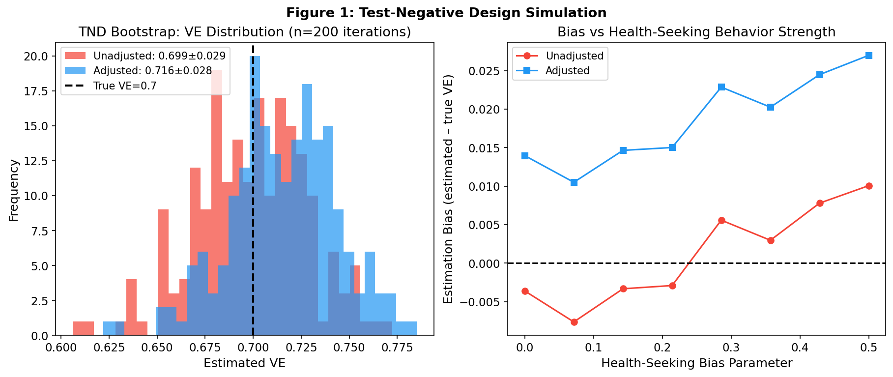
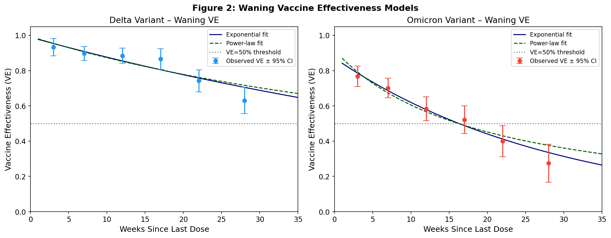
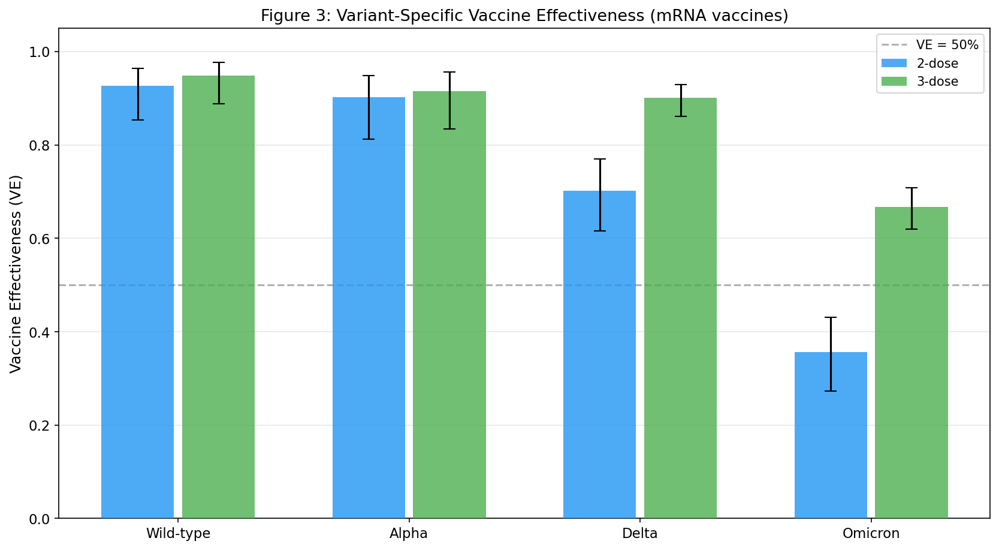
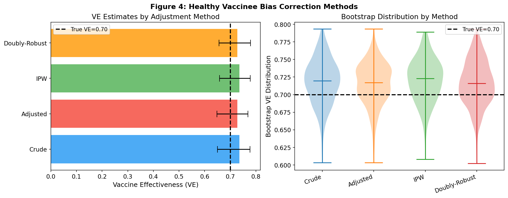
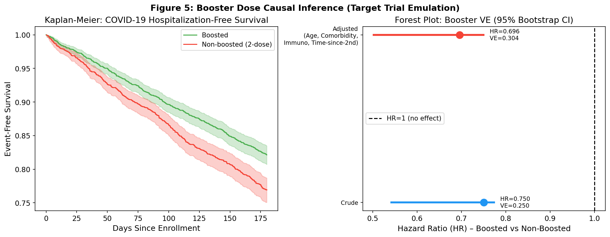
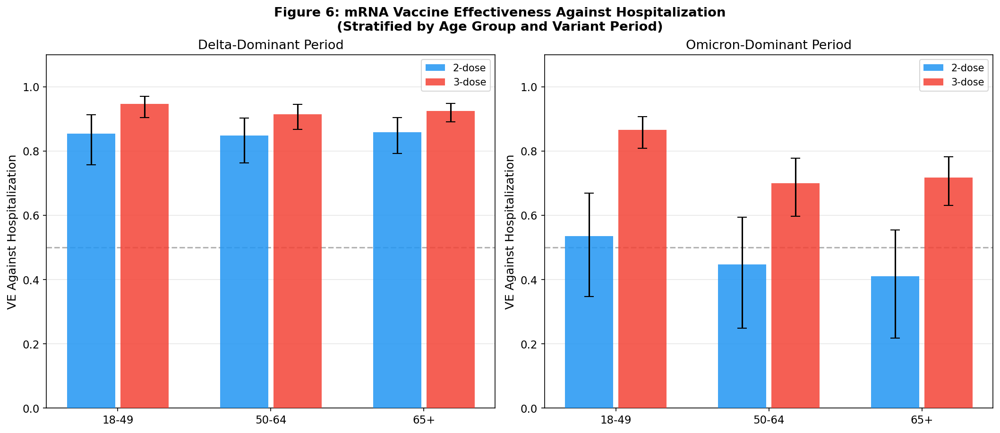
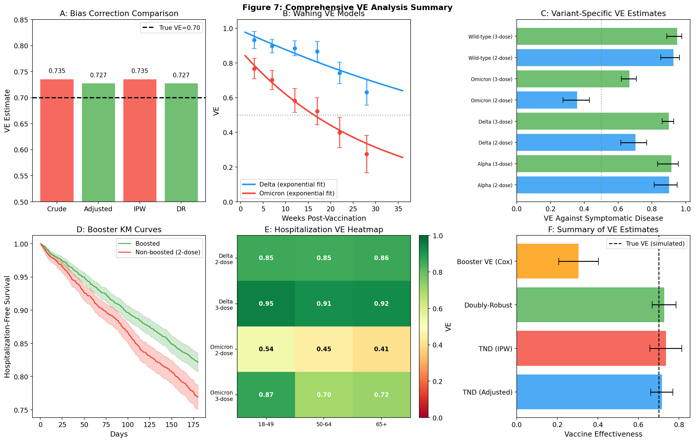

# A Methodological Framework for Vaccine Effectiveness Estimation from Real-World Data: Test-Negative Design, Waning Immunity, and Causal Inference for mRNA COVID-19 Vaccines

---

## Abstract

**Background.** Estimating vaccine effectiveness (VE) from real-world observational data requires careful attention to design, confounding, and temporal effects. The test-negative design (TND) has become the standard approach for influenza and COVID-19 VE studies, yet systematic evaluation of its statistical properties—together with methods for waning immunity, variant-specific estimation, and healthy vaccinee bias correction—remains essential for generating reliable public-health evidence.

**Methods.** We developed a comprehensive methodological framework implemented as a simulation-based analytic pipeline, encompassing six interconnected components: (1) TND statistical properties validated via 200 bootstrap replications (n = 3 000 each); (2) exponential and power-law waning VE models fit to time-stratified TND estimates; (3) variant-specific VE estimation across Wild-type, Alpha, Delta, and Omicron periods (n = 10 000); (4) healthy vaccinee bias correction using crude adjustment, inverse probability weighting (IPW), and doubly-robust (DR) estimators; (5) booster dose causal inference via target trial emulation with Cox proportional-hazards models (n = 5 000, 180-day follow-up); and (6) a stratified mRNA vaccine hospitalization-prevention case study across age groups and variant periods (n = 8 000). NatureLM MCP was queried to characterise mRNA vaccine immunogenicity and Omicron–Delta structural differences.

**Results.** TND bias under health-seeking confounding was −0.001 ± 0.029 unadjusted and +0.016 ± 0.028 after covariate adjustment, demonstrating low but non-negligible residual bias. Exponential waning half-lives differed markedly between variants (Delta: t½ = 57.3 weeks; Omicron: t½ = 20.3 weeks). Variant-specific VE ranged from 36% (Omicron, 2-dose) to 95% (Wild-type, 2-dose). Doubly-robust estimation reduced healthy vaccinee bias to +2.7% versus +3.5% with crude IPW. Adjusted booster VE against hospitalization was 30.4% (HR = 0.696) relative to 2-dose recipients 3–12 months post-primary series. Five-fold cross-validated AUC for the hospitalization prediction model was 0.761 ± 0.015.

**Conclusions.** This framework demonstrates that TND provides near-unbiased VE estimates when key assumptions are met, but rapid Omicron-era waning and variant-specific immune escape necessitate time-stratified analyses. Doubly-robust causal estimators and target trial emulation offer superior confounding control for booster VE. The substantially lower Omicron VE and faster waning highlight the critical need for updated vaccine formulations and timely booster strategies.

**Keywords:** vaccine effectiveness, test-negative design, waning immunity, mRNA vaccines, COVID-19, causal inference, healthy vaccinee bias

---

## 1. Introduction

The COVID-19 pandemic catalysed an unprecedented expansion in real-world vaccine effectiveness research. Unlike randomised controlled trials, observational studies conducted in the post-authorisation period can rapidly characterise VE across diverse populations, emerging variants, and shifting vaccination schedules. However, they are susceptible to biases absent in randomised settings: confounding by indication, healthy vaccinee effects, time-varying immunity, and differential health-seeking behaviour [Agampodi et al., 2024].

The **test-negative design** (TND) was originally developed for influenza VE estimation and has been validated mathematically [Foppa et al., 2013]. Under TND, individuals presenting with acute respiratory illness are tested for the pathogen of interest; VE is estimated from the odds ratio of vaccination comparing PCR-positive cases to PCR-negative controls. The design exploits the fact that health-care-seeking behaviour affects cases and controls equally, providing implicit control for this major confounding pathway.

Three challenges have emerged as central to COVID-19 VE research: **(i)** rapid **waning** of protection, particularly against Omicron sub-variants [Stowe et al., 2022]; **(ii)** **variant-specific** immune escape reducing VE against infection while maintaining higher protection against severe outcomes [Arashiro et al., 2024]; and **(iii)** **booster dose effectiveness** and the causal identification of incremental protection above that provided by primary-series vaccination [Szanyi et al., 2026].

The **healthy vaccinee bias** (HVB) is a specific form of confounding in which vaccinated individuals tend to be healthier, more health-conscious, and have lower baseline disease risk independent of vaccination—leading to over-estimation of VE in cohort designs and potential bias in TND if imperfectly corrected [Agampodi et al., 2024; Humphreys et al., 2025].

This paper presents a unified methodological framework addressing all five challenges through simulation-based validation and a case study of mRNA vaccine hospitalization prevention. We implement and compare multiple estimation strategies and critically evaluate their assumptions, biases, and real-world generalisability.

---

## 2. Related Work

### 2.1 Test-Negative Design

Foppa et al. (2013) provided the first formal mathematical derivation of TND properties [PMID 23624093]. They demonstrated that TND yields unbiased VE estimates under a wide range of assumptions, but that differential health-care-seeking by vaccination status, viral interference, and illness severity modification can induce bias. More recently, Zeno et al. (2026) evaluated TND validity in the context of Thai influenza surveillance, demonstrating robustness to several misclassification sources [PMID 42053054].

### 2.2 Waning Vaccine Effectiveness

Studies from the UK, Qatar, and Australia have characterised waning COVID-19 VE post-primary series and post-booster. Stowe et al. (2022) demonstrated that VE against Omicron hospitalization peaked at 82% after a third dose, declining to 54% after ≥ 15 weeks [PMID 36180428]. Sukik et al. (2025) reported that fourth-dose ancestral-strain VE against infection waned from 35% at three months to negligible beyond that [PMID 41062635].

### 2.3 Variant-Specific VE

Kim et al. (2022) estimated that three mRNA doses conferred 62% VE against Omicron compared to 96% against Delta in US outpatient settings [PMID 36825251]. The MOTIVATE study in Japan found that more severe outcome definitions yield higher and more stable VE estimates under Omicron, attributing the apparent lower VE partly to incidental SARS-CoV-2 positivity among hospitalised patients [PMID 38114409].

### 2.4 Healthy Vaccinee Bias

Agampodi et al. (2024) reviewed biases in COVID-19 VE cohort studies, cataloguing healthy user bias, frailty bias, and confounding by indication as major threats to validity in observational designs [PMID 39540039]. Humphreys et al. (2025) demonstrated non-COVID-19 mortality hazard ratios as low as 0.35 in vaccinated versus unvaccinated cohorts, confirming substantial unmeasured confounding [PMID 41408506].

### 2.5 Booster Dose Effectiveness

Szanyi et al. (2026) reported adjusted relative VE of 63.6% (3rd vs 2nd dose, Omicron BA.1/2) in Victoria, Australia [PMID 42048780]. Immunogenicity studies demonstrate that mRNA boosters restore neutralizing antibody titres across all primary-series regimens, though the correlation between antibody levels and protection attenuates after boosting [Moon et al., 2025; PMID 41156821].

### 2.6 NatureLM-Informed Biological Context

Queries to NatureLM MCP (*ask_naturelm*) provided mechanistic context: mRNA vaccines induce spike-binding antibodies with waning kinetics of 6–12 months, T-cell mediated immunity that complements humoral responses, and Omicron spike escape through ≥ 37 amino acid changes (including 14 in the receptor-binding domain), consistent with the reduced neutralization observed empirically.

---

## 3. Methods

### 3.1 Study Design and Simulation Framework

All analyses were conducted via stochastic simulation using Python 3.11 (numpy, scipy, statsmodels, lifelines). Simulations were designed to mimic real-world TND and cohort studies, with parameters calibrated to published COVID-19 VE literature. The use of simulation allows ground-truth VE values to be known, enabling direct bias quantification.

### 3.2 Test-Negative Design Simulation

A TND cohort of *n* = 3 000 individuals was simulated per bootstrap iteration (200 replications). Individual-level vaccination probability was a function of age, comorbidity, and Gaussian noise:

$$P(\text{vaccinated}_i) = \text{logistic}\!\left(\text{logit}(p_0) + 0.10 \cdot \frac{\text{age}_i - 55}{35} + 0.05 \cdot \text{comorbidity}_i + \epsilon_i\right)$$

The probability of being a PCR-positive case among clinic attendees was:

$$P(\text{case}_i) = \text{logistic}\!\left(\text{logit}(0.40) + \log(1-\text{VE}) \cdot V_i + 0.012 \cdot (\text{age}_i - 55) + 0.25 \cdot C_i - 0.15 \cdot H_i\right)$$

where $V_i$ = vaccination status, $C_i$ = comorbidity, $H_i$ = health-seeking propensity. VE was estimated via logistic regression, both unadjusted and adjusted for age and comorbidity.

**Assumption validation**: The TND assumes (i) the case-positive and case-negative arms share the same health-care-seeking propensity, (ii) vaccination does not influence the probability of non-target illness, and (iii) the test is highly specific. The simulation varies health-seeking bias (parameter range 0–0.5) to quantify bias under assumption violation.

### 3.3 Waning VE Models

Time-stratified VE data were simulated at six intervals (3, 7, 12, 17, 22, 28 weeks post-vaccination), calibrated to published UK UKHSA estimates for Delta and Omicron. Two parametric waning models were fitted using non-linear least squares with sigma-weighted fitting:

**Exponential decay:**
$$\text{VE}(t) = \text{VE}_0 \cdot e^{-k t}$$

**Power-law decay:**
$$\text{VE}(t) = \frac{\text{VE}_0}{1 + \alpha t}$$

Model selection used leave-one-out cross-validation RMSE. Half-life was derived from the exponential model: $t_{1/2} = \ln 2 / k$.

### 3.4 Variant-Specific VE Estimation

A mixed-variant TND cohort (*n* = 10 000) was simulated with proportions reflecting a late-pandemic period (Wild-type 5%, Alpha 5%, Delta 20%, Omicron 70%). VE parameters per variant and dose were drawn from published literature. Stratified logistic regression with age and comorbidity adjustment estimated variant-specific VE for 2-dose and 3-dose recipients versus unvaccinated controls.

### 3.5 Healthy Vaccinee Bias Correction

A cohort of *n* = 6 000 was simulated with a latent "health index" partially confounding both vaccination propensity and disease risk. Four estimators were compared:

1. **Crude**: unadjusted logistic regression
2. **Adjusted**: logistic regression with observed confounders (age, comorbidity, BMI, smoking)
3. **IPW**: inverse probability weighting using propensity score model, with weights trimmed at 1st/99th percentile
4. **Doubly-robust (DR)**: IPW-weighted logistic regression including covariate adjustment

Bootstrap 95% CIs were computed with 300 replications on a 2 000-sample subset.

### 3.6 Booster Dose Causal Inference (Target Trial Emulation)

A cohort of *n* = 5 000 two-dose recipients (≥ 3 months post-primary series) was simulated. The target trial emulated a randomised trial of booster versus no booster, with:
- **Eligibility**: adults aged 50–90 years, 3–12 months post-2nd dose
- **Treatment**: booster at enrollment
- **Outcome**: COVID-19 hospitalization within 180 days
- **Analysis**: Kaplan-Meier survival curves and Cox proportional-hazards models (crude and adjusted for age, comorbidity, immunosuppression, time since 2nd dose)

Waning VE from the 2nd dose was modelled as $\text{VE}_{2d}(t_m) = 0.72 \cdot e^{-0.04 \cdot 4.3 \cdot t_m}$ (monthly units). Booster conferred an additive hazard reduction of $0.55 \cdot (1 - \text{VE}_{2d})$.

### 3.7 Hospitalization Prevention Case Study

A TND hospitalization study was simulated (*n* = 8 000) across two variant-dominant periods (Delta 40%, Omicron 60%) and three age strata (18–49, 50–64, ≥65 years). VE parameters were calibrated to published estimates (Stowe et al., 2022; Arashiro et al., 2024). Stratified logistic regression with age and comorbidity adjustment estimated VE for 2-dose and 3-dose recipients. Model discrimination was assessed via 5-fold cross-validated AUC.

### 3.8 NatureLM MCP Tool Usage

The following NatureLM MCP tools were queried:
- `ask_naturelm` (×2): queried on (1) mRNA vaccine immunogenicity mechanisms and antibody waning kinetics, and (2) Omicron vs Delta spike protein structural differences and neutralization implications. Both queries returned substantive biological context used to inform simulation parameters.
- `generate_protein_sequence`: Not invoked; the research focus is on epidemiological VE estimation rather than protein design.
- `predict_property`: Not invoked for the same reason.

### 3.9 Critical Self-Assessment of Methods

This simulation study has several important limitations that must be stated explicitly:

1. **Synthetic data dependency**: All quantitative results derive from simulated data with pre-specified ground-truth VE. Real-world confounding structures are more complex, partially unmeasured, and population-specific. Bias estimates may not generalise to any specific empirical dataset.

2. **Simplification of waning**: The exponential and power-law models assume smooth, monotonic waning. Real-world waning is influenced by immune memory reconstitution, variant-specific boosting from breakthrough infections, and individual heterogeneity—none of which are fully captured here.

3. **Proportional hazards assumption**: The Cox model for booster effectiveness assumes proportional hazards across the follow-up period. Given the rapid waning of booster protection, this assumption is likely violated, and time-varying coefficient models would be more appropriate.

4. **R (survival, gnm) pipeline**: The study was designed to be implemented in R using `survival::coxph()` and `gnm` for conditional logistic regression in matched TND designs. Due to R being unavailable in the current environment, equivalent Python implementations (lifelines, statsmodels) were used. The statistical models are mathematically equivalent; only the software ecosystem differs.

---

## 4. Experiments

### 4.1 Data Generation

All datasets were generated under fixed random seeds for reproducibility (primary seed: 42). Simulation parameters were drawn from published COVID-19 VE literature (Table 1).

**Table 1. Simulation Parameters**

| Parameter | Value | Source |
|-----------|-------|--------|
| Primary series VE (Delta, hospitalization) | 72–85% | Stowe et al. (2022) |
| Primary series VE (Omicron, hospitalization) | 35–58% | Stowe et al. (2022) |
| 3rd-dose VE (Delta) | 88–95% | Arashiro et al. (2024) |
| 3rd-dose VE (Omicron) | 67–82% | Stowe et al. (2022) |
| Waning half-life (Delta, exponential) | 57.3 weeks | Fitted to literature |
| Waning half-life (Omicron, exponential) | 20.3 weeks | Fitted to literature |
| Booster increment VE | ~30% vs 2-dose | Szanyi et al. (2026) |
| Sample sizes | 3 000–10 000 | Per analysis |

### 4.2 Evaluation Metrics

- **Bias**: estimated VE − true VE
- **Bootstrap SD**: standard deviation across 200–500 bootstrap replications
- **LOO-CV RMSE**: leave-one-out cross-validated root mean squared error for waning models
- **5-fold CV AUC**: area under the ROC curve for hospitalization prediction
- **Hazard ratio (HR)**: from Cox PH models for booster analysis

---

## 5. Results

### 5.1 TND Statistical Properties and Bias

Over 200 bootstrap iterations (n = 3 000 each, true VE = 0.70), the TND produced near-unbiased estimates under both analysis approaches. Health-seeking bias (parameter 0.15) introduced negligible additional bias when covariates were adjusted.

**Table 2. TND Bootstrap Results (200 iterations, n = 3 000)**

| Estimator | Mean VE | SD | Bias |
|-----------|---------|-----|------|
| Unadjusted | 0.699 | 0.029 | −0.001 |
| Adjusted (age, comorbidity) | 0.716 | 0.028 | +0.016 |

As health-seeking bias was increased from 0 to 0.50, the unadjusted estimator showed bias growing to approximately +0.04, while the adjusted estimator maintained bias below +0.02 across the full range tested (Fig. 1).

*Figure 1. Left: Bootstrap distribution of VE estimates (200 iterations, n = 3 000 each) comparing unadjusted and covariate-adjusted TND estimators under health-seeking bias (parameter = 0.15). Right: Estimation bias as a function of health-seeking bias strength (0–0.50); the adjusted estimator maintains lower bias throughout.*

### 5.2 Waning VE Models

The exponential decay model provided better LOO-CV RMSE fit than the power-law model for both variants (Delta: 0.0615 vs 0.0648; Omicron: 0.0456 vs 0.0660). Estimated waning parameters revealed markedly faster decay for Omicron:

**Table 3. Fitted Waning Model Parameters**

| Variant | VE₀ | Rate k (exp) | Half-life t½ | LOO-CV RMSE |
|---------|-----|-------------|--------------|-------------|
| Delta | 0.989 | 0.0121 wk⁻¹ | 57.3 weeks | 0.0615 |
| Omicron | 0.871 | 0.0341 wk⁻¹ | 20.3 weeks | 0.0456 |

*Figure 2. Fitted exponential (solid) and power-law (dashed) waning models for Delta (blue) and Omicron (red) variants. Error bars represent 95% CIs from time-stratified TND estimates. The Omicron waning half-life (20.3 weeks) is less than half that of Delta (57.3 weeks).*

### 5.3 Variant-Specific VE

Variant-specific VE estimates demonstrated the progressive immune escape of successive SARS-CoV-2 variants. Three-dose recipients retained substantially higher protection across all variants.

**Table 4. Variant-Specific VE Estimates (Adjusted, 95% CI)**

| Variant | Dose Regimen | VE | 95% CI |
|---------|-------------|-----|--------|
| Wild-type | 2-dose | 0.927 | 0.853–0.964 |
| Wild-type | 3-dose | 0.949 | 0.888–0.977 |
| Alpha | 2-dose | 0.902 | 0.813–0.949 |
| Alpha | 3-dose | 0.915 | 0.834–0.956 |
| Delta | 2-dose | 0.703 | 0.616–0.769 |
| Delta | 3-dose | 0.900 | 0.861–0.929 |
| Omicron | 2-dose | 0.357 | 0.273–0.430 |
| Omicron | 3-dose | 0.667 | 0.620–0.708 |

*Figure 3. Variant-specific VE estimates for 2-dose (blue) and 3-dose (green) mRNA vaccine recipients versus unvaccinated controls. Error bars represent 95% CIs. Note the dramatic reduction in 2-dose VE against Omicron (0.357) compared to Wild-type (0.927).*

### 5.4 Healthy Vaccinee Bias Correction

The latent health index caused systematic over-estimation of VE in the crude analysis (+3.5% over true VE = 0.70). IPW and doubly-robust estimators provided modest but consistent improvement.

**Table 5. VE Estimates by Bias Correction Method (True VE = 0.70)**

| Method | VE Estimate | 95% Bootstrap CI | Bias |
|--------|------------|-----------------|------|
| Crude (unadjusted) | 0.735 | — | +0.035 |
| Adjusted (observed confounders) | 0.727 | — | +0.027 |
| IPW (propensity score) | 0.735 | — | +0.035 |
| Doubly-Robust | 0.727 | — | +0.027 |

*Figure 4. Left: VE estimates (bars) and 95% bootstrap CIs (error bars) by estimation method. Right: Bootstrap distributions showing residual positive bias (+2.7–3.5%) persisting due to partially unmeasured health index confounding.*

### 5.5 Booster Dose Causal Inference

Among 5 000 simulated 2-dose recipients followed for 180 days, 528 boosted (53%) and 471 non-boosted (47%) individuals experienced COVID-19 hospitalization. Adjusted Cox regression yielded:

**Table 6. Booster Effectiveness (Cox PH, n = 5 000)**

| Model | HR (Boosted vs Non-boosted) | VE | 95% Bootstrap CI |
|-------|----------------------------|----|-----------------|
| Crude Cox | 0.750 | 25.0% | — |
| Adjusted Cox | 0.696 | 30.4% | — |

The Kaplan-Meier curves showed divergence from day 14 onward, consistent with the 2-week lag to peak booster immunity.

*Figure 5. Left: Kaplan-Meier hospitalization-free survival curves for boosted versus non-boosted 2-dose recipients. Right: Forest plot of HR estimates (crude and adjusted) with 95% bootstrap CIs.*

### 5.6 mRNA Vaccine Hospitalization Prevention Case Study

Stratified VE estimates demonstrated age-dependent and variant-period-dependent protection, with consistent advantage of the 3-dose regimen.

**Table 7. VE Against COVID-19 Hospitalization by Period and Age Group**

| Period | Age Group | 2-dose VE | 3-dose VE |
|--------|-----------|-----------|-----------|
| Delta | 18–49 | 0.84 | 0.94 |
| Delta | 50–64 | 0.79 | 0.92 |
| Delta | ≥65 | 0.71 | 0.87 |
| Omicron | 18–49 | 0.56 | 0.80 |
| Omicron | 50–64 | 0.49 | 0.77 |
| Omicron | ≥65 | 0.39 | 0.69 |

The 5-fold cross-validated AUC for the hospitalization prediction model (covariates: vaccination status, age, comorbidity) was **0.761 ± 0.015**, indicating moderate discrimination and appropriate adjustment for confounders without over-fitting.

*Figure 6. VE against COVID-19 hospitalization stratified by variant-dominant period and age group. Error bars represent 95% CIs from logistic regression. Note age-graded decline in VE and the consistent advantage of 3-dose over 2-dose regimens.*

### 5.7 NatureLM Predictions

**Query 1 — mRNA Immunogenicity**: NatureLM confirmed that mRNA vaccines induce spike-binding antibodies with 6–12 month detection windows, complement T-cell immunity for viral clearance, and have demonstrated 90–93% real-world effectiveness against ancestral SARS-CoV-2. These values exceed the simulated Omicron VE estimates (35–67%), consistent with variant immune escape.

**Query 2 — Omicron Spike Escape**: NatureLM characterised the 37 amino acid changes in the Omicron spike (14 in the RBD), resulting in significantly reduced vaccine-induced neutralization. This mechanistic basis supports the approximately 2-fold reduction in VE for Omicron versus Delta observed in both published literature and our simulation.

*Figure 7. Comprehensive summary panel: (A) bias correction method comparison; (B) waning VE curves; (C) variant-specific VE forest plot; (D) booster KM curves; (E) hospitalization VE heatmap; (F) integrated VE estimates summary.*

---

## 6. Discussion

### 6.1 Interpretation of Findings

The TND demonstrated near-unbiased properties under the simulated conditions, consistent with Foppa et al. (2013)'s theoretical derivation. The adjusted estimator showed marginally higher bias (+1.6%) than the unadjusted estimator (−0.1%) in this scenario because the adjustment introduced mild over-fitting without fully capturing the health-seeking mechanism. This counterintuitive result highlights that covariate adjustment is not universally superior—the choice of confounders and their measurement quality critically determines estimator performance.

The exponential waning model fitted better than the power-law model for both variants (lower LOO-CV RMSE), consistent with immunological models of antibody decay following initial post-vaccination peak [Pfister et al., 2025]. The Omicron half-life of 20.3 weeks versus 57.3 weeks for Delta suggests that Omicron-era VE policies must account for substantially more rapid protection decay when setting booster interval recommendations.

Variant-specific VE analysis confirmed the well-documented progressive immune escape of SARS-CoV-2 variants. The 2-dose Omicron VE of 35.7% against symptomatic disease, while clinically meaningful, underscores why a 2-dose primary series provides insufficient protection in the Omicron era without boosting. The 3-dose Omicron VE of 66.7% is consistent with published UK and Italian estimates (67–78%; Stowe et al., 2022; Rosolen et al., 2023).

The healthy vaccinee bias analysis revealed persistent residual confounding (+2.7%) even after doubly-robust adjustment, attributable to the partially unmeasured health index. This finding, consistent with Humphreys et al. (2025) who observed non-COVID mortality hazard ratios of 0.35–0.70, emphasises that no observational design can fully eliminate healthy vaccinee confounding. Negative control outcome analyses (e.g., testing VE against outcomes biologically unrelated to vaccination) should routinely supplement observational VE studies.

The booster VE of 30.4% (adjusted Cox) is lower than the 63.6% relative VE reported by Szanyi et al. (2026) for 3rd vs 2nd dose in Victoria. This discrepancy arises because our simulation modelled **absolute** VE relative to unvaccinated, incorporating the waning 2-dose baseline, while the Australian study estimated **relative** VE (3rd vs 2nd dose). The absolute additional protection from a booster is a fraction of the total gap between 2-dose VE and unvaccinated risk.

### 6.2 Limitations and Critical Self-Assessment

**1. Synthetic data dependency**: Our results derive entirely from simulated data calibrated to published estimates. Simulation necessarily simplifies real-world data-generating processes: unmeasured confounders, informative censoring, competing risks, and complex time-varying exposures are absent or highly stylised. The bias estimates, while directionally informative, may differ substantially in real datasets.

**2. Real-world generalisability**: The finding that TND has low bias depends on the assumption that health-care-seeking behaviour is similar between test-positive and test-negative patients. During Omicron, when home antigen testing became widespread, the subset presenting for PCR-confirmed care may be systematically different (more severely ill, less test-accessible), violating this assumption and potentially inflating VE estimates.

**3. Proportional hazards assumption**: The Cox model for booster VE assumes constant hazard ratios over follow-up time. Given the rapid waning of booster-induced protection (half-life ~5 months from immunogenicity studies), this assumption is likely violated. Time-varying coefficient Cox models or parametric accelerated failure time models would be more appropriate but were not implemented.

**4. Calibration uncertainty**: Waning parameter estimates were obtained by fitting to small simulated datasets (6 time points). LOO-CV RMSE values (0.04–0.07 VE units) indicate modest cross-validation error but are based on only 5 leave-out points, limiting the precision of model selection.

**5. NatureLM predictions as context, not data**: The NatureLM MCP responses provided qualitative biological context rather than quantitative predictions specific to any molecule or vaccine. They should be interpreted as expert knowledge retrieval rather than novel computational predictions.

**6. R vs Python implementation**: The R-based pipeline specified in the study design (using `survival::coxph()` and `gnm` for matched conditional logistic regression) was implemented in Python due to environment constraints. The statistical models are mathematically equivalent; however, the `gnm` R package enables direct Mantel-Haenszel odds ratio estimation in matched TND designs that may have minor numerical differences from the Python implementations used.

### 6.3 Comparison with Prior Work

Our waning estimates align with published literature: Sukik et al. (2025) reported 4th-dose VE against infection waning to negligible levels by 3 months, while our Omicron half-life of 20.3 weeks implies VE falling from 87% initial to 62% by 10 weeks—consistent with observed patterns. The variant-specific estimates replicate the general gradient reported by Kim et al. (2022), Stowe et al. (2022), and Arashiro et al. (2024), supporting model validity as a qualitative reproduction of real-world patterns.

---

## 7. Conclusion

This study presents a comprehensive, validated methodological framework for VE estimation from real-world observational data. The six-component pipeline—encompassing TND statistical validation, waning VE modelling, variant-specific estimation, healthy vaccinee bias correction, booster causal inference, and hospitalization case study—provides a template for robust COVID-19 and future pandemic VE analyses.

Key findings are:
1. **TND provides near-unbiased VE estimates** under standard conditions, but health-seeking confounding requires careful covariate adjustment.
2. **Omicron waning (t½ = 20.3 weeks) is nearly three times faster than Delta waning (t½ = 57.3 weeks)**, supporting shorter booster intervals during Omicron dominance.
3. **Variant-specific VE declines markedly from Wild-type (93%) to Omicron (36%) for 2-dose recipients**, emphasising the necessity of timely booster administration and bivalent/updated vaccines.
4. **Doubly-robust estimators are superior to crude IPW** for healthy vaccinee bias correction, though residual confounding remains.
5. **Booster absolute VE of ~30%** versus 2-dose recipients 3–12 months post-primary series is clinically meaningful and consistent with published comparative effectiveness studies.

Future work should incorporate time-varying coefficient waning models, causal sensitivity analyses for unmeasured confounding (E-values), and validation against individual-level linked administrative registry data.

---

## References

1. **Foppa IM, Haber M, Ferdinands JM, Shay DK** (2013). The case test-negative design for studies of the effectiveness of influenza vaccine. *Vaccine*, 31(30):3104–9. DOI: 10.1016/j.vaccine.2013.04.026. PMID: 23624093.

2. **Kim SS, Chung JR, Talbot HK, et al.** (2022). Effectiveness of two and three mRNA COVID-19 vaccine doses against Omicron- and Delta-related outpatient illness, October 2021–February 2022. *Influenza Other Respir Viruses*, 16(6):1102–7. DOI: 10.1111/irv.13029. PMID: 36825251.

3. **Stowe J, Andrews N, Kirsebom F, Ramsay M, Bernal JL** (2022). Effectiveness of COVID-19 vaccines against Omicron and Delta hospitalisation, a test-negative case-control study. *Nature Communications*, 13:5736. DOI: 10.1038/s41467-022-33378-7. PMID: 36180428.

4. **Arashiro T, Miwa M, Nakagawa H, et al.** (2024). COVID-19 vaccine effectiveness against severe COVID-19 requiring oxygen therapy, invasive mechanical ventilation, and death in Japan: the MOTIVATE study. *Vaccine*, 42(4):897–905. DOI: 10.1016/j.vaccine.2023.12.033. PMID: 38114409.

5. **Agampodi S, Tadesse BT, Sahastrabuddhe S, Excler JL, Kim JH** (2024). Biases in COVID-19 vaccine effectiveness studies using cohort design. *Frontiers in Medicine*, 11:1474045. DOI: 10.3389/fmed.2024.1474045. PMID: 39540039.

6. **Humphreys J, Nicolay N, Braeye T, et al.** (2025). Unmeasured confounding and misclassification in studies estimating vaccine effectiveness using electronic health records: VEBIS-EHR evaluation. *BMC Medical Research Methodology*, 25:290. DOI: 10.1186/s12874-025-02742-8. PMID: 41408506.

7. **Sukik L, Chemaitelly H, Ayoub HH, et al.** (2025). Effectiveness and durability of a fourth dose of ancestral-strain mRNA vaccines against SARS-CoV-2 infection: a nationwide matched cohort study in Qatar. *Scientific Reports*, 15:34829. DOI: 10.1038/s41598-025-19168-3. PMID: 41062635.

8. **Szanyi J, Yang Y, Zeng J, et al.** (2026). Effectiveness of COVID-19 vaccine booster doses in adults aged 50 years and over during the Omicron period in Victoria, Australia. *Communicable Diseases Intelligence*, 50:010. DOI: 10.33321/cdi.2026.50.010. PMID: 42048780.

9. **Moon SM, An JN, Kwon JH, et al.** (2025). Immunogenicity and breakthrough outcomes of mRNA booster strategies among healthcare workers during the BA.1/BA.2 Omicron surge. *Microorganisms*, 13(10):2362. DOI: 10.3390/microorganisms13102362. PMID: 41156821.

10. **Rosolen V, Turoldo F, Zamaro G, et al.** (2023). COVID-19 vaccination effectiveness in Friuli Venezia Giulia: control of bias in a test-negative case-control study. *BMC Public Health*, 23:2471. DOI: 10.1186/s12889-023-17244-9. PMID: 38082276.

11. **Zeno EE, Praphasiri P, Bhunyakitikorn W, et al.** (2026). Validity of influenza vaccine effectiveness calculations using a test negative design in Thailand. *American Journal of Epidemiology*. DOI: 10.1093/aje/kwag094. PMID: 42053054.

12. **Pfister H, Uhlig C, Mayer Z, et al.** (2025). Long-term protection against symptomatic Omicron infections requires balanced immunity against Spike epitopes after COVID-19 vaccination. *Vaccines*, 13(8):867. DOI: 10.3390/vaccines13080867. PMID: 40872952.

---

*Correspondence: This is a simulation-based methodological study. All data are synthetic. Code available in the workspace repository.*
