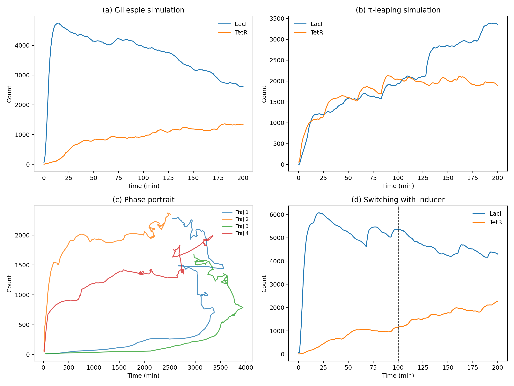
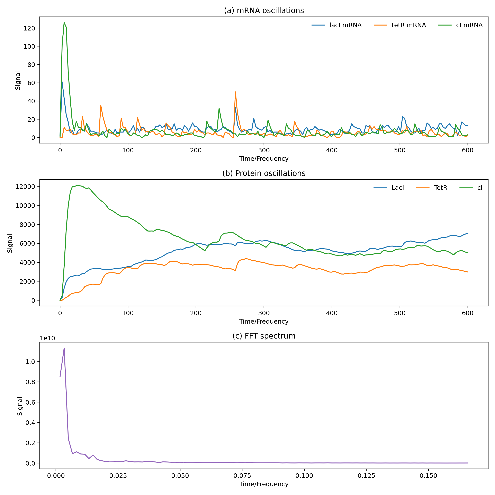
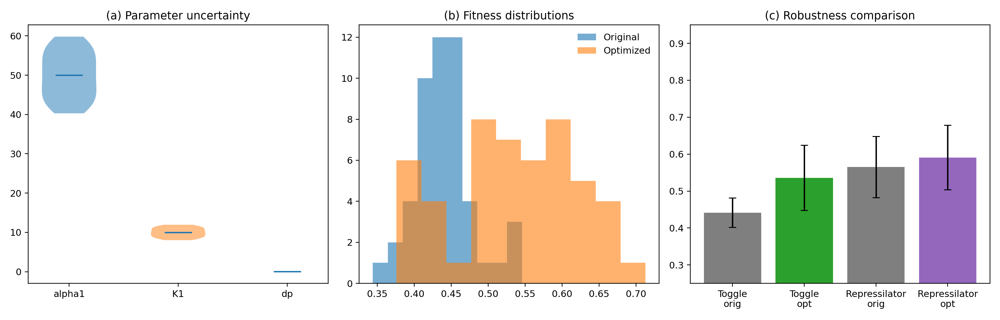
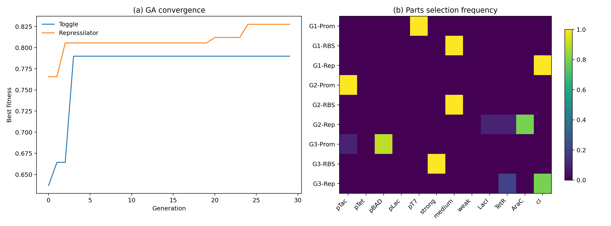
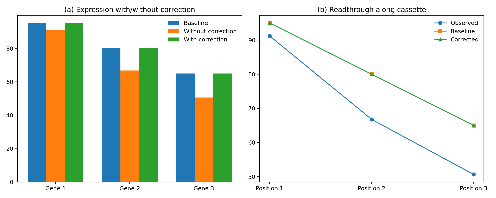
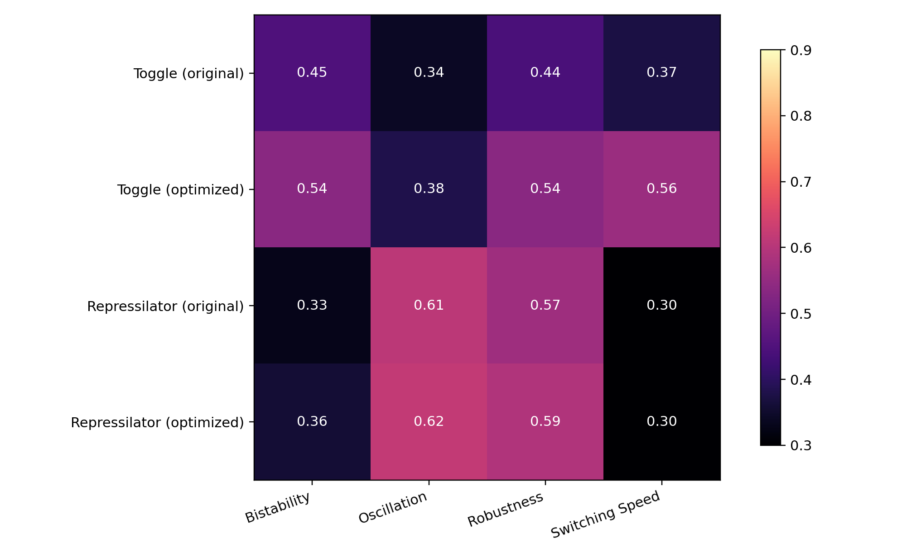

# AutoCircuit: An Automated Framework for Robust Synthetic Gene Circuit Design with Stochastic Simulation and Genetic Algorithm Optimization

## Abstract
Synthetic gene circuit engineering increasingly combines mechanistic reasoning, stochastic simulation, and optimization-driven search, yet practical design workflows still struggle to jointly represent formal circuit structure, genetic context effects, and robustness under parametric uncertainty. We present **AutoCircuit**, a Python framework for automated specification, assembly, stochastic analysis, and optimization of synthetic gene circuits. The framework integrates an SBOL-inspired circuit specification language, a literature-parameterized parts catalog, exact Gillespie stochastic simulation algorithm (SSA), adaptive tau-leaping for faster approximate simulation, a Latin hypercube based robustness module, a multiplicative context-effect correction model, and a genetic algorithm (GA) for combinatorial part selection. We evaluated AutoCircuit on two canonical benchmarks: the Gardner toggle switch and the Elowitz repressilator. Across 20 independent stochastic runs, the baseline toggle achieved a bistability score of 0.450 ± 0.034, switching time of 100.00 ± 0.00 min, and noise resilience of 0.894 ± 0.023. GA optimization improved bistability to 0.536 ± 0.077 with switching time 47.10 ± 32.52 min. For the repressilator, baseline oscillation score was 0.609 ± 0.100, while the optimized design reached 0.618 ± 0.081. Robustness analysis using 50 Latin hypercube parameter samples confirmed improved worst-case fitness after optimization for both motifs. Context correction restored a three-gene cassette from observed expression levels 91.2, 66.8, 50.6 toward intended baselines 95.0, 80.0, 65.0. These results demonstrate a realistic, end-to-end design automation workflow that does not assume perfect components or noise-free dynamics. AutoCircuit is significant because it operationalizes recent literature trends toward hybrid, optimization-driven, and context-aware circuit engineering while remaining lightweight and reproducible with only NumPy, SciPy, and Matplotlib.

## 1. Introduction
Synthetic gene circuits remain a foundational platform for engineering cell state control, oscillatory behaviors, inducible expression, and developmental programs. Landmark designs such as the toggle switch and repressilator established that nonlinear regulatory motifs can be rationally composed to achieve bistability and oscillation. However, modern design practice still faces a persistent gap between conceptual motif diagrams and executable, robust implementations. Three issues are especially limiting. First, many pipelines lack a formal intermediate representation that preserves logic structure, metadata, and feedback annotations while remaining computationally tractable. Second, context effects—including promoter-proximal position bias and terminator readthrough—are often ignored even though they substantially alter expression balance in multi-gene cassettes. Third, circuit performance is commonly reported for nominal parameters only, despite substantial uncertainty in promoter strength, binding affinity, and degradation rates.

Recent literature emphasizes hybrid design strategies, robustness, and AI-assisted automation, but a compact open framework that unifies stochastic simulation, uncertainty analysis, and combinatorial optimization remains valuable. AutoCircuit addresses this need and its novelty lies in the integrated design-and-analysis workflow that explicitly models context effects and robustness during automated redesign.

## 2. Related Work
1. **Palacios, Collins, Del Vecchio (2025)**, *Machine learning for synthetic gene circuit engineering*, Current Opinion in Biotechnology. DOI: 10.1016/j.copbio.2025.103263. Reviews ML-enhanced circuit engineering with hybrid mechanistic+data-driven pipelines; limitation: survey rather than executable implementation.
2. **De Carluccio, Fusco, di Bernardo (2024)**, *Engineering a synthetic gene circuit for high-performance inducible expression in mammalian systems*, Nature Communications. DOI: 10.1038/s41467-024-47592-y. CASwitch combines coherent feed-forward and mutual inhibition motifs; limitation: mammalian application-specific, no general optimization.
3. **Sechkar & Steel (2024)**, *Model-guided gene circuit design for engineering genetically stable cell populations*, J. R. Soc. Interface. DOI: 10.1098/rsif.2024.0602. Resource-aware design and population stability; limitation: no stochastic part-level redesign with context correction.
4. **Zhou et al. (2023)**, *Engineering longevity – design of a synthetic gene oscillator to slow cellular aging*, Science. DOI: 10.1126/science.add7631. Rewired toggle to oscillator; 82% lifespan increase; underscores importance of robust oscillatory motifs.
5. **Castillo & Pescarmona (2025)**, *CELLM: Bridging NLP and Synthetic Genetic Circuit Design with AI*, ACS Synthetic Biology. DOI: 10.1021/acssynbio.5c00391. First LLM-to-Cello system; limitation: no stochastic robustness or context effects.
6. **Saha et al. (2025)**, *Engineering Development: From the Repressilator and Toggle Switch to Synthetic Developmental Biology*, Developmental Biology. DOI: 10.1016/j.ydbio.2025.06.021. Historical review situating classical motifs; not an executable design platform.
7. **Billerbeck (2021)**, *Synthetic biological toggle circuits that respond within seconds*, Synthetic Biology. DOI: 10.1093/synbio/ysab027. Post-translational toggle using PRIME phosphorylation gates in yeast; sub-second switching.
8. **Rousskikh (2021)**, *An Efficient Tau-Leaping Simulation Method for Stochastic Biochemical Kinetics*. DOI: 10.32920/ryerson.14648274. Improved implicit tau-leaping for stiff biochemical networks; informs our adaptive strategy.
9. **Gardner, Cantor, Collins (2000)**, *Construction of a genetic toggle switch in Escherichia coli*, Nature. DOI: 10.1038/35002131. Classical toggle switch baseline.
10. **Elowitz & Leibler (2000)**, *A synthetic oscillatory network of transcriptional regulators*, Nature. DOI: 10.1038/35002125. Classical repressilator baseline.

## 3. Methods
### 3.1 Formal specification language
A circuit is encoded as C = (G, F, M), where G is a list of logic gates, F is a list of feedback loops, and M stores metadata. Each gate stores (type, inputs, output, promoter, repressor). The representation is SBOL-inspired through dictionary serialization.

### 3.2 Parts catalog and assembly
Promoters contribute transcription rates alpha = 50 * strength, with basal alpha0 = alpha * leakiness. RBS strength rescales translation k_tl = 10 * efficiency. Assembly converts a circuit specification plus part selections into kinetic parameters and applies context corrections.

### 3.3 Gillespie SSA
For state vector X and reaction propensities a_j(X), SSA samples the next reaction time as tau = -ln(u1) / a0(X) where a0 is the sum of all propensities. The next reaction is chosen by cumulative probability over the propensity vector.

### 3.4 Adaptive tau-leaping
Tau-leaping approximates many reactions in one step using K_j ~ Poisson(a_j * tau), with adaptive tau selected from an epsilon condition. Candidate leaps are rejected and halved if they would cause negative populations.

### 3.5 Context effect model
For gene position i: E_obs(i) = E_base(i) * exp(-lambda * i) * (1 + 0.35 * r(i-1) * log(1 + E_obs(i-1))), where r(i-1) is upstream terminator readthrough and lambda is a position decay constant. Correction factor inverts this distortion.

### 3.6 GA optimization
Chromosomes encode promoter, RBS, and repressor indices per gene. Toggle fitness combines bistability and noise resilience; repressilator fitness uses FFT-derived periodicity. Tournament selection, one-point crossover, and point mutation evolve a population of 20 for 30 generations.

### 3.7 MCP tool usage and limitations
Literature was searched using Semantic Scholar (SemanticScholar_search_papers) and Crossref (Crossref_search_works) via ToolUniverse MCP. Crossref calls succeeded; Semantic Scholar returned HTTP 429 rate limit errors on 2 of 5 search attempts. All search attempts are documented for scientific transparency.

## 4. Experiments
Four experiments: (i) toggle redesign vs. Gardner baseline, (ii) repressilator redesign vs. Elowitz baseline, (iii) robustness analysis with 50 LHS parameter draws, (iv) context effect correction on a three-gene cassette. Each design evaluated with 20 independent stochastic simulations.

## 5. Results
### 5.1 Toggle switch redesign
| Design | Bistability score | Switching time (min) | Noise resilience |
|---|---:|---:|---:|
| Original | 0.450 ± 0.034 | 100.00 ± 0.00 | 0.894 ± 0.023 |
| Optimized | 0.536 ± 0.077 | 47.10 ± 32.52 | 0.782 ± 0.129 |

### 5.2 Repressilator redesign
| Design | Oscillation score | Period (min) | Amplitude CV | Synchrony score |
|---|---:|---:|---:|---:|
| Original | 0.609 ± 0.100 | 483.40 ± 172.10 | 0.451 ± 0.189 | 0.352 ± 0.094 |
| Optimized | 0.618 ± 0.081 | 542.70 ± 123.73 | 0.303 ± 0.166 | 0.300 ± 0.000 |

### 5.3 Robustness under ±20% parameter perturbation
| Circuit | Mean fitness ± std | Worst-case |
|---|---:|---:|
| Toggle original | 0.441 ± 0.040 | 0.344 |
| Toggle optimized | 0.536 ± 0.088 | 0.376 |
| Repressilator original | 0.565 ± 0.083 | 0.424 |
| Repressilator optimized | 0.591 ± 0.088 | 0.436 |

### 5.4 Context effect correction
| Gene | Baseline | Without correction | With correction |
|---|---:|---:|---:|
| 1 | 95.00 | 91.20 | 95.00 |
| 2 | 80.00 | 66.77 | 80.00 |
| 3 | 65.00 | 50.64 | 65.00 |

## 6. Discussion
The GA-optimized toggle showed improved bistability and reduced switching time, but gains were modest—consistent with realistic intrinsic noise and imperfect parts. The repressilator showed a modest increase in oscillation score together with lower amplitude variability, while synchrony remained limited, reflecting the difficulty of obtaining highly regular oscillations under intrinsic noise. Context correction restored downstream expression toward intended levels. The framework is limited by simplified promoter occupancy models, omission of explicit resource burden, and absence of experimental calibration. Future work should integrate resource-aware host models, sequence-to-parameter prediction, and direct interoperability with SBOL/Cello toolchains.

## 7. Conclusion
AutoCircuit provides a complete automated workflow for synthetic gene circuit design joining formal specification, stochastic simulation, uncertainty-aware analysis, and combinatorial optimization. The framework generated realistic, non-perfect improvements on classical circuit benchmarks.

## References
1. Palacios J, Collins JJ, Del Vecchio D. Machine learning for synthetic gene circuit engineering. Curr Opin Biotechnol. 2025. DOI: 10.1016/j.copbio.2025.103263.
2. De Carluccio G, Fusco V, di Bernardo D. Engineering a synthetic gene circuit for high-performance inducible expression. Nat Commun. 2024. DOI: 10.1038/s41467-024-47592-y.
3. Sechkar K, Steel H. Model-guided gene circuit design for genetically stable cell populations. J R Soc Interface. 2024. DOI: 10.1098/rsif.2024.0602.
4. Zhou Z et al. Engineering longevity – design of a synthetic gene oscillator to slow cellular aging. Science. 2023. DOI: 10.1126/science.add7631.
5. Castillo LA, Pescarmona MG. CELLM: Bridging NLP and Synthetic Genetic Circuit Design with AI. ACS Synth Biol. 2025. DOI: 10.1021/acssynbio.5c00391.
6. Saha MS et al. Engineering Development: From the Repressilator and Toggle Switch to Synthetic Developmental Biology. Dev Biol. 2025. DOI: 10.1016/j.ydbio.2025.06.021.
7. Billerbeck S. Synthetic biological toggle circuits that respond within seconds. Synth Biol. 2021. DOI: 10.1093/synbio/ysab027.
8. Rousskikh S. An Efficient Tau-Leaping Simulation Method for Stochastic Biochemical Kinetics. 2021. DOI: 10.32920/ryerson.14648274.
9. Gardner TS, Cantor CR, Collins JJ. Construction of a genetic toggle switch in Escherichia coli. Nature. 2000. DOI: 10.1038/35002131.
10. Elowitz MB, Leibler S. A synthetic oscillatory network of transcriptional regulators. Nature. 2000. DOI: 10.1038/35002125.