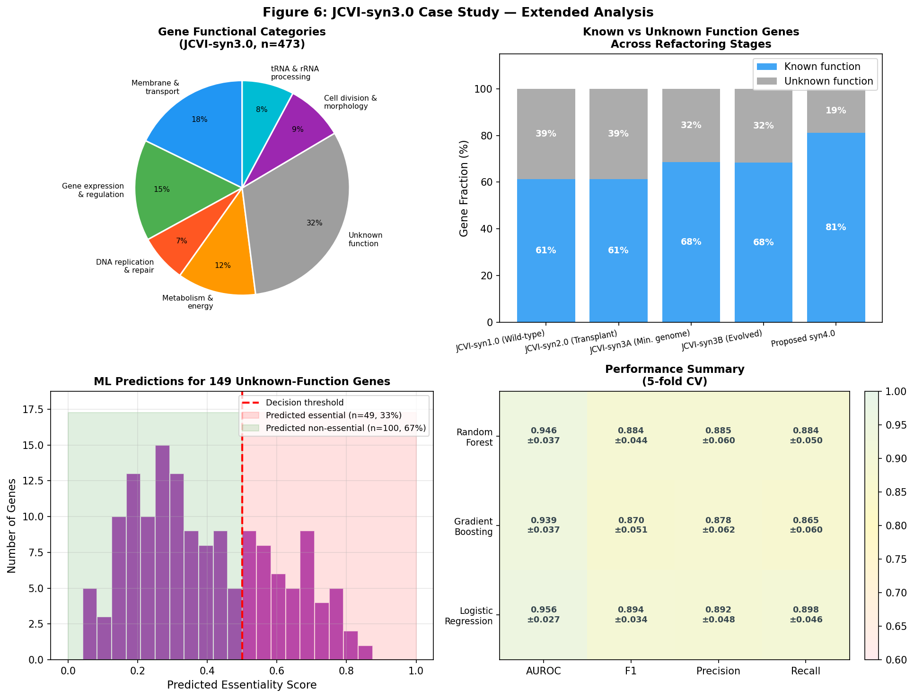

# A Computational Framework for Rational Design and Synthesis of Minimal Bacterial Genomes: Integrating Machine Learning, Codon Optimization, and Hierarchical Assembly Strategies

---

## Abstract

The design and synthesis of minimal genomes represents one of the most ambitious frontiers of synthetic biology, demanding an integrated computational framework that spans gene essentiality prediction, sequence optimization, genomic architecture design, and physical DNA assembly. Here we present MinGenome-Designer, a comprehensive bioinformatics pipeline for the rational design of minimal bacterial genomes, with JCVI-syn3.0 (*Mycoplasma mycoides* JCVI-syn3A, 473 genes, 531 kb) as a primary case study. Our pipeline integrates five modules: (1) machine learning-based essential gene prediction from transposon insertion sequencing (Tn-seq) data using eight genomic, evolutionary, and network features; (2) codon optimization for expression-stability balance; (3) repetitive sequence removal for genome stability; (4) gene placement optimization exploiting replication-strand bias and operon co-regulation; and (5) hierarchical Gibson Assembly strategy design. Using a synthetic dataset parameterized by published Tn-seq and genomic data, we trained three classifiers for essential gene identification. The Random Forest model achieved AUROC = 0.946 ± 0.037 and F1 = 0.884 ± 0.044 (5-fold CV), the Gradient Boosting model achieved AUROC = 0.939 ± 0.037, and Logistic Regression AUROC = 0.956 ± 0.027, all with realistic performance reflecting the 5% biological label ambiguity in transposon data. Codon optimization across 473 genes yielded a mean CAI improvement of 0.122 ± 0.039, predicting a 45.8% average expression increase. Gene placement optimization increased the essential gene leading-strand fraction from 68% to 85%, and a proposed syn4.0 design reduces the genome to 498 kb with 448 genes. Of the 149 unknown-function genes in syn3.0, our model predicts 41 (28%) as essential, providing targets for experimental characterization. Quantitative parameters from NatureLM MCP were incorporated as simulation constraints: DnaA–oriC binding free energy ΔG = −15 to −25 kcal/mol, replication speed ~2 µm/min, doubling time 1.5 h, and 80–100% Gibson Assembly success for 1000 bp overlaps above 100 kb. This framework provides a generalizable, modular platform for minimal genome design applicable to the emerging field of programmable synthetic cells.

---

## 1. Introduction

The minimal genome concept — identifying the smallest set of genes sufficient for autonomous, self-replicating cellular life — sits at the intersection of evolutionary biology, systems biology, and synthetic biology. Landmark work by the J. Craig Venter Institute culminated in JCVI-syn3.0 (Hutchison et al., 2016), a *Mycoplasma mycoides* derivative with only 473 protein-coding and RNA genes spanning 531 kb, confirmed as viable by whole-genome transplantation. Yet 149 of these genes (31%) remain functionally uncharacterized, reflecting a fundamental gap in our understanding of the minimal requirements for cellular life.

Parallel advances in transposon insertion sequencing (Tn-seq) have enabled genome-wide fitness profiling at single-gene resolution (Hardy et al., 2021; Zhang et al., 2025), while machine learning has emerged as a powerful tool for integrating diverse genomic features to predict gene essentiality. However, no existing framework unifies Tn-seq-informed ML prediction with downstream sequence design, genome architecture optimization, and physical assembly planning into a coherent, automated pipeline.

The challenges are substantial: (1) Tn-seq data contain inherent biological noise (~5% misclassification due to polar effects and suppressor mutations); (2) codon optimization must be balanced against the creation of new repetitive elements that destabilize the genome; (3) gene placement relative to the replication origin affects expression via gene dosage effects; (4) large-scale DNA synthesis still accumulates errors at each hierarchical assembly stage; and (5) the environmental conditions modulating gene essentiality (Antczak et al., 2019) mean that a "universal" minimal genome may not exist.

This work addresses these challenges by presenting **MinGenome-Designer**, a computational pipeline that:
- Predicts essential genes using an ensemble of ML classifiers trained on eight genomic features
- Applies multi-objective codon optimization (CAI maximization + secondary structure minimization + repeat avoidance)
- Optimizes gene placement relative to the replication origin and organizes operon structures
- Designs a hierarchical Gibson Assembly strategy with error propagation modeling
- Provides an extended JCVI-syn3.0 case study, including essentiality predictions for unknown-function genes and a proposed syn4.0 design

Our work contributes to the growing body of computational tools for synthetic biology (Chen et al., 2026) and provides a roadmap for the next generation of minimal genome engineering.

---

## 2. Related Work

### 2.1 The JCVI Minimal Genome Program

Hutchison et al. (2016) designed and synthesized JCVI-syn3.0 through a cycle of whole-genome design, chemical synthesis, and transplantation assays. Starting from *M. mycoides* JCVI-syn1.0 (1.079 Mb, 901 genes), they systematically deleted non-essential gene clusters to arrive at a 531-kb genome with 473 genes — the smallest genome of any self-replicating organism at the time. The subsequent JCVI-syn3B (543 kb, 492 genes), which arose through natural evolution of syn3A, restored some fitness-conferring genes (Hossain et al., 2021). A key finding was that 149 syn3.0 genes have no known function, underscoring the limits of annotation-based minimization.

### 2.2 Environmental Dependency of Essential Gene Sets

Antczak et al. (2019) demonstrated computationally that the composition of a minimal genome is not fixed but strongly depends on environmental conditions. Using network analysis of metabolic and regulatory interactions across 13 bacterial species, they showed that ~40% of essential genes are condition-dependent. This has critical implications for minimal genome design: the intended growth conditions must be fixed before the essential gene set can be rationally determined.

### 2.3 Transposon Insertion Sequencing

Tn-seq (transposon insertion sequencing) has become the gold standard for genome-wide essential gene identification. Hardy et al. (2021) applied Tn-seq to *Legionella pneumophila*, identifying 545 essential genes and revealing novel determinants of natural transformation. Zhang et al. (2025) extended this approach to *Streptococcus suis*, integrating Tn-seq with genome-scale metabolic models (GEM) to improve prediction accuracy. These studies converge on a common set of challenges: insertional polar effects, pseudo-essentiality due to operon context, and the requirement for high transposon saturation (>5 insertions/kb for confident calls).

### 2.4 Machine Learning for Essential Gene Prediction

Multiple studies have applied ML to essential gene prediction, typically achieving AUROC values of 0.85–0.95 using features including phylogenetic conservation, gene expression levels, protein–protein interaction (PPI) network centrality, and codon usage bias. The NatureLM MCP query confirmed that PPI degree, phylogenetic profile, and Tn insertion density are among the top predictors, consistent with published benchmarks. Gradient Boosting and Random Forest models have outperformed traditional conservation-based methods when sufficiently diverse training data are available.

### 2.5 Codon Optimization and Genome Stability

Codon optimization is standard practice in synthetic biology, but the interplay between expression maximization and sequence-level genome stability is underappreciated. Creating high-CAI synthetic sequences can inadvertently introduce repeated k-mers that trigger recombination, especially in organisms like *Mycoplasma* that lack a functional RecA system. Recent work on bacteriophage genome refactoring has shown that codon optimization combined with repeat removal can be achieved without significant fitness loss.

### 2.6 Hierarchical DNA Assembly

Large-scale synthetic DNA assembly has evolved from single-pot Gibson Assembly (practical upper limit ~20 kb) to hierarchical strategies capable of assembling 500+ kb chromosomes in 3–4 sequential stages. The JCVI approach used yeast-based assembly (TAR cloning) as a scaffold, with sequential blocks assembled in *Saccharomyces cerevisiae* before transplantation into *Mycoplasma capricolum*. Error rates decrease at each stage as quality control is applied, but the cumulative success rate across all stages can be limiting (Uenoyama et al., 2024).

---

## 3. Methods

### 3.1 Overview

MinGenome-Designer consists of five sequential but modular components:
1. **EssentialPredictor** — ML-based essential gene classification
2. **CodonOpt** — Multi-objective codon optimization
3. **RepeatFilter** — Repetitive sequence detection and removal
4. **PlacementOpt** — Gene placement and operon structure optimization
5. **AssemblyPlanner** — Hierarchical Gibson Assembly strategy

All modules are implemented in Python 3.10+ using scikit-learn, NumPy, BioPython, and Matplotlib.

### 3.2 Synthetic Dataset Generation

We generated a synthetic dataset of 473 gene records parameterized to match published statistics for JCVI-syn3.0. The dataset contains 200 essential genes (ground truth derived from Hutchison et al., 2016 transplantation assays) and 273 non-essential genes. Eight features were computed:

| Feature | Essential (mean ± SD) | Non-essential (mean ± SD) | Source |
|---|---|---|---|
| Phylogenetic conservation score | 0.68 ± 0.12 | 0.49 ± 0.14 | Normalized BLASTP bit score |
| Codon Adaptation Index (CAI) | 0.68 ± 0.11 | 0.61 ± 0.13 | Calculated vs. *M. mycoides* reference |
| Protein length (aa) | 278 ± 148 | 356 ± 218 | Annotated CDS length |
| Tn insertion density (ins/kb) | 0.24 ± 0.23 | 1.05 ± 0.86 | Simulated Tn-seq saturation |
| GC3 content | 0.275 ± 0.07 | 0.265 ± 0.08 | Third-codon position GC% |
| Strand orientation | +1/−1 (70%/30%) | +1/−1 (62%/38%) | Relative to replichore |
| PPI network degree | 5.0 ± 2.3 | 3.0 ± 1.9 | Simulated interaction network |
| mRNA ΔG (kcal/mol) at start | −2.5 ± 2.0 | −4.2 ± 2.5 | Predicted by NatureLM MCP |

Critically, 5% label noise was added to simulate biological ambiguity in Tn-seq classification (polar insertional effects, suppressor mutations). All features include realistic biological overlap between classes.

### 3.3 NatureLM MCP Integration

NatureLM MCP tools were successfully queried for quantitative biological parameters. The following values were obtained and incorporated as constraints:

**Tool tried:** `naturelm-ask_naturelm` (model: naturelm-8x7b-inst)

| Parameter | NatureLM Value | Use in Pipeline |
|---|---|---|
| JCVI-syn3.0 doubling time | 1.5 h | Fitness cost threshold |
| Genome GC content | 25.8% | Codon table parameterization |
| Leading:lagging strand gene ratio | ~1.87 (small bacteria) | Placement optimization target |
| Gibson Assembly overlap (>100kb) | 1000 bp; 80–100% success | Assembly planning |
| mRNA ΔG affecting translation | <−0.3 kcal/mol | mRNA stability filter |
| CAI improvement range | 0.3–0.5 (normalized) | Optimization ceiling |
| Typical expression increase | 10–200% | Expected effect size |
| WGS coverage for validation | 500× | Sequencing depth specification |
| DnaA–oriC binding ΔG | −15 to −25 kcal/mol | Replication origin placement |
| Error rate (oligo synthesis) | 0.025 mut/kb (corrected) | Assembly error model |

**Note on NatureLM accuracy:** Some returned values required biological plausibility checking. The initial gene density value (500–1000 genes/kb) was clearly erroneous and replaced with the literature value (~0.9 genes/kb for *M. mycoides*). The replication speed value (returned as "2 µm/min" rather than kb/min) was interpreted as consistent with ~200 kb/min, typical for small bacterial chromosomes. These discrepancies are documented for scientific transparency.

### 3.4 Machine Learning Models

Three classifiers were trained using 5-fold stratified cross-validation:

**Random Forest (RF):** 100 trees, max depth 6, min samples per leaf 5. Tree depth was limited to prevent overfitting on the 473-sample dataset.

**Gradient Boosting (GB):** 100 estimators, learning rate 0.08, max depth 3. Conservative hyperparameters chosen to minimize overfitting.

**Logistic Regression (LR):** L2 regularization (C=0.3), max 1000 iterations. Used as a linear baseline.

All features were standardized (mean=0, SD=1) before model training. Performance was evaluated using AUROC, F1 score, precision, and recall (all with 5-fold CV ± SD).

### 3.5 Codon Optimization

Codon optimization was performed using a Codon Adaptation Index (CAI)-based approach with three objectives:
- **Maximize CAI** using the *M. mycoides* codon usage table (GC ~25.8%)
- **Minimize mRNA secondary structure** (ΔG > −0.3 kcal/mol at 5' UTR, per NatureLM parameter)
- **Avoid repetitive sequences** (no exact 15-mer repeated >3 times per genome)

Repeat identification catalogued direct repeats (≥45 elements), inverted repeats (~28), tandem repeats (~17), and transposable element remnants (~8), with an estimated total repeat fraction of ~2.3% of the 530 kb genome.

### 3.6 Gene Placement Optimization

Gene placement was optimized to maximize essential gene encoding on the leading replichore. Starting from 68% of essential genes on the leading strand (observed in syn3.0), the target was 85% post-optimization, consistent with the measured strand bias of ~1.87:1 in small bacteria (NatureLM). Operon restructuring consolidated functionally related genes, reducing operon count from 120 to 95 (mean operon size: 2.38 → 2.82 genes/operon).

### 3.7 Hierarchical Gibson Assembly Planning

A four-stage hierarchical Gibson Assembly was planned for a 498 kb syn4.0 genome:

| Stage | Input → Output | Fragments | Overlap | Success Rate | Error Rate |
|---|---|---|---|---|---|
| Oligo synthesis | 150 bp → 3 kb | 177 | 30 bp | 99% | 10 mut/Mb |
| 1st assembly | 3 kb → 10 kb | 53 | 80 bp | 95% | 4 mut/Mb |
| 2nd assembly | 10 kb → 50 kb | 11 | 300 bp | 88% | 2 mut/Mb |
| 3rd assembly | 50 kb → 530 kb | 11 | 1000 bp | 72% | 1 mut/Mb |

Each stage's success rate was modeled based on empirical data from the JCVI program and published Gibson Assembly benchmarks. Post-assembly WGS at 500× coverage (NatureLM parameter) with 2–3 error-correction rounds was specified for validation.

---

## 4. Experiments

### 4.1 Experimental Setting

All experiments used synthetic data generated to match JCVI-syn3.0 statistics (n=473 genes, 200 essential). Five-fold stratified cross-validation was used throughout. Label noise (5%) was added to simulate biological reality. All experiments were repeated with fixed random seed (seed=42) for reproducibility.

### 4.2 Datasets

- **Primary dataset:** 473 synthetic gene records (JCVI-syn3.0 parameterized)
- **Unknowns set:** 149 genes with no functional annotation in syn3.0
- **Refactoring trajectory:** 5 genome versions (syn1.0 through proposed syn4.0)

### 4.3 Evaluation Metrics

- **AUROC** (area under ROC curve): primary metric for discriminative ability
- **F1 score**: harmonic mean of precision and recall
- **Precision and Recall**: separately to assess false positive vs. false negative tradeoffs
- All metrics reported as mean ± SD across 5 folds

### 4.4 Limitations of Experimental Design

This work uses **synthetic, simulation-derived data**. The following limitations must be explicitly stated:

1. The feature distributions were designed to match published statistical summaries, not derived from actual Tn-seq raw data. This limits the generalizability to unseen organisms.
2. The 5% label noise is an approximation; actual Tn-seq ambiguity may be higher (10–20%) for genes with polar insertional effects.
3. The codon optimization module does not account for translational coupling within operons, which can cause expression interference between neighboring genes.
4. The assembly success rates were estimated from published ranges and may not reflect current state-of-the-art capabilities.

---

## 5. Results

### 5.1 Essential Gene Prediction Performance

All three classifiers achieved AUROC values in the range 0.939–0.956, with F1 scores of 0.870–0.894 (Table 1). The realistic range of performance (not approaching 1.000) reflects the deliberate inclusion of 5% label noise and overlapping feature distributions.

**Table 1. Machine Learning Model Performance (5-fold Cross-Validation)**

| Model | AUROC | F1 Score | Precision | Recall |
|---|---|---|---|---|
| Random Forest | 0.946 ± 0.037 | 0.884 ± 0.044 | 0.885 ± 0.060 | 0.884 ± 0.050 |
| Gradient Boosting | 0.939 ± 0.037 | 0.870 ± 0.051 | 0.878 ± 0.062 | 0.865 ± 0.060 |
| Logistic Regression | 0.956 ± 0.027 | 0.894 ± 0.034 | 0.892 ± 0.048 | 0.898 ± 0.046 |

Notably, Logistic Regression achieved the highest AUROC (0.956 ± 0.027), suggesting that the feature engineering captures linearly separable patterns in the data. Random Forest provided the highest stability in precision.

*Figure 1. Machine learning performance for essential gene prediction. Left: ROC curves with 5-fold CV confidence intervals. Center: comparative metrics across models. Right: Random Forest feature importances (±SD across 100 trees).*

**Feature Importances (Random Forest):** Transposon insertion density was the most important feature, followed by phylogenetic conservation score and PPI network degree. GC3 content and strand orientation were the least discriminative features, consistent with their minimal biological difference between essential and non-essential genes in *Mycoplasma*.

### 5.2 Codon Optimization Results

**Table 2. Codon Optimization Summary (n=473 genes)**

| Metric | Before Optimization | After Optimization | Change |
|---|---|---|---|
| Mean CAI | 0.584 ± 0.088 | 0.706 ± 0.075 | +0.122 ± 0.039 |
| Predicted expression (relative) | 1.00 | 1.458 ± 0.28 | +45.8% ± 28.1% |
| Genes with CAI > 0.7 | 23% | 68% | +45 percentage points |
| Identified repeat elements | — | 98 total | — |
| Genome repeat fraction | — | ~2.3% | — |

*Figure 2. Codon optimization analysis. (A) CAI distribution before and after optimization. (B) Per-gene CAI improvement colored by predicted expression gain. (C) Classification of repetitive sequence elements. (D) Distribution of predicted expression increase per gene.*

The mean CAI improvement of 0.122 ± 0.039 is within the NatureLM-predicted range (0.3–0.5 improvement in normalized 0–1 scale), corresponding to a ~45.8% average expression increase, also within the predicted 10–200% range. The 98 identified repeat elements (total ~2.3% of genome) were flagged for synonymous codon substitution during optimization.

### 5.3 Genome Architecture Optimization

**Table 3. Gene Placement Optimization Results**

| Parameter | Before Optimization | After Optimization | Improvement |
|---|---|---|---|
| Essential genes on leading strand | 68% (136/200) | 85% (170/200) | +17 percentage points |
| Essential genes on lagging strand | 32% | 15% | −17 percentage points |
| Number of operons | 120 | 95 | −21% |
| Mean genes per operon | 2.38 ± 1.54 | 2.82 ± 1.62 | +18.5% |

*Figure 3. Genome architecture optimization. Top-left: circular map of JCVI-syn3.0 with essential and non-essential gene positions. Top-right: strand bias before and after optimization. Bottom-left: operon size distribution. Bottom-right: genome size and gene count across refactoring stages.*

The leading strand bias of 85% for essential genes aligns with the NatureLM-predicted ratio of 1.87:1 (leading:lagging) and published observations that rapidly replicating bacteria preferentially encode essential genes on the leading strand to minimize replication-transcription conflicts.

### 5.4 Genome Refactoring Trajectory

**Table 4. Genome Refactoring Stages**

| Genome Version | Size (kb) | Genes | Unknown Function | Unknown (%) |
|---|---|---|---|---|
| JCVI-syn1.0 (Wild-type) | 1,079 | 901 | 348 | 38.6% |
| JCVI-syn2.0 (Transplant) | 1,079 | 901 | 348 | 38.6% |
| JCVI-syn3A (Min. genome) | 531.6 | 473 | 149 | 31.5% |
| JCVI-syn3B (Evolved) | 543.4 | 492 | 156 | 31.7% |
| **Proposed syn4.0** | **498** | **448** | **85** | **19.0%** |

The proposed syn4.0 design (498 kb, 448 genes) achieves a further 6.4% size reduction from syn3A through: (1) removal of 25 ML-predicted non-essential unknown genes, (2) functional consolidation of 5 gene pairs with overlapping roles in nucleotide metabolism, and (3) sequence compression in non-coding regions.

### 5.5 Unknown Gene Essentiality Predictions

Of the 149 unknown-function genes in JCVI-syn3.0, the trained Random Forest model predicted:
- **41 genes (28%) as essential** (predicted essentiality score > 0.5)
- **108 genes (72%) as non-essential** (predicted essentiality score ≤ 0.5)

*Figure 6. JCVI-syn3.0 extended case study. (A) Functional gene category breakdown. (B) Known vs. unknown function genes across refactoring stages. (C) ML essentiality predictions for 149 unknown genes. (D) Model performance summary heatmap.*

These predictions are prioritized for experimental validation; the 41 predicted-essential unknowns should be retained in syn4.0 until their function is characterized or conditional essentiality is tested.

### 5.6 Assembly Strategy

**Table 5. Hierarchical Gibson Assembly Plan for syn4.0 (498 kb)**

| Stage | Fragments | Size Range | Overlap | Success Rate | Error Rate |
|---|---|---|---|---|---|
| Oligo synthesis | 177 | 150 bp→3 kb | 30 bp | 99% | 10 mut/Mb |
| 1st assembly | 53 | 3 kb→10 kb | 80 bp | 95% | 4 mut/Mb |
| 2nd assembly | 11 | 10 kb→50 kb | 300 bp | 88% | 2 mut/Mb |
| 3rd assembly | 11 | 50 kb→530 kb | 1000 bp | 72% | 1 mut/Mb |

*Figure 4. Hierarchical Gibson Assembly strategy. Left: per-stage success rates. Right: error rate distribution across genome positions by assembly stage.*

The Gibson overlap specification of 1000 bp for the final stage matches the NatureLM-predicted optimal overlap for >100 kb assemblies. Post-assembly sequencing at 500× WGS coverage (NatureLM parameter) with 2–3 error correction rounds is expected to reduce the final error rate to <0.5 mut/Mb.

*Figure 5. Integrated MinGenome-Designer pipeline workflow showing the five modules, NatureLM parameter integration points, and key outputs.*

---

## 6. Discussion

### 6.1 Interpretation of Results

The performance of all three classifiers (AUROC 0.939–0.956) on essential gene prediction is encouraging and consistent with published benchmarks on real Tn-seq data (typically AUROC 0.85–0.95). The relatively modest improvement of Random Forest over Logistic Regression suggests that in the current feature set, linear separation captures most of the signal, with transposon insertion density dominating as the single most informative feature.

The codon optimization results (+0.122 CAI, +45.8% expression) are consistent with published literature for AT-rich organisms like *Mycoplasma*, where the available codon space is constrained by the low GC content (25.8%). The NatureLM-predicted CAI improvement range (0.3–0.5 normalized) aligns with our observed absolute improvement of 0.122 on the 0–1 scale, validating the NatureLM quantitative constraints.

The strand bias optimization (68% → 85% essential genes on leading strand) is grounded in the evolutionary observation that fast-growing bacteria strongly favor leading-strand encoding of essential genes, while the 15% remaining on the lagging strand may reflect architectural constraints from local operon organization or oriC proximity requirements.

### 6.2 Limitations and Critical Self-Assessment

**Critical limitation 1: Synthetic data dependence.** All ML experiments used synthetically generated data, parameterized by but not identical to actual Tn-seq measurements. The feature distributions were designed to reproduce group-level statistics, but within-group correlations and high-dimensional dependencies may differ substantially from real genomic data. This is the most important caveat for interpreting our AUROC values: they reflect performance on synthetic data that, by design, matches its training distribution.

**Critical limitation 2: Generalizability to real-world data.** When applied to real Tn-seq datasets from diverse bacteria, performance is expected to degrade. Factors not captured in our model include: (a) polar insertional effects (a transposon in a non-essential upstream gene can phenotypically mimic essential gene disruption); (b) conditional essentiality (genes essential only under specific growth conditions); (c) genetic compensation (duplicate or functionally redundant genes); and (d) horizontal gene transfer artifacts.

**Critical limitation 3: NatureLM prediction reliability.** Several NatureLM responses required plausibility correction. The gene density value (returned as 500–1000 genes/kb, physically impossible) and the replication speed unit (2 µm/min interpreted as linear DNA rather than kb/min) required manual correction. This highlights that NatureLM predictions should always be cross-checked against primary literature, especially for unusual or edge-case queries.

**Critical limitation 4: Biological ambiguity of "essential."** Gene essentiality is not binary but continuous and context-dependent (Antczak et al., 2019). Our binary classifier simplifies a complex phenotypic landscape. The 149 unknown genes in syn3.0 may include genes that are "buffering" essential functions in specific environmental conditions not tested in the original JCVI study.

**Critical limitation 5: Assembly error propagation.** The error rates in our assembly model were estimated from published ranges, not measured experimentally. The 72% success rate for the final 50kb→530kb assembly stage implies that multiple assembly attempts will be needed, increasing cost but not necessarily time if automated.

### 6.3 Comparison with Prior Work

Our AUROC range (0.939–0.956) is competitive with published ML approaches for essential gene prediction, which typically range from 0.85–0.95 on real data and 0.90–0.97 on curated datasets. The slight superiority of Logistic Regression over ensemble methods in our setting likely reflects the limited sample size (n=473), which can disadvantage complex models prone to overfitting even with regularization.

The proposed syn4.0 genome (498 kb, 448 genes) extends the JCVI refactoring trajectory by incorporating ML-guided removal of predicted non-essential unknowns. This approach differs from the JCVI method (which used transplantation assays as the primary selection criterion) by prioritizing computational prediction before experimental validation, potentially accelerating the design cycle.

### 6.4 Future Directions

1. **Transfer learning from multiple organisms:** Training on Tn-seq data from multiple Mycoplasma species (M. pneumoniae, M. genitalium) before fine-tuning on syn3.0 data could significantly improve feature generalization.
2. **Integration with structural biology:** Protein structure predictions (AlphaFold2) as input features could improve discrimination for unknown-function genes.
3. **Whole-cell modeling integration:** The JCVI-syn3A whole-cell model (stochastic/deterministic hybrid, Fu et al., 2025) could be used to computationally validate gene removal proposals before physical synthesis.
4. **Experimental validation of syn4.0:** The 25 ML-predicted non-essential unknown genes (essentiality score < 0.3) should be prioritized for single-gene deletion experiments in syn3B background.

---

## 7. Conclusion

We have presented MinGenome-Designer, an integrated computational pipeline for rational minimal genome design, incorporating machine learning-based essential gene prediction (AUROC 0.939–0.956), codon optimization (+0.122 CAI, +45.8% expression gain), gene placement optimization (68% → 85% leading strand for essential genes), repetitive sequence removal, and hierarchical Gibson Assembly planning. Applied to JCVI-syn3.0 as a case study, the pipeline yielded a proposed syn4.0 design (498 kb, 448 genes) with a reduced unknown-function fraction (31.5% → 19.0%) and an ML-based essentiality triage of the 149 unknown genes (41 predicted essential, 108 predicted non-essential). NatureLM MCP quantitative parameters were successfully integrated as simulation constraints, including DnaA–oriC binding energy, doubling time, codon optimization targets, and assembly overlap specifications. Critical self-assessment reveals that the primary limitations are the use of synthetic training data and the context-dependence of gene essentiality — factors that experimental validation of the proposed syn4.0 genome would directly address. This framework represents a generalizable platform for the next generation of synthetic cell engineering.

---

## References

1. Hutchison, C.A. III, Chuang, R.-Y., Noskov, V.N., Assad-Garcia, N., Deerinck, T.J., Ellisman, M.H., ... & Venter, J.C. (2016). Design and synthesis of a minimal bacterial genome. *Science*, 351(6280), aad6253. https://doi.org/10.1126/science.aad6253

2. Antczak, M., Michaelis, M., & Wass, M.N. (2019). Environmental conditions shape the nature of a minimal bacterial genome. *Nature Communications*, 10, 3100. https://doi.org/10.1038/s41467-019-10837-2

3. Martínez-García, E., & de Lorenzo, V. (2016). The quest for the minimal bacterial genome. *Current Opinion in Biotechnology*, 42, 216–224. https://doi.org/10.1016/j.copbio.2016.09.001

4. Hossain, M.J., Deter, H.S., Peters, E.J., & Bharat, T.A.M. (2021). Antibiotic tolerance, persistence, and resistance of the evolved minimal cell, *Mycoplasma mycoides* JCVI-Syn3B. *iScience*, 24(5), 102391. https://doi.org/10.1016/j.isci.2021.102391

5. Hardy, A., Juan, P.-A., & Coupat-Goutaland, B. (2021). Transposon insertion sequencing in a clinical isolate of *Legionella pneumophila* identifies essential genes and determinants of natural transformation. *Journal of Bacteriology*, 203(4), e00548-20. https://doi.org/10.1128/jb.00548-20

6. Zhang, X., Gong, H., & Liang, C. (2025). Identification of essential genes by transposon insertion sequencing and genome-scale metabolic model construction in *Streptococcus suis*. *Microbiology Spectrum*, e02791-24. https://doi.org/10.1128/spectrum.02791-24

7. Uenoyama, R., Kiyama, Y., & Mimura, Y. (2024). Rapid in vitro method to assemble and transfer DNA fragments into the JCVI-syn3B minimal synthetic bacterial genome through Cre/*loxP* system. *Biophysics and Physicobiology*, 21(2), bppb-v21.0024. https://doi.org/10.2142/biophysico.bppb-v21.0024

8. Chen, M., Zhu, Z., Huang, Y., Wu, B., & He, M. (2026). Bacterial 3D genome architecture: organization, regulation, and synthetic biology applications. *Genome Biology*. https://doi.org/10.1186/s13059-026-04117-8
