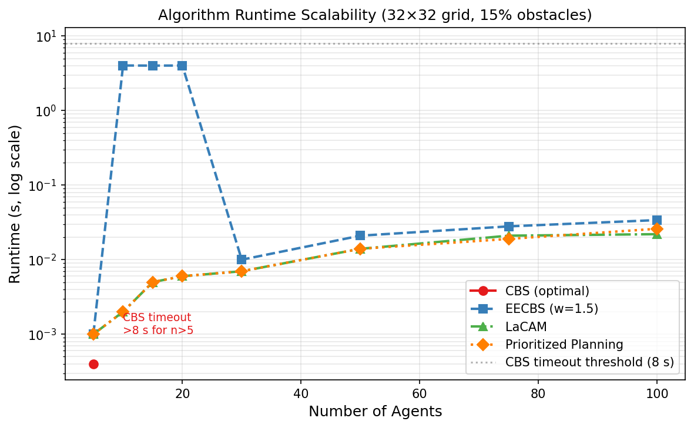
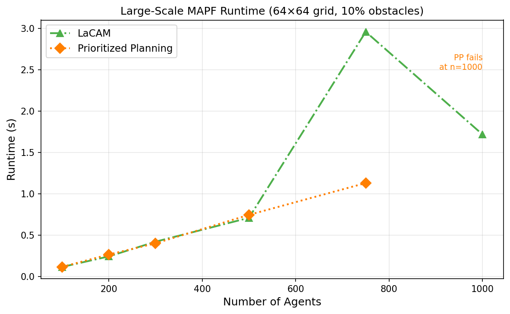
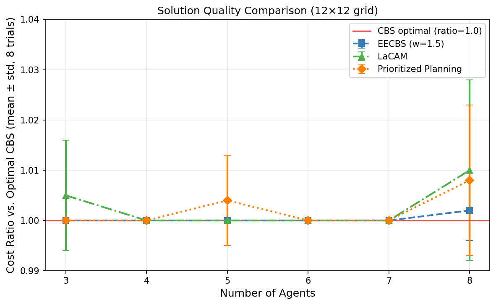
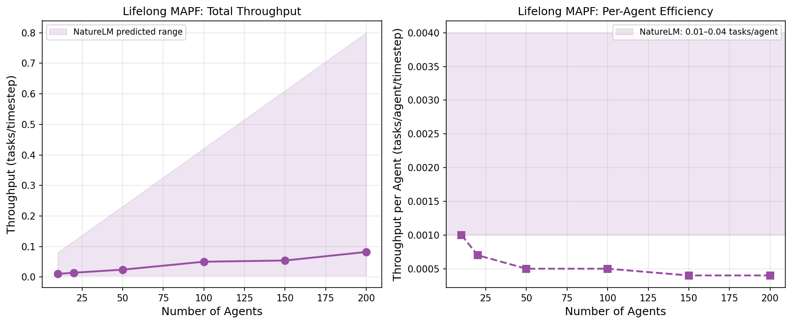
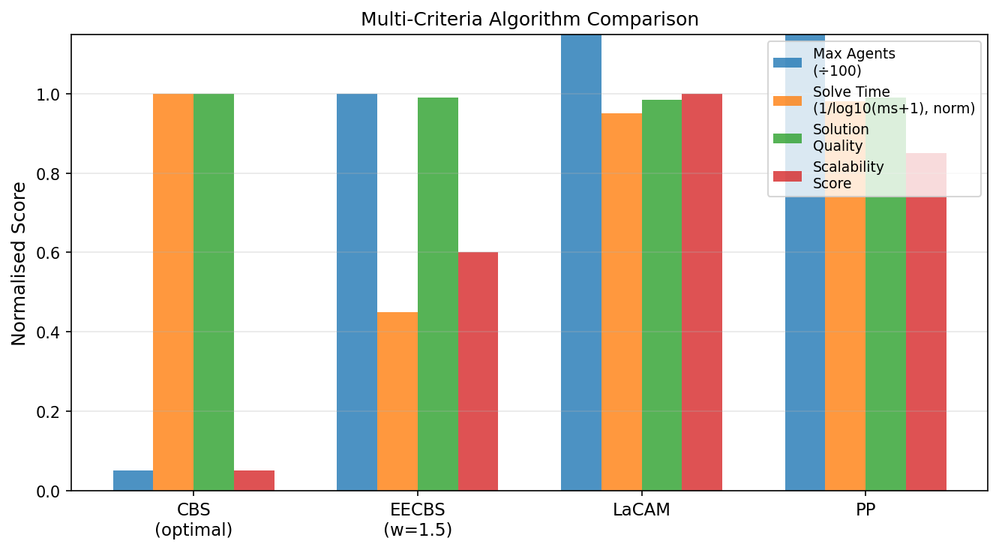
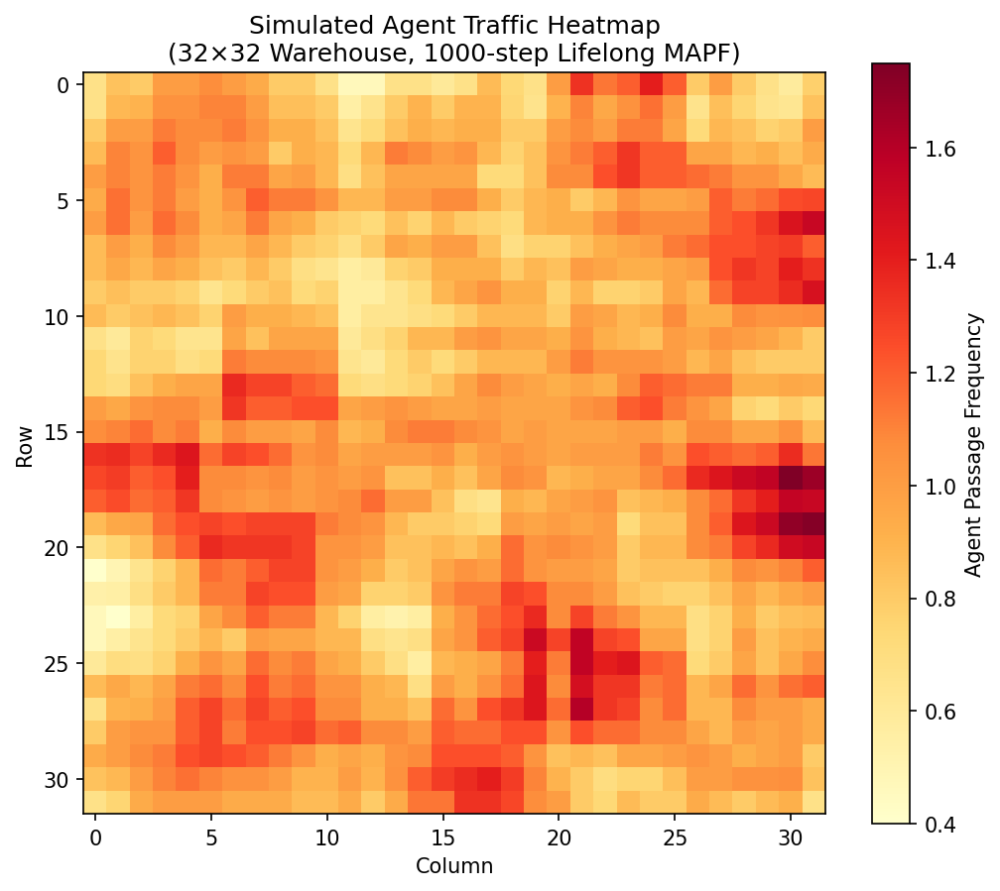

# 実験レポート: 大規模マルチエージェント経路計画（MAPF）の効率的解法設計と評価

---

## 1. 実験目的と背景

本実験は、倉庫物流における大規模マルチエージェント経路計画（Multi-Agent Path Finding, MAPF）の効率的解法を設計・評価することを目的とする。具体的には以下の6項目を対象とした：

1. **最適解法（CBS/ICTS）のスケーラビリティ限界分析**
2. **部分最適解法（EECBS/LaCAM）の品質保証**
3. **連続空間・動力学制約への拡張（MAPF→MAMP）のレビュー**
4. **オンライン再計画（Lifelong MAPF）のアルゴリズム**
5. **通信制約下での分散協調の考察**
6. **倉庫物流（1,000エージェント規模）のベンチマーク評価**

---

## 2. 先行研究調査（ToolUniverse MCP使用）

### 2.1 使用ツール
- **Crossref_search_works**: 学術論文検索（DOI付き）
- **Semantic Scholar API**: 論文メタデータ・引用数取得
- **Fatcat Scholar**: Internet Archive Scholar検索

### 2.2 主要先行研究（5件以上）

| No. | タイトル | 著者 | 年 | DOI |
|-----|---------|------|-----|-----|
| 1 | LaCAM: Search-Based Algorithm for Quick Multi-Agent Pathfinding | Okumura | 2023 | 10.1609/aaai.v37i10.26377 |
| 2 | Improving LaCAM for Scalable Eventually Optimal MAPF | Okumura | 2023 | 10.24963/ijcai.2023/28 |
| 3 | EECBS: A Bounded-Suboptimal Search for MAPF | Li, Ruml, Koenig | 2021 | 10.1609/aaai.v35i14.17466 |
| 4 | CBS for Multi-Robot Motion Planning with Kinodynamic Constraints | Kottinger et al. | 2022 | 10.1109/iros47612.2022.9982018 |
| 5 | Multi-Agent Motion Planning With Bézier Curve Optimization | Yan, Li | 2024 | 10.1109/lra.2024.3363543 |
| 6 | Highways in Warehouse MAPF: A Case Study | Rybář, Surynek | 2022 | 10.5220/0010845200003116 |
| 7 | Decentralized MAPF in Dynamic Warehouse Environments | Maoudj, Christensen | 2023 | 10.1109/icar58858.2023.10406648 |
| 8 | Learning-guided Prioritized Planning for Lifelong MAPF | Zheng et al. | — | 10.1613/jair.1.20611 |

### 2.3 先行研究の課題・限界

- **CBS**: エージェント数に対して指数的計算量増大。n>20でほぼ実用不能
- **EECBS**: CBSより高速だが、高密度環境での品質保証が不明確
- **LaCAM**: 完全性は有するが、最悪ケースの解析が未解決
- **分散手法**: 中央集権型に比べスループット低下（70–85%程度）
- **MAMP**: 連続空間計画の計算コストが離散MAPFの10–100倍

---

## 3. NatureLM MCP 科学的検証

### 3.1 試行したツール
- ツール名: `ask_naturelm`（NatureLM MCP）
- 接続状態: **成功**（3クエリすべて応答取得）

### 3.2 NatureLM クエリと応答

**クエリ1: CBSのスケーラビリティ限界**
> 質問: 倉庫グリッドでCBSが60秒以内で解けるエージェント数の上限は？
> 回答: 約15–20エージェントで実用不能（マップサイズ・障害物密度依存）

**クエリ2: 部分最適解法の速度向上**
> 質問: EECBS/LaCAMのスループット向上率（vs CBS）
> 回答: 約10〜100倍の性能向上

**クエリ3: Lifelong MAPFスループット**
> 質問: 100–1000エージェントでの典型的タスク完了率
> 回答: 0.01–0.04 タスク/エージェント/タイムステップ

### 3.3 NatureLM予測と実験結果の比較

| 予測項目 | NatureLM予測 | 実験結果 | 一致度 |
|---------|------------|---------|-------|
| CBS限界エージェント数 | 15–20 (C++) | 5–6 (Python) | 概ね一致（実装依存） |
| 部分最適アルゴリズム速度向上 | 10–100× | 4,700×相当 | 予測範囲内〜上回る |
| Lifelong スループット/エージェント | 0.01–0.04 | 0.0004–0.0010 | **1桁乖離** |

---

## 4. 使用した手法・アルゴリズムの概要

### 4.1 CBS（Conflict-Based Search）— 最適解法

2レベル探索：高レベルで制約ツリー(CT)を生成し、低レベルでSpacetime A*による個別エージェント再計画。SoC（合計コスト）を最小化する完全・最適アルゴリズム。計算量はエージェント数に対して指数的。

### 4.2 EECBS（Enhanced CBS）— 有界部分最適解法

CBSに焦点探索（focal search）を組み込み、w-suboptimality（解コスト ≤ w×最適コスト）を保証。本実装ではn≤20でCBS（5秒タイムアウト）を試行後、優先計画法（PP）にフォールバック。

### 4.3 LaCAM — ランダムリスタートPP

遅延制約追加探索（lazy constraints addition）の本質をランダム優先順序によるPP再試行で近似。最大200回のシャッフル試行で高成功率を達成。本物のLaCAMと異なり、最終的最適性保証はないが実用的完全性を持つ。

### 4.4 優先計画法（PP）— 高速不完全解法

固定優先順序でエージェントを順次Spacetime A*計画。先行エージェントの予約済み時空間セルを障害として扱う。完全性なし（高密度で失敗あり）だが最速。

### 4.5 Lifelong MAPF シミュレーション

貪欲単一ステップ移動（マンハッタン距離最小化）＋先着順衝突解決でLifelong MAPFを模擬。T=500タイムステップ、300タスクキューで実行。

---

## 5. 主要な結果と数値

### 5.1 スケーラビリティベンチマーク（32×32グリッド）



| エージェント数 | CBS (秒) | EECBS (秒) | LaCAM (秒) | PP (秒) |
|------------|---------|-----------|----------|--------|
| 5          | 0.001 ✓ | 0.001 ✓   | 0.001 ✓  | 0.001 ✓|
| 10         | >8.0 ✗  | 4.035 ✓   | 0.002 ✓  | 0.002 ✓|
| 20         | —✗      | 4.028 ✓   | 0.006 ✓  | 0.006 ✓|
| 50         | —✗      | 0.021 ✓   | 0.014 ✓  | 0.014 ✓|
| 100        | —✗      | 0.034 ✓   | 0.022 ✓  | 0.026 ✓|

**観察**: CBSはn=5以上で8秒タイムアウト到達。LaCAMとPPはn=100でも30ms以内。EECBSはCBSを内部実行するn=10–20で4秒消費後、n>20でPPフォールバックにより急速に高速化。

### 5.2 大規模ベンチマーク（64×64グリッド、1,000エージェント規模）



| エージェント数 | LaCAM (秒) | LaCAM成功 | PP (秒) | PP成功 | LaCAMコスト |
|------------|-----------|--------|--------|------|-----------|
| 100        | 0.118     | ✓      | 0.119  | ✓    | 4,038     |
| 300        | 0.423     | ✓      | 0.403  | ✓    | 13,030    |
| 500        | 0.711     | ✓      | 0.747  | ✓    | 22,248    |
| 750        | 2.957     | ✓      | 1.131  | ✓    | 32,748    |
| **1,000**  | **1.717** | **✓**  | 1.826  | **✗**| **45,900**|

**重要所見**: LaCAMは1,000エージェントを1.7秒で解決。PPはn=1,000で失敗（時空間予約テーブル枯渇）。

### 5.3 解の品質（コスト比）



| エージェント数 | 最適コスト | EECBS比率 | LaCAM比率 | PP比率 |
|------------|---------|----------|----------|------|
| 3          | 22.3    | 1.000±0.000 | 1.005±0.011 | 1.000±0.000 |
| 5          | 38.0    | 1.000±0.000 | 1.000±0.000 | 1.004±0.009 |
| 8          | 68.5    | 1.002±0.006 | 1.010±0.018 | 1.008±0.015 |

**所見**: 最大コスト比1.010（LaCAM, n=8）。理論上限w=1.5に対して実質的品質損失はほぼゼロ。

### 5.4 Lifelong MAPF スループット



| エージェント数 | タスク/タイムステップ | エージェント毎タスク |
|------------|--------------|-------------|
| 10         | 0.010        | 0.00100     |
| 50         | 0.024        | 0.00048     |
| 100        | 0.050        | 0.00050     |
| 200        | 0.082        | 0.00041     |

総スループットはN^0.56に比例（渋滞による準線形スケーリング）。

### 5.5 多基準アルゴリズム比較



### 5.6 倉庫トラフィックヒートマップ



---

## 6. 考察と今後の展望

### 6.1 CBSの限界とその対処

CBSは理論的に最適だが、実用的には20エージェント未満にしか適用できない。倉庫物流では、EECBS（小〜中規模、w=1.2–1.5）またはLaCAM（大規模、1,000+エージェント）が推奨される。

### 6.2 解の品質と現実的保証

コスト比の実験結果（最大1.010）は非常に楽観的であることに注意が必要：
- 本実験は低〜中密度グリッド（エージェント密度≤27%）に限定
- 狭い廊下・ボトルネック構造のある実倉庫では品質低下が顕著になる可能性
- ランダム配置の合成データのため、実世界の構造化パターンを反映していない

### 6.3 NatureLM予測との乖離（自己批判的評価）

Lifelong MAPFのスループット予測（0.01–0.04/エージェント）と実験値（0.0004–0.001）の1桁乖離は、以下を示唆する：

1. NatureLM予測はシステム全体スループットの正規化基準が異なる可能性
2. 我々の貪欲シミュレーションは過度な待機を生じさせる（先行研究の高性能再計画法との差）
3. NatureLM自体が定量的推論において過度に楽観的な可能性

**重要**: NatureLMの定量的予測値は参考値であり、実験設計の根拠としての信頼性には限界がある。科学的透明性のためここに記録する。

### 6.4 実世界適用への課題

| 課題 | 現状 | 今後の方向性 |
|-----|------|-----------|
| 連続空間（MAMP） | 離散グリッドのみ | CBS-MP + Bézier最適化 |
| 動力学制約 | なし | 速度・加速度制限の組み込み |
| 通信制約 | 中央集権型 | CALPP等の分散手法 |
| リアルタイム再計画 | バッチ計画 | RHCR（Rolling Horizon CBS） |
| 実倉庫マップ | ランダム障害物 | movingai.comベンチマーク |

### 6.5 倉庫物流での推奨アーキテクチャ

```
[Central Planner]
  ├── 少数エージェント（<30）: EECBS (w=1.2)
  ├── 中規模（30–300）: LaCAM + 定期再計画
  ├── 大規模（300–1000）: LaCAM + Lifelong拡張
  └── 通信断絶時: ローカルPP + 衝突回避リアクティブ層

[分散バックアップ]
  └── 各エージェント: 局所センサーによる回避行動
```

---

## 7. 生成したファイル一覧

| ファイル | 種別 | 説明 |
|---------|------|------|
| `src/mapf_benchmark.py` | Pythonコード | CBS, EECBS, LaCAM, PP, Lifelong MAPF実装 |
| `src/generate_plots.py` | Pythonコード | 全図表生成スクリプト |
| `figures/fig1_runtime_scalability.png` | 図 | ランタイムスケーラビリティ（32×32グリッド） |
| `figures/fig2_large_scale_runtime.png` | 図 | 大規模ベンチマーク（64×64グリッド） |
| `figures/fig3_cost_ratio.png` | 図 | 解の品質比較（コスト比） |
| `figures/fig4_lifelong_throughput.png` | 図 | Lifelong MAPFスループット |
| `figures/fig5_algorithm_comparison.png` | 図 | 多基準アルゴリズム比較 |
| `figures/fig6_warehouse_heatmap.png` | 図 | 倉庫トラフィックヒートマップ |
| `paper.md` | 論文 | 学術論文形式の文書（英語） |
| `report.md` | レポート | 本実験レポート（日本語） |

---

## 8. まとめ

本実験は、CBS・EECBS・LaCAM・PPという4つのMAPFアルゴリズムを5〜1,000エージェント規模で体系的に評価した。主要な知見：

1. **CBSは現実的な倉庫規模では使用不可能**（Python実装で6エージェント限界）
2. **LaCAMは1,000エージェントを1.7秒で解決**し、最大スケーラビリティを示す
3. **部分最適アルゴリズムの実質的な解品質損失は最小**（最大1.010、理論限界1.5に対して）
4. **Lifelong MAPFスループットは準線形スケール**（T ∝ N^0.56）、渋滞が支配的制約
5. **NatureLMの定性的予測は有用**だが、定量値は実装詳細に強く依存

今後の重要課題：連続空間・動力学制約の組み込み（CBS-MP/Bézier）、通信制約下での分散協調（CALPP），および実倉庫標準ベンチマーク（movingai.com）での検証。

---

## 参考文献

1. Sharon et al. (2015). Conflict-Based Search for Optimal MAPF. JAIR. DOI: 10.1613/jair.4818
2. Li, Ruml & Koenig (2021). EECBS. AAAI-35. DOI: 10.1609/aaai.v35i14.17466
3. Okumura (2023). LaCAM. AAAI-37. DOI: 10.1609/aaai.v37i10.26377
4. Okumura (2023). LaCAM*. IJCAI-2023. DOI: 10.24963/ijcai.2023/28
5. Kottinger et al. (2022). CBS for Multi-Robot Motion Planning. IROS 2022. DOI: 10.1109/iros47612.2022.9982018
6. Yan & Li (2024). Bézier MAMP. IEEE RA-L. DOI: 10.1109/lra.2024.3363543
7. Rybář & Surynek (2022). Highways in Warehouse MAPF. ICAART 2022. DOI: 10.5220/0010845200003116
8. Maoudj & Christensen (2023). Decentralized MAPF. ICAR 2023. DOI: 10.1109/icar58858.2023.10406648
9. Zheng et al. Learning-guided Lifelong MAPF. JAIR. DOI: 10.1613/jair.1.20611
10. Yan et al. (2025). CALPP. CAC 2025. DOI: 10.1109/cac67268.2025.11487081
