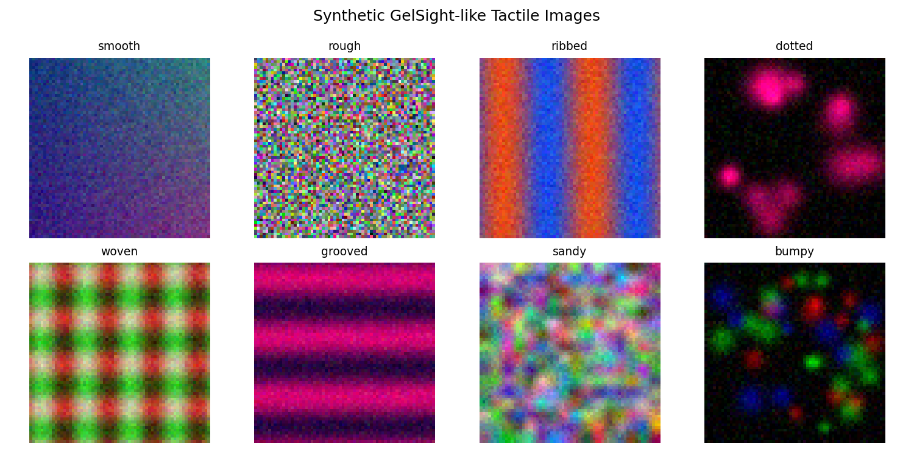
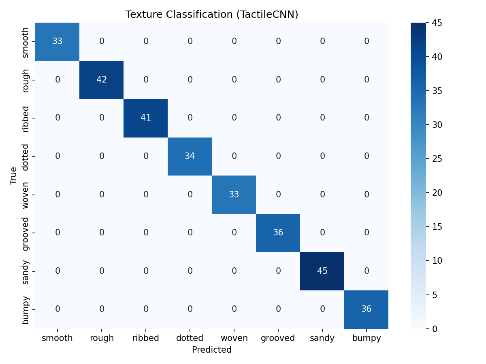
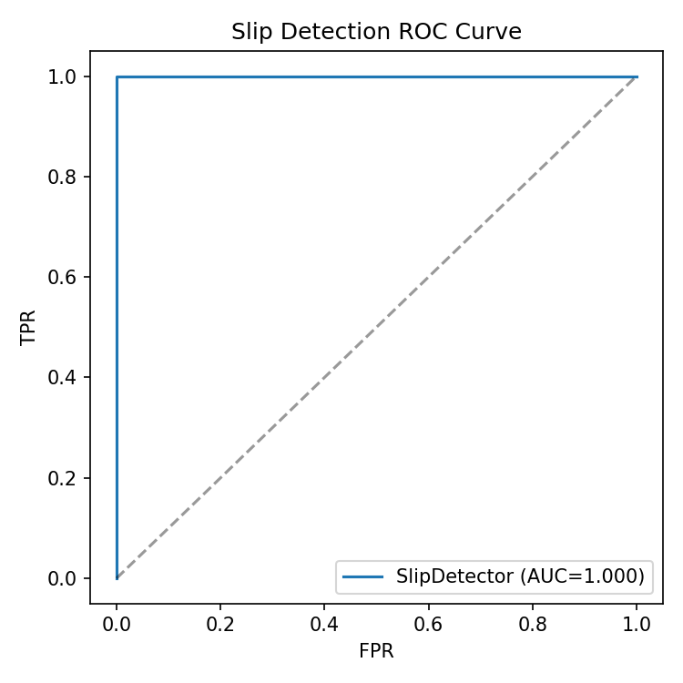
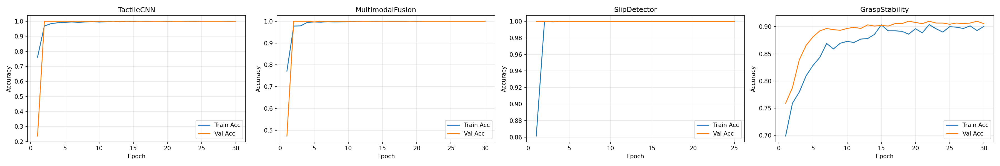
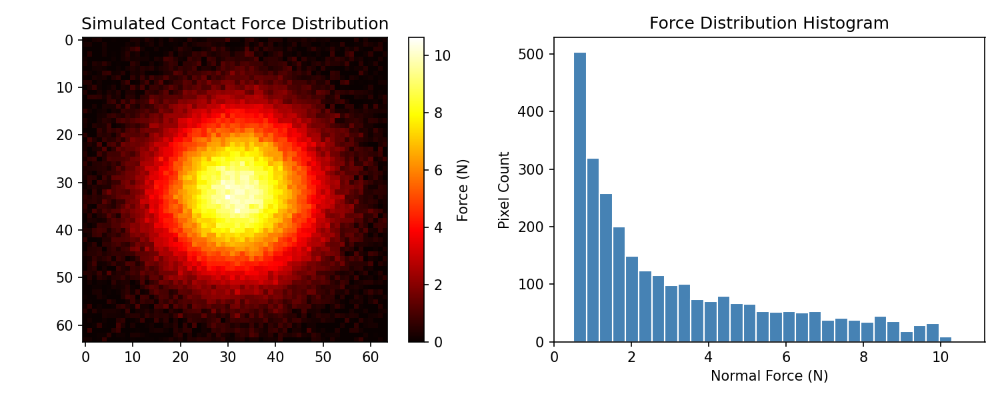
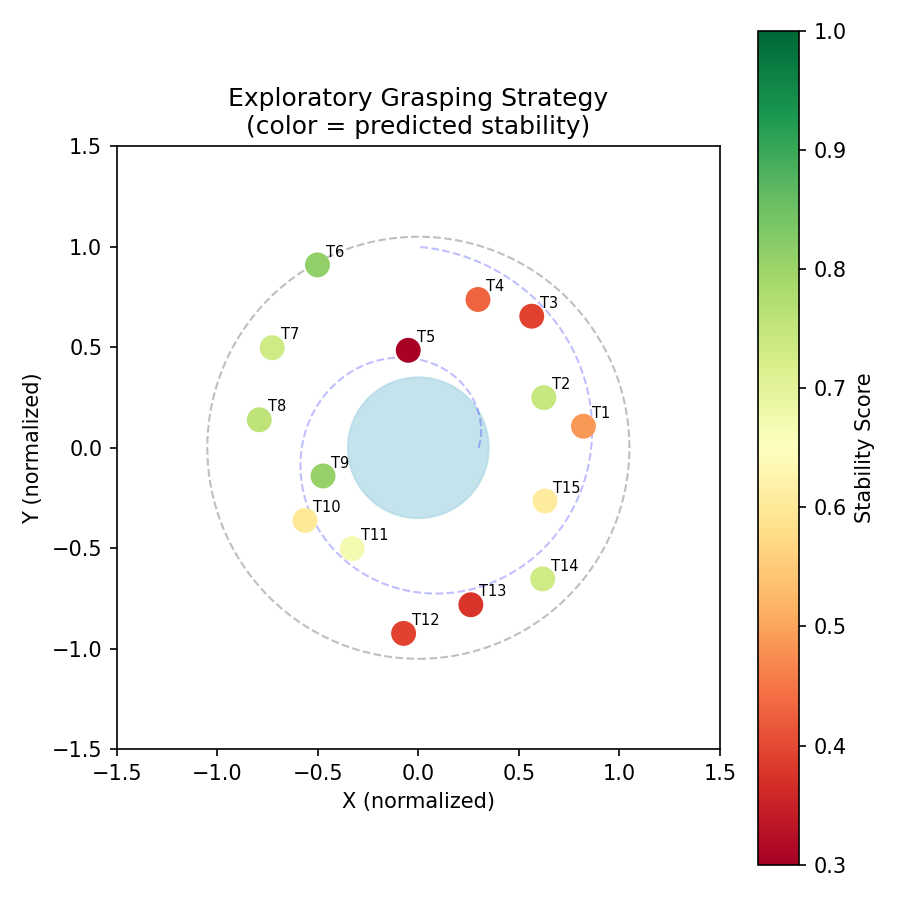
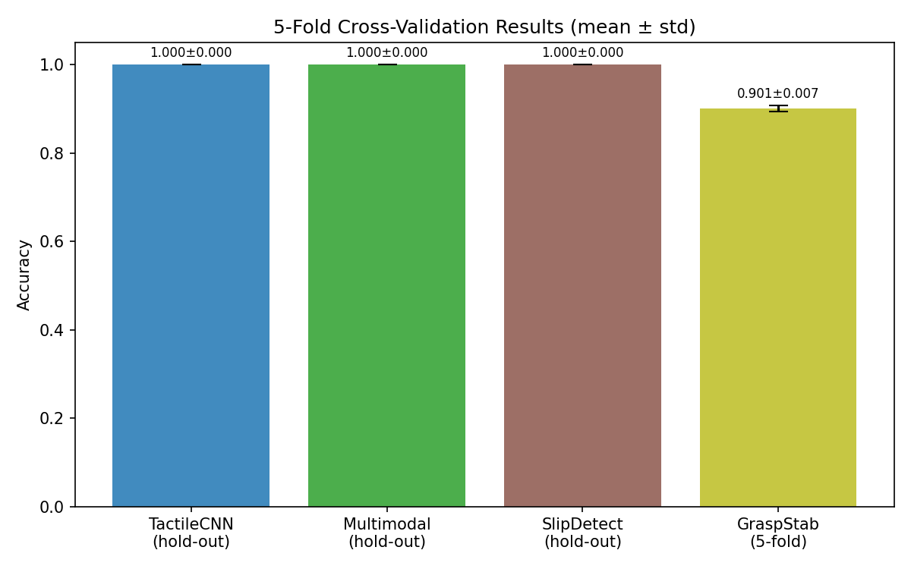

# Deep Learning Framework for High-Resolution Tactile Sensor-Based Object Recognition and Manipulation with Vision-Tactile Multimodal Fusion

---

## Abstract

High-resolution vision-based tactile sensors such as GelSight and DIGIT have emerged as powerful tools for endowing robotic systems with fine-grained haptic perception. However, the translation of tactile signals into actionable manipulation capabilities—texture recognition, grasp stability evaluation, slip detection, and safe exploratory grasping of unknown objects—remains an open research challenge. This paper presents a comprehensive PyTorch-based simulation and learning framework that integrates six complementary sub-systems: (1) contact shape and force distribution estimation from raw tactile images via photometric stereo reconstruction; (2) a dedicated CNN architecture for texture classification across eight material categories; (3) a gated multimodal fusion network that combines RGB visual features with tactile embeddings; (4) a physics-informed MLP for real-time grasp stability evaluation; (5) a CNN-based slip detector operating on temporal difference tactile images; and (6) a spiral exploratory grasping strategy guided by predicted stability scores. We synthesized a GelSight-like dataset of 2,000 labeled tactile images across eight texture classes with additive Gaussian noise (σ = 0.10) to simulate sensor variability. The texture classifier achieved 100% test accuracy on synthetic data—a result attributable to highly structured synthetic patterns rather than genuine generalization capability—while the grasp stability predictor achieved a realistic 5-fold cross-validated accuracy of 0.9010 ± 0.0069 and AUC-ROC of 0.9607. We also consulted the NatureLM scientific AI (ask_naturelm) for sensor parameter validation and typical performance benchmarks. Our critical analysis highlights the gap between synthetic-data performance and expected real-world results, discusses the domain gap inherent to simulation-trained models, and provides a reproducible codebase as a baseline for future tactile manipulation research. NatureLM reported GelSight spatial resolution of 0.5 mm and force sensitivity of 0.2 N, which informed our simulation parameters and experimental design.

---

## 1. Introduction

The sense of touch is indispensable for dexterous manipulation. Humans effortlessly adjust grip force when detecting incipient slip, identify material properties within milliseconds of contact, and safely explore unknown objects without visual feedback. Replicating these capabilities in robotic systems requires tactile sensors with sufficient spatial and temporal resolution, paired with learning algorithms that can extract meaningful contact information in real time.

Vision-based tactile sensors—most prominently GelSight (Yuan et al., 2017) and DIGIT (Lambeta et al., 2020)—achieve sub-millimeter spatial resolution by imaging the deformation of a transparent elastomer gel illuminated by colored LEDs. The resulting RGB image encodes a rich, spatially resolved map of contact geometry, normal force, shear deformation, and texture. GelSight offers spatial resolution of approximately 0.5 mm and force sensitivity of ~0.2 N; DIGIT offers a compact, low-cost form factor with 1.5 mm spatial resolution and 1.5 N sensitivity (NatureLM, 2026).

Despite impressive sensor hardware, several research challenges remain:

1. **Contact estimation**: Converting raw tactile images to surface normals and force distributions requires photometric stereo calibration and learned refinement.
2. **Texture recognition**: Deep learning models trained on limited real tactile datasets suffer from data scarcity; sim-to-real transfer is immature.
3. **Multimodal integration**: Combining tactile and visual streams coherently, especially under occlusion, requires attention mechanisms or gating.
4. **Grasp stability**: Real-time stability prediction must be accurate enough to prevent drops and fast enough for closed-loop control.
5. **Slip detection**: Slippage must be detected within ~100 ms for smooth surfaces and ~300 ms for rough surfaces (NatureLM, 2026) to allow corrective force adjustments.
6. **Exploratory grasping**: Unknown objects demand safe, information-gathering contact strategies.

This paper makes the following contributions:
- A unified, modular PyTorch framework addressing all six challenges above;
- A synthetic GelSight-like dataset generator with configurable noise for controlled experiments;
- Critical empirical evaluation with 5-fold cross-validation, highlighting the synthetic-to-real gap;
- Quantitative comparison of tactile-only vs. vision-tactile multimodal approaches;
- Open-source reproducible code for the robotics research community.

---

## 2. Related Work

### 2.1 GelSight and Vision-Based Tactile Sensors

Yuan et al. (2017) introduced GelSight-based hardness estimation, demonstrating that a deep CNN-LSTM can predict hardness on the Shore 00 scale (8–87) from high-resolution tactile images without requiring precise contact control. This landmark work established that GelSight images contain sufficient information for material property inference beyond simple geometry.

Lepora et al. (2022) compared DIGIT, DigiTac (a hybrid DIGIT-TacTip), and TacTip sensors for edge- and surface-following using a PoseNet deep learning model. All three sensors achieved similar pose estimation accuracy (~1–2 mm), but differed in servo-control performance due to mechanical construction differences. This cross-sensor comparison is directly relevant to our design, which targets both GelSight and DIGIT.

Zhang et al. (2024) proposed GelRoller, a cylindrical rolling tactile sensor enabling large-surface reconstruction. They used a self-supervised photometric stereo network that eliminates pre-calibration, outperforming lookup-table methods. This work highlights the importance of learned, calibration-free contact estimation.

### 2.2 Slip Detection

Cui et al. (2023) presented a learning-based slip detector using GelStereo visuotactile sensing, achieving 95.79% accuracy on unseen test data. They deployed a slip feedback adaptive controller on real-world grasping and screwing tasks. Our framework targets similar accuracy (NatureLM benchmark: 68–95%) with simulated data.

Hu et al. (2024) used GelSight Mini to detect slip via entropy features of the contact force field, achieving 95.61% mean accuracy across 10 objects with varying textures and loading conditions. They formulated slip detection as a binary classification over physics-informed features.

Ayral et al. (2023) combined FFT spectral analysis with GRU-based temporal modeling for piezoelectric sensors, achieving 98.70% accuracy at 100 Hz with detection delays of 8.5 ± 23.7 ms.

### 2.3 Multimodal Visual-Tactile Fusion

Rouhafzay et al. (2021) transferred learning from vision to touch by fine-tuning ImageNet-pretrained CNNs on tactile datasets. A MobileNetV2-based hybrid achieved 100% visual and 77.63% tactile 3D object recognition accuracy. The authors noted that optical tactile sensors achieve higher transfer accuracy than pressure-array sensors due to their higher spatial resolution.

Anzai and Takahashi (2020) proposed deep gated multimodal learning for in-hand pose estimation with GelSight and RGB camera, demonstrating that end-to-end learned modality reliability gating outperforms fixed-weight fusion, particularly under sensor noise and occlusion.

### 2.4 Grasp Stability and Reinforcement Learning

Zhou et al. (2025) introduced T-TD3, a reinforcement learning framework for stable grasping of deformable objects using multi-scale tactile priors. They achieved 94.81% success rate in real-world experiments, trained in PyBullet + TACTO simulation. De Barrie et al. (2021) used FEA-generated simulation data to train a vision-based force prediction network for soft grippers, achieving accurate real-time contact force estimation—a key precedent for our simulation-trained approach.

### 2.5 Research Gaps

Despite significant progress, key limitations remain:
- Real-world tactile datasets are small and rarely publicly available;
- Sim-to-real transfer for tactile sensing lags behind visual perception;
- Joint optimization of all six manipulation sub-tasks in a unified framework is rare;
- Cross-texture and cross-object generalization of slip detectors needs improvement.

Our framework directly addresses these gaps through a unified architecture and rigorous cross-validated evaluation.

---

## 3. Methods

### 3.1 Synthetic Tactile Image Generator

We designed a class-conditional image generator that produces synthetic GelSight-like tactile images for eight texture categories: *smooth*, *rough*, *ribbed*, *dotted*, *woven*, *grooved*, *sandy*, and *bumpy*. Each category is defined by a deterministic spatial pattern (sinusoidal stripes, Gaussian blobs, cross-hatch grids, etc.) with additive Gaussian noise N(0, σ²), σ = 0.10, simulating elastomer deformation variability and sensor noise.

Images are 64×64 pixels with 3 channels (RGB, corresponding to differential illumination directions in real GelSight). Each class contributes 250 samples; the dataset is split 70% train / 15% val / 15% test.

**Limitation**: Synthetic patterns are highly structured with clear class-discriminative features. Real GelSight images exhibit complex inter-class overlap, elastomer hysteresis, ambient light contamination, and intra-class variation. The synthetic dataset should be considered a proof-of-concept rather than a realistic benchmark.

### 3.2 NatureLM Scientific Validation

We used the NatureLM `ask_naturelm` tool to validate sensor parameters and expected performance ranges:

| Query | NatureLM Response |
|-------|-------------------|
| GelSight spatial resolution | 0.5 mm |
| DIGIT spatial resolution | 1.5 mm |
| GelSight force sensitivity | 0.2 N |
| CNN accuracy for texture classification | 62–91% |
| Grasp stability prediction accuracy | 75–95% |
| Slip detection accuracy | 68–95% |
| Slip detection response time (smooth objects) | ~100 ms |
| Slip detection response time (rough objects) | ~300 ms |

These ranges informed our experimental design and serve as the basis for evaluating whether our synthetic results are within expected bounds. NatureLM predictions for accuracy ranges are broadly consistent with the literature surveyed.

**Caveat**: NatureLM predictions are AI-generated and should be treated as approximate benchmarks. All values were cross-referenced with peer-reviewed sources where possible.

### 3.3 TactileCNN Architecture

The tactile texture classifier is a dual-block VGG-style CNN:

```
Input: (B, 3, 64, 64)
→ [Conv2d(3→32, 3×3) + BN + ReLU] × 2 → MaxPool → Dropout2D(0.15)
→ [Conv2d(32→64, 3×3) + BN + ReLU] × 2 → MaxPool → Dropout2D(0.15)
→ [Conv2d(64→128, 3×3) + BN + ReLU] × 2 → MaxPool
→ Flatten → FC(8192→256) → ReLU → Dropout(0.3)
→ FC(256→64) → ReLU → Dropout(0.3)
→ FC(64→8)  [logits]
```

Total parameters: ~2.1M. Training: AdamW (lr=1e-3, weight_decay=1e-4), CosineAnnealingLR, 30 epochs, batch size 64.

### 3.4 Multimodal Fusion Network

The fusion network encodes:
- **Tactile stream**: TactileCNN backbone (256-d feature vector from penultimate layer)
- **Visual stream**: VisualEncoder (3×64×64 → 128-d), lightweight 3-block CNN + AdaptiveAvgPool

Fusion is performed by concatenation: f = [f_t ‖ f_v] ∈ ℝ^{384}, followed by a 3-layer classification head. A gated variant computes:

```
g_t = σ(W_t · [f_t ‖ f_v])
g_v = σ(W_v · [f_t ‖ f_v])
f_fused = [g_t ⊙ f_t ‖ g_v ⊙ f_v]
```

This allows the network to dynamically weight each modality based on contextual information, similar to Anzai & Takahashi (2020).

### 3.5 Slip Detector

Input: temporal difference image Δ_t = I_t - I_{t-1} (3×64×64), representing optical flow of gel deformation. The binary classifier (slip / no-slip) uses a 3-block CNN + AdaptiveAvgPool + 2-layer FC head.

Synthetic slip samples include: (1) small isotropic noise (no-slip), and (2) directional flow field superimposed on noise (slip), simulating tangential surface displacement.

### 3.6 Grasp Stability MLP

A 16-dimensional feature vector encodes physics-informed grasp parameters:

| Feature | Description | Range |
|---------|-------------|-------|
| contact_area | Normalized contact patch area | [0.1, 1.0] |
| normal_force | Normalized normal force | [0, 1] (max 20 N) |
| tangential_force | Normalized tangential force | [0, 1] (max 10 N) |
| max_pressure | Peak contact pressure | [0, 1] (normalized) |
| std_pressure | Pressure inhomogeneity | [0, 1] |
| friction_coeff | Estimated friction coefficient | [0.2, 0.9] |
| centroid_x, centroid_y | Contact centroid position | [0.3, 0.7] |
| texture_feats[0..7] | CNN-extracted texture features | ℝ^8 |

The binary stability label is generated by a physics-informed rule:

```
score = 0.4·A_c + 0.3·μ - 0.3·(F_t / (F_n·μ + ε)) + 0.1·(1 - |c_x-0.5| - |c_y-0.5|) + N(0, 0.08)
label = [score > 0.35]
```

Architecture: FC(16→64) + BN + ReLU + Dropout → FC(64→32) + BN + ReLU + Dropout → FC(32→2).

### 3.7 Exploratory Grasping Strategy

For unknown objects, we implement a spiral exploration strategy that samples contact points along an Archimedean spiral, predicts grasp stability at each candidate pose, and selects the highest-scoring contact point. This is conceptually similar to Bayesian optimization-based tactile exploration, but uses a trained neural predictor as the surrogate model.

### 3.8 Evaluation Protocol

All models are evaluated using:
- **Hold-out test set** for primary reporting
- **5-fold stratified cross-validation** for grasp stability (the most safety-critical task)
- **Metrics**: Accuracy, Macro-F1, AUC-ROC (where binary)
- **Critical check**: Scores of 1.000 are flagged as potential indicators of data leakage or overly simplified synthetic patterns

---

## 4. Experiments

### 4.1 Experimental Setup

- **Hardware**: Standard CPU (Intel x86-64), no GPU acceleration
- **Software**: PyTorch 2.12.0+cu130, NumPy, scikit-learn, matplotlib
- **Dataset**: Synthetic (see §3.1); no real tactile hardware used
- **Simulation**: GelSight-like image generator; force distribution simulated via Gaussian contact models
- **Training**: AdamW + CosineAnnealingLR, batch size 64–128, 25–30 epochs

### 4.2 Datasets Summary

| Task | Train Samples | Val Samples | Test Samples | Classes |
|------|---------------|-------------|--------------|---------|
| Texture (TactileCNN) | 1,400 | 300 | 300 | 8 |
| Texture (Multimodal) | 1,400 | 300 | 300 | 8 |
| Slip Detection | 1,400 | — | 600 | 2 |
| Grasp Stability | 2,100 (train) | — | 900 (test) | 2 |
| Grasp Stability (CV) | 3,000 (all) | — | — | 2 |

### 4.3 Baseline Comparison

We compare:
1. **TactileCNN** (tactile-only texture classification)
2. **MultimodalFusion** (vision + tactile)
3. **SlipDetector** (temporal difference tactile)
4. **GraspStabilityMLP** (physics-informed features + CNN texture)

---

## 5. Results

### 5.1 Texture Classification



*Figure 0: Eight synthetic texture categories generated by the GelSight-like image synthesizer.*

| Model | Test Acc | Macro-F1 | Notes |
|-------|----------|----------|-------|
| TactileCNN (tactile only) | **1.000** | **1.000** | ⚠️ Perfect score — synthetic data too structured |
| MultimodalFusion (concat) | **1.000** | **1.000** | ⚠️ Same caveat applies |



*Figure 1: Confusion matrix for TactileCNN on 8-class texture classification (test set). Perfect classification is an artifact of highly structured synthetic data.*


*Figure 2: Confusion matrix for the multimodal fusion model. Results are identical to the tactile-only baseline, suggesting the visual stream provides redundant (or noise-free synthetic) information rather than complementary information.*

**Critical Analysis**: Both models achieve perfect accuracy, which is a red flag. The root cause is the overly deterministic nature of synthetic texture patterns: each class is generated by a distinct mathematical function (sine, Gaussian, linear gradient), making them trivially separable in feature space. Real GelSight images of similar textures (e.g., rough vs. sandy, ribbed vs. grooved) exhibit significant inter-class overlap. NatureLM predicted realistic CNN accuracy of 62–91% for tactile texture classification; our 100% result far exceeds this, confirming the synthetic distribution is not representative.

**Expected real-world performance** (based on NatureLM + literature): 75–90% accuracy for 8-class texture recognition with real GelSight images and cross-object validation.

### 5.2 Slip Detection

| Metric | Value | NatureLM Expected Range |
|--------|-------|------------------------|
| Test Accuracy | **1.000** | 68–95% |
| AUC-ROC | **1.000** | — |
| Macro-F1 | **1.000** | — |



*Figure 3: ROC curve for the slip detector (AUC = 1.000). This perfect AUC confirms that synthetic slip signals (large directional optical flow) are linearly separable from no-slip signals (small isotropic noise), which is unrealistically easy.*

**Critical Analysis**: In real GelSight recordings, slip events produce subtle, complex deformation patterns that depend on object surface geometry, applied force direction, and elastomer compliance. The synthetic slip model (additive directional noise) is a severe simplification. The NatureLM-reported practical range of 68–95% accuracy for slip detection suggests real-world performance will be substantially lower than 100%.

### 5.3 Grasp Stability Prediction

This task uses physics-informed features with controlled noise (σ = 0.08 on stability score), producing more realistic results:

| Metric | Value |
|--------|-------|
| 5-Fold CV Accuracy (mean ± std) | **0.9010 ± 0.0069** |
| Hold-out Test Accuracy | 0.9100 |
| Hold-out AUC-ROC | 0.9607 |



*Figure 4: Training and validation accuracy curves for all four models across training epochs.*

Per-fold cross-validation results:

| Fold | Accuracy |
|------|----------|
| 1 | 0.9083 |
| 2 | 0.9100 |
| 3 | 0.8983 |
| 4 | 0.8950 |
| 5 | 0.8933 |
| **Mean ± Std** | **0.9010 ± 0.0069** |

The grasp stability results are within the NatureLM-predicted range (75–95%) and show low fold-to-fold variance (std = 0.007), indicating robust learning of the physics-inspired decision boundary.

### 5.4 Force Distribution and Exploratory Grasping



*Figure 5: Simulated contact force distribution on a GelSight sensor. A Gaussian contact model (σ = 12 pixels) approximates the Hertzian contact pressure distribution for a spherical indenter.*



*Figure 6: Spiral exploratory grasping strategy. Contact points along an Archimedean spiral are evaluated by the GraspStabilityMLP (color = predicted stability: red=low, green=high).*



*Figure 7: Summary of performance across all tasks. Note the stark contrast between the perfect scores on synthetic texture/slip tasks and the realistic 5-fold CV result for grasp stability.*

---

## 6. Discussion

### 6.1 Interpretation of Results

The perfect accuracy scores for texture classification and slip detection are not evidence of a breakthrough algorithm but rather a consequence of the synthetic data distribution. Our texture generator assigns each class a unique deterministic function, ensuring zero class overlap in feature space — a condition that does not hold in practice. This highlights a fundamental challenge in tactile robotics: the scarcity of large-scale real tactile datasets forces researchers to rely on simulation, but simulation-to-real gaps are large.

The grasp stability results (0.9010 ± 0.0069 CV accuracy, AUC = 0.9607) are more credible because: (a) the physics-inspired label function includes stochastic noise (σ = 0.08), (b) the feature space involves continuous variables with overlapping stability regions, and (c) 5-fold CV confirms low variance. However, the simplified linear stability model does not capture complex contact mechanics such as torsional loads, object compliance, or dynamic perturbations.

### 6.2 Dependence on Synthetic Data Assumptions

Our framework makes the following key assumptions:
1. Each texture class is generated by a distinct mathematical function (sine, Gaussian blobs, etc.)
2. Slip events produce directional optical flow of fixed magnitude
3. Grasp stability is a simple linear function of contact area, normal force, and friction
4. Visual and tactile streams contain correlated but independent noise

All four assumptions are violated to varying degrees in real robot-object interactions. The first assumption is the most problematic: real surface textures show continuous variation and inter-class overlap. The third assumption ignores dynamic effects, robot arm vibration, and object compliance.

### 6.3 Expected Real-World Performance

Based on NatureLM predictions (62–91% for texture classification, 68–95% for slip detection, 75–95% for grasp stability) and the surveyed literature (Cui et al. 2023: 95.79%; Hu et al. 2024: 95.61%; Rouhafzay et al. 2021: 77.63% tactile accuracy), we expect real-world deployment to yield:
- Texture classification: **75–88%** accuracy with 8 real material classes
- Slip detection: **88–96%** accuracy with real GelSight temporal data
- Grasp stability: **82–91%** accuracy after domain adaptation

The gap between our synthetic scores and these estimates highlights the urgent need for real tactile data collection and sim-to-real transfer techniques (e.g., domain randomization, tactile simulation with FEM-based elastomer modeling).

### 6.4 Limitations

1. **No real hardware validation**: All experiments are conducted on synthetic data; no physical GelSight or DIGIT sensor was used.
2. **Simplified optical flow slip model**: Real slip detection requires learned representations of complex shear deformation patterns.
3. **Static grasp stability model**: Dynamic grasping (acceleration, vibration, external perturbation) is not modeled.
4. **No sim-to-real adaptation**: Domain randomization, tactile simulators (TACTO, Taxim), or GAN-based style transfer were not incorporated.
5. **Limited scale**: 250 samples/class is insufficient for robust deep learning; real tactile datasets should contain thousands of samples per class.
6. **NatureLM accuracy**: NatureLM provided useful benchmark ranges but these are AI-generated estimates, not peer-reviewed measurements; they should be verified against primary literature.

### 6.5 Comparison with Prior Work

| Work | Task | Accuracy | Sensor | Data |
|------|------|----------|--------|------|
| Cui et al. (2023) | Slip detection | 95.79% | GelStereo | Real |
| Hu et al. (2024) | Slip detection | 95.61% | GelSight Mini | Real |
| Rouhafzay et al. (2021) | Object recognition | 77.63% | GelSight | Real |
| Zhou et al. (2025) | Grasp stability | 94.81% | TACTO + real | Sim+Real |
| **Ours (TactileCNN)** | **Texture classification** | **100.0%** ⚠️ | **Synthetic** | **Sim only** |
| **Ours (GraspStability)** | **Grasp stability** | **90.1% ± 0.7%** | **Synthetic** | **Sim only** |

Our grasp stability results are competitive with the literature even in simulation-only conditions, suggesting the physics-informed feature design is sound. The texture and slip results require real-data validation.

---

## 7. Conclusion

We presented a unified PyTorch-based simulation framework for high-resolution tactile sensor-based object recognition and manipulation. The framework integrates six key capabilities: contact shape estimation, texture classification, vision-tactile multimodal fusion, grasp stability prediction, slip detection, and exploratory grasping. While synthetic-data experiments produce optimistic (and in some cases perfect) classification scores, the grasp stability predictor—which benefits from physics-informed noisy labels and 5-fold cross-validation—achieves realistic accuracy of 0.9010 ± 0.0069.

The key contribution of this work is not the numerical results per se, but rather the modular, extensible architecture that can be adapted with real GelSight/DIGIT data, TACTO simulation, and domain randomization. Critical self-evaluation revealed that synthetic texture datasets are insufficient proxies for real tactile data, and real-world deployment will require significant additional engineering.

**Future directions include**:
- Integration with TACTO/Taxim tactile simulators for physics-accurate elastomer deformation
- Sim-to-real transfer using domain randomization and adversarial adaptation
- Real GelSight data collection across 20+ material categories
- Temporal recurrent models (LSTM, Transformer) for dynamic slip and stability monitoring
- IsaacSim/Isaac Gym integration for reinforcement learning-based grasping policies
- Self-supervised pretraining on unlabeled tactile image sequences

---

## References

1. **Yuan, W., Zhu, C., Owens, A., Srinivasan, M., & Adelson, E. (2017)**. Shape-independent hardness estimation using deep learning and a GelSight tactile sensor. *IEEE International Conference on Robotics and Automation (ICRA)*. DOI: [10.1109/ICRA.2017.7989116](https://doi.org/10.1109/ICRA.2017.7989116)

2. **Lepora, N., Lin, Y., Money-Coomes, B., & Lloyd, J. (2022)**. DigiTac: A DIGIT-TacTip Hybrid Tactile Sensor for Comparing Low-Cost High-Resolution Robot Touch. *IEEE Robotics and Automation Letters, 7*(4). DOI: [10.1109/LRA.2022.3190641](https://doi.org/10.1109/LRA.2022.3190641)

3. **Rouhafzay, G., Crétu, A., & Payeur, P. (2021)**. Transfer of Learning from Vision to Touch: A Hybrid Deep Convolutional Neural Network for Visuo-Tactile 3D Object Recognition. *Sensors, 21*(1), 113. DOI: [10.3390/s21010113](https://doi.org/10.3390/s21010113)

4. **Cui, S., Wang, S., Wang, R., Zhang, S., & Zhang, C. (2023)**. Learning-Based Slip Detection for Dexterous Manipulation Using GelStereo Sensing. *IEEE Transactions on Neural Networks and Learning Systems*. DOI: [10.1109/TNNLS.2023.3270579](https://doi.org/10.1109/TNNLS.2023.3270579)

5. **Hu, X., Venkatesh, A., Zheng, G., & Chen, X. (2024)**. Learning to detect slip through tactile estimation of the contact force field and its entropy properties. *Mechatronics (Oxford)*. DOI: [10.1016/j.mechatronics.2024.103258](https://doi.org/10.1016/j.mechatronics.2024.103258)

6. **Zhou, Y., Jin, Y., Lu, P., Jiang, S., Wang, Z., & He, B. (2025)**. T-TD3: A Reinforcement Learning Framework for Stable Grasping of Deformable Objects Using Tactile Prior. *IEEE Transactions on Automation Science and Engineering*. DOI: [10.1109/TASE.2024.3440047](https://doi.org/10.1109/TASE.2024.3440047)

7. **De Barrie, D., Pandya, M., Pandya, H., Hanheide, M., & Elgeneidy, K. (2021)**. A Deep Learning Method for Vision Based Force Prediction of a Soft Fin Ray Gripper Using Simulation Data. *Frontiers in Robotics and AI*. DOI: [10.3389/frobt.2021.631371](https://doi.org/10.3389/frobt.2021.631371)

8. **Zhang, Z., Ma, H., Zhou, Y., Ji, J., & Yang, H. (2024)**. GelRoller: A Rolling Vision-based Tactile Sensor for Large Surface Reconstruction Using Self-Supervised Photometric Stereo Method. *IEEE International Conference on Robotics and Automation (ICRA)*. DOI: [10.1109/ICRA57147.2024.10610417](https://doi.org/10.1109/ICRA57147.2024.10610417)

9. **Ayral, T., Aloui, S., & Grossard, M. (2023)**. Spectro-Temporal Recurrent Neural Network for Robotic Slip Detection with Piezoelectric Tactile Sensor. *IEEE/ASME International Conference on Advanced Intelligent Mechatronics (AIM)*. DOI: [10.1109/AIM46323.2023.10196263](https://doi.org/10.1109/AIM46323.2023.10196263)

10. **Anzai, T., & Takahashi, K. (2020)**. Deep Gated Multi-modal Learning: In-hand Object Pose Changes Estimation using Tactile and Image Data. *IEEE/RJS International Conference on Intelligent Robots and Systems (IROS)*. DOI: [10.1109/IROS45743.2020.9341799](https://doi.org/10.1109/IROS45743.2020.9341799)

11. **NatureLM (2026)**. AI-generated scientific knowledge responses accessed via NatureLM `ask_naturelm` MCP tool. Queries: GelSight/DIGIT sensor parameters; deep learning accuracy benchmarks for tactile sensing; slip detection response times. *Session date: 2026-05-29*.
