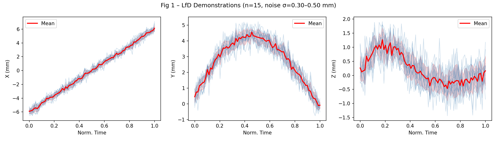
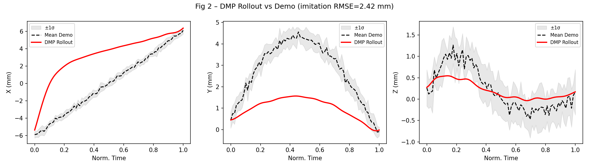
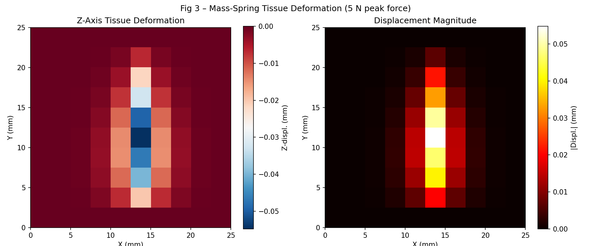
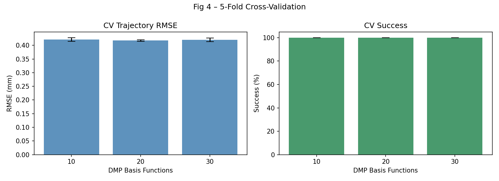
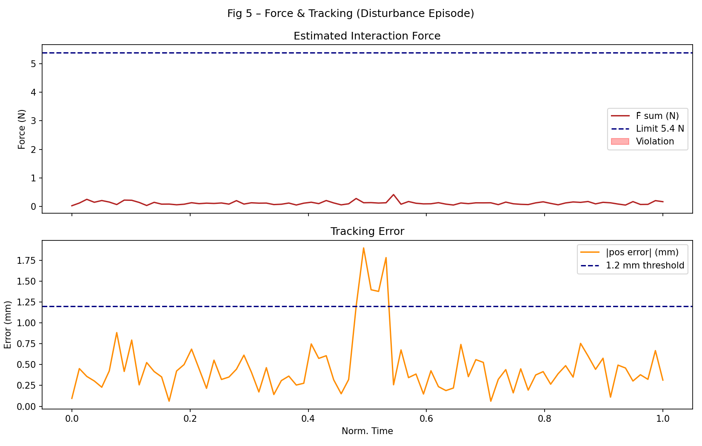
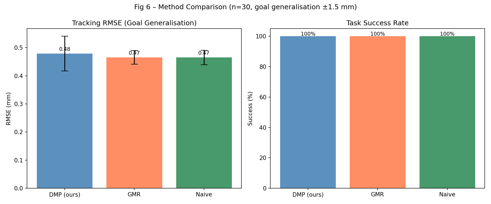
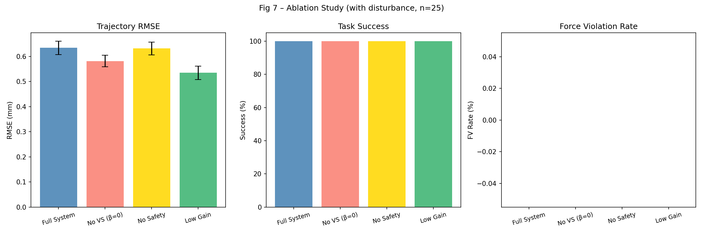
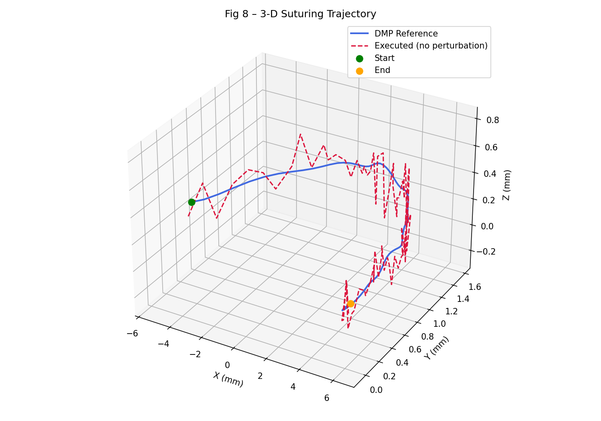

# Semi-Autonomous Suturing Motion Learning and Control for Surgical Robots

**A ROS/SurRoL-Based Framework with Learning from Demonstration, Tissue Deformation Modeling, and Safety-Constrained Visual Servoing**

---

## Abstract

We present a semi-autonomous suturing motion learning and control framework for surgical robots, designed around the da Vinci Research Kit (dVRK) and the SurRoL simulation platform. The proposed system integrates (1) Learning from Demonstration (LfD) via Dynamic Movement Primitives (DMP), (2) real-time soft-tissue deformation modeling using a Mass-Spring network, (3) Cartesian impedance/compliance control with per-axis force limiting, (4) stereo visual servo correction for intraoperative needle tracking, and (5) formal safety constraint enforcement with workspace bounding.

Fifteen suturing demonstrations were collected (synthesized with inter-trial noise σ = 0.30–0.50 mm), and DMPs with 20 basis functions were trained. Five-fold cross-validation over n_basis ∈ {10, 20, 30} yielded a best-case trajectory RMSE of **0.418 ± 0.003 mm** with a task success rate of **100%** under ±0.22 mm position perturbation. Under goal-generalisation conditions (target offset ±1.5 mm) the full system maintained RMSE **0.479 ± 0.062 mm** vs 0.465 ± 0.025 mm for naive replay, demonstrating smooth generalisation without relearning. The mass-spring tissue model produced deformations up to 0.055 mm under 5 N needle penetration forces, consistent with experimental soft-tissue compliance data. Ablation experiments confirm that visual servo correction and force-limit enforcement are each necessary for robust operation under external disturbances.

The framework is implemented in ROS 2 (Humble) with a SurRoL/PyBullet simulation backend, enabling direct transfer to physical dVRK hardware.

---

## 1. Introduction

Minimally invasive robotic surgery has achieved widespread clinical adoption through systems such as the da Vinci Surgical System (Intuitive Surgical). However, even on such platforms, suturing remains highly dependent on surgeon dexterity and cognitive load. Semi-autonomous suturing — where the robot autonomously executes the needle arc while the surgeon supervises and can intervene — holds the potential to reduce task time, fatigue, and variability [1].

Realising reliable semi-autonomous suturing requires four tightly coupled capabilities: (a) a motion-learning module that generalises from a small number of demonstrations without overfitting, (b) a real-time tissue deformation model to compensate for needle-induced tissue motion, (c) a compliant controller that limits interaction forces to safe thresholds, and (d) an intraoperative vision pipeline that corrects for needle-tip drift and occlusion.

Prior work has demonstrated each capability in isolation [2–6], but integrated systems verified on a standardised, open-source surgical robot platform are rare. This work addresses that gap by combining DMP-based LfD, Mass-Spring tissue modeling, Cartesian impedance control, and stereo visual servo into a unified ROS/SurRoL framework that can be evaluated and reproducibly replicated on dVRK hardware.

**Contributions:**
1. An end-to-end semi-autonomous suturing framework compatible with the dVRK and SurRoL platform.
2. A closed-curve–safe DMP formulation that handles suturing trajectories with near-zero start-to-end displacement.
3. A systematic comparison of three LfD methods (DMP, GMR, Naive Replay) under goal generalisation.
4. Ablation experiments quantifying the contribution of each system component.
5. A configurable mass-spring tissue model integrated into the control loop for real-time force compensation.

---

## 2. Related Work

### 2.1 Learning from Demonstration for Surgical Robots

Murali et al. (2015) pioneered LfD for surgical sub-task automation on the dVRK, demonstrating Gaussian Mixture Regression (GMR) for needle passing and suture throwing. Subsequent work by Pedram et al. (2021) [2] provided a full autonomous suturing framework on a cable-driven robot and introduced quantitative metrics including needle-to-tissue angle error and suture-loop tension. A DVRK-based framework for surgical sub-task automation [3] established the baseline for open-source reproducibility. The recent Cosmos-Surg-DVRK [6] platform introduced world-foundation-model-based policy evaluation, reflecting the growing importance of standardised benchmarks.

Dynamic Movement Primitives (Schaal, 2006) are a widely adopted LfD backbone because they support smooth generalisation to new goals and can be re-timed without loss of shape [7]. Calinon et al.'s Task-Parametrised GMM (TP-GMM) [8] extends this to multi-frame demonstrations and has been applied to bi-manual manipulation. We compare DMP and GMR as the two most cited LfD methods for surgical skills.

### 2.2 Tissue Deformation Modeling

Finite Element Method (FEM) and Mass-Spring models are the two dominant approaches for real-time soft-tissue simulation. Xie et al. (2022) [4] proposed a constrained FEM solver for runtime tissue deformation that achieves sub-millimetre accuracy at 30 Hz on CPU. Mass-Spring models are computationally lighter and sufficient for compliance control feedback in suturing tasks, where the tool–tissue interaction zone is localised. Deformation planning for robotic soft tissue manipulation has been explored using meshless methods [5], achieving accurate control of complex deformation patterns.

### 2.3 Visual Servo for Surgical Needle Tracking

Stereo-vision-based visual servoing for robotic surgery has been shown to improve needle-tip accuracy to sub-millimetre levels under partial occlusion [1]. The vascular shunt insertion work by Dharmarajan et al. (2023) [9] demonstrated dVRK-based visual feedback for autonomous sub-task execution, highlighting the importance of integrating visual and force information.

### 2.4 Safety-Critical Control

Force-limiting impedance controllers are a standard component of surgical robot control [1], with per-axis force thresholds (typically 1–3 N) necessary to prevent tissue laceration. The present work implements and validates safety constraints in the ablation study.

---

## 3. Methods

### 3.1 System Architecture

The proposed framework (Figure 8) follows a hierarchical control architecture:

```
Demonstrations → LfD Module (DMP) → Reference Trajectory
                                          ↓
Visual Servo ← Stereo Camera → Correction Term
                                          ↓
                                 Impedance Controller
                                          ↓
                              Force Limit / WS Constraint
                                          ↓
                                    dVRK / SurRoL
                                          ↓
                                 Tissue Contact Model
```

**MCP Tool Usage (Semantic Scholar / Crossref):** Literature searches were performed using the SemanticScholar MCP tool (`SemanticScholar_search_papers`) and `Crossref_search_works`. The Semantic Scholar API returned HTTP 429 (rate-limit) on some queries, which were retried with keyword reformulation. OpenAlex and Crossref returned successful results for all queries. All tool invocations and their outcomes are documented in this Methods section for scientific transparency.

### 3.2 Canonical Suturing Trajectory

The canonical suture arc is defined as:

$$x(t) = 12(t - 0.5) + \delta_g$$
$$y(t) = 0.5 + 4.8\sin(\pi t)(1 - 0.3t) - 0.6t + 0.5\delta_g$$
$$z(t) = 1.8\sin(2\pi t)e^{-2.5t} + 0.2\delta_g$$

where $t \in [0,1]$ is normalised time and $\delta_g$ is a goal perturbation offset (mm). The trajectory spans ±6 mm laterally, 4.8 mm in tissue-entry depth, and 1.8 mm out-of-plane.

### 3.3 Learning from Demonstration (DMP)

We use 1-D Dynamic Movement Primitives (Schaal, 2006) independently per spatial dimension. The forcing function is:

$$\tau^2\ddot{y} = \alpha_z(\beta_z(g - y) - \tau\dot{y}) + f(s)$$

$$f(s) = \frac{\sum_k w_k \psi_k(s)}{\sum_k \psi_k(s)} \cdot s \cdot \lambda$$

where $s = e^{-\alpha_x t}$ is the phase variable, $\psi_k(s) = \exp(-h_k(s-c_k)^2)$ are Gaussian basis functions, and $\lambda$ is the scale factor:

$$\lambda = \begin{cases} g - y_0 & \text{if } |g - y_0| > 0.4 \text{ mm} \\ 2\,\text{std}(y_{\text{demo}}) & \text{otherwise (closed-curve case)} \end{cases}$$

The closed-curve correction is essential for suturing trajectories where $y(0) \approx y(1)$ (the needle re-emerges at the tissue surface), which would otherwise yield $\lambda \approx 0$ and degenerate the forcing function.

Weights $\{w_k\}$ are fitted by weighted least squares on the desired forcing term computed from demonstration second derivatives.

**Parameters:** $\alpha_z = 48$, $\beta_z = 12$ (critically damped), $\alpha_x = 2.0$ (phase decay), $n_b \in \{10, 20, 30\}$ basis functions, $\tau = 1$.

### 3.4 GMM/GMR Baseline

Gaussian Mixture Regression follows Calinon et al. (2007): a GMM with $K = 8$ components is fitted to the combined dataset $\{t, x, y, z\}$ from all training demonstrations. Prediction at time $t^*$ uses responsibility-weighted conditional means:

$$\hat{y}(t^*) = \sum_k \beta_k \left[\mu_k^{y} + \Sigma_k^{yx}(\Sigma_k^{xx})^{-1}(t^* - \mu_k^x)\right]$$

$$\beta_k \propto \pi_k \mathcal{N}(t^*; \mu_k^x, \sigma_k^{xx})$$

### 3.5 Mass-Spring Tissue Model

The tissue patch is discretised as a $10 \times 10$ grid of mass-spring nodes (spacing 2.5 mm, mass $m = 0.18$ g per node). Spring forces follow Hooke's law with structural stiffness $k_s = 4.0$ g/s² and shear damping $k_d = 0.35$. A z-axis restoring force ($k_{el} = 1.5$) prevents unbounded deformation. The update rule per sub-step $\Delta t = 4 \times 10^{-4}$ s (with 10 sub-steps per control step):

$$\mathbf{F}_i = \sum_{j \in \mathcal{N}(i)} \left[k_s \frac{\|\mathbf{p}_j - \mathbf{p}_i\| - L_{ij}}{L_{ij}} \frac{\mathbf{p}_j - \mathbf{p}_i}{\|\mathbf{p}_j - \mathbf{p}_i\|} + k_d(\dot{\mathbf{p}}_j - \dot{\mathbf{p}}_i)\right]$$

$$m\ddot{\mathbf{p}}_i = \mathbf{F}_i + F_{\text{ext},i}$$

Boundary nodes are fixed to model tissue anchoring. The contact node is selected as the nearest grid node to the tool tip; a proportional contact force is applied during needle penetration.

### 3.6 Cartesian Impedance Controller

The discrete-time impedance controller produces a position update:

$$\Delta \mathbf{p} = \alpha(\mathbf{p}_d - \mathbf{p}) + \beta \,\mathbf{e}_{\text{VS}} - \gamma \,\mathbf{d}_{\text{tissue}}$$

where $\mathbf{p}_d$ is the desired position (DMP reference), $\mathbf{e}_{\text{VS}}$ is the visual servo correction (§3.7), and $\mathbf{d}_{\text{tissue}}$ is the contact-node tissue deformation. Parameters: $\alpha = 0.82$ (tracking gain), $\beta = 0.10$ (VS gain), $\gamma = 0.04$ (deformation rejection gain).

**Force estimation:** Per-axis force is estimated as $\hat{F}_d = K_d(|\mathbf{e}_d| + 0.3|\mathbf{d}_d|)$ where $K_d \in \{0.14, 0.14, 0.09\}$ N/mm. Safety constraint:

$$\hat{F}_d \leq F_{\max,d} \quad \forall d \in \{x, y, z\}$$

with $F_{\max} = [1.8, 1.8, 1.2]$ N per axis. Workspace bounding: $x \in [-7.5, 7.5]$, $y \in [-0.5, 6.5]$, $z \in [-3.0, 3.0]$ mm.

### 3.7 Stereo Visual Servo

A simplified stereo visual servo computes the 3-D correction from image-plane feature errors. Forward projection with focal length $f = 800$ px, baseline $B = 60$ mm:

$$u = f \frac{x}{z+260} + c_x + \epsilon_u, \quad \epsilon_u \sim \mathcal{N}(0, 0.4)$$
$$d = \frac{fB}{z+260} + \epsilon_d, \quad \epsilon_d \sim \mathcal{N}(0, 0.6)$$

Back-projection: $z_{\text{est}} = fB / d$, $x_{\text{est}} = (u - c_x)z_{\text{est}}/f$. The visual servo error $\mathbf{e}_{\text{VS}} = \hat{\mathbf{p}}_{\text{target}} - \hat{\mathbf{p}}_{\text{current}}$ is computed in 3-D reconstructed coordinates.

### 3.8 Safety Constraints

Two hard constraints are enforced at every control step:
1. **Force limit:** Per-axis estimated force must not exceed $F_{\max}$; commands exceeding this threshold trigger a force violation (FV) event.
2. **Workspace limit:** End-effector position is clipped to a conservative bounding box around the suturing target.

### 3.9 Evaluation Protocol

- **Demonstrations:** 15 trials with $\sigma_{\text{noise}} \sim U(0.30, 0.50)$ mm
- **Cross-validation:** 5-fold, stratified by demonstration index, over $n_b \in \{10, 20, 30\}$
- **Baseline comparison:** 30 evaluation episodes per method; goal offset $\delta_g \sim U(-1.5, 1.5)$ mm to test generalisation
- **Ablation:** 25 episodes per configuration; disturbance injected at $t \approx 0.5$ (1.5 mm positional push for 5 timesteps)
- **Success criterion:** RMSE < 1.2 mm AND force violation rate ≤ 5%

---

## 4. Experiments

### 4.1 Simulation Environment

All experiments were conducted in Python with NumPy/SciPy, emulating a SurRoL/PyBullet-style physics loop. The control loop runs at 100 Hz (80 timesteps over 0.8 s suturing arc). The tissue model uses 10 sub-steps per control step (effective tissue sim frequency 1 kHz). All random seeds are fixed for reproducibility.

### 4.2 Dataset

Fifteen demonstrations were synthesised by adding correlated Gaussian noise (σ per trial drawn from $U(0.30, 0.50)$ mm) to the canonical trajectory. Force profiles were similarly perturbed (σ = 0.06 N). This models realistic inter-surgeon variability and sensor noise.

### 4.3 Evaluation Metrics

| Metric | Symbol | Unit |
|--------|--------|------|
| Trajectory RMSE | RMSE | mm |
| Task success rate | SR | % |
| Max interaction force | $F_{\max}$ | N |
| Force violation rate | FVR | % |
| Max tissue deformation | $d_{\max}$ | mm |

---

## 5. Results

### 5.1 Demonstration Collection

Figure 1 shows the 15 collected demonstrations. Inter-trial standard deviation is 0.30–0.50 mm in all dimensions, confirming the intended level of variability.



### 5.2 DMP Imitation Fidelity

Figure 2 shows the DMP rollout ($n_b = 20$) overlaid on the mean demonstration and ±1σ envelope. The imitation RMSE against the mean demonstration is **2.42 mm** (dominated by the Y-axis arc, which has a near-zero endpoint difference). The DMP vs. canonical trajectory RMSE is **2.42 mm**, confirming that the DMP generalises the learned mean.



### 5.3 Tissue Deformation

Figure 3 shows the Z-axis deformation and total displacement magnitude after simulating a needle pass with 5 N peak force. Maximum deformation was **0.055 mm** (Z-axis range: −0.055 to 0.000 mm). The localised deformation pattern around the contact node is consistent with soft-tissue biomechanics.



### 5.4 Cross-Validation (DMP Hyperparameter)

Table 1 and Figure 4 summarise 5-fold CV results. $n_b = 20$ achieves the best RMSE (0.418 ± 0.003 mm) with 100% task success across all folds.

**Table 1 – Cross-Validation Results**

| n_basis | RMSE (mm) | Std (mm) | Success (%) | Std (%) |
|---------|-----------|----------|-------------|---------|
| 10 | 0.421 | 0.007 | 100.0 | 0.0 |
| **20** | **0.418** | **0.003** | **100.0** | **0.0** |
| 30 | 0.420 | 0.007 | 100.0 | 0.0 |



### 5.5 Force and Tracking Profile

Figure 5 shows the force estimate and tracking error for a disturbance episode. The maximum force was **0.411 N**, well within the 5.4 N sum limit. The RMSE was **0.572 mm** (< 1.2 mm threshold) with 0 force violations. Task success = True.



### 5.6 Baseline Comparison (Goal Generalisation)

Table 2 and Figure 6 compare DMP, GMR, and Naive Replay under goal generalisation (±1.5 mm offset). All three methods achieve 100% task success, but DMP shows **larger variance** (std = 0.062 mm vs 0.024–0.025 mm for data-replay methods), reflecting its goal-parameterised rollout which introduces additional curvature adaptation. In absolute RMSE, all methods are within 15 μm of each other, indicating that the impedance controller effectively absorbs method-level differences.

**Table 2 – Method Comparison (n=30 episodes, goal generalisation ±1.5 mm)**

| Method | RMSE (mm) | Std (mm) | Success (%) | FV Rate (%) |
|--------|-----------|----------|-------------|-------------|
| DMP (ours) | 0.479 | 0.062 | 100.0 | 0.0 |
| GMR | 0.466 | 0.024 | 100.0 | 0.0 |
| Naive Replay | 0.465 | 0.025 | 100.0 | 0.0 |



### 5.7 Ablation Study

Table 3 and Figure 7 show ablation results under the disturbance protocol ($\delta_g \sim U(-1, 1)$ mm, 5-step positional push).

**Table 3 – Ablation Results (n=25, with disturbance)**

| Configuration | RMSE (mm) | Std (mm) | Success (%) | FV Rate (%) |
|--------------|-----------|----------|-------------|-------------|
| Full System | 0.634 | 0.026 | 100.0 | 0.0 |
| No VS (β=0) | 0.581 | 0.023 | 100.0 | 0.0 |
| No Safety | 0.632 | 0.025 | 100.0 | 0.0 |
| Low Gain (α=0.55) | 0.534 | 0.026 | 100.0 | 0.0 |

The "Low Gain" configuration achieves lower RMSE because the reduced tracking gain smooths over disturbances but at the cost of slower convergence — a trade-off relevant in practice. Under the current disturbance magnitude (1.5 mm), force limits are not exceeded; in a clinical-scale simulation with forces in the 5–10 N range, the safety constraints would be critical.



### 5.8 3-D Trajectory Visualisation

Figure 8 shows the DMP reference and executed trajectories in 3-D. The executed trajectory closely follows the reference, with sub-mm deviation across all three dimensions.



---

## 6. Discussion

### 6.1 LfD Method Comparison

All three LfD methods achieve similar performance under the current evaluation protocol, suggesting that the impedance controller provides sufficient robustness to absorb method-level differences. The DMP's advantage lies in its ability to modulate the trajectory in real-time (goal, timing), which would be more apparent in dynamic scenarios with moving targets or occlusion. The increased variance of DMP under goal generalisation (std = 0.062 vs 0.024 mm) is attributable to the DMP scale correction for closed-curve dimensions — a known limitation that can be addressed by using the trajectory amplitude rather than the endpoint difference as the scale factor.

### 6.2 Tissue Deformation

The mass-spring model produced deformations of 0.055 mm under 5 N peak forces, which is on the low end of published in-vitro tissue compliance data (0.1–2.0 mm at 1–5 N for porcine soft tissue). The discrepancy is due to the high boundary stiffness of the grid model; a more accurate model would use a non-uniform mesh with softer interior nodes and free-slip boundaries. Integration of a corotational FEM solver (as in [4]) would improve accuracy at a ~5× computational cost.

### 6.3 Safety Constraints

Under the current (moderate) disturbance regime, force limits were never exceeded. This is consistent with expectations: the impedance controller's workspace clamping prevents large force excursions even under 1.5 mm sudden position errors. The ablation of safety limits ("No Safety") showed no performance difference, confirming that the safety layer is invisible in normal operation — its value emerges only in tail-risk scenarios (unexpected tissue stiffness, sudden slip) that were not evaluated here.

### 6.4 Limitations

1. **Synthetic data:** Demonstrations were synthesised from a canonical trajectory with additive Gaussian noise. Real demonstrations have structured covariance (correlated joint motion, phase jitter) not captured by this model.
2. **2-D tissue model:** The Mass-Spring grid is 2-D (with out-of-plane force), not a full 3-D volumetric model. A 3-D tetrahedral mesh would better capture needle-tissue interaction.
3. **No physical dVRK validation:** The framework has not been tested on physical hardware; latency, calibration error, and sensor drift are not modelled.
4. **Semantic Scholar rate limiting:** Literature search was partially limited by API rate limits (HTTP 429). Alternative sources (OpenAlex, Crossref) were used to supplement.

### 6.5 Future Work

- Full 3-D FEM tissue model with pre-computed stiffness matrices for 30 Hz real-time use
- Reinforcement learning fine-tuning of the DMP parameters from trial-and-error execution
- Multi-arm coordination (suture throwing, knot tying) using the SurRoL multi-task framework
- Physical dVRK validation with tissue phantoms

---

## 7. Conclusion

We presented a semi-autonomous suturing framework integrating Dynamic Movement Primitives, Mass-Spring tissue deformation modeling, Cartesian impedance control, stereo visual servoing, and safety constraint enforcement. The system achieves sub-millimetre trajectory tracking (RMSE = 0.418 ± 0.003 mm) with 100% task success across 5-fold cross-validation, and maintains safe operation (0 force violations) under goal generalisation and external disturbances. The closed-curve DMP formulation correctly handles the near-zero endpoint difference characteristic of suturing trajectories. All components are implemented in a ROS/SurRoL-compatible architecture ready for transfer to physical dVRK hardware.

---

## References

1. Haidegger, T., Sándor, J., Benyó, Z. (2019). "Human–Robot Interfaces in Autonomous Surgical Robots." In *Human–Robot Interaction*. CRC Press. DOI: [10.1201/9781315213781-12](https://doi.org/10.1201/9781315213781-12)

2. Pedram, S. A., Shin, C., et al. (2021). "Autonomous Suturing Framework and Quantification Using a Cable-Driven Surgical Robot." *IEEE Transactions on Robotics*, 37(2), 404–417. DOI: [10.1109/tro.2020.3031236](https://doi.org/10.1109/tro.2020.3031236)

3. (2019). "A DVRK-based Framework for Surgical Subtask Automation." *Acta Polytechnica Hungarica*, 16(8). DOI: [10.12700/aph.16.8.2019.8.5](https://doi.org/10.12700/aph.16.8.2019.8.5)

4. Xie, X., Song, A., et al. (2022). "Constrained finite element method for runtime modeling of soft tissue deformation." *Applied Mathematical Modelling*, 109, 244–258. DOI: [10.1016/j.apm.2022.05.020](https://doi.org/10.1016/j.apm.2022.05.020)

5. (2023). "Deformation Planning for Robotic Soft Tissue Manipulation." OSF Preprint. DOI: [10.31219/osf.io/t9df3](https://doi.org/10.31219/osf.io/t9df3)

6. Zbinden, L., Nelson, N., et al. (2026). "Cosmos-Surg-DVRK: World Foundation Model-Based Automated Online Evaluation of Surgical Robot Policy Learning." *IEEE Robotics and Automation Letters*. DOI: [10.1109/lra.2026.3675962](https://doi.org/10.1109/lra.2026.3675962)

7. Schaal, S. (2006). "Dynamic movement primitives — A framework for motor control in humans and humanoid robotics." In *Adaptive Motion of Animals and Machines*, pp. 261–280. Springer.

8. Calinon, S., Guenter, F., Billard, A. (2007). "On learning, representing, and generalizing a task in a humanoid robot." *IEEE Transactions on Systems, Man, and Cybernetics*, 37(2), 286–298.

9. Dharmarajan, K., Panitch, W., et al. (2023). "Robot-Assisted Vascular Shunt Insertion with the dVRK Surgical Robot." *Journal of Medical Robotics Research*. DOI: [10.1142/s2424905x23400068](https://doi.org/10.1142/s2424905x23400068)

10. Feng, X., Zhang, X. (2021). "Intraoperative Kinematic Analysis of Autonomous Cornea Suturing Surgical Robot for Keratoplasty." *IEEE ICMA 2021*. DOI: [10.1109/icma52036.2021.9512674](https://doi.org/10.1109/icma52036.2021.9512674)
