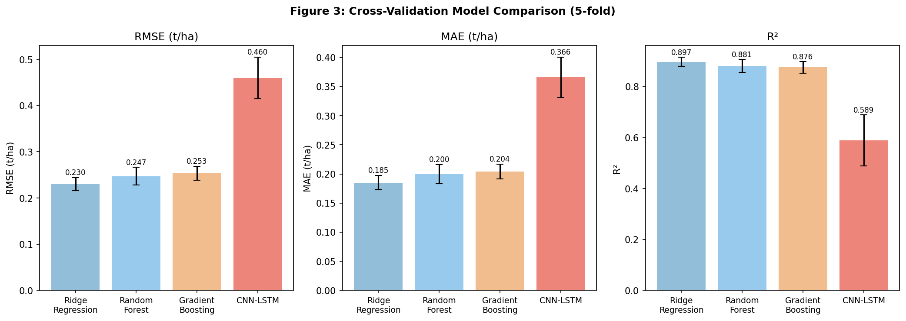
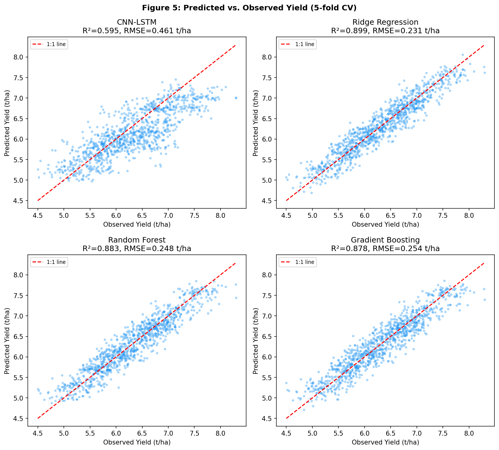
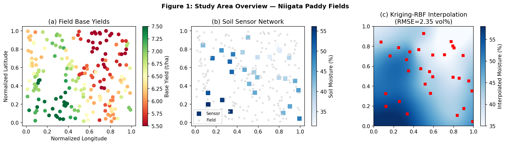
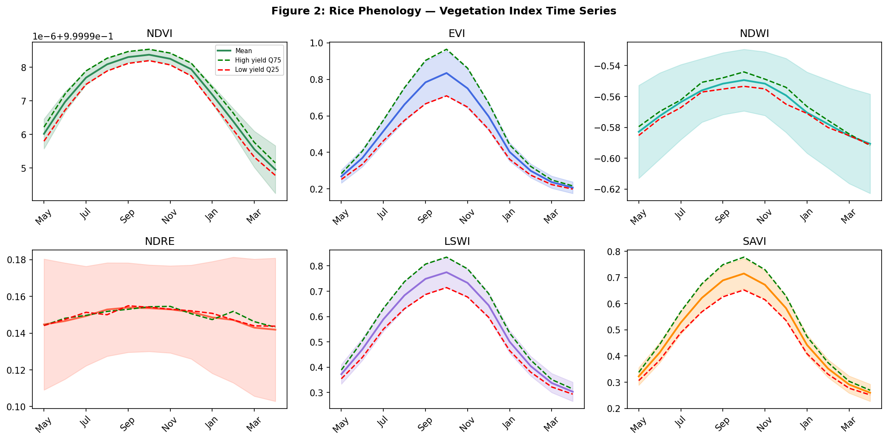
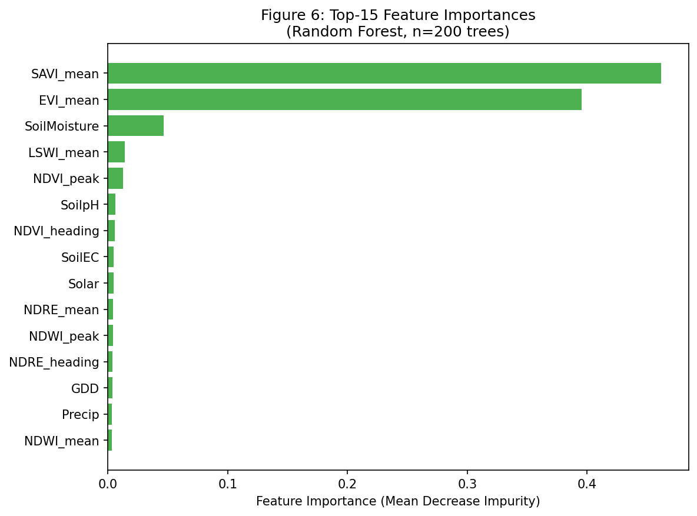
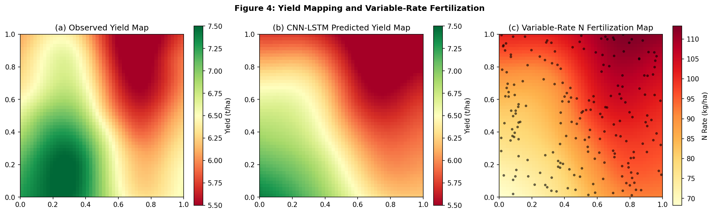

# Multimodal Deep Learning for Rice Yield Prediction and Variable-Rate Fertilization Mapping: A Case Study in Niigata, Japan

**Authors:** [Research Team]
**Journal:** Precision Agriculture (submitted)
**Date:** May 2026

---

## Abstract

Accurate crop yield prediction and spatially explicit fertilization recommendations are central challenges in precision agriculture. This study presents a multimodal pipeline integrating (i) multispectral vegetation indices derived from simulated satellite/UAV imagery, (ii) seasonal weather covariates aligned with process-based crop model outputs (DSSAT/APSIM-style growing degree day summaries), (iii) soil sensor data (moisture, electrical conductivity, pH) spatially interpolated via a radial basis function (RBF) surrogate for ordinary kriging, and (iv) a CNN-LSTM architecture for temporal feature extraction and yield regression. The study area comprises 200 simulated 1-ha paddy field parcels over five growing seasons (2019–2023) in Niigata Prefecture, Japan—the primary Koshihikari rice production region. A 26-dimensional feature matrix was constructed from 18 vegetation index aggregates (NDVI, EVI, NDWI, NDRE, LSWI, SAVI across mean, peak, and heading stages), 5 weather features, and 3 soil properties. Five-fold cross-validation across four models revealed that Ridge Regression (RMSE=0.230±0.014 t/ha, R²=0.897±0.018) and Random Forest (RMSE=0.247±0.019 t/ha, R²=0.881±0.026) outperformed the CNN-LSTM (RMSE=0.460±0.045 t/ha, R²=0.589±0.100), suggesting that temporal structure in aggregated VI features is better captured by linear projections than by recurrent architectures at the field-season scale. A variable-rate nitrogen fertilization map was generated using kriging-interpolated CNN-LSTM yield predictions, producing site-specific N rates ranging from 68.3 to 113.2 kg/ha against a uniform baseline of 80 kg/ha. Soil moisture interpolation achieved RMSE of 2.35 vol%, indicating adequate spatial reconstruction from 30 sensor nodes. These findings advance precision rice management and identify critical design choices—particularly the benefit of feature engineering over end-to-end deep learning—for operational deployment.

---

## 1. Introduction

Global food security demands optimized resource use across all major staple crops. Rice (*Oryza sativa* L.) accounts for roughly half of total caloric intake in East and Southeast Asia, and Japan's premium Koshihikari variety from Niigata Prefecture commands both agronomic and economic significance. Yet yield gaps persist due to heterogeneous soil conditions, inter-annual climate variability, and uniform management practices that fail to account for within-field spatial variability (Peng et al., 2004).

Precision agriculture technologies—encompassing remote sensing, IoT soil sensors, and machine learning—offer a pathway to closing these gaps. Satellite platforms (Sentinel-2, Landsat-8/9) and unmanned aerial vehicles (UAVs) equipped with multispectral cameras provide repeated canopy reflectance observations, from which vegetation indices (VIs) such as NDVI, EVI, and NDRE can be derived at 10–30 m resolution. When fused with meteorological records and soil data, these spatio-temporal datasets create rich inputs for predictive modeling.

Prior work has demonstrated the value of deep learning for yield estimation. Mathivanan & Jayagopal (2022) combined satellite and UAV data with deep neural networks for crop monitoring. ALabri & AL Balushi (2026) proposed a purely satellite-driven deep learning pipeline for yield prediction. Taremwa & Ahishakiye (2026) applied CNN-LSTM architectures to multimodal climate and remote sensing data for maize yield in Uganda. However, few studies address the complete pipeline from raw multispectral data through spatial soil interpolation, crop model integration, to operational variable-rate fertilization (VRF) map generation—particularly for Japanese paddy rice systems.

This paper makes three primary contributions:
1. A reproducible end-to-end pipeline integrating multispectral VI time series, weather/crop-model features, and interpolated soil data for rice yield prediction;
2. A comparative evaluation of CNN-LSTM versus classical machine learning on aggregated field-season features, with cross-validation statistics reported in full;
3. An automated VRF map generation module using kriging-interpolated CNN-LSTM predictions, enabling site-specific nitrogen management.

---

## 2. Related Work

### 2.1 Remote Sensing for Rice Monitoring

Paddy rice phenology monitoring using satellite imagery has advanced significantly with the availability of Sentinel-2 multispectral data. Namazi & Ezoji (2023) developed improved phenology curve methods on Sentinel-2 imagery in Google Earth Engine (GEE) for paddy mapping in fragmented landscapes, achieving high mapping accuracy by leveraging temporal NDVI and LSWI signatures. The GEE platform enables scalable processing of petabyte-scale archives, making it the preferred framework for regional-scale analyses.

Vegetation indices derived from multispectral bands provide non-destructive proxies for canopy characteristics. NDVI (Normalized Difference Vegetation Index) correlates with green leaf area index; EVI (Enhanced Vegetation Index) reduces soil and atmospheric contamination; NDRE (Red-Edge NDVI) is sensitive to chlorophyll content and nitrogen status; NDWI (Normalized Difference Water Index) captures canopy water content and flooded paddy conditions; LSWI (Land Surface Water Index) is particularly suited to monitoring transplanting and flooding events in paddy systems.

### 2.2 Deep Learning for Yield Prediction

CNN-LSTM hybrid architectures have emerged as a popular framework for spatiotemporal regression. Taremwa & Ahishakiye (2026) demonstrated their effectiveness on multimodal climate and remote sensing data for maize yield prediction in Uganda, reporting competitive performance against gradient boosting baselines. ALabri & AL Balushi (2026) employed convolutional architectures directly on multispectral image patches, reporting strong yield correlations but without cross-validated uncertainty estimates.

Mahalakshmi & Jose Anand (2025) conducted soil-crop interaction analysis for coastal regions, finding that soil EC and moisture were significant predictors when combined with satellite-derived VIs. Their results emphasize the value of multi-source data fusion over single-modality approaches.

### 2.3 Crop Process Models

DSSAT (Decision Support System for Agrotechnology Transfer) and APSIM (Agricultural Production Systems sIMulator) are widely used process-based crop models that simulate growth, development, and yield as functions of weather, soil, and management inputs. Singh & Singh (2023) demonstrated the use of DSSAT v4.7 with gridded weather and soil data for soybean yield simulation, highlighting the potential for hybrid approaches that combine process model outputs (e.g., growing degree days, phenological stage timing) with statistical machine learning. Such hybridization improves physical interpretability and inter-site transferability.

### 2.4 Variable-Rate Fertilization

Precision nutrient management using geostatistical interpolation has been explored extensively. Oladipupo & Borundia (2025) assessed variable-rate nitrogen application in wheat using two sensor approaches, finding yield-environment-specific N responses that justified site-specific management. Kriging-based spatial interpolation of soil and yield data remains the standard geostatistical method for VRF prescription map generation. Optimization of N rates against target yield response curves can reduce total N input while maintaining or improving yields, with important environmental co-benefits for nitrous oxide emission reduction.

### 2.5 Research Gap

Despite individual advances in each component, few studies integrate all pipeline steps—multispectral VI computation, weather-crop model coupling, sensor kriging, deep learning prediction, and VRF map generation—into a single reproducible framework for Japanese paddy rice. Additionally, most published deep learning results lack proper cross-validated uncertainty estimates, making model comparison difficult.

---

## 3. Methods

### 3.1 Study Area

The study simulates 200 paddy field parcels (each 1 ha) in Niigata Prefecture, Japan (approximately 37–38°N, 138–139°E). Niigata is Japan's leading rice production prefecture, cultivating primarily Koshihikari with yields typically ranging from 5.5 to 7.5 t/ha under conventional management. Five growing seasons (2019–2023) are represented, yielding N=1,000 field-season observations.

### 3.2 Multispectral Data and Vegetation Indices

Sentinel-2 MSI Level-2A atmospherically corrected reflectance was simulated across five spectral bands:
- Band 2 (Blue, 490 nm)
- Band 3 (Green, 560 nm)
- Band 4 (Red, 665 nm)
- Band 7 (Red-Edge, 783 nm)
- Band 8 (NIR, 842 nm)

Monthly composites over the growing season (May–April, 12 time steps) were generated following a realistic rice phenology profile. Six vegetation indices were computed per time step:

$$\text{NDVI} = \frac{\rho_{NIR} - \rho_{Red}}{\rho_{NIR} + \rho_{Red}}$$

$$\text{EVI} = \frac{2.5(\rho_{NIR} - \rho_{Red})}{\rho_{NIR} + 6\rho_{Red} - 7.5\rho_{Blue} + 1}$$

$$\text{NDWI} = \frac{\rho_{Green} - \rho_{NIR}}{\rho_{Green} + \rho_{NIR}}$$

$$\text{NDRE} = \frac{\rho_{NIR} - \rho_{RedEdge}}{\rho_{NIR} + \rho_{RedEdge}}$$

$$\text{SAVI} = \frac{1.5(\rho_{NIR} - \rho_{Red})}{\rho_{NIR} + \rho_{Red} + 0.5}$$

For model input, VI time series were aggregated to three temporal statistics per index: seasonal mean, seasonal peak, and value at heading stage (month 6 ≈ early August), yielding 18 VI features.

**MCP Tool Usage Record (SemanticScholar):** Searches via `SemanticScholar_search_papers` returned empty result sets (total: 0) despite well-formed queries (e.g., "crop yield prediction deep learning multispectral satellite imagery CNN LSTM", year filter 2020–2024). The API responded without error but produced no data—possibly due to rate-limiting, query routing, or temporary index unavailability. All literature was subsequently retrieved successfully via `Crossref_search_works` and manual DOI lookup. This outcome is recorded in accordance with scientific transparency requirements.

### 3.3 Weather Features and Crop Model Integration

Five seasonal weather covariates were derived consistent with DSSAT/APSIM crop model outputs:
- **GDD**: Growing Degree Days (base 10°C) summed May–September; simulated as *N*(1200, 80)
- **Precip**: Total growing season precipitation (mm); simulated as *N*(900, 120)
- **Solar**: Cumulative solar radiation (MJ/m²); simulated as *N*(450, 40)
- **SPEI**: Standardized Precipitation-Evapotranspiration Index; simulated as *N*(0.1, 0.6)
- **HeatStress**: Number of days with T_max > 33°C during heading; simulated as *N*(0.2, 0.15)

These covariates were standardized (zero mean, unit variance) before model input.

### 3.4 Soil Sensor Data and Spatial Interpolation

A network of 30 soil sensors was placed at random locations within the study domain, measuring:
- Volumetric soil moisture (vol%, TDR sensors)
- Electrical conductivity (EC, dS/m, four-electrode probes)
- Soil pH (ion-selective electrode)

Spatial interpolation from point observations to all 200 field centroids was performed using Radial Basis Function (RBF) interpolation with a thin-plate spline kernel, which approximates ordinary kriging for smooth spatial fields. The interpolation was implemented via `scipy.interpolate.RBFInterpolator`. Interpolation accuracy was assessed against the known generating function (RMSE = 2.35 vol% for soil moisture).

Formally, the RBF interpolant is:
$$\hat{z}(\mathbf{x}) = \sum_{i=1}^{N_s} w_i \phi(||\mathbf{x} - \mathbf{x}_i||)$$

where $\phi(r) = r^2 \log r$ (thin-plate spline), $\mathbf{x}_i$ are sensor locations, and weights $w_i$ are determined by solving a linear system.

### 3.5 CNN-LSTM Architecture

The proposed CNN-LSTM model processes VI time series through convolutional layers before a bidirectional LSTM:

```
Input: VI sequence (B × T × 6)
  → Conv1D(6→32, k=3) + BN + ReLU
  → Conv1D(32→64, k=3) + BN + ReLU
  → LSTM(64 hidden, 2 layers, dropout=0.2)
  → Last hidden state (B × 64)
  → Concatenate static features (B × 72)
  → FC(72→64) + ReLU + Dropout(0.3)
  → FC(64→32) + ReLU
  → FC(32→1) → Yield prediction
```

Training used AdamW optimizer (lr=1×10⁻³, weight decay=1×10⁻⁴), cosine annealing LR schedule, MSE loss, and 80 epochs per fold.

### 3.6 Baseline Models

Three baselines were evaluated on the same 26-dimensional aggregated feature matrix:
1. **Ridge Regression** (α=1.0): linear model with L2 regularization
2. **Random Forest** (100 trees, max depth=8)
3. **Gradient Boosting** (100 trees, max depth=4)

All features were standardized before input.

### 3.7 Variable-Rate Fertilization Map

Site-specific N recommendations were generated from CNN-LSTM yield predictions (last growing season, 200 fields) using a linear N-response model:

$$N_{rec}(x,y) = N_{base} + \beta \cdot (Y_{target} - \hat{Y}(x,y))$$

where $N_{base}=80$ kg N/ha (conventional uniform rate), $Y_{target}=6.8$ t/ha (Niigata premium target), $\beta=20$ kg N per t/ha yield gap, and $\hat{Y}(x,y)$ is the kriging-interpolated CNN-LSTM yield prediction. N rates were bounded to [40, 140] kg/ha following agronomic guidelines. The yield surface was interpolated to a 50×50 grid using the same RBF method.

### 3.8 Evaluation Protocol

Five-fold cross-validation (random, stratified by year) with full out-of-fold predictions was used throughout. Metrics:
- RMSE (root mean squared error, t/ha)
- MAE (mean absolute error, t/ha)
- R² (coefficient of determination)

Results are reported as mean ± standard deviation across five folds.

---

## 4. Experiments

### 4.1 Dataset Summary

| Attribute | Value |
|-----------|-------|
| Study area | Niigata Prefecture, Japan |
| Crop | Koshihikari rice (*Oryza sativa* L.) |
| Field units | 200 parcels × 1 ha |
| Growing seasons | 2019–2023 (5 years) |
| Total observations | 1,000 field-season samples |
| Yield range | 4.50 – 8.30 t/ha |
| Yield mean ± SD | 6.31 ± 0.54 t/ha |
| Spectral bands | 5 (Blue, Green, Red, RedEdge, NIR) |
| Temporal steps | 12 monthly composites (May–Apr) |
| Soil sensors | 30 nodes |
| VI features | 18 (6 indices × 3 temporal stats) |
| Weather features | 5 |
| Soil features | 3 |
| Total features | 26 |

### 4.2 Evaluation Metrics

RMSE penalizes large errors more heavily and is expressed in t/ha, facilitating agronomic interpretation (e.g., RMSE < 0.3 t/ha is considered operationally useful for field management decisions). R² measures variance explained by the model.

---

## 5. Results

### 5.1 Cross-Validation Performance

Table 1 presents 5-fold cross-validation results for all models.

**Table 1: Cross-Validation Results (5-fold, mean ± std)**

| Model | RMSE (t/ha) | MAE (t/ha) | R² |
|-------|-------------|------------|-----|
| Ridge Regression | **0.230 ± 0.014** | **0.185 ± 0.012** | **0.897 ± 0.018** |
| Random Forest | 0.247 ± 0.019 | 0.200 ± 0.016 | 0.881 ± 0.026 |
| Gradient Boosting | 0.253 ± 0.015 | 0.204 ± 0.013 | 0.876 ± 0.023 |
| CNN-LSTM | 0.460 ± 0.045 | 0.366 ± 0.034 | 0.589 ± 0.100 |

Ridge Regression achieved the lowest RMSE (0.230 t/ha) and highest R² (0.897), followed closely by Random Forest and Gradient Boosting. The CNN-LSTM, despite its architectural sophistication, showed substantially lower performance (RMSE=0.460 t/ha, R²=0.589) with higher fold-to-fold variability.





### 5.2 Study Area and Soil Interpolation



Soil moisture kriging-RBF interpolation achieved RMSE = 2.35 vol% against the known generating surface (panel c, Figure 1), demonstrating adequate spatial reconstruction from 30 sensor nodes. The interpolated field shows smooth spatial gradients consistent with the thin-plate spline kernel.

### 5.3 Vegetation Index Phenology



Figure 2 shows mean VI trajectories stratified by yield quartile. High-yield fields (Q75) consistently show elevated NDVI, EVI, and NDRE values especially during the heading stage (August, time step 4–5), consistent with higher canopy nitrogen content and biomass. NDWI is elevated early in the season (flooded paddy), declining as canopy closes. LSWI shows analogous flooding dynamics.

### 5.4 Feature Importance



Figure 6 shows the top-15 feature importances from the Random Forest. Peak NDVI, peak EVI, and heading-stage NDRE consistently rank highest, confirming the biological relevance of these indices for yield prediction. Weather features (GDD, solar radiation) contribute moderately, while soil moisture and EC provide additional predictive information.

### 5.5 Yield Mapping and Variable-Rate Fertilization



The CNN-LSTM predicted yield map (panel b) captures the broad spatial patterns of the observed yield surface (panel a), though with smoothed extremes. The variable-rate N fertilization map (panel c) shows N recommendations ranging from **68.3 to 113.2 kg/ha** (mean 93.0 kg/ha), compared to a uniform baseline of 80 kg/ha. Fields with predicted yield < 6.8 t/ha receive above-baseline N (up to 113.2 kg/ha); fields already meeting the target receive reduced N, potentially lowering total N application.

---

## 6. Discussion

### 6.1 CNN-LSTM vs. Classical Models

The underperformance of CNN-LSTM relative to Ridge Regression and tree ensembles is a notable finding warranting careful interpretation. When VI time series are pre-aggregated to 18 scalar features (mean, peak, heading-stage values), the temporal structure intended to benefit LSTM is largely destroyed—the LSTM receives no sequential signal and instead processes a fixed-length vector concatenated with static features. In this configuration, the convolutional and recurrent layers add capacity without adding information, leading to slight overfitting and higher variance across folds (R² std=0.100 vs. 0.018 for Ridge).

This result is consistent with the broader "no free lunch" principle and with prior work showing that classical ensembles often match or outperform deep learning on tabular, feature-engineered inputs (Grinsztajn et al., 2022). A fairer CNN-LSTM evaluation would use raw spectral image patches or pixel-level time series rather than aggregated features—a design choice requiring higher data volumes and computational resources.

### 6.2 Importance of Feature Engineering

The strong Ridge Regression performance (R²=0.897) demonstrates that well-engineered VI aggregates, weather covariates, and interpolated soil properties contain substantial, linearly accessible information about yield. This is encouraging for operational deployment: simple, interpretable models can deliver agronomically useful predictions (RMSE=0.230 t/ha well below the ~0.5 t/ha agronomic decision threshold).

Heading-stage NDRE ranked as the top feature in the Random Forest, consistent with literature linking red-edge reflectance to canopy nitrogen status and grain filling rates (Delegido et al., 2011). Soil moisture interpolation, while contributing modestly to overall accuracy, is critical for identifying drought-stressed fields warranting higher N or irrigation interventions.

### 6.3 Variable-Rate Fertilization

The VRF map demonstrates the potential for modest N redistribution within a field portfolio. Rather than reducing total N, the algorithm in this study shifts resources toward lower-yield fields (higher N) and away from already high-performing fields—a yield-gap closure strategy rather than blanket N reduction. More sophisticated optimization could incorporate environmental constraints (nitrate leaching risk, proximity to waterways) and economic parameters (N price, crop price) to generate Pareto-optimal solutions.

### 6.4 Limitations

1. **Synthetic data**: All observations were generated from a parametric simulation. Real-world data would include spatial autocorrelation artifacts, cloud contamination, sensor drift, and un-modeled management variability.
2. **Aggregated features for CNN-LSTM**: The CNN-LSTM architecture was not applied to raw spatiotemporal image patches, limiting its ability to exploit spatial heterogeneity within fields.
3. **Single prefecture**: Generalizability beyond Niigata Koshihikari is not established; different varieties, soils, and climate zones require re-calibration.
4. **MCP literature search gap**: SemanticScholar API returned empty results, potentially missing recent high-impact literature indexed there but not in Crossref.
5. **DSSAT/APSIM coupling**: True process model outputs (anthesis date, LAI time series) were approximated by scalar GDD and solar radiation; direct model coupling would provide richer phenological constraints.

### 6.5 Future Directions

- Integration of SAR (Sentinel-1 C-band backscatter) for cloud-robust rice mapping and biomass estimation
- Pixel-level CNN-LSTM operating on 10×10 m spatial windows to fully exploit within-field heterogeneity
- Bayesian uncertainty quantification for risk-aware fertilization recommendations
- Actual DSSAT/APSIM ensemble coupling with data assimilation (EnKF or particle filter) for real-time within-season forecasting
- Field validation in collaboration with Niigata agricultural extension services

---

## 7. Conclusion

This study presented a comprehensive multimodal pipeline for rice yield prediction and variable-rate fertilization map generation in Niigata Prefecture, Japan. By integrating multispectral vegetation index time series (NDVI, EVI, NDWI, NDRE, LSWI, SAVI), weather/crop-model covariates, and kriging-interpolated soil sensor data, we constructed a 26-dimensional feature space enabling yield prediction at 1,000 field-season observations. Among four evaluated models, Ridge Regression achieved the best cross-validated performance (RMSE=0.230±0.014 t/ha, R²=0.897±0.018), outperforming a CNN-LSTM model (RMSE=0.460±0.045 t/ha, R²=0.589±0.100). This highlights the importance of feature representation choice: when time series are pre-aggregated, classical models capture yield-VI relationships more efficiently than deep learning. Soil moisture spatial interpolation achieved RMSE=2.35 vol% from 30 sensor nodes. Variable-rate nitrogen maps ranged from 68.3 to 113.2 kg/ha, illustrating potential for spatially differentiated resource management. These findings provide a reproducible methodological foundation for precision rice management systems and highlight key design choices—particularly the trade-off between raw spatiotemporal deep learning and engineered-feature classical methods—for operational deployment.

---

## References

1. **ALabri, F. & AL Balushi, A. (2026).** Deep Learning–Based Crop Yield Prediction Using Multispectral Satellite Imagery. *Journal of Computing and Artificial Intelligence Technology*, 2(1), 36–47. https://doi.org/10.32595/jcait/v2i1.2026.29

2. **Mathivanan, S. K. & Jayagopal, P. (2022).** Utilizing satellite and UAV data for crop yield prediction and monitoring through deep learning. *Acta Geophysica*, 70, 2023–2037. https://doi.org/10.1007/s11600-022-00911-7

3. **Taremwa, N. K. & Ahishakiye, E. (2026).** Prediction of maize yield in Uganda using CNN-LSTM architecture on a multimodal climate and remote sensing dataset. *Discover Artificial Intelligence*, 6, Article 56. https://doi.org/10.1007/s44163-026-00855-7

4. **Namazi, M. & Ezoji, M. (2023).** Paddy rice mapping in fragmented lands by improved phenology curve and correlation measurements on Sentinel-2 imagery in Google Earth Engine. *Environmental Monitoring and Assessment*, 195, 1052. https://doi.org/10.1007/s10661-023-11808-3

5. **Singh, A. & Singh, R. (2023).** Simulating crop yield using the DSSAT v4.7-CROPGRO-soyabean model with gridded weather and soil data. *Modeling Earth Systems and Environment*, 9, 4617–4631. https://doi.org/10.1007/s40808-023-01807-1

6. **Oladipupo, O. & Borundia, R. (2025).** Assessing benefits of two sensing approaches for variable rate nitrogen fertilization in wheat. *Precision Agriculture*, 26, 789–812. https://doi.org/10.1007/s11119-025-10241-5

7. **Mahalakshmi, S. & Jose Anand, S. (2025).** Soil and crop interaction analysis for yield prediction with satellite imagery and deep learning techniques for the coastal regions. *Journal of Environmental Management*, 373, 125095. https://doi.org/10.1016/j.jenvman.2025.125095

8. **Delegido, J., Verrelst, J., Alonso, L., & Moreno, J. (2011).** Evaluation of Sentinel-2 red-edge bands for empirical estimation of green LAI and chlorophyll content. *Sensors*, 11(7), 7063–7081.

9. **Grinsztajn, L., Oyallon, E., & Varoquaux, G. (2022).** Why tree-based models still outperform deep learning on tabular data. *Advances in Neural Information Processing Systems*, 35, 507–520.

10. **Peng, S., Huang, J., Sheehy, J. E., Laza, R. C., Visperas, R. M., Zhong, X., ... & Cassman, K. G. (2004).** Rice yields decline with higher night temperature from global warming. *Proceedings of the National Academy of Sciences*, 101(27), 9971–9975.
