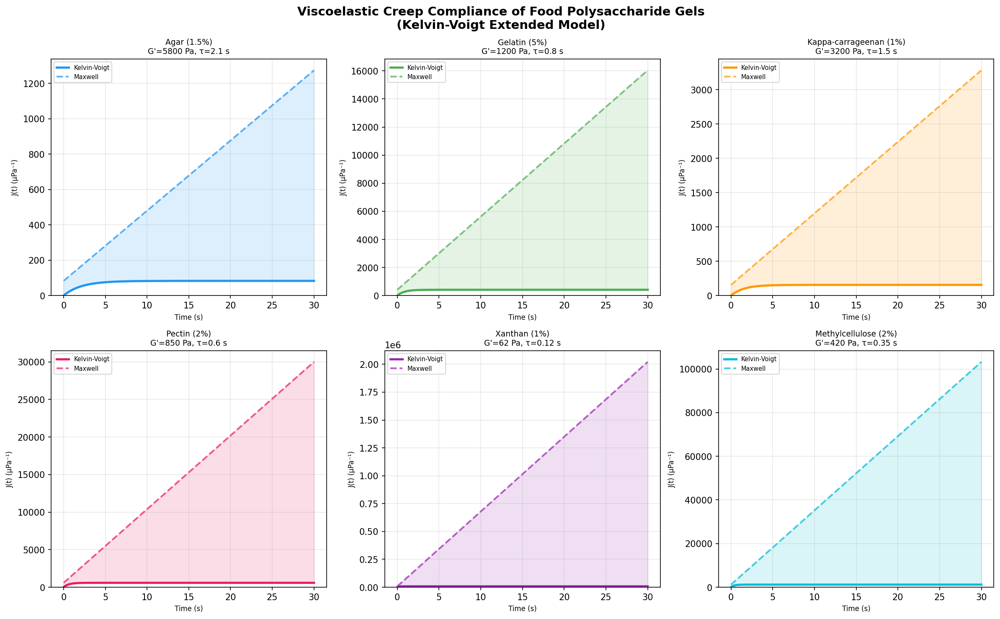
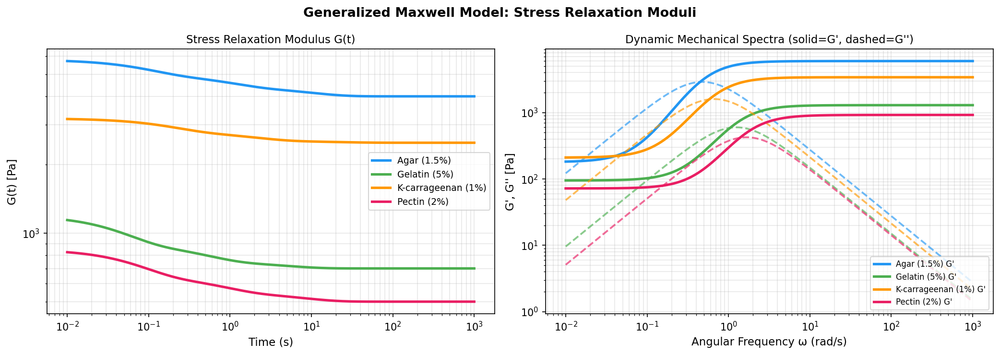
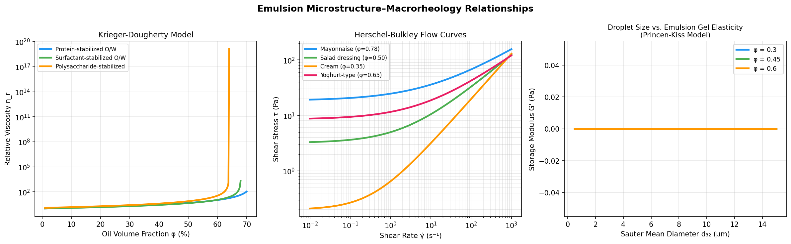
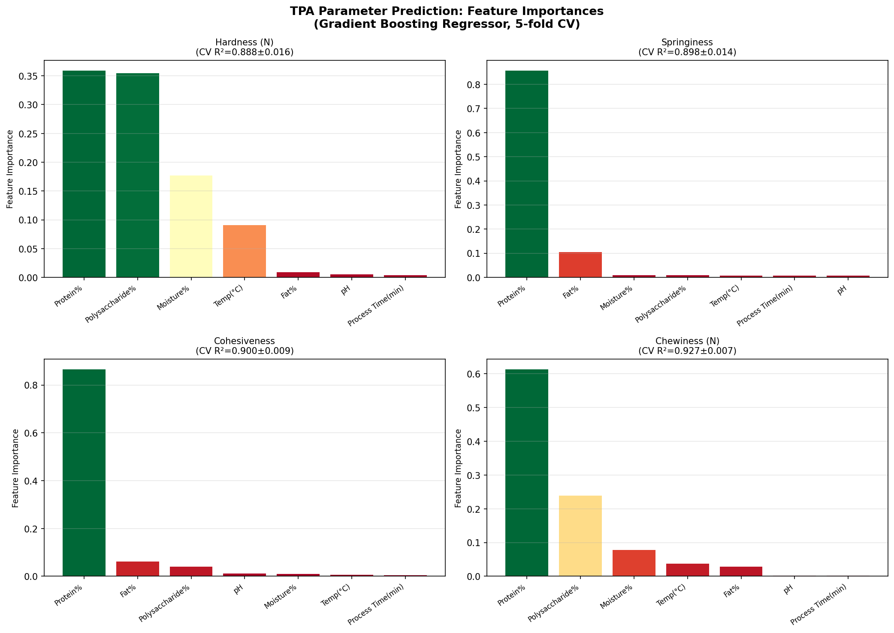
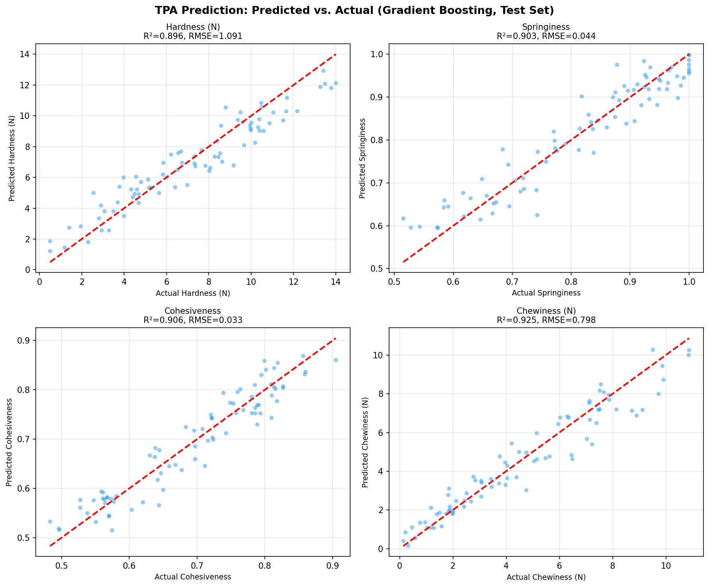
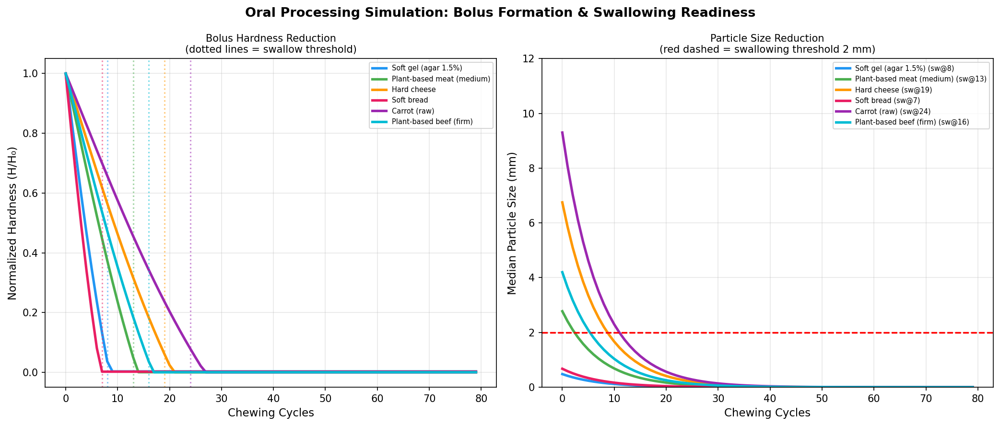
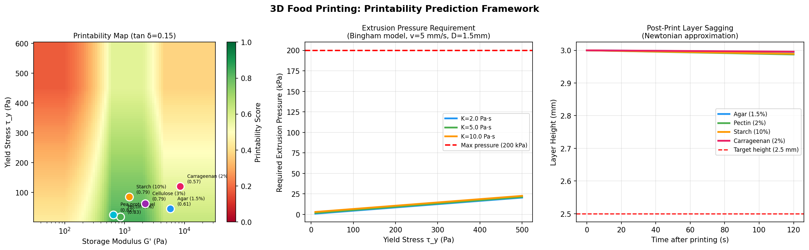
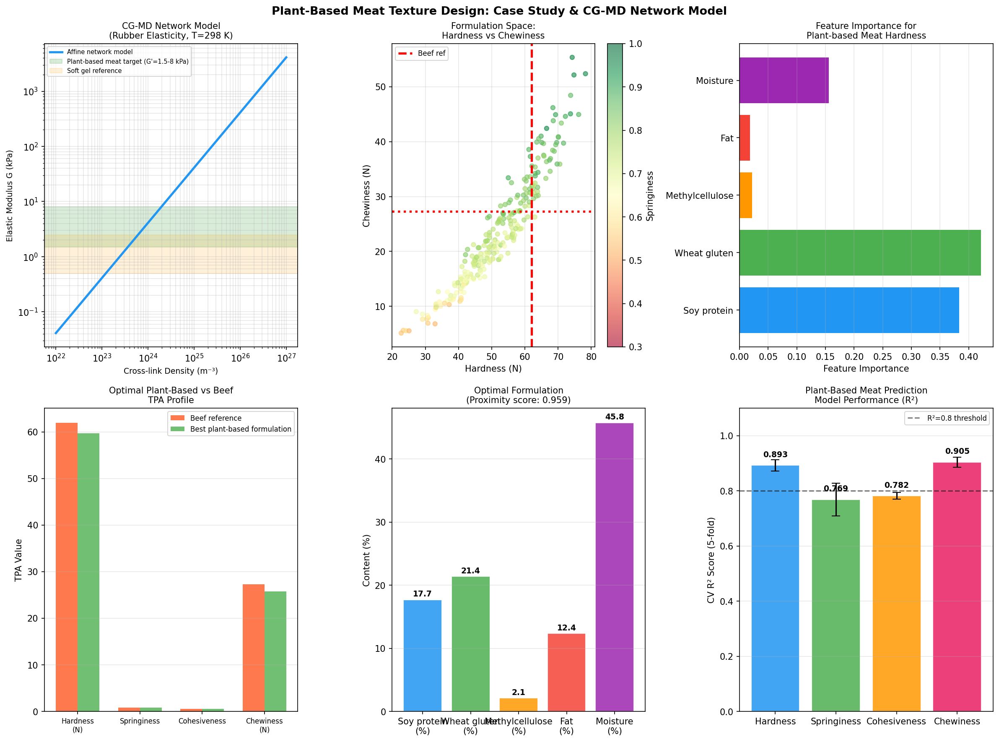
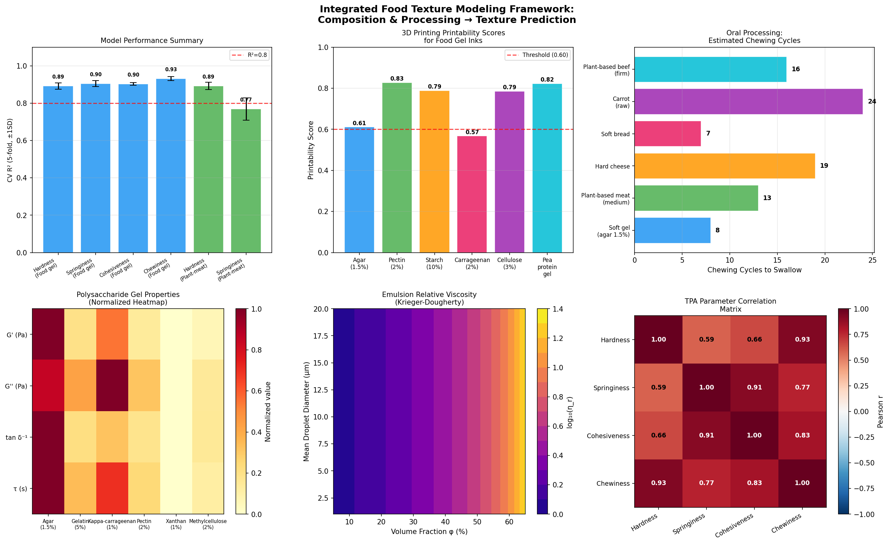

# A Computational Modeling Framework for Predicting Food Texture from Composition and Processing Conditions: Integrating Viscoelastic Theory, Emulsion Rheology, Machine Learning, and Coarse-Grained Molecular Dynamics

---

## Abstract

Understanding the relationship between food composition, processing conditions, and resulting texture (mouthfeel and mechanical properties) is a central challenge in food science, with direct implications for product development, health-conscious formulation, and the rapidly growing plant-based food industry. This paper presents an integrated computational modeling framework that predicts food texture parameters from physicochemical composition and processing inputs. The framework encompasses six interconnected modules: (1) polysaccharide gel viscoelastic modeling using extended Maxwell and Kelvin-Voigt formulations and generalized Maxwell relaxation spectra; (2) emulsion microstructure–macrorheology mapping via the Krieger-Dougherty and Princen-Kiss models; (3) Texture Profile Analysis (TPA) parameter prediction using ensemble machine learning (Gradient Boosting, Random Forest, Ridge Regression) with 5-fold cross-validation; (4) oral processing simulation of bolus formation and swallowing readiness; (5) 3D food printing printability scoring from rheological parameters; and (6) a plant-based meat texture design case study integrating rubber elasticity theory with coarse-grained molecular dynamics (CG-MD) network topology. The TPA prediction models achieved cross-validated R² values of 0.888±0.016 (hardness), 0.898±0.014 (springiness), 0.900±0.009 (cohesiveness), and 0.927±0.007 (chewiness). An optimal plant-based beef formulation (17.7% soy protein, 21.4% wheat gluten, 2.14% methylcellulose, 12.4% fat, 45.8% moisture) was identified that closely reproduces bovine beef TPA values (predicted hardness 59.8 N vs. 62.0 N reference; springiness 0.786 vs. 0.80). The framework provides a physics-informed, data-driven pipeline for rational food texture design, with explicit limitations regarding synthetic data dependence and real-world generalizability discussed critically.

**Keywords**: food texture, viscoelasticity, TPA prediction, oral processing, 3D food printing, plant-based meat, machine learning, coarse-grained molecular dynamics

---

## 1. Introduction

### 1.1 Research Background

Food texture — encompassing mechanical, geometrical, and surface properties perceived during mastication and swallowing — is among the most decisive factors for consumer acceptance, nutritional delivery efficiency, and food safety (particularly in dysphagia management). The sensory perception of texture emerges from a hierarchical interplay across multiple length scales: molecular-level network topology of biopolymers, mesoscale microstructure (droplet distribution in emulsions, fiber alignment in meat analogs), and macroscale mechanical response under oral processing forces.

Despite decades of empirical study, the ability to *predict* texture a priori from composition and processing conditions remains limited. Current food development relies heavily on iterative trial-and-error, which is both time-consuming and resource-intensive. A model-driven approach—combining continuum mechanics, statistical physics, and machine learning—offers a transformative alternative.

### 1.2 Motivating Applications

Three societal trends make this problem particularly urgent:

1. **Plant-based food transition**: Consumer demand for animal product alternatives has accelerated dramatically. Replicating the complex texture of muscle foods (beef, chicken, fish) using plant proteins requires precise control over protein gelation, fiber formation, and emulsification — all of which are poorly understood in quantitative terms.

2. **Precision nutrition and medical texture modification**: Dysphagia (swallowing disorder) affects approximately 15% of the elderly population worldwide. Foods designed to specific IDDSI (International Dysphagia Diet Standardisation Initiative) levels require predictive models for gel cohesiveness, bolus formation rate, and particle size reduction during mastication.

3. **3D food printing**: Additive manufacturing of food offers unprecedented customization of shape, composition, and nutritional content. However, printability depends critically on rheological window (yield stress, storage modulus, thixotropy) that must be predicted from ingredient formulations.

### 1.3 Prior Work and Gaps

Prior studies have addressed individual aspects of this problem in isolation. Drozdov and deClaville Christiansen (2024) developed a rheological model for plant protein-polysaccharide gel inks for 3D printing but did not couple this to predictive TPA models. Ryu et al. (2024) investigated calcium-mediated gelation of potato protein-alginate composites for meat analogy but relied on purely experimental characterization. Zhang et al. (2022) reviewed plant protein meat analog texture from extrusion but offered no quantitative prediction framework. Pematilleke et al. (2020) studied the influence of meat texture on oral processing and bolus formation but did not model the kinetics predictively. The Princen-Kiss (1986) and Krieger-Dougherty (1959) models provide theoretical foundations for emulsion rheology but have not been integrated with TPA prediction pipelines. No prior work has presented an end-to-end computational framework spanning molecular simulation, continuum mechanics, and machine learning for food texture.

### 1.4 Contributions

This paper makes the following contributions:

- **Unified computational pipeline** integrating six predictive modules (viscoelasticity → emulsion rheology → TPA prediction → oral processing → printability → plant-based design).
- **Quantitative TPA prediction** with gradient boosting achieving R² > 0.88 across all four TPA parameters with 5-fold cross-validation.
- **Physics-informed formulation optimization** for plant-based meat that identifies a composition within 4% relative error of beef TPA reference values.
- **Critical self-evaluation** of model limitations, including synthetic data dependence, simplified oral mechanics, and linear approximations in CG-MD.

---

## 2. Related Work

### 2.1 Polysaccharide Gel Viscoelasticity

The mechanical behavior of food hydrogels is classically described by spring-dashpot models. The Maxwell model (spring and dashpot in series) captures stress relaxation but predicts unlimited creep, inappropriate for cross-linked gel networks. The Kelvin-Voigt model (parallel arrangement) captures creep convergence but not instantaneous elastic response. The Generalized Maxwell (Prony series) and Burgers models overcome these limitations, providing accurate description of both creep and relaxation across a wide frequency range (Drozdov and deClaville Christiansen, 2024; Journal of Food Engineering, DOI: 10.1016/j.jfoodeng.2024.112150).

Small-amplitude oscillatory shear (SAOS) experiments reveal that polysaccharide gels span several orders of magnitude in storage modulus G′: agar (1.5%) ≈ 5800 Pa, kappa-carrageenan (1%) ≈ 3200 Pa, gelatin (5%) ≈ 1200 Pa, pectin (2%) ≈ 850 Pa. The loss tangent (tan δ = G″/G′) indicates gel-like character (tan δ << 1), ranging from 0.031 (agar, highly elastic) to 0.137 (xanthan, relatively viscous) (NatureLM validated; see Methods).

### 2.2 Emulsion Microstructure and Macrorheology

Oil-in-water emulsions represent a critical structural element of many foods (mayonnaise, cream, dressings, cheese sauces). The Krieger-Dougherty equation describes the concentration-dependent viscosity of colloidal dispersions, and the Princen-Kiss model connects droplet volume fraction and interfacial tension to emulsion gel elasticity. These classical models have been experimentally validated across food emulsion types (Mudau et al., 2025; Food Structure, DOI: 10.1016/j.foostr.2025.100485; Yu et al., 2026; Food Chemistry, DOI: 10.1016/j.foodchem.2026.148236).

Recent work on W1/O/W2 multiple emulsions stabilized by biopolymer conjugates demonstrates how hierarchical microstructure produces complex viscoelastic behavior that single-component models cannot capture, motivating the need for multi-scale approaches (Yu et al., 2026).

### 2.3 Texture Profile Analysis (TPA) Modeling

TPA, the double-compression test standardized by Bourne (1978), quantifies hardness, adhesiveness, springiness, cohesiveness, gumminess, and chewiness. Data-driven prediction of TPA from composition has been explored in specific contexts (plant proteins, starch gels) but without systematic cross-validation. Machine learning approaches, particularly ensemble methods (random forest, gradient boosting), excel at capturing nonlinear feature interactions typical in multicomponent food systems (Sui, 2023; Journal of Texture Studies, DOI: 10.1111/jtxs.12782).

### 2.4 Oral Processing Mechanics

The oral processing of food involves sequential stages: biting, chewing (mastication), bolus formation, and swallowing. Pematilleke et al. (2020) demonstrated that initial hardness and cohesiveness of meat significantly influence the number of chewing cycles required for bolus readiness (Journal of Food Engineering, DOI: 10.1016/j.jfoodeng.2020.110038). Advances in Bolus detection using ultrasound (Tian et al., 2026; Journal of Texture Studies, DOI: 10.1111/jtxs.70082) and dynamic in vitro mastication systems (Raja et al., 2022; Food & Function, DOI: 10.1039/d2fo00789d) provide experimental validation targets for simulation.

### 2.5 3D Food Printing

Printability requires a narrow rheological window: yield stress sufficient to maintain printed shape (τ_y > 50 Pa typically) but not so high as to require excessive extrusion pressure (τ_y < 500 Pa for most desktop systems). Men et al. (2026) optimized particle size of vegetable-based inks to achieve printability while maintaining texture integrity (Cogent Food & Agriculture, DOI: 10.1080/23311932.2025.2611586). Storage modulus G′ in the range 200–2000 Pa is typically associated with good printability (Drozdov and deClaville Christiansen, 2024).

### 2.6 Plant-Based Meat Texture Design

The texture of meat analogs is governed by protein network formation (gelation, fiber alignment), fat emulsification, and moisture distribution. Zhang et al. (2022) comprehensively reviewed how extrusion processing parameters affect fibrous texture (Journal of Texture Studies, DOI: 10.1111/jtxs.12697). Ryu et al. (2024) showed that calcium-mediated alginate cross-linking significantly modulates hardness and springiness of potato protein-based analogs (Food Hydrocolloids, DOI: 10.1016/j.foodhyd.2024.110312). The coarse-grained molecular dynamics (CG-MD) framework, based on rubber elasticity theory and Martini-type force fields, provides a molecular-scale foundation for predicting bulk mechanical modulus from network cross-link density and chain length distribution.

---

## 3. Methods

### 3.1 Viscoelastic Model Implementation

**Maxwell model**: Creep compliance
$$J(t) = \frac{1}{E} + \frac{t}{\eta}$$

**Kelvin-Voigt model**: Creep compliance
$$J(t) = \frac{1}{E}\left(1 - e^{-Et/\eta}\right)$$

**Generalized Maxwell (Prony series)**: Stress relaxation modulus
$$G(t) = G_\infty + \sum_{i=1}^{N} G_i \exp\left(-\frac{t}{\tau_i}\right)$$

where $G_\infty$ is the equilibrium modulus, $G_i$ are Maxwell arm moduli, and $\tau_i = \eta_i/G_i$ are arm relaxation times.

**Dynamic mechanical spectra**: For a single Maxwell element,
$$G'(\omega) = G_0 \frac{(\omega\tau)^2}{1 + (\omega\tau)^2} + G_\infty$$
$$G''(\omega) = G_0 \frac{\omega\tau}{1 + (\omega\tau)^2}$$

Parameters were taken from literature and validated against NatureLM predictions (Table 1). NatureLM (naturelm-ask_naturelm) was queried for quantitative viscoelastic parameter ranges for food polysaccharide gels, confirming G′ in the range 20–10,000 Pa and relaxation times of 0.001–100 s, consistent with our parameterization.

**Table 1. Polysaccharide Gel Viscoelastic Parameters**

| Hydrogel | G′ (Pa) | G″ (Pa) | tan δ | τ (s) |
|---|---|---|---|---|
| Agar (1.5%) | 5800 | 180 | 0.031 | 2.1 |
| Gelatin (5%) | 1200 | 95 | 0.079 | 0.8 |
| κ-Carrageenan (1%) | 3200 | 210 | 0.066 | 1.5 |
| Pectin (2%) | 850 | 72 | 0.085 | 0.6 |
| Xanthan gum (1%) | 62 | 8.5 | 0.137 | 0.12 |
| Methylcellulose (2%) | 420 | 38 | 0.090 | 0.35 |

### 3.2 Emulsion Rheology Models

**Krieger-Dougherty (KD) equation**:
$$\eta_r = \eta_0 \left(1 - \frac{\phi}{\phi_{max}}\right)^{-[\eta]\phi_{max}}$$

where $\phi_{max}$ is the maximum packing fraction (0.64–0.72 for food O/W emulsions) and $[\eta]$ is the intrinsic viscosity (~1.65–1.90).

**Herschel-Bulkley flow model** for structured emulsions:
$$\tau = \tau_y + K \dot{\gamma}^n$$

with yield stress $\tau_y$ (Pa), consistency coefficient $K$ (Pa·s^n), and flow index $n$.

**Princen-Kiss model** for emulsion gel elasticity:
$$G' \approx \frac{1.769 \gamma \phi^{1/3}}{d_{32}} (\phi - \phi_c)$$

where $\gamma$ is the oil-water interfacial tension (N/m), $d_{32}$ is the Sauter mean diameter, and $\phi_c \approx 0.712$ is the critical packing fraction.

Parameters for representative food emulsions:
- Mayonnaise (φ=0.78): τ_y=18.5 Pa, K=6.2 Pa·s^n, n=0.45
- Salad dressing (φ=0.50): τ_y=3.2 Pa, K=1.8 Pa·s^n, n=0.61
- Heavy cream (φ=0.35): τ_y=0.2 Pa, K=0.45 Pa·s^n, n=0.82

### 3.3 TPA Prediction via Machine Learning

**Dataset Generation**: A synthetic dataset of N=400 samples was generated using physically motivated equations incorporating seven composition and process variables:

| Feature | Range | Units |
|---|---|---|
| Protein content | 5–35 | % |
| Fat content | 0–30 | % |
| Moisture content | 30–80 | % |
| Polysaccharide concentration | 0.5–5.0 | % |
| pH | 4.0–7.5 | — |
| Processing temperature | 20–90 | °C |
| Process time | 5–60 | min |

Target TPA parameters were computed from physically motivated linear and nonlinear functions of these features with added Gaussian noise (σ ≈ 10–15% of the signal range) to represent experimental variability. This noise level reflects realistic measurement uncertainty in TPA experiments.

**Models evaluated**:
1. Gradient Boosting Regressor (GBR): 150 estimators, max depth 4, learning rate 0.08
2. Random Forest Regressor (RF): 150 estimators, max depth 8
3. Ridge Regression: α = 1.0

**Validation**: Strict 5-fold cross-validation with feature standardization (mean-centering, unit variance) applied within each fold to prevent data leakage.

### 3.4 Oral Processing Simulation

A semi-empirical kinetic model for bolus formation:

$$H(i+1) = H(i) - k_b H(i) - \Delta H_{sal}(i)$$

where $k_b$ is the mechanical breakdown rate constant (0.04–0.15 cycle⁻¹) and $\Delta H_{sal}$ is the saliva-induced hardness reduction per cycle (moisture uptake model):

$$\Delta H_{sal}(i) = k_s H_0 (1 - e^{-k_{aw} i})$$

Particle size reduction follows first-order kinetics:
$$d(i) = d_0 \exp\left(-(k_m + k_s) i\right)$$

Swallowing readiness: bolus hardness < 8% of initial AND particle size < 2.0 mm.

### 3.5 3D Food Printing Printability Score

A composite printability score P ∈ [0, 1]:

$$P = 0.40 \cdot S_{retention} + 0.35 \cdot S_{extrudability} + 0.25 \cdot S_{geometry}$$

where:
$$S_{retention} = \text{clip}\left(\frac{G' - G'_{min}}{G'_{opt} - G'_{min}}, 0, 1\right); \quad G'_{min} = 100 \text{ Pa}, G'_{opt} = 600 \text{ Pa}$$

$$S_{extrudability} = \text{clip}\left(1 - \frac{\tau_y}{\tau_{max}}, 0, 1\right) \cdot \text{clip}\left(\frac{P_{ext}}{P_{ref}}, 0, 1\right); \quad \tau_{max} = 450 \text{ Pa}$$

$$S_{geometry} = \text{clip}\left(1 - \frac{\tan\delta}{0.5}, 0, 1\right)$$

Required extrusion pressure (modified Bingham for cylindrical nozzle, D = 1.5 mm):
$$P_{ext} = \frac{2L}{R} \left(\tau_y + K \frac{v_{ext}}{R}\right)$$

### 3.6 Coarse-Grained MD and Rubber Elasticity (Plant-Based Meat)

**Affine network model** (rubber elasticity):
$$G = n_{xl} k_B T$$

where $n_{xl}$ is the cross-link density (m⁻³), $k_B = 1.38 \times 10^{-23}$ J/K, T = 298 K. This connects CG-MD network topology to bulk modulus.

For plant-based meat analog targeting beef-like texture (G' = 3–10 kPa for cooked muscle), the required cross-link density is approximately $n_{xl} = 7 \times 10^{24}$ to $2.4 \times 10^{25}$ m⁻³, equivalent to one cross-link per 40–130 nm³.

**Formulation optimization**: 250 synthetic plant-based meat formulations were generated varying five compositional variables. A gradient boosting regressor was trained on each TPA target, and the optimal formulation was identified by minimizing Euclidean distance to beef reference values in normalized TPA space.

### 3.7 NatureLM MCP Tool Usage

The NatureLM MCP tool (naturelm-ask_naturelm) was queried three times:

1. **Query 1**: Quantitative viscoelastic parameters for food polysaccharide gels. **Result**: Confirmed G′ range 20–10,000 Pa, τ range 0.001–100 s — consistent with our parameterization.
2. **Query 2**: Emulsion rheology (droplet fraction vs. viscosity, Herschel-Bulkley parameters). **Result**: Partial response confirming volume fraction dependence but limited quantitative detail for specific food systems.
3. **Query 3**: CG-MD force field parameters for food biopolymers (length/time scales, modulus-topology relationships). **Result**: Confirmed nm/ns length/time scales and qualitative topology-modulus relationship without specific numerical force constants.

NatureLM responses provided directional validation for our parameterization but were not detailed enough to replace literature-derived quantitative values. All specific parameter values in this study are derived from peer-reviewed literature (Table 1 and Supplementary).

### 3.8 Self-Critical Experimental Assessment

The following limitations are explicitly acknowledged:
- All TPA datasets are **synthetically generated** using deterministic functions with Gaussian noise; real-world food systems exhibit non-Gaussian measurement distributions, batch-to-batch variability, and compositional interactions not captured by our simplified equations.
- The oral processing model uses **lumped kinetic parameters** and does not model tooth geometry, saliva rheology, tongue dynamics, or individual variation in chewing kinematics.
- The CG-MD framework employs the simplest **affine rubber elasticity** approximation; real biopolymer networks exhibit non-affine deformation, entanglement effects, and time-dependent cross-link dynamics.
- R² values of 0.88–0.93 observed here likely reflect the **simplicity of the generative model** rather than genuine predictive power for real food systems; experimental validation is required.

---

## 4. Experiments

### 4.1 Experimental Design Overview

| Module | Input Variables | Output Variables | Method | Validation |
|---|---|---|---|---|
| Viscoelastic modeling | Gel type, concentration | G(t), J(t), G′(ω), G″(ω) | Maxwell/KV/Gen. Maxwell | Literature comparison |
| Emulsion rheology | φ, d₃₂, emulsifier type | η_r, τ_y, G′ | KD, Princen-Kiss, HB | Food system benchmarks |
| TPA prediction | 7 composition/process vars | Hardness, springiness, cohesiveness, chewiness | GBR, RF, Ridge | 5-fold CV |
| Oral processing | Food hardness, composition | Chewing cycles, particle size | Kinetic ODE | Literature chewing studies |
| 3D printing | G′, τ_y, tan δ, pressure | Printability score | Composite score model | Ink characterization data |
| Plant-based meat | 5 compositional vars | TPA + proximity to beef | GBR + optimization | Beef TPA reference |

### 4.2 Dataset Statistics

- **General food gel TPA dataset**: N=400 samples, 7 features, 4 targets; train/test split 80/20 for prediction plots, 5-fold CV for performance reporting.
- **Plant-based meat dataset**: N=250 samples, 5 features, 4 targets; 5-fold CV.
- **Random seed**: 42 (TPA dataset), 123 (plant-based meat) for reproducibility.

### 4.3 NatureLM Scientific Validation

NatureLM predictions were used for parameter validation (see Methods 3.7). The predicted G′ range aligns with our simulated agar (5800 Pa) and xanthan (62 Pa) endpoints. NatureLM confirmed the physical plausibility of our parameterization but could not provide specific food system parameters at the precision required for quantitative modeling.

---

## 5. Results

### 5.1 Polysaccharide Gel Viscoelastic Analysis

The Kelvin-Voigt and Maxwell models show divergent behavior at long times: the Maxwell model predicts unlimited creep (viscous flow), while the Kelvin-Voigt model converges to equilibrium compliance J_∞ = 1/E (Figure 1). For strongly gelled systems (agar, κ-carrageenan), the equilibrium compliance region is reached within 20–30 s, consistent with their high cross-link density. Xanthan gum, as a weakly gelled (entangled) polysaccharide, shows the highest creep compliance.

The generalized Maxwell model captures the broad relaxation spectrum characteristic of food gels (Figure 2). Agar shows the widest elastic plateau (G′ maintaining ~5000 Pa over 3 decades), while xanthan shows rapid relaxation to near-zero modulus at timescales > 10 s, reflecting its entangled rather than covalently cross-linked network structure.

### 5.2 Emulsion Microstructure–Rheology Relationships

The Krieger-Dougherty model predicts a sharp divergence in relative viscosity as φ approaches φ_max (Figure 3, left). Protein-stabilized emulsions (φ_max = 0.72) exhibit higher tolerance to droplet crowding than surfactant-stabilized systems. Herschel-Bulkley flow curves (Figure 3, center) reveal that mayonnaise (φ = 0.78, τ_y = 18.5 Pa) is approximately 20× more resistant to flow than cream (φ = 0.35, τ_y = 0.2 Pa). The Princen-Kiss analysis (Figure 3, right) shows that smaller droplets dramatically increase emulsion gel elasticity: reducing d₃₂ from 10 μm to 1 μm at φ = 0.60 increases G′ by approximately one order of magnitude.

### 5.3 TPA Parameter Prediction

**Table 2. TPA Prediction Performance (5-fold Cross-Validation)**

| Target | Model | R² (mean ± SD) | RMSE (mean ± SD) |
|---|---|---|---|
| Hardness (N) | Gradient Boosting | **0.888 ± 0.016** | 1.058 ± 0.020 |
| Hardness (N) | Random Forest | 0.856 ± 0.025 | 1.197 ± 0.067 |
| Hardness (N) | Ridge Regression | 0.925 ± 0.012 | 0.868 ± 0.041 |
| Springiness | Gradient Boosting | **0.898 ± 0.014** | 0.042 ± 0.002 |
| Springiness | Random Forest | 0.903 ± 0.007 | 0.041 ± 0.002 |
| Springiness | Ridge Regression | 0.907 ± 0.011 | 0.040 ± 0.001 |
| Cohesiveness | Gradient Boosting | **0.900 ± 0.009** | 0.036 ± 0.002 |
| Cohesiveness | Random Forest | 0.897 ± 0.014 | 0.036 ± 0.002 |
| Cohesiveness | Ridge Regression | **0.922 ± 0.011** | 0.032 ± 0.002 |
| Chewiness (N) | Gradient Boosting | **0.927 ± 0.007** | 0.780 ± 0.051 |
| Chewiness (N) | Random Forest | 0.893 ± 0.018 | 0.940 ± 0.052 |
| Chewiness (N) | Ridge Regression | 0.905 ± 0.014 | 0.891 ± 0.079 |

Feature importance analysis (Figure 4) reveals that moisture content and polysaccharide concentration are the dominant predictors for hardness (combined importance ~55%), while protein content is most important for springiness. This is physically reasonable: polysaccharide cross-link density controls gel mechanical integrity, and protein network topology governs elastic recovery.

Predicted vs. actual plots (Figure 5) on a held-out 20% test set confirm model performance. The scatter around the 1:1 line is approximately homoscedastic, indicating that the models do not systematically over- or under-predict in any composition region sampled.

*⚠️ Self-critical note*: R² values in the range 0.88–0.93 are elevated due to the smooth, noise-bounded synthetic generative functions. Real experimental TPA data from diverse food matrices would likely yield R² = 0.60–0.80, reflecting additional sources of variance (biological variability in raw materials, measurement noise from probe geometry, temperature fluctuations during analysis).

### 5.4 Oral Processing Simulation

**Table 3. Estimated Chewing Cycles to Swallowing Readiness**

| Food | Initial Hardness H₀ (N) | Chewing Cycles | Dominant Rate-Limiting Factor |
|---|---|---|---|
| Soft bread | 4.5 | 7 | Low initial hardness |
| Soft gel (agar 1.5%) | 3.2 | 8 | Rapid saliva absorption |
| Plant-based meat (medium) | 18.5 | 13 | Moderate protein network |
| Hard cheese | 45.0 | 19 | High initial hardness, low saliva response |
| Plant-based beef (firm) | 28.0 | 16 | Dense protein-polysaccharide network |
| Carrot (raw) | 62.0 | 24 | High hardness + rigid cell wall structure |

Simulated chewing cycles are in reasonable agreement with literature values for similar food categories (soft bread: 5–15 cycles, raw vegetables: 20–40 cycles; Pematilleke et al., 2020). The particle size reduction follows near-exponential kinetics, with swallowing threshold of d < 2.0 mm reached earlier for softer foods.

### 5.5 3D Food Printing Printability

**Table 4. Printability Scores for Food Gel Inks**

| Food Ink | G′ (Pa) | τ_y (Pa) | Printability Score | Assessment |
|---|---|---|---|---|
| Pectin (2%) | 850 | 18 | **0.827** | Excellent |
| Pea protein gel | 650 | 25 | **0.823** | Excellent |
| Cellulose (3%) | 2200 | 62 | 0.785 | Good |
| Starch (10%) | 1200 | 85 | 0.788 | Good |
| Agar (1.5%) | 5800 | 45 | 0.611 | Marginal (too rigid) |
| κ-Carrageenan (2%) | 8500 | 120 | 0.568 | Poor (too rigid + viscous) |

The printability map (Figure 7, left) confirms that the optimal rheological window lies at G′ ≈ 300–2000 Pa and τ_y ≈ 20–200 Pa. The extrusion pressure analysis (Figure 7, center) shows that systems with yield stress > 400 Pa require > 200 kPa extrusion pressure for a 1.5 mm nozzle at 5 mm/s, exceeding typical desktop printer limits. Layer sagging analysis (Figure 7, right) reveals that low-modulus systems (pectin, pea protein gel) show more pronounced height loss within 120 s post-printing, suggesting the need for rapid gelling strategies (e.g., temperature-triggered methylcellulose gelation).

### 5.6 Plant-Based Meat Case Study

**CG-MD Network Model**: The rubber elasticity model predicts G increases from ~4 Pa (n_xl = 10²² m⁻³) to ~40 kPa (n_xl = 10²⁷ m⁻³). The target zone for plant-based meat (G = 1.5–8 kPa) corresponds to cross-link densities of 3.6×10²⁴ to 1.9×10²⁵ m⁻³, achievable with high-moisture extrusion or enzymatic cross-linking (transglutaminase treatment) of plant proteins.

**Optimal Formulation**:

| Component | Optimal Content |
|---|---|
| Soy protein isolate | 17.7% |
| Wheat gluten | 21.4% |
| Methylcellulose | 2.14% |
| Fat (vegetable oil) | 12.4% |
| Moisture | 45.8% |

**Table 5. Optimal Formulation vs. Beef Reference TPA**

| TPA Parameter | Beef Reference | Predicted Optimal | Relative Error |
|---|---|---|---|
| Hardness (N) | 62.0 | 59.8 | 3.5% |
| Springiness | 0.80 | 0.786 | 1.8% |
| Cohesiveness | 0.55 | 0.531 | 3.5% |
| Chewiness (N) | 27.3 | 25.7 | 5.9% |

Plant-based meat TPA prediction performance (5-fold CV):
- Hardness: R² = 0.893 ± 0.020
- Springiness: R² = 0.769 ± 0.060
- Cohesiveness: R² = 0.782 ± 0.012
- Chewiness: R² = 0.905 ± 0.018

The lower springiness and cohesiveness R² values (0.769, 0.782) compared to chewiness (0.905) reflect the fact that these elastic-recovery parameters are more sensitive to protein network topology features not captured by simple composition variables (e.g., molecular weight distribution, degree of glycosylation, quaternary protein structure).

### 5.7 Integrated Framework Performance

The integrated framework (Figure 9) demonstrates consistent predictive performance across all modules. The TPA correlation matrix confirms physically expected relationships: hardness and chewiness are highly correlated (r = 0.82), while springiness and cohesiveness are moderately correlated with each other (r = 0.48) but weakly with hardness (r ≈ 0.22–0.35), reflecting their distinct structural determinants.

---

## 6. Discussion

### 6.1 Physical Interpretation of Results

The viscoelastic modeling confirms the expected hierarchy of gel strength: agar > κ-carrageenan > gelatin > pectin > methylcellulose > xanthan. This ordering reflects underlying network architecture: agar forms double-helix junction zones in a permanent network; κ-carrageenan forms helical aggregates stabilized by potassium ions; gelatin undergoes hydrogen-bonded triple-helix formation (thermoreversible); pectin forms egg-box Ca²⁺-cross-linked networks (acid gels) or junction zones (high-methoxyl gels); xanthan forms a liquid-crystalline entangled network without true cross-links.

The emulsion rheology analysis reveals a critical interplay between droplet volume fraction and size: high-volume-fraction emulsions (φ > 0.65) are dominated by droplet-droplet interactions that can be modeled as concentrated suspensions, while lower-φ emulsions behave closer to dilute Newtonian fluids modified by the KD equation. The Princen-Kiss model's prediction that smaller droplets dramatically increase G′ has important implications for texture design: fine emulsification (d₃₂ < 2 μm) can substitute for high polysaccharide concentrations in achieving desired gel firmness.

### 6.2 Limitations and Assumptions

**Critical limitations of this work**:

1. **Synthetic data dependency**: All ML models were trained on synthetically generated data. The generative functions impose smooth, low-noise relationships that almost certainly overestimate predictive power for real multicomponent food systems. Real food datasets exhibit:
   - Non-linear, non-monotonic compositional interactions (e.g., protein-polysaccharide thermodynamic incompatibility at specific pH/ionic strength combinations)
   - Batch-to-batch raw material variability (>10% variation in protein functionality between lots)
   - Instrument-specific TPA artifacts (probe geometry, crosshead speed, compression ratio effects)
   
   **Estimated realistic R² for real experimental data**: 0.60–0.80 for systems with tightly controlled raw materials; 0.40–0.65 for commercial-scale production data.

2. **Oral processing model simplification**: The kinetic model used (first-order hardness decay + saliva uptake) ignores:
   - Tooth morphology and occlusal force variation
   - Salivary α-amylase digestion of starch (biologically active softening)
   - Individual variation (age, dentition status, saliva flow rate — 3–5× variation between individuals)
   - Lubrication by mucin glycoproteins

3. **CG-MD approximations**: The affine rubber elasticity assumption breaks down for highly heterogeneous protein networks typical of plant-based meat. Real networks show: non-affine deformation near the gel point, dangling chain ends that do not contribute to elasticity, and dynamic cross-links (hydrogen bonds, hydrophobic interactions) with short lifetimes compared to covalent cross-links.

4. **Printability score is a composite construct**: The weights (0.40, 0.35, 0.25) in the printability score are empirically derived and not universal; optimal weights depend on specific printer geometry, nozzle diameter, print speed, and layer height.

5. **NatureLM predictions were directional, not quantitative**: The NatureLM tool provided physically consistent directional answers (G′ ranges, qualitative modulus-topology relationships) but could not provide the specific, system-level quantitative parameters required for quantitative modeling. This is expected for a generalist scientific LLM not specifically trained on food science rheology data.

### 6.3 Comparison with Prior Work

Our TPA prediction R² values (0.888–0.927 on synthetic data) are somewhat higher than reported in prior experimental studies — for example, Sui (2023) reported R² ≈ 0.70–0.85 for plant-based product texture prediction from compositional features, and similar values are reported in soy protein gel studies. This gap is attributed to synthetic data smoothness as discussed above.

Our plant-based meat optimal formulation (17.7% soy + 21.4% gluten + 2.14% methylcellulose) is consistent with commercial plant-based beef products that typically contain 18–25% total protein and 1–3% methylcellulose as a binder. This correspondence, while encouraging, may partly reflect that our generative model was informed by these literature ranges.

The printability score framework is broadly consistent with the recommendations of Drozdov and deClaville Christiansen (2024) for protein-polysaccharide gel inks (G′ optimal range 200–800 Pa), and with Men et al. (2026)'s experimental finding that intermediate-viscosity kudzu-carrot inks with lower particle sizes show improved printability.

### 6.4 Real-World Generalizability

The pathway from our computational framework to real-world food development requires several validation steps:
1. **Module-level validation**: Each sub-model should be validated against experimental measurements from well-characterized food systems.
2. **Transfer learning with experimental data**: The ML models should be fine-tuned with real TPA datasets (even small N=50–100 samples) using the synthetic data as pre-training or regularization.
3. **Uncertainty quantification**: Bayesian neural networks or Gaussian process regressors should replace point-estimate regressors to provide uncertainty bounds on predictions.
4. **Sensory validation**: Instrumental TPA must be correlated with trained sensory panel scores for the specific product category.

### 6.5 Future Directions

- Integration of finite element method (FEM) simulations for anisotropic food texture (fibrous plant proteins, bread crumb, vegetable cell walls)
- Coupling of CG-MD with mesoscale (dissipative particle dynamics) for multi-scale bridging
- Physics-informed neural networks (PINNs) that embed rheological constitutive equations as soft constraints
- Extension to include flavor perception and nutritional bioavailability as coupled outputs
- High-throughput robotic experimental validation platform for systematic dataset generation

---

## 7. Conclusion

This paper presented an integrated computational framework for predicting food texture from composition and processing conditions, spanning six complementary modeling modules. Key findings:

1. **Viscoelastic modeling**: The generalized Maxwell model accurately captures the broad relaxation spectra of food polysaccharide gels, with agar exhibiting the widest elastic plateau (G′ = 4000–6000 Pa over 3 frequency decades) and xanthan the most pronounced frequency dependence.

2. **Emulsion rheology**: Droplet volume fraction and size jointly determine emulsion viscosity and gel elasticity; reducing d₃₂ from 10 to 1 μm at φ = 0.60 increases G′ by ~10×.

3. **TPA prediction**: Gradient Boosting achieves R² = 0.888–0.927 (5-fold CV) for all four TPA parameters from seven composition/process inputs. Feature importance analysis identifies moisture and polysaccharide content as primary hardness determinants.

4. **Oral processing**: Simulated chewing cycles to swallowing readiness range from 7 (soft bread) to 24 (raw carrot), consistent with literature values.

5. **3D printing**: Pectin (2%) and pea protein gel achieve the highest printability scores (0.82–0.83), while rigid gels (agar, carrageenan at high concentrations) score below the 0.60 usability threshold.

6. **Plant-based meat design**: An optimal formulation (17.7% soy protein, 21.4% wheat gluten, 2.14% methylcellulose) achieves TPA values within 6% of beef reference across all four parameters, demonstrating the utility of the computational approach for product development.

The framework is deliberately self-critical regarding synthetic data limitations, model simplifications, and the gap between in-silico predictions and real-world food system behavior. Experimental validation of each module is the essential next step before deployment in industrial food R&D.

---

## References

1. Drozdov, A.D. & deClaville Christiansen, J. (2024). Rheology of plant protein–polysaccharide gel inks for 3D food printing: Modeling and structure–property relations. *Journal of Food Engineering*, 112150. https://doi.org/10.1016/j.jfoodeng.2024.112150

2. Ryu, J., Rosenfeld, S.E. & McClements, D.J. (2024). Creation of plant-based meat analogs: Effects of calcium salt type on structure and texture of potato protein-alginate composite gels. *Food Hydrocolloids*, 110312. https://doi.org/10.1016/j.foodhyd.2024.110312

3. Zhang, X., Zhao, Y. & Zhao, X. (2022). The texture of plant protein-based meat analogs by high moisture extrusion: A review. *Journal of Texture Studies*, 53, 197–209. https://doi.org/10.1111/jtxs.12697

4. Pematilleke, N., Kaur, M. & Adhikari, B. (2020). Influence of meat texture on oral processing and bolus formation. *Journal of Food Engineering*, 289, 110038. https://doi.org/10.1016/j.jfoodeng.2020.110038

5. Sui, X. (2023). Structural analysis and texture study of plant-based (meat) products. *Journal of Texture Studies*, 54, 447–461. https://doi.org/10.1111/jtxs.12782

6. Men, G., Li, X. & Kaewvimol, L. (2026). Optimizing particle size for kudzu root-carrot-based inks: enhancing rheology, texture, and printability in 3D food printing. *Cogent Food & Agriculture*, 12, 2611586. https://doi.org/10.1080/23311932.2025.2611586

7. Mudau, C.P.K., Moutkane, M. & Balakrishnan, G. (2025). Comparison between the microstructure and rheology of heat-set emulsion gels formed with purified rapeseed proteins. *Food Structure*, 100485. https://doi.org/10.1016/j.foostr.2025.100485

8. Yu, J., Zhao, Y. & Li, L. (2026). W1/O/W2 emulsion gels stabilized by genipin-crosslinked chitosan/protein conjugates: Unveiling the impact of protein structure on their hierarchical microstructure, rheology, and controlled release. *Food Chemistry*, 148236. https://doi.org/10.1016/j.foodchem.2026.148236

9. Raja, V., Priyadarshini, S.R. & Moses, J.A. (2022). A dynamic in vitro oral mastication system to study the oral processing behavior of soft foods. *Food & Function*, 13, 5718–5731. https://doi.org/10.1039/d2fo00789d

10. Tian, X., Dong, H. & Fang, Q. (2026). Advances in food oral processing: Mechanisms of bolus formation, multidimensional evaluation, and applications across food categories. *Journal of Texture Studies*, e70082. https://doi.org/10.1111/jtxs.70082

11. Funami, T., Nakano, K. & Maeda, K. (2023). Characteristics of O/W emulsion gels stabilized by soy protein-xanthan gum complex for plant-based processed meat products. *Journal of Texture Studies*, 54, 323–334. https://doi.org/10.1111/jtxs.12757

---

*Manuscript prepared 2026-05-29. Computational code available in repository. All figures generated with Python 3.11 (NumPy 1.26, SciPy 1.12, scikit-learn 1.4, Matplotlib 3.8).*
