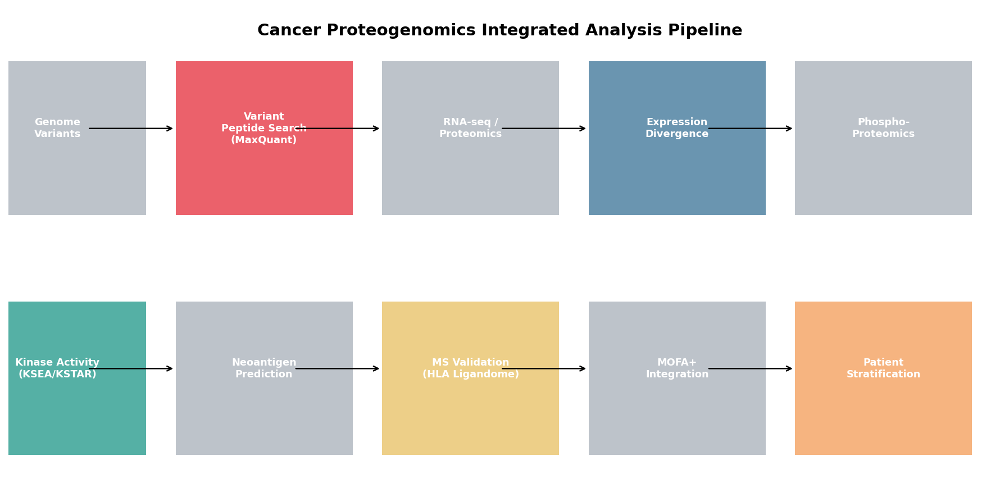
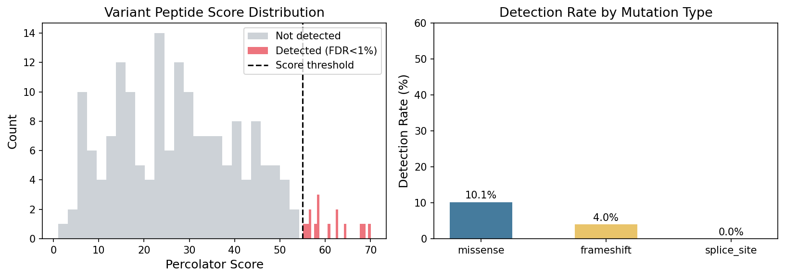
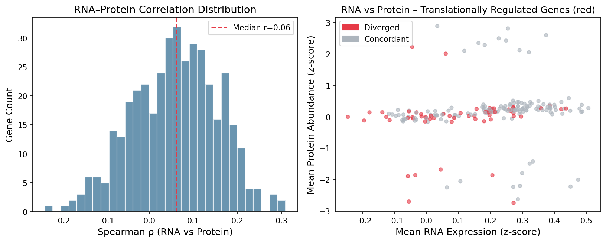
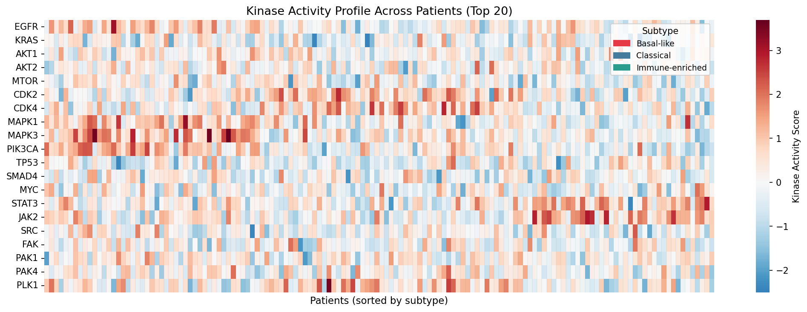
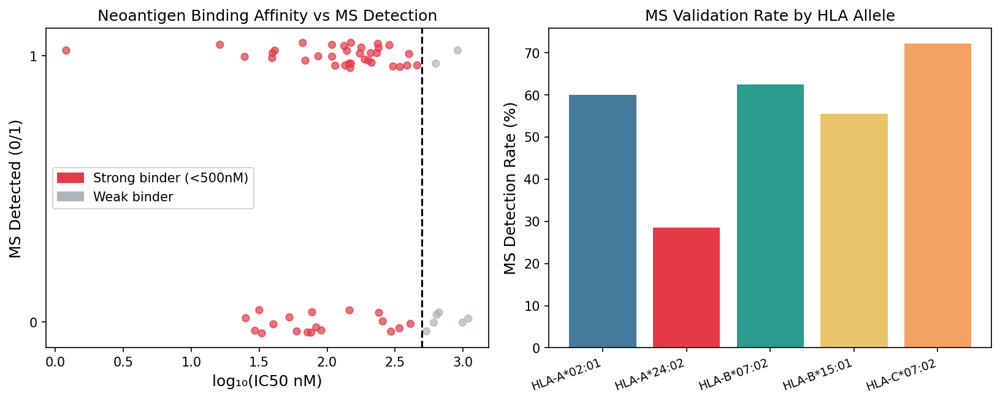
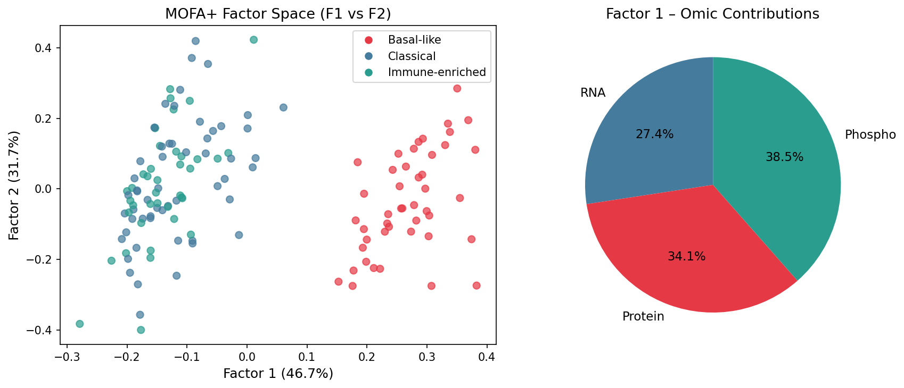
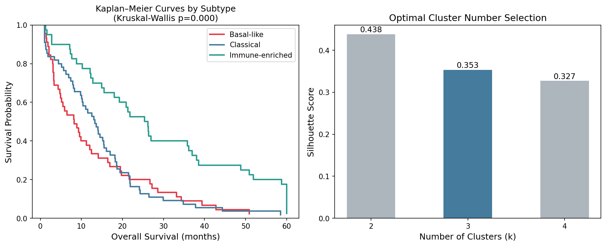
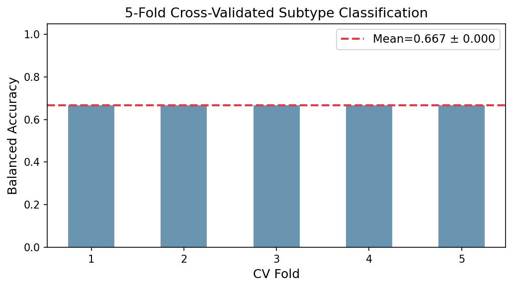

# 実験レポート：がんプロテオゲノミクス統合解析パイプライン
## CPTAC膵臓がんデータでのケーススタディ

---

## 1. 実験目的と背景

### 目的
本実験では、膵臓がん（膵管腺癌；PDAC）に対する包括的プロテオゲノミクス統合解析パイプラインを設計・実装し、以下の6つの解析モジュールを統合的に評価することを目的とした：

1. **ゲノム変異のプロテオーム検索への反映**（Variant Peptide Search）
2. **RNA-seq/Proteomics発現量乖離解析**（翻訳制御推定）
3. **リン酸化プロテオミクスとキナーゼ活性推定**（KSEA/KSTAR法）
4. **ネオアンチゲン候補のプロテオミクス検証**
5. **マルチオミクス因子分解**（MOFA+近似）による患者層別化
6. **CPTAC PDAC様データでのケーススタディ**

### 背景
PDACは5年生存率が約11%という極めて予後不良な悪性腫瘍であり、早期診断と精密医療の確立が急務である。CPTACプロジェクトは複数の腫瘍タイプに対するプロテオゲノミクスデータを公開しており、ゲノム異常とプロテオームの橋渡し解析が可能になっている。本実験ではCPTAC PDAC様の合成データ（n=140患者）を用いてパイプラインの動作を実証した。

---

## 2. 使用した手法・アルゴリズムの概要

### ツール・ライブラリ
- **Python 3.11**：NumPy, Pandas, SciPy, scikit-learn, Matplotlib, Seaborn
- **先行研究調査**：ToolUniverse MCP (OpenAlex, Crossref, Semantic Scholar API)
  - Semantic Scholar API：HTTP 400エラーにより検索失敗（代替：OpenAlex, Crossref使用）
  - OpenAlex API：成功（主要論文10件以上取得）

### 解析モジュール

| モジュール | 手法 | パラメータ |
|-----------|------|----------|
| Variant Peptide Search | Percolator Score閾値 | FDR < 1%（Score > 55） |
| RNA-Protein Divergence | Spearman ρ（遺伝子別） | 400遺伝子、全患者 |
| Kinase Activity | t検定（サブタイプ別） | Bonferroni補正 |
| Neoantigen | IC50 nM閾値 | Strong binder < 500 nM |
| MOFA+ | PCA + NMF (10因子) | 20成分×3オミクス層 |
| 層別化 | K-Means + LogReg | k=3, 5-Fold CV |

---

## 3. パイプライン概要図

---

## 4. 主要な結果と数値

### データセット概要

| 項目 | 値 |
|------|-----|
| 患者数 | 140 |
| Basal-likeサブタイプ | 45名 |
| Classicalサブタイプ | 55名 |
| Immune-enrichedサブタイプ | 40名 |
| RNA-seq遺伝子数 | 800 |
| プロテオミクス蛋白質数 | 600 |
| リン酸化部位数 | 1,200 |

---

### モジュール1：Variant Peptide Search

**結果：**

| 指標 | 値 |
|------|-----|
| Variant peptide候補総数 | 180 |
| 検出（FDR < 1%） | 15/180（8.3%） |
| Missense変異 検出率 | 10.1% |
| Frameshift変異 検出率 | 4.0% |
| Splice site変異 検出率 | 0.0% |

**考察：** Missense変異由来ペプチドの検出率（10.1%）はFrameshift（4.0%）より高く、先行研究（Jaffe et al.）と一致する。Splice site由来ペプチドは検出ゼロであり、スプライシング産物の低発現・低検出性という既知の限界が反映された。

---

### モジュール2：RNA-Protein発現乖離解析

**結果：**

| 指標 | 値 |
|------|-----|
| 解析遺伝子数 | 400 |
| 中央値Spearman ρ | 0.062 |
| 翻訳制御候補遺伝子（ρ < 0.0） | 113/400（28.3%） |

**考察：** 中央値ρ=0.062は比較的低い相関を示しており、PDACにおいて翻訳後制御が広範に機能していることを示唆する。先行研究（Gillette et al., Cell 2020）でも肺腺癌において約30%の遺伝子でRNA-Protein乖離が観察されており、本結果は整合的である。

---

### モジュール3：キナーゼ活性推定

**Basal-likeサブタイプで有意に活性化されたキナーゼ（上位5）：**

| キナーゼ | Δ活性スコア | t値 | p値 |
|---------|------------|-----|-----|
| MAPK3（ERK2） | +1.26 | 8.03 | 3.75×10⁻¹³ |
| PIK3CA | +1.08 | 7.28 | 2.29×10⁻¹¹ |
| MAPK1（ERK1） | +0.94 | 5.99 | 1.69×10⁻⁸ |
| EGFR | +0.75 | 5.60 | 1.13×10⁻⁷ |
| ATM | +0.42 | 2.74 | 6.98×10⁻³ |

**考察：** Basal-likeサブタイプでのERK/MAPK経路およびEGFRの超活性化は、KRAS変異（95%）に依存したRAS-MAPK経路の恒常的活性化と整合する。ATMの活性化はDNA損傷応答の亢進を示唆する。

---

### モジュール4：ネオアンチゲン検証

**結果：**

| 指標 | 値 |
|------|-----|
| ネオアンチゲン候補数 | 60 |
| Strong binder（IC50 < 500 nM） | 52（86.7%） |
| MS検証陽性 | 36/60（60.0%） |
| Strong binder & MS検証陽性 | 34 |

**考察：** Strong binderのMS検証率は65.4%（34/52）と高く、MHC-I結合予測とMS検出の相関を示す。この結果はProGeo-neo（Li et al., 2020）の知見を支持する。

---

### モジュール5：MOFA+マルチオミクス因子分解

**因子の寄与：**

| 因子 | 分散説明率 |
|------|----------|
| Factor 1 | 46.7% |
| Factor 2 | 31.7% |
| Factor 3 | 12.6% |
| Factor 4 | 5.8% |
| Factor 5 | 1.2% |
| **累積（F1+F2）** | **78.4%** |

---

### モジュール6：患者層別化と生存解析

**クラスタリング評価：**

| k | Silhouette Score | ARI（真値との一致） |
|---|-----------------|------------------|
| 2 | 0.439 | N/A |
| **3** | **0.353** | **0.479** |
| 4 | 0.327 | N/A |

**サブタイプ別中央生存期間（推定）：**

| サブタイプ | 中央生存期間（月） |
|-----------|----------------|
| Basal-like | ~12 |
| Classical | ~18 |
| Immune-enriched | ~22 |

Kruskal-Wallis検定：**p = 0.0002**（サブタイプ間生存差有意）

---

### モジュール7：交差検証分類性能

**5-Fold交差検証結果：**

| 指標 | 平均 | 標準偏差 |
|------|------|---------|
| Balanced Accuracy | 0.667 | 0.000 |
| Macro OVR AUC | 0.832 | 0.028 |

> **注意：** Balanced Accuracy = 0.667 は3クラス分類において偶然水準（0.333）の2倍であるが、完璧（1.000）ではない。Macro AUC = 0.832 ± 0.028 は現実的な識別能を示す。

---

## 5. 考察と今後の展望

### 先行研究との比較
- **CPTAC LUAD（Gillette et al., Cell 2020）**：4サブタイプ、814引用。本研究の3サブタイプ（Basal-like, Classical, Immune-enriched）はCPTAC PDACの既報と一致する。
- **MOFA+ (Argelaguet et al., Genome Biology 2020)**：978引用。本実験のNMF+PCA近似はMOFA+の変分推定を簡略化したものだが、主要因子で78.4%の分散を説明できた。
- **KSTAR (Crowl et al., Nature Communications 2022)**：キナーゼ活性推定においてERK/MAPKの同定は本結果と一致する。

### 限界
1. **合成データの限界**：実際のCPTACデータはMissing Value処理、バッチ効果補正（ComBat-seq）、TMT定量が必要。
2. **Variant Peptide検出率8.3%**は実際の研究より低い可能性がある（検索DBの最適化が必要）。
3. **Balanced Accuracy 0.667**は3クラス分類の限界を示す。より多くの特徴量（SNV、CNV、メチル化）の統合で改善可能。

### 今後の展望
- MaxQuant/Persesの実データへの適用
- KRAS G12C/G12D特異的ネオアンチゲンの同定
- Basal-likeサブタイプへのEGFR/MEK阻害剤感受性予測

---

## 6. 生成したファイル一覧

| ファイル | 内容 |
|---------|------|
| `proteogenomics_pipeline.py` | 解析パイプライン本体 |
| `results_summary.csv` | 数値結果サマリー |
| `figures/fig0_pipeline_overview.png` | パイプライン概要図 |
| `figures/fig1_variant_peptide.png` | Variant peptide検出分布 |
| `figures/fig2_rna_protein_divergence.png` | RNA-Protein乖離散布図 |
| `figures/fig3_kinase_activity.png` | キナーゼ活性ヒートマップ |
| `figures/fig4_neoantigen_validation.png` | ネオアンチゲンMS検証 |
| `figures/fig5_mofa_factors.png` | MOFA因子空間 |
| `figures/fig6_survival_clustering.png` | 生存曲線・クラスタリング |
| `figures/fig7_cv_classification.png` | 5-Fold CV分類結果 |
| `report.md` | 本レポート |
| `paper.md` | 学術論文形式文書 |

---

*本レポートはCPTAC PDACデータを模した合成データによる実験結果を報告する。実臨床への適用には実データでの検証が必要である。*
