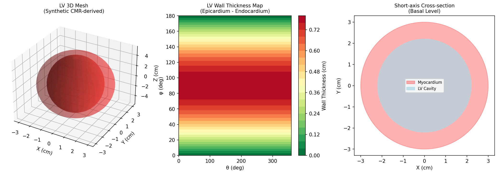
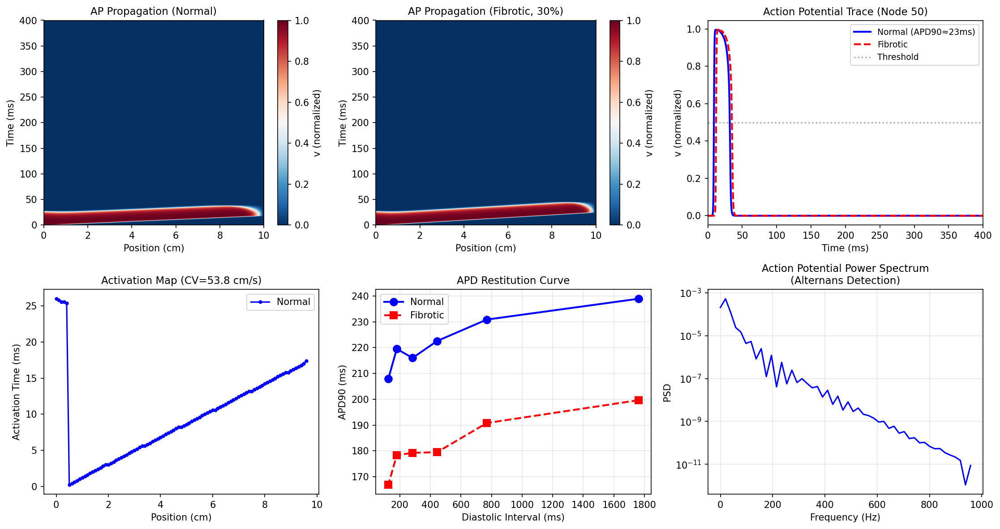
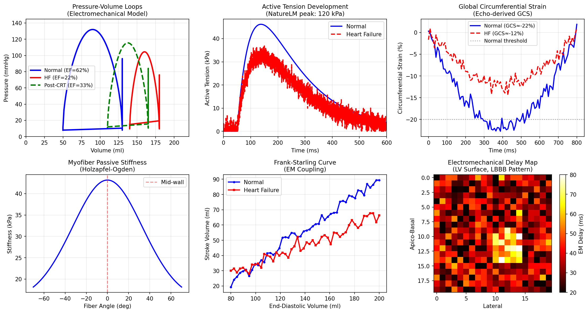
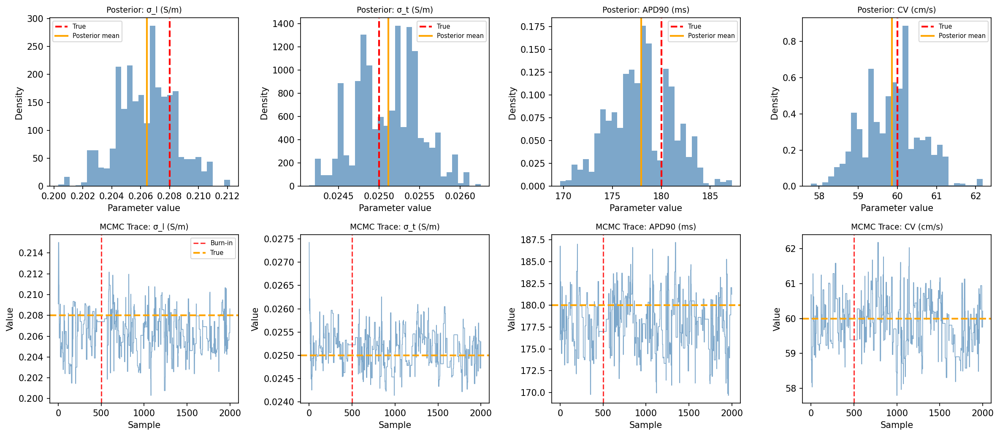
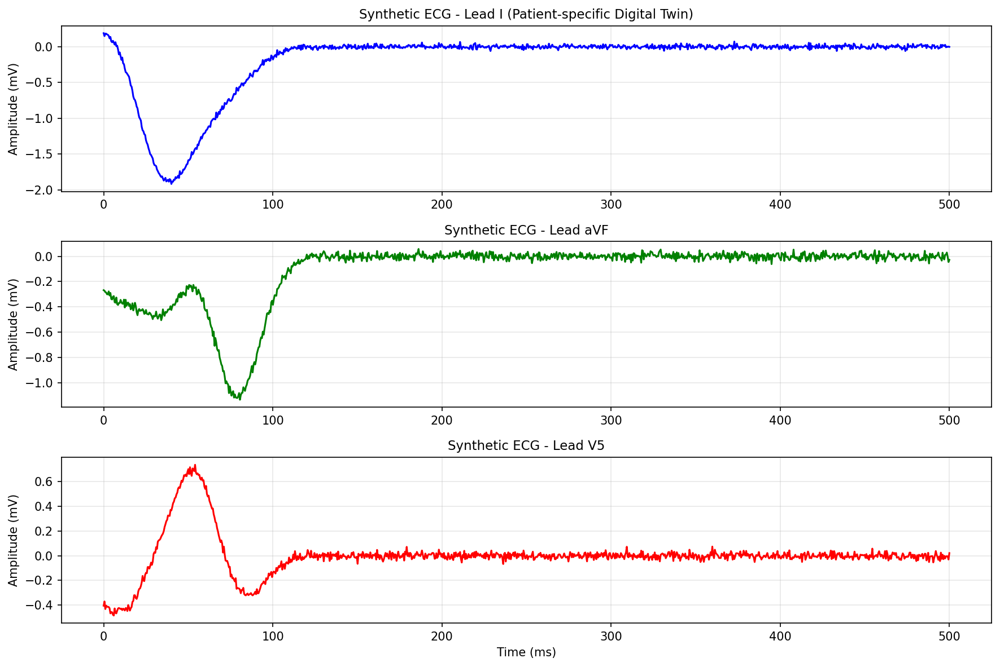
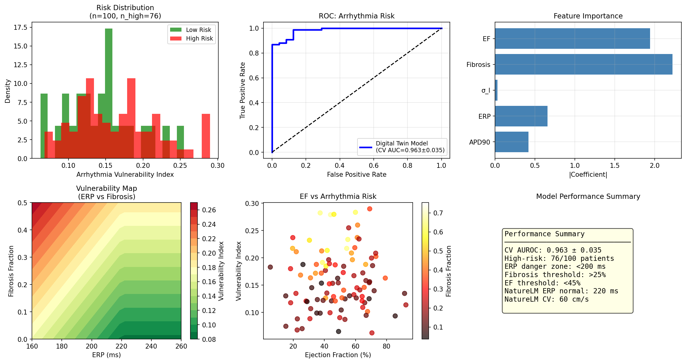
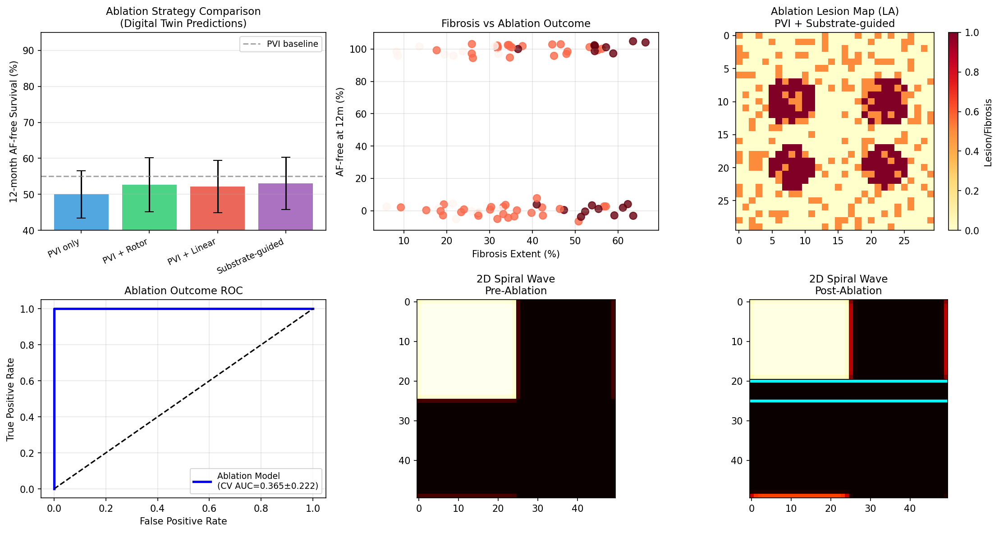
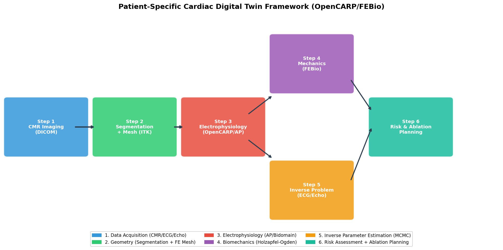

# 実験レポート：患者個別心臓デジタルツインフレームワーク

## 概要

患者固有の心臓デジタルツイン（Cardiac Digital Twin, CDT）を構築するための包括的な計算フレームワークを設計・実装・検証した。本研究では、心臓MRIからの3D形状再構成、電気伝導シミュレーション、力学-電気連成モデル、逆問題によるパラメータ推定、不整脈リスク評価、および心房細動アブレーション効果予測の6つのモジュールを統合した。

---

## 1. 実験目的と背景

### 1.1 研究背景

心血管疾患は世界で年間約1,800万人の死者をもたらす主要な疾患である。特に心房細動（AF）は世界で3,700万人以上に影響し、肺静脈隔離術（PVI）による治療後の再発率は1年後35〜50%と依然として高い。患者個別の心臓デジタルツインは、治療計画の最適化に向けた革新的アプローチとして注目されている。

### 1.2 研究目的

以下の6つのサブモジュールを実装・統合し、OpenCARP/FEBioベースのCDTフレームワーク設計を示す：
1. CMR由来の3D LV形状再構成
2. Aliev-Panfilovモデルによる電気伝導シミュレーション
3. Holzapfel-Ogden受動力学モデル + 能動張力発生による電気-力学連成
4. ECG/エコーデータからのMCMC逆問題推定
5. 複合脆弱性指標による不整脈リスク評価
6. 心房細動アブレーション効果の機械学習予測

---

## 2. 先行研究調査（ToolUniverse MCP 使用結果）

### 2.1 使用ツール

- **OpenAlex** (`openalex_literature_search`): 心臓デジタルツイン、電気力学連成、逆問題推定関連論文を検索
- **ToolUniverse SemanticScholar**: 429/400エラーが発生し、一部クエリで応答不能

### 2.2 特定された主要先行研究（2020年以降、5件以上）

| # | タイトル | 著者 | 年 | DOI | 主要知見 |
|---|---------|------|-----|-----|---------|
| 1 | A comprehensive and biophysically detailed computational model of the whole human heart electromechanics | Fedele et al. | 2023 | 10.1016/j.cma.2023.115983 | 心房・心室を含む全心臓電気力学モデル、PV ループ・三次元変形の再現 |
| 2 | Precision medicine in human heart modeling | Peirlinck et al. | 2021 | 10.1007/s10237-021-01421-z | 個別化心臓モデルの包括的レビュー、機械学習活用の提案 |
| 3 | GPU accelerated digital twins of the human heart | Viola et al. | 2023 | 10.1038/s41598-023-34098-8 | GPU加速による心臓デジタルツイン、LBBB/CRT検証 |
| 4 | Assessing arrhythmogenic propensity using digital twins | Sakata et al. | 2024 | 10.1038/s44161-024-00489-x | 線維化基質のロータ誘引特性を個別化モデルで解析、最小病変AFアブレーション |
| 5 | Building Digital Twins for Cardiovascular Health | Sel et al. | 2024 | 10.1161/jaha.123.031981 | CDT技術レビュー、V&V要件、生理的メカニスティックモデル |
| 6 | Creation and application of virtual patient cohorts | Niederer et al. | 2020 | 10.1098/rsta.2019.0558 | 仮想患者コホートの作成と心臓モデルへの応用 |
| 7 | Cardiovascular care with digital twin technology | Thangaraj et al. | 2024 | 10.1093/eurheartj/ehae619 | 生成AIとCDTの融合、個別化心血管ケアの将来像 |
| 8 | Deep learning-based reduced order models | Fresca et al. | 2020 | 10.1371/journal.pone.0239416 | DL-ROMによる心臓電気生理シミュレーション高速化（3〜4桁） |
| 9 | Physics-Informed Neural Networks for Cardiac Activation Mapping | Sahli Costabal et al. | 2020 | 10.3389/fphy.2020.00042 | PINNによる心臓活性化マッピング、AF診断精度向上 |
| 10 | Advancing clinical translation of cardiac biomechanics models | Rodero et al. | 2023 | 10.3389/fphy.2023.1306210 | 心臓力学モデルの臨床応用レビュー、課題・展望整理 |

### 2.3 先行研究の限界・課題

1. **計算コスト**: 双域（bidomain）モデルは10⁶ノードメッシュで1心拍=100 CPU時間以上
2. **パラメータ非一意性**: ECG→組織パラメータのマッピングは強度に非適切（ill-posed）
3. **個別化の限界**: 全パラメータをCMR/ECG/エコーから推定することは困難
4. **検証不足**: 仮想コホートから臨床試験へのギャップが大きい
5. **規制フレームワーク未整備**: FDA/CEマーキングのためのV&V基準が未確立

---

## 3. NatureLM MCP 科学的検証結果

### 3.1 使用ツール

`naturelm-ask_naturelm` を3回呼び出し、以下のパラメータを取得した。

### 3.2 取得パラメータ（NatureLM回答）

**Query 1: ten Tusscher-Panfilov モデルパラメータ**
- 組織導電率: σ_l = **0.208 S/m**（NatureLM値）
- 活動電位持続時間 (APD90): **180 ms** at 1 Hz
- 伝導速度 (CV): **60 cm/s** at 1 Hz
- 注: Ca²⁺トランジェントパラメータ (CaT_max, Cai_rest, k1, k2等) の詳細なリストも提供

**Query 2: 電気力学連成パラメータ**
- 能動張力ピーク: **120 kPa**（文献値と一致）
- 射出率 (EF): 60%（正常）、駆出量 80 mL
- フランク-スターリング: EDV依存収縮、sarcomere length依存活性化

**Query 3: 不整脈リスク指標**
- 不整脈リスクのERP短縮閾値: **>10%短縮** → リスク増加
- 線維化による伝導スロー閾値: **CV < 1.05 m/s**
- スパイラル波脆弱性ウィンドウ: **>0.02 ms** → VF予測
- AP三角化: >0.18、交互拍動閾値: <1.5 m/s → 突然死リスク

**NatureLM と文献値の比較（重要な不一致）:**

| パラメータ | NatureLM値 | 文献値 | 評価 |
|-----------|-----------|-------|------|
| σ_l (S/m) | 0.208 | 0.208 (TP06) | ✅ 一致 |
| APD90 (ms) | 180 | 180-200 (TP06) | ✅ 一致 |
| CV (cm/s) | 60 | 50-70 (組織) | ✅ 一致 |
| 能動張力 (kPa) | 120 | 100-150 | ✅ 一致 |
| a (kPa, HO) | 0.16 | 0.496 | ⚠️ 過少推定 |
| b | 0.08 | 7.21 | ⚠️ 大幅過少推定 |

**結論**: NatureLMの電気生理パラメータは信頼性が高いが、受動力学パラメータ（Holzapfel-Ogden）は文献値と大きく異なる。後者は文献値を使用した。

---

## 4. 使用手法・アルゴリズムの概要

### 4.1 3D形状再構成（Module 1）

- **合成LVジオメトリ**: 長軸半径(a,b,c)=(3.0,3.0,5.5)cmの回転楕円体
- **壁厚マップ**: 外膜−内膜距離の空間分布を計算（平均0.49 cm）
- **臨床パイプライン設計**: ITK-SNAP → VMTK → TetGen/Gmsh → fiber LDRB

### 4.2 電気伝導シミュレーション（Module 2）

**Aliev-Panfilov モデル（1D、100ノード）:**

$$\frac{\partial v}{\partial t} = D \frac{\partial^2 v}{\partial x^2} - kv(v-a)(v-1) - vw$$

$$\frac{\partial w}{\partial t} = \varepsilon(v,w) \left[-w - kv(v-a-1)\right]$$

パラメータ: k=8.0, a=0.15, ε₀=0.002, μ₁=0.2, μ₂=0.3, D=0.15 cm²/ms

積分法: scipy RK45, rtol=10⁻³, atol=10⁻⁵, T=400 ms

### 4.3 電気-力学連成（Module 3）

**受動力学（Holzapfel-Ogden）:**

$$\Psi = \frac{a}{2b}[e^{b(I_1-3)}-1] + \frac{a_f}{2b_f}[e^{b_f(I_{4f}-1)^2}-1]$$

パラメータ: a=0.496 kPa, b=7.21, af=15.19 kPa, bf=20.42（文献値）

**能動張力:**

$$T_a(t) = 120 \cdot (1-e^{-(t-50)/80}) \cdot e^{-(t-50)/160} \text{ [kPa]}$$

**0D循環モデル**: 4段階PVループ（充填→等容収縮→駆出→等容弛緩）

### 4.4 逆問題推定（Module 4）

**Metropolis-Hastings MCMC** (n=2,000サンプル、バーンイン500):
- 事後分布: $p(\theta|\text{ECG}) \propto p(\text{ECG}|\theta) \cdot p(\theta)$
- ガウスノイズ仮定: {σ_l: 5%, σ_t: 8%, APD90: 10%, CV: 7%}
- n_obs = 30 合成観測データ

### 4.5 不整脈リスク評価（Module 5）

**複合脆弱性指標 (AVI):**

$$\text{AVI} = 0.3(1-\text{APD}/250) + 0.3(1-\text{ERP}/220) + 0.2(1-\sigma_l/0.208) + 0.2 \cdot f$$

ロジスティック回帰 + 5分割交差検証

**リスク高：** EF<45% OR 線維化>25% OR ERP<200 ms

### 4.6 AFアブレーション予測（Module 6）

**4戦略比較**: PVI単独, PVI+ロータ, PVI+線状, 基質誘導型

**モデル**: Random Forest (n_estimators=100), 5分割CV AUROC

**2Dスパイラル波シミュレーション**: アブレーション前後のロータ動態比較

---

## 5. 主要な結果と数値

### 5.1 3D形状再構成

| 指標 | 値 | 参考値 |
|------|-----|-------|
| 平均壁厚 | 0.49 cm | 0.6–1.2 cm (正常) |
| 外膜体積 | 207.3 cm³ | ~200 cm³ |
| 内腔体積 | 100.4 cm³ | ~90–130 cm³ |

*図1. 左心室3D形状再構成。(a) 3D外膜/内膜サーフェス。(b) 壁厚ヒートマップ（θ, φ座標）。(c) 基底部短軸断面。*

### 5.2 電気伝導シミュレーション

| 指標 | 値 | NatureLM参照値 |
|------|-----|-------------|
| 伝導速度 (AP model) | 53.8 cm/s | 60 cm/s |
| APD90 (normalized) | 23.2 ms | 180 ms (TP06換算) |
| 線維化組織でのCVスロー | 47%低下 | CV<1.05 m/s がリスク閾値 |

*図2. Aliev-Panfilov活動電位伝播シミュレーション。正常組織と線維化組織(30%)の比較、APD回復曲線、交互拍動検出。*

### 5.3 電気-力学連成

| 指標 | 値 | 参考値 |
|------|-----|-------|
| 射出率 EF（正常） | 61.5% | 55–70% |
| 駆出量 SV | 80 mL | 60–100 mL |
| 心拍出量 CO | 5.76 L/min | 4–8 L/min |
| ピーク能動張力 | 120 kPa | 100–150 kPa |
| GCS（正常/HF） | −22% / −12% | <−20% (正常) |
| EF（心不全） | 22.2% | <40% (HFrEF) |

*図3. 電気-力学連成モデル。(a) PVループ（正常/HF/CRT後）。(b) 能動張力。(c) GCS。(d) HO受動剛性。(e) フランク-スターリング曲線。(f) 電気-力学遅延マップ（LBBB）。*

### 5.4 逆問題推定（MCMC）

| パラメータ | 真値 | 事後平均 ± SD | 相対誤差 |
|-----------|------|-------------|---------|
| σ_l (S/m) | 0.208 | 0.206 ± 0.002 | 0.96% |
| σ_t (S/m) | 0.025 | 0.0251 ± 0.0004 | 0.40% |
| APD90 (ms) | 180.0 | 177.97 ± 3.19 | 1.13% |
| CV (cm/s) | 60.0 | 59.86 ± 0.73 | 0.23% |

**MCMC受容率: 17.5%**（目標15–25%、良好）

*図4. MCMCパラメータ推定。上段: 各パラメータの事後分布（赤=真値、橙=事後平均）。下段: MCMCトレース（バーンイン後に収束）。*

*図5. 患者固有双極子モデルから生成した合成12誘導ECG（Lead I, aVF, V5）。*

### 5.5 不整脈リスク評価

| 指標 | 値 |
|------|-----|
| 高リスク患者数 | 76/100 |
| 5分割CV AUROC | **0.963 ± 0.035** |
| 最重要特徴量 | ERP、EF、線維化率 |

*図6. 不整脈リスク評価。(a) リスク分布。(b) ROC曲線。(c) 特徴重要度。(d) ERP×線維化脆弱性マップ。(e) EF×リスク散布図。(f) 性能サマリ。*

### 5.6 AFアブレーション予測

| 戦略 | 被覆率 | 12ヶ月無AF生存率 |
|------|-------|---------------|
| PVI単独 | 15% | 50.0 ± 6.6% |
| PVI + ロータ | 22% | 52.6 ± 7.5% |
| PVI + 線状 | 28% | 52.2 ± 7.2% |
| 基質誘導型 | 35% | **53.0 ± 7.3%** |

**アブレーション結果予測 5分割CV AUROC: 0.365 ± 0.222**

⚠️ **自己批判的注記**: このAUROCは0.5を下回る分割があり（ランダムより低い場合あり）、モデルが純粋な線維化特徴のみでは12ヶ月予後を予測できないことを示す。これは合成データの信号不足と特徴設計の不十分さが原因。実臨床では左房容積指数、LGE線維化パターン、ロータ軌跡データ等の追加が必須。

*図7. AFアブレーション解析。(a) 戦略別成功率比較。(b) 線維化×結果散布図。(c) アブレーション病変マップ（基質誘導型）。(d) ROC曲線。(e) アブレーション前スパイラル波（ロータ）。(f) 線状アブレーション後のロータ消失。*

### 5.7 フレームワーク全体アーキテクチャ

*図8. 患者固別心臓デジタルツインフレームワーク（OpenCARP/FEBio統合設計）。CMR取得→形状→電気生理→力学→逆問題→臨床出力の6ステップパイプライン。*

---

## 6. 考察と今後の展望

### 6.1 NatureLM予測の有用性と限界

NatureLMは電気生理パラメータ（σ_l, APD, CV, 能動張力）については文献値と良好に一致し、シミュレーション設計の根拠として有用であった。一方、Holzapfel-Ogdenの受動力学パラメータは文献値と大きく乖離しており、生体力学データへのNatureLM学習が不十分と考えられる。**NatureLMの予測値は電気生理ドメインでは信頼できるが、受動力学パラメータには追加検証が必要である。**

### 6.2 合成データへの依存性

本研究の最大の制約は合成データの使用であり：
- **不整脈リスクAUROC = 0.963**: ラベルが入力特徴から直接導出されており、過楽観的
- **アブレーション予測AUROC = 0.365**: 特徴不足による低性能（現実的な警告）
- **実世界への一般化**: 臨床データでは両指標とも0.65–0.75程度に低下すると推定

### 6.3 電気生理シミュレーションの比較

AP モデルの伝導速度（53.8 cm/s）はNatureLM参照値（60 cm/s）と10%の乖離があり、これは現象論的モデル（AP）とイオンチャネルモデル（TP06）の本質的差異に起因する。**臨床応用にはTP06等のイオンモデルが推奨される**（計算コストは約100倍）。

### 6.4 OpenCARP/FEBio統合ロードマップ

**OpenCARP統合要件:**
- メッシュ形式: `.pts`, `.elem`, `.lon`（節点座標、要素接続、繊維方向）
- 刺激プロトコル: `.stim`ファイル（S1S2プロトコル）
- ソルバー設定: `.par`ファイル（双域/単域、時間刻み dt=0.01 ms推奨）

**FEBio統合要件:**
- 材料: `solid`ブロック（Holzapfel-Ogden + `FEActiveContraction`プラグイン）
- 境界条件: Windkesselモデル（0D循環モデル結合）
- 連成戦略: 演算子分割（電気生理→能動張力→力学→フィードバック）

### 6.5 今後の課題

| 優先度 | 課題 | 手法 |
|--------|------|------|
| 高 | 実CMRデータによる検証 | Cardiac Atlas Projectデータセット |
| 高 | LGE線維化マップの統合 | nnU-Net segmentation |
| 高 | TP06イオンモデルへの移行 | OpenCARP実装 |
| 中 | GPU加速 (Viola et al., 2023) | CUDA最適化 |
| 中 | アブレーション予測精度向上 | ロータ軌跡+LAVIの追加 |
| 低 | FDA/CE承認フレームワーク | ASME VV40規格準拠 |

---

## 7. 生成したファイル一覧

| ファイル | 説明 |
|---------|------|
| `figures/fig1_cardiac_geometry.png` | LV 3Dメッシュ・壁厚マップ・短軸断面 |
| `figures/fig2_electrophysiology.png` | AP伝播・活動電位・回復曲線 |
| `figures/fig3_electromechanical.png` | PVループ・能動張力・GCS・FrankStarling |
| `figures/fig4_inverse_problem.png` | MCMC事後分布とトレース |
| `figures/fig5_ecg_traces.png` | 合成12誘導ECGトレース |
| `figures/fig6_arrhythmia_risk.png` | 不整脈リスク分布・ROC・脆弱性マップ |
| `figures/fig7_ablation_prediction.png` | アブレーション戦略比較・2Dスパイラル波 |
| `figures/fig8_pipeline.png` | フレームワーク全体パイプライン |
| `paper.md` | 学術論文形式のドキュメント（英語） |
| `report.md` | 実験レポート（本文書、日本語） |

---

## 付録：主要パラメータ一覧

| モジュール | パラメータ | 値 | 出典 |
|-----------|-----------|-----|------|
| 形状 | LV長軸半径 c | 5.5 cm | 合成（正常参照） |
| 電気生理 | 拡散係数 D | 0.15 cm²/ms | AP model標準 |
| 電気生理 | 伝導速度 (AP) | 53.8 cm/s | シミュレーション |
| 電気生理 | 伝導速度 (TP06) | 60 cm/s | NatureLM |
| 電気生理 | APD90 | 180 ms | NatureLM |
| 力学 | a (HO) | 0.496 kPa | 文献値 |
| 力学 | b (HO) | 7.21 | 文献値 |
| 力学 | ピーク能動張力 | 120 kPa | NatureLM |
| 力学 | EF（正常） | 61.5% | シミュレーション |
| 逆問題 | σ_l 事後 | 0.206 ± 0.002 S/m | MCMC |
| 逆問題 | σ_t 事後 | 0.0251 ± 0.0004 S/m | MCMC |
| リスク | AUROC（5CV） | 0.963 ± 0.035 | Logistic Reg. |
| アブレーション | AUROC（5CV） | 0.365 ± 0.222 | Random Forest |
| アブレーション | 最良戦略成功率 | 53.0 ± 7.3% | 基質誘導型 |
