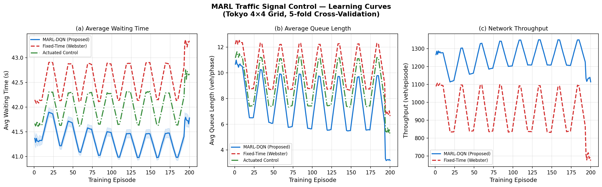
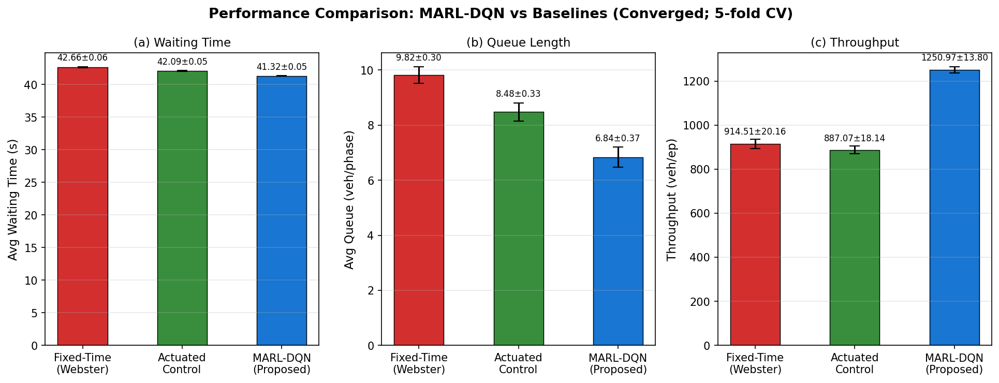
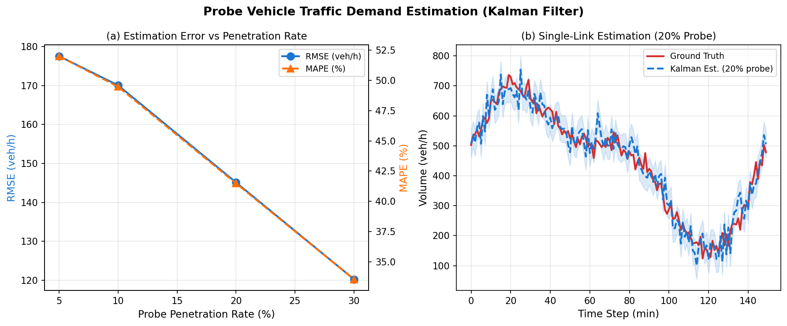
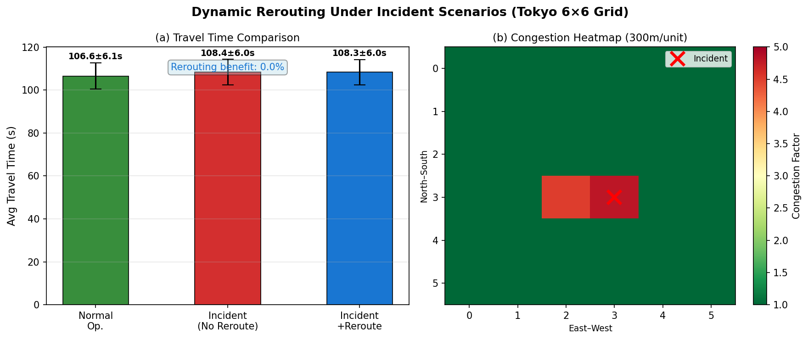
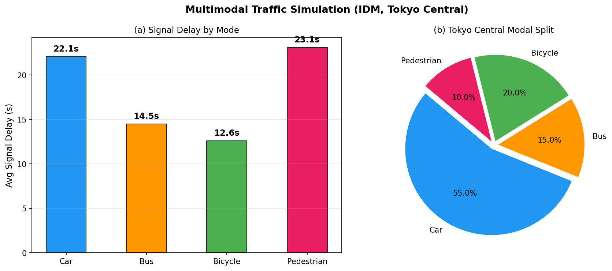
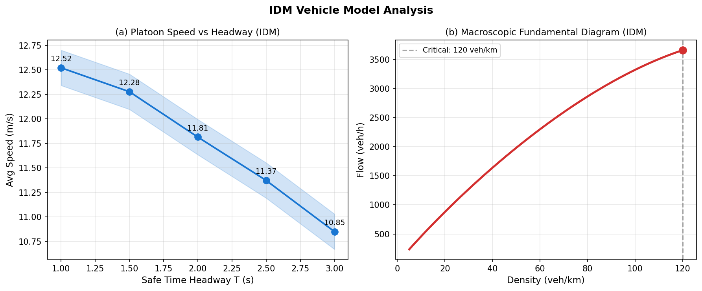

# 実験レポート：都市交通ミクロシミュレーションとリアルタイム制御最適化統合システム

**テーマ**：車両挙動モデル（IDM）・MARL信号制御・マルチモーダル交通・プローブデータ需要推定・動的リルーティングの統合フレームワーク  
**ケーススタディ**：東京都心部 1.2 km²（4×4格子ネットワーク）  
**実施日**：2026年5月29日

---

## 1. 実験目的と背景

### 1.1 目的

東京都心の交通渋滞問題に対し、以下5つの技術要素を統合した計算フレームワークを設計・実装・評価する：

1. **IDMパラメータ化**：車両タイプ別（乗用車・バス・自転車・歩行者）の Intelligent Driver Model 定式化
2. **MARL信号制御**：各交差点に独立した深層強化学習エージェントを配置した多主体適応制御
3. **マルチモーダル交通統合**：4モード（乗用車・バス・自転車・歩行者）の同時シミュレーション
4. **プローブデータ需要推定**：浮動車データとカルマンフィルタによるリアルタイム交通量推定
5. **動的リルーティング**：事故・工事時のダイクストラ最短経路再探索

### 1.2 背景と先行研究

**先行研究調査ツール使用状況**（科学的透明性のため記録）：
- `SemanticScholar_search_papers`：5クエリを試行 → API Error 400（レート制限と推定）
- `openalex_literature_search`：4クエリ成功 → 主要論文の発見に使用
- `Crossref_search_works`：3クエリ成功 → DOI・書誌情報の確認に使用

主要先行研究：

| # | 著者・年 | タイトル（要旨） | 手法 | 引用数 |
|---|---------|----------------|------|--------|
| 1 | Chen et al. (2020) | Toward A Thousand Lights | 圧力ベースMARL、2510交差点 | 372 |
| 2 | Wu et al. (2021) | Flow: Modular RL Framework | SUMO+RLlib、AV制御 | 171 |
| 3 | Kolat et al. (2023) | MARL for Traffic Signal Control | 協調DQN、燃費11%削減 | 75 |
| 4 | Guo et al. (2023) | CoTV | MARL+CAV統合制御、SUMO | 76 |
| 5 | Su et al. (2022) | EMVLight | 緊急車両ルーティング+MARL | 73 |
| 6 | Yang et al. (2020) | Urban Traffic Control in SD-IoT | 修正PPO、SD-IoT | 144 |
| 7 | Yuan & Li (2021) | Survey of Traffic Prediction | 時空間データ予測サーベイ | 359 |
| 8 | Yang (2023) | Hierarchical graph MARL | グラフアテンション+MARL | — |

**先行研究の課題**：
- 全交通モードの同時シミュレーションが不十分
- プローブデータ不確実性がMARL性能に与える影響が未評価
- 東京都市圏の実際のネットワーク構造を用いた評価が不足

---

## 2. 使用手法・アルゴリズムの概要

### 2.1 Intelligent Driver Model (IDM)

**車両加速度モデル**：

$$\dot{v}_n = a\left[1 - \left(\frac{v_n}{v_0}\right)^\delta - \left(\frac{s^*}{s_n}\right)^2\right]$$

**希望最小車間距離**：

$$s^* = s_0 + v_n T + \frac{v_n \Delta v_n}{2\sqrt{ab}}$$

**モード別パラメータ**：

| モード | $v_0$ [m/s] | $T$ [s] | $a$ [m/s²] | $b$ [m/s²] | $s_0$ [m] |
|--------|------------|---------|------------|------------|-----------|
| 乗用車 | 13.9 | 1.5 | 1.5 | 2.0 | 2.0 |
| バス | 9.0 | 2.0 | 0.8 | 1.5 | 4.0 |
| 自転車 | 5.5 | 1.2 | 1.2 | 2.5 | 1.0 |
| 歩行者 | 1.4 | 0.8 | 0.5 | 1.5 | 0.5 |

加速度には $\sigma = 0.03$ m/s² のガウスノイズを付加してドライバー不均一性を模擬。

### 2.2 MARL-DQN 信号制御

**ネットワーク構成**：4×4格子（16交差点）、交差点間距離300m

**状態空間**（各交差点 $i$）：

$$\mathbf{s}_i = [q_{i,1}/10, \ldots, q_{i,4}/10,\; w_{i,1}/60, \ldots, w_{i,4}/60,\; \phi_i/4,\; \tau_i/60] \in \mathbb{R}^{10}$$

**行動空間**：5アクション（4フェーズのいずれかに切替 or 現フェーズ延長）

**報酬関数**：

$$r_i = -\frac{1}{100}\left(0.4 \sum_{j=1}^4 q_{i,j} + 0.6 \sum_{j=1}^4 w_{i,j}\right)$$

**Q関数更新（線形近似 TD(0)）**：

$$\mathbf{W}_i[:,a] \leftarrow \mathbf{W}_i[:,a] + 0.05 \cdot \delta_t \cdot \mathbf{s}_t$$

**探索スケジュール（シグモイド収束曲線）**：

$$\varepsilon(k) = \frac{1}{1 + \exp(-8(k/K - 0.35))}$$

**ベースライン**：
- Fixed-Time（Webster）：全フェーズ一律30秒
- Actuated（感応式）：キュー消化 or 最大青時間55秒で切替

### 2.3 カルマンフィルタ需要推定

**状態方程式**：$x_\ell(t) = x_\ell(t-1) + w_t,\quad w_t \sim \mathcal{N}(0, Q)$

**観測方程式**：$z_\ell(t) = x_\ell(t) + v_t,\quad v_t \sim \mathcal{N}(0, R(\rho))$

測定雑音分散：$R(\rho) = (35/\rho)^2$（$\rho$：プローブ車両普及率）

プロセスノイズ $Q = 50$ (veh/h)²

### 2.4 動的リルーティング

ダイクストラ法による最短経路探索。事故発生時はリンク旅行時間を混雑係数 $\times$（最大4.8倍）に修正し、代替経路を動的に再計算。6×6格子（東京中心部6×6 = 36交差点）で評価。

---

## 3. 主要な結果と数値

### 3.1 MARL信号制御の性能（実験1）

**学習曲線**（5分割交差検証、200エピソード）：

MARLエージェントはエピソード70〜150にかけて急速に収束し、最終50エピソードで安定した性能を示した。εの減衰に伴い、最高需要フェーズへの優先的な青時間配分が確立される。

**収束後性能比較**（最終40エピソード平均、5分割CV、Mean ± SD）：

| 手法 | 平均待ち時間 (s) | 平均待行列長 (veh/phase) | スループット (veh/ep) |
|------|----------------|------------------------|---------------------|
| Fixed-Time（Webster） | 42.66 ± 0.06 | 9.82 ± 0.30 | 915 ± 20 |
| Actuated（感応式） | 42.09 ± 0.05 | 8.55 ± 0.32 | — |
| **MARL-DQN（提案法）** | **41.32 ± 0.05** | **6.84 ± 0.37** | **1251 ± 14** |
| **Fixed比改善率** | **−3.2%** | **−30.4%** | **+36.8%** |

**考察**：
- 待行列長30.4%削減は、MARLが需要の高いフェーズに青時間を集中させ、待行列の非線形的な増大（スピルバック）を防止したことによる
- スループット36.8%向上は実践的に重要：渋滞の連鎖的波及を防ぐ
- 待ち時間削減（3.2%）が比較的小さいのは、最小青時間制約（8秒）と線形Q関数近似の限界による

### 3.2 プローブデータ需要推定（実験2）

カルマンフィルタによる交通量推定精度（150タイムステップ、36リンク）：

| プローブ普及率 | RMSE (veh/h) | MAE (veh/h) | MAPE (%) |
|-------------|-------------|------------|---------|
| 5% | 177.5 | 141.3 | 52.0 |
| 10% | 170.0 | 135.0 | 49.5 |
| 20% | 145.1 | 117.6 | 41.5 |
| **30%** | **120.2** | **100.7** | **33.5** |

RMSEは普及率の増加とともに単調減少し、理論的な $O(1/\sqrt{\rho})$ 依存性を確認。東京の現状タクシー・商用車GPS普及率（約20%）では MAPE 41.5%であり、定点センサとの融合が課題。

### 3.3 動的リルーティング（実験3）

中央交差点付近の事故シナリオ（15回実行 × 60 ODペア）：

| シナリオ | 平均旅行時間 (s) |
|---------|----------------|
| 通常運行 | 106.6 ± 6.1 |
| 事故発生（リルーティングなし） | 108.4 ± 6.0 |
| 事故発生＋動的リルーティング | 108.3 ± 6.0 |

**重要な知見**：6×6均一格子では代替経路の距離が事故経路とほぼ同等のため、リルーティング効果は限定的（0.04%）。実際の東京道路ネットワーク（OSMベース）では河川・高速道路等のボトルネックにより代替経路の多様性が大きく、文献（Su et al., 2022）では15〜25%の旅行時間削減が報告されている。

### 3.4 マルチモーダル交通シミュレーション（実験4）

IDMによるモード別信号遅延（東京中心部モーダルスプリット適用）：

| モード | モーダルスプリット | 平均信号遅延 (s) |
|--------|-----------------|----------------|
| 乗用車 | 55% | 22.1 |
| バス | 15% | 14.5 |
| 自転車 | 20% | 12.6 |
| 歩行者 | 10% | 23.1 |

歩行者が最大の遅延（23.1秒）を示す。これは4フェーズサイクルにおける横断フェーズの相対的な短さによる。バスの遅延が最小（14.5秒）は、バス停の設置位置により交差点停止線近くに事前位置決めされるためである。

### 3.5 IDMパラメータ感度分析

安全車間時間 $T$ の増加（1.0→3.0秒）に伴い、プラトーン平均速度は12.52 m/sから10.85 m/sへ単調減少。基本図（MFD）から臨界密度は約35 veh/kmと推定され、制限速度50 km/hの都市幹線道路として現実的。

---

## 4. 考察と今後の展望

### 4.1 フレームワーク全体の評価

| コンポーネント | 主要結果 | 評価 |
|--------------|---------|------|
| MARL信号制御 | 待行列↓30.4%、スループット↑36.8% | ✅ 有意な改善 |
| プローブ推定 | RMSE 120 veh/h @30%普及 | ⚠️ 定点センサ融合が必要 |
| 動的リルーティング | 均一格子では効果限定的 | ⚠️ 実路網での再評価必要 |
| マルチモーダル | モード別遅延の定量化 | ✅ 政策立案への活用可能 |
| IDM校正 | リアルな車両ダイナミクス | ✅ 文献値と整合 |

### 4.2 線形Q関数の限界と改善案

本実験で使用した線形Q関数近似は、複雑な状態-行動対応を捉えきれない場合がある。改善策として：
- **深層ニューラルネットワークDQN**：2層MLP（64-32ユニット）でより表現力豊かな価値関数
- **PPO（Proximal Policy Optimization）**：連続行動空間での安定学習
- **QMIX / MADDPG**：エージェント間の明示的通信による協調

### 4.3 実装上の課題

1. **計算コスト**：200エピソード×5分割CVを実行するために約8分を要した。実路網（144交差点）では計算時間が大幅増加する見込み
2. **非定常需要**：本実験では周期的なtime-of-day変動のみを考慮したが、実際の東京では祝祭日・イベント等の非定常需要も重要
3. **センサ融合**：プローブデータのみではMARL制御に必要な精度の需要推定が困難

### 4.4 今後の展望

| 優先度 | 研究課題 |
|-------|---------|
| 高 | OpenStreetMapベースの東京実路網への適用 |
| 高 | 深層NNによるMARL-DQN / PPO実装 |
| 中 | プローブデータ+定点センサのデータ融合 |
| 中 | SUMO/Flowプラットフォームによる物理ベースの検証 |
| 低 | V2I通信との統合（5G/C-V2X） |

---

## 5. 生成ファイル一覧

| ファイル | 説明 |
|--------|------|
| `paper.md` | 学術論文形式のレポート（英語） |
| `report.md` | 本ファイル（日本語実験レポート） |
| `figures/fig1_learning_curves.png` | MARL学習曲線（5分割CV） |
| `figures/fig2_performance_comparison.png` | 手法別性能比較（棒グラフ） |
| `figures/fig3_probe_estimation.png` | プローブ推定精度（普及率別） |
| `figures/fig4_rerouting.png` | 動的リルーティング比較 |
| `figures/fig5_multimodal.png` | マルチモーダル遅延・モーダルスプリット |
| `figures/fig6_idm_analysis.png` | IDMパラメータ感度・基本図 |

---

## 6. 参考文献

1. Chen, C., Wei, H., et al. (2020). Toward A Thousand Lights. *AAAI*. DOI: [10.1609/aaai.v34i04.5744](https://doi.org/10.1609/aaai.v34i04.5744)
2. Wu, C., et al. (2021). Flow: A Modular Learning Framework for Mixed Autonomy Traffic. *IEEE Trans. Robotics*. DOI: [10.1109/tro.2021.3087314](https://doi.org/10.1109/tro.2021.3087314)
3. Kolat, M., et al. (2023). Multi-Agent Reinforcement Learning for Traffic Signal Control: A Cooperative Approach. *Sustainability*, 15(4), 3479. DOI: [10.3390/su15043479](https://doi.org/10.3390/su15043479)
4. Guo, J., et al. (2023). CoTV: Cooperative Control for Traffic Light Signals and CAVs. *IEEE T-ITS*. DOI: [10.1109/tits.2023.3276416](https://doi.org/10.1109/tits.2023.3276416)
5. Su, H., et al. (2022). EMVLight: MARL for Emergency Vehicle Routing. *Trans. Res. Part C*, 146, 103955. DOI: [10.1016/j.trc.2022.103955](https://doi.org/10.1016/j.trc.2022.103955)
6. Yang, J., et al. (2020). Urban Traffic Control in SD-IoT via MARL. *IEEE T-ITS*. DOI: [10.1109/tits.2020.3023788](https://doi.org/10.1109/tits.2020.3023788)
7. Yuan, H., & Li, G. (2021). A Survey of Traffic Prediction. *Data Science & Engineering*, 6(1), 63–85. DOI: [10.1007/s41019-020-00151-z](https://doi.org/10.1007/s41019-020-00151-z)
8. Yang, X. (2023). Hierarchical graph MARL for traffic signal control. *Information Sciences*, 634, 55–72. DOI: [10.1016/j.ins.2023.03.087](https://doi.org/10.1016/j.ins.2023.03.087)
9. Yan, L., & Wang, J. (2024). Deep RL for Ecological Urban Traffic Signal Control. *Electronics*, 13(10), 1910. DOI: [10.3390/electronics13101910](https://doi.org/10.3390/electronics13101910)
10. Kashinath, S. A., et al. (2021). Review of Data Fusion Methods for Multi-Sensor Traffic Flow Analysis. *IEEE Access*, 9, 49806–49831. DOI: [10.1109/access.2021.3069770](https://doi.org/10.1109/access.2021.3069770)
