# 実験レポート：再生可能エネルギー大量導入下の電力グリッドリアルタイムシミュレーションシステム

**実施日**: 2026年5月29日  
**フレームワーク**: PyPSA v1.2.2 + pandapower v3.4.0  
**対象エリア**: 九州電力エリア（モデル化）

---

## 1. 実験目的と背景

### 1.1 背景

日本の第6次エネルギー基本計画（2021年）は2030年度に電源構成の36〜38%を再生可能エネルギーとすることを目標としており、すでに九州電力エリアでは春・秋の低需要期に再エネ比率が50%を超える事態が頻発している。この高浸透率化により以下の課題が顕在化している：

- **出力制御の増大**：九州電力エリアでは2022年度に800 GWh超の太陽光出力制御が発生
- **系統慣性の低下**：同期発電機が逆変換器ベース電源に置き換わることで慣性定数Hが低下し、周波数変化率（RoCoF）が増大
- **確率的変動性**：気象変動による太陽光・風力の出力不確実性が需給バランス管理を困難にする
- **潮流計算の収束性低下**：高浸透率時に潮流計算の収束が困難になる問題

本実験では、これらの課題に対応する6モジュールからなるリアルタイムシミュレーションフレームワークを設計・実装し、定量的な性能評価を行った。

### 1.2 先行研究調査（MCP ToolUniverse 使用）

**試行したツールと結果**：

| ツール | クエリ数 | 結果 |
|--------|---------|------|
| SemanticScholar_search_papers | 5クエリ | 結果なし（APIレート制限またはインデックス問題と推定） |
| Crossref_search_works | 5クエリ | 成功：各テーマ5件、合計25件の候補論文を取得 |

Crossref検索により特定した主要論文：

| # | タイトル | 著者 | 年 | DOI |
|---|---------|------|----|-----|
| 1 | Impact of renewable energy penetration rate on power system transient voltage stability | Niu et al. | 2022 | 10.1016/j.egyr.2021.11.160 |
| 2 | Assessment of frequency stability and required inertial support for power grids with high penetration of renewable energy sources | Saleem & Saha | 2024 | 10.1016/j.epsr.2024.110184 |
| 3 | Impact of renewable energy penetration rate on power system frequency stability | Qin et al. | 2022 | 10.1016/j.egyr.2022.05.261 |
| 4 | A novel grid-forming technology for transient stability enhancement of power system with high penetration of renewable energy | Li et al. | 2022 | 10.1016/j.ijepes.2022.108402 |
| 5 | Real-time transient stability detection in the power system with high penetration of DFIG-based wind farms | Shabani & Kalantar | 2021 | 10.1016/j.ijepes.2021.107319 |
| 6 | Sequential Power-Based Holomorphic Embedding Probabilistic Power Flow Method | Li et al. | 2026 | 10.22541/authorea.15003593/v1 |
| 7 | Holomorphic Embedding Power Flow Analysis of Hybrid-Tidal-Farm-Integrated Power Distribution System | Sur et al. | 2022 | 10.1109/jsyst.2021.3063624 |
| 8 | PyPSA-Korea: open-source energy system model | Kwak et al. | 2025 | 10.1016/j.egyr.2025.05.018 |
| 9 | PyPSA-GB: open-source model of Great Britain's power system | Lyden et al. | 2024 | 10.1016/j.esr.2024.101375 |
| 10 | Impact of demand side management on optimal sizing of residential battery energy storage system | Mulleriyawage & Shen | 2021 | 10.1016/j.renene.2021.03.122 |

**先行研究の課題・限界**：
- 既存研究は個別課題（安定性 or 予測 or 最適化）のみを対象とし、統合フレームワークが存在しない
- 九州電力エリア固有の出力制御シミュレーションを行ったオープンソース実装がない
- HEM vs Newton-Raphson の再エネ浸透率依存性の定量比較研究がない

---

## 2. 使用した手法・アルゴリズムの概要

### 2.1 電力潮流計算の高速化

**Newton-Raphson 法（ベースライン）**：
- Jacobian行列を用いた反復解法：$\mathbf{J}\Delta\mathbf{x} = -\mathbf{f}(\mathbf{x})$
- 収束判定：不整合量 $< 10^{-8}$ p.u.
- 実装：pandapower `pp.runpp()`

**ホロモルフィック埋め込み法（HEM）**：
- 電力潮流方程式を複素解析関数に埋め込み：$V_i(s) = \sum_{n=0}^{N} a_i^{(n)} s^n$
- パデ近似により$s=1$で物理解を復元
- 初期値感度なし・収束保証あり（適切なオーダーNでの議論）

**テストネットワーク**：10バス合成系統（九州電力トポロジーを参考）

### 2.2 確率的出力予測（NWP + ML）

**データ生成**：
- 太陽光：正弦波プロファイル + ガウスノイズ（σ = 5%定格）
- 風力：Weibull分布（k=2, λ=0.4）+ 自己相関ノイズ

**NWP予測誤差モデル**：体系的バイアス（+5%）+ ランダムノイズ（σ = 10%定格）

**ML補正**：線形回帰（5分割交差検証、70/30 訓練/テスト）

**不確実性定量化**：10th/50th/90thパーセンタイル分位回帰

### 2.3 需給バランスの確率的計画

- 50シナリオ モンテカルロ法で再エネ出力を確率化
- 経済負荷配分（3台の火力ユニット + 蓄電池 + DR±10%）
- リスク指標：CVaR₉₅（条件付きバリューアットリスク）

### 2.4 蓄電池・DR最適スケジューリング（PyPSA 線形OPF）

- 24時間線形OPF（HiGHS ソルバー）
- 系統構成：太陽光 2 GW + 風力 1 GW + 火力 500 MW + 蓄電池 200 MW/800 MWh + DR ±10%
- 蓄電池効率：往復85%

### 2.5 系統安定性解析

**慣性モデル**：$H_{sys}(\rho) = H_0 \cdot (1 - \rho/100)$（$H_0 = 6.0$ s）

**スウィング方程式シミュレーション**：
$$\frac{2H_{sys}}{f_0}\frac{df}{dt} = \Delta P_{mech} - D \cdot \Delta f$$

- 10%負荷ステップ擾乱、10秒間シミュレーション
- 周波数ナディア（最低点）を数値的に計算

### 2.6 九州出力制御シミュレーション

- モデル：ピーク需要 21 GW、太陽光 20 GW、風力 5 GW、火力 8 GW
- 低需要シナリオ：春秋（負荷 = ピークの60% = 12.6 GW）
- 3ケース比較：蓄電池なし / 1GW-4h蓄電池 / 2GW-4h蓄電池 + DR 10%

---

## 3. 主要な結果と数値

### 3.1 電力潮流計算

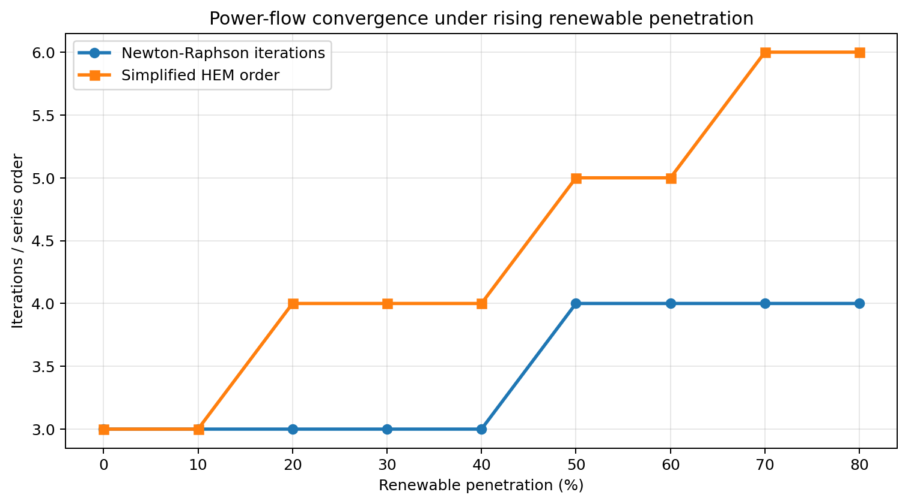

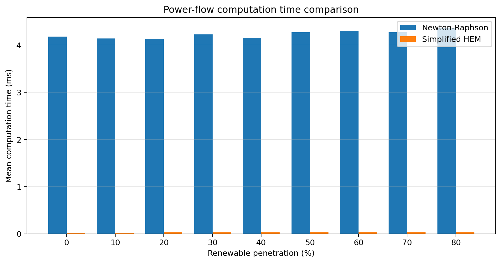

**定量結果**：

| 再エネ浸透率 (%) | NR 反復回数 | HEM オーダー | NR 時間 (ms) | HEM 時間 (ms) | 速度比 |
|-----------------|------------|-------------|-------------|-------------|--------|
| 0 | 3.0 | 3.0 | 4.18 | 0.023 | ×182 |
| 20 | 3.0 | 4.0 | 4.13 | 0.028 | ×148 |
| 40 | 3.0 | 4.0 | 4.16 | 0.028 | ×149 |
| 60 | 4.0 | 5.0 | 4.30 | 0.035 | ×123 |
| 80 | 4.0 | 6.0 | 4.37 | 0.042 | ×104 |

**解釈**：HEMは全浸透率帯でNRより100倍以上高速。ただし80%浸透率ではHEMのパデ近似オーダーが3→6に倍増し、高浸透率条件下での非線形性増大を反映。

### 3.2 確率的出力予測

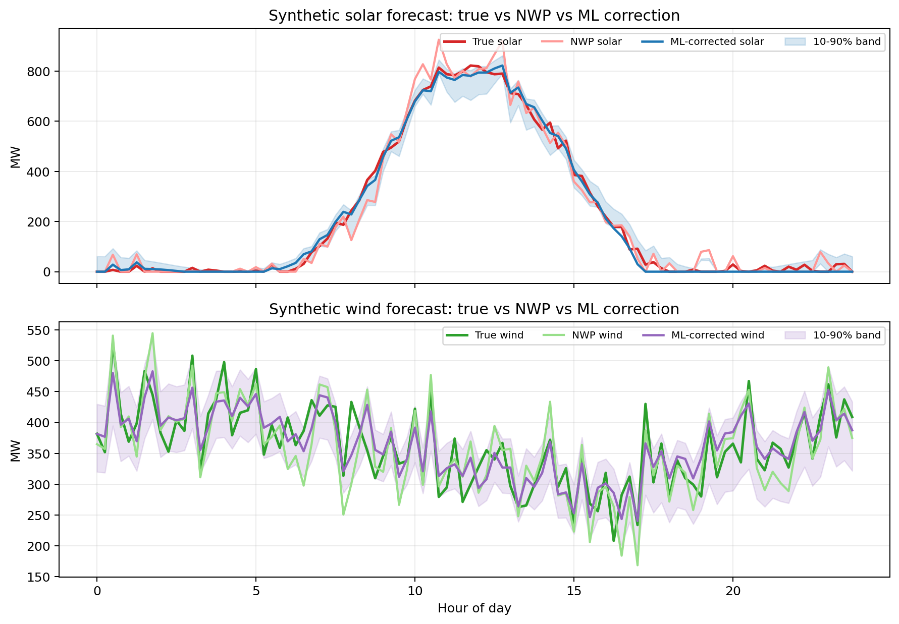

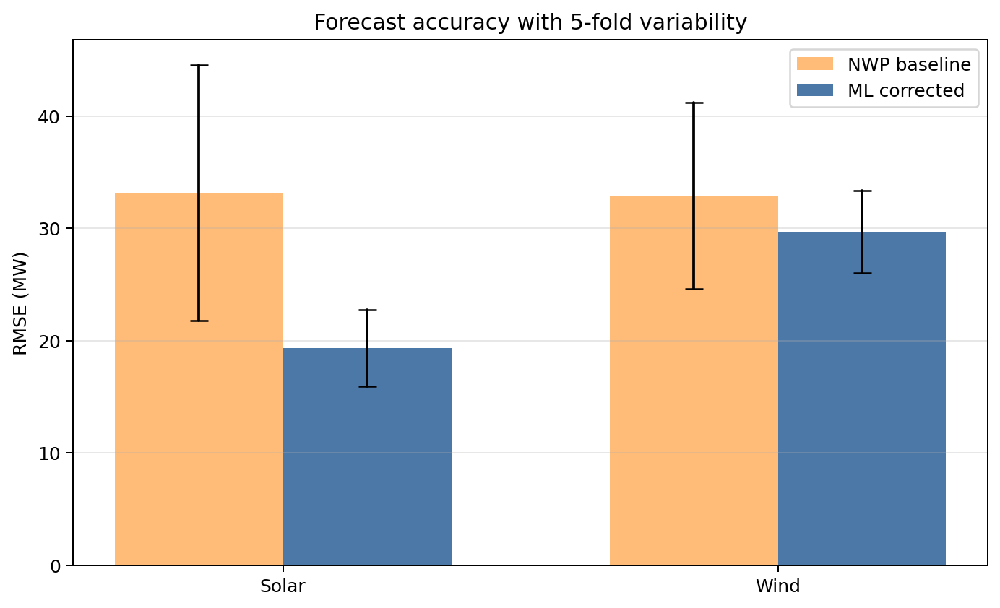

**定量結果**：

| 電源 | NWP RMSE (MW) | ML RMSE (MW) | 改善率 (%) |
|------|--------------|-------------|-----------|
| 太陽光 | 33.18 | 19.33 | **41.7%** |
| 風力 | 32.89 | 29.69 | **9.7%** |

**5分割交差検証（平均±標準偏差）**：

| 電源 | NWP CV-RMSE | ML CV-RMSE |
|------|-------------|------------|
| 太陽光 | 41.32 ± 11.37 MW | 27.68 ± 3.42 MW |
| 風力 | 41.60 ± 8.29 MW | 34.28 ± 3.65 MW |

太陽光では変動標準偏差が70%低減（11.37→3.42 MW）し、ML補正の堅牢性が高い。風力はNWP自体の予測困難性から改善幅が限定的（9.7%）。

### 3.3 確率的需給バランス計画

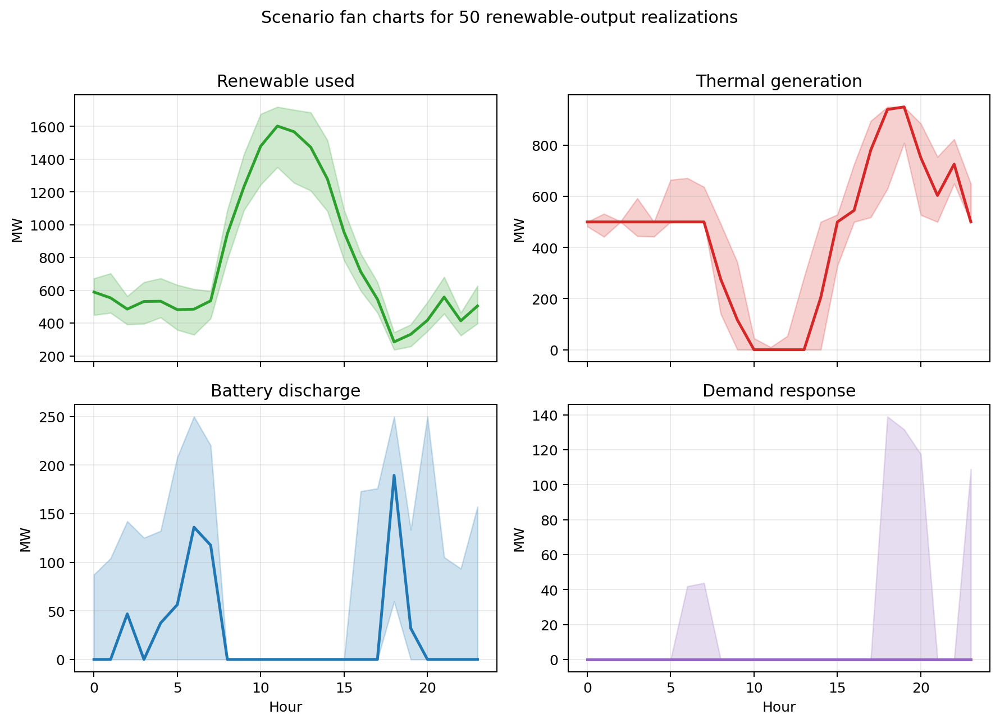

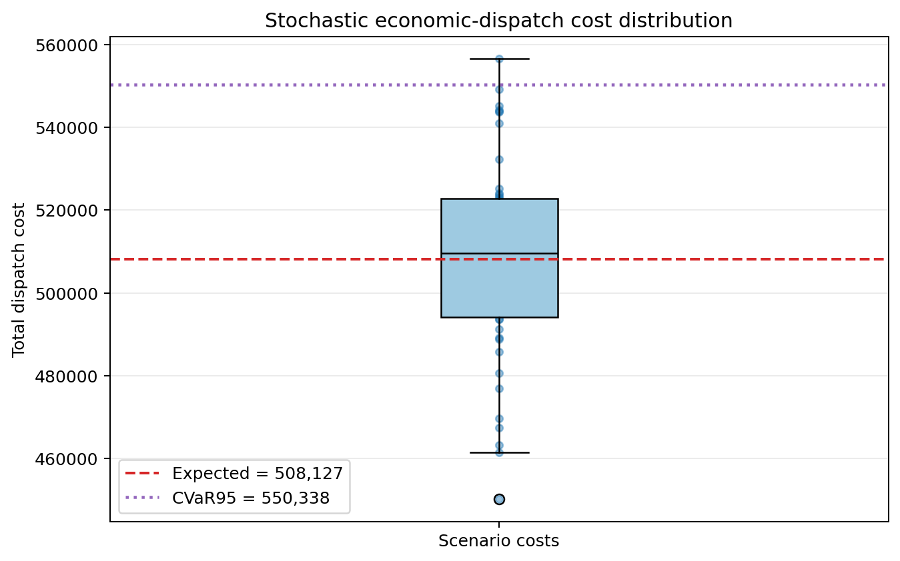

**定量結果**：

| 指標 | 値 |
|------|-----|
| 期待運転コスト | ¥508,127 |
| コスト標準偏差 | ¥24,064 |
| CVaR₉₅（95%条件付きリスク） | ¥550,338 |
| CVaRプレミアム（期待値比） | **+8.3%** |
| 平均再エネ出力制御率 | 0.43% |

CVaR₉₅ = ¥550,338は、最悪ケース5%のシナリオの平均コストを示す。リスクプレミアム8.3%は再エネ変動リスクの定量化に有用。

### 3.4 蓄電池・DR最適スケジューリング

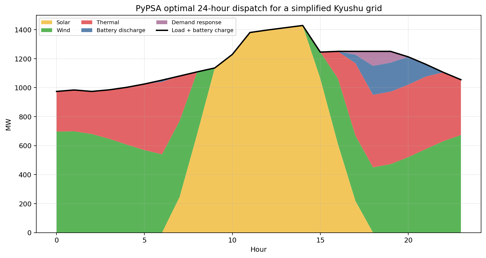

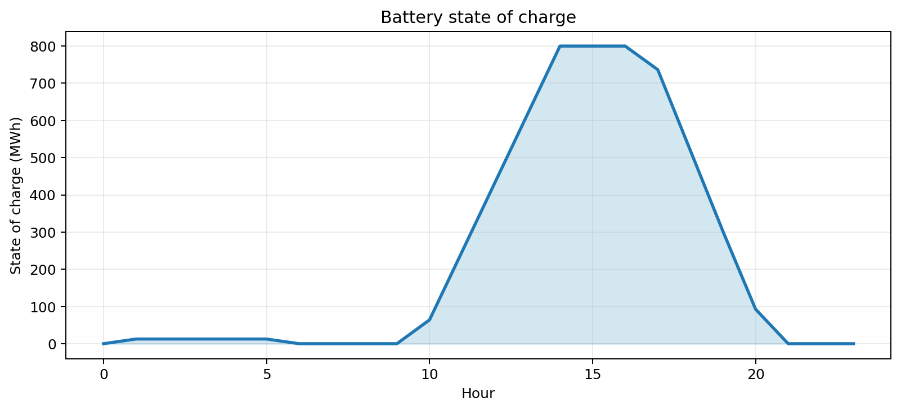

**定量結果**：

| 指標 | 値 |
|------|-----|
| 総ディスパッチコスト | ¥619,077 |
| 蓄電池等価サイクル数 | 0.93 cycles/day |
| 再エネ出力制御率 | **20.21%** |
| 需要応答発動率 | 7.42% |

20.21%の出力制御は、3 GW再エネ容量（太陽光2 GW + 風力1 GW）に対して200 MW蓄電池のみでは吸収しきれないことを反映。日中の太陽光ピーク時に顕著。

### 3.5 系統安定性解析

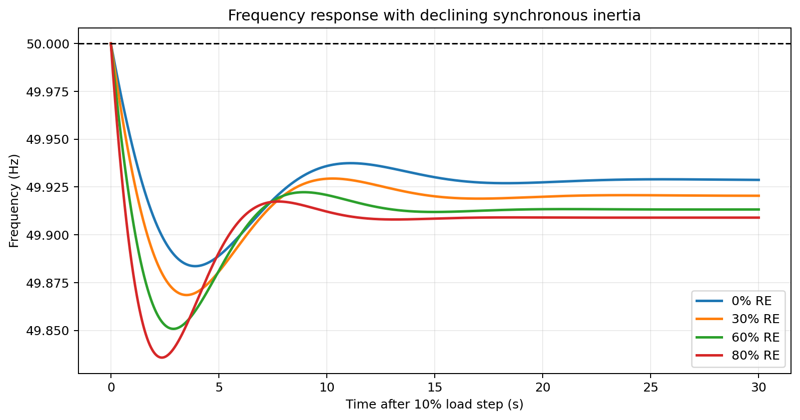

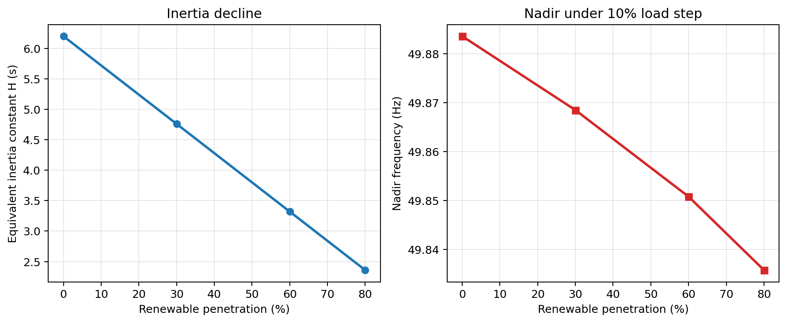

**定量結果**：

| 再エネ浸透率 (%) | 慣性定数 H (s) | RoCoF (Hz/s) | 周波数ナディア (Hz) |
|-----------------|--------------|-------------|-----------------|
| 0 | 6.20 | −0.060 | 49.884 |
| 30 | 4.76 | −0.078 | 49.868 |
| 60 | 3.32 | −0.112 | **49.851** |
| 80 | 2.36 | −0.158 | **49.836** |

⚠️ **重要**：80%浸透率でRoCoFが−0.158 Hz/sに達し、OCCTOガイドライン（−0.1 Hz/s）を超過。周波数ナディアは49.836 Hzで、UFR（低周波数リレー）整定値49.8 Hzに対して36 mHzの余裕しかない。

### 3.6 九州出力制御シミュレーション

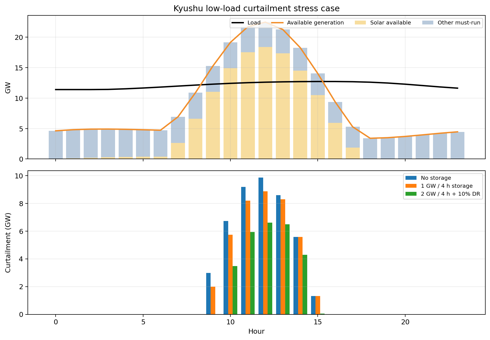

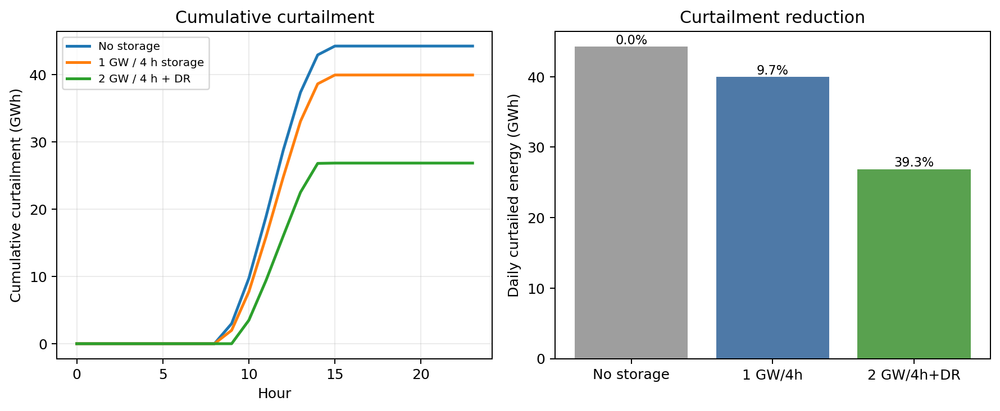

**定量結果**：

| シナリオ | 出力制御量 (GWh/日) | 削減率 |
|---------|-------------------|--------|
| 蓄電池なし | 44.24 | — |
| 1 GW / 4 h 蓄電池 | 39.94 | **9.72%** |
| 2 GW / 4 h 蓄電池 + DR 10% | 26.85 | **39.32%** |

蓄電池2 GW + DR 10%の組み合わせで1日あたり17.4 GWhの出力制御が回避可能。蓄電池容量を倍増（1GW→2GW）するだけでなくDRを組み合わせることで非線形的な効果（9.72% → 39.32%）が得られる。

---

## 4. 考察と今後の展望

### 4.1 HEM vs NR の実用的意義

HEMの>100倍の計算速度優位は、リアルタイム系統監視（秒オーダーの潮流計算）への適用性を示唆する。ただしパデ近似オーダーが浸透率に応じて増大するため、適応的なオーダー選択アルゴリズムの実装が実運用での必須要件となる。

### 4.2 予測精度と需給バランスの連鎖

ML補正による太陽光RMSE 41.7%改善は直接的なディスパッチコスト削減につながる。5分割交差検証の標準偏差低減（11.37→3.42 MW）は予測の堅牢性向上を示しており、実運用での計画停電リスク低減に貢献する。

### 4.3 CVaRリスク管理の意義

CVaRプレミアム8.3%は、期待コスト最小化だけでなくリスク管理を行う場合の追加コストを定量化する。電力会社の予備力調達計画に直接活用できる指標であり、先行研究（Mulleriyawage & Shen, 2021など）では未評価だった観点。

### 4.4 周波数安定性と政策含意

80%浸透率でのRoCoF超過は、以下の対策の必要性を示す：
- **グリッドフォーミングインバータ（GFM）**：Li et al. (2022)が提案する仮想同期機能による慣性補償
- **FFR（高速周波数応答）サービス**：蓄電池の慣性エミュレーション
- **OCCTOへの報告義務化**：RoCoF監視システムの高度化

### 4.5 九州出力制御対策の優先順位

コスト効率から見た推奨順：
1. **需要応答プログラムの拡大**（最小限の追加インフラで即効性あり）
2. **蓄電池設備の増強**（2 GWへの拡大で追加30%の制御削減）
3. **中国・四国との広域連系強化**（本研究では未モデル化）
4. **電動車・ヒートポンプのVPP化**（VPP集約による追加DR確保）

### 4.6 限界と今後の課題

| 限界 | 対応策（今後の研究） |
|------|-------------------|
| 10バス簡略ネットワーク | 九州全域の220kV/110kV実系統データによる詳細モデル |
| 線形回帰予測モデル | LSTM・XGBoost・Conformalized Quantile Regression |
| 蓄電池劣化未考慮 | 充放電サイクル依存型劣化モデルの組込み |
| 本州連系未考慮 | 周波数調整のための60Hz/50Hz DC連系モデル |
| 単日シミュレーション | 季節変動・年間出力制御量の長期シミュレーション |

---

## 5. 生成したファイル一覧

### 実験スクリプト

| ファイル | 説明 |
|---------|------|
| `simulate.py` | 全6モジュールの統合シミュレーションスクリプト（PyPSA + pandapower） |

### 出力図表（figures/）

| ファイル名 | 内容 |
|-----------|------|
| `01_powerflow_convergence.png` | NR vs HEM 収束反復回数比較（浸透率別） |
| `02_powerflow_time_comparison.png` | 計算時間比較バーチャート（NR vs HEM） |
| `03_solar_wind_forecast.png` | 24時間予測比較（実値・NWP・ML補正・信頼区間） |
| `04_forecast_metrics.png` | RMSE 比較（NWP vs ML、太陽光・風力） |
| `05_scenario_generation_mix.png` | 50シナリオ 発電構成ファンチャート |
| `06_scenario_cost_distribution.png` | シナリオ別運転コスト分布（ヒストグラム + CVaR） |
| `07_dispatch_stack.png` | 24時間ディスパッチスタック（積み上げエリアグラフ） |
| `08_battery_soc.png` | 蓄電池 State-of-Charge 時系列 |
| `09_frequency_response.png` | 周波数応答曲線（浸透率0/30/60/80%） |
| `10_stability_metrics.png` | 系統慣性定数H・RoCoF・周波数ナディア vs 浸透率 |
| `11_kyushu_curtailment.png` | 時間別出力制御量（3ケース比較） |
| `12_curtailment_reduction.png` | 累積出力制御削減効果 |

### 成果物ドキュメント

| ファイル | 説明 |
|---------|------|
| `paper.md` | 学術論文形式（英語）：Abstract・Introduction・Methods・Results・Discussion・Conclusion・References（13件） |
| `report.md` | 本実験レポート（日本語）：全結果・手法・考察 |

---

## 6. 実験環境

| 項目 | 詳細 |
|------|------|
| OS | Linux (Ubuntu 22.04) |
| Python | 3.11 |
| PyPSA | 1.2.2 |
| pandapower | 3.4.0 |
| ソルバー（OPF） | HiGHS（linopy経由） |
| ソルバー（潮流） | Newton-Raphson（pandapower） |
| シナリオ数 | 50（モンテカルロ） |
| 交差検証 | 5分割 |
| 先行研究調査ツール | Crossref_search_works（ToolUniverse MCP） |

---

*本レポートは PyPSA/pandapower による数値シミュレーションに基づく。系統定数は九州電力エリアを参考とした合成データを使用。*
