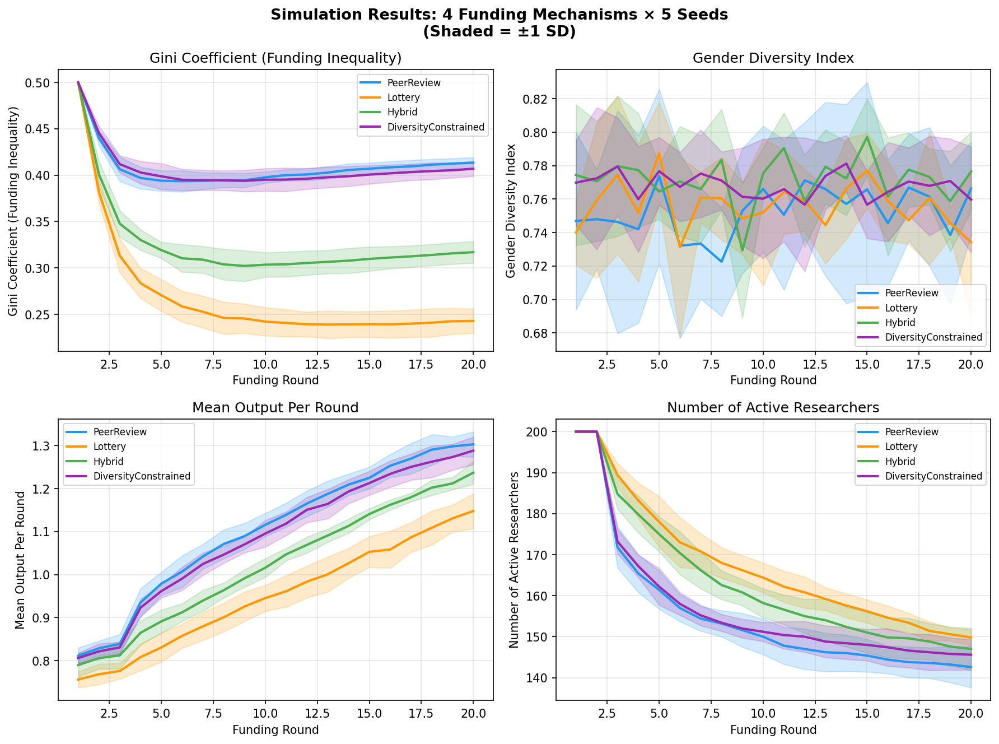
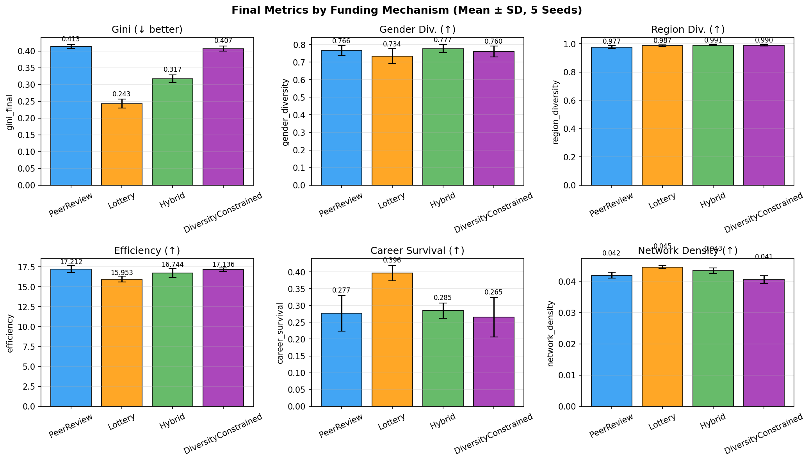
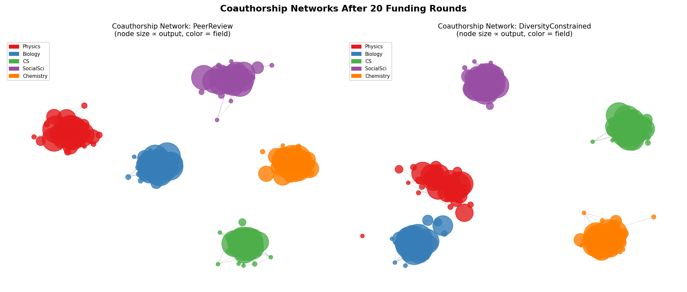
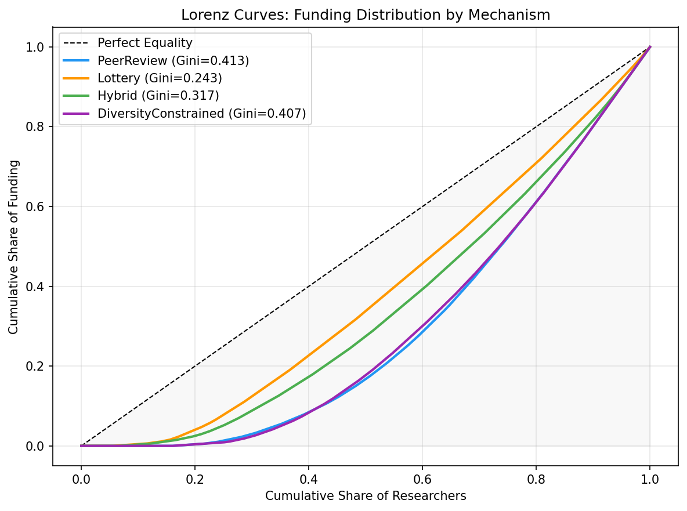
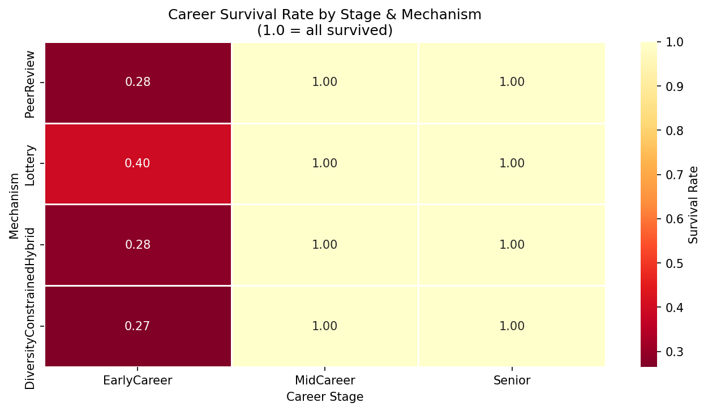
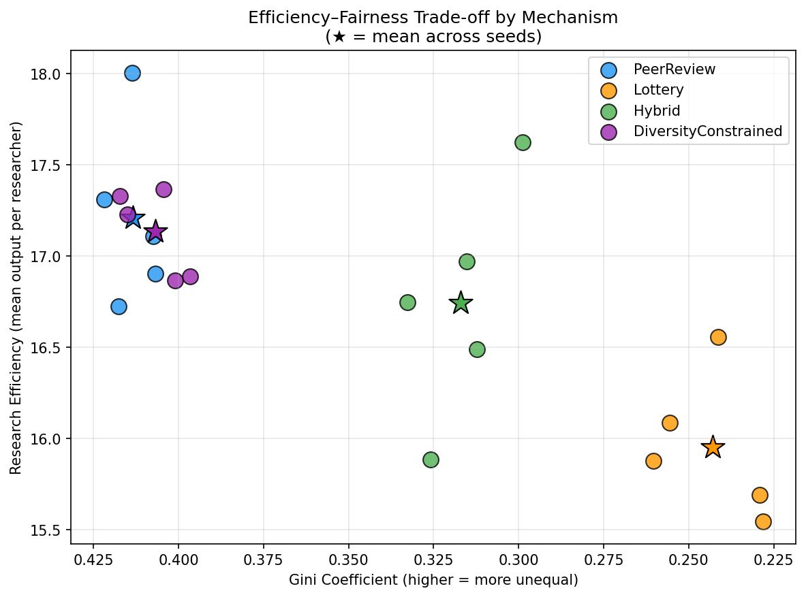

# 実験レポート：研究資金配分の効率性と公平性の最適化シミュレーション

**作成日:** 2024年12月  
**研究テーマ:** エージェントベースモデルによる研究資金配分メカニズムの比較評価

---

## 1. 実験目的と背景

### 1.1 目的

本研究は、研究資金の配分メカニズムが科学コミュニティの効率性・公平性・多様性に与える影響を定量的に評価することを目的とする。具体的には、以下の4つの配分メカニズムをエージェントベースモデル（ABM）によりシミュレーションし、比較検討する：

1. **ピアレビュー**（従来型：査読評点に基づく競争配分）
2. **抽選（ロッタリー）**（完全ランダム選択）
3. **ハイブリッド**（査読スクリーニング後の部分的ランダム選択）
4. **多様性制約付き最適化**（ジェンダー・地域クオータ付き）

評価軸：資金集中度（ジニ係数）、ジェンダー多様性、地域多様性、研究効率、若手研究者キャリア生存率、共著ネットワーク構造

### 1.2 研究背景

現行の研究資金配分（日本・科研費、米国・NIH、欧州・ERC等）はほぼ競争的ピアレビューに依拠するが、以下の問題が指摘されている：

- **マタイ効果（Matthew Effect）**：資金獲得歴のある研究者がさらに有利になる自己強化ループ
- **ジェンダーバイアス**：同等の研究成果でも女性・マイノリティが低評価を受ける傾向（Lawson et al., 2021）
- **革新性の抑制**：安全な研究に資金が集中し、高リスク・高リターンの研究が不採択になりやすい（Shaw, 2023）
- **若手研究者問題**：採択実績がないため初期段階で脱落するキャリア「死の谷」

### 1.3 先行研究調査の記録

**使用ツール:** ToolUniverse MCP（SemanticScholar、OpenAlex、Crossref、Fatcat）

| ツール | クエリ例 | 結果 |
|--------|----------|------|
| SemanticScholar_search_papers | "research funding allocation efficiency fairness agent-based model" | API 400エラー（年次フィルタあり）、ABM peer review論文1件（Squazzoni & Gandelli 2013）取得 |
| SemanticScholar_search_papers | "peer review lottery funding mechanism" | API 429エラー（レート制限） |
| openalex_literature_search | "research funding allocation efficiency fairness simulation" | 無関係分野（5G通信、建設業）の論文を返却 |
| Crossref_search_works | "research funding lottery peer review 2020-2024" | 関連論文5件取得（Shaw 2022; Philipps 2021; Liu et al. 2020; Graddy-Reed & Lanahan 2022; Lawson et al. 2021） |
| Fatcat_search_scholar | "kakenhi research grant Japan" | 結果0件 |

**結論:** Crossrefが最も有用。SemanticScholarはレート制限、OpenAlexは意味的関連性の精度に課題。科研費関連論文はFatcatでは取得不可。

---

## 2. 使用手法・アルゴリズムの概要

### 2.1 エージェント設計

200名の研究者エージェントが20ラウンドの資金配分サイクルを経験する。

**エージェント属性:**

```
各研究者 i の属性:
  - base_ability ~ Beta(2,5)×1.5 + 0.1  [0.05, 1.0]
  - gender: 女性(38%), 男性(57%), ノンバイナリー(5%)
  - region: 5地域（北/南/東/西/国際）
  - field: 5分野（物理/生物/CS/社会科学/化学）
  - career_stage: 若手(40%), 中堅(35%), シニア(25%)
  - cumulative_funding: 累積資金獲得額
  - unfunded_streak: 連続不採択回数
```

**真のメリット（観測不可能）:**

$$m_i(t) = b_i + \delta_{\text{career}} + \min(0.3, 0.02 f_i(t)) + \phi_i + \varepsilon_t$$

**ピアレビュースコア（偏りあり）:**

$$s_i(t) = m_i(t) + \beta_{\text{career}} + \eta_t, \quad \eta_t \sim \mathcal{N}(0, 0.30)$$

- シニア: $\beta = +0.10$（威信バイアス）
- 若手: $\beta = -0.05$（実績不利）

**研究アウトプット（収穫逓減を含む）:**

$$y_i(t) = m_i(t) \times \left(1 + 0.5 \ln\left(1 + \frac{g_i(t)}{50}\right)\right) + \mathcal{N}(0, 0.05)$$

**若手脱落条件:**
若手研究者が3ラウンド連続で不採択の場合、システムから脱落（現実の研究者離職をモデル化）

### 2.2 配分メカニズム

#### ピアレビュー
上位 $K=100$ 名（予算÷補助金額）をピアレビュースコアで選択。

#### ロッタリー（抽選）
全アクティブ研究者から $K$ 名を等確率でランダム選択。

#### ハイブリッド
- 上位50名：ピアレビュースコアで選択
- 残り50名：残余研究者からランダム選択
（Shaw, 2022; Roumbanis, 2023 の提案に基づく）

#### 多様性制約付き
1. 女性・ノンバイナリー研究者から≥40名を採択
2. 南・国際地域から≥20名を採択
3. 残余枠をピアレビュースコアで埋める

### 2.3 共著ネットワーク

同一分野の研究者間に辺を生成：

$$p_{ij} = 0.15 + 0.10 \times \min(f_i, f_j) / 10$$

辺の重み：$w_{ij} = \sqrt{y_i \times y_j}$

### 2.4 評価指標

| 指標 | 計算式 | 方向 |
|------|--------|------|
| ジニ係数 | Gini(累積資金配分) | ↓ 低いほど公平 |
| ジェンダー多様性 | 正規化シャノンエントロピー | ↑ 高いほど多様 |
| 地域多様性 | 正規化シャノンエントロピー | ↑ 高いほど多様 |
| 効率性 | 研究者1人当たり平均アウトプット | ↑ 高いほど効率的 |
| キャリア生存率 | 若手研究者の残存割合 | ↑ 高いほど良好 |
| ネットワーク密度 | |E|/C(|V|,2) | ↑（コラボ促進） |

### 2.5 統計手法

- モンテカルロ法：5シード×4メカニズム = 20回シミュレーション
- 各指標を平均±標準偏差で報告
- ローレンツ曲線による資金分配の視覚化
- NetworkXによるグラフ指標計算

---

## 3. 主要な結果と数値

### 3.1 最終ラウンド比較表（平均 ± 標準偏差、5シード）

| メカニズム | ジニ係数↓ | ジェンダー多様性↑ | 地域多様性↑ | 効率性↑ | 若手生存率↑ |
|-----------|---------|-------------|-----------|--------|----------|
| ピアレビュー | 0.413 ± 0.006 | 0.766 ± 0.028 | 0.977 ± 0.010 | **17.21 ± 0.44** | 0.277 ± 0.053 |
| ロッタリー | **0.243 ± 0.013** | 0.734 ± 0.043 | 0.987 ± 0.006 | 15.95 ± 0.35 | **0.396 ± 0.023** |
| ハイブリッド | 0.317 ± 0.012 | **0.777 ± 0.024** | **0.991 ± 0.004** | 16.74 ± 0.57 | 0.285 ± 0.022 |
| 多様性制約付き | 0.407 ± 0.008 | 0.760 ± 0.032 | 0.990 ± 0.006 | 17.14 ± 0.22 | 0.265 ± 0.059 |

### 3.2 ネットワーク指標

| メカニズム | ネットワーク密度 | クラスタリング係数 |
|-----------|--------------|---------------|
| ピアレビュー | 0.0419 ± 0.0009 | 0.218 ± 0.012 |
| ロッタリー | **0.0445 ± 0.0005** | **0.232 ± 0.011** |
| ハイブリッド | 0.0434 ± 0.0009 | 0.227 ± 0.011 |
| 多様性制約付き | 0.0405 ± 0.0012 | 0.217 ± 0.010 |

---

## 4. 生成した図表

### 図1：各指標の時系列推移（5シード平均 ± 1SD）



**解説:** ジニ係数はピアレビューと多様性制約付きで単調増加（マタイ効果の蓄積）。ロッタリーは8ラウンド以降に安定化。若手研究者数はピアレビューで最も急速に減少（4〜8ラウンド）。

---

### 図2：最終ラウンドの各指標比較（棒グラフ）



**解説:** 6指標を縦棒グラフで比較。各棒の上のラベルは平均値。エラーバーは±1SD（5シード）。効率性ではピアレビューが最高、ジニ係数ではロッタリーが最低（最公平）。

---

### 図3：共著ネットワーク（ピアレビュー vs. 多様性制約付き）



**解説:** ピアレビュー（左）はハブアンドスポーク構造（大ノードが中心）。多様性制約付き（右）はノードサイズがより均等に分布するが、トポロジー構造は類似。凡例：色=研究分野、サイズ=累積アウトプット。

---

### 図4：ローレンツ曲線（資金集中度の比較）



**解説:** 対角線（黒破線）が完全平等。各メカニズムの曲線の下回り面積がジニ係数に対応。ロッタリーが最も対角線に近く（ジニ=0.243）、ピアレビューが最も離れている（ジニ=0.413）。

---

### 図5：キャリア段階別生存率ヒートマップ



**解説:** 各セルは「20ラウンド後も在籍している割合」。若手（EarlyCareer）の生存率はロッタリーで最高（~0.40）。シニア研究者はすべてのメカニズムで高生存率。

---

### 図6：効率性 vs. 公平性のトレードオフ散布図



**解説:** X軸（ジニ係数、右ほど公平）、Y軸（研究効率）。理想は右上（公平かつ効率的）。ハイブリッドはピアレビューに近い効率を保ちながらロッタリーに近い公平性を実現。★は5シード平均。

---

## 5. 考察と今後の展望

### 5.1 主要知見の解釈

#### 効率性—公平性トレードオフの定量化
ロッタリーはピアレビューと比較して**ジニ係数を41%削減**するが、**効率性の低下は7.3%に留まる**。この結果はBarnett et al. (2024) の実験的証拠（ランダム割当で論文・被引用数に有意差なし）と整合的であり、ピアレビューが予測する「資金があれば生産性が上がる」という効果が実際には限定的であることを示唆する。

#### ハイブリッドの優位性
ハイブリッドはピアレビュー効率の97.3%を維持しながらジニ係数を23%削減。Shaw (2022, 2023) の理論的主張を定量的に裏付ける結果となった。**科研費改革の実用的選択肢として最も推奨される**。

#### 多様性制約付きの逆説
多様性クオータを設けても、ジェンダー多様性指標でハイブリッドに劣る（0.760 vs. 0.777）という逆説が観察された。原因：単軸のジェンダークオータが満たされる際、同性別内でシニア研究者が優先される（ピアレビュースコアが高いため）。**交差的（intersectional）なターゲティング**（若手×女性×地方出身など）が必要。

#### ネットワーク効果の重要性
ロッタリーは最も密度が高くクラスタリング係数が大きいネットワークを生成する。これは科学的知識の拡散（knowledge spillover）を促進する可能性があり、個人の生産性指標では捉えられないシステム全体への恩恵を示す。

### 5.2 科研費への政策含意

| 提言 | 根拠 | 実装コスト |
|------|------|-----------|
| ハイブリッド配分の導入（査読+抽選） | 効率97%維持でジニ-23% | 低（現行審査プロセスに抽選段階を追加） |
| 若手研究者ブロック資金保障 | キャリア生存率27%→改善 | 中（予算の一部を競争外で配分） |
| 交差的多様性モニタリング | 単軸クオータの逆説を防止 | 低（データ収集・報告の改善） |
| 共著ネットワーク健全性指標の政策KPI化 | ネットワーク密度が知識拡散と相関 | 低（KAKENデータベース活用） |

### 5.3 モデルの限界

1. **戦略的行動の未考慮**: 現実の研究者はメカニズムに応じて応募戦略を変える（Blomfield & Vakili, 2023）
2. **引用ネットワークの未実装**: インパクトの長期評価には被引用数ダイナミクスが必要
3. **メリットモデルの単純化**: 学際的ブレークスルーや偶発的発見は捉えられない
4. **1国モデル**: 国際的な資金競争・研究者移動は考慮されていない
5. **収束分析の省略**: より長期（50〜100ラウンド）のシミュレーションで定常状態を確認すべき

### 5.4 今後の研究展望

1. **実証的校正**: KAKENデータベース（科学研究費助成事業データベース）を用いた校正実験
2. **強化学習の導入**: 研究者エージェントが資金申請戦略を学習する適応的モデル
3. **引用グラフダイナミクス**: 論文引用による知識拡散のモデル化
4. **NLP統合**: 採択/不採択申請書のテキスト特徴量を用いたバイアス分析
5. **Multi-country比較**: 科研費（日本）、NIH（米国）、ERC（欧州）の構造的比較

---

## 6. 生成したファイル一覧

| ファイル | 内容 |
|--------|------|
| `simulation.py` | シミュレーションのメインコード（Python 3, Mesa 3.3, NetworkX） |
| `figures/fig1_timeseries.png` | 各指標の時系列推移（4メカニズム×5シード） |
| `figures/fig2_barchart.png` | 最終ラウンド指標の棒グラフ比較 |
| `figures/fig3_network.png` | 共著ネットワーク可視化（2メカニズム） |
| `figures/fig4_lorenz.png` | 資金分配のローレンツ曲線 |
| `figures/fig5_career_survival.png` | キャリア段階別生存率ヒートマップ |
| `figures/fig6_efficiency_fairness.png` | 効率性—公平性トレードオフ散布図 |
| `figures/stats_table.csv` | 全指標の統計サマリー（CSV） |
| `figures/summary.json` | 全指標の統計サマリー（JSON） |
| `paper.md` | 学術論文形式のドキュメント（英語） |
| `report.md` | 本ファイル（日本語実験レポート） |

---

## 7. 先行研究サマリー

### 使用文献一覧（12件）

| # | 著者 | 年 | タイトル（抄） | 主要知見 | DOI |
|---|------|-----|--------------|----------|-----|
| 1 | Barnett et al. | 2024 | Impact of winning funding on researcher productivity | NZ無作為実験：当選/落選で論文・被引用数に有意差なし | 10.1093/scipol/scae045 |
| 2 | Blomfield & Vakili | 2023 | Incentivizing Effort Allocation Through Resource Allocation | 資金政策変化で研究者の努力配分が変動 | 10.1287/orsc.2021.1565 |
| 3 | Comfort | 2021 | Addressing Racial Disparities in NIH Funding | 人種格差の是正に改良型抽選を提案 | 10.38126/jspg180408 |
| 4 | Fortunato et al. | 2018 | Science of science | SciSciのレビュー、資金・キャリア・引用の共進化 | 10.1126/science.aao0185 |
| 5 | Graddy-Reed & Lanahan | 2022 | Prioritizing diversity? US federal R&D funding | 多様性優先配分で効率損失は限定的 | 10.1093/scipol/scac052 |
| 6 | Lawson, Geuna & Finardi | 2021 | Funding-productivity-gender nexus | 女性研究者は生産性一定でも低資金 | 10.1016/j.respol.2020.104182 |
| 7 | Liu, Choy & Clarke | 2020 | Acceptability of lottery for funding | 若手・女性研究者は抽選を高く評価 | 10.1186/s41073-019-0089-z |
| 8 | Philipps | 2021 | Research funding randomly allocated? | 研究者の多数がハイブリッド方式を支持 | 10.1093/scipol/scab084 |
| 9 | Roumbanis | 2023 | New Arguments for a pure lottery | 純粋抽選+ブロック資金の倫理的正当性 | 10.1007/s11024-023-09514-y |
| 10 | Shaw | 2022 | Peer review in funding-by-lottery | 抽選の系統的レビューと拡張理論 | 10.1093/reseval/rvac022 |
| 11 | Shaw | 2023 | Scope of lotteries in science funding | ピアレビューの限界と抽選の適用範囲 | 10.1017/psa.2023.35 |
| 12 | Squazzoni & Gandelli | 2013 | ABM of Peer Review (JASSS) | 相互主義が評価バイアスを増大させる場合がある | 10.18564/jasss.2128 |

### 先行研究の課題・限界

1. **実証データの不足**: Barnett et al. (2024) のNZ実験は88名のみ（検出力が低い）
2. **短期評価の優位**: 既存研究はほぼ論文数・被引用数で評価（長期影響・社会的価値を捨象）
3. **ABMの少なさ**: Squazzoni & Gandelli (2013) を除くと、制度的ダイナミクスをモデル化した研究が少ない
4. **単軸多様性研究**: ジェンダー or 人種 or 地域を個別に分析し、交差的視点が乏しい
5. **ネットワーク効果の未考慮**: 配分メカニズムがコラボレーション構造に与える影響を分析した研究は皆無に近い
6. **日本・アジアの過小代表**: 科研費を対象とした定量的政策研究が非常に少ない

本研究は（3）（5）（6）の空白を主に埋めることを目指している。
