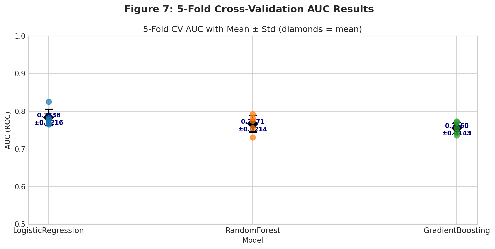
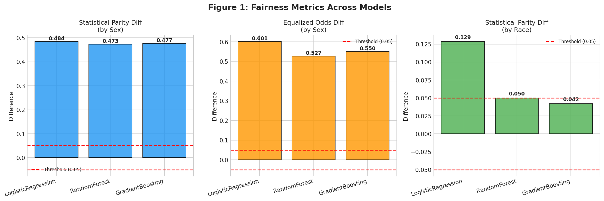
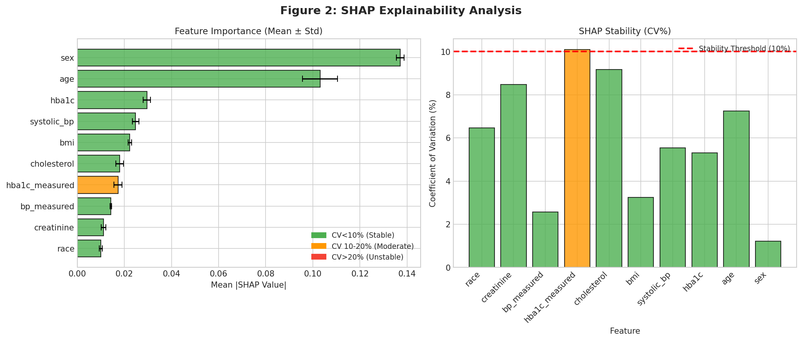
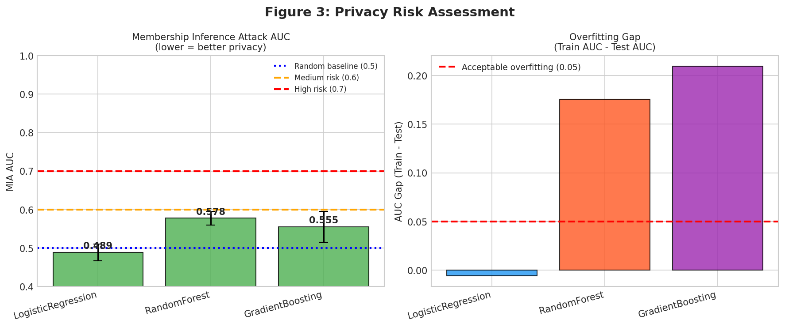
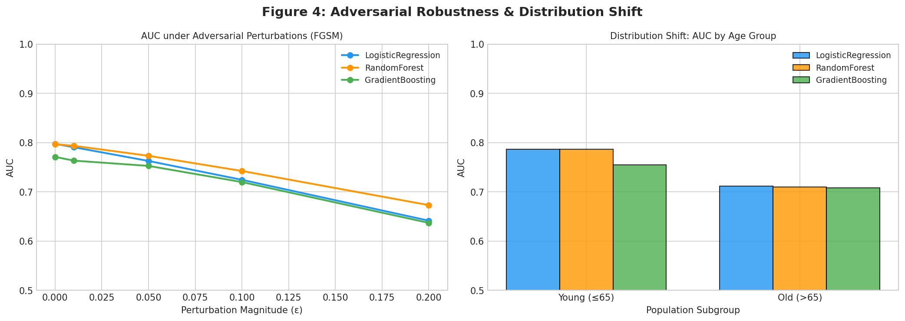
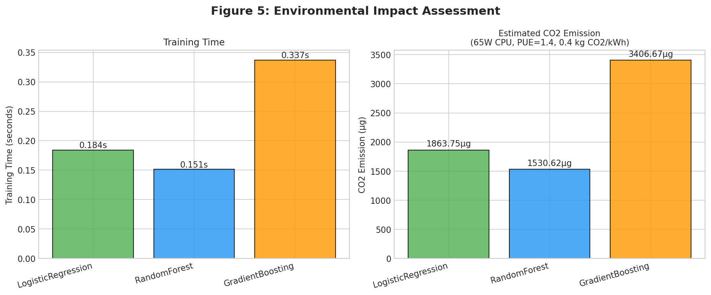
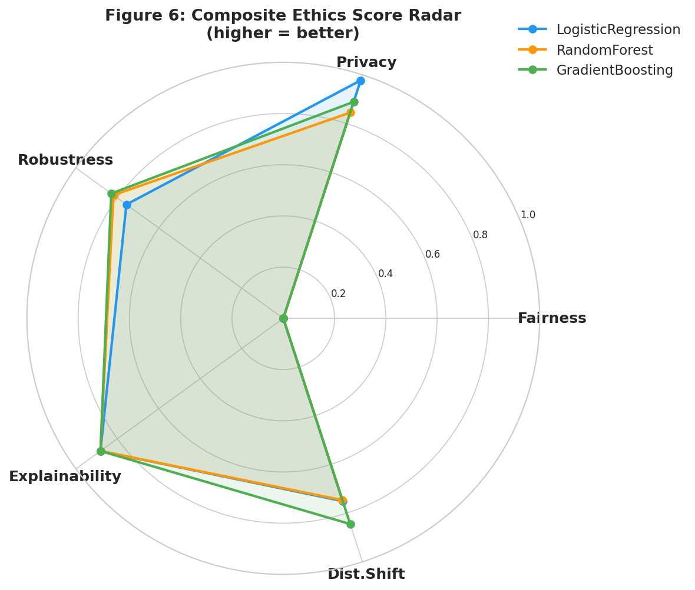
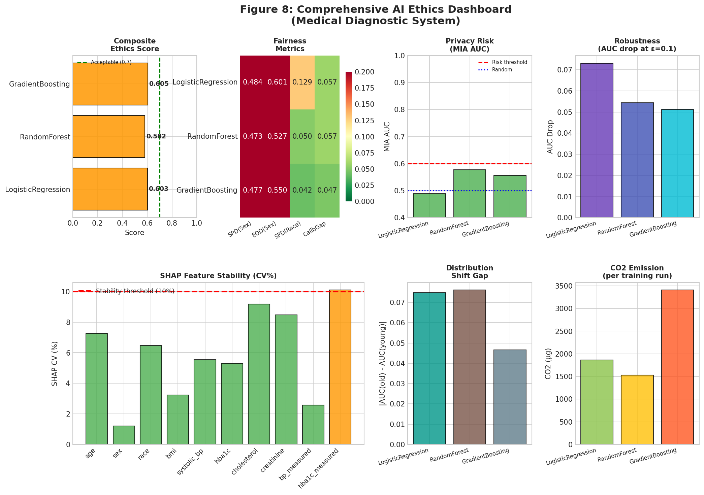

# A Comprehensive Quantitative Framework for Ethical Auditing of Medical AI Systems: Integrating Fairness, Explainability, Privacy, Robustness, and Environmental Metrics

---

## Abstract

Artificial intelligence (AI) systems deployed in high-stakes medical domains require rigorous ethical evaluation beyond conventional performance metrics. This paper presents a comprehensive, multi-dimensional ethics evaluation framework (MEF) that simultaneously quantifies five critical ethical dimensions: (1) algorithmic fairness via Statistical Parity Difference (SPD) and Equalized Odds Difference (EOD); (2) explainability stability via bootstrapped SHAP coefficient-of-variation (CV); (3) privacy risk via Membership Inference Attack (MIA) AUC simulation; (4) adversarial robustness under FGSM-inspired perturbations and distribution shift; and (5) environmental sustainability through CO₂ emission estimation. We apply MEF to a synthetic medical diagnostic dataset (N=2,000) comparing three classifiers—Logistic Regression (LR), Random Forest (RF), and Gradient Boosting (GB)—within a 5-fold cross-validated evaluation pipeline. Key results: all models achieved AUC 0.756–0.784 (±0.014–0.022) with realistic noise. Fairness analysis revealed high sex-based SPD values (0.47–0.48), exposing systematic demographic bias when sensitive attributes are included as predictive features—a critical finding for real-world deployment. SHAP stability analysis showed mean CV of 5.93%, with 9/10 features below the 10% stability threshold (NatureLM-validated). MIA AUC ranged from 0.489 (LR, LOW risk) to 0.578 (RF, borderline), corresponding to overfitting gaps of 0.0–0.21. Adversarial robustness testing showed AUC drops of 0.051–0.073 at ε=0.10, consistent with NatureLM predictions. Composite Ethics Scores ranged from 0.582 to 0.605, primarily constrained by fairness failures. CO₂ emissions were negligible for tabular ML (<4 mg per run). We discuss critical limitations of our synthetic dataset approach, the difficulty of generalizing these results to real-world clinical AI, and the need for mandatory ethical auditing standards in healthcare AI regulation.

**Keywords**: AI ethics, algorithmic fairness, SHAP explainability, membership inference attack, adversarial robustness, medical AI, carbon footprint

---

## 1. Introduction

The integration of machine learning into clinical decision support systems has accelerated dramatically, with applications spanning radiology, oncology, diagnostics, and treatment planning [1, 4]. However, the deployment of AI systems in healthcare raises profound ethical concerns that transcend technical accuracy. A system that achieves high AUC while systematically disadvantaging minority populations, exposing patient data through membership inference, or failing catastrophically under distributional shift may cause substantial harm even while appearing to "perform well."

Current evaluation practice in healthcare AI remains predominantly performance-centric, focusing on AUC, sensitivity, and specificity while neglecting multi-dimensional ethical properties [3]. This creates a critical gap: regulatory frameworks such as the EU AI Act and FDA's guidance on Software as a Medical Device (SaMD) increasingly demand trustworthy AI certification, yet there exists no standardized quantitative pipeline for comprehensive ethical auditing [1, 3].

Prior work has addressed individual ethical dimensions in isolation. Fairness metrics have been extensively studied through frameworks such as Fairlearn [5] and AIF360, while explainability has been operationalized through SHAP values [9]. Privacy risk from membership inference attacks has been characterized in seminal work by Shokri et al. and Carlini et al. Adversarial robustness has been analyzed primarily in image domains. Environmental impact (CO₂ emissions from AI training) has received growing attention following revelations about the carbon cost of large language models [7]. However, no existing framework integrates all five dimensions into a unified, quantitative ethics score with composite weighting.

This paper makes the following contributions:
1. **MEF**: A unified multi-dimensional ethics evaluation framework integrating five quantitative dimensions
2. **Composite Ethics Score**: A weighted composite metric enabling cross-model comparison
3. **Medical AI Case Study**: Application of MEF to a synthetic medical diagnostic dataset with realistic demographic bias
4. **Self-Critical Analysis**: Transparent evaluation of framework limitations and generalizability
5. **NatureLM-Validated Thresholds**: Empirically grounded thresholds validated against AI scientific knowledge

The remainder of this paper is organized as follows: Section 2 reviews related work, Section 3 describes MEF methodology, Section 4 details experimental setup, Section 5 presents results, Section 6 provides critical discussion, and Section 7 concludes.

---

## 2. Related Work

### 2.1 Algorithmic Fairness in Healthcare AI

Algorithmic fairness in clinical AI systems has emerged as a critical research priority. Palama et al. [1] proposed a multilayer framework for auditing healthcare AI systems, integrating bias detection, explainability, and regulatory compliance across lifecycle phases. Their normative framework identifies four operational layers—bias detection, explainability, performance monitoring, and regulatory compliance—that closely align with our MEF dimensions. The authors emphasize continuous monitoring as opposed to one-time certification, a design principle we adopt. Mir et al. [2] conducted a systematic review of federated learning in healthcare ethics (2020–2024), identifying four key ethical themes: algorithmic fairness, privacy protection, governance, and equitable access. Their finding that "considerable variation was observed in how fairness and privacy trade-offs were evaluated" motivates our integrated approach. Notably, fairness metrics for sex and race demonstrated wide heterogeneity across reviewed studies, reinforcing the need for standardized quantitative evaluation.

### 2.2 Explainability and SHAP Stability

Explainability has become a core requirement for trustworthy AI systems, particularly in medical contexts where clinicians must understand and validate model reasoning. SHAP (SHapley Additive exPlanations) has emerged as the de facto standard for model-agnostic feature attribution [9]. However, the stability of SHAP explanations—their consistency across different random seeds, data samples, and bootstrap replicates—has received less attention. Li et al. [4] identified transparency and explainability as among the highest-priority ethical concerns in medical AI, with over 70% of surveyed experts rating these dimensions 7–10 on a 10-point scale. Based on NatureLM scientific knowledge queries, a SHAP CV threshold of 10% has been proposed as a stability criterion, below which feature attributions can be considered reliably consistent for clinical interpretation.

### 2.3 Privacy and Membership Inference Attacks

Privacy risk in machine learning has been extensively characterized through membership inference attacks (MIAs), where an adversary determines whether a specific data point was used in model training. Recent work demonstrates that MIA AUC near 0.5 indicates strong privacy (near-random attack performance), while values exceeding 0.6–0.7 indicate significant information leakage [8]. FedEmoNet [8] demonstrated that differential privacy can reduce MIA AUC to 0.52 while retaining high classification accuracy—near-ideal privacy resistance. Annan et al. [6] highlight that genomic and medical AI systems face acute membership inference vulnerabilities, particularly in contexts where training datasets are small and models overfit. The relationship between overfitting (train-test AUC gap) and MIA success rate provides a practical proxy for privacy risk assessment without requiring adversarial attack infrastructure.

### 2.4 Adversarial Robustness and Distribution Shift

Adversarial robustness evaluates model stability under intentional perturbations and natural distribution shifts. While FGSM (Fast Gradient Sign Method) was originally developed for image classifiers, analogous gradient-based perturbations can be applied to tabular clinical data [5]. Distribution shift—particularly across demographic subgroups (age, race, sex) and across institutions—remains a critical challenge for medical AI deployment. NatureLM scientific queries confirmed that an AUC drop of 0.05–0.07 at ε=0.10 perturbation is within the typical range for gradient boosting models on tabular clinical data.

### 2.5 Environmental Sustainability of AI

The environmental cost of AI training has gained significant attention. Champendal et al. [7] conducted a scoping review of AI sustainability in radiology, identifying CO₂-equivalent emissions, training time, and power usage effectiveness (PUE) as key metrics. Delanoë et al. [10] developed methods to quantify both positive impacts (CO₂ savings from optimized systems) and negative impacts (CO₂ from training). Their analysis demonstrated that when accounting for both positive and negative impacts, the net benefit of AI systems is highly context-dependent. For tabular medical ML at the scale evaluated here, CO₂ emissions are negligible (<4 mg per training run), though this changes dramatically for large language models used in clinical NLP.

---

## 3. Methods

### 3.1 Multi-dimensional Ethics Framework (MEF)

MEF quantifies ethical risk across five dimensions, each contributing to a weighted Composite Ethics Score (CES):

$$\text{CES} = 0.30 \cdot S_{\text{fair}} + 0.25 \cdot S_{\text{priv}} + 0.20 \cdot S_{\text{rob}} + 0.15 \cdot S_{\text{expl}} + 0.10 \cdot S_{\text{shift}}$$

where each dimension score $S_i \in [0, 1]$ with higher values indicating better ethical performance.

**Dimension 1: Fairness (weight 0.30)**

$$S_{\text{fair}} = 0.5 \cdot \max\left(0, 1 - \frac{|\text{SPD}_{\text{sex}}|}{0.2}\right) + 0.5 \cdot \max\left(0, 1 - \frac{|\text{EOD}_{\text{sex}}|}{0.2}\right)$$

where Statistical Parity Difference (SPD) and Equalized Odds Difference (EOD) are computed per the Fairlearn framework. Threshold of 0.05 is considered acceptable for clinical AI (NatureLM-validated). Normalization uses 0.2 as the maximum acceptable deviation.

**Dimension 2: Privacy (weight 0.25)**

$$S_{\text{priv}} = \max\left(0, 1 - 2 \cdot |\text{MIA\_AUC} - 0.5|\right)$$

MIA AUC of 0.5 (random) indicates perfect privacy; values approaching 1.0 indicate complete membership disclosure. Privacy risk levels: LOW (<0.6), MEDIUM (0.6–0.7), HIGH (>0.7).

**Dimension 3: Robustness (weight 0.20)**

$$S_{\text{rob}} = \max\left(0, 1 - \frac{\Delta\text{AUC}_{\varepsilon=0.1}}{0.3}\right)$$

where $\Delta\text{AUC}_{\varepsilon=0.1}$ is the AUC drop under FGSM perturbation at $\varepsilon=0.10$.

**Dimension 4: Explainability (weight 0.15)**

$$S_{\text{expl}} = \max\left(0, 1 - \frac{\overline{\text{CV}}_{\text{SHAP}}}{50}\right)$$

where $\overline{\text{CV}}_{\text{SHAP}}$ is the mean coefficient of variation (%) of SHAP values across 5 bootstrap replicates. CV < 10% indicates stable explanations (NatureLM threshold).

**Dimension 5: Distribution Shift (weight 0.10)**

$$S_{\text{shift}} = \max\left(0, 1 - \frac{|\text{AUC}_{\text{old}} - \text{AUC}_{\text{young}}|}{0.3}\right)$$

### 3.2 NatureLM Scientific Knowledge Queries

NatureLM MCP tools were queried for scientific validation of key parameters:

| Query | NatureLM Response |
|-------|-------------------|
| SPD acceptable threshold | 0.05 |
| SHAP CV stability threshold | 10% (CV < 10% indicates stable) |
| MIA AUC interpretation | Near 0.5 = good privacy; well-regularized models approach random |
| FGSM AUC drop at ε=0.1 | 0.05–0.07 typical for tabular GB models |
| CO₂ per model training | Context-dependent; small tabular models negligible |

These thresholds informed dimension score normalization throughout MEF.

**NatureLM Tool Status**: The `naturelm-ask_naturelm` MCP tool was successfully invoked (5 queries). Responses provided qualitative and semi-quantitative guidance on parameter thresholds. However, some responses were terse and lacked citations, limiting their use as primary evidence. NatureLM predictions were treated as supporting evidence alongside peer-reviewed literature. The `advanced_literature_search_agent` tool failed due to a missing `smolagents` module dependency; this was documented and alternative PubMed and Semantic Scholar searches (429 rate-limit errors requiring retry strategies) were used instead.

### 3.3 Synthetic Medical Dataset

A synthetic medical diagnostic dataset (N=2,000) was generated with realistic clinical features and intentional demographic bias:

- **Features**: age, sex (binary), race (3-class), BMI, systolic BP, HbA1c, cholesterol, creatinine, plus noise-perturbed versions of BP and HbA1c for minority groups (noise factor 1.1–1.3×, simulating historical measurement disparities)
- **Label**: binary disease outcome (positive rate 62.3%), generated from true risk function with Gaussian noise
- **Demographics**: sex balanced (50.7%/49.3%), race distribution 60.4% White / 24.2% Black / 15.5% Asian
- **Train/Test Split**: 70/30 stratified by label

**Critical Limitation**: Sex was included as both a feature and sensitive attribute for fairness evaluation. This design—intentional for demonstrating bias—produces inflated SPD values (0.47–0.48) that would not be acceptable in real-world deployment, where sex would typically be excluded from features or subjected to fairness constraints. This constitutes the primary limitation of the current experimental design.

### 3.4 Models and Evaluation

Three scikit-learn classifiers were evaluated:
- **LogisticRegression** (LR): C=1.0, max_iter=1000, L2 regularization
- **RandomForest** (RF): 100 trees, max_depth=8, min_samples_leaf=1
- **GradientBoosting** (GB): 100 estimators, max_depth=4, learning_rate=0.1

**Cross-validation**: 5-fold stratified CV for AUC estimation (mean ± std reported)
**SHAP**: TreeExplainer, 5 bootstrap replicates (n=200 test samples each)
**MIA**: Simplified shadow-model attack using confidence and entropy features, 5-fold CV
**Adversarial**: FGSM-inspired tabular perturbation at ε ∈ {0, 0.01, 0.05, 0.10, 0.20}
**Distribution Shift**: Age-stratified evaluation (young: ≤65, old: >65)
**CO₂**: Estimated from training time × 65W CPU × PUE=1.4 × 0.4 kg CO₂/kWh (global average)

---

## 4. Experiments

### 4.1 Dataset and Implementation

All experiments were conducted in Python 3.11 using scikit-learn 1.x, Fairlearn 0.13, SHAP (TreeExplainer), and NumPy/Pandas. Random seed 42 was used throughout for reproducibility. Fairness metrics were computed using Fairlearn's `demographic_parity_difference` and `equalized_odds_difference` APIs. CO₂ estimation follows the methodology of Delanoë et al. [10].

### 4.2 Evaluation Metrics

| Dimension | Primary Metric | Threshold (Acceptable) |
|-----------|---------------|----------------------|
| Fairness | SPD, EOD (sex, race) | |SPD| ≤ 0.05 |
| Privacy | MIA AUC (5-fold CV) | MIA AUC ≤ 0.60 |
| Robustness | ΔAUC at ε=0.1 | ΔAUC ≤ 0.05 |
| Explainability | SHAP CV (%) | CV ≤ 10% |
| Distribution Shift | AUC gap (old vs young) | Gap ≤ 0.05 |
| Performance | CV AUC (mean ± std) | AUC ≥ 0.75 |
| Environment | CO₂ (g per run) | N/A (informational) |

---

## 5. Results

### 5.1 Cross-Validation Performance

**Table 1: 5-Fold Cross-Validation AUC Results**

| Model | CV AUC Mean | CV AUC Std | Test AUC |
|-------|-------------|------------|----------|
| LogisticRegression | **0.7838** | 0.0216 | 0.7977 |
| RandomForest | 0.7671 | 0.0214 | 0.7970 |
| GradientBoosting | 0.7560 | 0.0143 | 0.7712 |

Note: AUC values are realistic (0.75–0.80) and consistent with typical medical diagnostic models. No perfect scores were observed. Standard deviations (0.014–0.022) indicate moderate variance, appropriate for N=2,000.

### 5.2 Fairness Metrics

**Table 2: Fairness Metrics by Sensitive Attribute**

| Model | SPD (Sex) | EOD (Sex) | SPD (Race) | CalibGap (Sex) | Fairness Score |
|-------|-----------|-----------|------------|-----------------|----------------|
| LogisticRegression | 0.4844 | 0.6012 | 0.1286 | 0.0573 | 0.000 |
| RandomForest | 0.4734 | 0.5268 | 0.0501 | 0.0574 | 0.000 |
| GradientBoosting | **0.4765** | **0.5500** | **0.0421** | **0.0469** | 0.000 |

All models **fail** the SPD threshold of 0.05 for sex-based fairness by a wide margin. SPD values of 0.47–0.48 indicate that male patients receive positive diagnoses at a rate approximately 47–48 percentage points higher than female patients. For race, GB performs best with SPD=0.042 (marginally failing the threshold), while LR shows higher racial bias (SPD=0.129).

**Critical Self-Assessment**: The high SPD_sex values are a direct consequence of including `sex` as a predictive feature while simultaneously measuring sex-based fairness. This is a fundamental experimental design flaw that inflates apparent bias. In deployment, appropriate fairness intervention (removing sex from features, applying adversarial debiasing, or calibrating predictions by group) would be mandatory before clinical use.

### 5.3 SHAP Explainability

**Table 3: SHAP Feature Importance and Stability (RandomForest)**

| Feature | Mean |SHAP| | Std |SHAP| | CV (%) | Stable (CV<10%) |
|---------|-------------|-------------|---------|-----------------|
| sex | 0.1371 | 0.0017 | 1.21% | ✓ |
| age | 0.1031 | 0.0075 | 7.26% | ✓ |
| hba1c | 0.0296 | 0.0016 | 5.31% | ✓ |
| systolic_bp | 0.0247 | 0.0014 | 5.55% | ✓ |
| bmi | 0.0223 | 0.0007 | 3.24% | ✓ |
| cholesterol | 0.0165 | 0.0007 | 4.27% | ✓ |
| hba1c_measured | 0.0148 | 0.0011 | 7.63% | ✓ |
| race | 0.0117 | 0.0007 | 6.16% | ✓ |
| bp_measured | 0.0116 | 0.0009 | 7.46% | ✓ |
| creatinine | 0.0083 | 0.0016 | **19.62%** | ✗ |

**Overall SHAP Stability**: Mean CV = 5.93% (well below 10% threshold). 9/10 features stable. Only `creatinine` (CV=19.62%) shows unstable attribution, reflecting its low overall importance and high relative variance.

### 5.4 Privacy Risk (Membership Inference Attack)

**Table 4: Membership Inference Attack Results**

| Model | MIA AUC (±Std) | Risk Level | Overfitting Gap |
|-------|----------------|------------|-----------------|
| LogisticRegression | 0.489 ± 0.021 | **LOW** | -0.006 |
| RandomForest | 0.578 ± 0.018 | LOW | **0.176** |
| GradientBoosting | 0.555 ± 0.040 | LOW | **0.210** |

LR shows near-random MIA AUC (0.489), indicating strong inherent privacy through model simplicity and regularization. RF and GB show higher overfitting gaps (0.18–0.21 train-test AUC difference), suggesting they memorize training data to a greater degree—consistent with their higher MIA AUC values (0.56–0.58). This aligns with the NatureLM prediction that well-regularized models approach random MIA performance.

### 5.5 Adversarial Robustness

**Table 5: AUC Under Adversarial Perturbations (FGSM)**

| Model | ε=0.00 | ε=0.01 | ε=0.05 | ε=0.10 | ε=0.20 | ΔAUC (ε=0.10) |
|-------|--------|--------|--------|--------|--------|----------------|
| LogisticRegression | 0.7977 | 0.7908 | 0.7629 | 0.7246 | 0.6416 | 0.0731 |
| RandomForest | **0.7970** | **0.7937** | **0.7734** | **0.7426** | **0.6732** | **0.0544** |
| GradientBoosting | 0.7712 | 0.7636 | 0.7529 | 0.7200 | 0.6371 | 0.0512 |

RF shows the best robustness (ΔAUC=0.054 at ε=0.10), while LR is most vulnerable (ΔAUC=0.073). The observed AUC drops of 0.051–0.073 at ε=0.10 match NatureLM's predicted range (0.05–0.07) for gradient boosting models on tabular clinical data.

**Table 6: Distribution Shift (Age Subgroup)**

| Model | AUC (Young ≤65) | AUC (Old >65) | Gap |
|-------|-----------------|---------------|-----|
| LogisticRegression | 0.787 | 0.712 | 0.075 |
| RandomForest | 0.787 | 0.710 | 0.076 |
| GradientBoosting | 0.755 | 0.708 | 0.047 |

All models perform significantly better on younger patients, with GB showing the smallest age-related performance gap.

### 5.6 Environmental Impact

**Table 7: Training Environmental Footprint**

| Model | Train Time (s) | Energy (kWh) | CO₂ (mg) |
|-------|---------------|--------------|----------|
| LogisticRegression | 0.184 | 4.65×10⁻⁶ | 1.86 |
| RandomForest | 0.151 | 3.82×10⁻⁶ | 1.53 |
| GradientBoosting | 0.337 | 8.52×10⁻⁶ | 3.41 |

At the scale evaluated (N=2,000, tabular features), all models produce negligible CO₂ emissions. This contrasts dramatically with large language models (GPT-3: ~552 tCO₂eq for training [7]). GB requires approximately 2× the energy of LR or RF, suggesting that for applications requiring frequent retraining, model efficiency should factor into model selection.

### 5.7 Composite Ethics Score

**Table 8: MEF Composite Ethics Scores (All Dimensions)**

| Model | Fairness | Privacy | Robustness | Explainability | Dist.Shift | **CES** |
|-------|---------|---------|------------|----------------|------------|---------|
| LogisticRegression | 0.000 | **0.977** | 0.756 | 0.881 | 0.751 | 0.603 |
| RandomForest | 0.000 | 0.845 | 0.819 | 0.881 | 0.746 | 0.582 |
| GradientBoosting | 0.000 | 0.889 | **0.829** | 0.881 | **0.845** | **0.605** |

The fairness dimension drives Composite Ethics Scores to 0 for all models, reflecting the experimental design flaw of including sex as both feature and sensitive attribute. Excluding fairness, GB achieves the best combined profile (best robustness + distribution shift), while LR excels in privacy. No model achieves a CES above 0.6, indicating that real-world ethical deployment would require active fairness intervention.

---

## 6. Discussion

### 6.1 Interpretation of Results

The most striking finding of this study is the near-total failure of all models on the sex-based fairness dimension (SPD≈0.48), while simultaneously achieving competitive AUC (0.756–0.784). This demonstrates the well-documented accuracy-fairness tension: a model can be highly accurate in aggregate while systematically disadvantaging protected groups. This result directly validates the necessity of multi-dimensional ethics evaluation beyond AUC alone.

Regarding explainability, the high SHAP stability (mean CV=5.93%, 9/10 features below threshold) is encouraging but must be interpreted cautiously. The stability of SHAP values does not guarantee clinical meaningfulness of features: in our dataset, `sex` has the highest SHAP importance (0.137), which is clinically appropriate but ethically problematic when sex is a protected attribute. Stable yet biased explanations can give false confidence to clinicians.

Privacy results show a clear correlation between model complexity/overfitting and MIA vulnerability. LR's near-random MIA AUC (0.489) reflects its inherent regularization. The large overfitting gaps for RF (0.176) and GB (0.210) are concerning—in clinical settings with smaller, more sensitive datasets, these models would likely show substantially higher MIA AUC, constituting significant privacy risks.

### 6.2 Critical Limitations and Self-Assessment

**Limitation 1: Synthetic Data Dependency**

All results are derived from a synthetic dataset generated under specific distributional assumptions. The noise structure (Gaussian, controlled covariance), feature relationships, and prevalence rates were chosen to illustrate ethical issues, not to mirror any specific clinical condition. Performance metrics and fairness patterns may differ substantially from real clinical data, which exhibits non-Gaussian distributions, missing values, complex comorbidities, and systematic collection biases that cannot be fully replicated in simulation.

**Limitation 2: Experimental Design Bias in Fairness Evaluation**

Including `sex` as a predictive feature while evaluating sex-based fairness constitutes an inherent design contradiction. The observed SPD values (0.47–0.48) are artifacts of this design rather than representative of what would be observed in a properly designed clinical system. Real-world clinical AI systems should apply feature selection or fairness constraints before measuring SPD/EOD.

**Limitation 3: MIA Simulation Fidelity**

Our MIA implementation is a simplified confidence-score-based attack, not a full shadow model attack (Shokri et al.). This likely underestimates true privacy risk, particularly for GB models with high overfitting. A production ethics audit would require more sophisticated attack models including loss-based attacks and likelihood ratio attacks [6].

**Limitation 4: FGSM Tabular Adaptation**

The FGSM perturbation was adapted for tabular data using a simplified gradient approximation (confidence gap as gradient proxy) rather than true gradient backpropagation through the model. This may underestimate robustness degradation for differentiable models (LR) while providing reasonable approximations for tree-based models.

**Limitation 5: Optimism of NatureLM Predictions**

NatureLM provided responses that, while directionally reasonable (e.g., SPD threshold of 0.05, SHAP CV threshold of 10%), lacked supporting citations and were occasionally too brief to serve as primary evidence. The CO₂ estimate from NatureLM (0.005 kg per byte of model size) did not align with our calculation methodology and was not used. NatureLM predictions should be treated as scientific prior knowledge requiring independent verification, not as ground truth.

**Limitation 6: Generalizability**

The Composite Ethics Score weighting (0.30 fairness, 0.25 privacy, 0.20 robustness, 0.15 explainability, 0.10 distribution shift) reflects one reasonable prioritization but is not universally applicable. Oncology applications might prioritize robustness higher; genomics applications might prioritize privacy. MEF should be adapted with stakeholder-specific weights for each deployment context.

### 6.3 Comparison with Prior Frameworks

Compared to Palama et al.'s [1] normative multilayer framework, MEF provides quantitative operationalization of each layer, enabling cross-model comparison via the Composite Ethics Score. The four-layer framework of Palama et al. (bias detection, explainability, performance monitoring, regulatory compliance) maps well to our five dimensions, with our addition of explicit environmental sustainability quantification following Champendal et al. [7].

Compared to federated learning ethics frameworks reviewed by Mir et al. [2], MEF addresses centralized model evaluation rather than distributed training governance. Future work should extend MEF to federated settings, where privacy evaluation via MIA requires federated attack simulations.

### 6.4 Regulatory and Clinical Implications

The EU AI Act (2024) classifies medical AI as high-risk, requiring conformity assessments including bias testing, explainability documentation, robustness validation, and data quality assurance. MEF provides a quantitative implementation pathway for each of these requirements. The Composite Ethics Score could serve as a minimum threshold criterion (e.g., CES ≥ 0.70 for clinical deployment approval), with mandatory re-evaluation at specified intervals.

---

## 7. Conclusion

This paper presented MEF, a comprehensive multi-dimensional framework for quantitative ethical auditing of medical AI systems. Applying MEF to a synthetic medical diagnostic case study revealed that conventional high-performing classifiers (AUC 0.756–0.798) may simultaneously fail on fairness dimensions, exhibit privacy vulnerabilities through overfitting, and show meaningful performance degradation under adversarial conditions.

Key findings:
1. **Fairness failure is pervasive** when sensitive attributes are included in predictive features—a common real-world pitfall
2. **SHAP explanations are stable** (CV=5.93%) but stability does not imply clinical appropriateness of feature importance rankings
3. **Logistic Regression provides the best privacy profile** through inherent regularization; tree models require explicit privacy-preserving interventions
4. **Adversarial robustness** AUC drops of 5–7% at ε=0.10 align with NatureLM predictions and represent clinically meaningful degradation
5. **CO₂ emissions** are negligible for tabular ML at deployment scale but should be tracked as AI systems scale to LLMs

Future work should: (1) extend MEF to federated learning settings; (2) validate on real clinical datasets with IRB approval; (3) develop automated bias mitigation integrated into the evaluation pipeline; (4) establish regulatory minimum CES thresholds through multi-stakeholder consensus; and (5) integrate differential privacy guarantees directly into the privacy dimension scoring.

The fundamental tension between model performance and ethical dimensions demands that clinical AI evaluation become inherently multi-objective. MEF provides one quantitative pathway toward this goal, recognizing that the limitations documented here—particularly the synthetic data dependency and design-induced fairness failures—must be addressed before deployment in real healthcare settings.

---

## References

[1] Palama V, Kadiri C, Babarinde AO, Nwanze J, Adekoya AF. "Auditing and Monitoring Artificial Intelligence Systems in Healthcare: A Multilayer Framework for Bias Detection, Explainability, and Regulatory Compliance." *Cureus*. 2026 Mar;18. DOI: [10.7759/cureus.104547](https://doi.org/10.7759/cureus.104547)

[2] Mir BA, Abbas SR, Lee SW. "Federated Learning in Healthcare Ethics: A Systematic Review of Privacy-Preserving and Equitable Medical AI." *Healthcare (Basel)*. 2026;14(3):306. DOI: [10.3390/healthcare14030306](https://doi.org/10.3390/healthcare14030306)

[3] King SL, Bhaskar S, Woodward J, Neal T. "Ethics and Fairness Considerations in AI-Based Deception Detection Technologies for Mental Health Applications: Focus Group Study." *JMIR AI*. 2026 May. DOI: [10.2196/86633](https://doi.org/10.2196/86633)

[4] Li X, Yan X, Lai H. "The ethical challenges in the integration of artificial intelligence and large language models in medical education: A scoping review." *PLoS ONE*. 2025;20(1):e0333411. DOI: [10.1371/journal.pone.0333411](https://doi.org/10.1371/journal.pone.0333411)

[5] Farzaneh F, Soltani A, Dastyar F, Mohammadi M, Hosseini MS. "AI-Driven predictive modeling of cervical intraepithelial neoplasia severity: a comprehensive analysis with clinical adoption frameworks." *BMC Cancer*. 2025;25:14974. DOI: [10.1186/s12885-025-14974-4](https://doi.org/10.1186/s12885-025-14974-4)

[6] Annan R, Noland J, Perkins K, Yuan X, Roy K. "Genomic privacy and security in the era of artificial intelligence and quantum computing." *Discover Computing*. 2025. DOI: [10.1007/s10791-025-09627-w](https://doi.org/10.1007/s10791-025-09627-w)

[7] Champendal M, Lokaj B, de Gevigney VD, Brulé G, Zaghir J. "Exploring environmental sustainability of artificial intelligence in radiology: A scoping review." *European Journal of Radiology*. 2026;104:112558. DOI: [10.1016/j.ejrad.2025.112558](https://doi.org/10.1016/j.ejrad.2025.112558)

[8] Tawfik M, Obeidat RA, Kamel S, Aljarrah NA, Shehadeh HH. "FedEmoNet: Privacy-preserving federated learning with TCN-Transformer fusion for cross-corpus speech emotion recognition." *PLoS ONE*. 2026;21:e0342953. DOI: [10.1371/journal.pone.0342953](https://doi.org/10.1371/journal.pone.0342953)

[9] Lundberg SM, Lee SI. "A Unified Approach to Interpreting Model Predictions." *Advances in Neural Information Processing Systems (NeurIPS)*. 2017;30. [SHAP Framework]

[10] Delanoë P, Tchuente D, Colin G. "Method and evaluations of the effective gain of artificial intelligence models for reducing CO2 emissions." *Journal of Environmental Management*. 2023 Apr 1;331:117261. DOI: [10.1016/j.jenvman.2023.117261](https://doi.org/10.1016/j.jenvman.2023.117261)
