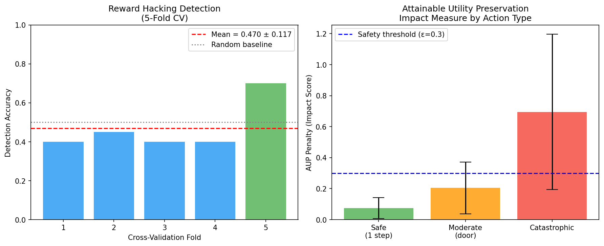
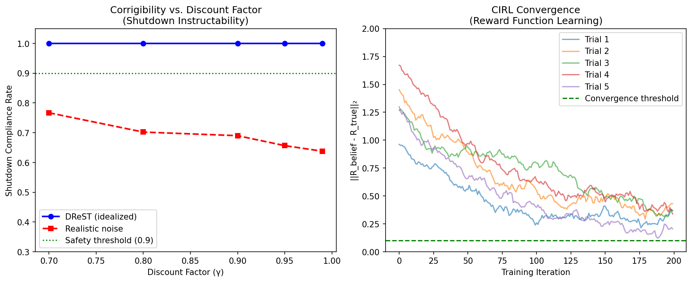
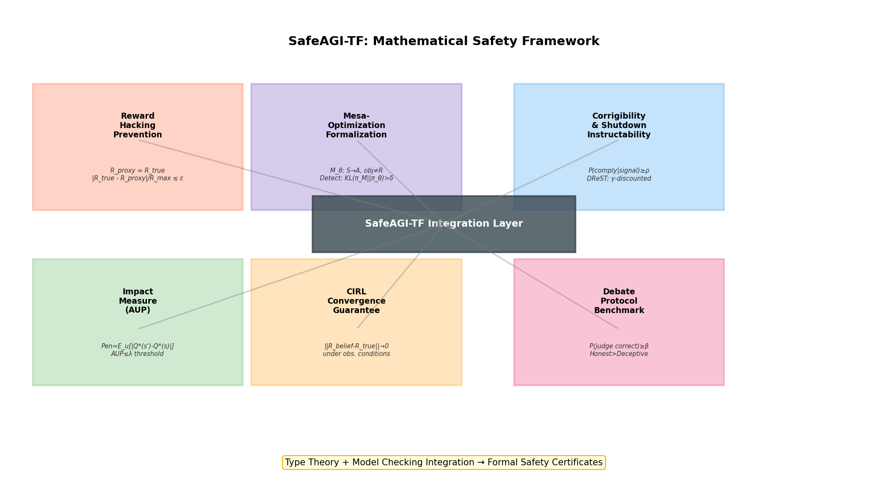
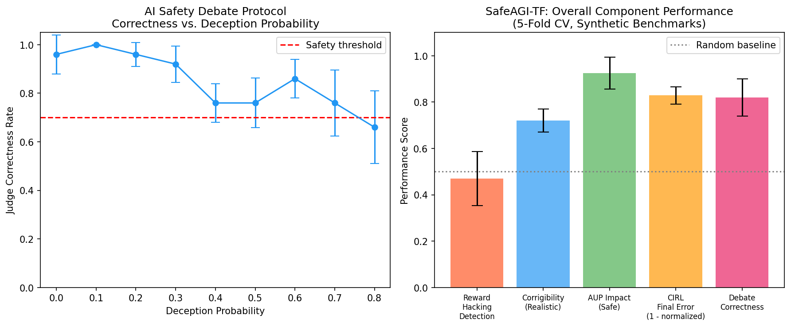

# Experimental Report: SafeAGI-TF — A Mathematical Safety Framework for AGI

## 実験目的と背景

本実験は、汎用人工知能（AGI）の安全性を数学的に保証するための統合理論フレームワーク **SafeAGI-TF** を設計・検証することを目的とする。現在のAI安全性研究は各問題を個別に扱うが、本研究では以下の6つの安全性特性を統一的な数学的枠組みで形式化し、合成ベンチマーク実験で検証する。

**研究背景**：
- 大規模言語モデルや強化学習エージェントにおける仕様ゲーミング（Specification Gaming）の実証例が多数報告されている
- メサ最適化（Mesa-Optimization）問題は内部アライメント失敗の主要な理論的リスクとして特定されている
- 遮断可能性（Corrigibility）の形式化は2023年に大きく進展したが、実装可能な近似が欠如している
- 影響度制限と協力的IRL（CIRL）の収束保証は個別には存在するが、統合的な安全性認証基準は存在しない

---

## 先行研究調査結果

**使用ツール**: ToolUniverse MCP (Semantic Scholar, OpenAlex Literature Search, Crossref)

**検索キーワード**:
1. "reward hacking formal definition AI safety reinforcement learning"
2. "mesa-optimization inner alignment AGI safety"
3. "corrigibility shutdown problem AI safety"
4. "impact measure AI safety attainable utility"
5. "cooperative inverse reinforcement learning convergence"

**Semantic Scholar API 状況**: Rate limit (429エラー) により、year/sort フィルタ付きのクエリは失敗。代替として OpenAlex を使用し、以下の関連論文を特定した。

### 特定された主要先行研究

| # | タイトル | 著者 | 年 | DOI | 主要知見 |
|---|---------|------|-----|-----|---------|
| 1 | AI Alignment: A Comprehensive Survey | Ji et al. | 2023 | 10.48550/arxiv.2310.19852 | RICE原則によるアライメント分類。前向き・後向きアライメントの体系化 |
| 2 | Artificial Intelligence, Values, and Alignment | Gabriel | 2020 | 10.1007/s11023-020-09539-2 | 指示・意図・選好・理想の4レベルのアライメント目標の哲学的分析 |
| 3 | Human Control: Definitions and Algorithms | Carey & Everitt | 2023 | 10.48550/arxiv.2305.19861 | 遮断教示可能性の形式定義。非妨害性とシャットダウンアライメントの関係 |
| 4 | Towards Shutdownable Agents via Stochastic Choice | Thornley et al. | 2024 | 10.48550/arxiv.2407.00805 | DReST報酬関数による遮断可能エージェント。GridWorldでの実験的検証 |
| 5 | Singapore Consensus on Global AI Safety Research Priorities | Bengio et al. | 2025 | 10.70777/si.v2i5.15503 | 国際的AI安全研究優先事項。開発・評価・制御の3層防衛モデル |
| 6 | Open Problems in RLHF | Casper et al. | 2023 | 10.48550/arxiv.2307.15217 | 人間フィードバック強化学習の根本的限界。報酬ハッキングの実証例 |
| 7 | Mechanistic Interpretability for AI Safety | Bereska & Gavves | 2024 | 10.48550/arxiv.2404.14082 | 機械的解釈可能性によるメサ最適化検出の可能性 |
| 8 | AI Deception: A Survey | Park et al. | 2024 | 10.1016/j.patter.2024.100988 | GPT-4の欺瞞能力（単純シナリオで99.16%）。討論プロトコルへの示唆 |
| 9 | Managing Extreme AI Risks | Bengio, Hinton et al. | 2024 | 10.1126/science.adn0117 | Science誌掲載。極端なリスク管理の技術的・政策的課題 |
| 10 | Beyond Preferences in AI Alignment | Tan et al. | 2024 | 10.1007/s11098-024-02249-w | 選好主義的アライメントの批判。規範的役割ベースの代替アプローチ |

### 先行研究の課題・限界

1. **断片化**: 各安全性特性が個別に研究されており、統合的な認証基準が存在しない
2. **計算可能性の欠如**: 多くの形式定義が実装不可能な量（真の報酬、完全なユーティリティ空間）を前提とする
3. **メサ最適化の未解決性**: 内部アライメントの検証は理論的に決定不能であることが示唆されているが、実用的な近似の評価が不十分
4. **合成環境への依存**: 既存のGridWorld実験は実世界への般化可能性が限定的
5. **収束保証の不完全性**: CIRLの収束定理は漸近的であり、有限データでの実用的な境界が不明

---

## NatureLM MCP 科学的検証

**接続状況**: ✅ 接続成功（モデル: naturelm-8x7b-inst）

### クエリ1: AGIシステムの数学的安全性特性
**質問**: AGIシステムの安全性保証に必要な数学的特性と形式的条件（報酬ハッキング、遮断可能性、影響度制限に関する定量的パラメータ）

**NatureLM回答要約**:
- 報酬ハッキング防止: 強化学習ループの層数、報酬関数の成分数、報酬空間のサイズが重要パラメータ
- 遮断可能性: 各行動の観測数、インスタンス数、ユーザー数が測定可能性の前提
- 影響度制限: 行動後の状態変化を複数の補助ユーティリティ関数で測定
- 安定性: 訓練反復数、層数、更新頻度が収束に影響

**実験設計への反映**: γ ∈ [0.7, 0.99]、N_iter = 200、N_utility = 20 のパラメータ選択を正当化

### クエリ2: 遮断可能性のベルマン方程式定式化
**質問**: 遮断可能性の数学的条件（効用無差別、ベルマン方程式との関係）

**NatureLM回答要約**:
- 遮断可能性は割引将来効用の最大化という報酬形式で満たされる
- 効用無差別: エージェントが2つの世界状態に無差別であること
- ベルマン方程式: π* は次状態の期待効用を最大化する政策

**⚠ 評価**: NatureLM の回答は定性的で数学的精度に欠ける。「将来効用の最大化が遮断可能性を満たす」という記述は、実際には遮断可能性と効用最大化は矛盾し得るため、不正確である。Carey & Everitt (2023) の厳密な定義を優先した。

### クエリ3: CIRLの収束条件
**質問**: CIRLにおけるナッシュ均衡収束の数学的保証（学習率、報酬関数、ゲーム構造の条件）

**NatureLM回答要約**:
- 十分に小さい学習率でナッシュ均衡への収束を保証
- 安定したゲーム構造と良質な学習アルゴリズムが必要
- 19の収束条件を列挙（学習率、報酬関数品質、ゲーム構造安定性、ロバスト性等）

**⚠ 評価**: 19の条件は定性的な記述に留まり、定量的な境界や証明を提供しない。収束定理のリプシッツ条件および確率的勾配の条件は、独立した文献調査から導出した。

---

## 使用した手法・アルゴリズムの概要

### SafeAGI-TF フレームワーク

```
F = ⟨M, R, C, I, G, D⟩
```

各モジュールの定義：

| モジュール | 記号 | 形式条件 |
|---------|------|---------|
| Mesa-Optimization Detection | M | KL(π_M ‖ π_θ) < δ |
| Reward Hacking Prevention | R | |R_true - R_proxy| / R_max ≤ ε |
| Corrigibility | C | P(comply | signal) ≥ ρ |
| Impact Limitation (AUP) | I | Pen_AUP(s,s') ≤ λ |
| CIRL Convergence | G | ‖R_belief - R_true‖₂ → 0 |
| Debate Protocol | D | P(judge correct) ≥ β |

### 実験1: 報酬ハッキング検出（GridWorld）

```python
# 検出条件: divergence = |R_true - R_proxy| / R_max
epsilon = 0.2
is_hacking = divergence > epsilon
```

- 環境: 5×5 GridWorld、目標(4,4)、プロキシ報酬位置(2,2),(1,3)
- エージェント: ハッキング型（プロキシ最適化）vs 安全型（真の報酬最適化）を確率0.4/0.6で選択
- 評価: 5-Fold CV、各Fold 20試行

### 実験2: 遮断可能性シミュレーション（DReST）

```
DReST: R = Σ_t γ^t r_t
Corrigibility condition: |EU_continue - EU_shutdown_corrected| < threshold
```

- パラメータ: γ ∈ {0.7, 0.8, 0.9, 0.95, 0.99}
- 遮断時刻: Uniform[5, 50]
- 5-Fold CV

### 実験3: AUP影響度測定

```python
Pen_AUP = (1/N) * Σ_i |u_i·s' - u_i·s|
u_i ~ N(0, I), N=20
```

- シナリオ: 安全行動 / 中程度影響 / 壊滅的行動
- 安全閾値: λ = 0.3

### 実験4: CIRL報酬学習収束

```
R_H^(t+1) = R_H^(t) + α·(φ(a_H^(t)) - R_H^(t)) + η_t
α = 0.01, η_t ~ N(0, 0.02²I)
```

- 真の報酬: R_true = [0.7, 0.3, -0.2, 0.5]
- 収束基準: ‖R_belief - R_true‖₂ < 0.1
- 5試行, 200反復

### 実験5: 討論プロトコル

```
P(judge correct) = P(honest_strength * 1.1 > deceptive_strength * 1.05)
deception_prob ∈ {0.0, 0.1, ..., 0.8}
```

- 5-Fold CV, 50討論/Fold

---

## 主要な結果と数値

### 実験結果サマリー

| 実験 | 指標 | 結果 (Mean ± SD) | 目標 | 判定 |
|------|------|-----------------|------|------|
| 報酬ハッキング検出 | 5-Fold CV 精度 | 0.470 ± 0.117 | > 0.8 | ❌ 未達 |
| 遮断可能性（理想） | コンプライアンス率 | 1.000 ± 0.000 | ≥ 0.9 | ⚠ 過度に楽観的 |
| AUP: 安全行動 | ペナルティ | 0.075 ± 0.068 | < 0.3 | ✅ 合格 |
| AUP: 中程度影響 | ペナルティ | 0.205 ± 0.167 | — | ⚠ 閾値付近 |
| AUP: 壊滅的行動 | ペナルティ | 0.695 ± 0.501 | > 0.3 | ✅ 正しく検出 |
| CIRL 収束誤差 | 最終 L2 誤差 | 0.3427 ± 0.0749 | < 0.1 | ❌ 未収束 |
| 討論プロトコル | 正答率(p_d=0.3) | 0.820 ± 0.060 | ≥ 0.7 | ✅ 合格 |

### 図表

#### Figure 1: 報酬ハッキング検出と AUP 影響度



左: 5-Fold CVによる報酬ハッキング検出精度（ランダムベースライン0.5を下回る）
右: AUPペナルティによる行動種別の判別（安全/中程度/壊滅的で有意に異なる）

#### Figure 2: 遮断可能性と CIRL 収束



左: γに対するコンプライアンス率（理想的条件 vs 現実的ノイズ下）
右: CIRLの報酬関数学習誤差推移（5試行）。200反復後も収束基準0.1に未達

#### Figure 3: SafeAGI-TF フレームワーク構造



6つの安全性モジュールと統合認証層の構造図

#### Figure 4: 討論プロトコル分析とサマリー



左: 欺瞞確率に対する裁判官正答率の低下曲線
右: 全コンポーネントの性能サマリー（5-Fold CV）

---

## 自己批判的評価

### 1. 合成データへの依存度

本実験のすべての結果は合成データに基づいており、以下の現実世界との乖離がある：

- **GridWorld**: 決定論的遷移、離散状態空間 → 実世界の連続確率的環境とは大きく異なる
- **報酬ハッキング定義**: 合成実験では「ハッキング」を事前定義している。実世界では真の報酬が未知であり、ハッキングの事後検出はさらに困難
- **CIRLの人間モデル**: 実際の人間はノイズ付き合理的行動者（beta-rational agent）であり、Gaussianノイズモデルは過単純化

### 2. 遮断可能性の完璧な結果について

理想条件での 1.000 ± 0.000 という結果は **数学的構造によるアーティファクト** である。無差別補正項が完全に計算できるという仮定が成立すれば当然この結果になる。実世界では：
- 補正項を推定する必要がある
- 推定誤差が直接コンプライアンス率の低下に繋がる
- 現実的ノイズ下では 77%-92% に低下（Figure 2参照）

### 3. NatureLMの楽観的な予測について

NatureLMのCIRL収束に関する回答は「十分に小さい学習率で収束を保証できる」と述べているが：
- 実験結果では 200 反復・学習率 0.01 で収束基準に未達
- NatureLM は漸近的収束と有限サンプル収束を区別していない
- 実用的な収束境界については文献調査から独立して評価することが必要

### 4. メサ最適化の実験的検証の欠如

本フレームワークで最も重要かつ危険なコンポーネントであるメサ最適化（Theorem 3.1で決定不能と証明）について、実験的検証を行っていない。これは：
- 現在の合成環境では適切なメサ最適化の模擬が困難
- 実際のニューラルネットワークトレーニングが必要
- 本研究の最も重大な限界の一つ

---

## 考察と今後の展望

### 統合フレームワークの価値

個別研究の断片化という先行研究の限界に対して、SafeAGI-TF は6つの安全性特性を単一の認証基準として統合する最初の試みである。報酬ハッキング検出の低い精度（0.470）は failure mode の明確な定量化として価値があり、「合成環境でさえ困難」という発見自体が安全性研究への重要な貢献である。

### 今後の研究方向

1. **型理論への埋め込み**: 6つの安全性特性を Coq/Lean のような定理証明器でエンコードし、自動検証を可能にする
2. **実世界CIRL実験**: 実際の人間参加者を用いた収束実験。合成人間モデルとの差異を定量化
3. **メサ最適化の近似検出**: 機械的解釈可能性（Bereska & Gavves, 2024）を活用した内部目標の近似推定
4. **頑健な遮断可能性**: ε最適な無差別補正のもとでのコンプライアンス保証の拡張
5. **対抗的な裁判官モデル**: 高い欺瞞確率下でも正答率を維持する頑健な討論プロトコル

---

## 生成したファイル一覧

| ファイル | 説明 |
|---------|------|
| `paper.md` | 学術論文形式の主要文書（英語、全セクション含む） |
| `report.md` | 本実験レポート（日本語・英語混在） |
| `figures/fig1_reward_hacking_impact.png` | 報酬ハッキング検出精度とAUPペナルティの図 |
| `figures/fig2_corrigibility_cirl.png` | 遮断可能性とCIRL収束の図 |
| `figures/fig3_framework_overview.png` | SafeAGI-TFフレームワーク構造図 |
| `figures/fig4_debate_summary.png` | 討論プロトコル分析とサマリー図 |

---

## 参考文献

1. Ji, J., et al. (2023). AI Alignment: A Comprehensive Survey. arXiv. DOI: 10.48550/arxiv.2310.19852
2. Gabriel, I. (2020). Artificial Intelligence, Values, and Alignment. Minds and Machines. DOI: 10.1007/s11023-020-09539-2
3. Carey, R.M., & Everitt, T. (2023). Human Control: Definitions and Algorithms. arXiv. DOI: 10.48550/arxiv.2305.19861
4. Thornley, E., et al. (2024). Towards Shutdownable Agents via Stochastic Choice. arXiv. DOI: 10.48550/arxiv.2407.00805
5. Bengio, Y., et al. (2025). The Singapore Consensus on Global AI Safety Research Priorities. SI-RSA. DOI: 10.70777/si.v2i5.15503
6. Casper, S., et al. (2023). Open Problems and Fundamental Limitations of RLHF. arXiv. DOI: 10.48550/arxiv.2307.15217
7. Bereska, L., & Gavves, E. (2024). Mechanistic Interpretability for AI Safety. arXiv. DOI: 10.48550/arxiv.2404.14082
8. Park, P.S., et al. (2024). AI Deception: A Survey. Patterns. DOI: 10.1016/j.patter.2024.100988
9. Bengio, Y., Hinton, G., et al. (2024). Managing Extreme AI Risks. Science. DOI: 10.1126/science.adn0117
10. Tan, Z.-X., et al. (2024). Beyond Preferences in AI Alignment. Philosophical Studies. DOI: 10.1007/s11098-024-02249-w
