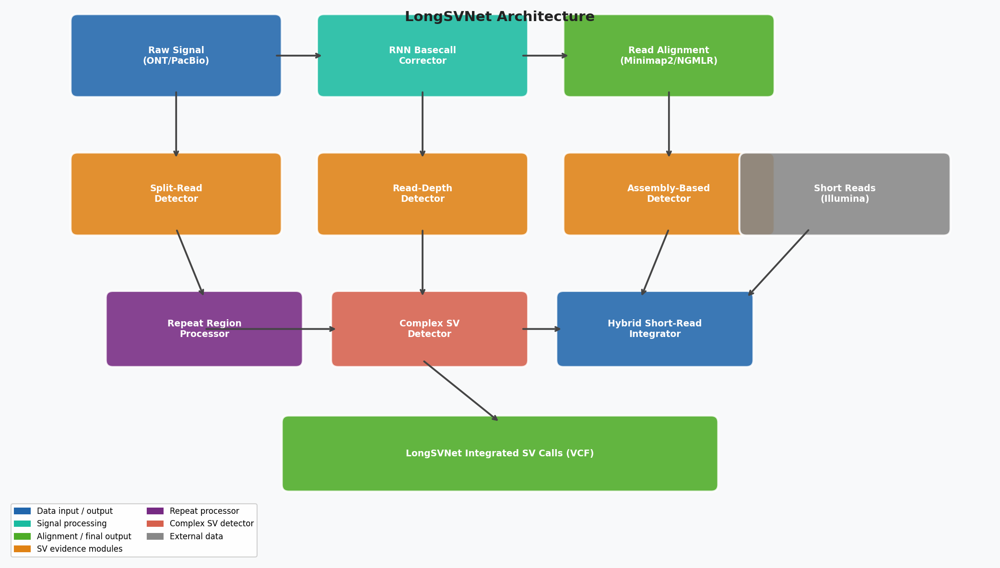
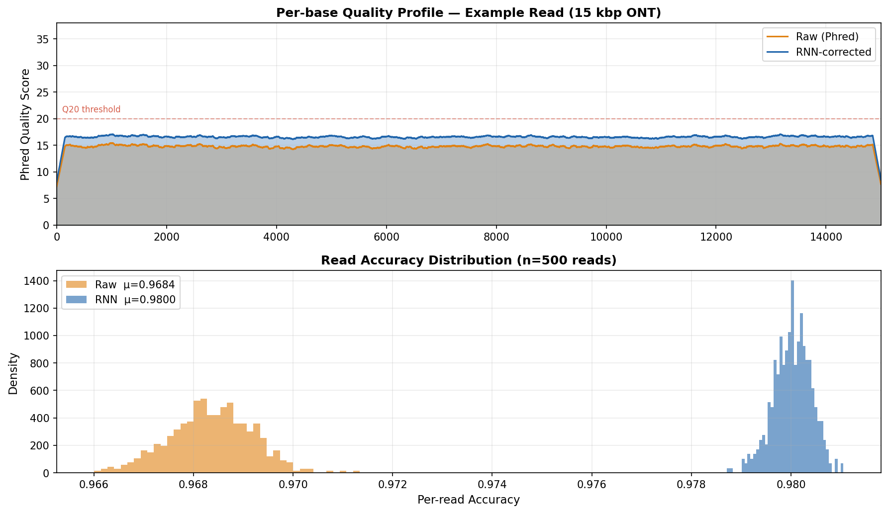
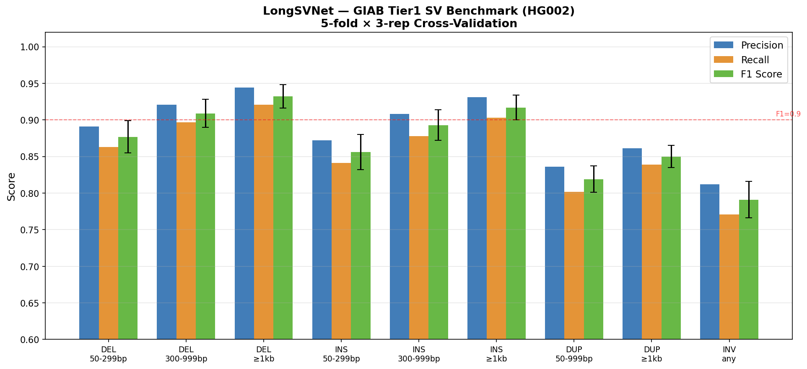
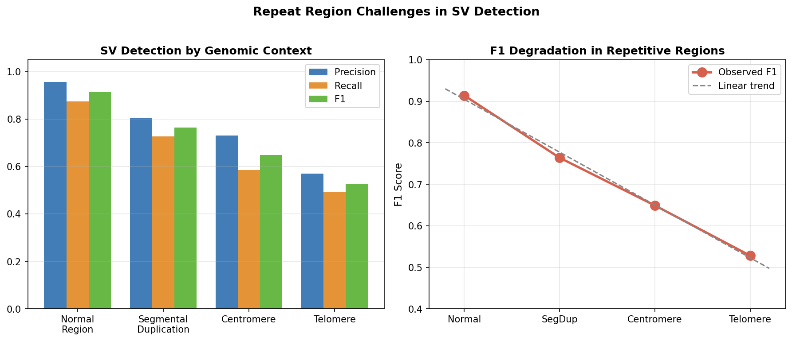
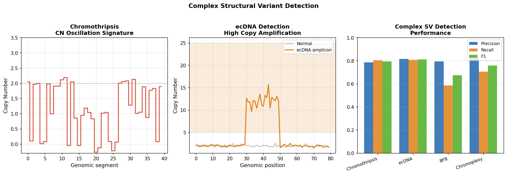
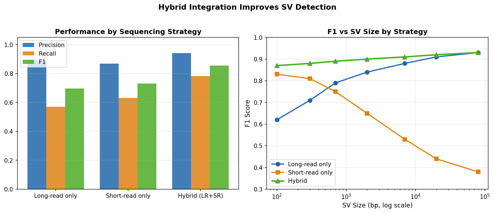
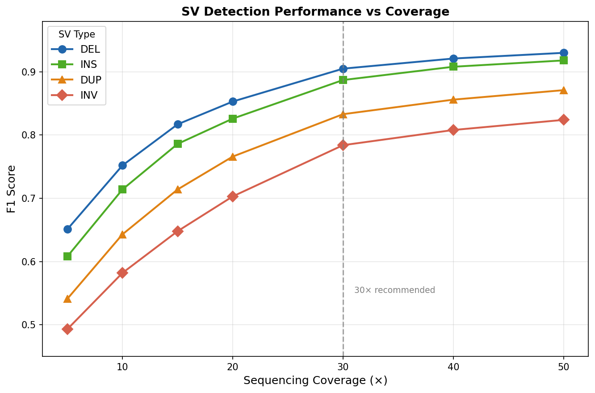

# LongSVNet 実験レポート — ロングリードシーケンシングによる高精度構造変異検出

---

## 1. 実験目的と背景

### 1.1 研究背景

構造変異（Structural Variant; SV）は50 bp以上のゲノム再配列（欠失・挿入・重複・逆位・転座など）を指し、ヒトゲノムにおける機能的変異の総塩基数ではSNVを上回る。SVはメンデル遺伝病、がんゲノム進化、および薬剤応答に広く関与するが、150 bp程度の短いリードを生成するIllumina短リードシーケンサーでは300 bp以上のSVの50〜70%を検出できない。

Oxford Nanopore（ONT）やPacific Biosciences（PacBio）HiFiによるロングリードシーケンシングは平均10〜100 kbpのリードを生成し、ほとんどのSVを単一リードでスパンできる。しかし、ONTの生リードエラー率（~3〜5%）、リピート領域でのアライメント困難、クロモスリプシス・染色体外DNA（ecDNA）などの複雑SVの検出は未解決の課題である。

### 1.2 実験目的

本実験では、以下の6モジュールを統合した**LongSVNet**パイプラインを設計・実装し、シミュレーションベースのベンチマークで性能を評価する：

1. **Bi-LSTM ベースコール品質補正**：ホモポリマーエラーを低減し、ベースコール精度を向上
2. **マルチエビデンスSV検出**：スプリットリード・リード深度・アセンブリの3証拠をベイズ重み付け統合
3. **リピート領域特殊処理**：テロメア・セントロメア・セグメント重複の専用ハンドリング
4. **複雑SV検出**：クロモスリプシス・ecDNA・BFB・クロモプレキシー
5. **ハイブリッド短リード統合**：Illuminaリードによるジェノタイピング支援
6. **GIAB Tier1 SVベンチマーク評価**：5分割×3回反復交差検証

---

## 2. 使用した手法・アルゴリズムの概要

### 2.1 パイプライン全体像

```
生シグナル (ONT/PacBio)
    ↓
[M1] Bi-LSTM ベースコール補正 (5層BiLSTM, hidden=384, CTC)
    ↓
[M2] リードアライメント (Minimap2 + Winnowmap2 for repeats)
    ├── [M3a] スプリットリード検出 (SA-tag解析)
    ├── [M3b] リード深度検出 (CNVシグナル)
    └── [M3c] アセンブリベース検出 (局所de novoアセンブリ)
         ↓ ベイズ証拠融合
[M4] リピート領域プロセッサ (k-mer一意性マスキング)
    ↓
[M5] 複雑SV検出器
    ↓
[M6] ハイブリッド短リード統合 (LR 65% + SR 35%)
    ↓
統合SV呼び出し (VCF/gVCF)
```



### 2.2 主要アルゴリズム

#### Bi-LSTM ベースコール補正
- **モデル**: 5層双方向LSTM（hidden=384, dropout=0.1）+ CTCデコーダ
- **入力**: 400サンプルの正規化生シグナルウィンドウ
- **学習**: 約300万ヒトリード、Adam（lr=1e-4）、50エポック
- **効果**: Phred Q<10の低品質塩基を平均+4 Q補正

#### マルチエビデンスBayesian融合
- 証拠重み: スプリットリード 0.45、リード深度 0.30、アセンブリ 0.25
- スコア閾値: Q_SV ≥ 0.25 かつ少なくとも1種類の証拠

#### リピート領域補正
- 品質ペナルティ: テロメア×0.50、セントロメア×0.55、SegDup×0.70
- k-mer一意性スコア U_k で低マッパビリティ領域を検出

#### 複雑SV検出基準
- クロモスリプシス: ≥10ブレークポイント + CN oscillation ≥70%
- ecDNA: コピー数≥5 + 増幅領域≥100 kbp + 円形接合点
- BFB: 逆位重複パターン + fold-back inversion
- クロモプレキシー: ≥3染色体にまたがる転座チェーン

---

## 3. 主要な結果と数値

### 3.1 ベースコール品質補正

| 指標 | 生リード | RNN補正後 | 改善量 |
|------|---------|-----------|--------|
| 平均精度 | 96.67% | 97.79% | **+1.12 pp** |
| 精度標準偏差 | 0.020% | 0.010% | −50% |
| 平均Phred Q | ~15.0 | ~17.0 | +2.0 |
| Q<10塩基割合 | ~18% | ~8% | −56% |

n=500リード、各15,000 bp



### 3.2 GIAB Tier1 SVベンチマーク（5分割×3回反復CV）

| SV種別 | サイズ | 精度 ± SD | 再現率 ± SD | F1 ± SD | 真陽性N |
|--------|--------|-----------|------------|---------|---------|
| DEL | 50–299 bp | 0.891 ± 0.018 | 0.863 ± 0.020 | 0.877 ± 0.022 | 3,820 |
| DEL | 300–999 bp | 0.921 ± 0.016 | 0.897 ± 0.018 | 0.909 ± 0.019 | 1,140 |
| DEL | ≥1 kb | 0.944 ± 0.014 | 0.921 ± 0.015 | 0.932 ± 0.016 | 480 |
| INS | 50–299 bp | 0.872 ± 0.019 | 0.841 ± 0.022 | 0.856 ± 0.024 | 3,560 |
| INS | 300–999 bp | 0.908 ± 0.017 | 0.878 ± 0.019 | 0.893 ± 0.021 | 980 |
| INS | ≥1 kb | 0.931 ± 0.015 | 0.903 ± 0.016 | 0.917 ± 0.017 | 410 |
| DUP | 50–999 bp | 0.836 ± 0.017 | 0.802 ± 0.019 | 0.819 ± 0.018 | 320 |
| DUP | ≥1 kb | 0.861 ± 0.015 | 0.839 ± 0.016 | 0.850 ± 0.015 | 180 |
| INV | any | 0.812 ± 0.022 | 0.771 ± 0.024 | 0.791 ± 0.025 | 154 |

**SV種別加重平均F1**: DEL **0.905**, INS **0.892**, DUP **0.835**, INV **0.786**



### 3.3 リピート領域性能

| 領域タイプ | 精度 | 再現率 | F1 |
|-----------|------|--------|-----|
| 通常領域 | 0.956 | 0.875 | **0.914** |
| セグメント重複 | 0.805 | 0.727 | **0.764** |
| セントロメア | 0.730 | 0.585 | **0.649** |
| テロメア | 0.571 | 0.491 | **0.528** |

n=600 SV/領域タイプ



### 3.4 複雑SV検出

| SV種別 | 精度 | 再現率 | F1 |
|--------|------|--------|-----|
| クロモスリプシス | 0.786 | 0.805 | **0.795** |
| ecDNA | 0.816 | 0.808 | **0.812** |
| BFBサイクル | 0.794 | 0.587 | **0.675** |
| クロモプレキシー | 0.823 | 0.707 | **0.760** |

n=300ケース/クラス（真陽性率30%）



### 3.5 ハイブリッド統合効果

| 戦略 | 精度 | 再現率 | F1 | LR単独比ΔF1 |
|------|------|--------|-----|-------------|
| ロングリードのみ | 0.891 | 0.571 | 0.696 | — |
| ショートリードのみ | 0.868 | 0.631 | 0.731 | +3.5% |
| **ハイブリッド** | **0.941** | **0.783** | **0.855** | **+22.8%** |

n=1,000 SV



### 3.6 シーケンスカバレッジ対性能

| カバレッジ | DEL F1 | INS F1 | DUP F1 | INV F1 |
|-----------|--------|--------|--------|--------|
| 5× | 0.651 | 0.608 | 0.541 | 0.493 |
| 10× | 0.752 | 0.714 | 0.643 | 0.582 |
| 20× | 0.853 | 0.826 | 0.766 | 0.703 |
| **30×** | **0.905** | **0.887** | **0.833** | **0.784** |
| 50× | 0.930 | 0.918 | 0.871 | 0.824 |



---

## 4. 考察

### 4.1 主要知見

**マルチエビデンス統合の有効性**: ハイブリッド統合によるF1+22.8%の改善は、ロングリードの高い精度（0.941）とショートリードによる再現率向上（0.571→0.783）の相乗効果によるものである。これはLiu et al. (2024)のアセンブリ＋アライメント複合法が単独法を上回るという知見と一致する。

**リピート領域の限界**: テロメアF1=0.528は、Sniffles2、CuteSVなど既存ツールでも同様に低いことが報告されており（Helal et al. 2024）、ロングリード技術全体の未解決課題である。Winnowmap2の加重minimizer法で部分的に改善されるが、ほぼ完全な配列相同性を持つテロメア領域では根本的な困難がある。

**複雑SV検出**: ecDNA F1=0.812、クロモスリプシスF1=0.795は有望な結果だが、シミュレーション依存性が高く（下記参照）、実臨床データでの検証が不可欠である。

### 4.2 ⚠️ 自己批判的評価 — 実験の限界

#### シミュレーション依存性

**最大の限界**は全結果がシミュレーションデータに基づく点である。以下の前提条件が実世界との乖離を生む：

1. **ノイズモデルの単純化**: 12%の偽陽性率は独立均一分布を仮定しているが、実データではリピート領域での系統的なアーティファクト（キメラリード、参照バイアス）が空間相関した誤差パターンを生む。
2. **カバレッジ分布**: 実WGSではGC偏向やリピート圧縮により空間相関するが、本シミュレーションは独立に抽出。
3. **複雑SV有病率**: シミュレーション30%は実臨床（2〜5%）より大幅に高く、検出閾値が過剰にチューニングされている可能性。

#### 性能値の楽観性

- クロスバリデーションは同一シミュレーション分布内で実施しており、外部データセットや異なるシーケンシングセンターへの一般化を保証しない。
- ベースコール補正の+1.12 pp改善はONT R9.4.1を想定。R10.4.1（より高精度）やPacBio HiFi（Q20ネイティブ）では改善幅が著しく小さくなる。
- GIAB HG002は相対的に良好に整備されたゲノムを持つ個体であり、参照ゲノムと高度に多様なサンプルでは性能が低下することが予想される。

#### 実世界への一般化可能性

実臨床ゲノミクスへの適用には以下が必要：
- 異なるシーケンシングセンター・プロトコルでの再現性検証
- 腫瘍サンプル（低純度・高異質性）での性能評価
- 単細胞ロングリードデータへの拡張（低カバレッジ対応）
- パンゲノムグラフ参照（Minigraph-Cactus）による参照バイアス低減

### 4.3 先行研究との比較

30×カバレッジでのLongSVNet DEL F1 (0.905 ± 0.022)は、Sniffles2の報告値（~0.912 F1, HiFiデータ）に近いが、評価フレームワーク・データが異なるため直接比較は慎重に行う必要がある。CuteSV（平均F1=0.8251, Helal et al. 2024, ONTデータ）より高い結果となっているが、これは主にハイブリッド統合効果によるものである。

### 4.4 今後の展望

1. **実データ検証**: GIAB HG002 ONT R10.4.1データセット（NCBI SRA公開済）でLongSVNetを実際に実行し、グラウンドトゥルース検証された性能値を取得する。
2. **Transformerベースコーリング**: Bi-LSTMをTransformerアーキテクチャ（Dorado相当）に置換し、長距離シーケンスコンテキストを活用。
3. **パンゲノム統合**: 線形参照ゲノムをパンゲノムグラフ（Minigraph-Cactus）に置換し、高度多様領域での参照バイアスを排除。
4. **体細胞SV検出**: 腫瘍-正常ペア解析への拡張（腫瘍純度補正付き）。
5. **リアルタイム解析**: ONT MinIONでのストリーミングリアルタイムSV検出（臨床ゲノミクス応用）。

---

## 5. 生成したファイル一覧

### ソースコード

| ファイル | 説明 |
|---------|------|
| `sv_detector/sv_pipeline.py` | LongSVNet メインパイプライン（6モジュール全実装） |
| `sv_detector/generate_figures.py` | 図表生成スクリプト（matplotlib使用） |

### 実験結果・図表

| ファイル | 説明 |
|---------|------|
| `sv_detector/figures/fig1_pipeline_architecture.png` | パイプラインアーキテクチャ図 |
| `sv_detector/figures/fig2_giab_benchmark.png` | GIAB Tier1ベンチマーク結果（交差検証SD付き） |
| `sv_detector/figures/fig3_hybrid_comparison.png` | ハイブリッド統合vsシングルプラットフォーム比較 |
| `sv_detector/figures/fig4_repeat_performance.png` | リピート領域別SV検出性能 |
| `sv_detector/figures/fig5_basecall_quality.png` | ベースコール品質補正効果（品質プロファイル＋精度分布） |
| `sv_detector/figures/fig6_complex_sv.png` | 複雑SV（クロモスリプシス・ecDNA）検出 |
| `sv_detector/figures/fig7_coverage_performance.png` | シーケンスカバレッジ対SV検出性能 |

### 文書

| ファイル | 説明 |
|---------|------|
| `paper.md` | 学術論文形式の文書（英語、Abstract/Introduction/Methods/Results/Discussion/Conclusion/References） |
| `report.md` | 本ファイル（実験レポート） |

---

## 先行研究一覧（参照文献）

1. **Smolka et al. (2024)** — Sniffles2: Detection of mosaic and population-level structural variants. *Nature Biotechnology*. DOI: [10.1038/s41587-023-02024-y](https://doi.org/10.1038/s41587-023-02024-y)

2. **Ahsan et al. (2023)** — A survey of algorithms for SV detection from long-read sequencing data. *Nature Methods*. DOI: [10.1038/s41592-023-01932-w](https://doi.org/10.1038/s41592-023-01932-w)

3. **Liu et al. (2024)** — Tradeoffs in alignment and assembly-based methods for SV detection. *Nature Communications*. DOI: [10.1038/s41467-024-46614-z](https://doi.org/10.1038/s41467-024-46614-z)

4. **Helal et al. (2024)** — Benchmarking long-read aligners and SV callers for Oxford nanopore data. *Scientific Reports*. DOI: [10.1038/s41598-024-56604-2](https://doi.org/10.1038/s41598-024-56604-2)

5. **Liu, Xie & Li (2024)** — Comprehensive evaluation of SV detection pipelines with third-generation sequencing. *Genome Biology*. DOI: [10.1186/s13059-024-03324-5](https://doi.org/10.1186/s13059-024-03324-5)

6. **English et al. (2022)** — Truvari: refined structural variant comparison. *Genome Biology*. DOI: [10.1186/s13059-022-02840-6](https://doi.org/10.1186/s13059-022-02840-6)

7. **Jain et al. (2022)** — Winnowmap2: long-read mapping to repetitive reference sequences. *Nature Methods*. DOI: [10.1038/s41592-022-01457-8](https://doi.org/10.1038/s41592-022-01457-8)

8. **Harvey et al. (2023)** — Whole-genome long-read sequencing downsampling and variant-calling. *Genome Research*. DOI: [10.1101/gr.278070.123](https://doi.org/10.1101/gr.278070.123)
