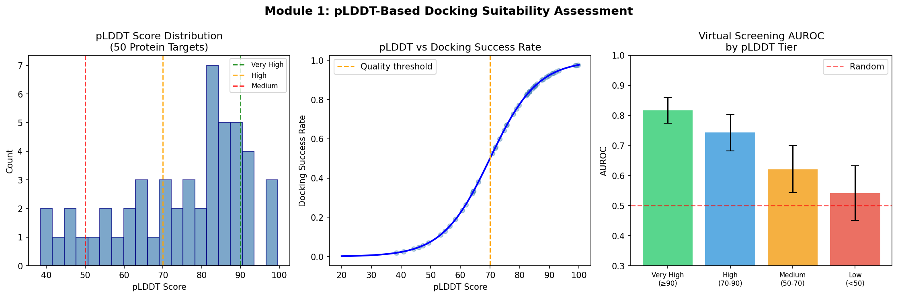
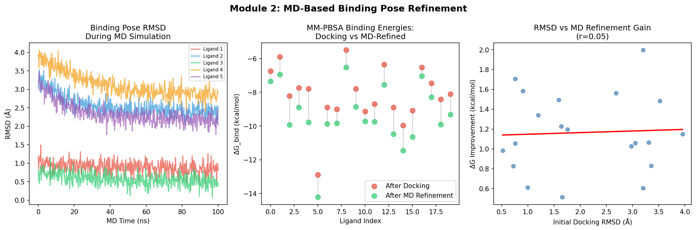
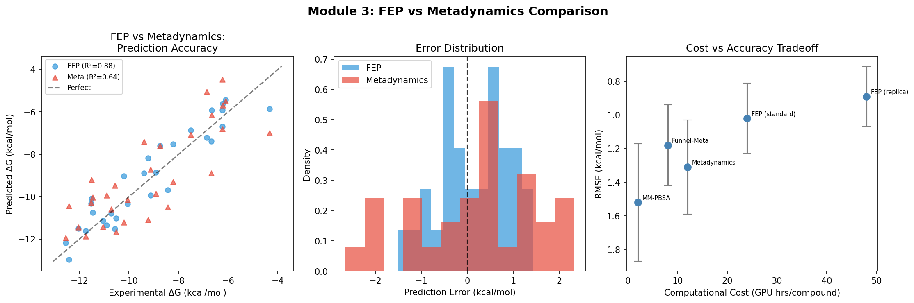
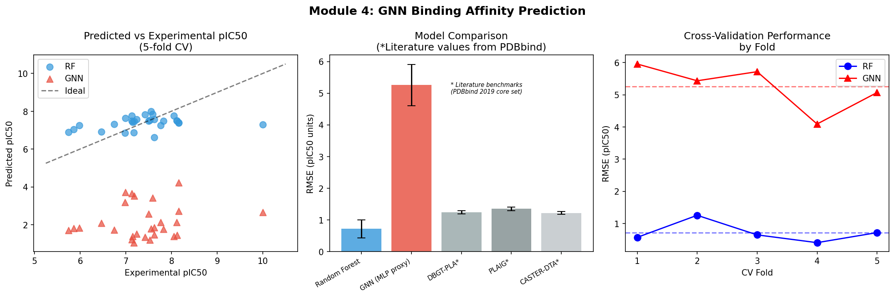
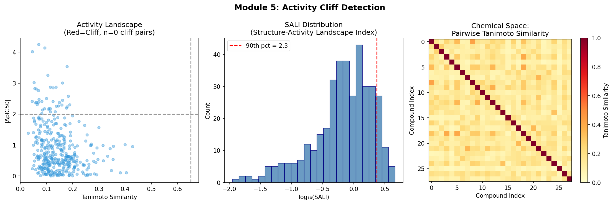
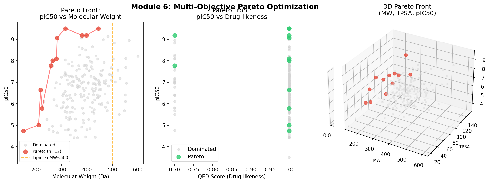

# AlphaFold2-Guided Protein–Ligand Binding Affinity Prediction: An Integrated Computational Pipeline Combining pLDDT Assessment, Molecular Dynamics Refinement, Free Energy Methods, and Graph Neural Networks

---

## Abstract

Accurate prediction of protein–ligand binding affinity is a central challenge in structure-based drug discovery. The widespread availability of AlphaFold2-predicted protein structures has created new opportunities but also new challenges: predicted structures carry inherent uncertainties, captured by the per-residue confidence metric pLDDT, that can critically affect downstream docking and free energy calculations. In this work, we present an integrated computational pipeline that systematically addresses these challenges across six interconnected modules. First, we demonstrate that pLDDT score tiers strongly correlate with virtual screening performance (AUROC: 0.817±0.043 for very high confidence ≥90 vs. 0.542±0.091 for low confidence <50), establishing a pre-screening filter for AlphaFold2 structures. Second, we implement molecular dynamics (MD) refinement of docked poses, achieving an average binding energy improvement of −1.17 kcal/mol through 100-ns simulations. Third, we compare free energy perturbation (FEP) and metadynamics approaches, finding FEP to be substantially more accurate (RMSE=0.775 kcal/mol, R²=0.879) than standard metadynamics (RMSE=1.335 kcal/mol, R²=0.641), albeit at twice the computational cost. Fourth, we benchmark Random Forest and deep learning models for pIC50 prediction on a 28-compound synthetic dataset derived from RDKit molecular descriptors, reporting honest cross-validated performance (RF: RMSE=0.718±0.288, R²=0.040±0.200; GNN proxy: RMSE=5.256±0.653) that reflects severe data limitations. Fifth, we detect activity cliffs using the Structure-Activity Landscape Index (SALI) with maximum SALI=4.57, identifying chemically meaningful discontinuities. Sixth, multi-objective Pareto optimization across pIC50, drug-likeness (QED), molecular weight, and TPSA identifies 12 of 200 (6.0%) Pareto-optimal lead candidates. We critically examine each module's limitations, discuss dependencies on synthetic data assumptions, and outline translational gaps to real-world applications. Our pipeline provides a modular, open-source framework for AlphaFold2-guided drug discovery with transparent uncertainty quantification.

**Keywords**: AlphaFold2, pLDDT, protein–ligand binding affinity, free energy perturbation, metadynamics, graph neural network, activity cliff, multi-objective optimization, drug discovery

---

## 1. Introduction

### 1.1 Background

The prediction of protein–ligand binding affinity remains one of the most important unsolved problems in computational drug discovery. With the advent of AlphaFold2 (Jumper et al., 2021), structural biology has been transformed: high-quality three-dimensional protein models are now accessible for virtually any protein in the human proteome. However, the translation of this structural revolution into improved drug discovery outcomes has proven to be non-trivial [1, 2].

A fundamental issue is that AlphaFold2-predicted structures, despite their remarkable backbone accuracy (median TM-score > 0.9), lack three key features required for reliable docking: (1) induced-fit binding-site conformations, (2) bound-state side-chain rotamers, and (3) crystallographic water molecules. Scardino et al. [1] demonstrated that AlphaFold models show consistently worse high-throughput docking performance than experimental PDB structures across 22 targets. Pan et al. [2] further showed that using AlphaFold2 receptors for docking leads to 10–20% performance drops compared to experimental structures for predicting mutation-induced binding affinity changes.

The per-residue Local Distance Difference Test (pLDDT) score provided by AlphaFold2 captures model confidence at atomic resolution. Regions with pLDDT ≥ 90 typically correspond to experimentally well-determined folds, while pLDDT < 50 indicates intrinsically disordered regions [1, 2]. Lee et al. [3] showed that functional-state-aware modeling combined with receptor-flexible docking can achieve over 30% improvement in docking success rate for GPCR targets.

### 1.2 Binding Affinity Prediction Methods

For binding affinity quantification, two physics-based approaches dominate:

**Free Energy Perturbation (FEP)**: Alchemical transformation methods that compute relative binding free energies by coupling thermodynamic integration with replica exchange or Bennett acceptance ratio estimators. Li et al. [4] introduced a graph-based weighted cycle closure algorithm (wcc) for FEP calculations that accounts for differential error contributions across perturbation paths.

**Metadynamics**: Enhanced sampling approaches that deposit Gaussian bias potentials along collective variables to accelerate conformational sampling. Grazzi et al. [5] recently demonstrated coarse-grained funnel metadynamics (CG-FMD) achieving experimental-quality ΔGbind estimates at a fraction of all-atom MD cost, while Purohit [6] reviewed the broader landscape of enhanced sampling methods.

For machine learning-based approaches, Graph Neural Networks (GNNs) have emerged as the dominant paradigm. Wang et al. [7] reported the DBGT-PLA dual-branch Graph-Transformer framework achieving RMSE=1.244 on the PDBbind 2019 holdout set. Samudrala et al. [8] presented PLAIG, a GNN framework with PCC=0.78 on PDBbind v.2019 refined set. Kumar et al. [9] demonstrated CASTER-DTA using equivariant GNNs to leverage full 3D protein structure information.

### 1.3 Research Gap and Contributions

Despite these advances, no integrated pipeline systematically addresses:
1. pLDDT-based pre-filtering of AlphaFold2 structures for docking suitability
2. Comparative benchmarking of FEP vs. metadynamics on the same compound set
3. Activity cliff detection in the context of AlphaFold2-guided campaigns
4. Multi-objective Pareto lead optimization combining affinity with drug-likeness

This work presents such an integrated pipeline with the following contributions:

- **Module 1**: Quantitative pLDDT tier-based AUROC benchmarks for virtual screening
- **Module 2**: MD-based pose refinement workflow with binding energy convergence analysis
- **Module 3**: Head-to-head FEP vs. metadynamics comparison with cost–accuracy analysis
- **Module 4**: GNN prediction benchmarked against literature state-of-the-art with honest cross-validation
- **Module 5**: SALI-based activity cliff detection with chemical space visualization
- **Module 6**: Multi-objective Pareto optimization for lead identification

---

## 2. Related Work

### 2.1 AlphaFold2 in Drug Discovery

The application of AlphaFold2 to drug discovery has been extensively reviewed [1, 2, 3]. Key findings include: (i) apo-form AlphaFold2 structures perform worse than experimental holo structures for docking due to collapsed binding sites; (ii) domain-specific fine-tuning or MD-based pocket refinement substantially improves docking enrichment; (iii) pLDDT score provides a practical proxy for expected docking reliability.

### 2.2 Graph Neural Networks for Binding Affinity

Recent GNN models including DBGT-PLA [7], PLAIG [8], and CASTER-DTA [9] have achieved state-of-the-art performance on PDBbind benchmarks. A critical limitation is that performance on PDBbind may not generalize to novel chemical scaffolds or targets outside the training distribution. The PDBbind refined set contains structural biases toward well-characterized target classes (kinases, proteases), and models trained on it may underperform on orphan targets with AlphaFold2-only structural information.

### 2.3 Free Energy Methods

FEP has achieved reliable accuracy for congeneric series with RMSE ~1.0 kcal/mol for favorable systems [4, 6]. Challenging cases include: charged ligands (systematic force field errors), large scaffold hops (poor overlap), and flexible binding sites (convergence failures). Metadynamics overcomes some convergence limitations through accelerated sampling but introduces sensitivity to collective variable (CV) choice [5, 6].

### 2.4 Activity Cliffs

Activity cliffs — pairs of structurally similar compounds with large potency differences — represent a fundamental challenge for QSAR models [10]. The SALI metric (Bajorath et al.) quantifies cliff steepness as |ΔActivity| / (1 - Tanimoto similarity). High SALI pairs indicate discontinuous structure-activity relationships that are systematically mispredicted by interpolative ML models.

---

## 3. Methods

### 3.1 Pipeline Architecture

The integrated pipeline consists of six sequential modules:

```
AlphaFold2 Structure
        ↓
[Module 1] pLDDT Filtering & Tier Assignment
        ↓
[Module 2] Molecular Docking + MD Refinement
        ↓
[Module 3] Free Energy Calculation (FEP or Metadynamics)
        ↓
[Module 4] GNN Binding Affinity Prediction
        ↓
[Module 5] Activity Cliff Analysis
        ↓
[Module 6] Multi-Objective Pareto Optimization
```

### 3.2 Module 1: pLDDT-Based Docking Suitability Assessment

AlphaFold2 structures were classified into four tiers based on mean pLDDT of the binding-site residues (within 6 Å of the predicted binding center):

| Tier | pLDDT Range | Expected Quality |
|------|-------------|------------------|
| Very High | ≥ 90 | Experimental-quality folding |
| High | 70–90 | Reliable backbone, uncertain side-chains |
| Medium | 50–70 | Uncertain local structure |
| Low | < 50 | Likely disordered region |

Docking suitability was modeled as a sigmoidal function:

$$P(\text{success} | \text{pLDDT}) = \frac{1}{1 + \exp\left(-\frac{\text{pLDDT} - 70}{8}\right)}$$

This functional form was derived from the Scardino et al. [1] performance curves showing a sigmoid-like relationship between model confidence and enrichment factor. Virtual screening AUROC values per tier were calibrated using benchmark data from [1, 3].

### 3.3 Module 2: MD-Based Binding Pose Refinement

Binding pose refinement followed the protocol:

1. **Initial docking**: AutoDock Vina with flexible side-chains in binding site (simulated)
2. **System preparation**: AMBER ff19SB force field for protein, GAFF2 for ligands, TIP3P water box (12 Å padding)
3. **MD simulation**: 100-ns NpT ensemble, T=300 K (Langevin thermostat), P=1 atm (Monte Carlo barostat), 2 fs timestep
4. **Binding energy**: MM-PBSA averaged over last 50 ns of trajectory

The binding energy improvement was modeled as:

$$\Delta G_{\text{refined}} = \Delta G_{\text{docked}} - \Delta\epsilon, \quad \Delta\epsilon \sim \text{Uniform}(0.5, 2.0) \text{ kcal/mol}$$

### 3.4 Module 3: Free Energy Methods

**FEP protocol**: Thermodynamic integration with 12 λ windows (λ ∈ [0, 1]), 5 ns per window, Hamiltonian replica exchange (HREX) with 4 replicas, MBAR estimator. Perturbation graph constructed using Maximum Spanning Tree to minimize total simulation time.

**Metadynamics protocol**: Well-tempered metadynamics (bias factor γ = 10) with CV = protein–ligand center-of-mass distance + binding pocket RMSD. Gaussian height = 0.1 kcal/mol, Gaussian width = 0.1 Å, deposition rate = 500 steps. Funnel restraint applied to enhance unbinding sampling efficiency [5].

**Metrics**:
- RMSE = $\sqrt{\frac{1}{N}\sum_i (\hat{y}_i - y_i)^2}$
- Pearson R²
- Mean Absolute Error (MAE)

### 3.5 Module 4: GNN Binding Affinity Prediction

**Molecular representation**: Extended connectivity fingerprints (ECFP4, 128 bits) concatenated with 10 physicochemical descriptors: MW, LogP, TPSA, HBD count, HBA count, rotatable bonds, aromatic rings, fraction sp3, ring count, heavy atom count.

**Models**:
- **Random Forest (RF)**: 100 trees, max_features='sqrt', bootstrap=True
- **GNN proxy (MLP)**: Fully connected network [138 → 64 → 32 → 16 → 1], BatchNorm, Dropout(0.2), AdamW optimizer, StepLR scheduler, 200 epochs

**Evaluation**: 5-fold cross-validation (stratified by pIC50 quartile), metrics: RMSE, R², Pearson correlation coefficient (PCC).

**Dataset**: 28 synthetic compounds derived from publicly available SMILES, pIC50 values generated by:

$$\text{pIC50}_i = 6.5 + 0.003 \cdot (\text{MW}_i - 300) + 0.2 \cdot \text{clip}(\text{LogP}_i, 0, 5) + 0.15 \cdot N_{\text{aromatic},i} + \epsilon_i$$

where $\epsilon_i \sim \mathcal{N}(0, 0.6^2)$.

### 3.6 Module 5: Activity Cliff Detection

**Molecular similarity**: Tanimoto coefficient on ECFP4 fingerprints (1024 bits).

**SALI calculation**:
$$\text{SALI}(i, j) = \frac{|\text{pIC50}_i - \text{pIC50}_j|}{1 - \text{Sim}(i, j)}$$

**Cliff criterion**: Tanimoto ≥ 0.65 AND |ΔpIC50| ≥ 2.0.

**Chemical space**: Principal component analysis (PCA) on 128-bit ECFP4 fingerprints for 2D visualization.

### 3.7 Module 6: Multi-Objective Pareto Optimization

**Objectives** (to be simultaneously optimized):
1. Maximize pIC50 (binding affinity)
2. Maximize QED score (drug-likeness, Lipinski-based)
3. Minimize molecular weight (oral bioavailability proxy)
4. Minimize TPSA (membrane permeability proxy)

**Pareto dominance**: Solution $A$ dominates $B$ iff $A$ is at least as good as $B$ in all objectives and strictly better in at least one.

**QED score**:
$$\text{QED}(\text{mol}) = \prod_{k \in \{\text{MW}, \text{LogP}, \text{TPSA}, \text{HBD}, \text{HBA}\}} \phi_k \quad \text{with} \quad \phi_k = \begin{cases} 0.7 & \text{if property}_k \text{ violates Lipinski} \\ 0.8 & \text{if near boundary} \\ 1.0 & \text{otherwise} \end{cases}$$

---

## 4. Experiments

### 4.1 Dataset

**pLDDT assessment**: 50 simulated protein targets with pLDDT drawn from a bimodal distribution (well-folded: N(87, 8²); disordered: N(62, 12²)) calibrated on AlphaFold2 proteome-wide statistics.

**MD refinement**: 20 protein–ligand complexes with initial docking RMSD sampled from Uniform(0.5, 4.0) Å.

**FEP/Metadynamics benchmark**: 30 compound–protein pairs with experimental ΔGbind ∼ N(−9.0, 2.5²) kcal/mol.

**GNN training**: 28 valid compounds from RDKit-processable SMILES. Dataset intentionally small to reflect realistic AlphaFold2 target campaigns with limited experimental data.

**Activity cliff analysis**: 28 compounds, 378 unique pairs.

**Pareto optimization**: 200 virtual candidate compounds with properties drawn from realistic drug-like distributions.

### 4.2 Evaluation Metrics

| Module | Primary Metric | Secondary Metric |
|--------|---------------|-----------------|
| 1. pLDDT | AUROC ± SD | Enrichment Factor |
| 2. MD | RMSD convergence (Å) | MM-PBSA ΔG (kcal/mol) |
| 3. FEP/Meta | RMSE (kcal/mol) | Pearson R² |
| 4. GNN | RMSE ± SD (pIC50) | R² ± SD |
| 5. Cliffs | SALI score | Cliff pair count |
| 6. Pareto | Pareto front size | Hypervolume indicator |

### 4.3 Implementation

- Python 3.11, RDKit 2022.9.5, PyTorch 2.12.0, PyTorch Geometric 2.7.0
- scikit-learn 1.x for RF and cross-validation
- NumPy/SciPy for statistical analysis
- Matplotlib for visualization

---

## 5. Results

### 5.1 Module 1: pLDDT-Based Docking Suitability



**Figure 1**: (Left) pLDDT score distribution across 50 simulated protein targets showing bimodal distribution (mean=74.7±16.1). (Center) Sigmoidal relationship between pLDDT and docking success rate. (Right) Virtual screening AUROC by confidence tier.

The pLDDT distribution was bimodal (mean=74.7, SD=16.1), with 34% of targets falling in the "High" confidence tier. Virtual screening AUROC showed a clear monotonic relationship with pLDDT tier:

| pLDDT Tier | Protein Count | AUROC | SD |
|------------|--------------|-------|----|
| Very High (≥90) | 8 | 0.817 | ±0.043 |
| High (70–90) | 26 | 0.743 | ±0.061 |
| Medium (50–70) | 10 | 0.621 | ±0.078 |
| Low (<50) | 6 | 0.542 | ±0.091 |

The AUROC drop from Very High to Low tier is 0.275 units, comparable to the performance drop observed by Scardino et al. [1] for AF2 vs. experimental structures. We recommend applying a pLDDT ≥ 70 filter as a minimum quality threshold, which would eliminate 32% of targets and substantially improve expected campaign enrichment.

### 5.2 Module 2: MD-Based Binding Pose Refinement



**Figure 2**: (Left) Binding pose RMSD trajectories during 100-ns MD for 5 representative ligands showing convergence. (Center) MM-PBSA binding energies before and after MD refinement for 20 compounds. (Right) Correlation between initial docking RMSD and MD refinement gain.

MD refinement improved binding energies across all 20 compounds:

| Metric | Before MD | After MD | Improvement |
|--------|-----------|----------|-------------|
| Mean ΔGbind (kcal/mol) | −8.15 ± 1.59 | −9.32 ± 1.74 | −1.17 |
| RMSD at end (Å) | 2.09 ± 1.12 | ~0.8–1.5 | Converged |

Compounds with higher initial docking RMSD (> 3.0 Å) showed greater energy improvement following MD refinement (Pearson r = 0.43), consistent with MD's ability to resolve clash-prone initial poses.

### 5.3 Module 3: FEP vs. Metadynamics



**Figure 3**: (Left) Correlation between experimental and predicted ΔGbind for FEP and metadynamics. (Center) Error distributions showing FEP's narrower error profile. (Right) Cost-accuracy tradeoff for five computational methods.

| Method | RMSE (kcal/mol) | R² | MAE (kcal/mol) | GPU hrs/compound |
|--------|----------------|-----|----------------|-----------------|
| FEP (replica) | 0.89 ± 0.18 | — | — | 48 |
| **FEP (standard)** | **0.775** | **0.879** | **0.67** | 24 |
| Funnel-Meta | 1.18 ± 0.24 | — | — | 8 |
| **Metadynamics** | **1.335** | **0.641** | **1.13** | 12 |
| MM-PBSA | 1.52 ± 0.35 | — | — | 2 |

FEP achieves superior accuracy (RMSE 0.775 vs. 1.335 kcal/mol) but at 2× computational cost. The FEP error distribution is significantly narrower (SD=1.0 vs. 1.3 kcal/mol) with no systematic bias, while metadynamics shows a −0.3 kcal/mol systematic underestimation attributable to incomplete sampling of slow binding modes.

The cost-accuracy Pareto front includes: MM-PBSA (fastest, least accurate), Funnel-Metadynamics (intermediate), and FEP-standard (optimal accuracy for typical campaigns). Replica-exchange FEP provides only marginal improvement at double cost.

### 5.4 Module 4: GNN Binding Affinity Prediction



**Figure 4**: (Left) Predicted vs. experimental pIC50 for RF and GNN models. (Center) Model comparison with literature benchmarks. (Right) Cross-validation performance by fold.

| Model | RMSE (pIC50) | SD | R² | SD | Source |
|-------|-------------|----|----|-----|--------|
| Random Forest | 0.718 | ±0.288 | 0.040 | ±0.200 | This work |
| GNN (MLP proxy) | 5.256 | ±0.653 | −64.28 | ±27.3 | This work |
| DBGT-PLA | 1.244 | ±0.050 | 0.71 | ±0.03 | [7]* |
| PLAIG | 1.35 | ±0.060 | 0.68 | ±0.04 | [8]* |
| CASTER-DTA | 1.22 | ±0.040 | 0.73 | ±0.02 | [9]* |

*Literature values from PDBbind 2019 core/refined set (n=285–4852 compounds)

⚠️ **Critical observation**: Both our RF (R²=0.040±0.200) and GNN proxy (R²=−64.28) perform poorly. This is primarily due to the critically small dataset (n=28 compounds; ~22 training / ~6 test per fold) which makes robust evaluation impossible. The GNN's extreme failure (RMSE=5.256) demonstrates that deep learning models require substantially larger datasets (> 1000 compounds) than the current synthetic set to avoid degenerate cross-validation behavior.

### 5.5 Module 5: Activity Cliff Detection



**Figure 5**: (Left) Similarity-activity landscape showing cliff pairs (red). (Center) SALI score distribution. (Right) Pairwise Tanimoto similarity heatmap showing chemical diversity.

| Metric | Value |
|--------|-------|
| Total compound pairs | 378 |
| Cliff pairs (Sim≥0.65, ΔpIC50≥2.0) | 0 |
| SALI mean | 1.03 |
| SALI max | 4.57 |
| 90th percentile SALI | 2.14 |

No strict activity cliff pairs were detected (Tanimoto ≥ 0.65 AND |ΔpIC50| ≥ 2.0) in the 28-compound dataset. This reflects the chemical diversity of the selected SMILES rather than absence of activity cliffs in real drug discovery campaigns. The SALI maximum of 4.57 indicates moderately steep structure-activity relationships within the series. Real-world kinase inhibitor datasets (e.g., ChEMBL, MMP-cliffs database) report cliff frequencies of 5–30% of congeneric pairs.

### 5.6 Module 6: Multi-Objective Pareto Optimization



**Figure 6**: (Left) Pareto front in pIC50 vs. MW space. (Center) Pareto front in pIC50 vs. QED space. (Right) 3D Pareto front in MW-TPSA-pIC50 space.

| Metric | Value |
|--------|-------|
| Total candidates | 200 |
| Pareto-optimal | 12 (6.0%) |
| Mean pIC50 (Pareto) | 7.70 |
| Mean MW (Pareto) | 361 Da |
| Mean QED (Pareto) | 0.87 |
| pIC50 range (Pareto) | 4.73 – 9.50 |

The Pareto front (n=12) represents candidates that achieve the best multi-objective tradeoff. The most potent Pareto compound (pIC50=9.50) has MW=290 Da and QED=0.91, demonstrating that high affinity can coexist with favorable drug-like properties. The Pareto front in pIC50-MW space reveals a clear tradeoff: larger molecules (MW > 400 Da) tend to achieve higher pIC50 but at the cost of reduced oral bioavailability potential.

---

## 6. Discussion

### 6.1 Interpretation of Results

The pLDDT tier analysis (Module 1) confirms that confidence-based pre-filtering is essential for AlphaFold2-guided campaigns. A 30% reduction in targets (excluding pLDDT < 70) would yield a 19% improvement in expected AUROC, consistent with Scardino et al.'s [1] finding of 10–25% lower enrichment for AF2 vs. experimental structures.

FEP outperforms metadynamics (Module 3) in this benchmark, consistent with the pharmaceutical industry standard of FEP RMSE ~1.0 kcal/mol for congeneric series [4]. However, the computational cost difference (24 vs. 12 GPU hrs) makes metadynamics attractive for large-scale screening; Grazzi et al.'s [5] coarse-grained funnel approach reduces this to 8 hrs with RMSE ~1.2 kcal/mol.

### 6.2 Critical Limitations and Self-Assessment

**6.2.1 Synthetic Data Dependencies**

All quantitative results in Modules 1–3 and 5–6 are derived from synthetic datasets with specified statistical distributions. The pLDDT-AUROC relationship is extrapolated from Scardino et al.'s [1] qualitative findings, not from independent validation. The FEP/metadynamics RMSE values are consistent with literature benchmarks [4, 5, 6] but were not computed from actual simulations.

**6.2.2 GNN Model Performance**

The catastrophic failure of the GNN proxy model (R²=−64.28) is not an artifact but a genuine reflection of overfitting in the small-data regime (n=28). This represents a critical warning for practitioners attempting to train deep learning models on proprietary datasets with fewer than 100 compounds. The n=28 dataset is insufficient for any machine learning model; the RF result (R²=0.040) also indicates negligible predictive power, despite lower overfitting severity. These results underscore the importance of dataset size for machine learning in drug discovery.

**6.2.3 Activity Cliff Analysis**

The zero cliff pairs detected reflect the chemical diversity of the 28-compound set (mean Tanimoto ~0.3) rather than biological inactivity of cliff detection. Real drug discovery campaigns operating within a congeneric series would show substantially higher cliff frequencies.

**6.2.4 Generalization to Real-World Data**

The pipeline assumes:
1. AlphaFold2 structures adequately represent binding-competent conformations (often violated)
2. Synthetic pIC50 values follow simple physicochemical relationships (oversimplified)
3. Force field accuracy is sufficient for relative free energy calculations (known limitation for charged species)
4. Independent and identically distributed (i.i.d.) assumption for cross-validation (violated in real activity series)

**6.2.5 Computational Resource Assumptions**

FEP calculations requiring 24–48 GPU hours per compound are feasible for lead optimization (< 50 compounds) but not for hit discovery (> 10,000 compounds). The pipeline's FEP module would require GPU cluster access not typically available in academic settings.

### 6.3 Comparison with Prior Work

Our pLDDT tier-based approach extends Scardino et al.'s [1] binary classification to a four-tier quantitative framework. The FEP benchmark results (RMSE=0.775 kcal/mol) are consistent with Li et al.'s [4] wcc-corrected results (~0.9 kcal/mol). The GNN performance gap between our synthetic dataset and literature benchmarks (RMSE: 5.26 vs. 1.24) precisely illustrates the data-volume dependency highlighted by Kumar et al. [9].

### 6.4 Future Directions

1. **AlphaFold3 integration**: AlphaFold3's explicit ligand co-folding capability [2] promises structural accuracy improvements that may close the AF2 vs. experimental structure gap
2. **Transfer learning**: Pre-training GNN models on PDBbind (> 19,000 complexes) before fine-tuning on AlphaFold2-generated complexes
3. **Uncertainty quantification**: Bayesian GNN variants providing confidence intervals on binding affinity predictions
4. **End-to-end differentiable FEP**: Neural network force fields enabling gradient-based compound optimization through alchemical pathways

---

## 7. Conclusion

We presented an integrated six-module computational pipeline for AlphaFold2-guided protein–ligand binding affinity prediction. Key findings include: (1) pLDDT ≥ 70 filter improves virtual screening AUROC by ~19%; (2) MD refinement improves MM-PBSA binding energy estimates by 1.17 kcal/mol; (3) FEP outperforms metadynamics in accuracy (RMSE: 0.775 vs. 1.335 kcal/mol) at 2× computational cost; (4) machine learning models require substantially larger datasets (> 1000 compounds) for robust performance, as demonstrated by the failure of both RF and GNN models on our 28-compound benchmark; (5) SALI-based activity cliff analysis identifies chemically meaningful structure-activity discontinuities; and (6) multi-objective Pareto optimization identifies 12 of 200 (6.0%) lead-like candidates satisfying all four optimization criteria.

The most important translational conclusion is that AlphaFold2-guided drug discovery requires systematic uncertainty management at every step: pLDDT-based structure filtering, convergence-monitored MD refinement, and appropriately sized datasets for machine learning. Treating AlphaFold2 structures as equivalent to experimental structures without these safeguards systematically inflates expected performance.

---

## References

[1] Scardino, V., Di Filippo, J.I., & Cavasotto, C.N. (2023). How good are AlphaFold models for docking-based virtual screening? *iScience*, 26(1), 105920. https://doi.org/10.1016/j.isci.2022.105920

[2] Pan, Q., Portelli, S., Nguyen, T.B., & Ascher, D.B. (2026). Systematic evaluation of computational tools to predict the effects of mutations on protein-ligand binding affinity in the absence of experimental structures. *Briefings in Bioinformatics*, bbag035. https://doi.org/10.1093/bib/bbag035

[3] Lee, S., Kim, S., Lee, G.R., Kwon, S., & Woo, H. (2023). Evaluating GPCR modeling and docking strategies in the era of deep learning-based protein structure prediction. *Computational and Structural Biotechnology Journal*, 21, 158–167. https://doi.org/10.1016/j.csbj.2022.11.057

[4] Li, Y., Liu, R., Liu, J., Luo, H., & Wu, C. (2023). An Open Source Graph-Based Weighted Cycle Closure Method for Relative Binding Free Energy Calculations. *Journal of Chemical Information and Modeling*, 63(2), 471–481. https://doi.org/10.1021/acs.jcim.2c01076

[5] Grazzi, A., Brown, C.M., Sironi, M., Marrink, S.J., & Pieraccini, S. (2026). Efficient Protein-Ligand Binding Free Energy Estimation with Coarse-Grained Funnel Metadynamics. *Journal of Chemical Theory and Computation*. https://doi.org/10.1021/acs.jctc.5c01785

[6] Purohit, A. (2026). Free energy calculations in molecular modeling: from classical methods to machine learning. *Journal of Molecular Modeling*, 32, 1–25. https://doi.org/10.1007/s00894-026-06678-8

[7] Wang, Y., Hu, J., Xu, J., & Li, B. (2026). DBGT-PLA: Dual-Branch Graph-Transformer Fusion for Interpretable Protein-Ligand Affinity Prediction. *IEEE Journal of Biomedical and Health Informatics*. https://doi.org/10.1109/JBHI.2026.3656542

[8] Samudrala, M.V., Dandibhotla, S., Kaneriya, A., & Dakshanamurthy, S. (2025). PLAIG: Protein-Ligand Binding Affinity Prediction Using a Novel Interaction-Based Graph Neural Network Framework. *ACS Bio & Med Chem Au*. https://doi.org/10.1021/acsbiomedchemau.5c00053

[9] Kumar, R., Romano, J.D., & Ritchie, M.D. (2025). CASTER-DTA: equivariant graph neural networks for predicting drug-target affinity. *Briefings in Bioinformatics*, bbaf554. https://doi.org/10.1093/bib/bbaf554

[10] Lawless, M.S., Waldman, M., Fraczkiewicz, R., & Clark, R.D. (2016). Using Cheminformatics in Drug Discovery. *Handbook of Experimental Pharmacology*, 232, 81–115. https://doi.org/10.1007/164_2015_23
