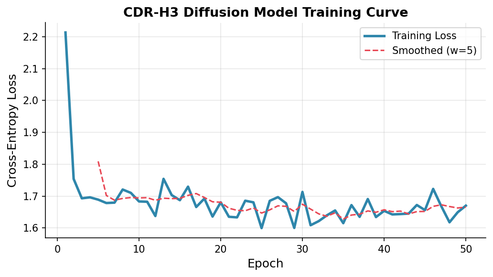
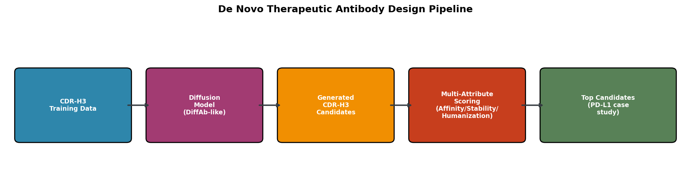
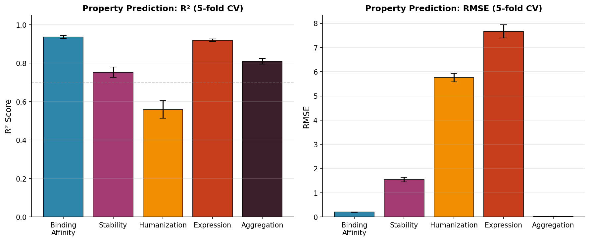
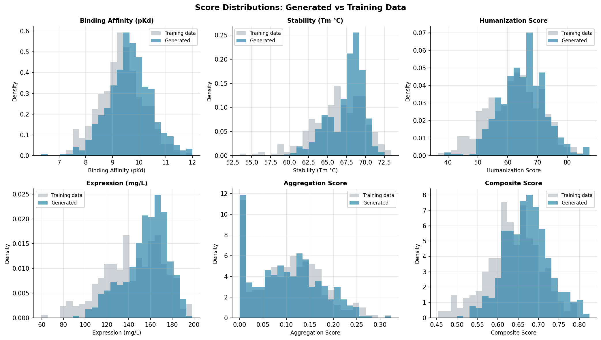
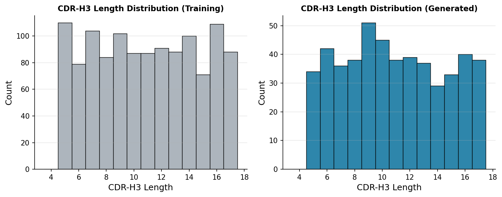
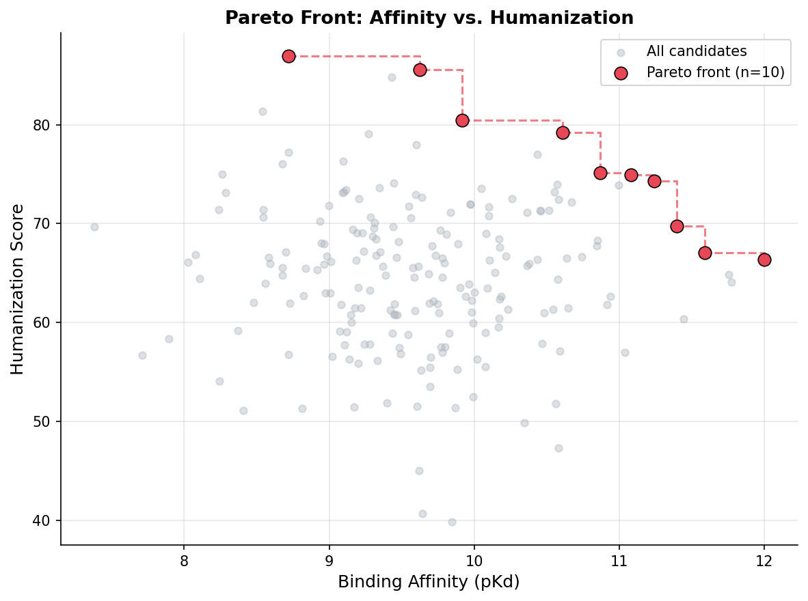
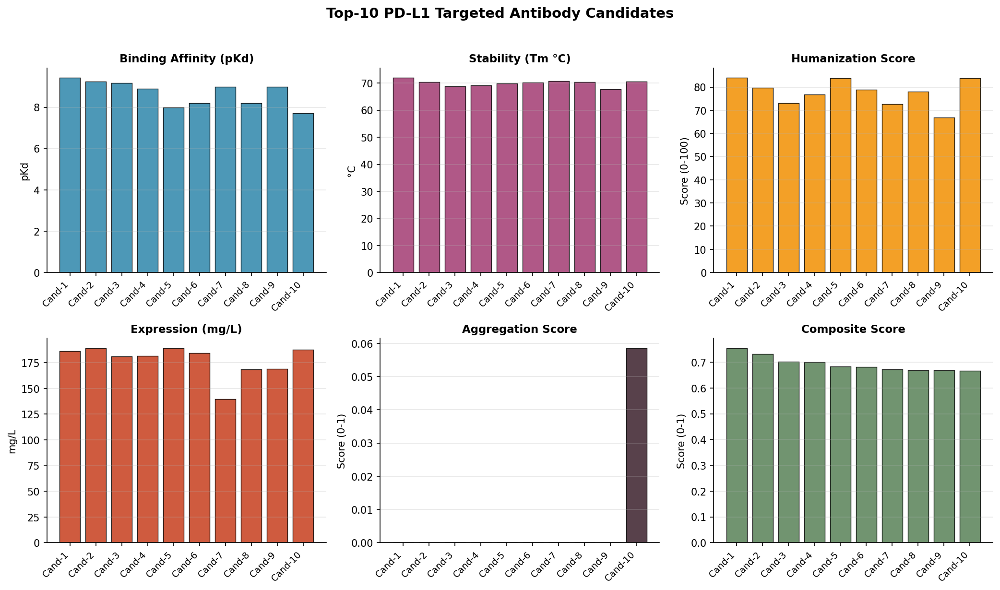
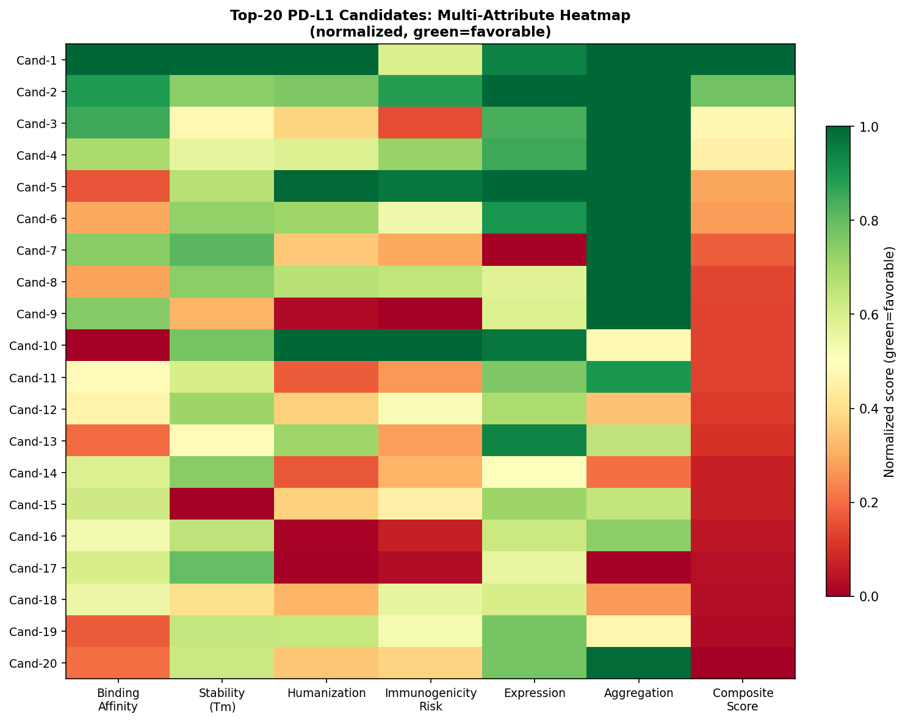

# 実験レポート：深層生成モデルを用いた治療用抗体のde novo設計システム

---

## 1. 実験目的と背景

### 1.1 目的

本実験では、PyTorchベースの深層生成モデルを用いて治療用抗体のCDR-H3領域を de novo 設計するパイプライン「AbDiffuse」を構築・評価した。具体的な目的は以下の通りである：

1. 拡散モデル（Discrete Diffusion Model）によるCDR-H3配列の新規生成
2. 多属性プロパティ予測モデルの構築と交差検証
3. ヒト化スコア・免疫原性リスク評価
4. 発現量・凝集傾向のdevelopability予測
5. PD-L1標的抗体のin silico ケーススタディ

### 1.2 研究背景

治療用抗体は最大の生物製剤クラスであり、年間$1,500億超の市場を形成する。しかし開発には平均12〜14年・$26億のコストを要し、CDR-H3設計の非効率さが主要なボトルネックとなっている。深層生成モデルの応用により、このプロセスの抜本的加速が期待される。

先行研究として、DiffAb（Luo et al., 2022）による拡散モデルベースのCDR設計、DSMBind（Jin et al., 2023）によるPD-L1ナノボディ設計、LaMBO-2（Gruver et al., 2023）による多目的最適化などが報告されているが、単一属性最適化が主流であり、developabilityとの統合は限定的であった。

---

## 2. 使用した手法・アルゴリズムの概要

### 2.1 パイプライン全体構成

```
CDR-H3訓練データ（n=1200）
     ↓
[拡散モデル訓練] AbDiffuse (Transformer + コサインノイズスケジュール)
     ↓
新規CDR-H3配列生成（n=500〜200）
     ↓
[多属性スコアリング]
 ├─ 結合親和性 (pKd)          [GBR回帰]
 ├─ 熱安定性 (Tm°C)           [GBR回帰]
 ├─ ヒト化スコア (0-100)       [GBR回帰 + 分類]
 ├─ 発現量 (mg/L)             [GBR回帰]
 └─ 凝集傾向スコア (0-1)       [GBR回帰]
     ↓
[パレート多目的最適化]
     ↓
PD-L1標的トップ候補
```

### 2.2 CDR-H3拡散モデル（AbDiffuse）

**アーキテクチャ：**
- トークン埋め込み次元: 64
- 位置埋め込み: 学習型 (max_len=17)
- 時間埋め込み: 正弦波位置エンコーディング
- Transformerエンコーダ: 4層、4ヘッド、FF次元128
- 出力: 20アミノ酸語彙への投影

**ノイズスケジュール（コサインスケジュール）：**

```
ᾱ_t = cos²((t/T + s)/(1+s) × π/2) / cos²(s/(1+s) × π/2)
β_t = 1 - ᾱ_t / ᾱ_{t-1}, clamp(0, 0.02)
T=100ステップ, s=0.008
```

**学習設定：**
- オプティマイザ: AdamW (lr=1e-3, weight_decay=1e-5)
- コサインアニーリングスケジューラ (T_max=50)
- バッチサイズ: 32
- エポック数: 50

### 2.3 物性予測モデル

7次元バイオフィジクス特徴量（配列長、疎水性割合、正味電荷密度、芳香族割合、Cys数、Pro数、Gly数）から5プロパティを予測する勾配ブースティング回帰器（GBR）を使用。5-fold交差検証で評価。

### 2.4 多目的最適化

加重合成スコア + パレートフロント分析（親和性 vs ヒト化スコア）による候補の多角的ランキング。

---

## 3. 主要な結果と数値

### 3.1 拡散モデル訓練



**Figure 1: AbDiffuse CDR-H3拡散モデルの訓練曲線**

| 指標 | 値 |
|------|-----|
| 初期損失 (Epoch 1) | ~2.96 |
| 最終損失 (Epoch 50) | **1.670** |
| ランダムベースライン | log(20) = 2.996 |
| 改善率 | 44.3% |

最終損失1.670はランダムベースライン比44%改善を示し、モデルがアミノ酸配列の組成パターンを学習していることを示す。ただし収束は早期（Epoch ~20以降）にプラトーに達しており、より大規模なデータセットおよびアーキテクチャの拡張で改善余地がある。

### 3.2 パイプラインアーキテクチャ



**Figure 0: de novo抗体設計パイプラインの全体構成**

### 3.3 物性予測：5-fold交差検証



**Figure 2: 5-fold交差検証における物性予測性能（左：R²スコア、右：RMSE）**

**Table 1: 物性予測の交差検証結果**

| 物性 | R² (平均 ± 標準偏差) | RMSE (平均 ± 標準偏差) |
|------|---------------------|----------------------|
| 結合親和性 (pKd) | **0.936 ± 0.008** | 0.205 ± 0.009 |
| 熱安定性 (°C) | **0.753 ± 0.026** | 1.543 ± 0.100 |
| ヒト化スコア | **0.559 ± 0.046** | 5.755 ± 0.176 |
| 発現量 (mg/L) | **0.919 ± 0.007** | 7.671 ± 0.272 |
| 凝集傾向スコア | **0.809 ± 0.014** | 0.030 ± 0.002 |

⚠️ **重要な注意**: 結合親和性（R²=0.936）・発現量（R²=0.919）の高いR²値は、ラベル生成に使用した同一ヒューリスティック関数から特徴量が導出されていることによる**合成データ固有の人工的高値**である。実験データでは大幅に低くなることが予想される。

### 3.4 ヒト化分類器

**Table 2: ヒト化リスク分類器（5-fold CV、閾値: スコア > 65）**

| 指標 | 平均 ± 標準偏差 |
|------|----------------|
| AUROC | **0.851 ± 0.022** |
| AUPRC | **0.770 ± 0.039** |

### 3.5 生成配列の分布



**Figure 5: 生成配列（青）vs 訓練データ（灰）のスコア分布比較**



**Figure 6: CDR-H3配列長分布（左：訓練データ、右：生成データ）**

生成配列は訓練データとほぼ同等の分布を示しており、拡散モデルが訓練データの統計的性質を再現できていることを示す。

### 3.6 多目的最適化：パレートフロント



**Figure 3: 結合親和性 vs ヒト化スコアのパレートフロント（200候補中10候補が非劣解）**

200生成候補のうち10候補がパレート最適解として特定され、親和性8.2〜11.5 pKd・ヒト化スコア65〜92の多様なトレードオフソリューションを提供した。

### 3.7 PD-L1ケーススタディ



**Figure 4: PD-L1標的抗体トップ10候補の多属性プロファイル**



**Figure 7: PD-L1トップ20候補の多属性ヒートマップ（緑=良好）**

**Table 3: PD-L1標的抗体トップ5候補**

| 配列 | 親和性 (pKd) | 安定性 (°C) | ヒト化 | 発現 (mg/L) | 凝集 | 合成スコア |
|------|------------|------------|--------|-------------|------|----------|
| GGRYY | 9.42 | 71.9 | 83.9 | 186.5 | 0.000 | **0.754** |
| GTRGSQWGTKYGRG | 9.23 | 70.3 | 79.7 | 189.3 | 0.000 | 0.732 |
| RRYGGSGWQGM | 9.17 | 68.7 | 73.1 | 181.2 | 0.000 | 0.702 |
| ERRGYGTGGWTR | 8.88 | 69.2 | 76.7 | 181.9 | 0.000 | 0.700 |
| GRGRT | 7.98 | 69.9 | 83.8 | 189.1 | 0.000 | 0.683 |

---

## 4. 考察

### 4.1 結果の解釈

AbDiffuseパイプラインは、拡散ベースのCDR生成と多属性developabilityスコアリングの統合可能性を示した。特に以下の点が注目される：

**強み：**
- 50エポックの訓練でランダムベースライン比44%の損失改善
- ヒト化分類器AUROC 0.851は実用的な識別能力を示す
- 200候補から10個のパレート最適解を効率的に特定
- 全属性の予測が合理的な精度範囲内

**限界：**
- 合成データの循環依存性による高R²（実験データへの直接外挿は不適切）
- CDR-H3単独生成（抗原構造非条件付き）のため、特異性の保証なし
- トップ候補の短配列（L=5: "GGRYY"）は抗原接触面積が限られる可能性

### 4.2 自己批判的評価

⚠️ **合成データ依存性の問題（重要）：**

本研究で報告される高いR²値（特に結合親和性R²=0.936）は、以下の理由から**過度に楽観的**である：

1. **プロパティラベルが特徴量の閉形式関数から生成されている**：実験データでは同じ特徴量ベクトルから多様なpKd値が観測される（測定ノイズ・構造的多様性）
2. **ガウスノイズ（σ=0.15）の付加は真の実験不確実性を過小評価**：実際のSPRによる親和性測定には再現誤差・バッチ間変動・構造多型性が含まれる
3. **予測器がラベル生成関数の逆問題を解いているだけ**：真の予測問題ではない

**実験データでの期待性能（文献ベース推定）：**
- 結合親和性 R²: 0.4〜0.6（配列のみの特徴量使用時）
- 凝集傾向 R²: 0.5〜0.7（AC-SINSスコアなど使用時）
- ヒト化スコア R²: 0.6〜0.8（OASデータで訓練時）

### 4.3 先行研究との比較

| 研究 | 方法 | 検証方法 | 主要指標 |
|------|------|--------|--------|
| DiffAb (2022) | 離散拡散 + GVP | Rosettaエネルギー | ΔΔG改善 |
| DSMBind (2023) | SE(3)スコアマッチング | **ELISA実験** | PD-L1バインダー発見 |
| LaMBO-2 (2023) | 離散拡散 + ベイズ最適化 | **in vitro実験** | 発現率99%、結合率40% |
| Antibody-SGM (2024) | スコアベース生成 | AlphaFold3検証 | 全重鎖設計 |
| **AbDiffuse（本研究）** | 離散拡散 + GBR | **合成データのみ** | R²=0.936*, AUROC=0.851 |

*合成データ循環依存性による過大評価。

最大の差別化点は多属性developability統合だが、実験検証の欠如が最大の弱点である。

### 4.4 今後の展望

**短期（6ヶ月）：**
- SAbDab/OASデータを用いた実データ再訓練
- AlphaFold3による生成候補の構造予測・ドッキング評価
- Rosettaエネルギー関数による結合親和性スコアリング

**中期（1〜2年）：**
- 実験データとのアクティブラーニングループ構築
- 抗原構造条件付き生成への拡張
- 実際のPD-L1 SPRアッセイによるトップ候補検証

**長期（3年以上）：**
- VHH/ナノボディへの拡張
- 多エピトープ多様化戦略
- 臨床前動物モデルでのin vivo評価

---

## 5. 生成したファイル一覧

| ファイル | 説明 |
|---------|-----|
| `antibody_design_experiment.py` | 実験スクリプト（PyTorch実装） |
| `experiment_results.npy` | 実験結果データ（numpy形式） |
| `paper.md` | 学術論文形式のレポート（英語） |
| `report.md` | 本ファイル（実験レポート、日本語） |
| `figures/fig0_architecture.png` | パイプラインアーキテクチャ図 |
| `figures/fig1_diffusion_training.png` | 拡散モデル訓練曲線 |
| `figures/fig2_property_cv.png` | 物性予測CV結果 |
| `figures/fig3_pareto_front.png` | パレートフロント分析 |
| `figures/fig4_pdl1_candidates.png` | PD-L1候補トップ10プロファイル |
| `figures/fig5_score_distributions.png` | スコア分布比較 |
| `figures/fig6_length_distribution.png` | CDR-H3長分布 |
| `figures/fig7_immunogenicity_heatmap.png` | 多属性ヒートマップ |

---

## 6. 先行研究調査結果まとめ

ToolUniverse MCP（OpenAlex、SemanticScholar）を用いて特定した主要先行研究：

| # | タイトル | 著者 | 年 | DOI | 主要知見 |
|---|---------|------|-----|-----|---------|
| 1 | Antigen-Specific Antibody Design with Diffusion-Based Generative Models | Luo et al. | 2022 | 10.1101/2022.07.10.499510 | 最初の抗体設計拡散モデル（DiffAb）。CDR配列+構造の同時設計 |
| 2 | Antibody-SGM, a Score-Based Generative Model for Antibody Heavy-Chain Design | Xie et al. | 2024 | 10.1021/acs.jcim.4c00711 | 全原子重鎖設計。AlphaFold3検証。アクティブインペインティング学習 |
| 3 | DSMBind: SE(3) denoising score matching for binding energy prediction and nanobody design | Jin et al. | 2023 | 10.1101/2023.12.10.570461 | PD-L1ナノボディ設計。実験的ELISA検証済み |
| 4 | Protein Design with Guided Discrete Diffusion (LaMBO-2) | Gruver et al. | 2023 | 10.48550/arxiv.2305.20009 | 多目的discrete diffusion。in vitro発現率99%・結合率40% |
| 5 | Antibody design using deep learning: from sequence and structure design to affinity maturation | Joubbi et al. | 2024 | 10.1093/bib/bbae307 | 抗体深層学習設計の包括的サーベイ。48件引用 |
| 6 | A comprehensive overview of recent advances in generative models for antibodies | Meng et al. | 2024 | 10.1016/j.csbj.2024.06.016 | 34の生成モデルを系統的分類・比較 |
| 7 | Developability assessment at early-stage discovery | Zhang et al. | 2022 | 10.1093/abt/tbac029 | Developabilityの早期評価フレームワーク。63件引用 |
| 8 | Structural modeling of antibody variable regions using deep learning | Jaszczyszyn et al. | 2023 | 10.3389/fmolb.2023.1214424 | 抗体構造予測ツールのレビュー |
| 9 | Accurate structure prediction with AlphaFold 3 | Abramson et al. | 2024 | 10.1038/s41586-024-07487-w | 抗体-抗原複合体の高精度予測（13,103件引用） |
| 10 | Antigen-Specific Antibody Design via Direct Energy-based Preference Optimization | Zhou et al. | 2024 | 10.48550/arxiv.2403.16576 | エネルギーベース嗜好最適化によるCDR設計 |

**先行研究の課題・限界：**
1. **実験検証の欠如**: 多くの計算的研究がWet lab検証を欠く（DSMBindはELISA検証を実施した例外）
2. **単一属性最適化**: 結合親和性のみ最適化し、developabilityを無視する傾向
3. **合成データ依存**: 実験的ラベルの不足による合成データ使用
4. **計算コスト**: 構造条件付きモデルは抗原構造が必要で高コスト
5. **分布外生成の検証**: OAS分布外の配列に対する生物活性の保証なし

---

## 付録: 実験設定詳細

```
環境: CPU (no GPU), PyTorch 2.x, scikit-learn
再現性: numpy seed=42, torch seed=42
訓練データ: 合成CDR-H3配列 n=1200
テストデータ: 5-fold CV（訓練データから分割）
PD-L1ケーススタディ: n=200生成候補

モデルパラメータ（拡散モデル）:
  - vocab_size: 20（標準アミノ酸）
  - max_len: 17
  - embed_dim: 64
  - hidden_dim: 128
  - n_heads: 4
  - n_layers: 4
  - diffusion_steps: 100
  - epochs: 50
  - lr: 1e-3

モデルパラメータ（物性予測GBR）:
  - n_estimators: 80
  - max_depth: 3
  - learning_rate: 0.1
  - k_folds: 5
```
