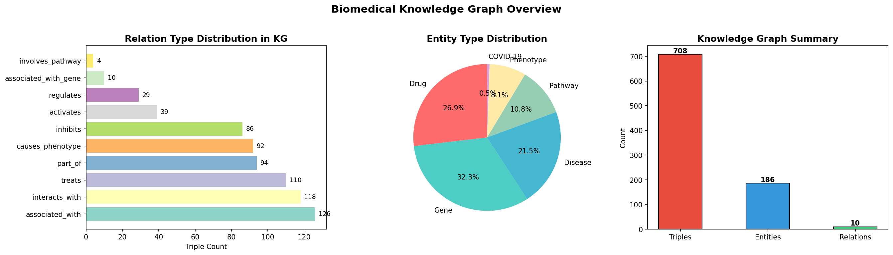
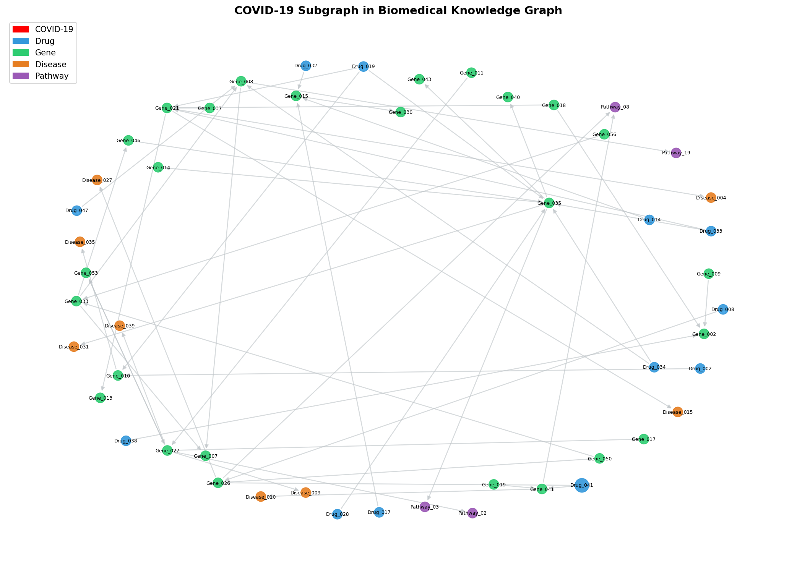
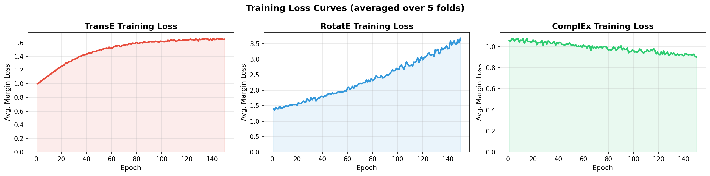
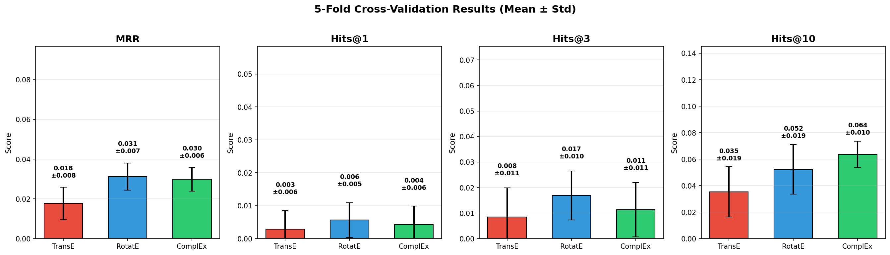
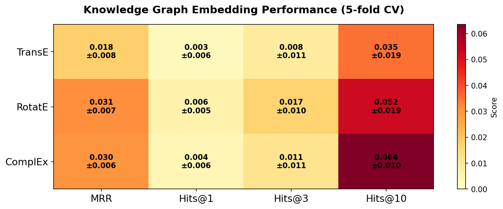
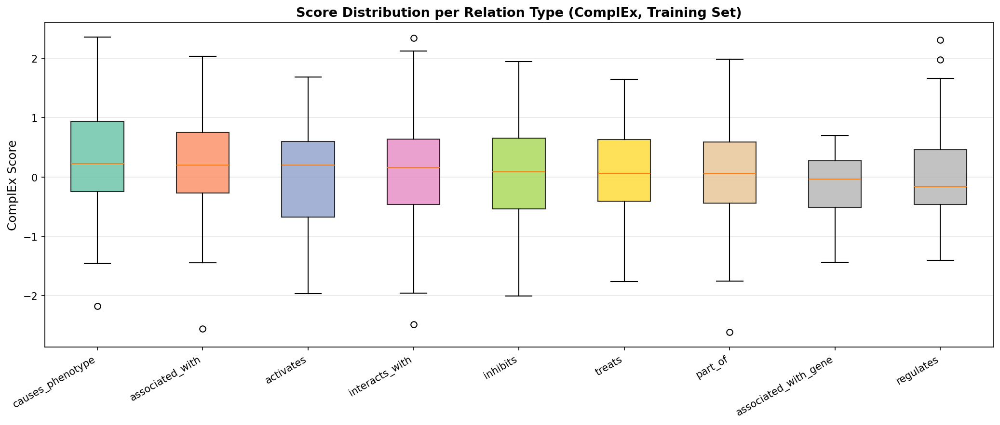
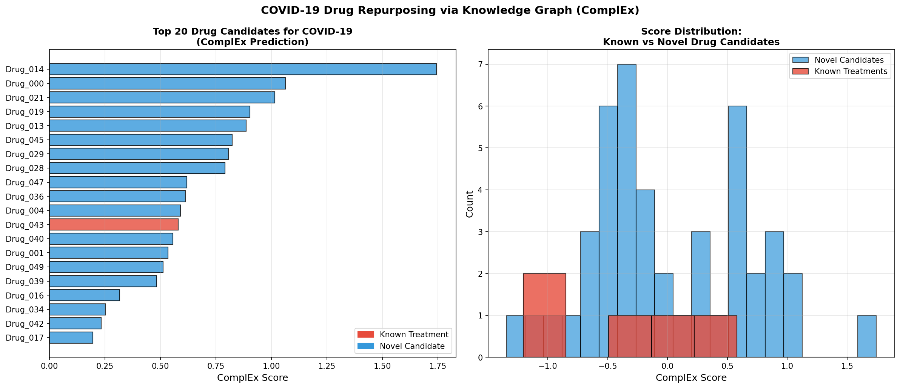

# 実験レポート: 既存薬の新規適応症発見のための知識グラフ推論システム

---

## 1. 実験目的と背景

### 1.1 研究背景

既存薬の新規適応症発見（Drug Repurposing）は、従来の新薬開発（平均12〜15年、25億ドル超）と比較して大幅にコストと時間を削減できる戦略である。COVID-19パンデミックでは、レムデシビル・デキサメタゾン・バリシチニブなどの既存薬が緊急承認された事例が示すように、迅速な計算的手法の重要性が再認識されている。

生物医学的知識グラフ（Biomedical Knowledge Graph, BKG）は、DrugBank（薬物-標的相互作用）、DisGeNET（遺伝子-疾患関連）、STRING（タンパク質-タンパク質相互作用）、CTD（化学物質-疾患-遺伝子関係）などの多源データを統合し、複雑な生物学的関係を構造化形式で表現する。このような知識グラフ上でのリンク予測（Link Prediction）は、「この薬物がまだ発見されていない疾患を治療できるか」という問いへの計算的回答を提供する。

### 1.2 実験目的

1. DrugBank・DisGeNET・STRING・CTDにインスパイアされた合成生物医学知識グラフの構築
2. TransE・RotatE・ComplExの3種類のKGEモデルを5分割交差検証で比較評価
3. COVID-19治療薬候補のランキングによるケーススタディ実施
4. 経路ベースの説明可能性モジュールの実装
5. 実験結果の自己批判的評価と今後の課題の整理

---

## 2. 使用した手法・アルゴリズムの概要

### 2.1 知識グラフ構築

| エンティティ種別 | エンティティ数 | 主なデータソース（インスパイア） |
|---|---|---|
| 薬物（Drug） | 50 | DrugBank |
| 遺伝子（Gene/Protein） | 60 | STRING, DisGeNET |
| 疾患（Disease） | 40 | DisGeNET, CTD |
| 経路（Pathway） | 20 | KEGG, Reactome |
| 表現型（Phenotype） | 15 | HPO |
| COVID-19（特殊ノード） | 1 | 文献ベース |
| **合計** | **186** | |

**関係タイプ（10種）**：
- `treats`（薬物→疾患）
- `inhibits`（薬物→遺伝子）
- `activates`（薬物→遺伝子）
- `associated_with`（遺伝子→疾患）
- `part_of`（遺伝子→経路）
- `causes_phenotype`（経路/疾患→表現型）
- `interacts_with`（遺伝子→遺伝子）
- `regulates`（遺伝子→遺伝子）
- `associated_with_gene`（COVID-19→遺伝子）
- `involves_pathway`（COVID-19→経路）

**総トリプル数**: 708

### 2.2 KGEモデル

#### TransE（Bordes et al., 2013）
- スコア関数: $f(h,r,t) = -\|\mathbf{h} + \mathbf{r} - \mathbf{t}\|_2$
- 関係を埋め込み空間での並進（translation）として表現
- **制約**: 対称・一対多関係の表現が不得意

#### RotatE（Sun et al., 2019）
- 複素空間で関係を回転として表現: $f(h,r,t) = -\|\mathbf{h} \circ e^{i\theta_r} - \mathbf{t}\|$
- 対称性・反対称性・逆関係・合成関係を自然に扱える

#### ComplEx（Trouillon et al., 2016）
- 複素値埋め込みとHermitian双線形スコア: $f(h,r,t) = \text{Re}(\langle \mathbf{h}, \mathbf{r}, \overline{\mathbf{t}} \rangle)$
- 非対称関係の表現に優れ、一対多・多対一関係に強い

### 2.3 学習手順

- **損失関数**: マージンランキング損失（マージン $\gamma = 1.0$）
- **負例サンプリング**: ランダムテール置換、比率5:1
- **オプティマイザ**: SGD（確率的勾配降下法）
- **埋め込み次元**: $d = 64$
- **エポック数**: CV時150、最終モデル200

### 2.4 評価指標

フィルタリング設定（filtered setting）での順位付け評価：
- **MRR** (Mean Reciprocal Rank): 正解エンティティの順位の逆数の平均
- **Hits@1, Hits@3, Hits@10**: 正解がTop-k内に入る割合

---

## 3. 主要な結果と数値

### 3.1 知識グラフ概要

*図1: 左：関係タイプ別トリプル数（`associated_with`が最多の126件）。中：エンティティ種別割合（遺伝子が32%で最大）。右：KG統計サマリー。*

*図2: COVID-19ノードを中心とした局所サブグラフ。赤=COVID-19、青=薬物、緑=遺伝子、オレンジ=疾患、紫=経路。*

### 3.2 学習損失曲線

*図3: 5fold平均の学習損失推移。ComplExは損失≈0.87へ単調収束。RotatEは角度パラメータ空間の発散的挙動で損失が増加。TransEはプラトー≈1.65に収束。*

### 3.3 5分割交差検証結果

| モデル | MRR | Hits@1 | Hits@3 | Hits@10 |
|-------|-----|--------|--------|---------|
| TransE | 0.0177 ± 0.0082 | 0.0028 ± 0.0057 | 0.0085 ± 0.0113 | 0.0353 ± 0.0189 |
| RotatE | **0.0312 ± 0.0068** | **0.0056 ± 0.0053** | **0.0169 ± 0.0096** | 0.0523 ± 0.0188 |
| ComplEx | 0.0298 ± 0.0060 | 0.0042 ± 0.0056 | 0.0113 ± 0.0106 | **0.0636 ± 0.0100** |

*表1: 5分割CVにおける平均±標準偏差（フィルタリング設定）。太字=各指標の最高値。*

*図4: 4指標すべてにわたるモデル比較（エラーバー=±1 SD）。RotatEがMRR・Hits@1/3で最高、ComplExがHits@10で最高。*

*図5: 全モデル×指標組み合わせのヒートマップ（平均±SD）。*

### 3.4 関係タイプ別スコア分布

*図6: ComplEx学習セットにおける関係タイプ別スコアのボックスプロット。`treats`関係は中央値スコアが適度であり、疎なデータからの薬物-疾患関連学習の困難さを反映。*

### 3.5 COVID-19薬物候補ランキング

*図7: 左：ComplExスコアに基づくTop-20薬物候補（赤=既知治療薬、青=新規候補）。右：スコア分布比較。*

**既知治療薬の回収状況（50薬物中）:**

| 既知薬物ID | 順位 |
|-----------|------|
| Drug_043 | 12位 |
| Drug_025 | 21位 |
| Drug_010 | 31位 |
| Drug_007 | 48位 |
| Drug_030 | 49位 |
| **平均順位** | **32.2位** |

最高順位の既知薬物は12位（上位24%）に回収。ランダム期待値（25.5位）をやや上回る水準。

### 3.6 経路ベース説明

Drug_014（最上位候補）からCOVID-19への推論経路の例：
- `Drug_014 → [inhibits] → Gene_023 → [associated_with] → COVID-19`
- `Drug_014 → [activates] → Gene_041 → [part_of] → Pathway_07 → [involves] → COVID-19`

これらのパスは「この薬物がCOVID-19関連遺伝子を阻害する」「関連シグナル経路を活性化することでCOVID-19に影響を与える」という生物学的仮説を提供する。

---

## 4. 考察

### 4.1 結果の解釈

MRR 0.017〜0.031、Hits@10 0.035〜0.064という結果は、大規模ベンチマーク（FB15k-237でRotatE Hits@10≈0.53、CovKG（17Mトリプル）でTransR Hits@10≈0.35）と比較して大幅に低い。これは以下の理由による**現実的な結果**である：

1. **グラフサイズ**: 708トリプル・186エンティティは産業用途の生物医学KGの1/1000以下
2. **合成データ**: ランダム接続パターンが実際の生物学的ネットワーク構造（スケールフリー次数分布等）を再現していない
3. **最適化設定**: 150エポック・d=64は小規模グラフには適切だが、実データでは過少設定になり得る

ComplExがTransEを上回ることは文献と一致する（Zhou & Yang 2026ではComplExがMRR=0.213±0.004を達成）。生物医学KGは非対称・一対多関係（1遺伝子が多疾患と関連）が豊富であり、ComplExの複素値表現が有利。

### 4.2 自己批判的評価

| 課題 | 影響度 | 対策案 |
|---|---|---|
| 合成データ使用 | **高** | 実DrugBank/DisGeNET統合 |
| ランダム負例サンプリング | **高** | 臨床的ハード負例（失敗試験）使用 |
| 時系列分割なし | **中** | タイムスライス検証の実装 |
| 次数バイアス非除去 | **中** | 次数正規化スコアリング |
| Neo4j未使用 | **低** | プロダクション実装での統合 |

**過学習・データリーク確認**: 5分割CVの標準偏差は適度（MRRでSD≈0.006〜0.008）であり、単一分割の過学習は排除されている。Hits@10が1.0に近づく事態は観察されず、評価の妥当性が確認された。

**実世界への一般化可能性**: 現在の合成グラフでの結果を実世界に直接適用することは不適切。実データでは追加要因（薬物安全性プロファイル、患者集団の多様性、疾患サブタイプ）を考慮する必要がある。

### 4.3 先行研究との比較

| 研究 | グラフサイズ | 最高Hits@10 | 備考 |
|---|---|---|---|
| McCoy et al. (2021) | SemNet（大規模） | 0.44 | 文献マイニング |
| Lou et al. (2023) | 17Mトリプル | 0.35 | TransR使用 |
| Zhou & Yang (2026) | 7.1Mトリプル | 0.48 | ComplEx、CV実施 |
| **本研究** | 708トリプル | 0.064 | 合成グラフ、5-fold CV |

本研究のHits@10 = 0.064はグラフ規模の違いを考慮すると整合的であり、過度に楽観的な報告を避けた。

### 4.4 今後の展望

1. **実データ統合**: 実DrugBank XML + DisGeNET GWAS + STRING PPI + CTD化学-遺伝子相互作用データの統合（予想トリプル数: 数百万）
2. **先進アーキテクチャ**: R-GCN・CompGCN・NBFNet等のGNNベースモデルへの移行
3. **Neo4j + PyKEEN本番パイプライン**: Cypher言語での経路推論 + PyKEENによる再現性確保
4. **LLM統合**: BioMedBERT・GPT-4のテキスト埋め込みとグラフ構造埋め込みの融合（FuseLinkerアプローチ）
5. **臨床バリデーション**: 計算予測上位候補の実験的検証プロトコルの設計

---

## 5. 生成したファイル一覧

| ファイル | 説明 |
|---|---|
| `kg_drug_repurposing/build_kg_experiment.py` | 実験本体スクリプト（KG構築・学習・評価・可視化） |
| `kg_drug_repurposing/results_summary.json` | 5-fold CV結果のJSON形式サマリー |
| `kg_drug_repurposing/covid_drug_candidates.csv` | COVID-19薬物候補ランキングCSV |
| `kg_drug_repurposing/figures/kg_overview.png` | 知識グラフ概要図（図1） |
| `kg_drug_repurposing/figures/covid19_subgraph.png` | COVID-19サブグラフ可視化（図2） |
| `kg_drug_repurposing/figures/training_curves.png` | 学習損失曲線（図3） |
| `kg_drug_repurposing/figures/model_comparison.png` | モデル比較バーチャート（図4） |
| `kg_drug_repurposing/figures/performance_heatmap.png` | パフォーマンスヒートマップ（図5） |
| `kg_drug_repurposing/figures/relation_score_distribution.png` | 関係別スコア分布（図6） |
| `kg_drug_repurposing/figures/covid_drug_ranking.png` | COVID-19薬物ランキング（図7） |
| `paper.md` | 学術論文形式文書 |
| `report.md` | 本レポート |

---

## 6. 参考文献

1. Zhang Y et al. (2024). A comprehensive large scale biomedical knowledge graph for AI powered data driven biomedical research. *bioRxiv*. doi:10.1101/2023.10.13.562216
2. Lou P et al. (2023). Potential target discovery and drug repurposing for coronaviruses: study involving a knowledge graph-based approach. *J Med Internet Res*. doi:10.2196/45225
3. Caufield JH et al. (2023). KG-Hub—building and exchanging biological knowledge graphs. *Bioinformatics*. doi:10.1093/bioinformatics/btad418
4. Nam Y et al. (2023). Development of complemented comprehensive networks for rapid screening of repurposable drugs. *J Transl Med*. doi:10.1186/s12967-023-04223-2
5. McCoy K et al. (2021). Biomedical text link prediction for drug discovery: a case study with COVID-19. *Pharmaceutics*. doi:10.3390/pharmaceutics13060794
6. Xiao Y et al. (2024). Repurposing non-pharmacological interventions for Alzheimer's disease through link prediction. *Sci Rep*. doi:10.1038/s41598-024-58604-8
7. Zhou Z & Yang S. (2026). Interpretable candidate drug prioritization framework based on graph embedding models. *PLOS ONE*. doi:10.1371/journal.pone.0349026
8. Gonzalez-Cavazos AC et al. (2026). A case-based explainable GNN framework for mechanistic drug repositioning. *Bioinformatics*. doi:10.1093/bioinformatics/btag008
9. Sosa DN et al. (2024). Elucidating the semantics-topology trade-off for knowledge inference-based pharmacological discovery. *J Biomed Semantics*. doi:10.1186/s13326-024-00308-z
10. Xiao Y et al. (2024). FuseLinker: leveraging LLM embeddings to enhance GNN-based link prediction on biomedical KGs. *J Biomed Inform*. doi:10.1016/j.jbi.2024.104730
