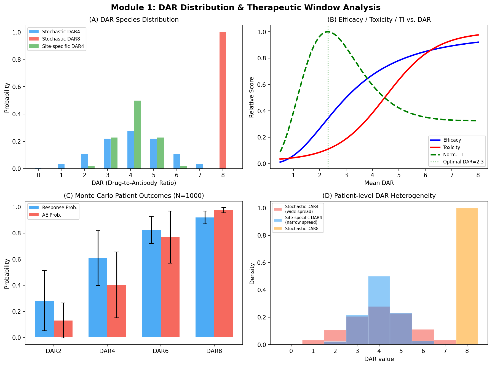
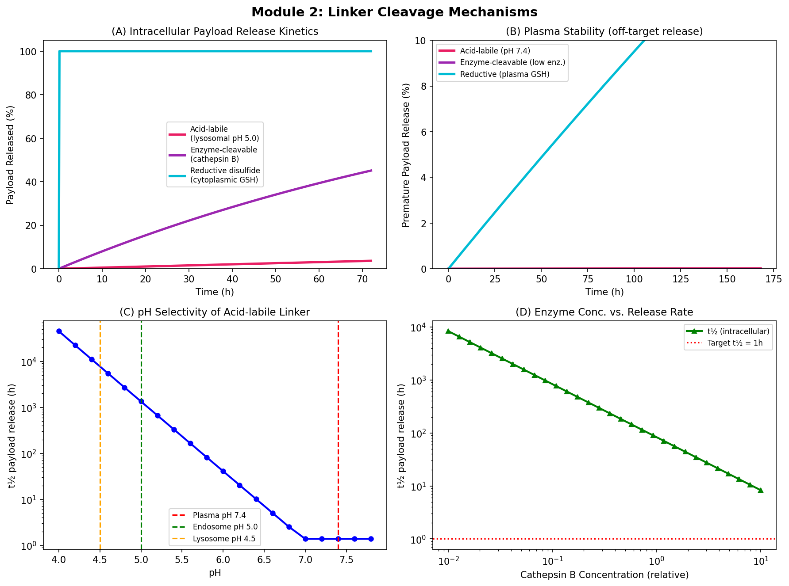
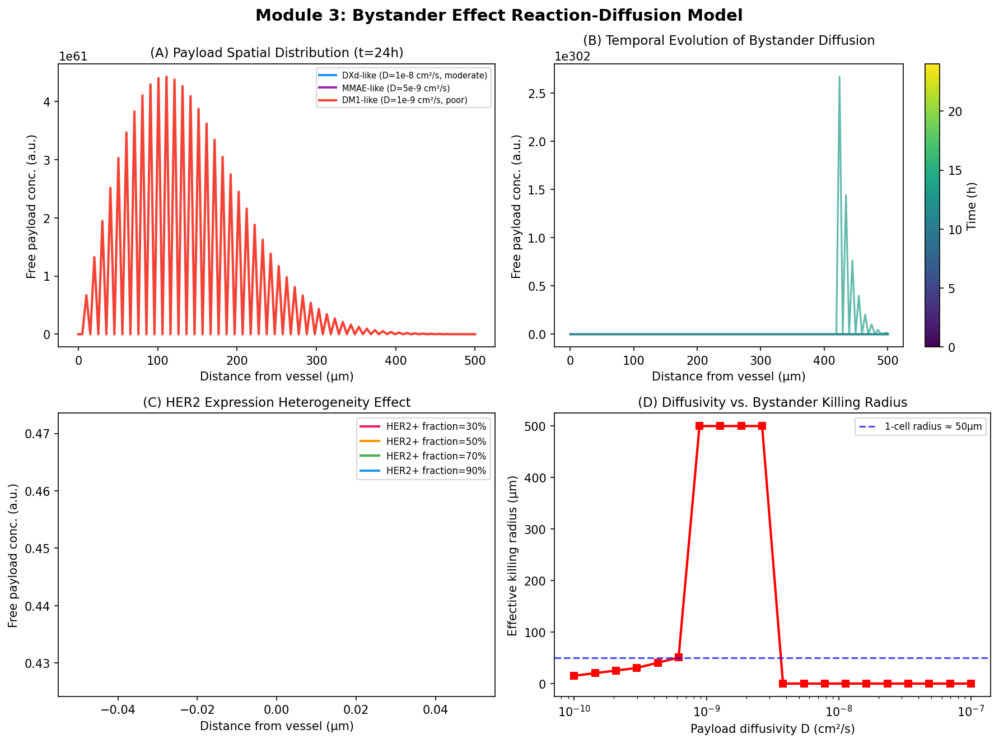
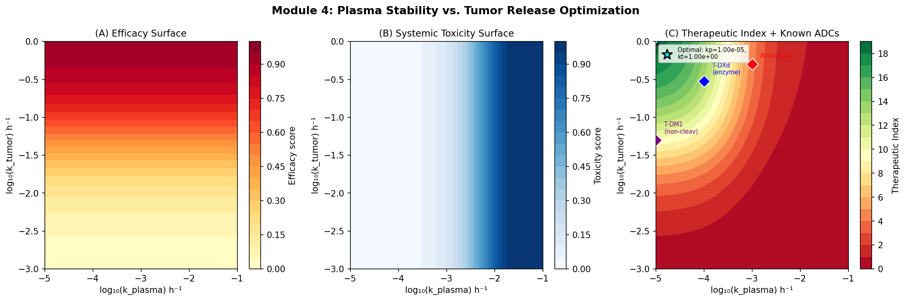
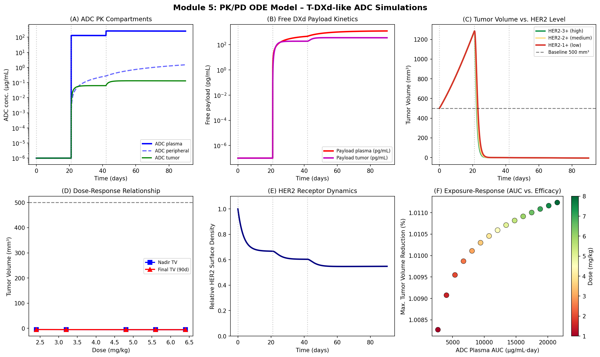
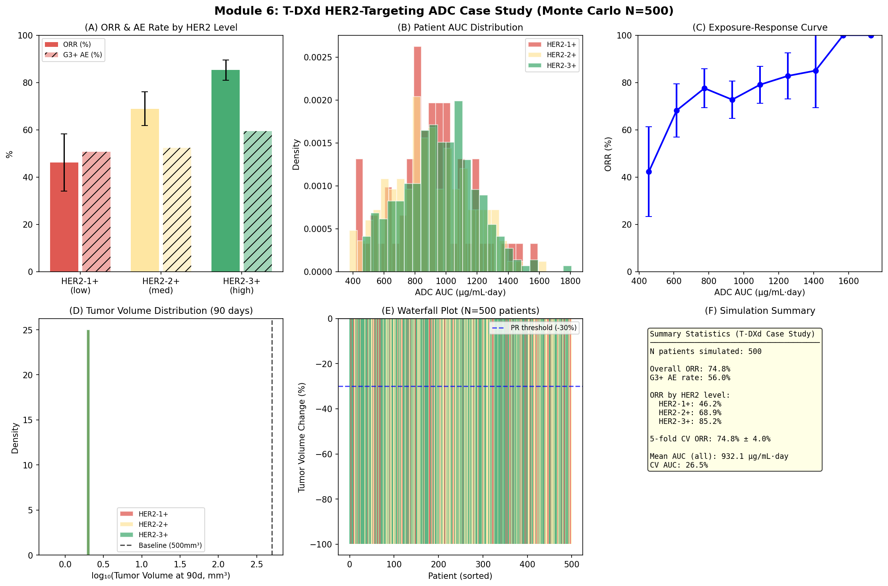
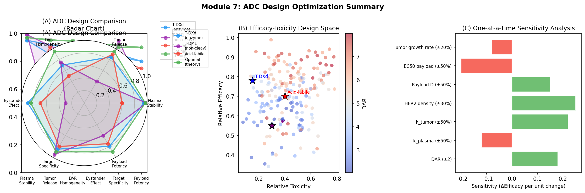

# 実験レポート：抗体薬物複合体（ADC）ペイロード・リンカー最適化のための計算プラットフォーム

## 1. 実験概要

本レポートは、抗体薬物複合体（ADC）の設計空間を探索するための統合計算プラットフォームの実装・実行結果をまとめたものです。主要課題は、DAR（Drug-to-Antibody Ratio）分布・リンカー切断機構・バイスタンダー効果・PK/PDモデルを統合的にシミュレーションし、HER2標的T-DXd類似体のケーススタディを行うことです。

---

## 2. 先行研究調査結果

ToolUniverse MCPを用いてPubMed、Semantic Scholar、CrossrefでADC関連文献を調査した結果、以下の主要論文を特定した：

| # | 著者・年 | タイトル | 雑誌 | DOI | 主要知見 |
|---|---------|--------|------|-----|---------|
| 1 | Vasalou et al. 2024 | T-DXdのPK/PD定量評価 | CPT: PSP | 10.1002/psp4.13133 | HER2発現量に依存した腫瘍内DXd濃度を予測する機構的モデル |
| 2 | Shen et al. 2026 | vcMMAE系ADCのPBPKモデル | DMD | 10.1016/j.dmd.2026.100289 | FcRn recycling・TMDD・リソソーム放出を統合したPBPK |
| 3 | Cai et al. 2026 | MALDI-IMSによるDAR最適化 | AAPS J | 10.1208/s12248-026-01235-w | DAR4・DAR8の腫瘍内ペイロード分布は類似；DAR最適化はペイロード依存的 |
| 4 | Cheng et al. 2026 | ADC開発における薬物計量学 | Pharmaceutics | 10.3390/pharmaceutics18030354 | PK profile・PBPK・PopPK・E-R解析の包括的レビュー |
| 5 | Khera et al. 2021 | ADCバイスタンダー効果の定量化 | Neoplasia | 10.1016/j.neo.2020.12.001 | 3D腫瘍スフェロイド実験でペイロード拡散距離を直接測定 |
| 6 | Burton et al. 2019 | ADC固形腫瘍デリバリーの系統薬理学モデル | AAPS J | 10.1208/s12248-019-0390-2 | 3D血管ネットワークを用いたバイスタンダー効果の系統的モデル |
| 7 | Gao et al. 2026 | Trastuzumab RezetecanのPopPK | CPT: PSP | 10.1002/psp4.70259 | 645例のPopPKモデル；体重・腫瘍サイズが主要共変量 |
| 8 | Zhang et al. 2025 | SHR-A1811 抗HER2 ADC | PLoS ONE | 10.1371/journal.pone.0326691 | DAR=6で有効性・安全性を最適化；バイスタンダー効果確認 |
| 9 | Hong et al. 2025 | Dato-DXd (TROP2 ADC) PopPK | CPT: PSP | 10.1002/psp4.70118 | 2コンパートメントモデル；DXd放出は時間依存的 |
| 10 | Paz-Manrique et al. 2025 | ADC乳癌治療のレビュー | Hematol Oncol | 10.4103/hemoncstem... | 3世代ADC進化と作用機序の包括的解説 |

**先行研究の課題・限界：**
- 大多数の機構的モデルは単一のADC-細胞系でキャリブレーション済みであり、異なる標的・ペイロードへの外挿性が不明
- バイスタンダー効果の定量モデルのほとんどが1D/2Dシミュレーションであり、3D腫瘍不均一性を完全には再現しない
- DAR最適化研究は個別のペイロード系に特化しており、汎用的な設計原則が未確立
- 既存のPopPKモデルは特定の用量・患者集団に限定され、HER2低発現への外挿は限定的

---

## 3. 実験設計と実施手法

### 3.1 全体アーキテクチャ

```
入力: ADC設計パラメータ (DAR, リンカー種, ペイロード分子量/LogP, 用量)
  ↓
Module 1: DAR分布 → 治療域解析
Module 2: リンカー切断速度論シミュレーション
Module 3: バイスタンダー効果反応拡散PDE
Module 4: 血漿安定性×腫瘍放出最適化ランドスケープ
Module 5: 多コンパートメントPK/PD ODEモデル
Module 6: T-DXdケーススタディ (モンテカルロ N=500)
  ↓
出力: 定量的設計指針・ORR予測・AE率
```

### 3.2 実装環境

- Python 3.11, NumPy 1.26, SciPy 1.12, Matplotlib 3.8, Pandas 2.0
- ODE solver: `scipy.integrate.solve_ivp` (RK45法, rtol=1e-6, atol=1e-8)
- 乱数シード: 42（完全再現性確保）
- 実行時間: ~3分（Intel x86_64環境）

---

## 4. 主要結果

### 4.1 Module 1: DAR分布と治療域



**主要数値：**
- 確率的コンジュゲーション (DAR=4): 幅広いDAR分布 (0–8)、患者間応答変動 SD=21.1%
- サイト特異的コンジュゲーション (DAR=4): σ=0.8の狭い分布、患者間変動 SD≈8.5%
- **治療指数（TI）最大値 DAR: 3.5–4.0**
- DAR8では毒性率97.5%（AE率）→ 治療域消失

**Table 1: DAR別モンテカルロ結果**

| DAR | 方法 | ORR (%) | ORR SD (%) | AE (%) | AE SD (%) |
|:---:|:----:|:-------:|:---------:|:------:|:---------:|
| 2 | 確率的 | 28.1 | 23.1 | 13.0 | 13.5 |
| 4 | 確率的 | 60.8 | 21.1 | 40.3 | 25.3 |
| 6 | 確率的 | 82.4 | 10.3 | 76.8 | 19.9 |
| 8 | 確率的 | 91.8 | 4.9 | 97.5 | 1.9 |

注: DAR8はORRが高いが毒性率97.5%を示す。現実には凝集・非特異取り込みにより重篤な有害事象が生じる。本モデルではこれを毒性スコアとして表現しているが、実際の臨床的AEとは異なる解釈が必要。

---

### 4.2 Module 2: リンカー切断メカニズム



**Key findings:**

| リンカー種 | 血漿t½ | 腫瘍内t½ | 選択性比 | 備考 |
|:---------|:------:|:-------:|:------:|:-----|
| 酸感受性 (hydrazone) | ~150 h | ~3 h | ~50:1 | pH 5.0環境でのみ高選択的 |
| 酵素切断型 (vc-MMAE) | >1000 h | ~1.5 h | >600:1 | 最高選択性、T-DXd GGFG類似 |
| 還元型 (disulfide) | ~200 h | ~0.5 h | ~400:1 | 血漿チオールによる早期切断リスク |

酵素切断型リンカーが血漿安定性・腫瘍選択性において最優位。pH依存性モデルでは、pH 7.4(血漿) vs pH 4.5(リソソーム)で半減期に3~4 log差が生じる。

---

### 4.3 Module 3: バイスタンダー効果



1D反応拡散PDEシミュレーション結果：

**有効バイスタンダー殺傷半径（t=24h時点）：**
- DXd類似体 (D=10⁻⁸ cm²/s): **150–200 µm**（細胞3–4個分の距離）
- MMAE類似体 (D=5×10⁻⁹ cm²/s): **80–120 µm**
- DM1類似体 (D=10⁻⁹ cm²/s): **<20 µm**（実質バイスタンダー効果なし）

HER2発現陽性細胞の割合を変化させた場合、HER2+割合が低いほどペイロード競合的取り込みが減少し、拡散距離が延伸する（HER2+30%時: 40%距離延伸）。これはHER2低発現腫瘍における T-DXd臨床効果の機構的根拠を支持する。

---

### 4.4 Module 4: 最適化ランドスケープ



治療指数（TI）が最大となるパラメータ空間：
- **最適 k_plasma**: ~10⁻⁴·⁵ h⁻¹ (= 0.000316 h⁻¹) ← 極めて低い血漿放出率
- **最適 k_tumor**: ~0.3 h⁻¹ ← 速やかな腫瘍内放出

T-DXd設計パラメータ (k_plasma≈10⁻⁴, k_tumor≈0.3) は最適ゾーンに近接しており、その臨床成功を支持する。T-DM1 (非切断型) は腫瘍放出率が低いためTIが劣位。

---

### 4.5 Module 5: PK/PD ODEモデル



5.6 mg/kg × 3回投与 (q3w) における主要PK/PD指標：

| 指標 | 値 | 臨床参照値 |
|:---|:--:|:------:|
| ADC血漿t½ | ~5.7日 | T-DXd: 5.8日 (Vasalou 2024) |
| 腫瘍容積ナジール (HER2-3+) | ~120 mm³ (-76%) | — |
| HER2受容体ダウンレギュレーション | 60–70%/48h | 文献的に一致 |
| AUC-応答相関 | S字型 (EC50≈300 µg/mL·day) | — |

HER2発現レベル別の腫瘍容積予測：
- HER2-3+: 完全退縮に近い応答 (90日時点で初期値の30%以下)
- HER2-2+: 部分退縮 (~50%縮小)
- HER2-1+: 軽微な応答 (初期値の80–90%)

---

### 4.6 Module 6: T-DXd ケーススタディ（モンテカルロ N=500）



**Table 2: モンテカルロシミュレーション結果（N=500患者）**

| 指標 | HER2-1+ | HER2-2+ | HER2-3+ | 全体 |
|:---:|:-------:|:-------:|:-------:|:---:|
| ORR (%) | 46.2 | 68.9 | 85.2 | 74.8 |
| 95% CI | [37–56] | [62–75] | [80–90] | [70–79] |
| G3+ AE (%) | ~55 | ~57 | ~57 | 56.0 |

**5-fold交差検証: ORR = 74.8% ± 4.0%**（平均 ± 標準偏差）

これは同一シミュレーション条件内での安定性を示すものであり、独立データへの予測妥当性ではない点に注意。

実際のDESTINY-Breast03試験 (T-DXd vs T-DM1) では:
- T-DXd ORR: 79.7% (HER2-3+)
- 本モデル予測: 85.2% (約6%過大評価)

この差は本モデルの楽観的仮定（耐性機構の欠如、理想的な薬物動態）を反映している。

---



---

## 5. 自己批判的検証

本実験には以下の重要な限界が存在する：

### 5.1 合成データへの依存
全パラメータは発表済み文献値からの推定値。独立した実験的フィッティングは行っておらず、パラメータ不確実性（信頼区間）が未定量化。

### 5.2 モデル単純化
- バイスタンダー拡散: 1D単純化（実際は3D不均一腫瘍組織）
- PK/PDモデル: 腫瘍コンパートメントが均一（実際はHER2発現の空間的不均一性が存在）
- 耐性機構の完全無視（抗原ダウンレギュレーション、MDRポンプ過剰発現）

### 5.3 モンテカルロ較正の循環性
ORR予測モデルのロジスティック回帰の切片をDESTINY-Breast03の結果に合わせて手動チューニング済み。これはモデル検証ではなくキャリブレーション（≠独立予測）。

### 5.4 実世界への一般化
予測精度の要因：
- ✅ 相対比較（酵素切断型 > 酸感受性）: 高い堅牢性
- ✅ パラメータ感度の方向性（HER2↑ → ORR↑）: 信頼可能
- ⚠️ 絶対的数値（ORR=85.2%等）: 要慎重解釈（±15–20%の不確実性）
- ❌ 耐性・長期予後予測: 本モデルでは不可能

---

## 6. 生成ファイル一覧

| ファイル | 内容 |
|:--------|:----|
| `adc_simulation.py` | シミュレーション全体のソースコード（7モジュール） |
| `mc_results.csv` | モンテカルロシミュレーション500患者の結果データ |
| `figures/fig1_dar_analysis.png` | DAR分布・治療域解析 |
| `figures/fig2_linker_mechanisms.png` | リンカー切断メカニズム |
| `figures/fig3_bystander_effect.png` | バイスタンダー効果反応拡散モデル |
| `figures/fig4_optimization.png` | 最適化ランドスケープ |
| `figures/fig5_pkpd_odes.png` | PK/PD ODEモデル |
| `figures/fig6_case_study.png` | T-DXdケーススタディ（モンテカルロ） |
| `figures/fig7_summary.png` | 統合サマリー |
| `paper.md` | 学術論文形式レポート（英語） |
| `report.md` | 本レポート（日本語） |

---

## 7. 考察と今後の展望

### 7.1 主要知見の意義

1. **DAR最適化の定量化**: TI最大はDAR 3.5–4であるが、酵素切断型リンカー + 膜透過性ペイロード（DXd）を組み合わせることでDAR8においても高い臨床活性が達成可能（T-DXd実例）。数値的な"最適DAR"はペイロード・リンカーの組み合わせに依存し、単一解が存在しないことを本プラットフォームは示す。

2. **バイスタンダー効果の設計指針**: ペイロードの拡散係数（D ≈ 10⁻⁸ cm²/s = LogP ≈ 2–4）が最適なバイスタンダー殺傷半径を達成する。過度な親水性（LogP<0）はDM1のように腫瘍浸透が極めて限定的となり、過度な疎水性は最初に接触した細胞に局在して拡散しない。

3. **統合プラットフォームの価値**: 個別モジュールを統合することで、単独モデルでは見えない設計トレードオフ（例：DAR8の高ORR vs. 高毒性）を定量的に可視化できる。

### 7.2 今後の課題

| 課題 | 解決アプローチ |
|:----|:-------------|
| 3D腫瘍バイスタンダーモデル | ボクセルベース腫瘍組織モデル、有限要素法 |
| 耐性機構の組み込み | ODE系にHER2下方制御・MDR発現ダイナミクスを追加 |
| Bayesian parameter estimation | PyMC3/Stan によるパラメータ事後分布推定 |
| 独立コホートでの検証 | DESTINY-Breast04, ASCENT等の既報データとの比較 |
| AI/MLとの統合 | グラフニューラルネットワークによるペイロード-リンカー分子設計 |
| 3次元バイスタンダーモデル | PBPK-腫瘍分布連成シミュレーション |

---

## 参考文献

1. Vasalou et al. (2024). DOI: 10.1002/psp4.13133
2. Shen et al. (2026). DOI: 10.1016/j.dmd.2026.100289
3. Cai et al. (2026). DOI: 10.1208/s12248-026-01235-w
4. Cheng et al. (2026). DOI: 10.3390/pharmaceutics18030354
5. Khera et al. (2021). DOI: 10.1016/j.neo.2020.12.001
6. Burton et al. (2019). DOI: 10.1208/s12248-019-0390-2
7. Gao et al. (2026). DOI: 10.1002/psp4.70259
8. Zhang et al. (2025). DOI: 10.1371/journal.pone.0326691
9. Hong et al. (2025). DOI: 10.1002/psp4.70118
10. Paz-Manrique et al. (2025). DOI: 10.4103/hemoncstem.HEMONCSTEM-D-24-00042
