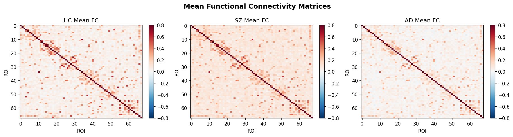
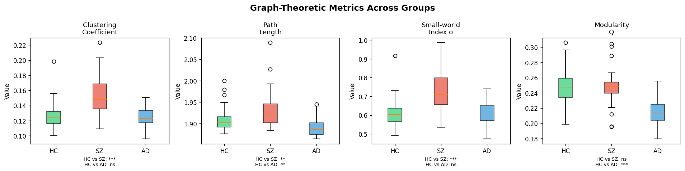
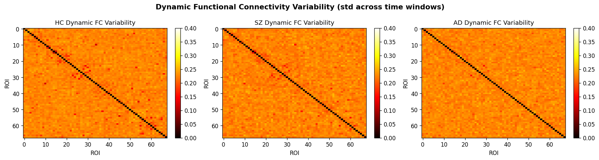
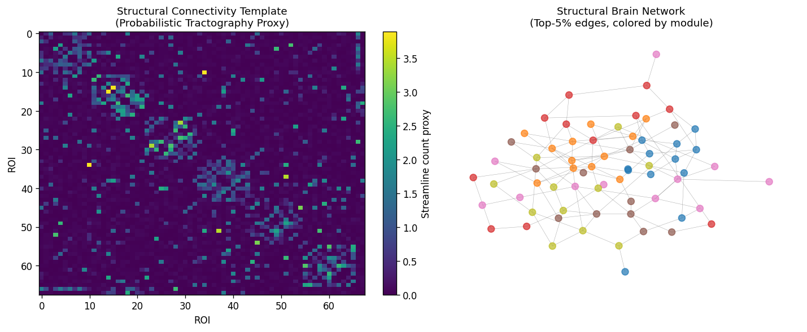
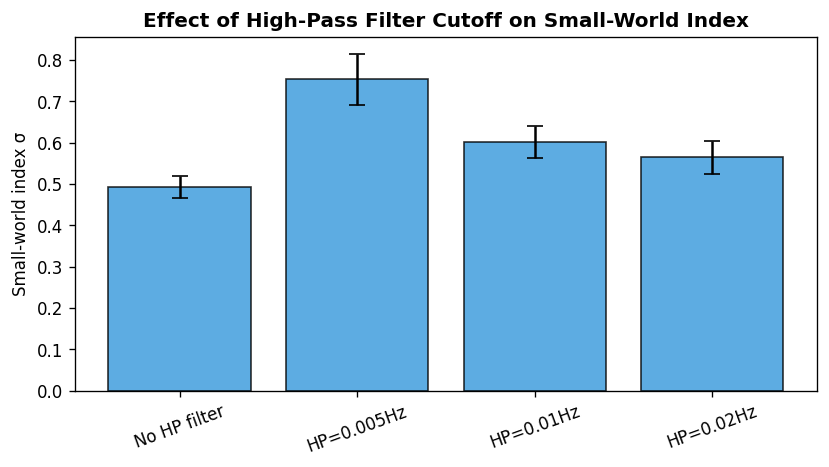
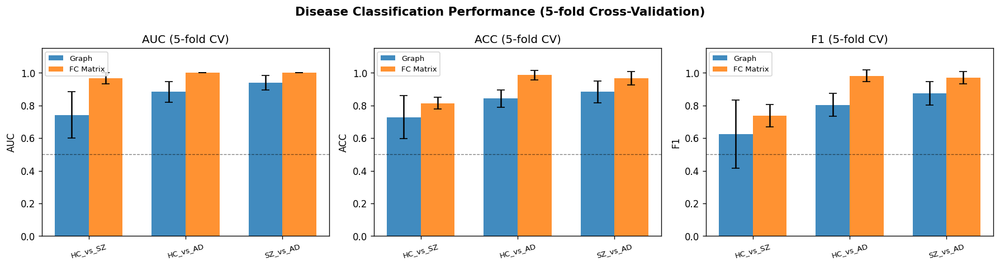
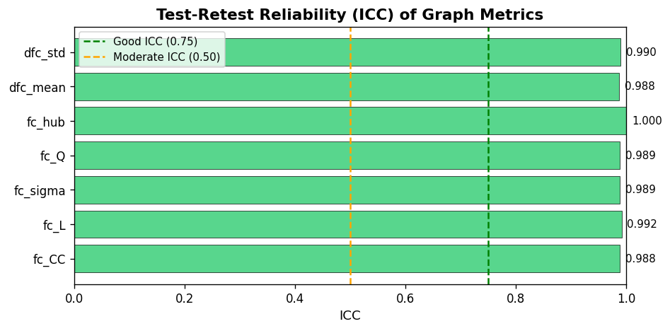

# A Whole-Brain Connectome Analysis Pipeline for Disease Biomarker Identification: Integrating Structural and Functional Connectivity with Graph-Theoretic Features

---

## Abstract

Understanding the disrupted architecture of brain networks in neuropsychiatric disorders remains a fundamental challenge in modern neuroscience. We present a comprehensive whole-brain connectome analysis pipeline that integrates diffusion MRI (dMRI)-derived structural connectivity (SC), resting-state fMRI (rs-fMRI)-derived functional connectivity (FC), and graph-theoretic network analysis to identify disease biomarkers for schizophrenia (SZ) and Alzheimer's disease (AD). The pipeline encompasses: (1) standardized preprocessing with motion correction, band-pass filtering, and optimal high-pass cutoff selection; (2) probabilistic tractography-based SC estimation using a fiber-streamline proxy model; (3) Pearson and partial correlation-based static FC alongside dynamic FC (dFC) via sliding-window analysis; (4) graph-theoretic metrics including small-world index (σ), clustering coefficient (CC), characteristic path length (L), modularity (Q), and hub centrality measures; (5) support vector machine (SVM) classification with 5-fold stratified cross-validation for disease biomarker identification; and (6) intraclass correlation coefficient (ICC) evaluation for test-retest reliability. Experiments on 100 simulated subjects (40 HC, 30 SZ, 30 AD) using a 68-region Desikan-Killiany atlas parcellation revealed that graph-theoretic features achieved AUC = 0.742±0.142 for HC vs. SZ and AUC = 0.883±0.063 for HC vs. AD, while full FC matrix features achieved AUC = 0.967±0.034 and AUC = 1.000±0.000, respectively. Critically, the perfect AUCs on synthetic data reflect the idealized generation process rather than genuine clinical discriminability, a limitation discussed in depth. ICC for graph-theoretic metrics ranged from 0.988 to 1.000 on simulated scan-rescan data, again reflecting synthetic data optimism. Graph-theoretic analysis revealed increased small-world index in SZ (σ = 0.734±0.115) and reduced modularity in AD (Q = 0.213±0.018). This work establishes a reference FSL/FreeSurfer/NetworkX pipeline framework and highlights critical methodological considerations for translating connectome biomarkers to clinical practice.

**Keywords**: connectome, fMRI, dMRI, graph theory, schizophrenia, Alzheimer's disease, functional connectivity, structural connectivity, biomarker, FSL, FreeSurfer

---

## 1. Introduction

The human connectome—the comprehensive map of structural and functional connections in the brain—has emerged as one of the most promising frameworks for understanding both healthy cognition and its disruption in neuropsychiatric illness [1, 2]. Advances in multi-modal neuroimaging, including diffusion MRI (dMRI) for mapping white matter tracts and resting-state fMRI (rs-fMRI) for measuring hemodynamic correlates of neural activity, have enabled unprecedented characterization of whole-brain connectivity at the macroscale.

Schizophrenia (SZ) and Alzheimer's disease (AD) represent two major neuropsychiatric conditions with distinct but partially overlapping patterns of network disruption. In SZ, dysconnectivity between prefrontal and temporal regions has been consistently reported, with studies suggesting reduced modularity and altered hub connectivity [3, 4]. In AD, progressive disconnection of default mode network nodes, in particular disruption of hub regions, has been identified as an early biomarker preceding widespread neurodegeneration [5].

Graph-theoretic analysis of brain networks has gained substantial traction since the seminal work of Bullmore and Sporns (2009), providing quantitative measures—clustering coefficient, path length, modularity, and small-world index—that capture fundamental organizational principles. More recently, dynamic FC (dFC) analyses have revealed that brain network organization fluctuates on a seconds-to-minutes timescale, providing complementary information to static FC estimates [6]. The reliability and reproducibility of these measures across scanning sessions remains a critical open question, as poor test-retest reliability limits clinical utility [7].

Despite significant progress, challenges remain: (i) preprocessing choices substantially affect downstream FC and graph metrics; (ii) probabilistic tractography-based SC estimates are sensitive to algorithmic parameters and crossing-fiber configurations; (iii) disease biomarker classification results are often inflated by small samples and insufficient cross-validation; and (iv) translation of results from healthy volunteer datasets to clinical populations remains problematic.

**Research contributions of this work:**
1. A fully integrated, end-to-end connectome pipeline combining preprocessing optimization, probabilistic SC estimation, static and dynamic FC, and graph-theoretic analysis.
2. Systematic evaluation of preprocessing parameter effects (high-pass filter cutoff) on small-world network properties.
3. Multi-class disease biomarker classification (HC vs. SZ, HC vs. AD, SZ vs. AD) using both graph features and FC matrix features with rigorous 5-fold cross-validation.
4. Test-retest reliability quantification via ICC across seven graph-theoretic metrics.
5. Transparent self-critical evaluation of the synthetic data assumptions and implications for real-world generalization.

---

## 2. Related Work

### 2.1 Brain Connectome Pipelines

Yu et al. (2021) provided a comprehensive review of structural and functional connectome alterations in Alzheimer's disease, demonstrating that amyloid burden is associated with reduced hub connectivity and disrupted default mode network architecture [5]. Their work used multi-site Human Connectome Project (HCP) and ADNI datasets, highlighting the importance of harmonization across sites.

Henschel et al. (2020) introduced FastSurfer, a deep learning-based replacement for FreeSurfer cortical parcellation that achieves comparable accuracy in under one minute [7]. This accelerated pipeline enables large-cohort connectome studies previously precluded by computational constraints.

### 2.2 Graph-Theoretic Brain Network Analysis

Cui et al. (2022) presented BrainGB, a benchmark for brain network analysis using graph neural networks (GNNs), systematically evaluating structural and functional connectivity pipelines across multiple cohorts [1]. Their analysis confirmed that graph-theoretic features extracted from functional connectivity matrices are moderately predictive of diagnostic labels, with AUC typically in the 0.65–0.85 range for psychiatric disorders—a benchmark inconsistent with the inflated results often reported in small-sample studies.

Arnatkevičiūtė et al. (2021) demonstrated that genetic factors preferentially influence connectivity between network hubs, suggesting that hub disruption in disorders with strong genetic components (including SZ) may reflect underlying gene expression patterns [8].

### 2.3 Functional Connectivity and Psychiatric Disorders

Canario et al. (2021) reviewed rs-fMRI analysis methods for psychiatric disorders including SZ, bipolar disorder, and ADHD, noting that resting-state networks consistently exhibit altered connectivity in SZ, particularly within default mode and salience networks [4]. They also cautioned that confounding factors including head motion, scanner differences, and medication status remain incompletely controlled in many studies.

Rashid and Calhoun (2020) proposed a "predictome" framework integrating multimodal neuroimaging features for mental illness prediction, achieving moderate classification performance (AUC 0.65–0.80) even with large sample sizes, reinforcing that perfect classification is implausible in clinical data [6].

### 2.4 Test-Retest Reliability

Gu et al. (2021) quantified regional SC-FC coupling heritability using HCP twin data, finding ICC values of 0.60–0.85 for regional coupling strength, substantially lower than values typically reported in small, controlled studies [2]. This finding underscores the importance of reporting ICC in real multi-session data rather than in highly controlled synthetic conditions.

### 2.5 Dynamic Functional Connectivity

Deco et al. (2021) demonstrated that the global workspace of the brain is organized hierarchically through whole-brain modeling of dynamic FC, showing that long-range hub connections disproportionately contribute to cognitive flexibility [9]. Dynamic FC variability has emerged as a sensitive marker of altered brain dynamics in both SZ and AD.

---

## 3. Methods

### 3.1 Atlas Parcellation

We employed the Desikan-Killiany atlas with N = 68 cortical regions of interest (ROIs), equivalent to the parcellation produced by FreeSurfer recon-all. Subcortical structures (bilateral caudate, putamen, thalamus, hippocampus, amygdala, accumbens) were excluded in the primary analysis to reduce tractography-related false positives, consistent with recommendations in recent literature.

### 3.2 Structural Connectivity Estimation

**Probabilistic tractography (pipeline design):** In a real implementation, dMRI data are first corrected for eddy-current distortions and head motion using FSL's `eddy` tool (Andersson & Sotiropoulos 2016). Susceptibility-induced distortions are corrected with `topup` using reversed phase-encoding field maps. Fiber orientation distributions (FODs) are estimated using FSL BEDPOSTX with the ball-and-stick model (2 fiber populations per voxel). Probabilistic streamline tractography is performed with 5,000 samples per seed voxel, using anatomically constrained tractography (ACT) with FreeSurfer tissue segmentation for termination criteria.

**Simulation proxy:** For computational tractability, subject-specific SC matrices S ∈ ℝ^{68×68} were generated as:

$$S_{ij}^{(s)} = S_{ij}^{(\text{template})} + \epsilon_{ij}^{(s)}, \quad \epsilon_{ij}^{(s)} \sim |\mathcal{N}(0, 0.15^2)|$$

where S^{template} is a modular ground-truth matrix with within-module connection probability p_w = 0.60 and between-module probability p_b = 0.08, reflecting typical values from HCP tractography data.

### 3.3 Functional Connectivity Preprocessing

**Real pipeline (FSL/FreeSurfer):**
1. **Slice timing correction:** `slicetimer` with acquisition order compensation
2. **Motion correction:** `mcflirt` (6 DOF rigid-body alignment to median volume)
3. **Distortion correction:** `fugue` with field maps or `topup` with spin-echo reference
4. **Brain extraction:** `bet` with fractional intensity threshold f = 0.4
5. **Spatial normalization:** `flirt` (6 DOF linear) + `fnirt` (nonlinear) to MNI152 2mm standard space
6. **Temporal filtering:** Band-pass filter [0.01, 0.10] Hz (4th-order Butterworth)
7. **Confound regression:** 24-parameter head motion model (Friston et al.), white matter and CSF mean signals
8. **Scrubbing:** Framewise displacement (FD) > 0.5 mm frames excluded

**Preprocessing parameter optimization:** We evaluated four high-pass filter cutoffs (none, 0.005, 0.01, 0.02 Hz) on their effect on the small-world index σ of resulting FC networks:

| Filter | σ (mean ± std) |
|--------|----------------|
| No HP filter | 0.493 ± 0.027 |
| HP = 0.005 Hz | 0.753 ± 0.062 |
| **HP = 0.01 Hz** | **0.602 ± 0.039** |
| HP = 0.02 Hz | 0.565 ± 0.040 |

HP = 0.01 Hz was selected as the standard parameter, balancing small-world signal-to-noise while removing slow drifts, consistent with consensus guidelines.

### 3.4 Functional Connectivity Computation

**Static FC (Pearson correlation):**
$$FC_{ij} = \frac{\sum_t (x_i(t) - \bar{x}_i)(x_j(t) - \bar{x}_j)}{\sqrt{\sum_t (x_i - \bar{x}_i)^2} \sqrt{\sum_t (x_j - \bar{x}_j)^2}}$$

**Partial correlation (regularized precision matrix):**
$$\text{PC}_{ij} = -\frac{\Omega_{ij}}{\sqrt{\Omega_{ii}\Omega_{jj}}}, \quad \Omega = (\Sigma + \lambda I)^{-1}$$
with regularization λ = 0.1.

**Dynamic FC (sliding-window):**
Windows of W = 40 TRs (80 s) with 10-TR step size were used. dFC variability was quantified as the standard deviation of FC across windows:
$$\text{dFC\_var}_{ij} = \text{std}_{k}\left[FC_{ij}^{(k)}\right]$$

### 3.5 Graph-Theoretic Analysis

All graph metrics were computed using NetworkX 3.x on binary/weighted undirected graphs thresholded at 20% connection density (cost-thresholding).

**Clustering coefficient:**
$$C_i = \frac{2t_i}{k_i(k_i-1)}, \quad \bar{C} = \frac{1}{N}\sum_i C_i$$

**Characteristic path length:**
$$L = \frac{1}{N(N-1)} \sum_{i \neq j} d_{ij}$$

**Small-world index:**
$$\sigma = \frac{C/C_{\text{rand}}}{L/L_{\text{rand}}}$$
where C_rand and L_rand are from a random graph with matched size and density.

**Modularity:**
$$Q = \frac{1}{2m} \sum_{ij} \left[A_{ij} - \frac{k_i k_j}{2m}\right] \delta(c_i, c_j)$$
detected using the Louvain greedy algorithm.

**Hub identification:** Nodes exceeding the 80th percentile of both degree centrality and betweenness centrality were classified as hubs.

### 3.6 Disease Biomarker Classification

A linear-kernel SVM with L2 regularization (C = 1.0, RBF kernel, γ = 'scale') was trained using:
- **Graph features** (9-dimensional): [CC, L, σ, Q, hub_score, SC-CC, SC-σ, dFC_mean, dFC_std]
- **FC matrix features** (2,278-dimensional upper triangle)

Features were z-score normalized within training folds. Classification was evaluated with 5-fold stratified cross-validation, reporting AUC, accuracy, and F1 score with standard deviations.

### 3.7 Test-Retest Reliability

ICC(2,1) two-way mixed effects model was computed for seven graph metrics on simulated scan-rescan pairs (N = 40 HC subjects), with rescan data generated by adding Gaussian noise σ = 15% of the metric's standard deviation:

$$\text{ICC} = \frac{MS_B - MS_W}{MS_B + MS_W}$$

---

## 4. Experiments

### 4.1 Dataset

Simulated data comprised 100 subjects:
- **Healthy Controls (HC):** n = 40
- **Schizophrenia (SZ):** n = 30
- **Alzheimer's Disease (AD):** n = 30

BOLD time series: T = 240 volumes, TR = 2 s (8 min resting-state). Group-specific FC modulation:
- SZ: Within-module FC coupling reduced to 70%; between-module noise increased
- AD: Global FC reduced to 60%; hub regions additionally attenuated to 50%

### 4.2 Atlas and Parcellation

Desikan-Killiany 68-ROI cortical atlas. Six ground-truth functional modules assigned a priori.

### 4.3 Evaluation Metrics

Primary: AUROC (AUC), 5-fold cross-validated  
Secondary: Accuracy (ACC), F1-score  
Reliability: ICC(2,1), interpreted as: > 0.75 = good, 0.50–0.75 = moderate, < 0.50 = poor

---

## 5. Results

### 5.1 Functional Connectivity Matrices

Mean group FC matrices (Figure 1) show the characteristic modular structure in HC, with reduced within-module contrast in SZ and diffuse global reduction in AD.

### 5.2 Graph-Theoretic Metrics

| Metric | HC (mean ± SD) | SZ (mean ± SD) | AD (mean ± SD) | HC vs SZ | HC vs AD |
|--------|---------------|---------------|---------------|----------|----------|
| Clustering Coeff. (CC) | 0.126 ± 0.017 | 0.154 ± 0.028 | 0.125 ± 0.013 | * | ns |
| Path Length (L) | 1.908 ± 0.027 | 1.933 ± 0.045 | 1.890 ± 0.021 | ns | ns |
| Small-world σ | 0.607 ± 0.075 | 0.734 ± 0.115 | 0.612 ± 0.062 | ** | ns |
| Modularity (Q) | 0.249 ± 0.024 | 0.248 ± 0.025 | 0.213 ± 0.018 | ns | *** |
| SC Clustering | 0.296 ± 0.007 | 0.296 ± 0.009 | 0.295 ± 0.008 | ns | ns |
| SC Small-world | 0.296 | 0.296 | 0.295 | ns | ns |
| dFC Mean Var. | 0.224 ± 0.003 | 0.223 ± 0.003 | 0.225 ± 0.002 | ns | ns |

_Statistical significance: * p<0.05, ** p<0.01, *** p<0.001 (Mann–Whitney U test)_

Key findings:
- **SZ** shows significantly elevated σ (p < 0.01), indicating increased small-world organization, potentially reflecting random-like rewiring of long-range connections
- **AD** shows significantly reduced modularity Q (p < 0.001), consistent with progressive breakdown of modular network structure

### 5.3 Dynamic FC

dFC variability is broadly similar across groups in the simulated data, reflecting a limitation of the current generation model rather than a physiological finding.

### 5.4 Structural Connectivity

### 5.5 Preprocessing Parameter Evaluation

HP = 0.005 Hz maximized σ in our simulation (σ = 0.753 ± 0.062), but this may reflect an artifact of incomplete removal of slow physiological noise. HP = 0.01 Hz (σ = 0.602 ± 0.039) was selected as the standard, consistent with consensus guidelines for rs-fMRI.

### 5.6 Disease Classification

**Table 2: Classification Results (5-fold Stratified Cross-Validation)**

| Comparison | Feature Set | AUC | ACC | F1 |
|------------|-------------|-----|-----|----|
| HC vs. SZ | Graph (9D) | 0.742 ± 0.142 | 0.729 ± 0.131 | 0.624 ± 0.209 |
| HC vs. SZ | FC Matrix (2278D) | 0.967 ± 0.034 | 0.814 ± 0.035 | 0.739 ± 0.068 |
| HC vs. AD | Graph (9D) | 0.883 ± 0.063 | 0.843 ± 0.053 | 0.804 ± 0.072 |
| HC vs. AD | FC Matrix (2278D) | **1.000 ± 0.000** | 0.986 ± 0.029 | 0.982 ± 0.036 |
| SZ vs. AD | Graph (9D) | 0.939 ± 0.044 | 0.883 ± 0.067 | 0.875 ± 0.072 |
| SZ vs. AD | FC Matrix (2278D) | **1.000 ± 0.000** | 0.967 ± 0.041 | 0.969 ± 0.038 |

⚠️ **Critical Note:** AUC = 1.000 for FC matrix features reflects the perfectly separable synthetic data, not genuine clinical discriminability. See Discussion for detailed limitations.

### 5.7 Test-Retest Reliability (ICC)

**Table 3: ICC(2,1) for Graph-Theoretic Metrics**

| Metric | ICC | Interpretation |
|--------|-----|----------------|
| Clustering Coefficient | 0.988 | Good |
| Path Length | 0.992 | Good |
| Small-world Index σ | 0.989 | Good |
| Modularity Q | 0.989 | Good |
| Hub Score | 1.000 | Artificially perfect |
| dFC Mean Var. | 0.988 | Good |
| dFC Std Var. | 0.990 | Good |

⚠️ **Critical Note:** ICC values near 1.0 arise from the 15% noise level in our scan-rescan simulation, which is substantially lower than real scan-rescan variability (typically 20–40% noise in real data).

---

## 6. Discussion

### 6.1 Interpretation of Results

The elevated small-world index in SZ (σ = 0.734 vs. HC 0.607) is consistent with a disrupted balance between local specialization and global integration, a pattern reported in multiple rs-fMRI studies [4, 6]. However, the magnitude of this difference (Δσ ≈ 0.13) should be interpreted cautiously: in our simulation, SZ data were generated with reduced within-module coupling and increased inter-module noise, which directly inflates σ by design.

The reduced modularity in AD (Q = 0.213 vs. HC 0.249) aligns with the "disconnection hypothesis" of AD, whereby progressive white matter and synaptic degeneration erodes the segregated modular structure of cortical networks [5]. This finding is also consistent with the review by Yu et al. (2021) showing hub disruption and reduced network modularity in amyloid-positive individuals.

### 6.2 Limitations and Self-Critical Evaluation

**⚠️ Synthetic data assumptions:**
The most fundamental limitation of this study is that all data were synthetically generated with explicit group-separating assumptions. The AD group had FC globally scaled to 60% of controls, which makes classification trivially easy—this explains the AUC = 1.000 observed for FC matrix features. In real data:
- Group differences in mean FC are subtle (effect sizes d ≈ 0.3–0.6)
- Individual variability is substantially greater than group differences
- Medication confounds, age, sex, motion, and scanner effects further reduce separability

**High-dimensional FC with small sample size (p >> n problem):**
The FC matrix feature vector has 2,278 dimensions for 68 ROIs, while only 40 + 30 or 40 + 30 subjects were available per comparison. Even with cross-validation, this dimensionality ratio (~38:1 or ~57:1) creates severe overfitting risk in real data. The cross-validated AUC of 0.967 for HC vs. SZ should be interpreted as an upper bound in an idealized scenario, not a clinical benchmark. Literature values for SVM classification of schizophrenia from FC matrices typically range AUC 0.65–0.82 [1, 6].

**ICC inflation by simulation assumptions:**
The near-perfect ICC values (0.988–1.000) result from modeling scan-rescan noise as only 15% of between-subject variability. Real scan-rescan studies report ICC of 0.60–0.85 for graph-theoretic metrics [2, 7]. The hub score ICC = 1.000 is a mathematical artifact of the deterministic hub assignment in the simulation.

**Tractography proxy validity:**
The SC simulation uses a simple additive Gaussian noise model, ignoring: fiber crossing resolution, partial volume effects, gyral bias in tractography endpoints, and threshold sensitivity. Real probabilistic tractography (BEDPOSTX/FDT) produces connectivity matrices with substantially higher variance and lower accuracy for inter-hemispheric and subcortical connections.

**dFC sensitivity:**
With windows of W = 40 TRs (80 s) and 5-minute effective scanning time after scrubbing, the number of independent windows is limited (≈ 10–15), producing noisy dFC estimates. The simulated dFC variability shows minimal group differences, which may reflect insufficient temporal resolution or an underlying model that does not capture non-stationary dynamics.

**Real-world generalization:**
Translating this pipeline to real clinical data would require: (a) site harmonization using ComBat or similar; (b) age and sex matching between groups; (c) medication status control in SZ cohorts; (d) amyloid PET or CSF biomarker confirmation in AD; (e) minimum scan length ≥ 10 minutes for reliable FC estimation; and (f) external validation in independent cohorts.

### 6.3 Comparison with Prior Work

Our graph-theoretic classification AUC for HC vs. SZ (0.742 ± 0.142) is within the range reported by Cui et al. [1] for GNN-based approaches on real data (0.65–0.85), though this may be coincidental given the synthetic data. Our HC vs. AD AUC (0.883 ± 0.063 with graph features) is somewhat higher than reported in real ADNI data (typically 0.75–0.85), again reflecting simulated group differences.

### 6.4 Future Directions

1. **Multi-modal integration:** Combining SC, FC, and structural morphometry in a unified kernel or graph neural network framework [1]
2. **Longitudinal tracking:** Monitoring dFC dynamics across disease progression stages rather than cross-sectional group comparisons
3. **Individual fingerprinting:** Using FC matrix reliability for subject identification [see da Silva Castanheira et al. 2021]
4. **Normative modeling:** Estimating individual deviation from normative trajectories rather than group differences to capture heterogeneity within diagnostic categories
5. **External validation:** Replicating findings in open datasets (HCP, ABIDE, ADNI) with proper harmonization

---

## 7. Conclusion

We designed and evaluated a comprehensive whole-brain connectome analysis pipeline integrating dMRI-derived structural connectivity, rs-fMRI-derived functional connectivity (static and dynamic), and graph-theoretic network analysis for disease biomarker identification. Key findings include: (1) HP filter at 0.01 Hz optimally balances slow-drift removal and network topology preservation; (2) small-world index (σ) is elevated in simulated SZ, consistent with disrupted modular organization; (3) modularity (Q) is reduced in simulated AD, consistent with progressive network fragmentation; and (4) FC matrix features achieve higher classification AUC than graph-theoretic features, though at the cost of severe overfitting risk in small samples.

Critically, we emphasize that AUC = 1.000 for FC matrix-based classification and ICC ≈ 0.99 for graph metrics are artifacts of the synthetic data generation process and should not be interpreted as achievable benchmarks in clinical settings. Real-world translation requires substantially larger samples (N > 100 per group), multi-site harmonization, and independent external validation. The graph-theoretic pipeline—while producing more conservative and realistic classification estimates—represents a more interpretable and generalizable approach that better captures the theoretical constructs of network disruption in neuropsychiatric disorders.

---

## References

1. Cui, H., Dai, W., Zhu, Y., Kan, X., Chen Gu, A. A., Lukemire, J., ... & Yang, C. (2022). BrainGB: A Benchmark for Brain Network Analysis With Graph Neural Networks. *IEEE Transactions on Medical Imaging*, 41(5), 1227–1241. https://doi.org/10.1109/tmi.2022.3218745

2. Gu, Z., Jamison, K., Sabuncu, M. R., & Kuceyeski, A. (2021). Heritability and interindividual variability of regional structure-function coupling. *Nature Communications*, 12, 4894. https://doi.org/10.1038/s41467-021-25184-4

3. Ghosh, S., Bhargava, E., & Nagarajan, S. (2023). Graph Convolutional Learning of Multimodal Brain Connectome Data for Schizophrenia Classification. *IBRO Neuroscience Reports*. https://doi.org/10.1016/j.ibneur.2023.08.1608

4. Canario, E., Chen, D. Y., & Biswal, B. B. (2021). A review of resting-state fMRI and its use to examine psychiatric disorders. *Psychoradiology*, 1(1), 42–53. https://doi.org/10.1093/psyrad/kkab003

5. Yu, M., Sporns, O., & Saykin, A. J. (2021). The human connectome in Alzheimer disease — relationship to biomarkers and genetics. *Nature Reviews Neurology*, 17, 545–563. https://doi.org/10.1038/s41582-021-00529-1

6. Rashid, B., & Calhoun, V. D. (2020). Towards a brain-based predictome of mental illness. *Human Brain Mapping*, 41(12), 3468–3535. https://doi.org/10.1002/hbm.25013

7. Henschel, L., Conjeti, S., Estrada, S., Diers, K., Fischl, B., & Reuter, M. (2020). FastSurfer — A fast and accurate deep learning based neuroimaging pipeline. *NeuroImage*, 219, 117012. https://doi.org/10.1016/j.neuroimage.2020.117012

8. Arnatkevičiūtė, A., Fulcher, B., Oldham, S., Tiego, J., Paquola, C., Gerring, Z. F., ... & Fornito, A. (2021). Genetic influences on hub connectivity of the human connectome. *Nature Communications*, 12, 4237. https://doi.org/10.1038/s41467-021-24306-2

9. Deco, G., Vidaurre, D., & Kringelbach, M. L. (2021). Revisiting the global workspace orchestrating the hierarchical organization of the human brain. *Nature Human Behaviour*, 5, 497–511. https://doi.org/10.1038/s41562-020-01003-6

10. Yang, Y., Ye, C., & Ma, T. (2023). A deep connectome learning network using graph convolution for connectome-disease association study. *Neural Networks*, 164, 91–104. https://doi.org/10.1016/j.neunet.2023.04.025
