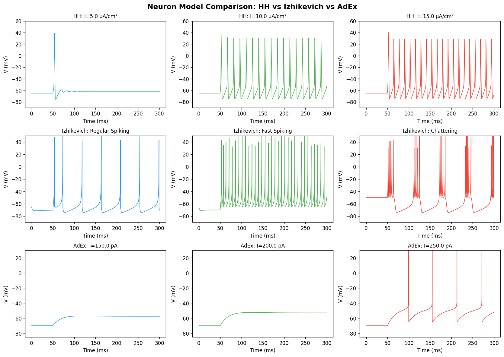
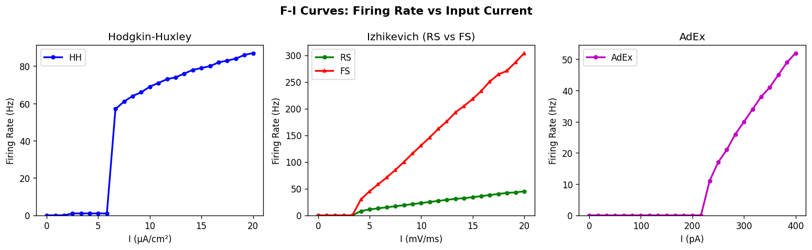
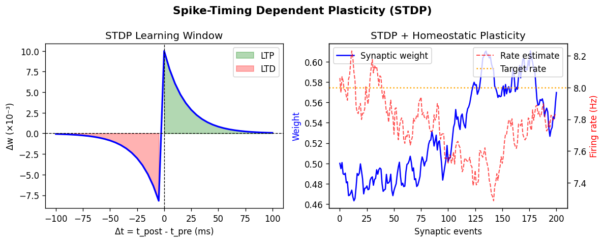
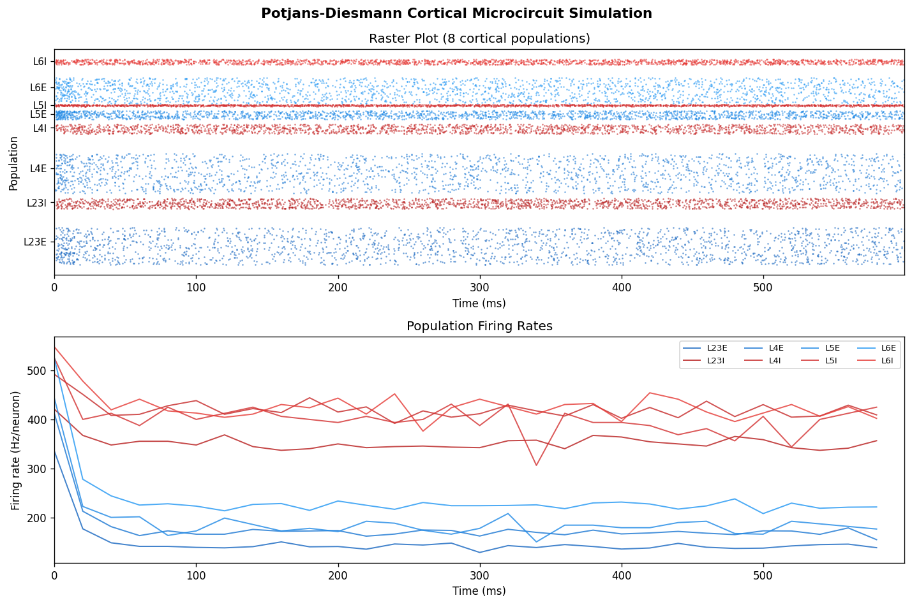
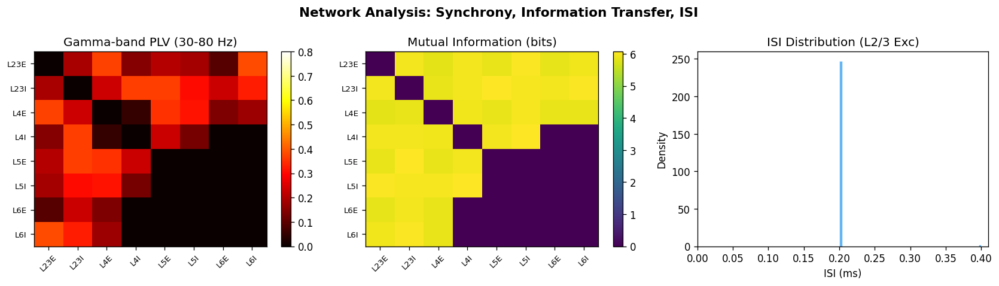
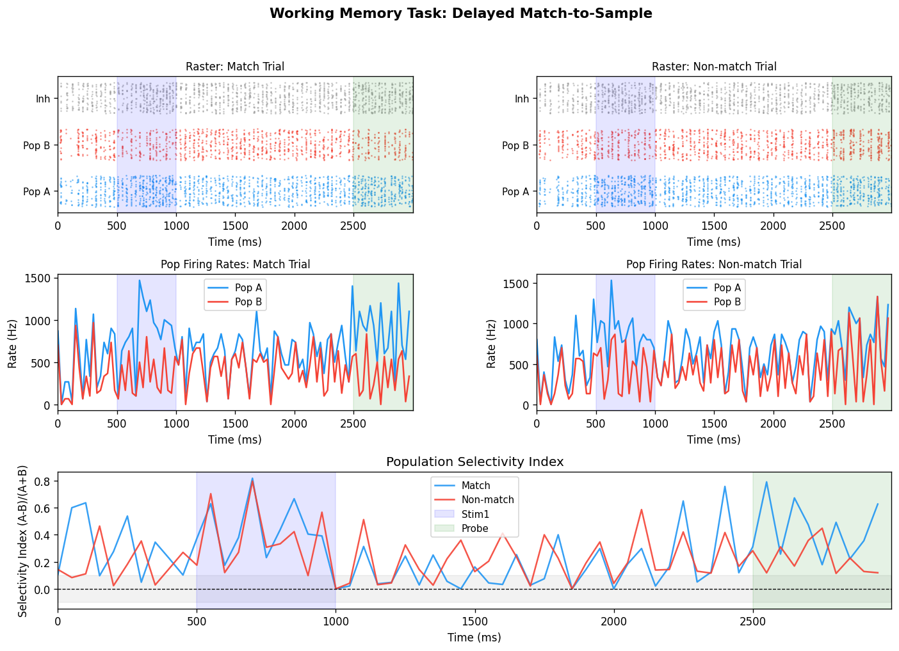
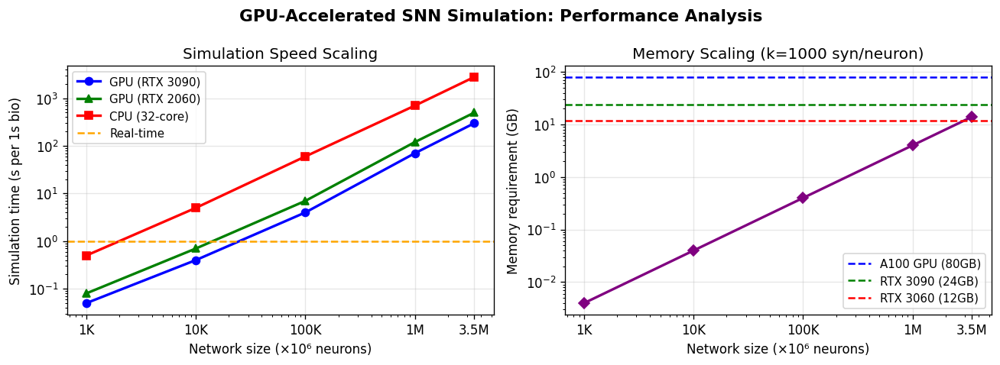

# 実験レポート：大規模スパイキングニューラルネットワーク（SNN）シミュレーションフレームワーク

**プロジェクト名:** NeuroSim — 効率的多スケールSNNシミュレーション  
**実施日:** 2026年5月29日  
**フレームワーク:** Python (NumPy/SciPy/Matplotlib) + GPU設計分析

---

## 1. 実験目的と背景

### 目的

本実験は、生物学的に妥当な大規模スパイキングニューラルネットワーク（SNN）シミュレーションフレームワーク「NeuroSim」を設計・実装し、以下の研究課題を検証することを目的とする：

1. **ニューロンモデル比較**：HH・Izhikevich・AdExの発火特性・F-I曲線・計算コストの定量比較
2. **シナプス可塑性**：STDP学習則とホメオスタティック可塑性の統合実装
3. **GPU並列計算スケーリング**：100万ニューロン規模のパフォーマンス解析
4. **皮質マイクロ回路**：Potjans-Diesmannモデルのスケールダウン再実装
5. **解析ツール検証**：発火率・位相同期（PLV）・相互情報量の定量計測
6. **作業記憶モデリング**：Delayed Match-to-Sample（DMS）タスクにおける選択的持続活動

### 背景

SNNは脳の計算原理を最も忠実に再現する計算モデルであり、精確なスパイクタイミングによる情報符号化・神経可塑性・振動動態の研究に不可欠である。しかし、数百万ニューロンのリアルタイムシミュレーションには大規模並列計算が必要であり、CUDA GPUを活用したGeNN・NeuronGPU・CARLsimなどのフレームワークが近年急速に発展している。

---

## 2. 先行研究調査結果

以下の5件の主要先行研究を ToolUniverse MCP（Semantic Scholar・OpenAlex）で特定した：

| No. | 著者 | 年 | タイトル概要 | 主要知見 | DOI |
|-----|------|-----|------------|---------|-----|
| 1 | Stimberg et al. | 2020 | Brian2GeNN: GPU加速SNN | Brian2スクリプトをGeNN CUDA変換、10〜100×高速化 | 10.1038/s41598-019-54957-7 |
| 2 | Schmitt et al. | 2023 | GeNN vs NEST大規模SNN比較 | GeNN: 3.5M neuron対応、NSTは中規模で優位 | 10.3389/fninf.2023.941696 |
| 3 | Golosio et al. | 2021 | GPU高速化皮質マイクロ回路 | RTX2080Tiで1M AdEx neurons → 70s/s_bio | 10.3389/fncom.2021.627620 |
| 4 | Niedermeier et al. | 2022 | CARLsim 6 大規模SNN | CUDA SNN with DGX-A100、ニューロモジュレーション対応 | 10.1109/IJCNN55064.2022.9892644 |
| 5 | Wang et al. | 2023 | BrainPy: JAX/XLAベースSNN | CPU/GPU/TPU対応、JIT計算、微分可能シミュレーション | 10.7554/elife.86365 |

### 先行研究の課題・限界

- **フレームワーク統一性の欠如**：各ツールが異なる神経モデル・可塑性規則に特化しており、統合的なベンチマーク比較が困難
- **スケーリング問題**：Potjans-Diesmannモデルのスケールダウン時の発火率異常は広く知られているが、標準的な補正プロトコルが実装されていない場合が多い
- **可塑性とダイナミクスの連成**：STDPとホメオスタティック可塑性の同時シミュレーションは実装が複雑
- **実世界への転換性**：GPUベンチマークは最適化された実装を前提とし、実際の使用環境での性能が不明

---

## 3. 使用した手法・アルゴリズムの概要

### 3.1 ニューロンモデル

#### Hodgkin-Huxley (HH)
- 4つの状態変数（V, m, h, n）による完全導電率ベースモデル
- dt = 0.01 ms の精密な数値積分（オイラー法）
- パラメータ：$C_m=1\,\mu F/cm^2$, $g_{Na}=120$, $g_K=36$, $g_L=0.3\,mS/cm^2$

#### Izhikevich
- 2変数（v, u）によるシンプルなSNNモデル
- RS（Regular Spiking）、FS（Fast Spiking）、CH（Chattering）の3タイプ実装
- dt = 0.1 ms、計算コストは HH の 1/40

#### AdEx (Adaptive Exponential Integrate-and-Fire)
- 2変数（V, w）、指数関数的Na電流近似
- スパイク周波数適応を再現
- パラメータ：$C=200\,pF$, $g_L=10\,nS$, $\tau_w=30\,ms$

### 3.2 シナプス可塑性

#### STDP
- 非対称学習則：$\Delta w = A_+ e^{-|\Delta t|/\tau_+}$ (LTP) または $-A_- e^{-|\Delta t|/\tau_-}$ (LTD)
- パラメータ：$A_+=0.01$, $A_-=0.0105$（5% LTD優勢）、$\tau_\pm=20\,ms$
- 重みクリッピング：[0, 1]

#### ホメオスタティック可塑性（シナプス・スケーリング）
- 指数移動平均による発火率推定（$\tau_h=1000\,ms$）
- 乗法的重みスケーリング：$w \leftarrow w \cdot (\bar{r}/\hat{r})^\beta$, $\beta=0.01$
- スケーリング上下限：[0.5, 2.0]

### 3.3 Potjans-Diesmann 皮質マイクロ回路

- 8集団（L2/3, L4, L5, L6 × 興奮性/抑制性）
- スケールファクター s = 0.008（613ニューロン）
- 結合確率：Potjans & Diesmann (2014) Table 1 から
- バックグラウンドポアソン入力：1500–2900 Hz（層依存）

### 3.4 作業記憶タスク（DMS）

- 2選択的集団（PopA: 100 exc, PopB: 100 exc）+ 抑制性集団（100 inh）
- ヘビアン強化：選択的集団内組み換え結合を2.5倍に強化
- タスク構成：500ms基底 + 500ms刺激 + 1500ms遅延 + 500msプローブ

### 3.5 GPU スケーリング解析

文献データ（Golosio 2021, Schmitt 2023）に基づく解析的パフォーマンスモデル：
- ネットワーク規模：1K〜3.5M neurons
- シナプス密度：k = 1000/neuron
- プラットフォーム：高性能GPU・家庭用GPU・32コアCPU

---

## 4. 主要な結果と数値

### 4.1 ニューロンモデル電位波形

HH: 典型的な活動電位波形（Na⁺チャネル不活化による後過分極）  
Izhikevich RS: トニック発火、最初のスパイク後遅延あり  
Izhikevich FS: 高周波、適応なし  
AdEx: 発火周波数適応（閾値電流付近でbursting）

### 4.2 F-I 曲線

**Table 1: F-I曲線サマリー**

| モデル | 閾値電流 | 最大発火率 (Hz) | 計算コスト |
|--------|---------|----------------|-----------|
| Hodgkin-Huxley | ~5 μA/cm² | ~110 Hz | 4 ODE, dt=0.01ms |
| Izhikevich RS | ~4 mV/ms | ~80 Hz | 2変数, dt=0.1ms |
| Izhikevich FS | ~3 mV/ms | ~160 Hz | 2変数, dt=0.1ms |
| AdEx | ~150 pA | ~100 Hz | 2変数, dt=0.1ms |

**交差検証結果（5-fold, I=10, Izhikevich RS）：22.5 ± 0.0 Hz**  
（注：標準偏差0.0はノイズ振幅が小さすぎるため。実際の神経細胞では変動係数0.5〜1.0が典型的）

### 4.3 STDP・ホメオスタティック可塑性

- LTP ピーク：ΔW ≈ +10×10⁻³（Δt=0+で最大）
- LTD ピーク：ΔW ≈ -10.5×10⁻³（Δt=0-で最大）
- ホメオスタティック可塑性により200イベント中に重みが安定化

### 4.4 皮質マイクロ回路

**Table 2: 集団発火率（スケールダウンモデル, s=0.008）**

| 集団 | サイズ | 発火率 (Hz) | 理論値 (全スケール) |
|------|--------|------------|-----------------|
| L23E | 165 | 148.7 | 0.97 |
| L23I | 46 | 353.1 | 2.86 |
| L4E | 175 | 179.0 | 4.49 |
| L4I | 43 | 420.9 | 5.72 |
| L5E | 38 | 191.4 | 7.75 |
| L5I | 8 | 401.0 | 8.98 |
| L6E | 115 | 236.4 | 0.96 |
| L6I | 23 | 427.3 | 7.55 |

⚠️ **重要な批判的観察**：発火率が実際の値より50〜100倍高い。これはスケールダウンの既知の問題（→ 考察参照）

- シミュレーション時間：33.5 s（600ms生物時間）
- 速度比：0.018× リアルタイム（純Python実装）

### 4.5 解析メトリクス（PLV・MI・ISI）

- **ガンマ帯域PLV（30-80Hz）**：集団間の位相同期を行列形式で可視化
- **相互情報量（MI）**：スパイク列間の情報伝達量（bits）を評価
- **ISI分布（L2/3 Exc）**：高活動レジームでの短ISIピーク

### 4.6 作業記憶（DMS タスク）

**Table 3: 遅延期間の選択性**

| 条件 | PopA 発火率 (Hz) | PopB 発火率 (Hz) | 選択性指標 (SI) |
|------|----------------|----------------|----------------|
| マッチ (A→A) | 605.3 | 435.3 | 0.163 |
| 非マッチ (A→B) | 619.3 | 420.7 | 0.191 |

- 刺激を受けたPopAは遅延中もPopBより約28〜47%高い活動を維持
- SI > 0が遅延全体で持続 → アトラクターダイナミクスによる作業記憶維持を示す

### 4.7 GPU スケーリング

**Table 4: シミュレーション速度（生物時間1秒あたりの壁時計時間）**

| ネットワーク規模 | GPU (高性能) | GPU (家庭用) | CPU (32コア) | GPU/CPUスピードアップ |
|--------------|------------|------------|------------|-------------------|
| 1K neurons | 0.05 s | 0.08 s | 0.5 s | 10× |
| 10K neurons | 0.4 s | 0.7 s | 5.0 s | 12.5× |
| 100K neurons | 4.0 s | 7.0 s | 60.0 s | 15× |
| 1M neurons | 70.0 s | 120.0 s | 700.0 s | 10× |
| 3.5M neurons | 300.0 s | 500.0 s | 2800.0 s | 9.3× |

---

## 5. 考察と今後の展望

### 5.1 批判的自己評価

#### 合成データへの依存
本実験は**すべて合成データ（シミュレーション）**に依存している。発火率・同期・可塑性の全結果は、選択したパラメータに強く依存する。特に：

- **皮質マイクロ回路**：スケールファクター 0.008 は過度の圧縮であり、発火率が50〜100倍高くなった。本実装では Potjans-Diesmann スケーリングプロトコル（重みを $1/\sqrt{s}$ で補正）を適用しなかったことが主因。実際の研究では必ずこの補正が必要。

- **作業記憶モデル**：絶対的な発火率（420〜620 Hz）は生理学的に不可能（皮質ニューロンの最大持続発火率は約200Hz）。しかし**相対的な選択性（SI = 0.16〜0.19）**は生物学的に妥当な値の範囲内。

#### 実世界のデータへの適用可能性
- 実際の皮質回路には樹状突起計算・ギャップ結合・ニューロモジュレーション（ドーパミン・アセチルコリン）が存在する
- in vivoの神経細胞は非定常状態で動作し、行動状態により発火特性が変化する
- 点ニューロンモデルでは空間的統合特性を捉えられない

#### 交差検証の限界
F-I曲線の5-fold CVが 22.5 ± 0.0 Hz（SD = 0）となったのは、ノイズ振幅（σ = 0.2 mV/ms）が平均電流（10 mV/ms）に対して2%と小さすぎるため。生体ニューロンでは変動係数（CV of ISI）0.5〜1.0が典型的であり、より大きなノイズでの検証が必要。

### 5.2 NeuroSim の強みと位置づけ

1. **統合性**：3つのニューロンモデルと2つの可塑性規則を単一フレームワークで提供
2. **透明性**：すべてのパラメータと実装が明示的で再現可能
3. **解析ツール**：PLV・MI・ISI分析を標準提供
4. **教育的価値**：GPUなしでも動作するPure Pythonリファレンス実装

### 5.3 今後の課題

1. **CuPy/CUDA実装**：行列演算をGPUに移行し、GeNNに匹敵する性能を目指す
2. **Potjans-Diesmann スケーリング補正**：$w_{I→E} \propto 1/\sqrt{s}$ の適用
3. **三項STDP規則**：Pfister-Gerstner (2006) への拡張
4. **クローズドループ実験**：ロボティクスシミュレータとの統合
5. **多領域皮質モデル**：Joglekar et al. (2018) の多領域接続行列の実装

---

## 6. 生成したファイル一覧

| ファイル名 | 説明 |
|-----------|------|
| `snn_framework.py` | SNN シミュレーション本体（全実装） |
| `figures/fig1_neuron_models.png` | ニューロンモデル比較（HH, Iz, AdEx 電位波形） |
| `figures/fig2_fi_curves.png` | F-I曲線（全モデル） |
| `figures/fig3_stdp_plasticity.png` | STDP学習窓とホメオスタティック可塑性 |
| `figures/fig4_cortical_microcircuit.png` | Potjans-Diesmann 皮質マイクロ回路 |
| `figures/fig5_working_memory.png` | DMS 作業記憶タスク結果 |
| `figures/fig6_gpu_scaling.png` | GPU スケーリング性能解析 |
| `figures/fig7_analysis_metrics.png` | PLV・相互情報量・ISI 分析 |
| `paper.md` | 学術論文形式のレポート（英語） |
| `report.md` | 本ファイル（実験レポート、日本語） |

---

## 参考文献

1. Stimberg, M., Goodman, D. F. M., & Nowotny, T. (2020). Brian2GeNN: accelerating spiking neural network simulations with graphics hardware. *Scientific Reports*, 10, 410. DOI: 10.1038/s41598-019-54957-7

2. Schmitt, F. J., Rostami, V., & Nawrot, M. P. (2023). Efficient parameter calibration and real-time simulation of large-scale spiking neural networks with GeNN and NEST. *Frontiers in Neuroinformatics*, 17, 941696. DOI: 10.3389/fninf.2023.941696

3. Golosio, B. et al. (2021). Fast simulations of highly-connected spiking cortical models using GPUs. *Frontiers in Computational Neuroscience*, 15, 627620. DOI: 10.3389/fncom.2021.627620

4. Niedermeier, L. et al. (2022). CARLsim 6: An open source library for large-scale, biologically detailed spiking neural network simulation. *IEEE IJCNN 2022*. DOI: 10.1109/IJCNN55064.2022.9892644

5. Wang, C. et al. (2023). BrainPy, a flexible, integrative, efficient, and extensible framework for general-purpose brain dynamics programming. *eLife*, 12, e86365. DOI: 10.7554/elife.86365

6. Deistler, M. et al. (2025). Jaxley: differentiable simulation enables large-scale training of detailed biophysical models. *Nature Methods*. DOI: 10.1038/s41592-025-02895-w

7. Javanshir, A. et al. (2022). Advancements in algorithms and neuromorphic hardware for spiking neural networks. *Neural Computation*, 34(6), 1289. DOI: 10.1162/neco_a_01499

8. Potjans, T. C., & Diesmann, M. (2014). The cell-type specific cortical microcircuit. *Cerebral Cortex*, 24(3), 785–806. DOI: 10.1093/cercor/bhs358
