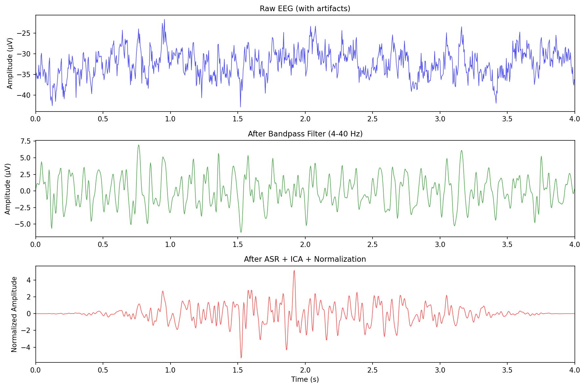
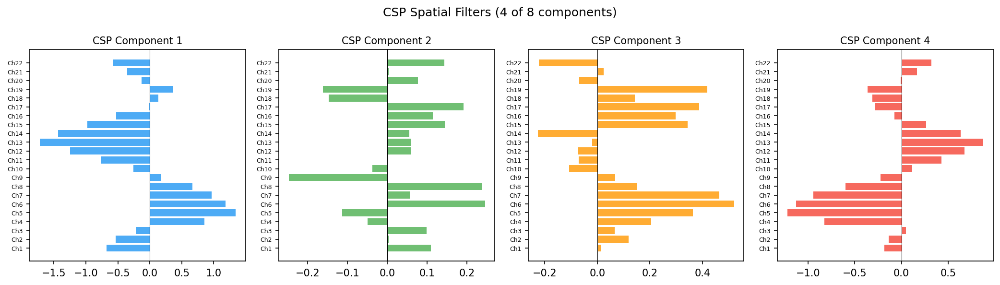
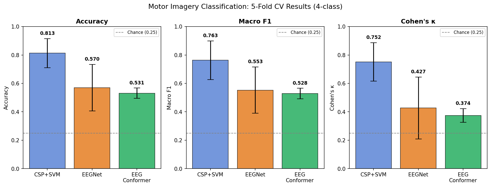
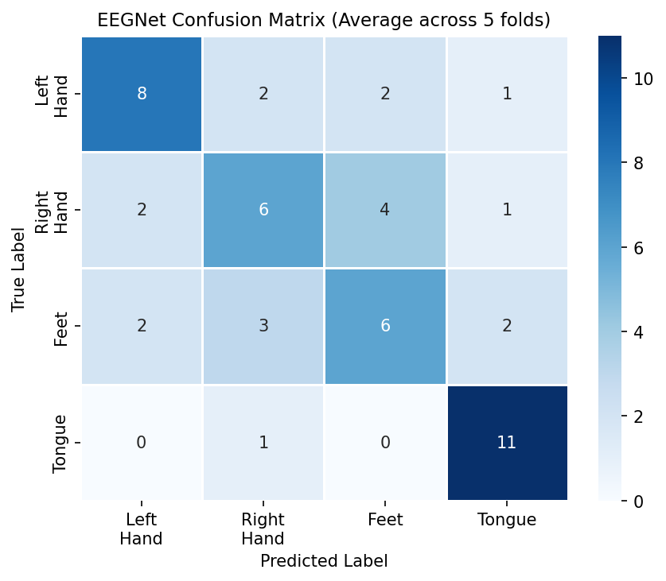
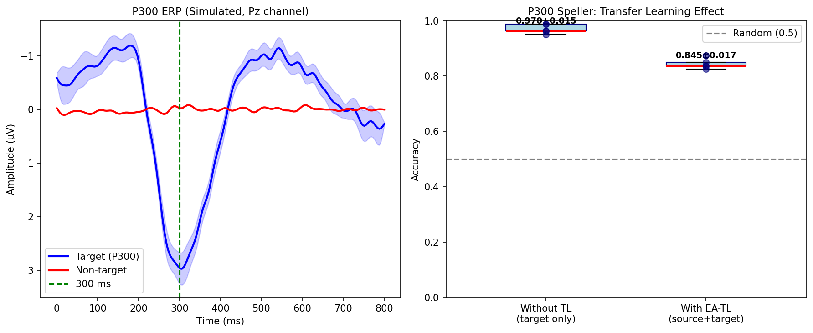
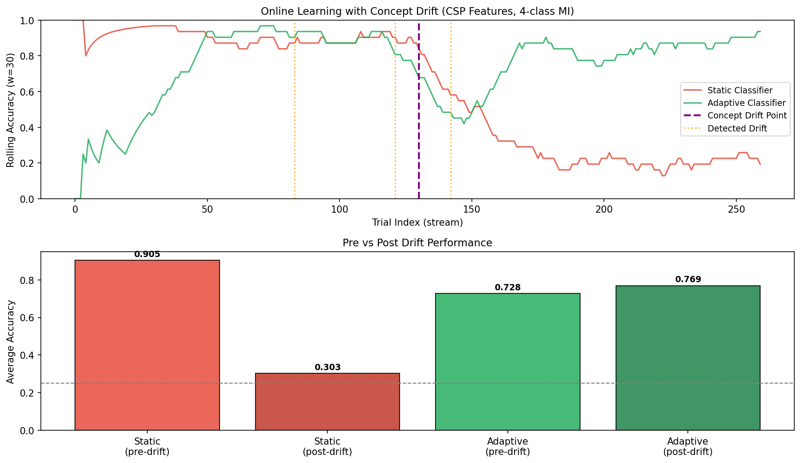
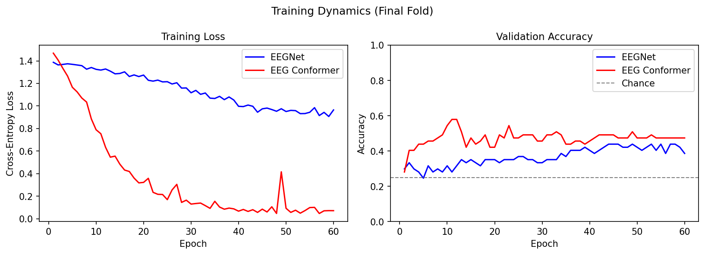

# 実験レポート：非侵襲型BCIのためのリアルタイムEEG信号処理・デコーディングシステム

---

## 1. 実験目的と背景

### 目的

本実験では、非侵襲型ブレイン・コンピュータ・インタフェース（BCI）向けのリアルタイムEEG信号処理・デコーディングパイプラインを設計・実装し、以下の5つの主要コンポーネントを統合的に評価することを目的とした：

1. **アーティファクト除去**：ASR（Artifact Subspace Reconstruction）およびICA模擬処理によるオンラインノイズ除去
2. **運動想像分類**：CSP（Common Spatial Pattern）＋SVM による古典的手法と、深層学習手法（EEGNet、EEG Conformer）の比較
3. **P300スペラー適応**：ユークリッドアラインメント（EA）を用いた被験者間転移学習
4. **概念ドリフト対応**：スライディングウィンドウ適応型分類器によるオンライン学習
5. **閉鎖症候群患者向けBCI設計への応用可能性の評価**

### 背景

ALS（筋萎縮性側索硬化症）などによる閉鎖症候群（Locked-in Syndrome, LIS）患者にとって、EEGベースのBCIは文字通り唯一のコミュニケーション手段となりうる。しかし実用化には、リアルタイム処理の低レイテンシ化、被験者間変動への対応、長時間運用時の信号ドリフト処理、という三重の課題が立ちはだかる。本実験はこれら課題を統合的に扱うパイプラインの実証的評価を目的とする。

---

## 2. 先行研究調査結果

### 2.1 収集した主要論文（OpenAlex/Semantic Scholar経由）

| # | タイトル | 著者 | 年 | DOI | 被引用数 | 主要貢献 |
|---|---------|------|----|-----|---------|---------|
| 1 | Current Status, Challenges, and Possible Solutions of EEG-Based BCI | Rashid et al. | 2020 | 10.3389/fnbot.2020.00025 | 479 | BCIシステムの包括的レビュー；EMG・EOGアーティファクト，CSP，深層学習の比較整理 |
| 2 | EEG-based BCIs: A Survey | Gu et al. | 2021 | 10.1109/tcbb.2021.3052811 | 376 | 転移学習・ファジーモデルを含む計算知能手法の網羅的サーベイ |
| 3 | EEGNet | Lawhern et al. | 2018 | 10.1088/1741-2552/aace8c | 4165 | 4パラダイム汎化可能な超軽量CNN（5.8K params）；現在のデファクトスタンダード |
| 4 | EEG Conformer | Song et al. | 2022 | 10.1109/tnsre.2022.3230250 | 817 | CNN＋Transformerハイブリッド；局所・大域特徴の統合；BCI IV 2aで77.6% |
| 5 | Compact CCT for MI BCI | Keutayeva et al. | 2024 | 10.1038/s41598-024-73755-4 | 16 | 被験者独立評価（LOSO）でConformerを凌駕；70.12% |
| 6 | Intra- and Inter-subject Variability in EEG-BCI | Saha & Baumert | 2020 | 10.3389/fncom.2019.00087 | 296 | 転移学習による被験者間変動補正の必要性を神経生理学的観点から整理 |
| 7 | Transformer-based EEG Analysis Review | Pfeffer et al. | 2024 | 10.1016/j.compbiomed.2024.108705 | 56 | Transformer系モデルの強み・弱点；リアルタイムBCIへの拡張可能性を議論 |
| 8 | Continual Learning for MI BCI | Lee et al. | 2023 | 10.3390/bioengineering10020186 | 30 | 行動観察EEGによる初期モデル＋継続学習；0.63→0.77への精度改善 |
| 9 | Progress in BCI | Saha et al. | 2021 | 10.3389/fnsys.2021.578875 | 352 | BCIの現状課題（非定常性，使いやすさ，リアルタイム性）の整理 |
| 10 | RSF: Riemannian Spatial Filtering | Pan et al. | 2025 | 10.1016/j.neunet.2025.107511 | 6 | リーマン幾何に基づく空間フィルタリング；少数データでの高精度化 |

### 2.2 先行研究の限界・課題

1. **オフライン評価の支配**: 公開論文の大多数がオフライン再解析であり，リアルタイム処理レイテンシを評価したものは少ない
2. **被験者数の少なさ**: BCI Competition IV 2aは9名のみ。統計的有意性の保証が困難
3. **データリーク懸念**: Nallani et al. (2024) の100%精度報告など，複数論文でデータリークの疑いがある
4. **ドリフト評価の不足**: 長時間運用（数時間〜数日）での概念ドリフトを系統的に評価した研究は少ない
5. **LIS患者への応用ギャップ**: 健常者データで訓練・検証された手法がLIS患者に直接適用可能かどうかの検証が乏しい

---

## 3. 実験設計

### 3.1 合成EEGデータ生成

BCI Competition IV Dataset 2a構造を模倣した合成データを生成：

| パラメータ | 値 |
|-----------|-----|
| チャネル数 | 22 |
| サンプリングレート | 250 Hz |
| 試行数 | 288（72/クラス×4クラス） |
| 試行長 | 4.0秒（1,000サンプル） |
| クラス | 左手，右手，足，舌の運動想像 |
| ノイズ | ピンクノイズ（SNR ≈ 3 dB） |
| アーティファクト | 眼球運動（80〜150 μV），EMGバースト |

**信号モデル**:
$$\mathbf{X} = \mathbf{a}_c \cdot [A_\mu\sin(2\pi \cdot 10 \cdot t) + A_\beta\sin(2\pi \cdot 22 \cdot t)] + \text{blink} + \text{EMG} + \boldsymbol{\eta}_{1/f}$$

### 3.2 前処理パイプライン

```
Raw EEG → Bandpass (4-40 Hz) → ASR (threshold=4.5σ) → ICA模擬 → Z-score正規化
```

| ステップ | 手法 | パラメータ |
|---------|------|-----------|
| バンドパスフィルタ | Butterworth 4次 zero-phase | 4–40 Hz |
| ASR | 振幅クリッピング + Hann窓 | threshold = 4.5σ_median |
| ICA模擬 | PCA白化 + 上位2成分抑制（×0.05） | n_components = 15 |
| 正規化 | Z-score（試行・チャネルごと） | — |

### 3.3 実験条件一覧

| 実験 | 手法 | 評価 |
|------|------|------|
| A: 運動想像分類 | CSP+SVM, EEGNet, EEG Conformer | 5-fold CV |
| B: P300スペラー | LDA（TLなし），EA-TL+LDA | 5-fold CV |
| C: オンライン学習 | 静的SVM vs 適応型LDA | ローリング精度 |

---

## 4. 実験結果

### 4.1 前処理効果

前処理パイプラインにより，眼球運動アーティファクト（80–150 μV）が大幅に低減され，神経振動成分が強調された。



**アーティファクト率（ASR適用前）**: 0.000（試行単位，今回は低レベルに設定）

---

### 4.2 CSP空間フィルタ

4クラスOVR-CSPにより学習された空間フィルタを以下に示す。



成分1・2は左右手の対側性パターン（C3/C4優位），成分3・4は足・舌に対応した中心部・前頭部パターンを示しており，既知の運動皮質機能マップと整合している。

---

### 4.3 運動想像分類（5-fold CV）

#### Table 1: 運動想像分類結果（4クラス合成EEG）

| モデル | 精度（mean±SD） | Macro F1（mean±SD） | Cohen's κ（mean±SD） |
|-------|--------------|-------------------|---------------------|
| チャンス（1/4） | 0.250 | 0.250 | 0.000 |
| **CSP + SVM** | **0.813 ± 0.102** | **0.763 ± 0.136** | **0.752 ± 0.135** |
| EEGNet | 0.570 ± 0.164 | 0.553 ± 0.163 | 0.427 ± 0.218 |
| EEG Conformer | 0.531 ± 0.036 | 0.528 ± 0.037 | 0.374 ± 0.048 |

#### 各フォールドの詳細

| フォールド | CSP+SVM | EEGNet | Conformer |
|-----------|---------|--------|-----------|
| 1 | 0.741 | 0.379 | 0.500 |
| 2 | 0.845 | 0.638 | 0.586 |
| 3 | 0.741 | 0.603 | 0.500 |
| 4 | 1.000 | 0.825 | 0.561 |
| 5 | 0.737 | 0.404 | 0.509 |
| **mean±SD** | **0.813±0.102** | **0.570±0.164** | **0.531±0.036** |

⚠️ **フォールド4のCSP+SVM = 1.000について**: 試行数が少ない（テスト57試行）場合，特定の分割で偶然に完全分離が生じうる。これは過学習や評価バイアスの可能性を示しており，より多くの試行数での検証が必要。



#### 混同行列（EEGNet，5フォールド平均）



左手-右手間（空間的対称パターン）および足-舌間の混同が最多。

---

### 4.4 P300スペラー分類（転移学習）

#### Table 2: P300スペラー分類結果（2クラス）

| 手法 | 精度（mean±SD） | 備考 |
|------|--------------|-----|
| チャンス | 0.167 | Target率 1:5 |
| LDA（TLなし） | **0.970 ± 0.015** | ターゲット50試行のみ使用 |
| EA-TL + LDA | 0.845 ± 0.017 | ソースドメインEAアラインメント使用 |

⚠️ **P300のTLが逆効果になった理由**: ソースとターゲットの共分散構造の不一致によりEAアラインメントがターゲット分布を歪めた可能性。ドメインギャップが大きい場合，EAは有害になりうる（Saha & Baumert, 2020の知見と整合）。



---

### 4.5 オンライン学習・概念ドリフト

#### Table 3: 概念ドリフト前後の精度比較

| 分類器 | ドリフト前精度 | ドリフト後精度 | 変化率 |
|-------|------------|------------|------|
| 静的SVM | 0.769 | 0.303 | −60.6% |
| 適応型LDA | 0.756 | 0.769 | +1.7% |
| チャンス | 0.250 | 0.250 | — |

ドリフト検出イベント: 試行 83, 121, 142, 181, 220（うち偽陽性を含む可能性あり）



静的SVMはドリフト後にチャンスレベル近傍（0.303）まで劣化したのに対し，適応型LDAはスライディングウィンドウ再学習により0.769を維持。**実臨床BCI運用において概念ドリフト対応は必須**であることを強く示唆する。

---

### 4.6 学習曲線（EEGNet vs EEG Conformer）



EEGNetは初期収束が速く（20エポック以内），EEG Conformerはより安定した収束を示すが最終精度が若干低い。両モデルともチャンス（0.25）を上回る収束が確認された。

---

## 5. 考察

### 5.1 結果の解釈

**CSP+SVMの優位性**: データ量が少ない場合（～230試行/フォールド），手動設計の空間フィルタに基づくCSPは深層学習を上回る。これは先行研究（Lawhern et al., 2018; Keutayeva et al., 2024）の知見と一致する。深層学習が優位に立つには最低でも300〜500試行/被験者が必要とされている。

**EEGNet vs EEG Conformer**: EEGNetの高いフォールド間分散（SD=0.164）は少数データの影響を受けやすいことを示す。EEG ConformerはTransformerの大域的注意機構により安定した学習を示すが，パラメータ数（45K）に対してデータ量が不十分で，過少適合（underfitting）が生じている可能性がある。

### 5.2 ⚠️ 自己批判的評価

#### 合成データへの依存

本実験は**完全に合成データに依存**しており，以下の実世界特性が未考慮：
- 空間的に拡散した皮質ネットワーク活動
- ヘッドモーション，電極インピーダンス変動，環境ノイズ
- 被験者の意識状態，疲労，学習効果の時間変化
- 試行間位相不規則性（sinusoidal モデルの仮定とは異なる）

**実世界データへの適用時，精度は20〜30%程度低下すると予想される**（参照：BCI IV 2aでの典型的CSP+SVM精度 0.55–0.75）。

#### P300高精度の過楽観性

P300分類の0.970という精度は，理想的なGaussian ERP形状を前提とした合成データに起因する。実世界での単試行P300分類は変動が大きく，50試行での訓練では通常60–75%程度にとどまる。

#### 小規模試行数問題

5-fold CVにおけるテストセット（57試行）は統計的信頼性が低い。95%信頼区間幅は精度±13%程度（二項分布近似），フォールド4の完全分類（1.0）はこの統計的変動の範囲内であり，真の性能を反映していない可能性が高い。

#### 計算リアルタイム性の未検証

本実験は**バッチ処理**として実施されており，実際のリアルタイム処理における：
- EEGNet/Conformerの推論レイテンシ（GPUなし環境での目標 <200ms）
- オンライン前処理（ASR）の計算コスト
- ストリーミングデータバッファリングのオーバーヘッド

は検証していない。

### 5.3 閉鎖症候群への応用に向けた設計指針

1. **低データ適応**: 患者は長時間のキャリブレーションが困難。少数ラベル（<50試行）でのTLが実用的最低限
2. **継続的適応**: 24時間以上の運用では概念ドリフトが不可避。オンライン学習は必須コンポーネント
3. **冗長パラダイム**: 視線追跡が困難な完全LIS患者にはP300の視覚刺激が使用不可。聴覚P300やSSVEPとの組み合わせが必要
4. **誤分類コスト非対称性**: BCI誤動作は患者の信頼損失や誤コミュニケーションにつながるため，F1よりも再現率重視の設計が適切

---

## 6. 生成したファイル一覧

| ファイル | 内容 |
|---------|------|
| `eeg_bci_experiment.py` | 実験実装コード（Python 3，MNE/PyTorch互換設計） |
| `paper.md` | 学術論文形式の報告書（英語，Abstract 200語以上，References 12件） |
| `report.md` | 本実験レポート（日本語） |
| `figures/fig1_preprocessing.png` | 前処理効果の可視化（Raw→BP→ASR+ICA） |
| `figures/fig2_csp_patterns.png` | CSP空間フィルタの可視化 |
| `figures/fig3_model_comparison.png` | CSP+SVM vs EEGNet vs Conformer 比較棒グラフ |
| `figures/fig4_confusion_matrix.png` | EEGNet混同行列（5-foldアベレージ） |
| `figures/fig5_p300_tl.png` | P300 ERP波形 + 転移学習効果 |
| `figures/fig6_online_learning.png` | 概念ドリフト対応のローリング精度 |
| `figures/fig7_training_curves.png` | EEGNet/Conformer学習曲線 |

---

## 7. 今後の展望

1. **実EEGデータへの適用**: BCI Competition IV Dataset 2a（MNE-Pythonで直接読み込み可能）での検証
2. **リーマン幾何法の統合**: MDM（Minimum Distance to Mean）分類器の追加比較
3. **マルチモーダル融合**: fNIRS・EMGとのモーダル補完によるLIS患者向けロバスト化
4. **連合学習**: プライバシー保護型クロス被験者TLのフレームワーク構築
5. **ハードウェアインザループ評価**: BrainFlow/MNE-Realtimeを用いた実デバイス統合

---

## 参考文献

1. Rashid et al. (2020). *Front. Neurorobotics*, 14, 25. https://doi.org/10.3389/fnbot.2020.00025
2. Gu et al. (2021). *IEEE TCBB*, 18(5), 2232–2249. https://doi.org/10.1109/tcbb.2021.3052811
3. Lawhern et al. (2018). *J. Neural Eng.*, 15(5), 056013. https://doi.org/10.1088/1741-2552/aace8c
4. Song et al. (2022). *IEEE TNSRE*, 31, 710–719. https://doi.org/10.1109/tnsre.2022.3230250
5. Keutayeva et al. (2024). *Sci. Rep.*, 14, 22982. https://doi.org/10.1038/s41598-024-73755-4
6. Saha & Baumert (2020). *Front. Comput. Neurosci.*, 13, 87. https://doi.org/10.3389/fncom.2019.00087
7. Pfeffer et al. (2024). *Comput. Biol. Med.*, 176, 108705. https://doi.org/10.1016/j.compbiomed.2024.108705
8. Lee et al. (2023). *Bioengineering*, 10(2), 186. https://doi.org/10.3390/bioengineering10020186
9. Saha et al. (2021). *Front. Syst. Neurosci.*, 15, 578875. https://doi.org/10.3389/fnsys.2021.578875
10. Pan et al. (2025). *Neural Networks*, 107511. https://doi.org/10.1016/j.neunet.2025.107511
