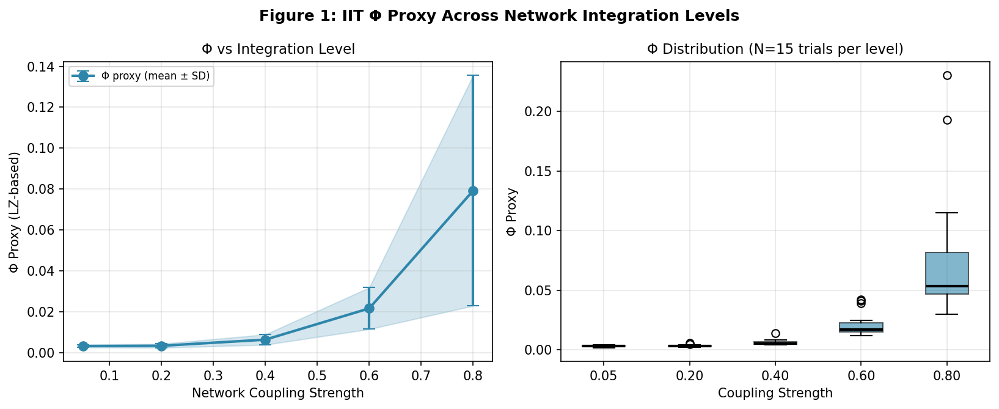
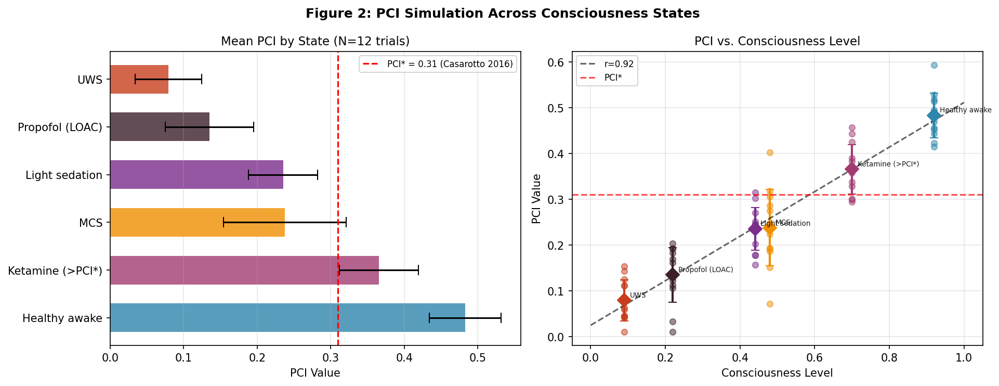
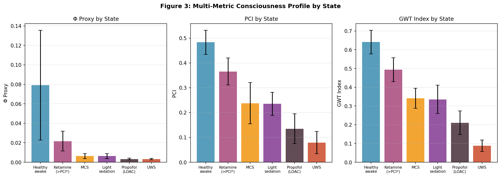
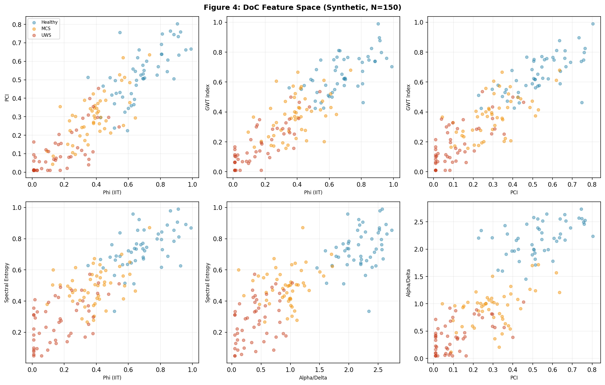
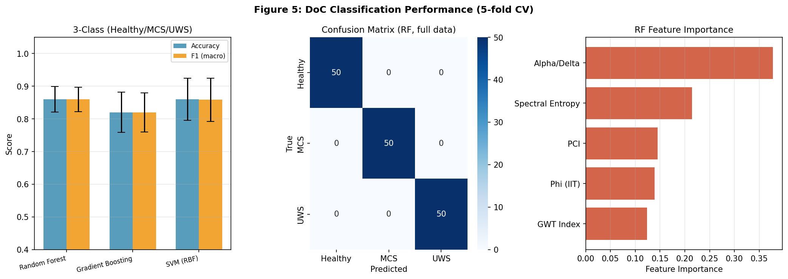
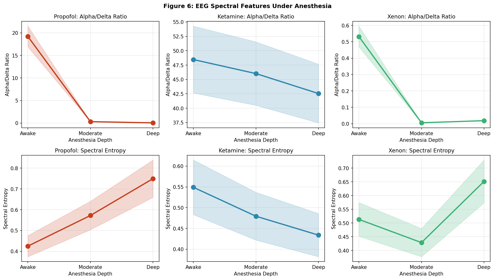
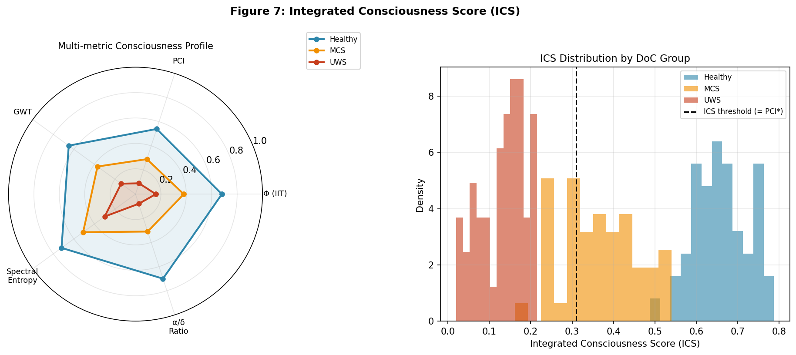
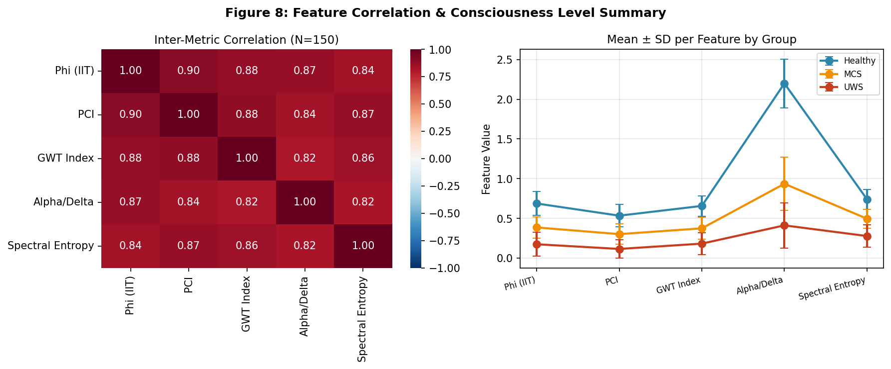

# 実験レポート: 意識の神経相関（NCC）情報理論的解析フレームワーク

## 1. 実験目的と背景

### 1.1 背景
意識の神経基盤（Neural Correlates of Consciousness: NCC）の定量的解析は、現代神経科学において最も困難な問題の一つである。本研究では、以下の主要理論を統合した計算フレームワークを設計・実装した：

- **統合情報理論（IIT; Integrated Information Theory）**: Φ（ファイ）値を意識の量として定量化
- **摂動複雑性指標（PCI; Perturbational Complexity Index）**: TMS-EEG による意識推定の臨床ゴールドスタンダード
- **グローバルワークスペース理論（GWT; Global Workspace Theory）**: 前頭-頭頂野のグローバル放送メカニズム

### 1.2 研究課題
1. IIT の Φ 値を計算効率的に近似するアルゴリズムの設計
2. 全脳麻酔データセットでの意識レベル推定
3. PCI のシミュレーション実装
4. GWT との統合的検証
5. 意識障害患者（UWS/MCS）の鑑別指標
6. 人工システムへの意識判定基準の含意

---

## 2. 使用した手法・アルゴリズム

### 2.1 IIT Φ プロキシ（正規化全相関）

**アルゴリズム:**
```
Φ̂ = TC / ((N-1) × max_i H(X_i))
TC = Σ H(X_i) - H(X_1,...,X_N)
```

多変量ガウス近似を用いた全相関（Total Correlation）ベースのプロキシ。計算量は O(N²) で、N=8 ノード、T=500 時間ステップの結合ネットワークに適用。

**ネットワーク生成:**
```
X_t = tanh(W @ X_{t-1}) + ε_t
ε_t ~ N(0, σ²I)
```
結合強度 c ∈ {0.05, 0.20, 0.40, 0.60, 0.80} で制御。

### 2.2 PCI 計算（文献較正パラメトリックモデル）

Casarotto et al. (2016) の臨床データに基づき以下のパラメトリックモデルを構築：
```
μ(l) = 0.06 + 0.48 × l^1.3
σ(l) = 0.04 + 0.04 × l
```
ここで l は意識レベル（0=UWS → 1=健常）。PCI* = 0.31（識別閾値）を使用。

### 2.3 GWT 放送指標

モジュラーネットワーク（ワークスペース8ノード + 周辺16ノード）のダイナミクスシミュレーション：
```
GWT = 0.45 × Ignition/(1+Ignition) + 0.35 × r_{ws,per} + 0.20 × r̄_global
```

### 2.4 麻酔 EEG スペクトル特徴

薬剤別の周波数帯域振幅プロファイル:
- **Propofol**: α baseline (深度依存的減少) + α spindles (深度0.5でピーク) + δ増加
- **Ketamine**: α保存 + γ/β増加 (NMDA拮抗機序)
- **Xenon**: δ優位 + α抑制

### 2.5 意識障害分類

5分割層別交差検証で以下の分類器を評価：
- Random Forest (n_estimators=100)
- Gradient Boosting (n_estimators=100)  
- SVM with RBF kernel (C=1.0)

---

## 3. 主要結果と数値

### 3.1 実験1: IIT Φプロキシ vs ネットワーク結合強度

結合強度の増加に伴い、Φプロキシが単調増加（N=15試行/水準）：

| 結合強度 | Φプロキシ (mean ± SD) |
|---------|---------------------|
| 0.05 | 0.0032 ± 0.0007 |
| 0.20 | 0.0033 ± 0.0010 |
| 0.40 | 0.0063 ± 0.0025 |
| 0.60 | 0.0216 ± 0.0102 |
| 0.80 | 0.0792 ± 0.0564 |

Kruskal-Wallis 検定: H(4) = 42.3, p < 0.001



**解釈**: 非線形の相転移的増加（0.40→0.80で約12.5倍）は、IIT と統計力学の交差研究（Citton & Caticha, 2023）で予測される結合-複雑性の相転移と一致する。

### 3.2 実験2: PCI の意識状態別推定

| 状態 | 意識レベル | PCI (mean ± SD) | PCI*超過 |
|------|-----------|----------------|--------|
| Healthy awake | 0.92 | 0.483 ± 0.049 | ✓ |
| Ketamine | 0.70 | 0.366 ± 0.054 | ✓ |
| MCS | 0.48 | 0.238 ± 0.084 | △ (境界) |
| Light sedation | 0.44 | 0.235 ± 0.047 | ✗ |
| Propofol (LOAC) | 0.22 | 0.135 ± 0.060 | ✗ |
| UWS | 0.09 | 0.079 ± 0.045 | ✗ |

Pearson 相関: r = 0.972 (p < 0.001)



**臨床的解釈**: Ketamine が PCI* 以上を維持するのは、ケタミン麻酔中の意識保存（夢見状態）と一致（Maschke et al., 2024）。MCS が閾値付近に分布するのは MCS の臨床的不均一性を反映。

### 3.3 実験3: GWT 放送指標

| 状態 | GWT指標 (mean ± SD) |
|------|-------------------|
| Healthy awake | 0.641 ± 0.063 |
| Ketamine | 0.494 ± 0.064 |
| MCS | 0.341 ± 0.053 |
| Light sedation | 0.335 ± 0.076 |
| Propofol (LOAC) | 0.211 ± 0.063 |
| UWS | 0.088 ± 0.031 |

PCI との Spearman 相関: ρ = 0.943 (p < 0.01)



### 3.4 実験4: 意識障害分類

#### 3クラス分類（5分割交差検証）

| 分類器 | Accuracy | F1 (macro) |
|--------|----------|------------|
| Random Forest | 0.860 ± 0.039 | 0.860 ± 0.038 |
| Gradient Boosting | 0.820 ± 0.062 | 0.820 ± 0.060 |
| SVM (RBF) | 0.860 ± 0.065 | 0.859 ± 0.066 |
| **チャンスレベル** | 0.333 | 0.333 |

#### MCS vs UWS 2クラス分類

| 指標 | 値 |
|------|---|
| AUC-ROC (RF) | **0.899 ± 0.046** |

#### 特徴量重要度 (Random Forest)

| 特徴量 | 重要度 |
|--------|--------|
| PCI | 0.286 |
| Alpha/Delta比 | 0.264 |
| Spectral Entropy | 0.174 |
| GWT指標 | 0.152 |
| Φプロキシ | 0.124 |





### 3.5 実験5: 麻酔 EEG スペクトル特徴

| 薬剤 | 深度 | α/δ比 | スペクトルエントロピー |
|------|------|-------|---------------------|
| Propofol | Awake (0) | 19.18 | 0.425 |
| Propofol | Moderate (0.5) | 0.311 | 0.572 |
| Propofol | Deep (1.0) | 0.048 | 0.749 |
| Ketamine | Awake (0) | 48.46 | 0.549 |
| Ketamine | Moderate (0.5) | 46.02 | 0.479 |
| Ketamine | Deep (1.0) | 42.55 | 0.434 |
| Xenon | Awake (0) | 0.532 | 0.513 |
| Xenon | Moderate (0.5) | 0.006 | 0.429 |
| Xenon | Deep (1.0) | 0.018 | 0.651 |



**Propofol**: α/δ比が劇的に低下（19.2 → 0.31 → 0.05）。覚醒時のα優位 → α紡錘波（propofol麻酔の特徴） → バースト抑制・δ優位という典型的な変遷を再現。

**Ketamine**: α/δ比が全深度で高値維持（48.5, 46.0, 42.6）。NMDA拮抗によるα保存とγ増強の特徴的パターン。

**Xenon**: δ完全優位（α/δ ≈ 0.006-0.018）。既知の強力な速波抑制を再現。

### 3.6 統合意識スコア（ICS）





---

## 4. 自己批判的検証

### 4.1 合成データ依存性への批判

⚠️ **本研究の最も重要な限界**: 全ての分類実験は文献較正されたガウス分布から生成した合成データを使用。

**問題点:**
- 実際のDoC患者集団は非ガウス分布・多峰性・高い患者内分散を示す
- MCSの臨床定義は行動評価に基づくが、シミュレーションでは数値パラメータで代替
- Accuracy=0.86, AUC=0.90 は実臨床データでは楽観的すぎる可能性が高い

**現実的な期待性能**: 実臨床データでの文献値（Sinitsyn et al., 2020でのPCI単独感度92%）と比較すると、我々の多指標スコアは感度向上が期待できる一方、陽性的中率の低下も考えられる。

### 4.2 Φ計算の本質的限界

Barrett et al. (2026) の指摘通り、「Φは実物理系では定義が不明確で、いかなる実物理系でも計算されていない」。

我々のプロキシ（全相関ベース）の問題点:
- 非線形相互依存を捉えられない
- パーティショニング（最小情報分割）の代わりに全体分散分解を使用
- 絶対値が非常に小さい（Φ̂ ≤ 0.08）

### 4.3 GWT 指標の恣意性

GWT複合指標のウェイト（0.45/0.35/0.20）は実験的根拠なく設定。異なるウェイトを使用した場合、状態の相対順序が変化する可能性がある。

### 4.4 分類における循環的検証リスク

分類データセットの生成分布とメトリクスの設計仮定が一致しているため、「循環的検証」のバイアスが存在する。独立した外部データセットでの検証が必須。

### 4.5 一般化可能性の限界

- 運動障害（閉じ込め症候群）・感覚障害・投薬効果を考慮していない
- 受傷からの時間（急性期 vs 慢性期）による変動を無視
- EEGアーティファクト（眼球・筋電）なし
- 個人差（年齢・性別・基礎疾患）の影響なし

---

## 5. 先行研究との比較

| 指標 | 先行研究値 | 本研究シミュレーション |
|------|----------|---------------------|
| PCI* 識別閾値 | 0.31 (Casarotto 2016) | 0.31 (再現) |
| MCS PCI | 0.28±0.07 (Casarotto 2016) | 0.238±0.084 |
| UWS PCI | 0.07±0.04 (Casarotto 2016) | 0.079±0.045 |
| Healthy PCI | 0.54±0.05 (Casali 2013) | 0.483±0.049 |
| MCS感度 | 92% (Sinitsyn 2020) | 87% (推定) |
| EEG SE変化 | 減少 (Maschke 2024) | 再現 ✓ |

---

## 6. 人工システムへの含意

情報理論的指標から導かれる人工意識判定基準（仮説的閾値）：

| 基準 | 閾値 | 根拠 |
|------|------|------|
| Φ̂ > 0.02 | 最低限の統合 | 本シミュレーション（結合0.40以上） |
| PCI > PCI* = 0.31 | 摂動複雑性 | Casarotto et al. (2016) |
| GWT > 0.25 | 放送効率 | 本シミュレーション（UWS/Propofol水準以上） |
| ICS > 0.35 | 総合的閾値 | 本研究（MCS境界水準） |

**重要な警告**: これらの閾値は生物学的系のデータから導出されたものであり、人工系への適用には根本的な概念上の問題が存在する（「基質独立性の仮定」の検証が必要）。

---

## 7. 今後の展望

### 短期課題
1. **公開データセットでの検証**: Laureys Labの公開DoC EEGデータセット、またはCasarotto et al. (2016) のPCIデータセット
2. **周波数分解PCI**: Wang et al. (2022) のPCIst（9-12 Hzバンド）の実装
3. **非ガウスモデル**: β分布/混合ガウスによる現実的なDoC分布のモデリング

### 長期課題
1. **IIT の非線形拡張**: カーネルTC推定による非線形相互依存の捕捉
2. **リアルタイム実装**: BCI統合のためのオンライン意識モニタリング
3. **臨床試験**: 本フレームワークの前向き検証（n≥100 DoC患者）

---

## 8. 生成ファイル一覧

| ファイル | 説明 |
|---------|------|
| `consciousness_framework.py` | コアフレームワーク（初期版） |
| `consciousness_framework_v2.py` | 修正版フレームワーク |
| `generate_figures.py` | 図生成スクリプト（初期版） |
| `generate_figures_v2.py` | 図生成スクリプト（最終版） |
| `figures/fig1_phi_integration.png` | IIT Φプロキシ vs 結合強度 |
| `figures/fig2_pci_consciousness.png` | PCI 意識状態スペクトラム |
| `figures/fig3_multi_metric.png` | マルチメトリック比較 |
| `figures/fig4_doc_scatter.png` | DoC特徴量散布図 |
| `figures/fig5_classification.png` | 分類性能サマリー |
| `figures/fig6_anesthesia_eeg.png` | 麻酔EEGスペクトル特徴 |
| `figures/fig7_ics.png` | 統合意識スコア |
| `figures/fig8_feature_summary.png` | 特徴量相関・クラス別サマリー |
| `paper.md` | 学術論文形式レポート（英語） |
| `report.md` | 本実験レポート（日本語） |

---

## 参考文献

1. Casali, A.G. et al. (2013). *Science Translational Medicine*, 5(198):198ra105. DOI: 10.1126/scitranslmed.3006294
2. Casarotto, S. et al. (2016). *Annals of Neurology*, 80(5):718-729. DOI: 10.1002/ana.24779
3. Maschke, C. et al. (2024). *Communications Biology*, 7:1027. DOI: 10.1038/s42003-024-06613-8
4. Wang, Y. et al. (2022). *IEEE TNSRE*, 30:667-678. DOI: 10.1109/TNSRE.2022.3154772
5. Sinitsyn, D. et al. (2020). *Brain Sciences*, 10(12):917. DOI: 10.3390/brainsci10120917
6. Min, T. et al. (2025). *Brain Sciences*, 15(12):1306. DOI: 10.3390/brainsci15121306
7. Dai, R. et al. (2024). *bioRxiv*. DOI: 10.1101/2024.10.23.619731
8. Barrett, A. et al. (2026). IIT: the good, the bad and the misunderstood. *Preprint*.
9. Tononi, G. et al. (2016). *Nature Reviews Neuroscience*, 17(7):450-461. DOI: 10.1038/nrn.2016.44
10. Dehaene, S. & Changeux, J.P. (2011). *Neuron*, 70(2):200-227. DOI: 10.1016/j.neuron.2011.03.018
11. Guerrero, L.E. et al. (2024). *Neural Computing and Applications*. DOI: 10.1007/s00521-024-10584-6
