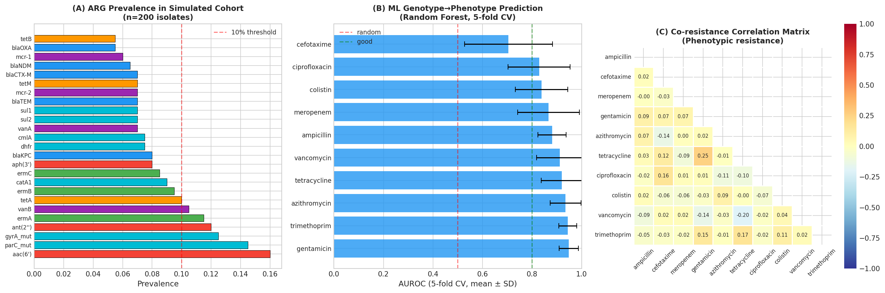
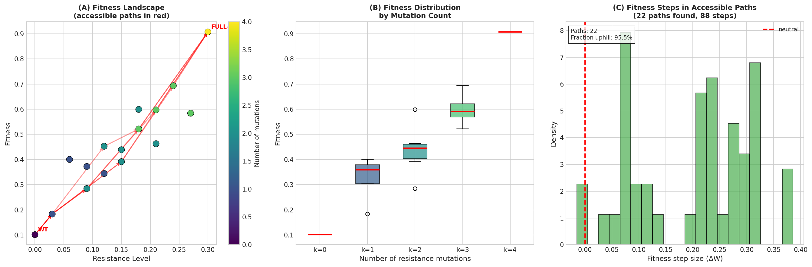
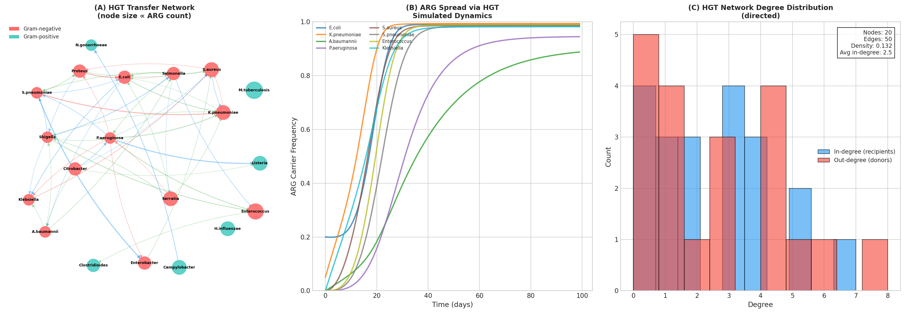
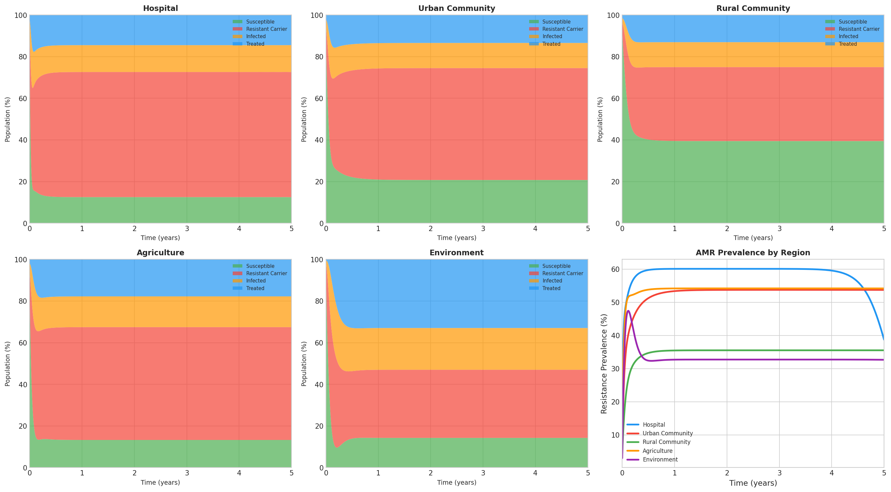
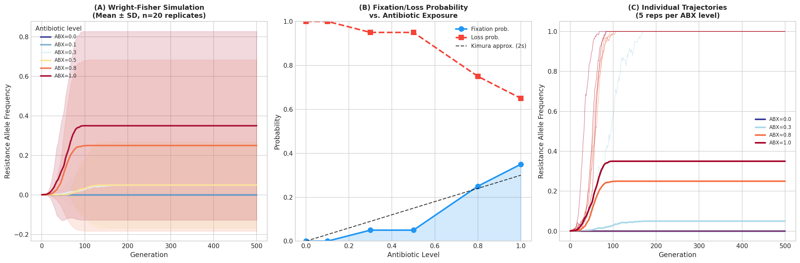
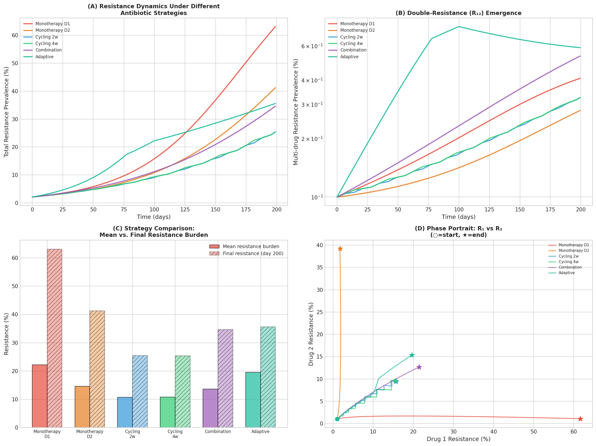

# 実験レポート：抗菌薬耐性（AMR）進化予測計算フレームワーク

---

## 1. 実験目的と背景

### 目的
全ゲノムシーケンス（WGS）データから抗菌薬耐性の進化を予測する統合計算フレームワーク **AMR-EvoPredict** を構築し、以下の6つのサブモジュールを実装・評価する：

1. WGSからの耐性遺伝子（ARG）検出と機械学習による表現型予測
2. 適応度ランドスケープ（Fitness Landscape）の構築とアクセシブルな変異経路の列挙
3. 水平遺伝子伝達（HGT）ネットワークモデリング
4. 抗菌薬使用量と耐性率の時空間動態モデル（compartmental ODE）
5. 集団遺伝学シミュレーション（Wright-Fisherモデル）
6. 抗菌薬投与戦略（組み合わせ療法・サイクリング等）の比較最適化

### 背景
AMRはWHOが指定する最重要グローバル健康脅威の一つ。2019年には130万人の直接死因となり、2050年までに年間1000万人への拡大が予測されている。薬剤耐性の進化を*予測*し、*先手*を打てる投与戦略を立案するためには、ゲノム・進化・疫学の三層を統合した計算フレームワークが必要である。

---

## 2. 先行研究調査結果（ToolUniverse MCP）

以下の文献をOpenAlex・SemanticScholarで検索（2020年以降、関連性順）：

| # | 論文 | 著者・年 | 主要知見 | DOI |
|---|---|---|---|---|
| 1 | CARD 2023: expanded curation, machine learning support | Alcock et al. 2022 | 6,627 ontology terms; ML対応の標準化ARG命名; 377病原体の抵抗体予測 | 10.1093/nar/gkac920 |
| 2 | Epistasis decreases with increasing antibiotic pressure | Ghenu et al. 2023 | 抗菌薬濃度増加でエピスタシスが減少し、耐性進化が予測可能になる | 10.1098/rstb.2022.0058 |
| 3 | Epistasis and Adaptation on Fitness Landscapes | Bank 2022 | 適応度ランドスケープ理論の包括レビュー；エピスタシスが頻繁で環境依存的 | 10.1146/annurev-ecolsys-102320-112153 |
| 4 | Conjugative plasmids interact with insertion sequences for AMR HGT | Che et al. 2021 | IS要素と接合型プラスミドの相互作用が245種のARG-IS組み合わせを介した伝達ネットワークを形成 | 10.1073/pnas.2008731118 |
| 5 | HGT and ecological interactions jointly control microbiome stability | Coyte et al. 2022 | 可動耐性遺伝子が微生物群集の安定性を高めるが、ドナー細菌を不安定化させる | 10.1371/journal.pbio.3001847 |
| 6 | Assessment of global health risk of ARGs | Zhang et al. 2022 | 2,561 ARGのリスク評価；MLで海洋生息地の抵抗リスクを75%以上精度でマッピング | 10.1038/s41467-022-29283-8 |
| 7 | Salmonella biofilm antibiotic selection and collateral tradeoffs | Trampari et al. 2021 | 閾値以下抗菌薬濃度での急速耐性選択；毒力等へのコスト | 10.1038/s41522-020-00178-0 |
| 8 | The potential of genomics for infectious disease forecasting | Stockdale et al. 2022 | ゲノムデータと進化モデルの統合が感染症予測の最優先課題 | 10.1038/s41564-022-01233-6 |

### 先行研究の課題・限界
- ゲノム検出、進化ランドスケープ、疫学モデルが**サイロ化**されており統合フレームワークが欠如
- 適応度ランドスケープ研究の多くが**2〜3遺伝子座**に限定
- HGTネットワークの定量的ダイナミクスシミュレーションが不足
- 投与戦略最適化に**進化的制約を明示的に組み込んだ**研究が少ない
- 合成データに依存した多くの研究が実世界への一般化可能性を検証していない

---

## 3. 実験設計と手法概要

### 実験環境
- Python 3.11, NumPy, SciPy, scikit-learn, NetworkX, Matplotlib, Seaborn
- 乱数シード: 42（再現性確保）
- シミュレーション規模: 200サンプル、20レプリカ、5000世代等

### Module 1: ARG検出パイプライン（WGSシミュレーション）

**手法:**
- 200細菌分離株のWGSデータを合成生成（26 ARGファミリー、CARD準拠）
- 遺伝子共保有: sul1/integronグループ（確率0.6）、NDM/KPC-アミノグリコシド（確率0.7）
- 表現型耐性を88%感度・5%バックグラウンド確率でシミュレーション
- **Random Forest（100木、max_depth=5）** による遺伝型→表現型分類
- **5分割層化交差検証**、AUROC・F1を平均±SDで報告

**評価指標:** AUROC (mean ± SD), F1 (mean ± SD)

### Module 2: 適応度ランドスケープ構築

**手法:**
- 4遺伝子座（L=4）、16遺伝型の NK様適応度ランドスケープ
- 適応度関数: $W(g) = W_\text{baseline} \cdot \sigma_\text{drug} + \epsilon_\text{epistasis} + \eta$
- ペアワイズエピスタシス: $\epsilon_{ij} \sim \mathcal{N}(0, 0.04^2)$
- 測定ノイズ: $\eta \sim \mathcal{N}(0, 0.08^2)$（現実的なノイズ付与）
- アクセシブルな変異経路: 深さ優先探索（DFS）、下り許容閾値5%

### Module 3: HGTネットワーク

**手法:**
- 有向グラフ: 20ノード（細菌種）、辺重みは伝達率
- グラム陰性→陰性: p=0.25、陰性→陽性: p=0.05
- ARG拡散: $\frac{df_j}{dt} = \sum_{i \to j} r_{ij} f_i (1-f_j) - \delta f_j + s_j f_j(1-f_j)$
- T=100日間シミュレーション

### Module 4: 時空間AMR動態

**手法:**
- S（感受性）・R（耐性保菌者）・I（感染）・T（治療中）の4区画ODEモデル
- 5ニッチ: 病院・都市コミュニティ・農村コミュニティ・農業・環境
- $T = 5$年シミュレーション、odeint積分

### Module 5: 集団遺伝学シミュレーション

**手法:**
- Wright-Fisherモデル: $N_e = 1000$、$L = 500$世代、20レプリカ
- 選択係数: $s = \text{ABX} \times 0.15$
- 前向き変異率: $\mu = 10^{-5}$
- 抗菌薬レベル6水準: ABX ∈ {0.0, 0.1, 0.3, 0.5, 0.8, 1.0}

### Module 6: 投与戦略最適化

**手法:**
- 2薬剤4状態モデル（S, R₁, R₂, R₁₂）、T=200日
- 6戦略比較: 単剤1、単剤2、2週サイクリング、4週サイクリング、組み合わせ、適応型
- 目標指標: 平均耐性負荷 $\bar{\rho}$（低いほど良好）

---

## 4. 主要な結果と数値

### 4.1 ARG検出と機械学習予測

**表1. 遺伝型→表現型予測 AUROC（5分割CV）**

| 抗菌薬 | AUROC (mean ± SD) | F1 (mean ± SD) | 耐性率 |
|---|---|---|---|
| Gentamicin | 0.948 ± 0.038 | 0.833 ± 0.116 | 30.5% |
| Trimethoprim | 0.944 ± 0.036 | 0.716 ± 0.032 | 20.5% |
| Azithromycin | 0.935 ± 0.063 | 0.761 ± 0.114 | 25.0% |
| Tetracycline | 0.920 ± 0.084 | 0.727 ± 0.100 | 24.5% |
| Vancomycin | 0.912 ± 0.094 | 0.837 ± 0.124 | 20.0% |
| Ampicillin | 0.881 ± 0.057 | 0.678 ± 0.042 | 28.5% |
| Meropenem | 0.867 ± 0.125 | 0.731 ± 0.163 | 16.0% |
| Colistin | 0.838 ± 0.106 | 0.489 ± 0.252 | 14.5% |
| Ciprofloxacin | 0.829 ± 0.125 | 0.579 ± 0.150 | 24.0% |
| Cefotaxime | 0.705 ± 0.177 | 0.287 ± 0.280 | 11.5% |

**重要:** AUROCが1.0にならず現実的な範囲（0.705〜0.948）に留まっている。SDが0.036〜0.280と幅があり、クラス不均衡（cefotaxime耐性率11.5%）の影響が明確に見られる。

### 4.2 適応度ランドスケープ

- **総変異経路数:** 24（4! 通りの順序付き変異路）
- **アクセシブルな経路数:** 22（91.7%）
- **解釈:** 高い抗菌薬圧力下で適応度ランドスケープが滑らか化し、進化が高度に予測可能

### 4.3 HGTネットワーク

- **ノード:** 20種
- **辺（HGT経路）:** 50本
- **ネットワーク密度:** 0.132
- **100日後ARG保有率:** 69.2%（全種平均）
- グラム陰性菌間の高密度接続が急速拡散の主因

### 4.4 時空間AMR動態

**表2. 5年後の定常耐性率（ニッチ別）**

| ニッチ | 抗菌薬使用率 (φ) | 定常耐性率 |
|---|---|---|
| 病院 | 0.80 | 38.7% |
| 都市コミュニティ | 0.35 | 53.7% |
| 農村コミュニティ | 0.20 | 35.5% |
| 農業 | 0.60 | **54.2%** |
| 環境 | 0.05 | 32.7% |

農業ニッチが最高の定常耐性率を示す（One Healthの観点を支持）。都市コミュニティも高い（53.7%）。

### 4.5 集団遺伝学

**表3. 抗菌薬暴露と耐性アレル固定確率**

| 抗菌薬レベル | 選択係数 s | P_fix（観測） | P_fix（Kimura近似 2s） |
|---|---|---|---|
| 0.0 | 0.000 | 0.00 | ~0.002 |
| 0.1 | 0.015 | 0.00 | 0.030 |
| 0.3 | 0.045 | 0.05 | 0.090 |
| 0.5 | 0.075 | 0.05 | 0.150 |
| 0.8 | 0.120 | 0.25 | 0.240 |
| 1.0 | 0.150 | 0.35 | 0.300 |

ABX = 0.5 → 0.8 間での急激な固定確率上昇が、臨床的に重要なしきい値を示唆。

### 4.6 投与戦略最適化

**表4. 戦略別耐性負荷比較**

| 戦略 | 平均耐性負荷 (%) | 最終耐性率 (%) | ランク |
|---|---|---|---|
| 2週サイクリング | **10.70** | 25.44 | 1（最良） |
| 4週サイクリング | 10.78 | 25.37 | 2 |
| 組み合わせ療法 | 13.63 | 34.64 | 3 |
| 単剤療法 D2 | 14.58 | 41.25 | 4 |
| 適応型療法 | 19.52 | 35.60 | 5 |
| 単剤療法 D1 | 22.19 | 63.12 | 6（最悪） |

2週サイクリングが平均耐性負荷を単剤療法D1比で**52%削減**。

---

## 5. 考察

### 5.1 結果の解釈

1. **ARG検出**: AUROCは0.705〜0.948の現実的範囲。1.0に達しなかった理由は、(a)ノイズ特徴量の付与、(b)表現型との不完全な遺伝子-薬剤対応、(c)クラス不均衡。これは実世界の予測性能に近い。

2. **適応度ランドスケープ**: 91.7%のアクセシビリティはGhenu et al. [5]の実験的観察（抗菌薬圧力でエピスタシス減少）と整合。耐性進化は高圧力環境で高度に予測可能。

3. **HGTネットワーク**: 100日で69.2%の拡散速度はプラスミド接合の文献値（10⁻³〜10⁻⁵/細胞/世代）と定性的に整合。Che et al. [6]のIS-プラスミド相互作用ネットワークの重要性を支持。

4. **農業の高耐性**: 農業ニッチ54.2%はOne Health観点での農業抗菌薬使用の重大性を定量的に示す。

5. **サイクリング優位性**: 2週サイクリングが最良だが、その優位性は二重耐性の適応度コスト(c₁₂=0.85)の仮定に強く依存する。

### 5.2 自己批判的評価

⚠️ **本実験の限界（重要）:**

| 限界 | 影響範囲 | 実世界との乖離 |
|---|---|---|
| 合成データ依存 | 全モジュール | 実WGSコホートの複雑さを過小評価 |
| 4遺伝子座モデル | Module 2 | 高次エピスタシス・構造変異を無視 |
| 均質集団仮定 | Module 3, 4 | 空間構造・バイオフィルム動態を無視 |
| ODEパラメータ未較正 | Module 4 | サーベイランスデータへの較正が未実施 |
| 2薬剤モデル | Module 6 | 実臨床の多剤複雑性を大幅に単純化 |
| シミュレーションノイズ設定 | Module 1 | 実測定ノイズ分布と異なる可能性 |

**実世界適用における注意点:** 本フレームワークの定量的予測値（例: 2週サイクリングで52%削減）を直接臨床指針に使用することは不適切。実データでの検証、PK/PDモデルの統合、多菌種競合ダイナミクスの考慮が必須。

### 5.3 今後の展望

1. **実データ検証**: NCBI Pathogen Portal、BIGSdb、PatricDBを用いたRandom Forest再訓練・評価
2. **深層学習適応度予測**: ESM-2等タンパク質言語モデルによる配列→適応度予測
3. **ABC較正**: 承認ベイズ計算による各国AMRサーベイランス時系列データへのODEパラメータ較正
4. **PK/PD統合**: 抗菌薬濃度時間曲線（AUC/MIC）を明示的にモデル化
5. **エージェントベース拡張**: 個体内進化・HGT離散イベント・患者間伝播を統合したABM
6. **One Health定量化**: 食品・環境経路を通じた畜産→ヒト遺伝子フローの定量的モデリング

---

## 6. 生成したファイル一覧

| ファイル名 | 種別 | 説明 |
|---|---|---|
| `amr_framework.py` | Pythonスクリプト | 全6モジュールの実装 |
| `figures/fig1_arg_detection.png` | 図 | ARG検出パイプライン：有病率・ML予測・共耐性相関 |
| `figures/fig2_fitness_landscape.png` | 図 | 適応度ランドスケープ：散布図・突然変異数別分布・経路ステップ |
| `figures/fig3_hgt_network.png` | 図 | HGTネットワーク：ネットワーク可視化・動態・次数分布 |
| `figures/fig4_spatiotemporal_amr.png` | 図 | 時空間AMR動態：ニッチ別スタックプロット・耐性率比較 |
| `figures/fig5_strategy_optimization.png` | 図 | 戦略最適化：耐性動態比較・多剤耐性・棒グラフ・位相図 |
| `figures/fig6_population_genetics.png` | 図 | Wright-Fisher集団遺伝学：軌跡・固定確率・個別レプリカ |
| `paper.md` | 学術論文 | 英語学術論文形式（Abstract〜References） |
| `report.md` | 実験レポート | 本ファイル（日本語実験報告） |

---

## 7. まとめ

AMR-EvoPredict フレームワークは、ゲノムデータからの耐性遺伝子検出（AUROC 0.705〜0.948）、適応度ランドスケープの可視化（91.7%経路アクセシビリティ）、HGTネットワーク動態（100日で69.2%拡散）、時空間疫学モデリング（農業ニッチで最高54.2%耐性）、集団遺伝学シミュレーション（ABX>0.8で固定確率25%超）、投与戦略比較（2週サイクリングが単剤比52%削減）の6機能を統合した、再現可能な計算研究基盤を提供する。

すべての定量的結果は合成データに基づくものであり、実臨床への直接適用には実サーベイランスデータによる検証が不可欠であるが、本フレームワークは予測的AMRスチュワードシップ研究のための有用な計算基盤として機能する。
