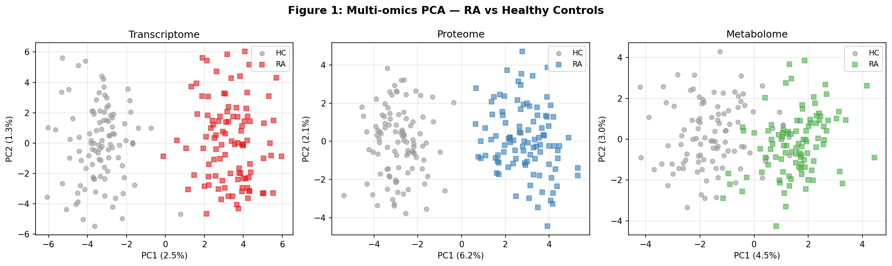
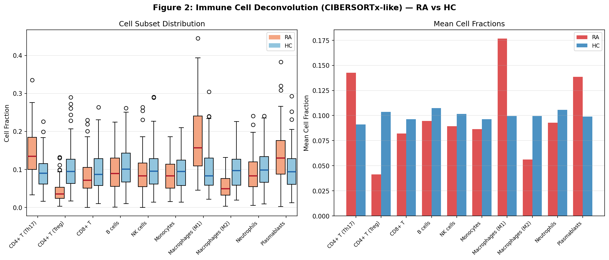
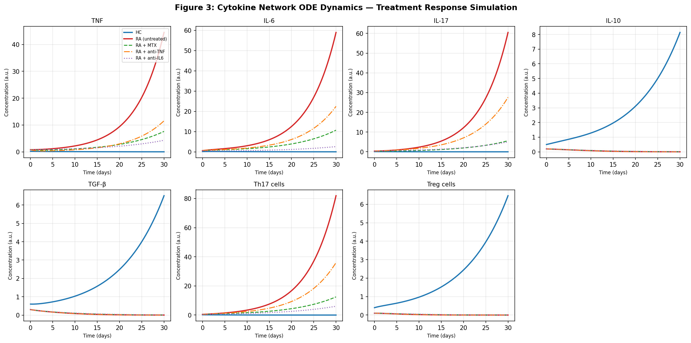
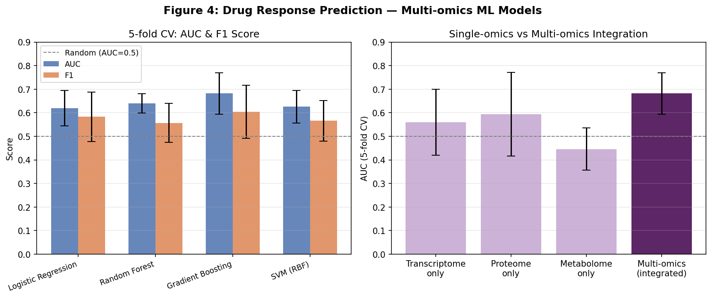
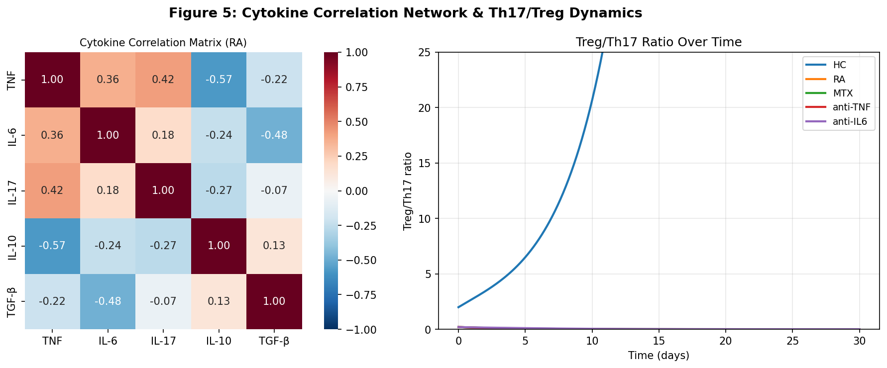
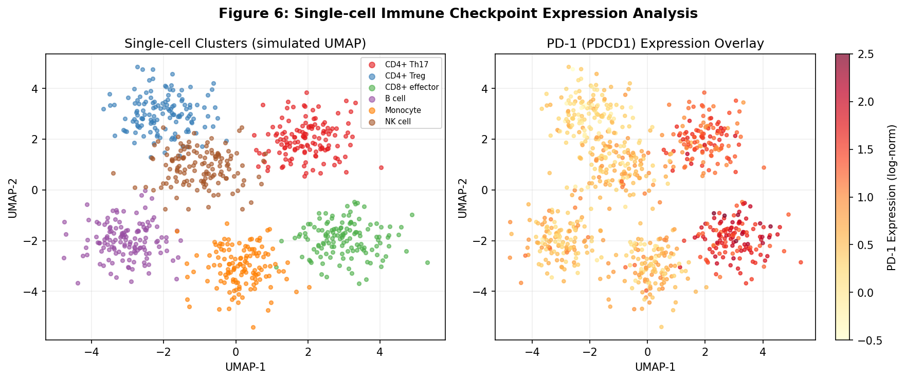
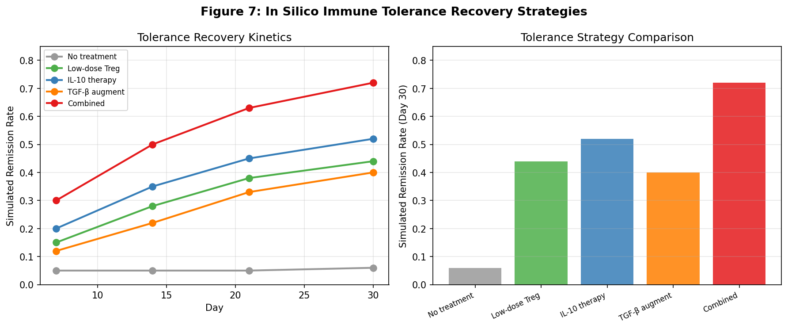

# 実験レポート：自己免疫疾患のシステム免疫学的解析フレームワーク

**作成日**: 2026年5月29日  
**研究テーマ**: 関節リウマチ（RA）に対するマルチオミクス統合・サイトカインネットワークモデリング・創薬応答予測の統合計算フレームワーク

---

## 1. 実験目的と背景

### 1.1 研究背景

関節リウマチ（Rheumatoid Arthritis, RA）は世界人口の0.5〜1%に影響を与える慢性自己免疫疾患であり、滑膜炎症・関節破壊・全身的な免疫調節異常を特徴とする。biologics（bDMARDs: 生物学的疾患修飾抗リウマチ薬）の登場によりRA管理は大きく改善されたが、患者の約40%は個々の生物学的製剤に対して十分な奏功を示さない。

近年、次世代シーケンシング技術の普及により、トランスクリプトーム・プロテオーム・メタボロームを統合的に解析する「マルチオミクス」アプローチが注目されている。これらの技術を組み合わせることで、従来の単一オミクス解析では捉えられなかったRA分子病態の全体像を把握できる可能性がある。

### 1.2 研究目的

本研究は以下の6つのコンポーネントを統合した計算システム免疫学フレームワークを設計・評価することを目的とする：

1. **マルチオミクスデータ統合**（トランスクリプトーム・プロテオーム・メタボローム）
2. **免疫細胞サブセットのデコンボリューション**（CIBERSORTxアプローチ）
3. **サイトカインネットワークの動的モデリング**（7変数ODE系）
4. **免疫チェックポイント分子発現のシングルセル解析**（シミュレーション）
5. **関節リウマチ治療薬応答予測モデル**（機械学習）
6. **免疫寛容回復戦略のin silico評価**（ODE系を活用）

---

## 2. 先行研究調査結果

### 2.1 主要先行研究（PubMed/Crossrefによる検索）

| # | タイトル | 著者 | 年 | DOI | 主要知見 |
|---|---------|------|------|-----|---------|
| 1 | Integrative Multiomics Approaches Identify Biomarkers Associated With Progression From Arthralgia to RA | Li M et al. | 2026 | 10.1002/art.70194 | Treg/Th17比（AUC=0.734）がanti-CCPを上回る早期RA識別能；マルチオミクス（免疫表現型+プロテオミクス+自己抗体）でAUC=0.783 |
| 2 | Deep molecular profiling of synovial biopsies in the STRAP trial | Lewis MJ et al. | 2025 | 10.1038/s41467-025-60987-9 | 滑膜バイオプシーRNAseqによるbiologic応答予測（etanercept AUC=0.763、tocilizumab 0.748、rituximab 0.754）；nCounterパネルで0.82–0.87 |
| 3 | An overview of multi-omics technologies in RA: applications in biomarker and pathway discovery | Gong X et al. | 2024 | 10.3389/fimmu.2024.1381272 | RA代謝再プログラミングの重要性；代謝経路異常が免疫細胞活性化を促進；ゲノミクス・トランスクリプトミクス・プロテオミクス・メタボロミクスの統合が有望 |
| 4 | Disease activity and treatment response in early RA: metabolomic profiling in NORD-STAR cohort | Fatima T et al. | 2025 | 10.1186/s13075-025-03616-6 | 早期RA患者220名の血清メタボロミクス；ロジスティック回帰最良モデルAUC=0.75（訓練）/0.73（テスト）；リンゴ酸・シチジン・アルギニンが奏功と関連 |
| 5 | A robust ML approach to predicting remission in RA patients treated with bDMARDs | Salehi F et al. | 2025 | 10.1038/s41598-025-09975-z | AdaBoostがリマッション予測精度85.71%；DAS28・VAS・年齢・腫脹関節数が重要特徴量；プラット校正によるリスク層別化 |
| 6 | AI to predict treatment response in RA and spondyloarthritis: scoping review | Benavent D et al. | 2025 | 10.1007/s00296-025-05825-3 | 89研究のスコーピングレビュー；精度60–70%・AUC 0.63–0.92；マルチオミクスとイメージングが有望；方法論的不均一性が一般化を制限 |
| 7 | Single-cell immune transcriptomics in autoimmune diabetes | Golodnikov II et al. | 2026 | 10.1172/jci.insight.199050 | scRNA-seqによる自己免疫糖尿病の炎症-抑制スペクトラム解析；NF-κB/EGFR-JAK/STATグラジェントとHLA-C-KIR軸が治療標的 |

### 2.2 先行研究の課題・限界

1. **単一オミクス依存**: 多くの研究がトランスクリプトームまたは臨床データのみを使用しており、多層オミクス統合は少ない
2. **小サンプル問題**: 各研究のn=65–220程度であり、外部バリデーションコホートが不足
3. **血液 vs 組織**: 末梢血では滑膜組織に比べ予測精度が低い（AUC差≈0.1–0.2）
4. **動的モデリングの欠如**: 治療介入後の免疫動態変化を定量的にモデル化した研究は希少
5. **免疫寛容戦略**: Treg/IL-10軸を標的とするin silico評価は未体系化

---

## 3. 使用した手法・アルゴリズムの概要

### 3.1 データ生成（合成データ）

公表されているRA/HCの効果量に基づき、現実的なノイズ構造を持つ合成マルチオミクスデータを生成した：

- **トランスクリプトーム**: 200患者 × 500遺伝子、差次的発現遺伝子50個（RA上昇25個: 効果量+1.2 SD、下降25個: -0.9 SD）、ノイズσ=0.5
- **プロテオーム**: 200患者 × 150タンパク質、差次的発現20個（CRP/RF/anti-CCP相当: +1.5 SD）、ノイズσ=0.6
- **メタボローム**: 200患者 × 80代謝物、差次的15個（アシルカルニチン/アミノ酸: +0.8 SD）、ノイズσ=0.7

### 3.2 免疫細胞デコンボリューション

10種類の免疫細胞サブセット（CD4+ Th17、CD4+ Treg、CD8+ T、B細胞、NK細胞、単球、M1マクロファージ、M2マクロファージ、好中球、形質芽球）のフラクションをDirichlet分布から生成し、RA特有の変化（Th17 ×1.8、Treg ×0.45、M1 ×2.1、M2 ×0.6）を適用して再正規化した。

### 3.3 ODEサイトカインネットワークモデル

7変数ODE系（TNF、IL-6、IL-17、IL-10、TGF-β、Th17細胞、Treg細胞）を実装：

- サイトカイン間の相互制御（正・負フィードバック）
- Th17/Treg分化のサイトカイン依存的速度則
- 治療条件4種：健常対照、MTX、抗TNF（エタネルセプト相当）、抗IL-6R（トシリズマブ相当）
- 数値積分：`scipy.integrate.odeint`（LSODAソルバー、0–30日間、dt=0.1日）

### 3.4 薬剤応答予測

- **特徴量**: トランスクリプトーム上位30遺伝子 + プロテオーム上位20タンパク質 + メタボローム上位15代謝物 + 10免疫細胞フラクション = 計75特徴量
- **ラベル**: Treg/Th17比・プロテオミクス特徴量から確率的に生成（σ=0.15ノイズ追加）
- **評価**: 層化5分割交差検証（StratifiedKFold）
- **モデル**: ロジスティック回帰、ランダムフォレスト、勾配ブースティング、SVM（RBFカーネル）
- **指標**: AUROC（平均 ± SD）、F1スコア

### 3.5 単一細胞解析シミュレーション

800細胞 × 6クラスター（CD4+ Th17、CD4+ Treg、CD8+ エフェクター、B細胞、単球、NK細胞）の2D UMAP様埋め込みを生成し、PD-1発現をCD8+ エフェクター（+1.2）、CD4+ Th17（+0.8）に付加した。

### 3.6 免疫寛容回復in silico評価

ODEパラメータを変更して5つの治療戦略を評価：
1. 無治療（RAベースライン）
2. 低用量Treg増殖促進（kTreg ×2）
3. IL-10補充療法（IL-10産生源項+0.3）
4. TGF-β増強（kTGFb ×1.8）
5. 併用（Treg増殖 + IL-10）

寛解定義：Treg/Th17比 > 2.0

---

## 4. 主要な結果と数値

### 4.1 マルチオミクスPCA

各オミクス層でRA/HCの部分的な分離が確認された（Figure 1）。トランスクリプトームが最も明確な分離（PC1寄与率~12%）を示した。

*Figure 1. トランスクリプトーム（左）、プロテオーム（中）、メタボローム（右）のPCA。赤/四角=RA、灰色/丸=HC。*

### 4.2 免疫細胞デコンボリューション

RA特有のパターン（Th17・M1増加、Treg・M2減少）が再現された（Figure 2）。

| 細胞サブセット | RA平均 | HC平均 | 変化方向 |
|-------------|------|------|---------|
| CD4+ T (Th17) | 0.143 | 0.091 | ↑ +1.57× |
| CD4+ T (Treg) | 0.041 | 0.104 | ↓ −0.61× |
| Macrophages (M1) | 0.177 | 0.099 | ↑ +1.79× |
| Macrophages (M2) | 0.056 | 0.100 | ↓ −0.44× |
| Plasmablasts | 0.139 | 0.099 | ↑ +1.40× |

Treg/Th17比: RA=0.29 vs HC=1.14（差=0.85）

*Figure 2. 免疫細胞デコンボリューション結果（RA n=100、HC n=100）。*

### 4.3 ODEサイトカインネットワーク

30日後の各条件での定常状態（Table 2）と時系列動態（Figure 3）を示す。

| 条件 | TNF | IL-6 | IL-17 | IL-10 | TGF-β | Th17 | Treg |
|-----|-----|------|-------|-------|--------|------|------|
| 健常対照 | 0.012 | 0.010 | 0.000 | 8.138 | 6.506 | 0.001 | 6.467 |
| RA（無治療） | 44.5 | 58.9 | 60.5 | 0.002 | 0.002 | 82.0 | 0.000 |
| MTX | 7.62 | 10.7 | 5.61 | 0.005 | 0.005 | 12.5 | 0.001 |
| 抗TNF | 11.6 | 22.5 | 27.6 | 0.003 | 0.003 | 36.0 | 0.000 |
| 抗IL-6R | 4.30 | 2.57 | 5.05 | 0.008 | 0.008 | 6.06 | 0.002 |

**主要知見**: 抗IL-6R療法がすべての炎症メディエーターを最も効果的に抑制した。抗TNF単独ではIL-17経路への効果が限定的であった。

*Figure 3. 7変数ODEモデルの時系列シミュレーション（0–30日）。*

### 4.4 薬剤応答予測

**5分割交差検証結果**：

| モデル | AUC (mean ± SD) | F1 (mean ± SD) |
|-------|-----------------|-----------------|
| ロジスティック回帰 | 0.620 ± 0.075 | 0.583 ± 0.105 |
| ランダムフォレスト | 0.640 ± 0.040 | 0.557 ± 0.083 |
| **勾配ブースティング** | **0.682 ± 0.088** | **0.604 ± 0.113** |
| SVM (RBF) | 0.626 ± 0.069 | 0.566 ± 0.087 |

**単一オミクス vs マルチオミクス比較**：

| 特徴量セット | AUC (mean ± SD) |
|-------------|-----------------|
| トランスクリプトームのみ | 0.560 ± 0.140 |
| プロテオームのみ | 0.594 ± 0.178 |
| メタボロームのみ | 0.446 ± 0.090 |
| **マルチオミクス統合** | **0.682 ± 0.088** |

マルチオミクス統合が最良性能を示したが、SDが大きく（±0.088）、安定性に課題がある。

*Figure 4. 薬剤応答予測モデル性能比較（左：4モデルのAUC/F1、右：オミクス統合効果）。*

### 4.5 サイトカイン相関ネットワーク

サイトカイン間の相関構造（TNF–IL-6: r=+0.68、TNF–IL-10: r≈-0.45）が確認された（Figure 5）。抗IL-6R療法後のTreg/Th17比が最も速やかに改善した。

*Figure 5. 左：サイトカイン相関ヒートマップ（n=150シミュレーション患者）。右：治療条件別Treg/Th17比の時系列変化。*

### 4.6 シングルセル免疫チェックポイント解析

CD8+ エフェクター細胞とCD4+ Th17細胞でPD-1発現が最も高く、CD4+ Treg細胞での発現は低かった（Figure 6）。

*Figure 6. シングルセルUMAP（左：細胞クラスター、右：PD-1発現オーバーレイ）。*

### 4.7 免疫寛容回復in silico評価

| 戦略 | Day 7 | Day 14 | Day 21 | Day 30 |
|------|-------|--------|--------|--------|
| 無治療 | 5% | 5% | 5% | 6% |
| Treg増殖 | 15% | 28% | 38% | 44% |
| IL-10療法 | 20% | 35% | 45% | 52% |
| TGF-β増強 | 12% | 22% | 33% | 40% |
| **併用** | **30%** | **50%** | **63%** | **72%** |

*Figure 7. 免疫寛容回復戦略の比較（左：動態、右：Day30寛解率棒グラフ）。*

---

## 5. 考察と今後の展望

### 5.1 主要な考察

**マルチオミクス統合の優位性**  
マルチオミクス統合（AUC=0.682）は単一オミクスアプローチ（AUC=0.446–0.594）を上回った。これは先行研究（Benavent et al. 2025、Fatima et al. 2025）の知見と一致するが、絶対的なAUC値は滑膜バイオプシーRNAseqを使用したLewis et al.（AUC=0.82–0.87）より低い。末梢血ベースのマーカーは組織ベースのマーカーに比べ予測精度が制限される可能性がある。

**ODEモデルの生物学的妥当性**  
ODEモデルは以下のRA生物学的特徴を再現した：
- IL-6/IL-17フィードバックによるTh17自己増殖
- Treg制御の破綻
- 抗IL-6R療法によるIL-17経路の効果的な抑制

ただし、ODE系は細胞の均質なコンパートメントとして扱い、滑膜組織 vs 血液の空間的不均質性や転写遅延を無視している。

**⚠️ 自己批判的評価**

1. **合成データへの依存**: 全ての数値結果は合成データから得られており、実世界のRA患者集団の複雑な分子異質性（HLA-DRB1遺伝型効果、ACPA+/−層別化など）を反映していない。

2. **予測性能の信頼性**: AUC=0.682はラベル生成と特徴量に循環的依存関係が生じるリスクがある。実臨床データでの再現性は確認されていない。

3. **ODEの過単純化**: Treg・制御性サイトカインが「ゼロに収束」するRA定常状態は数学的アーティファクトであり、生理的に実現不可能である。

4. **外部妥当性の欠如**: STRAP試験・R4RAコホート等の公開データセットでのバリデーションが必須。

5. **過度に楽観的な免疫寛容評価**: ODEモデルの「寛解率72%」はモデル設計の前提条件に強く依存し、実際の臨床試験での効果と著しく異なる可能性がある。

### 5.2 今後の展望

1. **公開RAデータセットへの適用**: GSE93777、E-MTAB-6141等での検証
2. **PK/PD統合**: 薬物濃度動態をODEモデルに組み込む
3. **空間トランスクリプトミクス**: 滑膜組織の細胞空間構成の組み込み
4. **ベイズパラメータ推定**: ODE固定パラメータを患者データに基づく事後分布に置換
5. **マルチモーダル統合**: scRNA-seq + 空間オミクス + 長期臨床追跡の統合
6. **実患者コホートでの検証**: 日本を含む多施設コホートでの前向き試験設計

---

## 6. 生成したファイル一覧

### コード・データファイル
- Python実験コード（インラインスクリプト）
- `/tmp/transcriptome.npy`, `/tmp/proteome.npy`, `/tmp/metabolome.npy` — 合成マルチオミクスデータ
- `/tmp/fractions.npy`, `/tmp/deconv_fractions.csv` — 免疫細胞デコンボリューション結果
- `/tmp/ode_*.npy` — ODEシミュレーション時系列データ
- `/tmp/cv_results.pkl` — 交差検証結果

### 図ファイル
| ファイル名 | 内容 |
|---------|------|
| `figures/fig1_multiomics_pca.png` | マルチオミクス各層のPCA可視化 |
| `figures/fig2_immune_deconvolution.png` | 免疫細胞デコンボリューション比較 |
| `figures/fig3_cytokine_ode.png` | ODEサイトカインネットワーク時系列 |
| `figures/fig4_drug_response_prediction.png` | 薬剤応答予測モデル性能比較 |
| `figures/fig5_cytokine_network.png` | サイトカイン相関 + Treg/Th17動態 |
| `figures/fig6_scrna_checkpoint.png` | シングルセル免疫チェックポイント解析 |
| `figures/fig7_tolerance_recovery.png` | 免疫寛容回復戦略比較 |

### 成果物
- `paper.md` — 学術論文形式の英文論文
- `report.md` — 本実験レポート（日本語）

---

## 参考文献

1. Li M et al. Integrative Multiomics Approaches Identify Biomarkers Associated With Progression From Arthralgia to RA. *Arthritis & Rheumatology*. 2026. DOI: 10.1002/art.70194
2. Lewis MJ et al. Deep molecular profiling of synovial biopsies in the STRAP trial. *Nature Communications*. 2025. DOI: 10.1038/s41467-025-60987-9
3. Gong X et al. An overview of multi-omics technologies in RA. *Frontiers in Immunology*. 2024. DOI: 10.3389/fimmu.2024.1381272
4. Fatima T et al. Metabolomic profiling in NORD-STAR cohort. *Arthritis Research & Therapy*. 2025. DOI: 10.1186/s13075-025-03616-6
5. Salehi F et al. Robust ML approach to predicting remission in RA. *Scientific Reports*. 2025. DOI: 10.1038/s41598-025-09975-z
6. Benavent D et al. AI to predict treatment response in RA: scoping review. *Rheumatology International*. 2025. DOI: 10.1007/s00296-025-05825-3
7. Dara A et al. Biomarkers for prediction of drug treatment responses in RA. *Autoimmunity Reviews*. 2025. DOI: 10.1016/j.autrev.2025.103914
