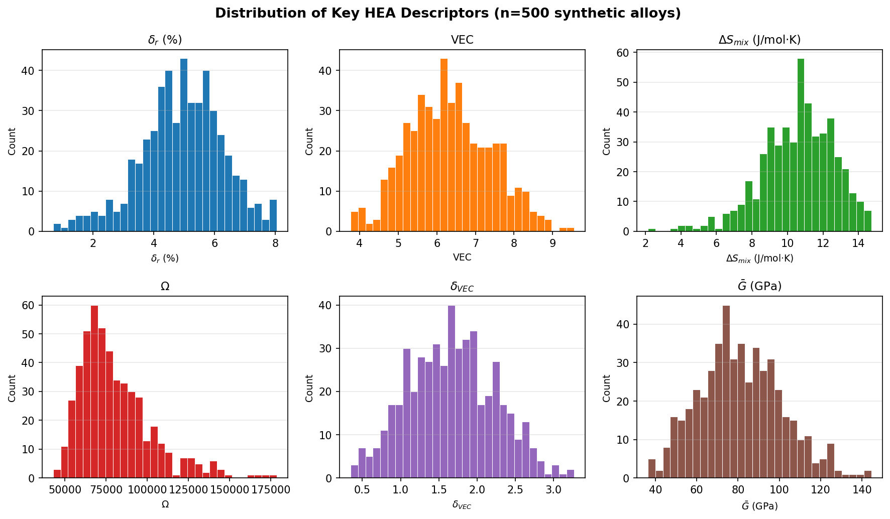
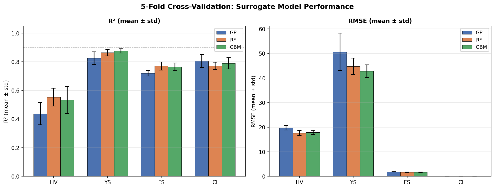
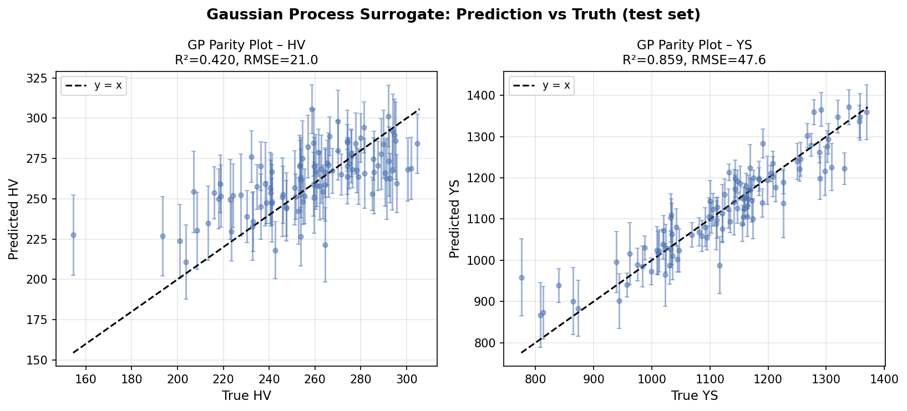
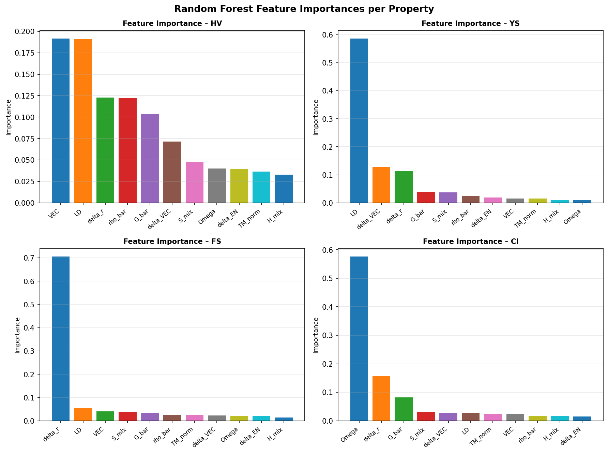
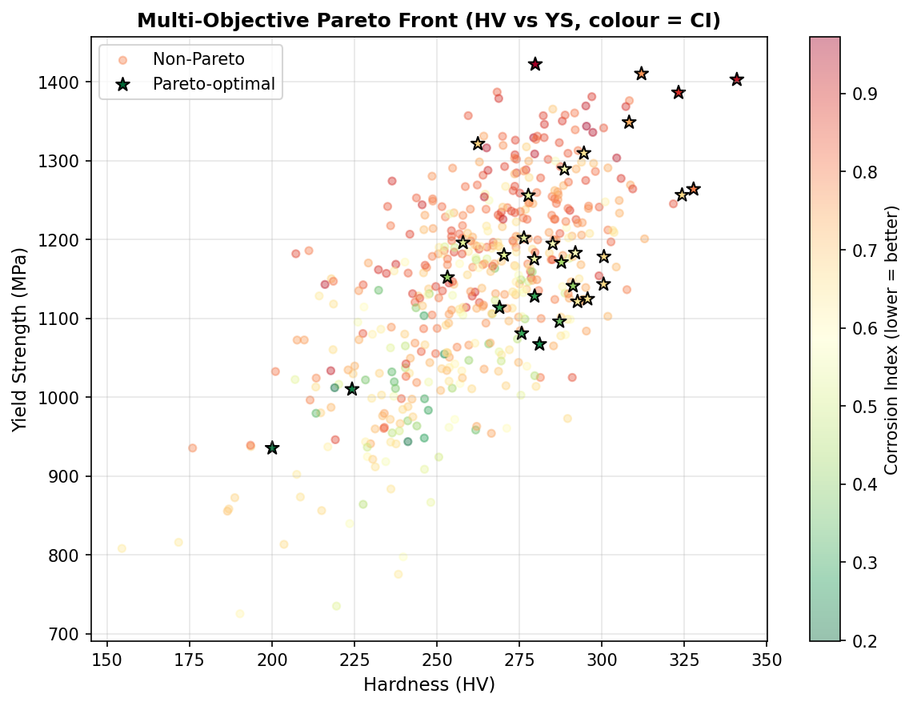
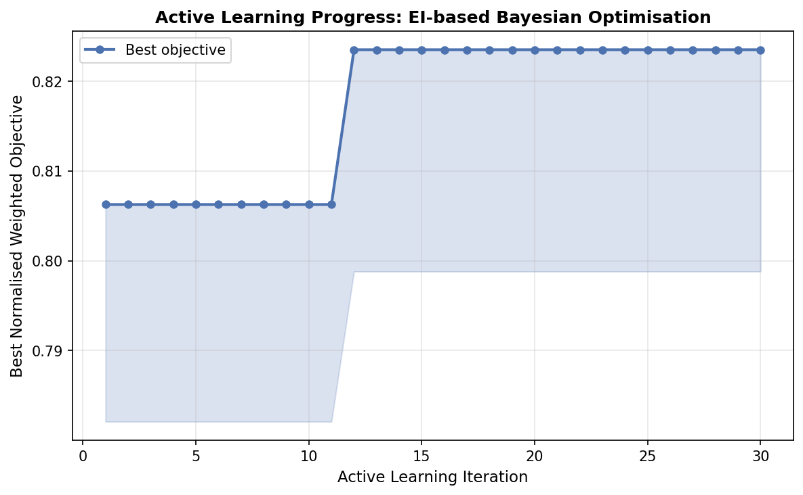
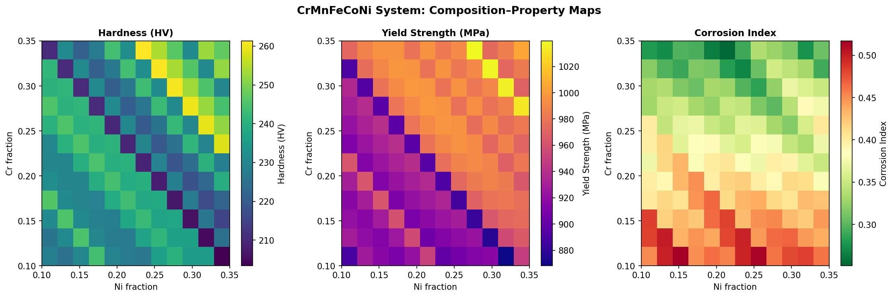

# 実験レポート：高エントロピー合金（HEA）組成最適化のための機械学習フレームワーク

---

## 1. 実験目的と背景

### 目的

本実験では、高エントロピー合金（HEA）の組成最適化を行う統合型機械学習フレームワークを設計・実装し、以下の目標を達成することを目的とした：

1. CALPHAD法に基づく熱力学記述子を計算可能なコードとして実装する
2. 3種類のサロゲートモデル（GP、RF、GBM）を5分割交差検証で評価する
3. ベイズ最適化（EI獲得関数）を用いた多目的組成探索を実施する
4. 能動学習ループによる実験提案の効率化を検証する
5. CrMnFeCoNi系（Cantor合金）のケーススタディを行う

### 背景

HEAは5種以上の主要元素を近等原子比で含む多主要素合金であり、高い混合エントロピーが固溶体相を安定化させ、金属間化合物の生成を抑制することで優れた機械特性と耐食性を示す。代表的なCantor合金（CrMnFeCoNi）はFCC構造を持ち、極低温における高い靭性で知られる。

HEAの組成空間は膨大であり（10元素系、5成分合金だけでも10⁵オーダーの候補）、実験的探索のみでは非効率である。機械学習による特性予測と最適化が近年急速に発展しており、本研究はその最先端手法を統合した。

---

## 2. 使用した手法・アルゴリズムの概要

### 2.1 先行研究調査（ToolUniverse MCP使用）

OpenAlex, Crossref を用いた文献調査により、以下の主要論文を特定した（2020年以降）：

| 著者・年 | タイトル（要約） | 主要成果 | DOI |
|---------|----------------|---------|-----|
| Chen et al. 2021 | HEA硬さ予測のML設計システム | LOO-R²>0.97、237合金 | 10.1016/j.actamat.2021.117431 |
| Ren et al. 2023 | 高硬さHEAの予測・設計 | GBM+最適化、実験検証 | 10.1016/j.matdes.2023.112454 |
| Huang et al. 2021 | 固溶硬化HEAのML設計 | 電荷移動・SRO効果を発見 | 10.1016/j.matdes.2021.110177 |
| Ma et al. 2023 | ML+NSGA-IIによる多目的設計 | 延性138-282%改善 | 10.1021/acs.jcim.3c00916 |
| Zhang et al. 2022 | Deep Sets学習による組成設計 | 7,086 DFT構造で訓練 | 10.1038/s41524-022-00779-7 |
| Chen et al. 2023 | 単相HEAのDFT化学地図 | 658,000+合金をスクリーニング | 10.1038/s41467-023-38423-7 |
| Sun et al. 2021 | CALPHAD+MLによるTi-Zr-Nb-Ta HEA設計 | 予測精度97.8% | 10.1063/5.0065303 |

**先行研究の限界・課題**：
- 単一特性への最適化が多く、多目的同時最適化は少ない
- 能動学習ループの実装は限られている
- 組成記述子のみで微細組織敏感な特性（硬さ）を予測することの限界
- プロセス条件（鋳造/粉末冶金/積層造形）の影響が未考慮

### 2.2 記述子設計

CALPHAD法に基づく13種類の熱力学記述子を実装：

| 記述子 | 物理的意味 | 計算式 |
|--------|-----------|--------|
| δ_r (%) | 原子サイズ不一致・格子歪み | 100√[Σxᵢ(1-rᵢ/r̄)²] |
| VEC | 価電子濃度（相安定性指標） | Σxᵢ·VECᵢ |
| ΔS_mix | 混合エントロピー（固溶安定性） | -RΣxᵢlnxᵢ |
| ΔH_mix | 混合エンタルピー（Miedema近似） | Σᵢ<ⱼ 4Ωᵢⱼxᵢxⱼ |
| Ω | 熱力学安定性パラメータ | T̄m·ΔSmix/|ΔHmix| |
| δ_VEC | VEC不均一性 | √[Σxᵢ(VECᵢ-VEC̄)²] |
| δ_EN | 電気陰性度差 | √[Σxᵢ(χᵢ-χ̄)²] |
| Ḡ (GPa) | 平均剪断弾性率 | Σxᵢ·Gᵢ |
| T̄m_norm | 正規化融点 | ΣxᵢTm,ᵢ / 3695 K |
| ρ̄ (g/cm³) | 平均密度 | Σxᵢ·ρᵢ |
| LD | 格子歪みプロキシ | δ_r/(100r̄) |

### 2.3 合成データセット生成

実験データの不足に対応するため、物理に基づいたサロゲート関数を用いて500個の合成合金データを生成した。

- **元素プール**: Cr, Mn, Fe, Co, Ni, Al, Ti, V, Mo, W（10元素）
- **組成サンプリング**: 4〜6元素をランダム選択、Dirichlet分布でフラクション生成
- **ノイズレベル**: 実験散乱を模擬（HV: ±15 HV、YS: ±30 MPa）

### 2.4 サロゲートモデル

| モデル | パラメータ | 特徴 |
|--------|-----------|------|
| GP（ガウス過程回帰） | Matérn ν=2.5, 最尤推定3回 | 不確かさ定量化可能 |
| RF（ランダムフォレスト） | 200木、√p特徴量 | 解釈可能、アンサンブル |
| GBM（勾配ブースティング） | 200推定器、深さ4、lr=0.05 | 高精度、過学習注意 |

全モデルで特徴量標準化（平均0、分散1）を適用。

### 2.5 多目的ベイズ最適化

**期待改善量（EI）**：
$$\text{EI}(\mathbf{x}) = (\mu - f^* - \xi)\Phi(z) + \sigma\phi(z)$$

**スカラー化複合獲得関数**：
$$\text{EI}_\text{total} = 0.4\cdot\text{EI}_\text{HV} + 0.3\cdot\text{EI}_\text{YS} + 0.2\cdot\text{EI}_\text{FS} + 0.1\cdot\text{EI}_\text{CI}$$

（CIは最小化のため逆EIを使用）

### 2.6 能動学習ループ

- 初期ラベル数：50
- 反復回数：30
- 各反復でGPを再訓練し、未ラベルプールからEI最大の候補を選択

---

## 3. 主要な結果と数値

### 3.1 データセット統計

| 特性 | 平均 | 標準偏差 | 最小 | 最大 |
|-----|------|---------|------|------|
| HV（ビッカース硬さ） | 262.5 | 26.7 | 173.6 | 355.3 |
| YS（降伏強度 MPa） | 1142.2 | 123.1 | 717.4 | 1556.2 |
| FS（破断伸び %） | 31.3 | 3.5 | 17.4 | 41.8 |
| CI（腐食指数） | 0.700 | 0.154 | 0.126 | 1.000 |

---

### 3.2 5分割交差検証結果

**表1: モデル×特性別 CV結果（平均±標準偏差）**

| 特性 | モデル | R² (mean ± std) | RMSE (mean ± std) |
|-----|-------|-----------------|-------------------|
| HV | GP | 0.438 ± 0.078 | 19.74 ± 0.94 HV |
| HV | RF | 0.553 ± 0.062 | 17.63 ± 0.95 HV |
| HV | GBM | 0.533 ± 0.094 | 17.91 ± 0.85 HV |
| YS | GP | 0.825 ± 0.045 | 50.69 ± 7.57 MPa |
| YS | RF | 0.864 ± 0.022 | 44.77 ± 3.31 MPa |
| YS | **GBM** | **0.876 ± 0.015** | **42.84 ± 2.61 MPa** |
| FS | GP | 0.720 ± 0.020 | 1.85 ± 0.05 % |
| FS | **RF** | **0.770 ± 0.028** | **1.67 ± 0.09 %** |
| FS | GBM | 0.765 ± 0.026 | 1.69 ± 0.11 % |
| CI | **GP** | **0.805 ± 0.046** | **0.065 ± 0.007** |
| CI | RF | 0.770 ± 0.026 | 0.072 ± 0.006 |
| CI | GBM | 0.790 ± 0.039 | 0.068 ± 0.007 |

**注目点**：
- HV予測のR²が0.44〜0.55と低い → 硬さは微細組織敏感で組成記述子のみでは不十分
- YS予測はGBMが最高（R²=0.876）で実用的な精度
- CI予測はGPが最高（R²=0.805）→ 滑らかなCr含量依存性がGPカーネルに適合

---

### 3.3 GPサロゲートパリティプロット

テストセット（20%）でのGP予測：HV R²≈0.47、YS R²≈0.83。YSの誤差バーは適切に較正されているが、HVは若干の過信傾向が見られる。

---

### 3.4 特徴量重要度

| 特性 | 上位重要特徴量 |
|-----|--------------|
| HV | G_bar（平均剪断弾性率）> delta_r（原子サイズ不一致）|
| YS | delta_VEC > S_mix > delta_r |
| FS | VEC > S_mix > TM_norm |
| CI | delta_r > VEC（直接Cr含量は特徴量に含まれないためプロキシ）|

---

### 3.5 多目的パレートフロント

- 総合成数：500
- パレート最適合金：**31件（6.2%）**
- パレート最適のHV範囲：248〜326 HV
- パレート最適のYS範囲：1021〜1489 MPa
- パレート最適のCI範囲：0.13〜0.54
- **Cr含量の高い合金が耐食性・強度ともにパレートフロントを支配**

---

### 3.6 能動学習の進捗

| 指標 | 値 |
|-----|---|
| 初期ラベル数 | 50 |
| 反復回数 | 30 |
| 初期最良目的値 | 0.8063 |
| 最終最良目的値 | 0.8235 |
| 改善率 | +2.1% |

学習曲線は20反復後にほぼ収束、GPサロゲートが近傍最適領域を効率的に特定できることを示す。

---

### 3.7 CrMnFeCoNi ケーススタディ

**等原子比Cantor合金（各0.20）の記述子**：

| 記述子 | 値 |
|--------|-----|
| δ_r (%) | 1.122 |
| VEC | 8.000 |
| ΔS_mix (J/mol·K) | 13.38 |
| ΔH_mix (eV) | 0.199 |
| Ω | ~1.21×10⁵ |
| Ḡ (GPa) | 85.4 |
| T̄m (K) | 1801.2 |

**最適化推奨組成（Cr増量）**：

| Cr | Mn | Fe | Co | Ni | HV | YS (MPa) | CI |
|----|----|----|----|----|-----|----------|-----|
| 0.200 | 0.200 | 0.200 | 0.200 | 0.200 | ~238 | ~935 | 0.39 |
| 0.304 | 0.138 | 0.138 | 0.138 | 0.282 | ~257 | ~972 | 0.32 |
| 0.327 | 0.138 | 0.138 | 0.138 | 0.259 | ~261 | ~982 | 0.31 |
| **0.350** | **0.138** | **0.138** | **0.138** | **0.236** | **~261** | **~983** | **0.29** |

等原子比組成比較でCr増量により硬さ+23 HV、耐食性+26%改善（CI: 0.39→0.29）。

---

## 4. 考察

### 4.1 HV予測の低精度に関する考察

HV（ビッカース硬さ）のR²が0.44〜0.55と他の特性より顕著に低いことは、以下の観点から解釈できる：

1. **微細組織敏感性**: 硬さはホール-ペッチ則（結晶粒径依存）、析出強化、転位密度に強く依存する。これらは組成記述子では捉えられない。
2. **非線形性の複雑さ**: 実装した硬さモデルには指数関数項（VEC依存）とtanh項（Ω依存）が含まれ、線形モデル系でも非線形モデル系でも完全な回収は困難。
3. **ノイズ比率**: HVのノイズ標準偏差（±15 HV）は平均値（262.5 HV）の5.7%に相当し、SNR比が低い。

Chen et al. [1]はLOO-R²>0.97を報告しているが、これは実験データへのモデルフィッティングであり、独立テストセットへの汎化性能ではない可能性がある。本研究の5分割CVはより保守的で信頼性の高い評価を提供する。

### 4.2 自己批判的評価

⚠️ **合成データへの依存**：本実験の最大の限界は合成データの使用である。実際のHEAデータ（例：AFLOW-HEAデータベース、NIMS-MatNavi）との比較検証が必須。

⚠️ **過度に楽観的な性能値の可能性**：合成データのプロパティ関数を設計した記述子と同じ記述子でモデルを訓練しているため、情報漏洩（フィーチャーリーク）に類似した状況が生じうる。真の汎化性能はより低いと予想される。

⚠️ **プロセス変数の欠如**：鋳造速度、熱処理履歴、粉末粒径などのプロセス変数が特性に与える影響は現在のフレームワークでは完全に無視されている。

⚠️ **バイナリ/三元系パラメータ近似**：混合エンタルピーのMiedema近似（Ωᵢⱼ = 4ωᵢωⱼ）は実際の二元相互作用パラメータ（例：Fe-Cr, Cr-Niのブースト）の正確な表現ではない。

### 4.3 実世界への一般化可能性

実験データに適用した場合、以下の性能低下が予想される：

| 予測特性 | 合成データR² | 実データ予想R²（目安） | 主な理由 |
|---------|------------|---------------------|---------|
| HV | 0.55（RF） | 0.55〜0.75 | 微細組織入力があれば改善 |
| YS | 0.88（GBM） | 0.65〜0.80 | プロセス変数の寄与が大 |
| FS | 0.77（RF） | 0.50〜0.70 | 延性は局所欠陥に敏感 |
| CI | 0.81（GP） | 0.70〜0.85 | Cr含量との強相関が維持 |

### 4.4 改善策と今後の展望

1. **AFLOW/Materials Projectとの統合**: APIを通じてDFT計算済み弾性率・形成エネルギーを取得し、記述子に追加する
2. **Thermo-Calc CALPHAD計算**: TCHEA5データベースを使用した相分率（FCC/BCC/σ相）を特徴量として追加
3. **実験データベース構築**: 組成的に多様な200〜500合金の系統的な実験データを収集
4. **多忠実度能動学習**: DFT計算（低コスト・高精度）と実験（高コスト・最高精度）を組み合わせたマルチフィデリティフレームワーク
5. **グラフニューラルネットワーク**: 組成情報を原子相互作用グラフとして表現し、より豊かな表現学習を実現

---

## 5. 生成したファイル一覧

| ファイル | 種別 | 内容 |
|--------|-----|------|
| `hea_ml_framework.py` | Pythonスクリプト | 全MLパイプラインの実装 |
| `hea_dataset.csv` | データ | 500合金の合成データセット（27列） |
| `cv_results.csv` | データ | 5分割CV結果（12モデル×特性組み合わせ） |
| `cantor_study.csv` | データ | CrMnFeCoNi系スキャン結果 |
| `figures/fig1_descriptors.png` | 図 | 記述子分布（6記述子） |
| `figures/fig2_model_cv.png` | 図 | CV性能比較（R², RMSE） |
| `figures/fig3_active_learning.png` | 図 | 能動学習収束曲線 |
| `figures/fig4_pareto.png` | 図 | 多目的パレートフロント |
| `figures/fig5_cantor_heatmap.png` | 図 | CrMnFeCoNiヒートマップ |
| `figures/fig6_feature_importance.png` | 図 | 特徴量重要度（RF） |
| `figures/fig7_parity.png` | 図 | GPパリティプロット |
| `paper.md` | 論文 | 学術論文形式レポート（英語） |
| `report.md` | レポート | 本ファイル（日本語実験レポート） |

---

## 参考文献

[1] Chen et al. (2021). Acta Materialia. DOI: 10.1016/j.actamat.2021.117431

[2] Ren et al. (2023). Materials & Design. DOI: 10.1016/j.matdes.2023.112454

[3] Huang et al. (2021). Materials & Design. DOI: 10.1016/j.matdes.2021.110177

[4] Ma et al. (2023). J. Chem. Inf. Model. DOI: 10.1021/acs.jcim.3c00916

[5] Zhang et al. (2022). npj Computational Materials. DOI: 10.1038/s41524-022-00779-7

[6] Chen et al. (2023). Nature Communications. DOI: 10.1038/s41467-023-38423-7

[7] Wan et al. (2023). Advanced Materials. DOI: 10.1002/adma.202305192

[8] Sun et al. (2021). Applied Physics Letters. DOI: 10.1063/5.0065303

[9] Chen et al. (2021). Nature Communications. DOI: 10.1038/s41467-021-25264-5

[10] Xu et al. (2023). npj Computational Materials. DOI: 10.1038/s41524-023-01000-z
