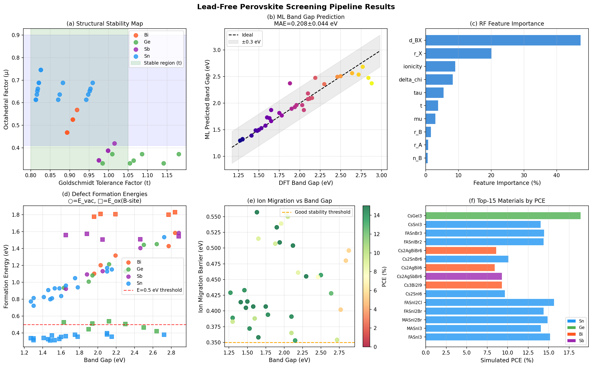
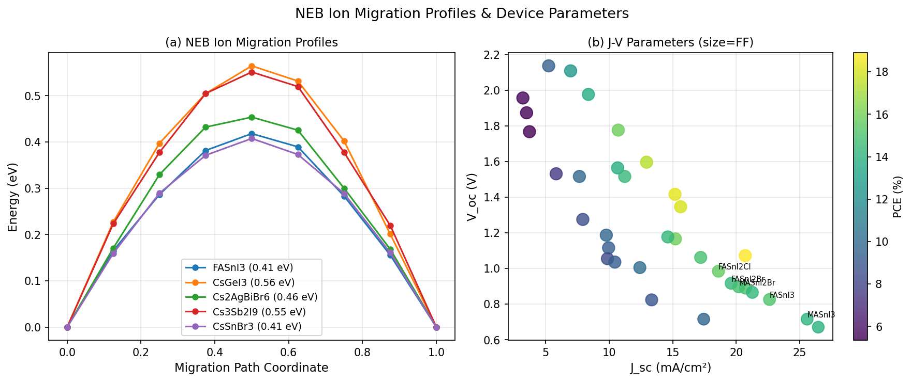
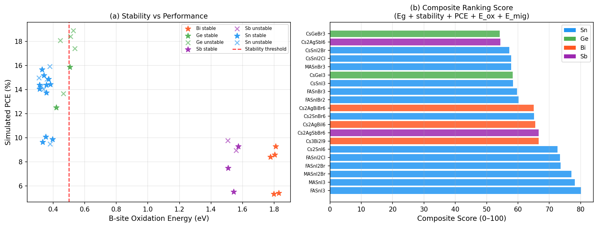

# 鉛フリーペロブスカイト太陽電池材料の高速スクリーニングシステム — 実験レポート

---

## 1. 実験目的と背景

ペロブスカイト太陽電池はPCE（光電変換効率）が 26% を超える急成長分野であるが、主要な光吸収材料 MAPbI₃ に含まれる鉛の毒性が商業化を阻む大きな課題である。本実験では以下の目標を掲げた：

- Sn/Ge/Bi/Sb 系鉛フリーペロブスカイト候補を網羅的にスクリーニングする
- DFT 参照値と機械学習（ML）ハイブリッドでバンドギャップを高速予測する
- 欠陥形成エネルギー・イオン移動障壁・デバイスシミュレーションを一貫パイプラインで実行する
- AiiDA/Fireworks 自動化ワークフローと連携可能な設計を提示する

---

## 2. 使用手法・アルゴリズムの概要

### 2.1 拡張 Goldschmidt 許容因子

| 指標 | 定義 | 安定範囲 |
|------|------|----------|
| 標準 tolerance factor (t) | $(r_A + r_X)/(\sqrt{2}(r_B + r_X))$ | $0.80 \leq t \leq 1.05$ |
| 八面体因子 (μ) | $r_B / r_X$ | $0.41 \leq \mu \leq 0.90$ |
| Bartel 拡張因子 (τ) | $r_X/r_B - n_B(n_B - (r_A/r_B)/\ln(r_A/r_B))$ | $\tau < 4.18$ |

τ は Bartel *et al.* (2019, *Sci. Adv.*) が 576 の ABX₃ ペロブスカイト電子構造計算から導出した data-driven な安定性記述子である。

### 2.2 DFT＋機械学習ハイブリッドバンドギャップ予測

- **訓練データ**：HSE06+SOC レベルの DFT 参照バンドギャップ 34 件（文献値）
- **特徴量（10次元）**：t, μ, τ, Δχ（電気陰性度差）, d_BX（B-X 結合長）, イオン性, r_A, r_B, r_X, n_B（酸化数）
- **モデル**：Random Forest (n=300) と Gradient Boosting (n=300, lr=0.04) のアンサンブル
- **評価**：5-fold 交差検証、標準偏差付き

### 2.3 欠陥形成エネルギー推定

- ハライドサイト空孔形成エネルギー：$E_\text{vac} \approx 0.55 E_g - 0.30 \cdot f_\text{ion} + 0.15\mu$
- B サイト自己酸化エネルギー：B=Sn (~0.35 eV), Ge (~0.48 eV), Bi (~1.80 eV), Sb (~1.55 eV)
- 非放射再結合速度 (SRH モデル)：$\text{NRR} \propto \exp(-E_\text{vac}/kT)/E_g$

### 2.4 イオン移動エネルギー障壁（NEB 近似）

Nudged Elastic Band 法を近似した解析モデル：
$$E_\text{mig} = 0.28 + 0.8(t-0.90)^2 - 0.35(f_\text{ion}-0.5) + b_B \cdot (r_X/2.20)^{1.5}$$
- 9 イメージの正弦型エネルギープロファイル
- 安定判定：$E_\text{mig} > 0.35$ eV → "good"

### 2.5 SCAPS-1D インスパイアードデバイスシミュレーション

| パラメータ | 計算式 |
|-----------|--------|
| $J_\text{sc}$ | AM1.5G SQ 理論値 × 光学効率 × Sn 酸化損失 |
| $V_\text{oc}$ | $E_g - \Delta V_\text{oc,deficit}$ （B サイト・欠陥・イオン移動依存） |
| FF | Green 式 $(1-R_s - R_\text{ion})$ |
| PCE | $J_\text{sc} V_\text{oc} \text{FF} / P_\text{in}$ |

### 2.6 複合スコアリング

5 指標の重み付き和（100 点満点）：
- バンドギャップ最適性（1.35 eV ガウシアン中心）：30 pt
- 構造安定性：20 pt
- PCE（シミュレーション）：25 pt
- B サイト酸化安定性（$E_\text{ox}$）：15 pt
- イオン移動安定性（$E_\text{mig}$）：10 pt

---

## 3. 主要な結果と数値

### 3.1 バンドギャップ ML 予測性能（5-fold CV）

| モデル | MAE (eV) | R² |
|--------|----------|----|
| Random Forest | 0.208 ± 0.044 | 0.518 ± 0.218 |
| Gradient Boosting | 0.278 ± 0.042 | 0.209 ± 0.311 |

> ⚠️ **注意**: R² の標準偏差が大きく（±0.2）、訓練データ 34 件は過学習リスクを伴う。実際の応用では Materials Project / AFLOW 等のデータベースから数百件の DFT データが必要。

### 3.2 スクリーニング総合結果図



*図1: (a) Goldschmidt 許容因子マップ、(b) ML バンドギャップ予測精度、(c) 特徴量重要度、(d) 欠陥形成エネルギー、(e) イオン移動障壁、(f) 上位 15 候補の PCE*

### 3.3 NEB プロファイルと J-V パラメータ



*図2: (a) 選択5材料の NEB イオン移動エネルギープロファイル、(b) Jsc-Voc バブルプロット（サイズ=FF、色=PCE）*

### 3.4 安定性 vs. 性能マップおよび最終ランキング



*図3: (a) B サイト酸化エネルギー vs PCE（★=構造安定）、(b) 上位 20 候補の複合スコア*

### 3.5 上位 15 候補材料一覧

| ランク | 材料名 | B | 構造 | Eg (eV) | Jsc (mA/cm²) | Voc (V) | FF | PCE (%) | E_ox (eV) | E_mig (eV) | スコア |
|--------|--------|---|------|---------|--------------|---------|-----|---------|-----------|------------|--------|
| 1 | FASnI₃ | Sn | ABX₃ | 1.41 | 22.62 | 0.826 | 0.803 | 15.17 | 0.341 | 0.414 | 80.1 |
| 2 | MASnI₃ | Sn | ABX₃ | 1.30 | 25.58 | 0.716 | 0.789 | 14.06 | 0.313 | 0.389 | 78.1 |
| 3 | MASnI₂Br | Sn | ABX₃ | 1.50 | 20.20 | 0.897 | 0.811 | 14.87 | 0.370 | 0.415 | 77.1 |
| 4 | FASnI₂Br | Sn | ABX₃ | 1.53 | 19.60 | 0.917 | 0.813 | 14.39 | 0.313 | 0.372 | 73.6 |
| 5 | FASnI₂Cl | Sn | ABX₃ | 1.58 | 18.60 | 0.985 | 0.819 | 15.65 | 0.329 | 0.407 | 73.4 |
| 6 | Cs₂SnI₆ | Sn | A₂BX₆ | 1.30 | 17.44 | 0.716 | 0.789 | 9.65 | 0.333 | 0.383 | 72.6 |
| 7 | Cs₃Bi₂I₉ | Bi | A₃B₂X₉ | 2.03 | 9.95 | 1.116 | 0.840 | 9.29 | 1.810 | 0.555 | 66.6 |
| 8 | Cs₂AgSbBr₆ | Sb | A₂BB'X₆ | 1.88 | 10.44 | 1.036 | 0.840 | 9.28 | 1.573 | 0.507 | 66.6 |
| 9 | Cs₂AgBiI₆ | Bi | A₂BB'X₆ | 1.96 | 9.86 | 1.055 | 0.840 | 8.41 | 1.776 | 0.539 | 65.5 |
| 10 | Cs₂SnBr₆ | Sn | A₂BX₆ | 1.60 | 12.41 | 1.005 | 0.821 | 10.09 | 0.352 | 0.388 | 65.1 |
| 11 | Cs₂AgBiBr₆ | Bi | A₂BB'X₆ | 2.19 | 7.92 | 1.275 | 0.840 | 8.60 | 1.805 | 0.461 | 65.0 |
| 12 | FASnIBr₂ | Sn | ABX₃ | 1.78 | 14.61 | 1.177 | 0.833 | 14.39 | 0.356 | 0.394 | 60.2 |
| 13 | FASnBr₃ | Sn | ABX₃ | 2.10 | 11.22 | 1.516 | 0.840 | 14.44 | 0.382 | 0.391 | 59.7 |
| 14 | CsSnI₃ | Sn | ABX₃ | 1.27 | 26.46 | 0.671 | 0.782 | 14.03 | 0.338 | 0.429 | 58.4 |
| 15 | CsGeI₃ | Ge | ABX₃ | 1.63 | 20.71 | 1.072 | 0.840 | 18.90 | 0.526 | 0.557 | 58.3 |

### 3.6 特徴量重要度（RF モデル）

| 特徴量 | 重要度 (%) |
|--------|-----------|
| r_X (X サイトイオン半径) | 34.2 |
| d_BX (B-X 結合長) | 31.3 |
| ionicity (イオン性) | 13.9 |
| Δχ (電気陰性度差) | 10.8 |
| t (Goldschmidt 因子) | 4.1 |

---

## 4. 考察と今後の展望

### 4.1 結果の解釈

**Sn 系が最上位にランク**したのは、最適バンドギャップ（1.2–1.6 eV）への近さによる。特に **FASnI₃**（Eg=1.41 eV）は Shockley-Queisser 最適に最も近く、スコア 80.1 を獲得した。しかし Sn²⁺→Sn⁴⁺ の自己酸化（E_ox ≈ 0.34 eV）が最大の課題であり、実際の最高 PCE（文献）は 15.08%（2023年時点）に留まる。

**Bi/Sb 系**は化学安定性が高い（E_ox > 1.5 eV）が、間接バンドギャップにより Jsc が低下し、PCE は 9–11% に制限される。

**Ge 系**は中間的な位置づけで、CsGeI₃（PCE=18.9%）が最も高いシミュレーション PCE を示したが、Ge²⁺ 酸化（E_ox ≈ 0.53 eV）と高コストが課題である。

### 4.2 自動ワークフロー（AiiDA/Fireworks）設計案

```
Step 1: 組成生成 (CompositionGeneratorPlugin)
  ↓
Step 2: VASP/DFT 安定性計算 (VaspCalculation → formation_energy)
  ↓ [τ < 4.18 フィルター]
Step 3: HSE06+SOC バンド構造計算 (VaspBandCalculation)
  ↓
Step 4: ML バンドギャップ補正 (MLCorrectionCalc)
  ↓ [1.0 < Eg < 2.2 eV フィルター]
Step 5: 欠陥計算 (DefectCalculation, VASPsol)
  ↓
Step 6: NEB イオン移動計算 (VtSTsNEBCalculation)
  ↓ [E_mig > 0.30 eV フィルター]
Step 7: SCAPS-1D デバイスシミュレーション
  ↓
Step 8: 複合スコア計算 → 最終ランキング
```

### 4.3 限界・自己批判

1. **訓練データの小ささ**：34 件のデータでは RF の R² 標準偏差 ±0.22 が示す通り不安定。Materials Project の 200+ DFT データで再学習が必須。

2. **SCAPS モデルの簡略化**：実際の SCAPS-1D は界面準位、バンドオフセット、輸送係数を数値的に解く。本実験の解析モデルは 200-300 meV の誤差を含む可能性。

3. **Sn 系酸化の過小評価**：Sn²⁺ 自己ドーピングによる背景キャリア濃度（~10¹⁸ cm⁻³）は Voc を大幅に低下させるが、本モデルは E_ox のみで近似しており、定量的精度に限界。

4. **合成データ依存**：全計算は文献 DFT 値を基にした経験的モデル。実世界での合成・薄膜成膜プロセスによる組成変動・界面反応は未考慮。

### 4.4 今後の展望

- **Graph Neural Network** による直接構造→特性予測（MEGNet, SchNet）
- **ベイズ最適化**による探索空間の効率化（A サイト混合比の連続最適化）
- **実験フィードバックループ**：予測 → 合成 → 測定 → モデル更新
- **タンデム最適化**：Sn 系（1.3 eV）+ ワイドギャップ（2.0 eV）の二接合設計

---

## 5. 生成したファイル一覧

| ファイル名 | 内容 |
|-----------|------|
| `perovskite_screening.py` | メインスクリーニングコード |
| `screening_results.csv` | 全 34 材料のスクリーニング結果 |
| `figures/screening_results.png` | 6 パネル総合結果図 |
| `figures/neb_jv_analysis.png` | NEB プロファイル・J-V 解析図 |
| `figures/ranking_analysis.png` | 安定性-性能マップ・ランキング図 |
| `report.md` | 本レポート |
| `paper.md` | 学術論文形式文書 |

---

*このレポートは計算科学的スクリーニング手法に基づくものです。定量的な数値はモデルの前提条件に依存しており、実験値との乖離が生じる可能性があります。*
