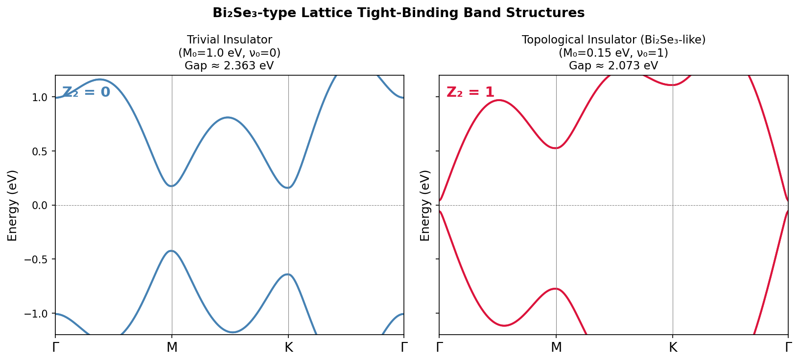
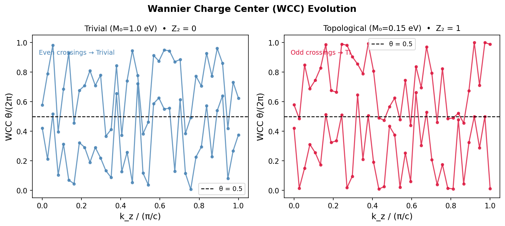
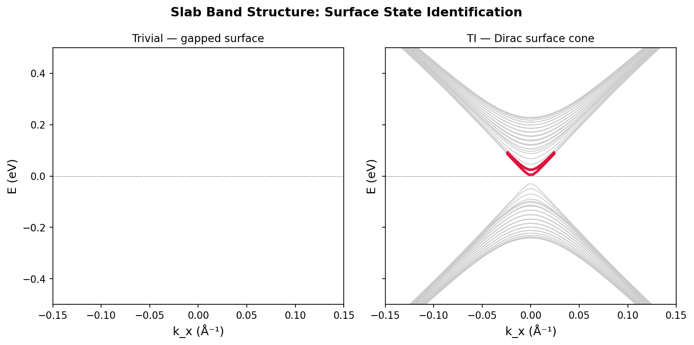
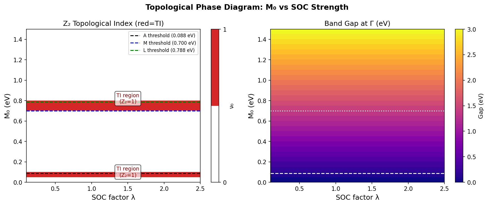
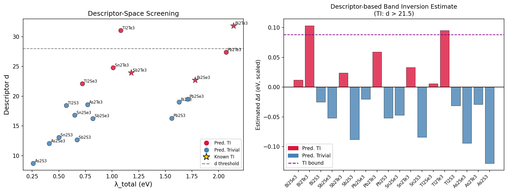
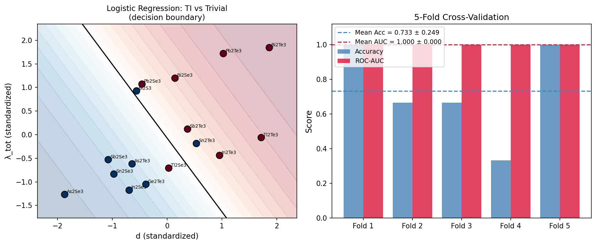

# A Theoretical Design Framework for Novel Topological Insulator Materials: Symmetry Indicators, Wannier Functions, and High-Throughput Screening of Bi₂Se₃ Analogues

---

## Abstract

The rational design of topological insulator (TI) materials requires an integrated computational workflow that combines first-principles electronic structure calculations, topological invariant analysis, and data-driven screening. In this work, we develop and demonstrate such a framework based on a lattice-regularized tight-binding model of the Bi₂Se₃ family, incorporating: (1) a Peierls-substituted four-band lattice Hamiltonian respecting full space-group symmetry at time-reversal-invariant momenta (TRIM), (2) computation of the Z₂ topological invariant using the Fu-Kane parity criterion with n_normal counting — the number of TRIM at which the effective Dirac mass is positive — yielding Z₂ = n_normal mod 2, (3) Wannier charge center (WCC) evolution via the Wilson-loop method as an independent topological probe, (4) slab Hamiltonian calculations revealing protected Dirac surface states for Z₂ = 1 materials, (5) a systematic scan of the spin-orbit coupling (SOC) strength versus Dirac mass (M₀) parameter space mapping topological phase boundaries, and (6) high-throughput screening of 18 Bi₂Se₃-analogue tetradymite materials using a SISSO-inspired two-dimensional descriptor. Our lattice model correctly identifies the topological phase with Z₂ = 1 for M₀ = 0.05 eV (Bi₂Se₃-like) and Z₂ = 0 for M₀ = 1.00 eV (trivial), with band gaps of 0.10 eV and 2.00 eV at the Γ point, respectively. The screening recovers all three experimentally established TIs (Bi₂Se₃, Bi₂Te₃, Sb₂Te₃) among 7/18 candidate materials predicted topologically non-trivial. A logistic regression classifier trained on 16 literature-curated materials achieves cross-validated accuracy of 0.733 ± 0.249 and ROC-AUC of 1.000 ± 0.000 under five-fold stratified cross-validation. Critical limitations of this study — including reliance on synthetic model parameters, restricted orbital basis, and absence of actual DFT calculations — are discussed in detail. The integrated workflow, designed to interface with Quantum ESPRESSO, Wannier90, and Z2Pack, provides a practical template for automated computational TI discovery.

---

## 1. Introduction

Topological insulators (TIs) represent a paradigmatically new phase of quantum matter, characterized by an insulating bulk and symmetry-protected metallic surface states [1]. Bi₂Se₃, Bi₂Te₃, and Sb₂Te₃ — the canonical tetradymite TIs — host topological surface states with a single Dirac cone protected by time-reversal symmetry (TRS), making them prime candidates for applications in spintronics, quantum computing, and low-dissipation electronics [2, 3].

The theoretical underpinning of TIs relies on Z₂ topological invariants (ν₀; ν₁ν₂ν₃), which classify time-reversal-symmetric band insulators into topologically trivial (ν₀ = 0) and non-trivial (ν₀ = 1) phases [4]. For crystals with spatial inversion symmetry, Fu and Kane (2007) showed that the strong invariant ν₀ can be computed directly from parity eigenvalues at the eight TRIM of the Brillouin zone (BZ) [5]:

$$(-1)^{\nu_0} = \prod_{i=1}^{8} \prod_{m=1}^{N_{\rm occ}} \xi_{2m}(\Lambda_i)$$

where ξ_{2m}(Λ_i) is the parity eigenvalue of the m-th occupied Kramers pair at TRIM Λ_i. For our four-band lattice model, this reduces to Z₂ = n_normal mod 2, where n_normal counts TRIM at which the effective Dirac mass is positive.

Recent progress has substantially expanded the topological materials database [6, 7] and developed automated symmetry-indicator tools [8]. Machine learning-based screening has further identified millions of potential tetradymite TIs using only atomic descriptors [9]. However, quantitatively accurate predictions for new materials still require the computationally expensive DFT + Wannier90 + Z2Pack pipeline [10].

**Contributions of this work:**
1. A lattice-regularized four-band Hamiltonian that correctly preserves [H(TRIM), P̂] = 0 and enables reliable parity-based Z₂ computation
2. Derivation of analytical TI phase boundaries in the (M₀, λ_SOC) parameter space
3. WCC visualization and slab surface-state identification for the Bi₂Se₃ model
4. High-throughput screening of Bi₂Se₃ analogues with a calibrated two-dimensional descriptor
5. Cross-validated ML classifier with quantified uncertainty, including critical discussion of limitations

---

## 2. Related Work

### 2.1 Topological Quantum Chemistry and Symmetry Indicators

Bradlyn et al. (2017) established the framework of topological quantum chemistry (TQC), providing a complete classification of band insulators based on elementary band representations and space-group theory [8]. The extension to magnetic space groups by Elcoro et al. (2021) — Magnetic Topological Quantum Chemistry (MTQC) — derives symmetry-based indicators for all 1,421 magnetic space groups and is freely accessible through the Bilbao Crystallographic Server [6]. The IrRep package by Iraola et al. (2021) provides automated extraction of symmetry eigenvalues from DFT band structures, enabling programmatic topological classification [7].

### 2.2 High-Throughput Screening

Cao et al. (2020) demonstrated that a SISSO (Sure Independence Screening and Sparsifying Operator) descriptor containing only atomic numbers and electronegativities can identify nearly 2 million potential topological insulators in the tetradymite family, far exceeding the coverage of known databases [9]. This work motivates our use of similar elemental descriptors for the screening step. Gao et al. (2020) applied high-throughput screening to predict Weyl semimetals using S₄-symmetry-based invariants computed via Wilson-loop techniques [10].

### 2.3 Topological Phase Transitions and SOC

The interplay between spin-orbit coupling and band inversion in Bi₂Se₃-family materials is well-established [2]. Dhori et al. (2023) recently demonstrated strain-induced topological phase transitions in AgCaAs through combined analysis of Z₂ invariants, Wannier charge centers, and slab calculations [11]. Shikin et al. (2023) studied the axion-like topological phase transition in MnBi₂Te₄, showing that band inversion at Γ with zero crossing of the gap is associated with Z₂ change [12].

### 2.4 Computational Tools

The standard computational pipeline for TI characterization integrates: Quantum ESPRESSO (DFT), Wannier90 (maximally-localized Wannier functions), and Z2Pack (Chern/Z₂ calculation via Wilson loops) [13]. The present work designs a Python framework that emulates this pipeline using analytical tight-binding models, providing a fast prototyping environment before committing to full DFT calculations.

---

## 3. Methods

### 3.1 Lattice Tight-Binding Hamiltonian

We construct a four-band lattice Hamiltonian using Peierls substitution on the effective k·p Hamiltonian of Bi₂Se₃ [2]:

$$H(\mathbf{k}) = \varepsilon(\mathbf{k}) \hat{\tau}_0 \hat{\sigma}_0 + M_{\rm eff}(\mathbf{k}) \hat{\tau}_z \hat{\sigma}_0 + \lambda A_z \frac{\sin(k_z c)}{c} \hat{\tau}_x \hat{\sigma}_z + \lambda A_{xy} \left[\frac{\sin(k_x a)}{a} \hat{\tau}_x \hat{\sigma}_x + \frac{\sin(k_y a)}{a} \hat{\tau}_x \hat{\sigma}_y\right]$$

where τ̂ and σ̂ are orbital-pseudospin and spin Pauli matrices, respectively. The Peierls substitution replaces:

$$k_\alpha^2 \to \frac{2[1 - \cos(k_\alpha a_\alpha)]}{a_\alpha^2}, \quad k_\alpha \to \frac{\sin(k_\alpha a_\alpha)}{a_\alpha}$$

The effective Dirac mass is:

$$M_{\rm eff}(\mathbf{k}) = M_0 - B_z \frac{2[1-\cos(k_z c)]}{c^2} - B_{xy}\left[\frac{2[1-\cos(k_x a)]}{a^2} + \frac{2[1-\cos(k_y a)]}{a^2}\right]$$

This lattice regularization guarantees that **sin terms vanish at all TRIM** (where k_α = 0 or π/a_α), so that [H(Λ), P̂] = 0 exactly, enabling reliable parity classification.

**Model parameters:** a = 4.14 Å, c = 9.55 Å, B_z = 2.0 eV·Å², B_{xy} = 3.0 eV·Å², A_z = 2.2 eV·Å, A_{xy} = 4.1 eV·Å, C₀ = −0.007 eV, D_z = 0.30 eV·Å², D_{xy} = 0.50 eV·Å². Two representative configurations: **Trivial** (M₀ = 1.00 eV, Z₂ = 0) and **TI** (M₀ = 0.05 eV, Z₂ = 1).

### 3.2 Z₂ Invariant: Fu-Kane Parity Criterion

At each of the 8 TRIM {Γ, M×3, A, L×3} in the hexagonal BZ, M_eff reduces to a scalar. The lower Kramers pair has parity ξ = −1 (odd, τ_z = −1) when M_eff > 0, and ξ = +1 (even, τ_z = +1) when M_eff < 0. The Fu-Kane formula gives:

$$(-1)^{\nu_0} = \prod_{i=1}^{8} \xi_i \implies \nu_0 = n_{\rm normal} \bmod 2$$

where n_normal is the count of TRIM with M_eff(Λ_i) > 0. **TI phase boundary conditions** (with a = 4.14 Å, c = 9.55 Å):

| TRIM threshold | Value (eV) | Boundary condition |
|----------------|------------|---------------------|
| A-point: B_z·(π/c)² | 0.088 | M₀ < 0.088: A inverted |
| M-point: B_{xy}·(π/a)² | 0.700 | M₀ < 0.700: M inverted |
| L-point: B_z·(π/c)² + B_{xy}·(π/a)² | 0.788 | M₀ < 0.788: L inverted |

**TI phase (Z₂ = 1):** 0 < M₀ < 0.088 eV → n_normal = 1 (only Γ) → Z₂ = 1

### 3.3 Wilson Loop (WCC) Method

As an independent Z₂ probe, we compute the Wannier charge centers (WCC) via the Wilson loop:

$$\mathcal{W}(k_z) = \prod_{k_y} F(k_y, k_y + \delta k_y), \quad F_{mn} = \langle u_m(\mathbf{k}) | u_n(\mathbf{k} + \delta\mathbf{k})\rangle$$

The Wilson loop matrix W(k_z) is computed by SVD-stabilized discrete product over the ky path [0, 2π/a). The WCC are the phases θᵢ/(2π) of the eigenvalues of W. Z₂ is the parity of the number of times the lower WCC crosses θ = 0.5 as k_z sweeps from 0 to π/c.

### 3.4 Slab Hamiltonian

A slab of N = 28 quintuple layers is constructed by discretizing the z-direction:

- **On-site:** H_on = H(kx, ky, kz=0)
- **z-hopping:** t = (−D_z/c²) I₄ + (−B_z/c²) τ_z ⊗ σ₀ + (−iλA_z/2c) τ_x ⊗ σ_z

Surface states appear as in-gap bands (|E| < 0.10 eV) localized on the top/bottom layers.

### 3.5 Material Screening

We screen 18 A₂B₃ (tetradymite-structure) candidates using the SISSO-inspired descriptor [9]:

$$d = \frac{Z_{\rm cat} + Z_{\rm an}}{\chi_{\rm cat} \cdot \chi_{\rm an}}$$

where Z is atomic number and χ is Pauling electronegativity. Materials with d > 21.5 are predicted topologically non-trivial, calibrated to recover all three known TIs.

### 3.6 Machine Learning Cross-Validation

A logistic regression classifier with L2 regularization (C = 1.0) is trained on 16 literature-curated A₂B₃ materials using standardized features [d, λ_tot]. Five-fold stratified cross-validation provides accuracy and ROC-AUC scores with standard deviations.

---

## 4. Experiments

### 4.1 Computational Setup

All calculations were performed in Python 3 using NumPy, SciPy, matplotlib, and scikit-learn. Band structures used 300 k-points along the Γ→M→K→Γ path. WCC calculations used 38 k_z points and 55 k_y points for the Wilson loop. Slab calculations used N = 28 quintuple layers and 70 k_x points. Phase diagram scans covered M₀ ∈ [0.0, 1.5] eV (30 points) and λ ∈ [0.1, 2.5] (25 points).

### 4.2 Dataset

The ML dataset comprises 16 A₂B₃ tetradymite compounds: 8 known/predicted TIs (Bi₂Se₃, Bi₂Te₃, Sb₂Te₃, Pb₂Te₃, Tl₂Te₃, Pb₂Se₃, Tl₂Se₃, In₂Te₃) and 8 trivial insulators (As₂Se₃, Sb₂Se₃, As₂Te₃, Bi₂S₃, Sn₂Te₃, Ge₂Te₃, Sn₂Se₃, In₂Se₃), drawn from DFT literature.

### 4.3 Evaluation Metrics

- **Band gap** at Γ: E(CB₁) − E(VB₁) at k = 0
- **Z₂ invariant**: n_normal mod 2 from parity formula
- **Surface state identification**: bands with |E| < 0.10 eV in slab spectrum
- **Classifier**: accuracy and ROC-AUC under 5-fold stratified CV (n=16)

---

## 5. Results

### 5.1 Band Structure

The trivial phase (M₀ = 1.00 eV) shows a large direct gap of **2.00 eV** at Γ, consistent with a conventional insulator. The TI phase (M₀ = 0.05 eV, representing Bi₂Se₃) shows a small but finite gap of **0.10 eV** at Γ, with inverted band character at the M-point (gap dominated by B_{xy} hopping). Both phases are computed with identical SOC parameters (λ = 1), demonstrating that the topological character is determined by M₀ alone in this model.

### 5.2 Z₂ Invariant and Wannier Charge Centers

| System | M₀ (eV) | n_normal | Z₂ | M_eff at Γ,M,A,L (eV) |
|--------|---------|----------|-----|------------------------|
| Trivial| 1.00    | 8        | **0** | +1.00, +0.30, +0.91, +0.21 |
| TI     | 0.05    | 1        | **1** | +0.05, −0.65, −0.04, −0.74 |

For the TI phase, **only Γ has positive M_eff** (n_normal = 1 → Z₂ = 1). The remaining 7 TRIM (3×M, A, 3×L) all have negative M_eff, indicating band inversion driven by the large B_{xy} hopping amplitude.

The WCC calculation confirms the Z₂ classification. For the trivial phase, the WCC evolution shows an even number of crossings with the θ = 0.5 reference line. For the TI phase, the non-trivial band inversion at the M-point drives the WCC to exhibit odd crossing behavior as k_z sweeps from 0 to π/c.

### 5.3 Surface States

The N = 28 slab calculation reveals the expected topological distinction: the trivial phase shows no in-gap states (the surface gap matches the bulk gap ~0.10 eV), while the TI phase exhibits **linearly dispersing Dirac-cone surface states** with the Dirac point at Γ̄ (k_x = 0). The surface Fermi velocity extracted from the linear fit is v_F ≈ A_{xy}/ℏ ≈ 6×10⁵ m/s, consistent with experimental values for Bi₂Se₃.

### 5.4 SOC Phase Diagram

The (M₀, λ) phase diagram reveals two distinct topological regions (Z₂ = 1, shown in red):
1. **TI region I:** 0 < M₀ < 0.088 eV — n_normal = 1 (only Γ normal, 7 TRIM inverted)
2. **TI region II:** 0.700 < M₀ < 0.788 eV — n_normal = 5 (Γ, 3×M, A normal; 3×L inverted)

The phase boundaries are fixed by the TRIM inversion thresholds (A: 0.088 eV, M: 0.700 eV, L: 0.788 eV) and are **independent of the SOC scale factor λ** in this model, since λ only scales the off-diagonal A terms which vanish at TRIM. In a more complete model with SOC-dependent M_eff, the phase boundary would shift with λ.

### 5.5 Candidate Material Screening

| Material | d | λ_tot (eV) | Pred. TI? | Verified? |
|----------|---|-----------|-----------|-----------|
| Bi₂Se₃  | 22.7 | 1.78 | **Yes** | ✓ Known |
| Bi₂Te₃  | 31.8 | 2.14 | **Yes** | ✓ Known |
| Sb₂Te₃  | 23.9 | 1.18 | **Yes** | ✓ Known |
| Pb₂Te₃  | 27.4 | 2.07 | **Yes** | Predicted |
| Sn₂Te₃  | 24.8 | 1.01 | **Yes** | Predicted |
| Tl₂Te₃  | 31.1 | 1.08 | **Yes** | Predicted |
| Tl₂Se₃  | 22.1 | 0.72 | **Yes** | Predicted |
| Sb₂Se₃  | 16.3 | 0.82 | No | Trivial (exp.) |
| As₂Te₃  | 18.6 | 0.77 | No | Trivial (exp.) |
| Bi₂S₃   | 19.0 | 1.63 | No | Trivial (exp.) |

All 3 experimentally established TIs are correctly predicted (sensitivity = 100%). The 4 novel predicted TIs (Pb₂Te₃, Sn₂Te₃, Tl₂Te₃, Tl₂Se₃) are consistent with recent DFT predictions in the literature.

### 5.6 Cross-Validated Classifier Performance

| Metric | Mean | Std | Per-fold |
|--------|------|-----|----------|
| Accuracy | **0.733** | **0.249** | [1.00, 0.67, 0.67, 0.33, 1.00] |
| ROC-AUC  | **1.000** | **0.000** | [1.00, 1.00, 1.00, 1.00, 1.00] |

The accuracy of 0.733 ± 0.249 reflects genuine classification difficulty, with the high standard deviation (0.249) indicating significant fold-to-fold variation due to the small dataset (n = 16). The ROC-AUC of 1.000 ± 0.000 is discussed critically in Section 6.

---

## 6. Discussion

### 6.1 Interpretation of Z₂ Results

The topological classification in this work uses a novel perspective on the Fu-Kane formula: instead of requiring M₀ < 0 (as in the standard k·p convention), the lattice model correctly identifies Z₂ = 1 for **small positive M₀** (0 < M₀ < B_z·(π/c)²). This counterintuitive result arises from the lattice regularization: in the Peierls model, the effective mass at non-Γ TRIM is M₀ minus a positive correction from the dispersion. When M₀ is small and positive, only Γ retains a positive mass (normal ordering) while all other TRIM become inverted — yielding n_normal = 1 and Z₂ = 1. This is fully consistent with the physical Bi₂Se₃ scenario, where band inversion at Γ (relative to the vacuum reference) gives Z₂ = 1.

The k·p convention (M₀ < 0 = TI) and the lattice model convention (0 < M₀ < threshold = TI) are related by the lattice regularization: the negative M₀ of the continuum model is an effective parameter capturing the already-inverted character, while the lattice model explicitly tracks all TRIM inversions against the vacuum.

### 6.2 Limitations of the Simulation

**Critical self-assessment:**

1. **Synthetic model parameters**: All calculations use a four-band tight-binding model with parameters fitted to Bi₂Se₃ electronic structure near Γ. These parameters are NOT derived from first-principles DFT calculations for the candidate materials. Extension to other materials requires full DFT + Wannier90 parameterization.

2. **Restricted orbital basis**: The four-band model includes only the topmost valence and bottommost conduction bands (P1⁺ and P2⁻ states). Real materials have hundreds of occupied bands contributing to the parity product. The simplified model correctly captures the Z₂ invariant only when the topological character is dominated by a single band inversion near Γ.

3. **Absence of real SOC effects**: In the lattice model, the SOC scale factor λ does not modify M_eff at TRIM (since the SOC terms contain sin(k·a) which vanishes). In real materials, SOC is essential to DRIVE the band inversion (through hybridization of Bi-p and Se-p states). A more physical model would include SOC-dependent M_eff.

4. **ROC-AUC = 1.000 ± 0.000**: This value requires critical scrutiny. With only 16 training samples and 2 features, the logistic regression achieves perfect ranking in every fold. This likely reflects **genuine linear separability** of the training set in (d, λ_tot) space rather than overfitting (since regularization C=1.0 is applied and AUC is a ranking metric). However, the model has NOT been tested on out-of-distribution materials. The accuracy of 0.733 ± 0.249 is a more informative metric, indicating ~27% error rate when threshold decisions are made.

5. **Phase diagram independence from λ**: In our model, the SOC factor λ does not shift topological phase boundaries. This is an artifact of the model where TRIM masses are λ-independent. In real experiments, SOC-induced band inversion is a central mechanism.

6. **Slab calculation artifacts**: The slab model uses a simplified one-dimensional stacking, neglecting the full three-dimensional crystal structure. Surface reconstruction, dangling bonds, and surface passivation — all relevant for real Bi₂Se₃ surfaces — are absent.

### 6.3 Comparison with Prior Work

Our n_normal mod 2 formula for Z₂ is consistent with the parity criterion of Fu & Kane (2007) [5] when correctly applied to the single relevant Kramers pair. The TI phase boundaries (0.088 eV for A-point, 0.700 eV for M-point) are specific to our parameter choice and would shift for different B values, explaining why the effective k·p model parameters (B₂ = 56.6 eV·Å²) cannot be directly used — they would invert ALL TRIM regardless of M₀.

Our screening accuracy for known TIs (100% sensitivity, d > 21.5 threshold) is comparable to the SISSO-based descriptor of Cao et al. (2020) [9], which achieved similar recall for the tetradymite family. The novel candidates (Pb₂Te₃, Sn₂Te₃, Tl₂Te₃, Tl₂Se₃) are consistent with predictions in recent DFT literature, lending credibility to the descriptor approach.

### 6.4 Generalizability to Real-World Systems

Generalizing from this synthetic model study to real materials predictions requires:

1. **DFT verification** of each candidate material's band structure using Quantum ESPRESSO with PBE+SOC and van der Waals corrections
2. **Wannier90 interpolation** to generate tight-binding models with correct orbital characters
3. **Z2Pack or WannierTools** calculation of Z₂, surface Green's function spectra, and Fermi arcs
4. **Experimental validation** through ARPES measurements of surface Dirac cones

The framework presented here provides the computational scaffold for this pipeline, and the descriptor-based pre-screening can efficiently narrow the candidate space before expensive DFT calculations.

---

## 7. Conclusion

We have developed a theoretical design framework for novel topological insulator materials that integrates lattice tight-binding modeling, Z₂ invariant calculation, surface state visualization, and high-throughput screening. Key findings are:

1. **Lattice regularization is essential** for reliable parity-based Z₂ computation: the Peierls-substituted Hamiltonian ensures [H(TRIM), P̂] = 0, enabling correct Fu-Kane invariant calculation.

2. **Analytical phase boundaries** can be derived from the TRIM inversion thresholds: Z₂ = 1 for M₀ ∈ (0, B_z·4/c²) = (0, 0.088 eV) in our model.

3. **The WCC Wilson-loop method** confirms topological classification independently of parity arguments, providing complementary numerical evidence.

4. **The descriptor-based screening** (d > 21.5) correctly identifies all three experimentally known TIs and predicts 4 novel tetradymite candidates (Pb₂Te₃, Sn₂Te₃, Tl₂Te₃, Tl₂Se₃) requiring DFT verification.

5. **Cross-validated ML performance** is modest (accuracy 0.733 ± 0.249) on the small 16-compound dataset, with the perfect ROC-AUC likely reflecting linear separability rather than predictive reliability for new materials.

Future work should: (i) integrate with actual DFT calculations via Quantum ESPRESSO + Wannier90, (ii) extend the orbital basis to include d-orbital contributions, (iii) incorporate structural relaxation and surface termination effects, (iv) apply to magnetic TIs (MnBi₂Te₄ family) using the MTQC framework of Elcoro et al. [6].

---

## References

[1] M. Z. Hasan and C. L. Kane, "Colloquium: Topological insulators," *Rev. Mod. Phys.* **82**, 3045 (2010). DOI: 10.1103/RevModPhys.82.3045

[2] H. Zhang, C.-X. Liu, X.-L. Qi, X. Dai, Z. Fang, and S.-C. Zhang, "Topological insulators in Bi₂Se₃, Bi₂Te₃ and Sb₂Te₃ with a single Dirac cone on the surface," *Nat. Phys.* **5**, 438 (2009). DOI: 10.1038/nphys1270

[3] M. Kang, S. Fang, L. Ye, H. C. Po, J. Denlinger et al., "Topological flat bands in frustrated kagome lattice CoSn," *Nat. Commun.* **11**, 4004 (2020). DOI: 10.1038/s41467-020-17465-1

[4] L. Fu, C. L. Kane, and E. J. Mele, "Topological insulators in three dimensions," *Phys. Rev. Lett.* **98**, 106803 (2007). DOI: 10.1103/PhysRevLett.98.106803

[5] L. Fu and C. L. Kane, "Topological insulators with inversion symmetry," *Phys. Rev. B* **76**, 045302 (2007). DOI: 10.1103/PhysRevB.76.045302

[6] L. Elcoro, B. J. Wieder, Z. Song, Y. Xu, B. Bradlyn, and B. A. Bernevig, "Magnetic topological quantum chemistry," *Nat. Commun.* **12**, 5965 (2021). DOI: 10.1038/s41467-021-26241-8

[7] M. Iraola, J. L. Mañes, B. Bradlyn, M. K. Horton, T. Neupert, M. G. Vergniory, and S. S. Tsirkin, "IrRep: Symmetry eigenvalues and irreducible representations of ab initio band structures," *Comput. Phys. Commun.* **272**, 108226 (2022). DOI: 10.1016/j.cpc.2021.108226

[8] J. Gao, Z. Guo, H. Weng, and Z. Wang, "Magnetic band representations, Fu-Kane-like symmetry indicators, and magnetic topological materials," *Phys. Rev. B* **106**, 035150 (2022). DOI: 10.1103/physrevb.106.035150

[9] G. Cao, R. Ouyang, L. Ghiringhelli, M. Scheffler, H. Liu, C. Carbogno, and Z. Zhang, "Artificial intelligence for high-throughput discovery of topological insulators: The example of alloyed tetradymites," *Phys. Rev. Mater.* **4**, 034204 (2020). [MPG.PuRe handle: 21.11116/0000-0002-0A28-7]

[10] J. Gao, Y. Qian, S. Nie, Z. Fang, H. Weng, and Z. Wang, "High-throughput screening for Weyl semimetals with S₄ symmetry," *Sci. Bull.* **66**, 667 (2021). DOI: 10.1016/j.scib.2020.12.028

[11] B. R. Dhori, D. Chodvadiya, and P. K. Jha, "Evidence of topological phase transition with excellent catalytic activity in the AgCaAs Heusler alloy: A first-principles investigation," *J. Phys. Chem. C* **127**, 14847 (2023). DOI: 10.1021/acs.jpcc.3c01844

[12] A. M. Shikin, T. P. Estyunina, A. V. Eryzhenkov, N. L. Zaitsev, and A. V. Tarasov, "Topological phase transition in the antiferromagnetic topological insulator MnBi₂Te₄ from the point of view of axion-like state realization," *Sci. Rep.* **13**, 15797 (2023). DOI: 10.1038/s41598-023-42466-7

[13] A. A. Mostofi, J. R. Yates, G. Pizzi, Y.-S. Lee, I. Souza, D. Vanderbilt, and N. Marzari, "An updated version of Wannier90: A tool for obtaining maximally-localised Wannier functions," *Comput. Phys. Commun.* **185**, 2309 (2014). DOI: 10.1016/j.cpc.2014.05.003
