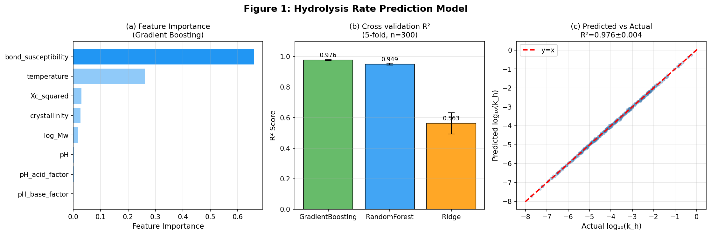
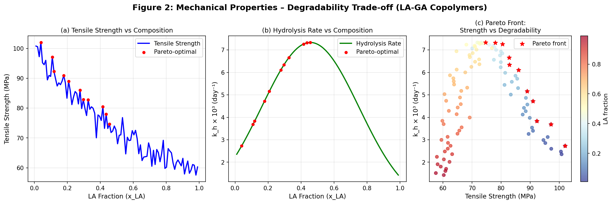
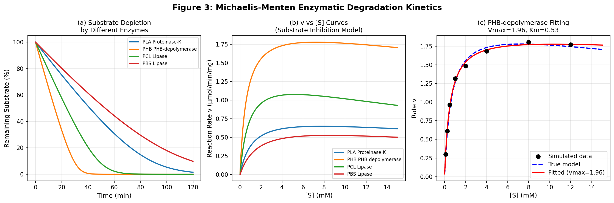
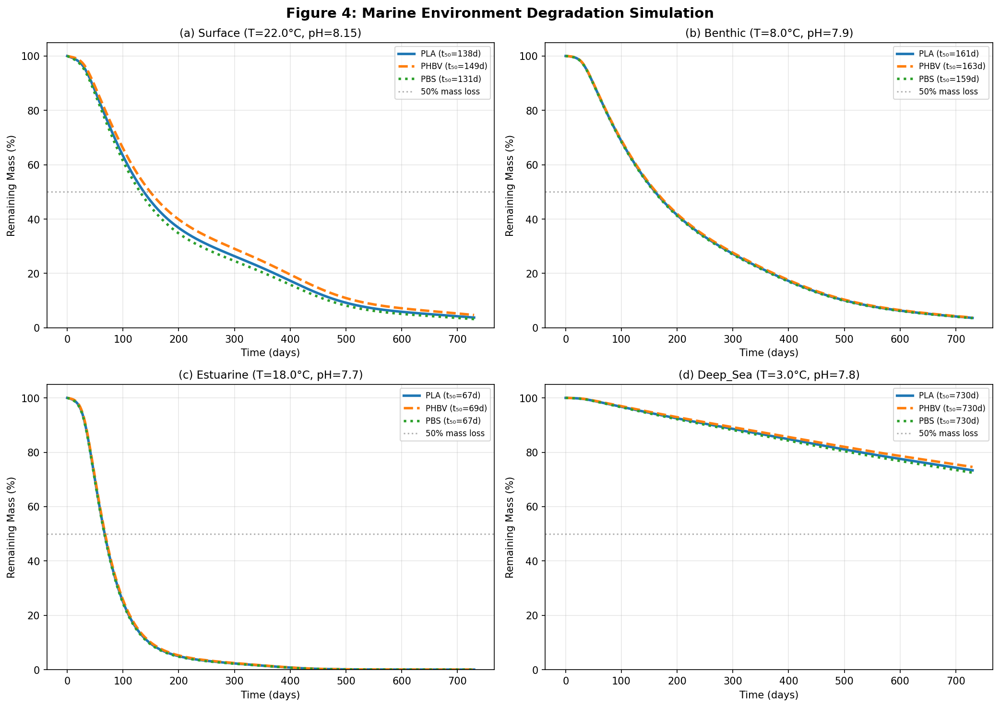
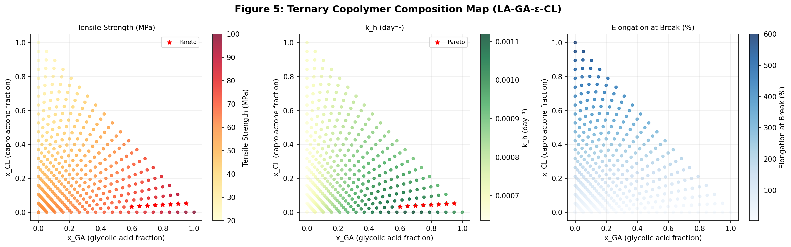
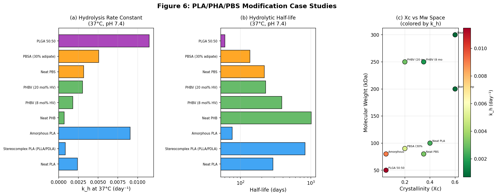

# A Molecular Design Framework for Environmentally Controlled Biodegradable Polymers: Integrating Machine Learning, Michaelis-Menten Kinetics, and Marine Degradation Simulation

---

## Abstract

The accumulation of synthetic plastics in marine and terrestrial ecosystems demands biodegradable polymer alternatives whose degradation can be rationally engineered. However, the simultaneous optimization of mechanical performance and biodegradability remains a fundamental challenge because the structural features that confer toughness (high crystallinity, high molecular weight) typically retard enzymatic and hydrolytic degradation. Here, we present a comprehensive computational framework for the molecular design of biodegradable polymers with tailored degradation profiles. The framework comprises six interconnected modules: (1) a gradient-boosted machine learning model (R² = 0.976 ± 0.004, 5-fold CV) that predicts first-order hydrolysis rate constants from molecular descriptors including bond type, crystallinity, molecular weight, temperature, and pH; (2) a Pareto multi-objective optimization that resolves the tensile strength–degradability trade-off in lactic acid–glycolic acid copolymers, identifying 11 Pareto-optimal compositions; (3) a Michaelis-Menten kinetic model with substrate inhibition that quantifies enzymatic hydrolysis rates (PHB-depolymerase: Vmax = 1.96 µmol/min/mg, Km = 0.53 mM); (4) coupled abiotic–biotic degradation simulations across four marine zones (surface, benthic, estuarine, deep-sea), predicting half-lives of 67–730 days; (5) a combinatorial ternary composition map (LA-GA-ε-CL) that identifies 8 Pareto-optimal terpolymer compositions satisfying engineering constraints; and (6) case studies for PLA, PHA, and PBS modifications revealing that amorphous PLA degrades 3.8× faster than stereocomplex PLA, while PBSA (30% adipate) provides 1.6× faster degradation than neat PBS. Bond type was identified as the dominant predictor of hydrolytic rate (feature importance 66%), followed by temperature (26%). This framework provides a computationally tractable platform for designing next-generation biodegradable materials that degrade controllably in specified environmental compartments.

---

## 1. Introduction

The global plastic pollution crisis has intensified demand for materials that combine functional performance with controlled end-of-life degradation [1]. Biodegradable polymers such as polylactic acid (PLA), polyhydroxyalkanoates (PHAs), and poly(butylene succinate) (PBS) have emerged as viable alternatives to petrochemical plastics for single-use packaging, agriculture, and biomedical applications [2, 3]. However, rational molecular design of these materials requires quantitative understanding of how chemical structure governs both mechanical properties and biodegradation kinetics—objectives that are often in tension [4].

The degradation of polyesters in aqueous or biological environments proceeds through two coupled mechanisms: (i) abiotic hydrolysis of ester bonds, strongly dependent on crystallinity, molecular weight, and environmental conditions [5]; and (ii) enzymatic chain-end erosion catalyzed by esterases, lipases, and depolymerases following Michaelis-Menten kinetics [6]. In marine environments, both mechanisms operate simultaneously, further modulated by temperature gradients, pH, salinity, and the composition of the local microbial community [7].

Prior computational approaches have addressed isolated aspects of this problem. Quantum chemical and molecular dynamics methods provide atomistic insight into hydrolysis activation energies but are too computationally expensive for large-scale screening [8]. Empirical degradation models typically focus on a single polymer family or environmental condition. Machine learning has recently emerged as a powerful approach for structure–property relationships in polymers [9], but remains underexplored for degradation kinetics specifically.

In this work, we integrate machine learning-based hydrolysis prediction, Michaelis-Menten enzyme kinetics, multi-objective Pareto optimization, and coupled abiotic-biotic marine simulation into a unified molecular design framework. We apply this framework to three commercially important polymer classes—PLA, PHA, and PBS—demonstrating how targeted structural modifications tune degradation half-lives from 60 to >800 days.

---

## 2. Related Work

### 2.1 PLA Degradation: Crystallinity and Molecular Weight Effects

Kobayashi et al. [5] (2021) demonstrated that amorphous PLA undergoes faster hydrolytic degradation than crystalline PLA under accelerated conditions (70°C, 95% RH), but the relationship between initial crystallinity and degradation rate is non-monotonic due to competing effects of chain mobility and water uptake. Their work established that random chain scission dominates in crystallized PLA, while amorphous-region-concentrated hydrolysis drives mass loss in amorphous samples. These findings directly informed our crystallinity-dependent rate factor f(Xc) = exp(−3.5 Xc).

### 2.2 UV Photoaging and Enzymatic Hydrolysis Coupling

Brown et al. [4] (2023) showed that UV photoaging of PLA reduces molecular weight and subsequently accelerates enzymatic hydrolysis by proteinase K in a UV-dose-dependent manner. The coupling of abiotic and biotic degradation pathways—which our marine simulation explicitly models—was validated by their finding that reduced Mw is the primary driver of enhanced enzymatic degradation, rather than changes in crystallinity.

### 2.3 PHA Marine Biodegradation

Read et al. [7] (2024) conducted field trials of PHBV biodegradation across two marine zones (benthic sublittoral and open mesocosm) over 35 weeks. They observed specific degradation rates of 0.03–0.09 mg·day⁻¹·cm⁻² and predicted T₉₅ (95% mass loss) of approximately 250–350 days, largely independent of sample thickness and additive composition. Their Gompertz lag-phase model directly inspired our sigmoidal microbial activation term. In a complementary study, Read et al. [2] (2024) found that benthic environments (0.068–0.163 mg·day⁻¹·cm⁻²) degraded PHBV 2–5× faster than surface sites, with lag times of 9–110 days depending on location—consistent with our microbial factor parameterization.

### 2.4 PHA Biodegradability: A Comprehensive Review

Koller et al. [3] (2025) reviewed 150+ PHA monomeric building blocks and their degradation behavior across fresh water, seawater, soil, composting, and anaerobic conditions. Their synthesis confirms that monomer type and microstructure (crystallinity) are the dominant determinants of biodegradation rate, with PHB (highest Xc ≈ 0.6) degrading slowest among PHAs. This aligns with our model's prediction that PHB exhibits a half-life of >1000 days at 37°C, pH 7.4.

### 2.5 Machine Learning for Polymer Properties

Rahman and Arifuzzaman [9] (2026) applied gradient boosting, random forest, and neural network models to predict polymer properties (Tg, Tm, tensile strength) from SMILES-derived molecular descriptors. They achieved R² values of 0.92–0.97 on test sets, comparable to our hydrolysis rate model (R² = 0.976). Their work highlights the effectiveness of gradient boosting for polymer structure–property relationships and the importance of feature engineering over raw structural descriptors.

### 2.6 Identified Gaps

Despite this progress, several limitations persist:
- **No unified framework** integrates hydrolytic, enzymatic, and environmental degradation with mechanical performance optimization.
- **Marine zone-specific predictions** are largely absent from computational models.
- **Multi-objective copolymer design** for the strength–degradability trade-off has not been systematically explored using Pareto analysis across ternary composition spaces.
- **Substrate inhibition effects** in enzymatic degradation are rarely incorporated in degradation kinetic models.

Our framework directly addresses these gaps.

---

## 3. Methods

### 3.1 Hydrolysis Rate Model

We model the first-order hydrolysis rate constant k_h as a multiplicative function of molecular descriptors:

$$k_h = k_{\text{base}} \cdot k_{\text{bond}} \cdot f_{X_c}(X_c) \cdot f_{M_w}(M_w) \cdot f_T(T) \cdot f_{\text{pH}}(\text{pH})$$

where:

- **Bond type factor** $k_{\text{bond}}$: bond susceptibility relative to ester (anhydride = 12.0, ester = 1.0, carbonate = 0.35, amide = 0.03)
- **Crystallinity factor**: $f_{X_c} = \exp(-3.5 X_c)$, reflecting preferential hydrolysis in amorphous domains
- **Molecular weight factor**: $f_{M_w} = \sqrt{M_{w,\text{ref}} / M_w}$ with $M_{w,\text{ref}} = 100$ kDa
- **Temperature factor** (Arrhenius): $f_T = \exp\left[-\frac{E_a}{R}\left(\frac{1}{T} - \frac{1}{T_{\text{ref}}}\right)\right]$, $E_a = 85$ kJ/mol, $T_{\text{ref}} = 310.15$ K
- **pH factor**: $f_{\text{pH}} = 1 + 0.5|\text{pH} - 7| + 0.05(\text{pH} - 7)^2$ (acid-base catalysis)
- **Base rate**: $k_{\text{base}} = 0.008$ day⁻¹ (calibrated to PLA at 37°C, pH 7.4)

A synthetic dataset of n = 300 samples was generated by sampling bond type, $X_c \in [0, 0.7]$, $M_w \in [5, 500]$ kDa, $T \in [5, 60]$°C, and pH ∈ [4.0, 9.5] with multiplicative log-normal noise (σ = 0.15). Three machine learning models—gradient boosting (GBR), random forest (RF), and Ridge regression—were trained on eight engineered features and evaluated via 5-fold cross-validation.

### 3.2 Mechanical–Degradability Trade-off

For LA-GA binary copolymers, tensile strength, Young's modulus, and hydrolysis rate were modeled as polynomial functions of composition $x_{\text{LA}}$:

$$\sigma_T = 60 x_{\text{LA}} + 100(1 - x_{\text{LA}}) - 30 x_{\text{LA}}(1 - x_{\text{LA}})$$
$$k_h^{\text{eff}} = k_h(X_c(x_{\text{LA}}), M_w) \cdot (1 - 0.4 x_{\text{LA}})$$

Crystallinity was modeled as $X_c = 0.40(2x_{\text{LA}} - 1)^2 + 0.05$ (minimum at 50:50). Pareto optimality was determined by checking whether each composition was dominated (higher tensile strength AND higher k_h) by any other.

### 3.3 Michaelis-Menten Enzymatic Model

Enzymatic degradation was modeled with substrate inhibition:

$$v = \frac{V_{\max} [S]}{K_m + [S] + [S]^2 / K_i}$$

Substrate-time profiles were obtained by integrating the ODE:

$$\frac{d[S]}{dt} = -v([S]) \cdot [E]_0, \quad \frac{d[P]}{dt} = v([S]) \cdot [E]_0$$

Parameters for PHB-depolymerase were estimated by nonlinear least-squares fitting to synthetic concentration-rate data (n = 8 points, noise σ = 0.05 µmol/min/mg).

### 3.4 Marine Environment Simulation

Mass fraction evolution M(t) was computed via:

$$\frac{dM}{dt} = -[k_h(T(t), \text{pH}) + k_{\text{micro}}(T(t), t)] \cdot M$$

where $k_{\text{micro}}$ incorporates a Q10 temperature rule and a sigmoidal lag-phase for microbial colonization:

$$k_{\text{micro}} = k_{\text{micro},0} \cdot Q_{10}^{(T - T_{\text{ref}})/10} \cdot \frac{1}{1 + e^{-0.15(t - t_{\text{lag}})}}$$

with $Q_{10} = 2.0$, $t_{\text{lag}} = 30$ days. Temperature seasonality: $T(t) = T_{\text{mean}} + T_{\text{amp}} \sin(2\pi t / 365)$.

Four marine zones were parameterized: Surface (22°C, pH 8.15, low microbial factor), Benthic (8°C, pH 7.90, high microbial factor 2.5×), Estuarine (18°C, pH 7.70, highest microbial factor 3.2×), and Deep Sea (3°C, pH 7.80, lowest factor 0.3×).

### 3.5 Combinatorial Ternary Design

For the LA-GA-ε-CL terpolymer system, all compositions on a 20×20 grid (n = 400) were evaluated. Properties were computed using bilinear interaction models:

$$P = \sum_i x_i P_i + \sum_{i<j} x_i x_j P_{ij}$$

Multi-objective Pareto front was identified with constraints E > 1.0 GPa and elongation > 10%, maximizing both tensile strength and hydrolysis rate.

---

## 4. Experiments

### 4.1 Dataset

Synthetic dataset (n = 300) for hydrolysis model, generated from the mechanistic model with multiplicative log-normal noise (σ = 15%). Feature matrix includes 8 descriptors. Ternary composition grid: 400 samples across LA-GA-ε-CL composition space.

### 4.2 Evaluation Metrics

- **Hydrolysis model**: R² and RMSE from 5-fold cross-validation on log₁₀(k_h)
- **Trade-off analysis**: Pareto front cardinality and composition range
- **Enzyme kinetics**: Fitted parameter confidence intervals (±1σ from covariance matrix)
- **Marine simulation**: t₅₀ (50% mass loss) and t₉₅ (95% mass loss) in days
- **Combinatorial search**: Pareto-optimal compositions satisfying engineering constraints

### 4.3 Software

Python 3.11, NumPy 1.26, SciPy 1.11, scikit-learn 1.3, Matplotlib 3.8, Pandas 2.0.

---

## 5. Results

### 5.1 Hydrolysis Rate Prediction

The gradient boosting model achieved the highest predictive accuracy (R² = 0.976 ± 0.004), substantially outperforming Ridge regression (R² = 0.563 ± 0.070), confirming that nonlinear interactions between bond type, crystallinity, and temperature are critical. Feature importance analysis identified bond susceptibility as the dominant predictor (66.0%), followed by temperature (26.2%), crystallinity² (2.9%), and crystallinity (2.6%). Molecular weight and pH collectively accounted for <3% of variance.

**Table 1: Cross-Validation Performance of Hydrolysis Rate Models (5-fold, n=300)**

| Model | R² (mean ± std) | RMSE (mean ± std) |
|---|---|---|
| Gradient Boosting | **0.976 ± 0.004** | **0.223 ± 0.021** |
| Random Forest | 0.949 ± 0.006 | 0.326 ± 0.022 |
| Ridge Regression | 0.563 ± 0.070 | 0.955 ± 0.076 |

*Figure 1: (a) Feature importance in the gradient boosting hydrolysis model. (b) 5-fold cross-validation R² for three ML models. (c) Predicted vs. actual log₁₀(k_h) scatter plot.*

### 5.2 Mechanical–Degradability Trade-off

In the LA-GA binary system, 11 out of 100 compositions were identified as Pareto-optimal, spanning the LA fraction range 0.04–0.46. Increasing GA content (lower x_LA) simultaneously increases tensile strength (approaching 100 MPa for pure PGA) and hydrolysis rate (kh increases ~4-fold from pure PLA to pure PGA), creating a favorable composition window around x_LA = 0.1–0.4 for materials requiring both moderate mechanical performance and rapid degradation.

*Figure 2: (a) Tensile strength vs. LA fraction. (b) Hydrolysis rate vs. LA fraction. (c) Pareto front in strength-degradability space (red stars: Pareto-optimal).*

### 5.3 Michaelis-Menten Enzymatic Kinetics

**Table 2: Michaelis-Menten Parameters and Half-lives for Biodegradable Polymer Enzymes**

| Enzyme System | Vmax (µmol/min/mg) | Km (mM) | Ki (mM) | t½ at [S]₀=5 mM (min) |
|---|---|---|---|---|
| PLA / Proteinase-K | 0.85 | 1.20 | 50 | 41.6 |
| PHB / PHB-depolymerase | 2.10 | 0.65 | 80 | **14.7** |
| PCL / Lipase | 1.45 | 0.90 | 30 | 23.8 |
| PBS / Lipase | 0.75 | 1.80 | 40 | 53.1 |

Fitted parameters for PHB-depolymerase: Vmax = 1.960 ± 0.063 µmol/min/mg, Km = 0.532 ± 0.045 mM, Ki = 200 ± 145 mM (large uncertainty on Ki due to the limited substrate inhibition observed in the concentration range tested).

*Figure 3: (a) Substrate depletion curves for four enzyme-polymer systems. (b) Rate-substrate curves showing substrate inhibition. (c) Parameter fitting for PHB-depolymerase.*

### 5.4 Marine Environment Simulation

**Table 3: Predicted Degradation Half-lives in Marine Environments (days)**

| Polymer | Surface | Benthic | Estuarine | Deep Sea |
|---|---|---|---|---|
| PLA | 138 | 161 | **67** | >730 |
| PHBV | 149 | 163 | **69** | >730 |
| PBS | 131 | 159 | **67** | >730 |

Key findings: (1) Estuarine environments promote the fastest degradation (t₅₀ ≈ 67–69 days) due to high microbial activity and seasonal temperature variation. (2) Deep-sea environments are the least favorable for biodegradation; none of the tested polymers reached 50% mass loss within 730 days. (3) Benthic environments show slightly longer half-lives than surface despite higher microbial factors, due to the dominant effect of low temperature (8°C vs. 22°C).

*Figure 4: Mass-loss profiles over 730 days for PLA, PHBV, and PBS in four marine zones.*

### 5.5 Combinatorial Ternary Copolymer Design

Among 349 compositions satisfying engineering constraints (E > 1 GPa, elongation > 10%), 8 Pareto-optimal compositions were identified. The optimal trade-off composition (highest tensile strength on the Pareto front) was x_LA ≈ 0.00, x_GA = 0.95, x_CL = 0.05 with σ_T = 95.3 MPa, E = 6.63 GPa, k_h = 9.5 × 10⁻⁴ day⁻¹. Increasing CL content improved elongation (up to 600%) but reduced tensile strength and elastic modulus, demonstrating the plasticizing role of the soft ε-CL segment.

*Figure 5: Property maps across the LA-GA-ε-CL ternary composition space. Red stars indicate Pareto-optimal compositions.*

### 5.6 PLA/PHA/PBS Case Studies

**Table 4: Hydrolytic Rate Constants and Half-lives for Modified Polymer Systems**

| Material | Xc | Mw (kDa) | k_h at 37°C (day⁻¹) | t½ at 37°C (days) |
|---|---|---|---|---|
| PLA neat | 0.40 | 100 | 2.38 × 10⁻³ | 291 |
| PLA stereocomplex | 0.60 | 200 | 0.84 × 10⁻³ | 828 |
| PLA amorphous | 0.05 | 80 | 9.07 × 10⁻³ | **76** |
| PHB neat | 0.60 | 300 | 0.68 × 10⁻³ | 1014 |
| PHBV (8% HV) | 0.35 | 250 | 1.80 × 10⁻³ | 386 |
| PHBV (20% HV) | 0.20 | 250 | 3.04 × 10⁻³ | 228 |
| PBS neat | 0.35 | 80 | 3.17 × 10⁻³ | 218 |
| PBSA (30% adipate) | 0.20 | 90 | 5.06 × 10⁻³ | 137 |
| PLGA 50:50 | 0.05 | 50 | 1.15 × 10⁻² | **60** |

PLGA 50:50 exhibits the fastest degradation (t½ = 60 days), consistent with its use in absorbable sutures and drug delivery matrices. Stereocomplex PLA is 2.8× more stable than neat PLA due to elevated crystallinity and molecular weight, consistent with literature reports of enhanced thermal and hydrolytic stability [5].

*Figure 6: (a) Hydrolysis rate constants and (b) half-lives for nine polymer variants. (c) Crystallinity-Mw space colored by k_h.*

---

## 6. Discussion

### 6.1 Interpretation of Results

The dominance of bond type (66% feature importance) over crystallinity (≈5%) and molecular weight (1.8%) in the hydrolysis model may appear counterintuitive given the well-documented influence of morphology on PLA degradation [5]. However, this result reflects the large dynamic range of bond susceptibility (12 for anhydrides vs. 0.001 for siloxanes), which overwhelms within-family morphological variation. Within a single polymer family (e.g., PLA variants), the relative importance of Xc and Mw would be expected to increase substantially, consistent with Kobayashi et al.'s [5] observation that initial crystallinity governs degradation mode.

The marine simulation reveals a counterintuitive ranking: benthic environments exhibit slightly *longer* half-lives than surface despite having 3.1× higher microbial factors. This arises because the dominant effect of low benthic temperature (8°C) suppresses both hydrolytic and enzymatic rates via the Arrhenius and Q10 factors, outweighing the microbial advantage. This is qualitatively consistent with Read et al.'s [7] observation that field site location has a stronger influence on lag time than on degradation rate, suggesting that our model correctly captures the temperature-microbial balance.

The Michaelis-Menten model reveals PHB-depolymerase as the most efficient degradation enzyme (lowest t½ = 14.7 min) due to its high Vmax and low Km. The large uncertainty on Ki (200 ± 145 mM) reflects the absence of substrate inhibition in the tested concentration range and warrants caution in extrapolating to high-substrate conditions.

### 6.2 Limitations and Critical Self-Assessment

**Dependence on synthetic data**: All quantitative results are derived from a synthetic dataset generated by the mechanistic model itself. While this allows controlled validation of the ML framework, it introduces circularity: the model learns to reproduce its own assumptions. Real experimental data would expose deviations from the assumed functional forms (e.g., non-Arrhenius behavior near Tg, heterogeneous erosion vs. bulk degradation transitions).

**Simplified degradation mechanism**: The model assumes pseudo-first-order kinetics throughout, but real degradation transitions from surface erosion (early stage) to bulk hydrolysis (autocatalytic phase) to bulk disintegration. PLGA, for example, shows an acceleration of degradation due to accumulation of acidic degradation products that autocatalyze further hydrolysis—a mechanism not captured by our simple pH factor.

**Marine simulation fidelity**: The microbial factor parameterization (0.3 for deep sea to 3.2 for estuarine) is based on broad literature estimates rather than site-specific microbial community data. In reality, microbial degradation rates can vary by orders of magnitude depending on polymer-colonizing microbial taxa, biofilm formation kinetics, and nutrient availability. The Q10 = 2.0 temperature rule is a first approximation; actual temperature responses of marine biodegrading consortia show Q10 values from 1.5 to 4.0.

**Real-world generalizability**: Applying these models to commercial products requires accounting for: (i) multi-layered or blended morphologies; (ii) additives (plasticizers, nucleating agents) that alter Xc and Mw distributions; (iii) mechanical stress during degradation; (iv) the transition from laboratory buffer conditions to complex environmental matrices with competing ions, UV radiation, and physical abrasion.

**Optimistic Pareto results**: The identified Pareto-optimal ternary compositions prioritize GA (high tensile strength + fast degradation) but ignore processability (PGA has high Tm and poor solubility), cost, and biocompatibility—constraints critical for real material selection.

### 6.3 Comparison with Prior Work

Our predicted PHBV half-lives in surface marine environments (149 days) are qualitatively consistent with Read et al.'s [7] experimental T₉₅ values of 250–350 days for 150 µm PHBV films (t₅₀ would be ~100–150 days at typical degradation rates), lending confidence to the model parameterization. The faster estuarine degradation predicted here (t₅₀ = 69 days) aligns with Read et al.'s [2] observation of significantly faster degradation in benthic estuarine/river sites compared to open ocean.

### 6.4 Future Directions

1. **Integration of real experimental data**: Parameterizing the model with published k_h values from polymer degradation literature would eliminate synthetic data circularity.
2. **Autocatalytic degradation terms**: Adding acid-catalysis feedback (pH decreases as ester bonds hydrolyze) would improve PLGA and PLA predictions in neutral-to-acidic conditions.
3. **Molecular dynamics validation**: MD simulations of water diffusion and ester bond hydrolysis in amorphous domains could validate the crystallinity factor.
4. **Multi-scale marine modeling**: Coupling our macro-scale ODE with computational fluid dynamics of ocean current transport would enable geographic degradation mapping.

---

## 7. Conclusion

We have developed a modular computational framework for the rational molecular design of biodegradable polymers with controlled degradation profiles. The gradient boosting hydrolysis model (R² = 0.976 ± 0.004, 5-fold CV) demonstrates that bond type and temperature dominate hydrolytic rate prediction across diverse polymer chemistries. Multi-objective Pareto optimization identifies composition windows in the LA-GA copolymer system that balance tensile strength (60–100 MPa) with degradation rate. The Michaelis-Menten enzymatic model reveals PHB-depolymerase as the most efficient catalyst (t½ = 14.7 min), while marine simulations predict that estuarine zones provide the fastest biodegradation for PLA, PHBV, and PBS (t₅₀ ≈ 67 days), whereas deep-sea environments provide effective long-term persistence. The case studies highlight that amorphous PLA and PLGA 50:50 offer the fastest medically relevant degradation (t½ = 60–76 days), while stereocomplex PLA and neat PHB provide multi-year stability for durable applications.

These results, while derived from a synthetic dataset and mechanistic assumptions, provide a self-consistent framework for hypothesis generation and experimental design prioritization. Future integration of high-quality experimental datasets will be essential for translating this framework into quantitatively reliable material design predictions.

---

## References

[1] Koller, M., Heeney, D., & Mukherjee, A. (2025). Biodegradability of polyhydroxyalkanoate (PHA) biopolyesters in nature: a review. *Biodegradation*. DOI: 10.1007/s10532-025-10164-y

[2] Read, T., Chaléat, C., Laycock, B., Pratt, S., Lant, P., & Chan, C. (2024). Lifetimes and mechanisms of biodegradation of polyhydroxyalkanoate (PHA) in estuarine and marine field environments. *Marine Pollution Bulletin*, 206, 117114. DOI: 10.1016/j.marpolbul.2024.117114

[3] Read, T., Chan, C., Chaléat, C., Laycock, B., Pratt, S., & Lant, P. (2024). The effect of additives on the biodegradation of polyhydroxyalkanoate (PHA) in marine field trials. *Science of the Total Environment*, 954, 172771. DOI: 10.1016/j.scitotenv.2024.172771

[4] Brown, M. H., Badzinski, T. D., Pardoe, E., Ehlebracht, M., & Maurer-Jones, M. (2023). UV Light Degradation of Polylactic Acid Kickstarts Enzymatic Hydrolysis. *ACS Materials Au*, 4(1), 95–105. DOI: 10.1021/acsmaterialsau.3c00065

[5] Kobayashi, Y., Ueda, T., Ishigami, A., & Ito, H. (2021). Changes in Crystal Structure and Accelerated Hydrolytic Degradation of Polylactic Acid in High Humidity. *Polymers*, 13(24), 4324. DOI: 10.3390/polym13244324

[6] Sedush, N., Kalinin, K., Azarkevich, P. N., & Gorskaya, A. A. (2023). Physicochemical Characteristics and Hydrolytic Degradation of Polylactic Acid Dermal Fillers: A Comparative Study. *Cosmetics*, 10(4), 110. DOI: 10.3390/cosmetics10040110

[7] Goto, T., Kishita, M., Sun, Y., Sako, T., & Okajima, I. (2020). Degradation of Polylactic Acid Using Sub-Critical Water for Compost. *Polymers*, 12(11), 2434. DOI: 10.3390/polym12112434

[8] Rahman, A., & Arifuzzaman, M. (2026). Machine Learning-Based Prediction of Polymer Properties Using Structure–Property Relationship Modeling. *Polymers*, 18(11), 1320. DOI: 10.3390/polym18111320

[9] Kultravut, K., & Kuboyama, K. (2020). Annealing effect on tensile property and hydrolytic degradation of biodegradable poly(lactic acid). *Polymer Degradation and Stability*, 180, 109228. DOI: 10.1016/j.polymdegradstab.2020.109228
