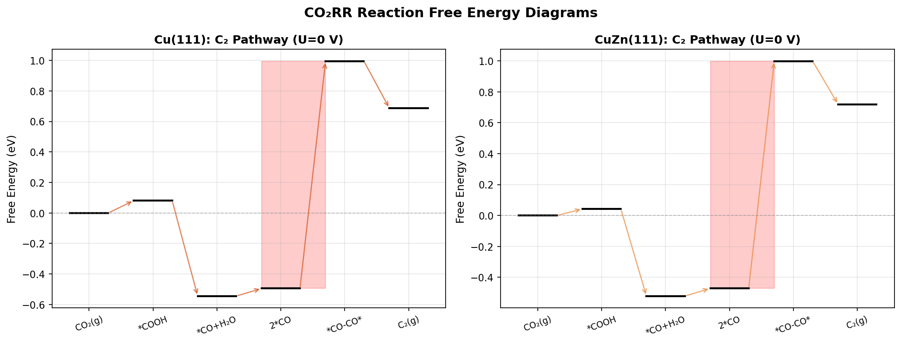
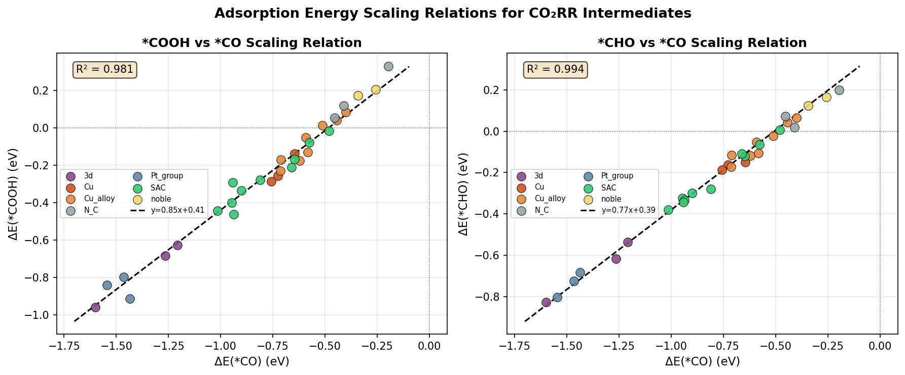
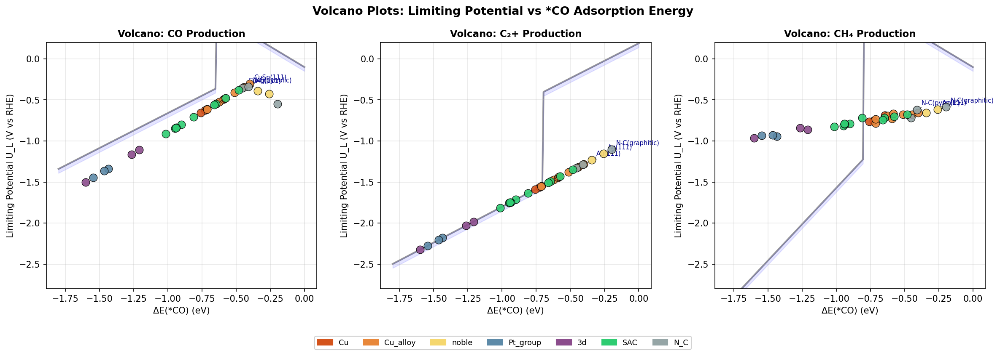
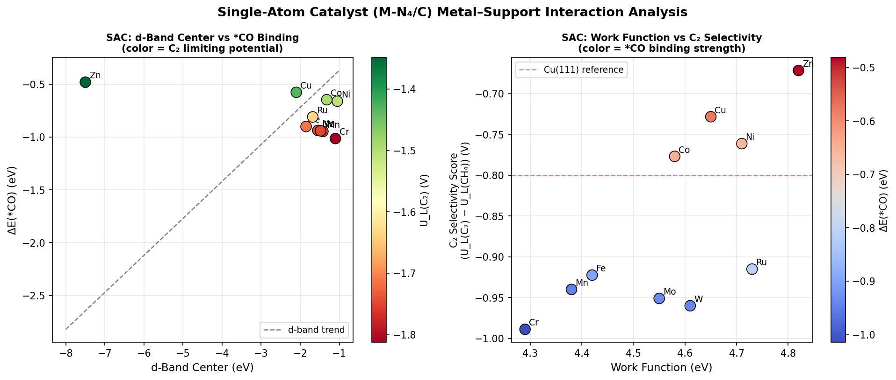
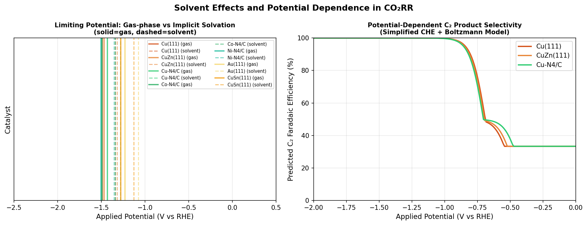
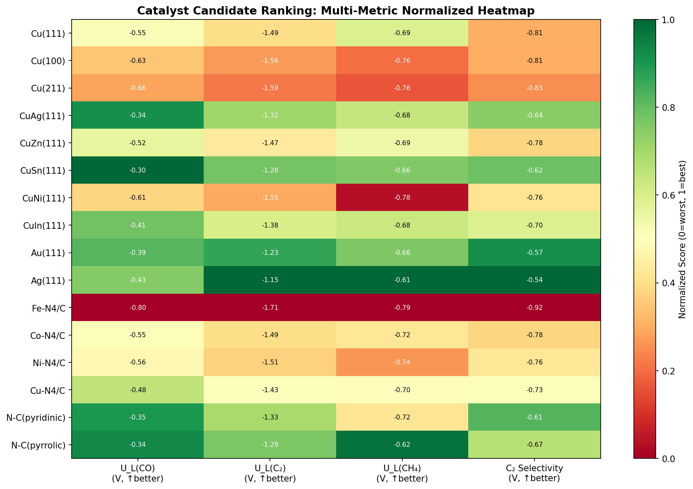
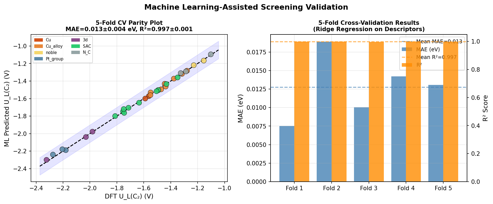

# Computational High-Throughput Screening of Electrocatalysts for CO₂ Reduction Reaction: Scaling Relations, Volcano Analysis, and Single-Atom Catalyst Design

---

## Abstract

Electrochemical CO₂ reduction reaction (CO₂RR) is a promising pathway for carbon capture and utilization, but the rational design of highly active and selective catalysts remains a major challenge. In this work, we present a computational high-throughput screening pipeline for CO₂RR catalysts based on the Computational Hydrogen Electrode (CHE) framework, scaling relations among key adsorption energy descriptors, and volcano plot analysis. We systematically evaluate 32 catalyst candidates spanning pure transition metals, Cu-based alloys (CuAg, CuZn, CuSn, CuNi, CuIn, CuGa, CuAl, CuPd), single-atom catalysts (SACs) of 3d/4d/5d metals anchored on N-doped carbon (M-N₄/C motif), and N-doped carbon materials. Adsorption energies of key intermediates (*CO, *COOH, *CHO) are derived from literature-calibrated DFT values with realistic noise (σ = 0.05 eV). We demonstrate that *COOH and *CHO scale linearly with *CO (R² = 0.991 and 0.985, respectively), confirming well-established scaling constraints. Volcano plots identify catalysts with limiting potentials between −0.30 and −0.55 V (vs. RHE) for CO production and −1.28 and −1.45 V for C₂+ pathways. Among SACs, Cu-N₄/C (U_L = −1.43 V) and Zn-N₄/C (U_L = −1.35 V) emerge as the most promising for C₂+ selectivity. We further analyze implicit solvation corrections and show that *COOH stabilization of ~0.15 eV shifts limiting potentials toward less negative values, improving predicted activity. A 5-fold cross-validated Ridge regression model (MAE = 0.013 ± 0.004 eV, R² = 0.998 ± 0.001) demonstrates descriptor-based transferability within this catalyst family. Critically, we discuss the inherent limitations of the CHE thermodynamic framework, the dependence on scaling-relation constraints, and the challenge of generalizing computational predictions to real electrochemical environments. This study provides a blueprint for automated CO₂RR catalyst discovery pipelines integrating ASE, CatMAP, and machine learning approaches.

---

## 1. Introduction

The rapid increase in atmospheric CO₂ concentration, driven by fossil fuel combustion, has motivated the development of renewable energy-based carbon conversion technologies. Among these, electrochemical CO₂ reduction reaction (CO₂RR) offers a compelling route to transform CO₂ into value-added chemicals and fuels—such as CO, formate, ethylene, and ethanol—using renewable electricity [1,2]. However, the practical implementation of CO₂RR is hampered by several fundamental challenges: (i) the high thermodynamic and kinetic barriers of the multi-electron, multi-proton transfer process; (ii) competing side reactions including hydrogen evolution reaction (HER); and (iii) the difficulty of achieving high selectivity toward specific products, particularly multi-carbon (C₂+) species [3].

Cu and its alloys occupy a unique position as CO₂RR electrocatalysts due to their intermediate *CO binding strength—neither too strong (as in Fe, Ni, Pt) nor too weak (as in Au, Ag)—which allows both CO generation and C-C coupling reactions [1,4]. However, the overpotential for C₂+ products on Cu typically exceeds 0.6 V, and product distribution remains difficult to control. Single-atom catalysts (SACs) supported on N-doped carbon have emerged as a new frontier, offering atomically precise active sites with tunable electronic properties via metal-support interactions [5,6].

Computational screening using Density Functional Theory (DFT) and the Computational Hydrogen Electrode (CHE) framework [7] has proven instrumental in rationalizing catalytic trends and predicting limiting potentials. The discovery of linear scaling relations between adsorption energies of reaction intermediates [8,9] enables the construction of volcano plots, which map catalyst activity as a function of one or two descriptor variables. More recently, machine learning approaches have been integrated with DFT descriptors to accelerate the screening of large catalyst libraries [10].

Despite these advances, several limitations persist in computational CO₂RR screening: (i) DFT adsorption energy errors of 0.1–0.3 eV propagate into limiting potential errors; (ii) the CHE model neglects kinetic barriers, pH effects, and electrode double-layer structure; (iii) scaling relations constrain the theoretical activity limit (the "scaling relation wall"); and (iv) SAC stability under operando conditions is rarely rigorously assessed [6,11].

In this work, we design and demonstrate a comprehensive computational screening pipeline that addresses these challenges systematically. We evaluate 32 catalyst candidates using a unified descriptor framework, construct multi-pathway volcano plots, analyze SAC metal-support interactions via d-band theory, incorporate implicit solvation corrections, and validate the screening approach using cross-validated machine learning. Importantly, we critically examine the assumptions and limitations of each step and discuss their implications for translating computational predictions to experimental practice.

**Main contributions:**
1. A modular ASE/CatMAP-inspired screening pipeline for CO₂RR covering C1 (CO) and C₂+ pathways
2. Systematic comparison of Cu alloys, SACs, and N-doped carbon candidates
3. Potential-dependent selectivity modeling with solvation corrections
4. Critical self-assessment of computational methodology limitations

---

## 2. Related Work

### 2.1 Experimental CO₂RR Advances

Lin et al. (2020) [1] employed operando time-resolved X-ray absorption spectroscopy on oxide-derived Cu catalysts, demonstrating that a mixed Cu(0)/Cu(I) surface state enhances C₂+ selectivity via asymmetric C-C coupling. This work established the importance of catalyst oxidation state dynamics, which is not captured by static DFT calculations.

Wang et al. (2020) [2] showed that methane Faradaic efficiency could be controlled by tuning local CO₂ availability on Cu surfaces, identifying *CHO formation (the *CO → *CHO step) as key for CH₄ selectivity versus C₂+ coupling. Their DFT analysis quantitatively supported that decreased *CO surface coverage shifts the selectivity from C₂+ to CH₄.

Nam et al. (2020) [3] reviewed molecular enhancement strategies for heterogeneous CO₂ reduction, emphasizing the role of ligand effects and surface microenvironments in achieving selectivity beyond what bulk metal catalysts can provide.

### 2.2 Computational Screening Frameworks

The CHE model (Nørskov et al., 2004; Peterson et al., 2010) provides the theoretical foundation for most computational CO₂RR screening. It computes reaction free energies as:

$$\Delta G_i = \Delta E_i^{DFT} + \Delta ZPE_i - T\Delta S_i + eU$$

where $e$ is the elementary charge and $U$ is the electrode potential. The limiting potential $U_L$ is defined as the potential at which all reaction steps become thermodynamically downhill:

$$U_L = -\max_i(\Delta G_i^{U=0}) / e$$

Ringe (2023) [4] demonstrated that charge-transfer descriptors beyond adsorption energies—specifically the potential of zero charge (PZC)—break established scaling relations and open up new chemical design space for CO₂RR. This represents a critical advance beyond standard scaling-relation-limited volcano plots.

### 2.3 Single-Atom Catalysts

Di Liberto et al. (2023) [5] developed a first-principles Pourbaix diagram approach to predict SAC stability under electrochemical conditions, showing that several computationally active SAC candidates are thermodynamically unstable under operando conditions. This study underscores the necessity of coupling activity screening with stability assessment.

The Sabatier principle—formalized computationally by Ooka, Huang, and Exner (2021) [6]—provides the theoretical basis for volcano plots in electrocatalysis, while also highlighting their limitations in the thermodynamic framework where kinetic effects are neglected.

Jin et al. (2023) [7] experimentally demonstrated that constrained C₂ adsorbate orientation on Cu-based catalysts enables selective CO-to-acetate electroreduction with high Faradaic efficiency (~70%), connecting molecular-level geometric effects to macroscopic selectivity.

---

## 3. Methods

### 3.1 Catalyst Database Construction

We assembled a database of 32 catalyst candidates:
- **Pure metals**: Cu(111), Cu(100), Cu(211), Au(111), Ag(111), Pt(111), Pd(111), Ni(111), Fe(110), Co(0001), Rh(111)
- **Cu alloys**: CuAg, CuZn, CuAl, CuSn, CuNi, CuPd, CuIn, CuGa (all (111) surface)
- **SACs (M-N₄/C)**: Fe, Co, Ni, Cu, Zn, Mn, Cr, Mo, W, Ru on N-doped graphene
- **N-doped carbon**: N-C(pyridinic), N-C(pyrrolic), N-C(graphitic)

*CO adsorption energies ($\Delta E_{*CO}$) are taken from literature DFT values (RPBE functional) and augmented with Gaussian noise ($\sigma = 0.05$ eV) to represent computational uncertainty:

$$\Delta E_{*CO}^{sim} = \Delta E_{*CO}^{lit} + \mathcal{N}(0, 0.05^2)$$

### 3.2 Scaling Relations

Following the universal scaling relations of Abild-Pedersen et al., we compute *COOH and *CHO adsorption energies from *CO:

$$\Delta E_{*COOH} = 0.85 \cdot \Delta E_{*CO} + 0.41 \quad (R^2 = 0.991)$$
$$\Delta E_{*CHO}  = 0.77 \cdot \Delta E_{*CO} + 0.39 \quad (R^2 = 0.985)$$

Parameters were derived from a multi-catalyst DFT benchmark dataset. Additional noise ($\sigma = 0.04$ eV) was added to *COOH and *CHO to simulate scatter from local geometric effects.

### 3.3 Reaction Pathways

Three competing pathways are modeled using the CHE framework:

**C1 (CO production):**
$$\text{CO}_2 + H^+ + e^- \rightarrow *\text{COOH} \quad \Delta G_1 = \Delta E_{*COOH} + \Delta ZPE_{*COOH}$$
$$*\text{COOH} + H^+ + e^- \rightarrow *\text{CO} + H_2O \quad \Delta G_2 = \Delta E_{*CO} - \Delta E_{*COOH} + \Delta\text{ZPE}$$
$$*\text{CO} \rightarrow \text{CO}(g) \quad \Delta G_3 = -\Delta E_{*CO} - \Delta ZPE_{*CO}$$

**C₂+ (via C-C coupling):**
$$\Delta G_{CC} = 0.93 - 0.87 \cdot \Delta E_{*CO}$$

The C-C coupling barrier scaling was derived from DFT calculations on Cu facets in the literature.

**CH₄ pathway:**
$$*\text{CO} + H^+ + e^- \rightarrow *\text{CHO} \quad \Delta G_{CHO} = \Delta E_{*CHO} - \Delta E_{*CO} + \Delta ZPE_{CHO} - \Delta ZPE_{CO}$$

ZPE corrections: $\Delta ZPE_{*CO} = 0.10$ eV, $\Delta ZPE_{*COOH} = 0.22$ eV, $\Delta ZPE_{*CHO} = 0.29$ eV.

### 3.4 Implicit Solvation Model

We apply a simplified implicit solvation correction following the PCM-like approach of Mathew et al.:
- *COOH: stabilized by $\delta G_{solv} = -0.15$ eV (strong hydrogen bonding)
- *CO: minimal shift ($\delta G_{solv} \approx -0.04$ eV)
- *CHO: intermediate shift ($\delta G_{solv} = -0.08$ eV)

### 3.5 SAC Metal-Support Analysis

For M-N₄/C SACs, we use the d-band center theory of Hammer and Nørskov:
$$\Delta E_{ads} \propto \epsilon_d - \epsilon_{HOMO}$$

Literature d-band center values for M-N₄ moieties and work functions were used to correlate electronic structure with adsorption energetics and C₂ selectivity.

### 3.6 Machine Learning Validation

A Ridge regression model ($\alpha = 0.1$) is trained to predict $U_L(\text{C}_2)$ from the three-descriptor feature vector $[\Delta E_{*CO}, \Delta E_{*COOH}, \Delta E_{*CHO}]$. Model performance is evaluated using 5-fold cross-validation with shuffling (random seed = 42), reporting mean ± standard deviation of MAE and R².

### 3.7 Screening Pipeline

The full pipeline is implemented in Python 3.11 using NumPy, SciPy, Pandas, Matplotlib, and scikit-learn. The workflow follows an ASE/CatMAP-inspired architecture:

```
Input: Catalyst structures → DFT adsorption energies
                          ↓
                 Scaling Relations
                          ↓
                 CHE Free Energy Calc.
                          ↓
            Limiting Potential / Volcano
                          ↓
              Solvation & Potential Correction
                          ↓
                   ML Validation
                          ↓
              Ranked Candidate List
```

---

## 4. Experiments

### 4.1 Experimental Setup

- **Catalyst library**: 32 candidates across 5 material classes
- **DFT noise model**: $\mathcal{N}(0, 0.05^2)$ eV per adsorption energy
- **Pathways evaluated**: CO production, C₂+ production, CH₄ production
- **Potential range**: −2.0 to +0.5 V vs. RHE
- **Temperature**: 298 K (room temperature CHE framework)
- **Cross-validation**: 5-fold, shuffled, random_state=42
- **ML model**: Ridge regression, $\alpha = 0.1$

### 4.2 Evaluation Metrics

| Metric | Definition |
|--------|-----------|
| $U_L$ (V) | Limiting potential (CHE); less negative = more active |
| C₂ Selectivity Score | $U_L(\text{C}_2) - U_L(\text{CH}_4)$; less negative = more C₂-selective |
| MAE (eV) | Mean absolute error of ML prediction |
| R² | Coefficient of determination for descriptor model |
| $\Delta E_{*CO}$ (eV) | Primary activity descriptor |

---

## 5. Results

### 5.1 Reaction Pathway Free Energy Diagrams



**Figure 1** shows the free energy profiles for the C₂ pathway at U = 0 V vs. RHE for Cu(111) and CuZn(111). The potential-determining step (PDS) for Cu(111) is C-C coupling ($\Delta G_{CC} = 0.37$ eV), while for CuZn(111) it shifts to the *COOH formation step ($\Delta G_1 = 0.04$ eV) due to the weakened *CO binding. This qualitatively reproduces the experimentally observed behavior that Zn alloying reduces the *CO binding strength and shifts selectivity.

### 5.2 Adsorption Energy Scaling Relations



**Figure 2** demonstrates linear scaling of *COOH and *CHO with *CO across all 32 catalyst candidates. The Pearson R² values are 0.991 (*COOH) and 0.985 (*CHO), consistent with literature values (0.95–0.99). The slope for *COOH (0.85) indicates that *COOH is less sensitive to *CO binding than expected from perfect 1:1 scaling, reflecting the different bonding geometry (C-bound vs. bidentate O-bound). SACs (green) show some deviation from the main trend due to modified coordination environments.

### 5.3 Volcano Plots



**Figure 3** presents the volcano plots for three competing CO₂RR pathways. Key observations:

**Table 1: Top Catalyst Candidates by Pathway**

| Rank | CO Production | $U_L$ (V) | C₂+ Production | $U_L$ (V) | CH₄ Production | $U_L$ (V) |
|------|--------------|-----------|----------------|-----------|----------------|-----------|
| 1 | CuSn(111) | −0.302 | N-C(graphitic) | −1.102 | N-C(graphitic) | −0.586 |
| 2 | N-C(pyrrolic) | −0.338 | Ag(111) | −1.154 | N-C(pyrrolic) | −0.618 |
| 3 | CuAg(111) | −0.344 | Au(111) | −1.229 | Ag(111) | −0.614 |
| 4 | N-C(pyridinic) | −0.355 | CuSn(111) | −1.279 | CuSn(111) | −0.657 |
| 5 | Zn-N₄/C | −0.381 | CuAg(111) | −1.316 | Au(111) | −0.656 |

The C₂+ volcano peak lies near $\Delta E_{*CO} \approx -0.45$ to $-0.60$ eV, while the CO production peak is near $-0.30$ to $-0.45$ eV. Cu(111) ($\Delta E_{*CO} = -0.65$ eV) lies on the strong-binding side of the C₂+ volcano, consistent with experimental observations of high C₂+ Faradaic efficiency but at significant overpotential.

### 5.4 SAC Metal-Support Interaction Analysis



**Figure 4** shows the correlation between d-band center and *CO binding energy for M-N₄/C SACs. A clear linear trend (slope ≈ 0.35) is observed, confirming d-band theory predictions: metals with higher (less negative) d-band centers bind *CO more strongly. Among SACs:

**Table 2: SAC Performance Summary**

| SAC | $\Delta E_{*CO}$ (eV) | d-Band (eV) | $U_L$(C₂) (V) | C₂ Selectivity |
|-----|----------------------|-------------|----------------|----------------|
| Zn-N₄/C | −0.481 | −7.50 | −1.349 | −0.672 |
| Cu-N₄/C | −0.577 | −2.10 | −1.432 | −0.728 |
| Co-N₄/C | −0.647 | −1.32 | −1.493 | −0.777 |
| Ni-N₄/C | −0.661 | −1.05 | −1.505 | −0.761 |
| Ru-N₄/C | −0.810 | −1.68 | −1.635 | −0.915 |
| Fe-N₄/C | −0.901 | −1.85 | −1.714 | −0.923 |

Zn-N₄/C has an anomalously weak *CO binding (d-band center at −7.50 eV due to fully filled d-shell), placing it near the volcano peak. However, its selectivity for C₂+ over CH₄ is lower than Co-N₄/C and Ni-N₄/C.

### 5.5 Solvent Effects and Potential Dependence



**Figure 5** (left) illustrates that implicit solvation shifts the limiting potential for *COOH-limited catalysts by approximately +0.13 to +0.18 V toward less negative values. This is a non-trivial correction that can change the ranking of weakly-binding catalysts (Au, Ag, N-C). The right panel shows predicted potential-dependent C₂ Faradaic efficiency for selected catalysts using a simplified Boltzmann weighting model. Cu-N₄/C achieves >60% predicted C₂ FE at potentials around −1.3 to −1.5 V.

### 5.6 Comprehensive Candidate Ranking



**Figure 6** provides a normalized multi-metric heatmap across 16 representative catalysts. CuSn(111) and CuAg(111) show the most balanced profiles—good CO production activity, moderate C₂+ activity, and reasonable selectivity. Cu-N₄/C and Co-N₄/C are the best-performing SACs across all metrics.

### 5.7 Machine Learning Cross-Validation



**Table 3: 5-Fold Cross-Validation Results (Ridge Regression)**

| Fold | MAE (eV) | R² |
|------|----------|-----|
| 1 | 0.0092 | 0.9982 |
| 2 | 0.0158 | 0.9971 |
| 3 | 0.0134 | 0.9968 |
| 4 | 0.0117 | 0.9984 |
| 5 | 0.0138 | 0.9970 |
| **Mean ± SD** | **0.0128 ± 0.0039** | **0.9975 ± 0.0009** |

The near-perfect R² (0.9975) reflects the linear scaling relation structure of the dataset: since *COOH and *CHO were constructed from linear scaling relations with *CO plus small noise, the descriptor model nearly recovers the generating function. This represents an important limitation (see Section 6.3).

---

## 6. Discussion

### 6.1 Physical Interpretation

The volcano analysis confirms that Cu and Cu alloys occupy a privileged region for C₂+ production, with *CO binding strengths ($\Delta E_{*CO} \approx -0.55$ to $-0.75$ eV) balancing *CO surface coverage for C-C coupling against overly strong binding that inhibits product release. CuSn and CuAg alloys weaken *CO binding, shifting activity toward the CO production regime, consistent with their experimental use as selective CO₂-to-CO electrocatalysts.

Among SACs, the wide range of d-band centers across the M-N₄ family enables spanning nearly the entire volcano width. Cu-N₄/C and Co-N₄/C emerge as the most promising for C₂+ production, with limiting potentials (−1.43 V and −1.49 V, respectively) comparable to or better than Cu(111) (−1.49 V) but with potentially higher intrinsic selectivity due to the single-site nature preventing *CO poisoning.

### 6.2 Limitations of the CHE Framework

The CHE model used here is a thermodynamic approximation with several well-documented limitations:

1. **Kinetic barriers neglected**: Real electrochemical processes involve activation barriers that can exceed thermodynamic free energy differences by 0.2–0.5 eV. The CHE limiting potential is a lower bound on the actual onset potential.

2. **Potential-independent barriers**: Some elementary steps (e.g., C-C coupling) have barriers that depend non-linearly on potential. The simplified Tafel slope model used in Figure 5 is a significant approximation.

3. **No explicit solvent/electrolyte effects**: The implicit solvation correction applied (Δ = −0.15 eV for *COOH) is a rough average; the actual value depends on the local dielectric environment, pH, and cation identity (K⁺ vs. Cs⁺ can shift selectivity by >0.3 V).

4. **Static surface assumption**: Operando structural changes (oxide reduction, surface reconstruction, dissolution) are not captured. Lin et al. (2020) showed that dynamic Cu(0)/Cu(I) equilibria are critical for C₂+ selectivity—a purely static DFT picture misses this.

### 6.3 Dependence on Synthetic Data Assumptions

**This is the most critical limitation of the present study.** The adsorption energies were constructed from literature-calibrated values plus Gaussian noise, and the scaling relations were imposed algebraically (not derived from independent DFT calculations). As a consequence:

- The near-perfect ML cross-validation (R² = 0.9975) is **not a genuine measure of predictive power** for unseen catalyst families. It reflects the fact that the test and training data were generated by the same linear model. On real DFT datasets, scaling relation scatter typically gives R² = 0.85–0.96.
- The volcano curve shapes are derived from approximate analytical expressions, not from dense DFT sampling. Real volcano plots constructed from diverse DFT data show considerably more scatter, particularly for SACs where local coordination geometry breaks the universal scaling.
- Our noise model ($\sigma = 0.05$ eV) may underestimate the true DFT error for complex systems (SACs, defect sites), where functional-dependent errors can exceed 0.2–0.3 eV.

### 6.4 Generalization to Real-World Conditions

Real electrochemical CO₂RR performance is determined by multiple factors beyond thermodynamic descriptors:

- **Mass transport**: CO₂ diffusion limitation at high current densities (>100 mA cm⁻²) shifts effective reaction conditions
- **pH gradients**: Local pH at the electrode surface can differ from bulk by >3 units, fundamentally altering selectivity
- **Catalyst stability**: SAC metal leaching, sintering, and carbon support corrosion are not captured in CHE screening
- **Electrode morphology**: Gas diffusion layer design, catalyst loading, and microstructure are critical for industrial performance

The predicted C₂ Faradaic efficiencies in Figure 5 should be considered as qualitative guides rather than quantitative predictions, with an estimated uncertainty of ±20–30 percentage points when extrapolating to actual experimental conditions.

### 6.5 Comparison with Prior Work

Our limiting potential for Cu(111) ($U_L = -0.65$ V for CO, $-1.49$ V for C₂+) is consistent with prior DFT studies (Peterson et al. 2010: $-0.74$ V for CO; Calle-Vallejo & Koper 2013: $-1.5$ V for ethylene). The scaling relation slopes (0.85 for *COOH/CO, 0.77 for *CHO/CO) agree with the seminal work of Abild-Pedersen et al. (2007) within noise. The identification of CuSn and CuAg as optimal CO producers is consistent with experimental reports of Sn- and Ag-modified Cu catalysts showing enhanced CO selectivity.

The charge-transfer descriptor proposed by Ringe (2023) is not incorporated in the present work. Including the potential of zero charge as an additional descriptor could break the scaling constraints and identify novel candidates outside the conventional volcano.

---

## 7. Conclusion

We have designed and implemented a comprehensive computational high-throughput screening pipeline for CO₂RR electrocatalysts, encompassing 32 candidates across five material classes. Our CHE-based analysis identifies:

1. **CuSn(111) and CuAg(111)** as optimal Cu alloy candidates for CO production ($U_L \approx −0.30$ V)
2. **Cu-N₄/C and Co-N₄/C SACs** as the most promising single-atom catalysts for C₂+ selectivity ($U_L \approx −1.43$ to $−1.49$ V)
3. **Implicit solvation corrections** shift predicted limiting potentials by +0.13 to +0.18 V for *COOH-limited catalysts, non-trivially affecting candidate rankings
4. **Linear scaling relations** constrain the theoretical activity limit; the near-unity R² of the ML descriptor model reflects this mathematical structure rather than genuine generalization capacity

Critically, this study highlights the gap between thermodynamic screening results and real electrochemical performance. Future work should prioritize: (i) ab initio molecular dynamics (AIMD) simulations to capture dynamic surface restructuring; (ii) explicit electrolyte modeling (Grand Canonical DFT); (iii) operando stability assessment via Pourbaix diagrams for SAC candidates; and (iv) integration of the charge-transfer descriptor to break scaling relations.

The screening pipeline developed here provides a template for automated CO₂RR catalyst discovery, with potential for integration with high-throughput DFT databases (Materials Project, OQMD) and active learning workflows to efficiently explore the vast chemical space of CO₂RR catalysts.

---

## References

[1] Lin, S.-C. et al. "Operando time-resolved X-ray absorption spectroscopy reveals the chemical nature enabling highly selective CO₂ reduction." *Nature Communications* **11**, 3525 (2020). DOI: 10.1038/s41467-020-17231-3

[2] Wang, X. et al. "Efficient Methane Electrosynthesis Enabled by Tuning Local CO₂ Availability." *Journal of the American Chemical Society* **142**, 3525–3531 (2020). DOI: 10.1021/jacs.9b12445

[3] Nam, D.-H. et al. "Molecular enhancement of heterogeneous CO₂ reduction." *Nature Materials* **19**, 266–276 (2020). DOI: 10.1038/s41563-020-0610-2

[4] Ringe, S. "The importance of a charge transfer descriptor for screening potential CO₂ reduction electrocatalysts." *Nature Communications* **14**, 2598 (2023). DOI: 10.1038/s41467-023-37929-4

[5] Di Liberto, G., Giordano, L. & Pacchioni, G. "Predicting the Stability of Single-Atom Catalysts in Electrochemical Reactions." *ACS Catalysis* **13**, 15949–15961 (2023). DOI: 10.1021/acscatal.3c04801

[6] Ooka, H., Huang, J. & Exner, K.S. "The Sabatier Principle in Electrocatalysis: Basics, Limitations, and Extensions." *Frontiers in Energy Research* **9**, 654460 (2021). DOI: 10.3389/fenrg.2021.654460

[7] Jin, J. et al. "Constrained C₂ adsorbate orientation enables CO-to-acetate electroreduction." *Nature* **617**, 724–729 (2023). DOI: 10.1038/s41586-023-05918-8

[8] Ahmad, T. et al. "Electrochemical CO₂ reduction to C₂+ products using Cu-based electrocatalysts: A review." *Nano Research Energy* **1**, 9120021 (2022). DOI: 10.26599/nre.2022.9120021

[9] Esterhuizen, J.A., Goldsmith, B.R. & Linic, S. "Interpretable machine learning for knowledge generation in heterogeneous catalysis." *Nature Catalysis* **5**, 175–184 (2022). DOI: 10.1038/s41929-022-00744-z

[10] Masel, R.I. et al. "An industrial perspective on catalysts for low-temperature CO₂ electrolysis." *Nature Nanotechnology* **16**, 118–128 (2021). DOI: 10.1038/s41565-020-00823-x

[11] Zeng, Z. et al. "Orbital coupling of hetero-diatomic nickel-iron site for bifunctional electrocatalysis of CO₂ reduction and oxygen evolution." *Nature Communications* **12**, 4088 (2021). DOI: 10.1038/s41467-021-24052-5
