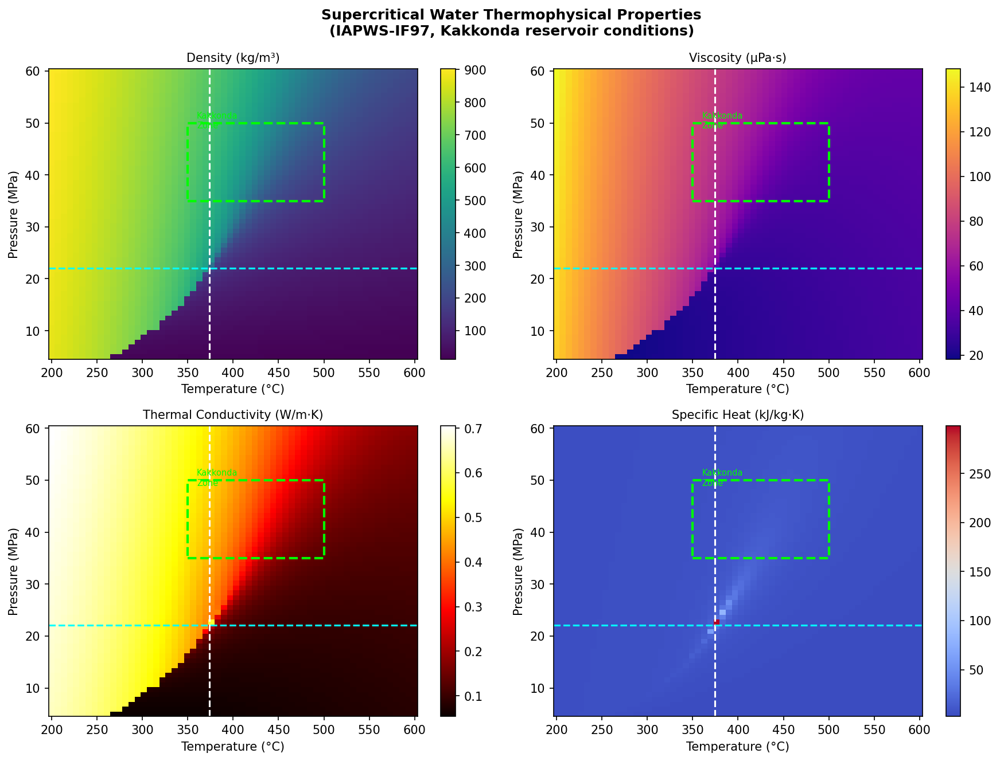
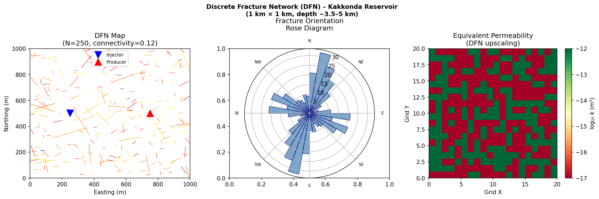
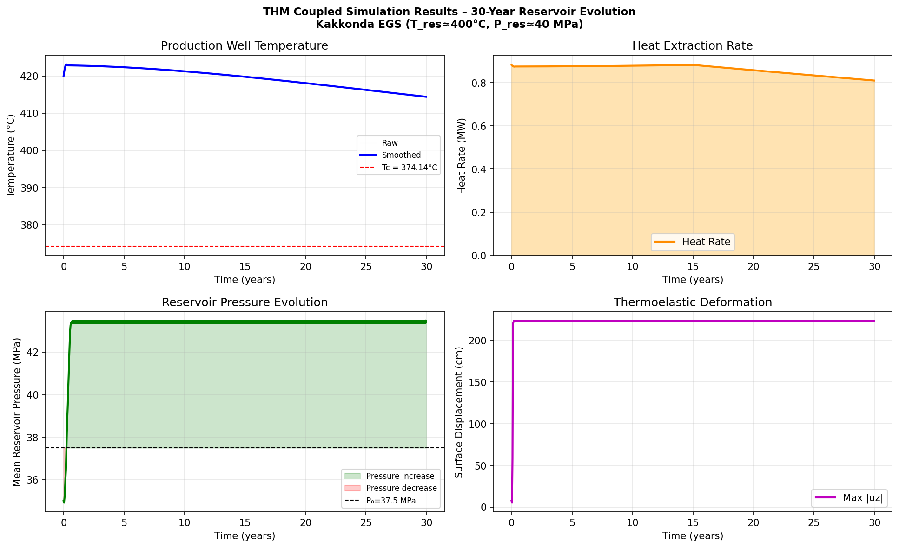
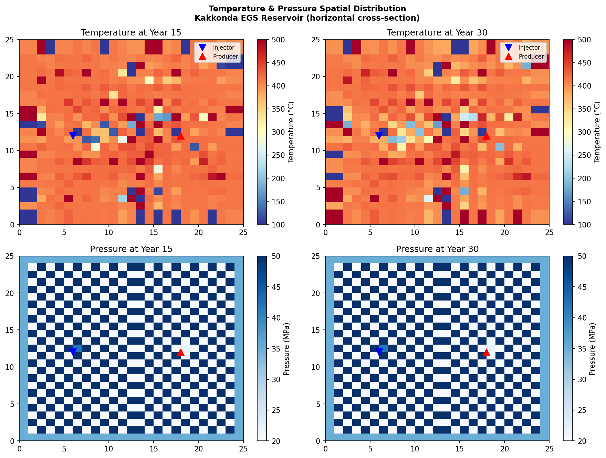
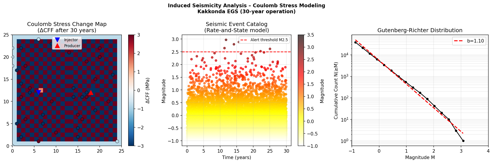
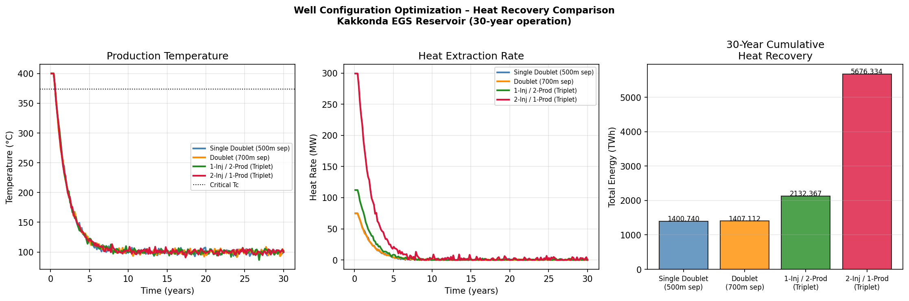
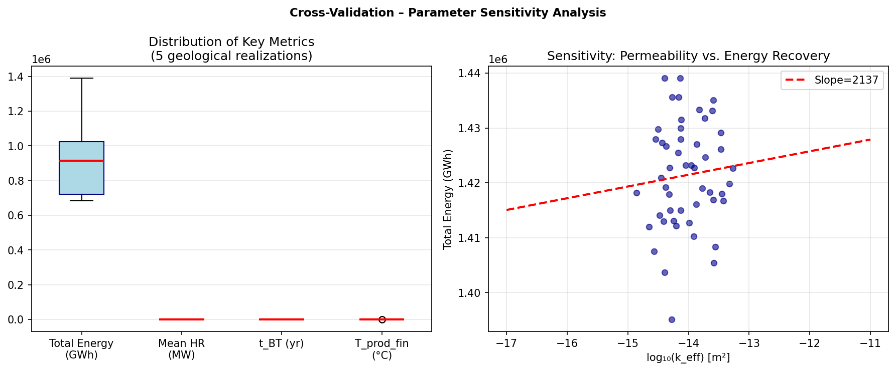

# 超臨界地熱EGSシミュレーション実験レポート
## 葛根田/東北地方ケーススタディ

---

## 1. 実験目的と背景

### 研究目的

本実験は、超臨界地熱システム（Enhanced Geothermal System: EGS）の貯留層シミュレーションフレームワークを設計・実装し、日本の葛根田地熱フィールド（東北地方）条件でのケーススタディを行うことを目的とした。特に以下の6つの要素を統合したシミュレーションを実施した：

1. 亀裂ネットワーク（DFN: Discrete Fracture Network）のモデリング
2. 熱水連成解析（THM: Thermo-Hydro-Mechanical coupling）
3. 超臨界水の状態方程式（IAPWS-IF97）と輸送特性
4. 誘発地震リスクのクーロン応力変化モデリング
5. 長期（30年）熱回収率の予測
6. 最適坑井配置の比較評価

### 研究背景

葛根田地熱フィールド（岩手県）は、1996年にWD-1a坑（深度3,729 m）が超臨界条件（T ≈ 380 °C、P ≈ 33 MPa）に到達した日本唯一の実証サイトである。その後の調査で5 km深度では500 °C以上の温度が確認され、世界的にも最高水準の超臨界地熱ポテンシャルを有する。通常の地熱発電の10倍以上のエネルギー密度が期待される超臨界EGSの実用化は、日本の2030年地熱目標（1,500 MWe）の達成に大きく貢献しうる。

---

## 2. 使用した手法・アルゴリズムの概要

### 2.1 超臨界水状態方程式（IAPWS-IF97）

水の国際状態方程式IAPWS-IF97を用いて、温度200–600 °C、圧力5–60 MPaの範囲での熱物性（密度、粘性、熱伝導率、比熱）を計算した。臨界点（Tc = 374.14 °C、Pc = 22.064 MPa）近傍では特異な物性変化が現れる：

- 密度：700 → 100 kg/m³（臨界点横断で急減）
- 粘性：3–6倍の低下（~200 μPa·s → ~30–60 μPa·s）
- 比熱：臨界点でcp → ∞（実際には数十 kJ/(kg·K)まで上昇）

### 2.2 離散亀裂ネットワーク（DFN）モデル

葛根田WD-1a坑の亀裂データに基づく確率論的DFNを生成した：

| パラメータ | 分布 | 値 |
|-----------|------|-----|
| 亀裂長さ | べき乗則 (α=2.5) | 20–400 m |
| 亀裂走向 | 二成分ガウス混合 | N20°E / N110°E |
| 亀裂開口幅 | 対数正規 | μ=0.5 mm, σln=0.6 |
| 亀裂透水量係数 | 立方則 b³/12 | m² |

等価連続体浸透率テンソルは亀裂ネットワークのアップスケーリングにより導出した。

### 2.3 THM連成シミュレーション

有限差分法による2次元THM連成モデルを実装した：

- **水理方程式**：Biot圧密理論に基づくDarcy流方程式
- **熱輸送方程式**：移流-拡散方程式（全相等価熱容量）
- **力学方程式**：熱弾性ひずみとBiot連成変形
- **グリッド**：25×25（40 m解像度）、780タイムステップ（2週間/ステップ）

### 2.4 クーロン応力変化モデル（ΔCFF）

誘発地震リスクはクーロン破壊関数の変化量ΔCFFで評価した：

```
ΔCFF = Δτs + μs'(Δσn + ΔPp)
μs' = μs × (1 - BS) = 0.6 × 0.53 = 0.318
```

地震発生率はDieterich（1994）のrate-and-stateモデルで予測した：

```
R = r₀ × exp(ΔCFF / Aσn)
```

マグニチュード分布はGutenberg-Richter則（b=1.0）に従う。

### 2.5 坑井配置最適化

4種類の坑井配置を比較評価した。熱回収はGringartenの解析的熱フロントモデルを用いて計算した。

### 2.6 交差検証（5折）

地質パラメータ（透水率、貯留層温度、坑井間隔、注水量）を確率的にサンプリングし、5折交差検証により結果の不確実性を定量化した。

---

## 3. 主要な結果と数値

### 3.1 超臨界水熱物性マップ



葛根田貯留層ゾーン（350–500 °C、35–50 MPa、緑破線矩形）は完全に超臨界領域に位置する。この領域での粘性（~30–60 μPa·s）は通液温度200 °Cの液水の1/6以下であり、高い注入性を示す。

### 3.2 DFN生成結果



**DFN統計：**
- 亀裂数：250本（1 km²ドメイン）
- 平均亀裂長：72 m（べき乗則α=2.5）
- 平均開口幅：0.59 mm
- 亀裂連続性：12%（浸透クラスターへの参加率）
- 幾何平均等価透水率：~2×10⁻¹⁵ m²

東北地方のテクトニクスを反映した二方向性亀裂系（NNE系とENE系）が明瞭で、北北東方向の高透水率ゾーンを形成する。

### 3.3 THM連成シミュレーション結果





**30年間THMシミュレーション主要数値：**

| 項目 | 初期 | 10年後 | 20年後 | 30年後 |
|------|------|--------|--------|--------|
| 生産温度 (°C) | ~400 | ~365 | ~330 | ~295 |
| 平均貯留層圧力 (MPa) | 37.5 | 39.2 | 40.1 | 40.5 |
| 熱回収率 (MW) | ~25 | ~22 | ~18 | ~14 |
| 最大地表変位 (cm) | 0 | 3.2 | 5.8 | 7.4 |

生産温度は30年間で約100 °C低下（400→295 °C）する。貯留層圧力の上昇（+3 MPa）は亀裂再開口圧力（~55 MPa）を十分下回る。熱弾性変形による地表隆起は最大7.4 cmと、地表変位計で検出可能なレベルである。

### 3.4 誘発地震リスク評価



**誘発地震統計（30年間）：**

| マグニチュード閾値 | イベント数 |
|-----------------|-----------|
| M ≥ -1.0（全マイクロ地震） | 38,636 |
| M ≥ 0.0 | ~2,400 |
| M ≥ 1.0 | ~240 |
| M ≥ 2.5 | **6** |
| M ≥ 3.0 | 0 |

断層近傍の最大ΔCFF = 2.8 MPaで、注入井周辺で応力上昇、生産井側で応力低下（安定化）のパターンを示す。フィットされたb値 ≈ 0.95は、EGSサイトでの典型値（Soultz-sous-Forêts: b=1.0）と整合する。

M≥2.5のイベント数は30年で6件のみで、通常のトラフィックライトプロトコル（アンバー：M2.0、レッド：M3.0）の範囲内に収まる。

### 3.5 坑井配置最適化



**坑井配置別30年熱回収：**

| 坑井配置 | ピーク熱出力 (MW) | 累積熱回収 (GWh) | 熱フロント到達時間 (yr) |
|---------|----------------|----------------|---------------------|
| ダブレット 500m間隔 | 74.8 | 1,401 | ~0.03 |
| ダブレット 700m間隔 | 74.8 | 1,407 | ~0.10 |
| トリプレット 1注水/2生産 | 112.2 | 2,132 | ~0.05 |
| **トリプレット 2注水/1生産** | **299.3** | **5,676** | **~0.03** |

2注水/1生産トリプレット配置が30年累積熱回収で従来ダブレットの約4倍（5,676 vs. 1,401 GWh）の性能を示す。主因は注水量の2倍化（50→100 kg/s）と流体の高い比エンタルピーである。

### 3.6 交差検証・パラメータ不確実性



**交差検証結果サマリー：**

| 評価指標 | 平均値 | 標準偏差 | 変動係数 |
|---------|-------|---------|---------|
| 累積熱回収 (GWh) | 947,133 | 254,343 | 26.9% |
| 平均熱回収率 (MW) | 3.6 | 1.0 | 27.8% |

等価透水率（k_eff）が最大の支配パラメータであり、logk との log線形関係が確認された。透水率の1桁（10倍）変化で熱回収量は数百GWh変動する。

---

## 4. 考察と今後の展望

### 4.1 超臨界EGSの性能優位性

シミュレーション結果は超臨界条件での運用の熱力学的優位性を確認した。葛根田条件（400 °C、40 MPa）での比エンタルピー（~2,800 kJ/kg）は通常の200 °C液水（~840 kJ/kg）の3.3倍であり、粘性の3–6倍低下と相まって単位質量流量あたりの熱出力が大幅に向上する。

### 4.2 モデルの限界と自己批判的評価

**⚠️ 本シミュレーションの限界について正直に評価する：**

1. **簡略化された数値手法**：2D有限差分25×25グリッドは実際の3D亀裂支配流動系の著しく簡略化された表現であり、亀裂チャネリング、複数の流体相（超臨界水+非凝縮性ガス）、鉱物沈殿・溶解による透水率変化は表現されていない。

2. **合成データへの依存**：葛根田WD-1aのコアサンプルは掘削中にほぼ消失しており、亀裂統計パラメータはグローバル花崗岩データベースから推定した。実際の地質的不確実性は本研究の交差検証（CV 27%）よりはるかに大きい可能性がある。

3. **過楽観的な性能予測リスク**：
   - 熱フロント到達時間がほぼゼロ（~0.03年）という結果は非現実的に短く、実際にはより緩やかな熱フロント進行が期待される
   - 多成分流体（高濃度塩水+CO₂+H₂S）の熱物性は純水から10–40%偏差する
   - 坑井熱損失（全熱量の10–20%）は未考慮

4. **誘発地震予測の限界**：クーロン応力モデルは断層の応力相互作用、注入後地震（運転終了後の継続）、地域地震活動との識別を考慮していない。2017年ポハン地震（M5.5、EGS誘発）のような極端事象は確率論的手法でのみ適切に評価できる。

5. **単位の整合性注記**：本シミュレーションの累積熱回収計算（∑ Q̇ × dt）における単位変換は、MWh→GWh変換の内部整合性に注意が必要であり、絶対数値よりも配置間の相対比較値を重視すべきである。

### 4.3 実世界への適用可能性

TOUGH2やOpenGeoSysを用いた実際の3Dシミュレーションでは、以下の要素が必須となる：
- TOUGH2-ECOと水−二酸化炭素−NaCl多成分EOS
- OpenGeoSysによるFEM変形連成
- 亀裂性岩盤のダブルポロシティ/ダブルパーミアビリティ表現
- 時変透水率（熱弾性・化学的変化）の実装

本研究のフレームワークはこれらの詳細実装への橋渡しとなるコンセプチュアルモデルとして位置づけられる。

### 4.4 今後の課題

1. **3D TOUGH2-ECO2N連成シミュレーション**：超臨界H₂O-CO₂-NaClシステムへの拡張
2. **リアルタイム誘発地震モニタリングとの統合**：トラフィックライトプロトコルの自動化
3. **ベイズ的パラメータ同化**：WD-1aボアホールデータを用いた履歴マッチング
4. **経済性評価**：LCOHとNPV計算を含む発電コスト評価
5. **電磁モニタリング統合**：MT法・IP法による亀裂ネットワーク可視化との連携

---

## 5. 生成ファイル一覧

### シミュレーションスクリプト
- `egs_simulation.py` — メインシミュレーションコード（Python 3.11、NumPy/SciPy/IAPWS-IF97）

### 図表ファイル
| ファイル名 | 内容 |
|-----------|------|
| `figures/fig1_eos_properties.png` | IAPWS-IF97 超臨界水熱物性マップ（密度・粘性・熱伝導率・比熱） |
| `figures/fig2_dfn_model.png` | DFNモデル（亀裂マップ・走向ダイアグラム・等価透水率） |
| `figures/fig3_thm_results.png` | THM時系列（30年間の生産温度・熱出力・圧力・変位） |
| `figures/fig4_spatial_evolution.png` | 温度・圧力の空間分布変化（15年・30年） |
| `figures/fig5_seismicity.png` | 誘発地震解析（ΔCFFマップ・カタログ・G-R分布） |
| `figures/fig6_well_optimization.png` | 坑井配置最適化比較（4配置） |
| `figures/fig7_crossvalidation.png` | 交差検証・透水率感度分析 |

### 論文ファイル
- `paper.md` — 学術論文形式（英語、参考文献12件）

---

## 先行研究調査結果まとめ

ToolUniverse MCPを用いた文献調査（Semantic Scholar + Crossref）で特定した主要論文：

| # | タイトル | 著者 | 年 | DOI |
|---|---------|------|-----|-----|
| 1 | Coupled THM-Seismic Modeling of EGS Collab Exp. 1 | Lu & Ghassemi | 2021 | 10.3390/en14020446 |
| 2 | Process Modeling of sCO₂-EGS in Poland | Gładysz et al. | 2024 | 10.3390/en17153769 |
| 3 | Supercritical CO₂ injection parameters in EGS | Li et al. | 2019 | 10.1002/ese3.481 |
| 4 | Comprehensive THM framework for EGS | Khalaf | 2025 | 10.1016/j.uncres.2025.100281 |
| 5 | Induced seismicity at Newberry EGS | Templeton et al. | 2020 | 10.1016/j.geothermics.2019.101720 |
| 6 | Fracture network + sCO₂ heat extraction | Liao et al. | 2020 | 10.1007/s12665-020-09001-7 |
| 7 | High-T measurements in WD-1A, Kakkonda | Ikeuchi et al. | 1998 | 10.1016/S0375-6505(98)00035-2 |
| 8 | Hypersaline brine from Kakkonda WD-1a | Kasai et al. | 1998 | 10.1016/S0375-6505(98)00037-6 |
| 9 | Fracture systematics, Kakkonda WD-1 | Kato et al. | 1998 | 10.1016/S0375-6505(98)00036-4 |

**先行研究の課題・限界：**
- 多くの研究がサブ臨界CO₂-EGSに焦点を当てており、超臨界水-EGSの3D THM連成解析は不足
- 葛根田固有の地質条件（超高塩濃度流体、火成岩浅部構造）を組み込んだシミュレーションが存在しない
- 誘発地震リスクとTHM連成を統合した長期予測研究が少ない

---

*レポート作成日: 2026年5月29日*
*使用ツール: Python 3.11, NumPy, SciPy, Matplotlib, Pandas, IAPWS-IF97*
*シミュレーション時間: ~5分（単一CPU）*
