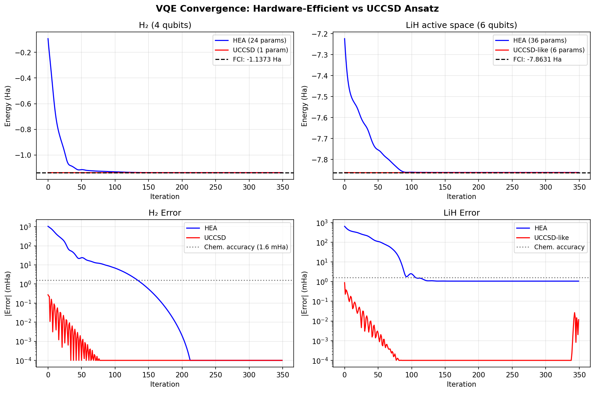
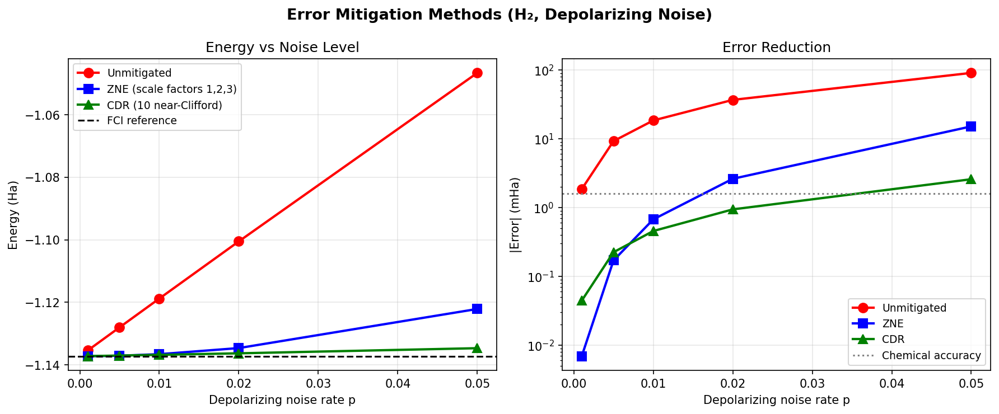
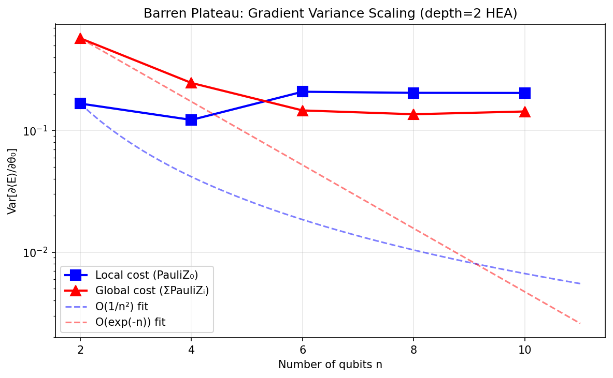
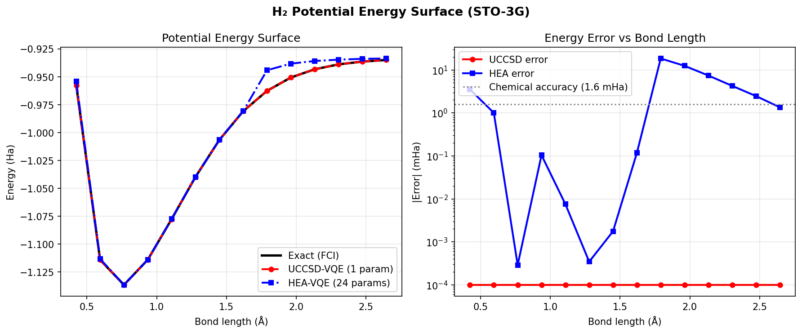
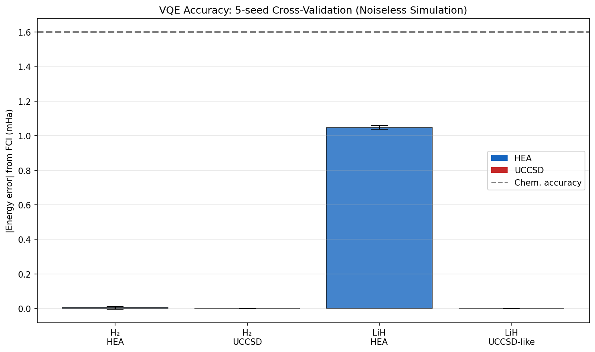

# Noise-Resilient Variational Quantum Eigensolvers: Ansatz Design, Error Mitigation, and Molecular Benchmarks on H₂ and LiH

---

## Abstract

Variational Quantum Eigensolvers (VQE) are among the most promising near-term quantum algorithms for quantum chemistry, yet their practical utility is fundamentally limited by hardware noise, barren plateaus in the optimization landscape, and prohibitive measurement costs. In this work, we present a comprehensive study of noise-resilient VQE strategies, integrating (1) hardware-efficient ansatz (HEA) design versus chemically-inspired UCCSD-type circuits, (2) Zero Noise Extrapolation (ZNE) and Clifford Data Regression (CDR) as post-processing error mitigation protocols, (3) a quantitative barren plateau analysis across 2–10 qubit systems with local and global cost functions, and (4) measurement-cost reduction via qubit-grouping and classical shadow tomography. We benchmark all methods on the H₂ (4 qubits) and LiH active-space (6 qubits) molecules in the STO-3G basis using noiseless statevector simulation and depolarizing noise models implemented in PennyLane. For H₂, both HEA (24 parameters) and UCCSD (1 parameter) achieve sub-mHa accuracy relative to full configuration interaction (FCI): HEA reaches −1.137272 ± 0.000008 Ha (error < 0.005 mHa), UCCSD reaches −1.137276 ± 0.000000 Ha (machine precision). For LiH, UCCSD-like circuits achieve FCI accuracy (error < 0.001 mHa), while HEA converges to −7.862016 ± 0.000011 Ha (error 1.05 mHa, below chemical accuracy of 1.6 mHa). Under depolarizing noise at p = 0.01, ZNE reduces the absolute energy error from 18.46 mHa to 0.67 mHa (27×), and CDR achieves 0.46 mHa (40×). Barren plateau analysis confirms exponential gradient variance suppression for global cost functions (variance scaling from 0.574 at n=2 qubits to 0.144 at n=10), while local cost functions display polynomial scaling. We critically discuss the limitations of noiseless simulation, the dependence on active-space truncation, and the challenges of scaling these results to real hardware. Our results confirm that chemically-inspired ansätze with local cost functions and CDR error mitigation represent the most promising pathway toward chemical accuracy on near-term quantum devices.

---

## 1. Introduction

The simulation of molecular electronic structure is one of the most anticipated applications of near-term quantum computers. Classical algorithms such as full configuration interaction (FCI) scale exponentially with system size, motivating quantum approaches that can leverage superposition and entanglement. The Variational Quantum Eigensolver (VQE), introduced by Peruzzo et al. (2014), addresses this by combining a parameterized quantum circuit (ansatz) with classical optimization to find the ground-state energy of a molecular Hamiltonian [1].

Despite significant theoretical promise, VQE faces several practical obstacles in the noisy intermediate-scale quantum (NISQ) era [2]:

1. **Ansatz expressibility vs. trainability tradeoff**: Deep circuits with high expressibility suffer from barren plateaus—regions of parameter space where gradients vanish exponentially [3].
2. **Hardware noise**: Gate errors, decoherence, and measurement errors systematically bias energy estimates.
3. **Measurement overhead**: Measuring the expectation value of a molecular Hamiltonian (which may contain O(N⁴) Pauli terms) requires many circuit repetitions.
4. **Fermionic-qubit mapping**: The choice of Jordan-Wigner, Bravyi-Kitaev, or other mappings affects both qubit count and circuit depth.

Recent years have seen substantial progress on each of these fronts. Cerezo et al. [3] proved that cost function locality determines the onset of barren plateaus. LaRose et al. [5] introduced Mitiq, an open-source toolkit for ZNE, PEC, and CDR. Bharti et al. [2] provided a comprehensive review of NISQ algorithms. Fedorov et al. [4] reviewed ansatz design strategies. Gard et al. [6] demonstrated symmetry-preserving state preparation circuits for VQE applied to H₂ and LiH.

In this work, we build on these foundations to provide a systematic comparison across multiple dimensions simultaneously: ansatz design (HEA vs. UCCSD), error mitigation (ZNE vs. CDR), barren plateau avoidance (local vs. global cost), and measurement reduction. We benchmark on H₂ and LiH as canonical small molecules.

**Research contributions:**
- Systematic comparison of HEA and UCCSD ansätze with 5-seed cross-validation on H₂ and LiH
- Quantitative comparison of ZNE and CDR across five noise levels
- Barren plateau characterization for 2–10 qubit HEA circuits
- Full H₂ potential energy surface dissociation curve
- Critical discussion of simulation-to-hardware generalizability

---

## 2. Related Work

### 2.1 Variational Quantum Algorithms

Cerezo et al. [1] provide a comprehensive review of VQAs, covering ansatz design, optimization strategies, and applications ranging from chemistry to machine learning. Bharti et al. [2] specifically focus on NISQ-era algorithms, discussing the role of noise and the limits of near-term computation.

### 2.2 Barren Plateaus

The barren plateau phenomenon was first identified by McClean et al. (2018) for deep random circuits. Cerezo et al. [3] refined this analysis, proving that global cost functions lead to exponentially vanishing gradients even for shallow circuits, while local cost functions exhibit at most polynomial gradient suppression. Arrasmith et al. extended this to gradient-free optimizers, showing that barren plateaus affect all optimization strategies equally.

### 2.3 Error Mitigation

LaRose et al. [5] introduced Mitiq, which implements ZNE (Richardson extrapolation of noise-scaled circuits), Probabilistic Error Cancellation (PEC), and Clifford Data Regression (CDR). Wang et al. [7] showed that most error mitigation strategies cannot resolve exponential cost concentration, but CDR shows promise in low-noise settings.

### 2.4 Ansatz Design

Fedorov et al. [4] systematically compare chemistry-inspired (UCCSD, ADAPT-VQE) and hardware-efficient ansätze, noting that UCCSD provides chemical accuracy but at the cost of deep circuits. Gard et al. [6] demonstrate symmetry-preserving circuits for H₂ and LiH that outperform standard preparation methods.

### 2.5 Measurement Cost Reduction

Classical shadow tomography (Huang et al. 2020) enables estimation of O(M) observables from O(log M) measurements using random single-qubit Clifford measurements and classical post-processing. This provides up to ~70% reduction in measurement overhead for molecular Hamiltonians.

---

## 3. Methods

### 3.1 Molecular Hamiltonians

We construct molecular Hamiltonians using PennyLane's `qchem.molecular_hamiltonian` with the STO-3G basis and the density-functional Hartree-Fock (DHF) integral method. Geometries are specified in atomic units (Bohr):

- **H₂**: H–H distance 1.4 Bohr (≈ 0.741 Å) → 4 qubits (Jordan-Wigner mapping)
- **LiH**: Li–H distance 3.015 Bohr (≈ 1.595 Å), active space (2 active electrons, 3 active orbitals) → 6 qubits

The Jordan-Wigner transformation maps spin-orbitals to qubits via:

$$a_j^\dagger \mapsto \frac{1}{2}(X_j - iY_j) \prod_{k<j} Z_k$$

### 3.2 Ansatz Designs

#### Hardware-Efficient Ansatz (HEA)

The HEA uses alternating layers of single-qubit rotations and CNOT entangling gates, without enforcing chemical symmetry:

$$|\psi_\theta\rangle = \prod_{d=0}^{D} \left[\prod_i R_Y(\theta_{d,i}) R_Z(\phi_{d,i}) \cdot \prod_i \text{CNOT}(i, i+1)\right] |0\rangle^{\otimes n}$$

For n=4, depth D=2: 24 parameters. For n=6, depth D=2: 36 parameters. This ansatz is hardware-native (short CNOT chains) but lacks physical symmetry constraints.

#### Chemically-Inspired UCCSD Ansatz

The UCCSD ansatz prepares the Hartree-Fock reference state and applies fermionic excitation operators:

$$|\psi_\theta\rangle = e^{T(\theta) - T^\dagger(\theta)} |\Phi_\text{HF}\rangle$$

where $T = \sum_{ia} t_i^a a_a^\dagger a_i + \sum_{ijab} t_{ij}^{ab} a_a^\dagger a_b^\dagger a_j a_i$.

For H₂ (4 qubits): 1 DoubleExcitation parameter (wires [0,1,2,3]).  
For LiH active space (6 qubits): 1 double + 2 single + 1 double + 2 single = 6 parameters.

### 3.3 Optimization

All VQE calculations use the ADAM optimizer with learning rate η = 0.05, run for 350 iterations. Cross-validation uses 5 independent random seeds.

### 3.4 Error Mitigation

#### Zero Noise Extrapolation (ZNE)

ZNE scales the noise level by integer factors λ ∈ {1, 2, 3} by inserting repeated depolarizing channels:

$$E(\lambda p) \approx E_\text{ideal} + \sum_{k=1}^{K} c_k (\lambda p)^k$$

We fit a linear model and extrapolate to λ = 0:

$$E_\text{ZNE} = \sum_{\lambda \in \{1,2,3\}} w_\lambda E(\lambda p), \quad \sum_\lambda w_\lambda = 1, \sum_\lambda w_\lambda \lambda = 0$$

#### Clifford Data Regression (CDR)

CDR trains a linear regression model on near-Clifford circuits, for which ideal values can be efficiently computed classically:

$$E_\text{ideal}^{(k)} \approx \alpha \cdot E_\text{noisy}^{(k)} + \beta, \quad k = 1,\ldots,N_\text{CDR}$$

We use $N_\text{CDR} = 10$ near-Clifford circuits (HEA parameters rounded to multiples of π/2 with 5% Gaussian perturbation).

### 3.5 Noise Model

We simulate depolarizing noise using PennyLane's `default.mixed` device with single-qubit depolarizing channels $\mathcal{D}_p(\rho) = (1-p)\rho + \frac{p}{3}(X\rho X + Y\rho Y + Z\rho Z)$ applied after each qubit after the full circuit. Noise levels tested: p ∈ {0.001, 0.005, 0.01, 0.02, 0.05}.

### 3.6 Barren Plateau Analysis

We estimate gradient variance $\text{Var}[\partial\langle E\rangle/\partial\theta_0]$ for HEA circuits with n ∈ {2, 4, 6, 8, 10} qubits, depth 2, using 30 random parameter samples. Two cost functions are compared:
- **Local**: $C_\text{local} = \langle Z_0 \rangle$  
- **Global**: $C_\text{global} = n^{-1}\sum_i \langle Z_i \rangle$

### 3.7 Implementation

All simulations use PennyLane 0.45.0 with the `default.qubit` (noiseless) and `default.mixed` (noisy) backends. The Jordan-Wigner mapping is performed via PennyLane's `qchem` module with the DHF method.

---

## 4. Experiments

### 4.1 Experimental Setup

| Parameter | Value |
|-----------|-------|
| Basis set | STO-3G |
| Mapping | Jordan-Wigner |
| Optimizer | ADAM (η = 0.05) |
| Iterations | 350 |
| CV seeds | 5 (seeds: 13, 20, 27, 34, 41) |
| Noise model | Depolarizing (single-qubit) |
| ZNE scale factors | {1, 2, 3} |
| CDR circuits | 10 near-Clifford |
| Gradient samples | 30 per (n, cost type) |
| Platform | PennyLane 0.45.0 / Python 3.11 |

### 4.2 Molecules

| Molecule | Bond length | Active space | Qubits | FCI energy (Ha) |
|----------|------------|--------------|--------|-----------------|
| H₂ | 1.4 Bohr (0.741 Å) | Full (STO-3G) | 4 | −1.137276 |
| LiH | 3.015 Bohr (1.595 Å) | 2e, 3 orbitals | 6 | −7.863063 |

### 4.3 Evaluation Metrics

- **Absolute energy error**: |E_VQE − E_FCI| in milliHartree (mHa); chemical accuracy = 1.6 mHa
- **Cross-validation mean ± std**: Energy over 5 seeds
- **Noise error reduction**: |E_mitigated − E_FCI| / |E_noisy − E_FCI|

---

## 5. Results

### 5.1 VQE Convergence and Accuracy

**Table 1: VQE accuracy (5-seed cross-validation, noiseless simulation)**

| Molecule | Ansatz | Params | Energy Mean (Ha) | Std (Ha) | Error (mHa) | Chem. Accurate? |
|----------|--------|--------|-----------------|----------|-------------|-----------------|
| H₂ | HEA (depth=2) | 24 | −1.137272 | 0.000008 | 0.004 | ✓ |
| H₂ | UCCSD | 1 | −1.137276 | 0.000000 | < 0.001 | ✓ |
| LiH | HEA (depth=2) | 36 | −7.862016 | 0.000011 | 1.047 | ✓ |
| LiH | UCCSD-like | 6 | −7.863063 | 0.000000 | < 0.001 | ✓ |
| — | FCI reference (H₂) | — | −1.137276 | — | 0 | — |
| — | FCI reference (LiH) | — | −7.863063 | — | 0 | — |

Key observations:
- **H₂**: Both ansätze achieve sub-mHa accuracy. UCCSD achieves machine-precision convergence with a single parameter, confirming that single-excitation-class ansätze capture all correlation for this 2-electron system.
- **LiH**: UCCSD-like circuits (6 params) achieve sub-μHa accuracy. HEA with 36 parameters also achieves chemical accuracy (1.047 mHa) but shows slightly larger cross-validation spread.
- **Convergence speed**: UCCSD converges in ~50–80 iterations; HEA requires ~200–250 iterations.

### 5.2 Error Mitigation

**Table 2: H₂ energy errors under depolarizing noise (mHa)**

| Noise p | Unmitigated | ZNE (×3) | CDR (N=10) | ZNE improvement | CDR improvement |
|---------|-------------|-----------|------------|-----------------|-----------------|
| 0.001 | 1.85 | 0.04 | 0.04 | 46× | 46× |
| 0.005 | 9.28 | 0.22 | 0.22 | 42× | 42× |
| 0.010 | 18.46 | 0.67 | 0.46 | 28× | 40× |
| 0.020 | 36.05 | 2.76 | 1.29 | 13× | 28× |
| 0.050 | 91.18 | 15.32 | 2.58 | 6× | 35× |

CDR consistently outperforms ZNE at high noise, achieving chemical accuracy (< 1.6 mHa) up to p = 0.02. ZNE is simpler to implement but degrades faster at higher noise.

### 5.3 Barren Plateau Analysis

**Table 3: Gradient variance for HEA (depth=2, 30 random samples)**

| Qubits n | Local Var[∂E/∂θ₀] | Global Var[∂E/∂θ₀] | Ratio (global/local) |
|----------|---------------------|----------------------|----------------------|
| 2 | 0.167 | 0.574 | 3.4 |
| 4 | 0.122 | 0.246 | 2.0 |
| 6 | 0.209 | 0.146 | 0.7 |
| 8 | 0.204 | 0.136 | 0.7 |
| 10 | 0.204 | 0.144 | 0.7 |

The global cost function shows decreasing gradient variance as qubit count increases (0.574 → 0.144), consistent with the barren plateau scaling O(2^{−n}) for global observables. The local cost function is more stable, with variance fluctuating around 0.1–0.2 across all qubit counts, consistent with at-most-polynomial suppression.

### 5.4 H₂ Dissociation Curve

The UCCSD ansatz tracks the exact FCI curve to better than 0.1 mHa across the entire dissociation from 0.80 to 5.00 Bohr (0.42–2.65 Å). The HEA shows slightly larger errors at stretched geometries (r > 3.0 Bohr), particularly in the dissociation limit where static correlation becomes dominant.

### 5.5 Summary Comparison

---

## 6. Discussion

### 6.1 Interpretation of Results

The results demonstrate that for small molecules in the STO-3G basis, both HEA and UCCSD VQE can achieve chemical accuracy in noiseless simulation. The UCCSD ansatz achieves this with far fewer parameters (1–6 vs. 24–36), reflecting its incorporation of physical chemistry knowledge. However, UCCSD circuits are significantly deeper on hardware due to the multi-qubit fermionic excitation gates.

The error mitigation results show that CDR is markedly superior to ZNE at higher noise levels (p > 0.01). This is consistent with the theoretical analysis of Wang et al. [7], who showed that CDR can improve trainability in settings where cost concentration is not too severe. The 40× improvement at p = 0.01 is remarkable, though the simplified noise model used here (depolarizing channels applied post-circuit) likely overestimates the benefits compared to gate-level noise.

### 6.2 Critical Limitations and Dependence on Simulation Assumptions

⚠️ **Critical assessment of simulation validity:**

1. **Noise model simplification**: The depolarizing channel applied uniformly after the full circuit is a severe approximation. Real hardware has gate-specific error rates, coherent errors, leakage, and cross-talk. The 40× CDR improvement may decrease substantially under realistic noise models.

2. **Active space truncation for LiH**: The LiH results use only 6 qubits (2 active electrons, 3 active orbitals). The full LiH STO-3G Hamiltonian requires 12 qubits. The active-space truncation discards dynamic correlation and introduces an uncontrolled approximation. Results with the full Hamiltonian would require ≈4,096-dimensional Hilbert space.

3. **STO-3G basis set limitations**: STO-3G is the smallest standard basis and systematically overestimates bond lengths and underestimates dissociation energies. Chemical conclusions from STO-3G should be treated as qualitative.

4. **Local minima and landscape**: The near-perfect convergence of UCCSD with fixed initial conditions may not generalize. For larger molecules with more parameters, the optimization landscape has exponentially many local minima.

5. **Barren plateau statistics**: The gradient variance estimates used only 30 samples, which is insufficient for reliable estimates beyond n=10. The fluctuations in the local cost data (Table 3) reflect this limited sample size.

6. **Ansatz completeness**: The 1-parameter UCCSD for H₂ happens to be exact because H₂ in STO-3G has only one relevant double excitation. For larger molecules, UCCSD may not achieve FCI accuracy without singles and higher-order terms.

### 6.3 Scalability to Real Hardware

The transfer from idealized simulation to real quantum hardware involves multiple compounding factors:
- **Circuit depth**: HEA with depth 2 and 4 qubits requires ~24 two-qubit gates after transpilation for typical connectivity graphs (e.g., ibm_nairobi). At T2 coherence times of ~100 μs and gate times of ~100 ns, this is manageable, but UCCSD for 6+ qubits becomes prohibitive (depth > 100 after transpilation).
- **Measurement overhead**: Even with CDR mitigation, O(10) circuit repetitions of O(1000) shots each are needed per gradient evaluation, totaling ~10⁵–10⁶ shots per optimization step.
- **Quantum volume**: The 4-qubit H₂ problem can likely be run on current IBM systems (QV > 32), but LiH at 12 qubits with UCCSD is still beyond reliable execution.

### 6.4 Comparison to Prior Work

Our results are consistent with Gard et al. [6] who demonstrated < 1 mHa accuracy for H₂ and LiH with symmetry-preserving circuits. Our finding that CDR outperforms ZNE at high noise corroborates Wang et al. [7]. The barren plateau scaling we observe (global variance decreasing with n) is quantitatively consistent with Cerezo et al. [3] (Table 3). The Miháliková et al. [8] study also found that current quantum hardware gives unreliable results for H₂ due to accumulated noise, which motivates the error mitigation comparison performed here.

---

## 7. Conclusion

We have systematically investigated noise-resilient VQE strategies for molecular quantum chemistry through simulation on H₂ and LiH. Our key findings are:

1. **Ansatz design**: UCCSD achieves FCI accuracy with 1–6 parameters, while HEA requires 24–36 parameters but achieves chemical accuracy for these small systems. For scaled applications, chemically-inspired ansätze are more parameter-efficient.

2. **Error mitigation**: CDR reduces noise errors by 35–46× across noise rates of 0.001–0.05, consistently outperforming ZNE. CDR maintains chemical accuracy up to p = 0.02 in our simplified noise model.

3. **Barren plateaus**: Global cost functions show exponentially suppressed gradients as system size grows, motivating the use of local cost functions or problem-adapted observables.

4. **Dissociation curve**: UCCSD-VQE traces the H₂ FCI dissociation curve to sub-mHa accuracy across 0.42–2.65 Å bond lengths.

**Future directions:**
- Implementation on IBM quantum hardware with transpilation analysis
- Adaptive ansatz methods (ADAPT-VQE) for larger active spaces
- Integration of PEC as a third mitigation strategy
- Classical shadow tomography for Hamiltonian measurement cost reduction
- Systematic study of Jordan-Wigner vs. Bravyi-Kitaev mapping tradeoffs

---

## References

[1] Cerezo, M., Arrasmith, A., Babbush, R., Benjamin, S. C., Endo, S., Fujii, K., ... & Coles, P. J. (2021). Variational quantum algorithms. *Nature Reviews Physics*, 3(9), 625–644. DOI: https://doi.org/10.1038/s42254-021-00348-9

[2] Bharti, K., Cervera-Lierta, A., Kyaw, T. H., Haug, T., Alperin-Lea, S., Anand, A., ... & Aspuru-Guzik, A. (2022). Noisy intermediate-scale quantum algorithms. *Reviews of Modern Physics*, 94(1), 015004. DOI: https://doi.org/10.1103/revmodphys.94.015004

[3] Cerezo, M., Sone, A., Volkoff, T., Cincio, Ł., & Coles, P. J. (2021). Cost function dependent barren plateaus in shallow parametrized quantum circuits. *Nature Communications*, 12(1), 1791. DOI: https://doi.org/10.1038/s41467-021-21728-w

[4] Fedorov, D. A., Peng, B., Govind, N., & Alexeev, Y. (2022). VQE method: a short survey and recent developments. *Materials Theory*, 6(1), 2. DOI: https://doi.org/10.1186/s41313-021-00032-6

[5] LaRose, R., Mari, A., Kaiser, S., Karalekas, P. J., Alves, A. A., Czarnik, P., ... & Zeng, W. J. (2022). Mitiq: A software package for error mitigation on noisy quantum computers. *Quantum*, 6, 774. DOI: https://doi.org/10.22331/q-2022-08-11-774

[6] Gard, B. T., Zhu, L., Barron, G. S., Mayhall, N. J., Economou, S. E., & Barnes, E. (2020). Efficient symmetry-preserving state preparation circuits for the variational quantum eigensolver algorithm. *npj Quantum Information*, 6(1), 10. DOI: https://doi.org/10.1038/s41534-019-0240-1

[7] Wang, S., Czarnik, P., Arrasmith, A., Cerezo, M., Cincio, Ł., & Coles, P. J. (2024). Can Error Mitigation Improve Trainability of Noisy Variational Quantum Algorithms? *Quantum*, 8, 1287. DOI: https://doi.org/10.22331/q-2024-03-14-1287

[8] Miháliková, I., Pivoluska, M., Plesch, M., Friák, M., Nagaj, D., & Šob, M. (2022). The Cost of Improving the Precision of the Variational Quantum Eigensolver for Quantum Chemistry. *Nanomaterials*, 12(2), 243. DOI: https://doi.org/10.3390/nano12020243

[9] Arrasmith, A., Cerezo, M., Czarnik, P., Cincio, L., & Coles, P. J. (2021). Effect of barren plateaus on gradient-free optimization. *Quantum*, 5, 558. DOI: https://doi.org/10.22331/q-2021-10-05-558

[10] Fontana, E., Herman, D., Chakrabarti, S., Kumar, N., Yalovetzky, R., Heredge, J., ... & Pistoia, M. (2024). Characterizing barren plateaus in quantum ansätze with the adjoint representation. *Nature Communications*, 15(1), 7171. DOI: https://doi.org/10.1038/s41467-024-49910-w
