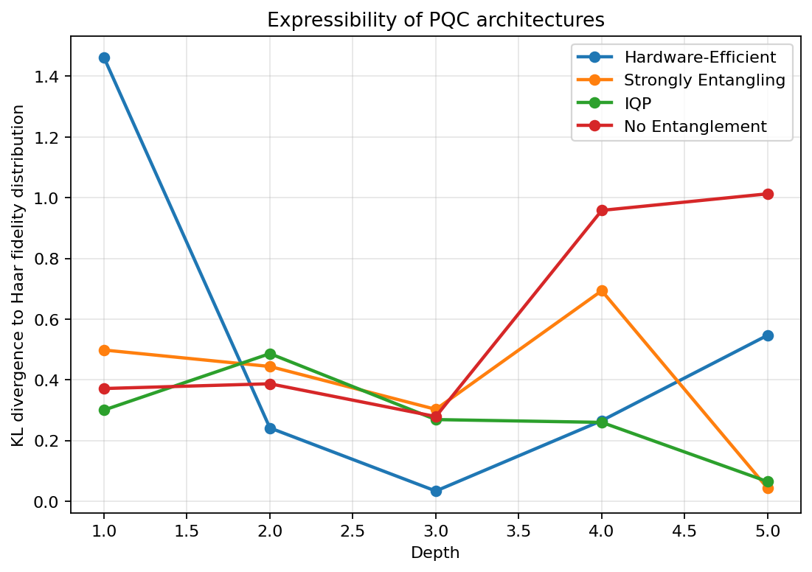
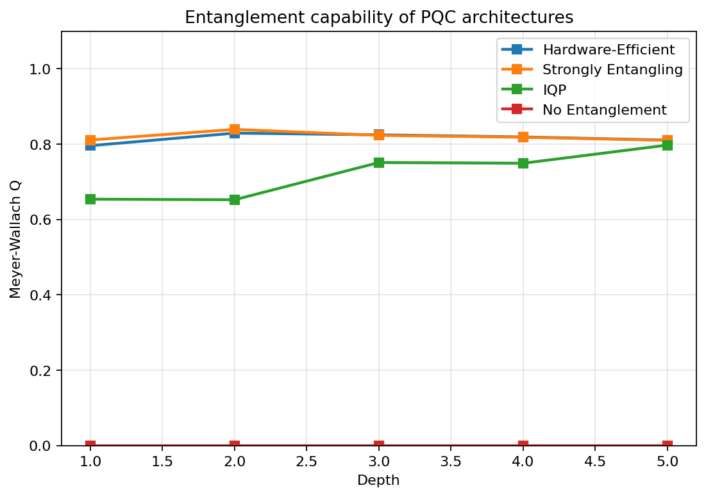
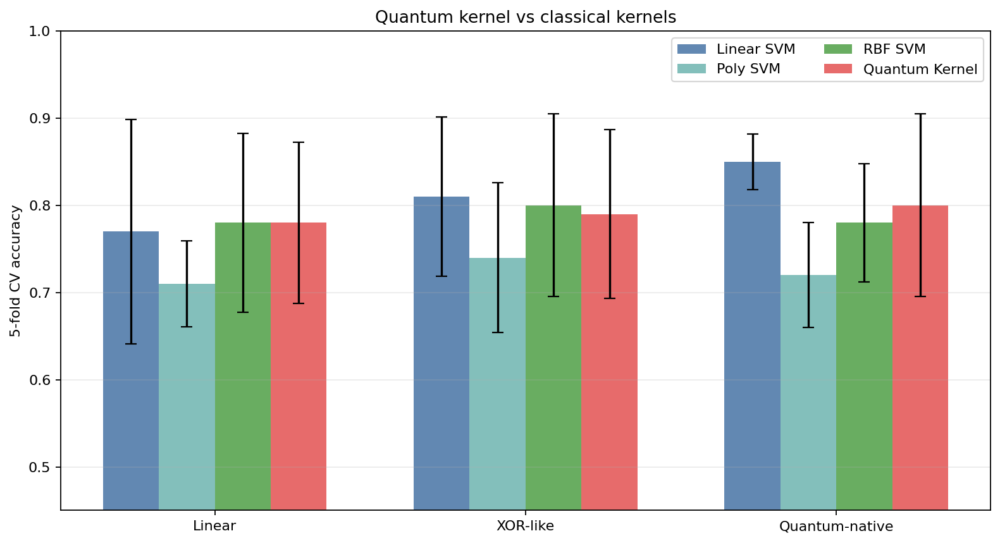
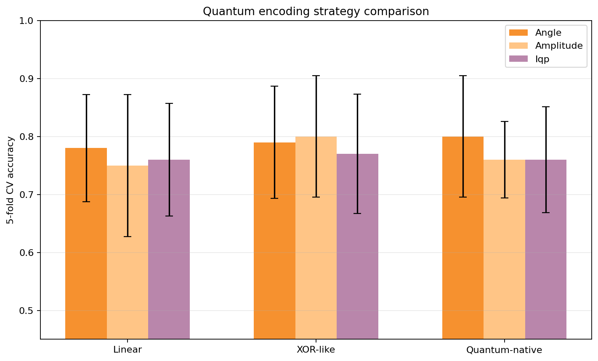
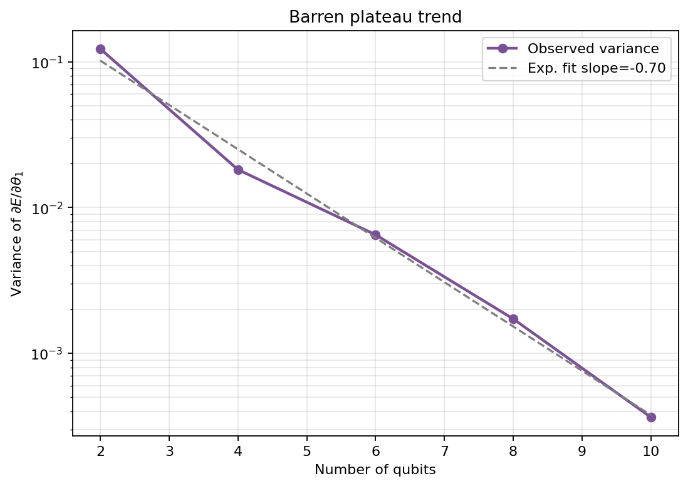
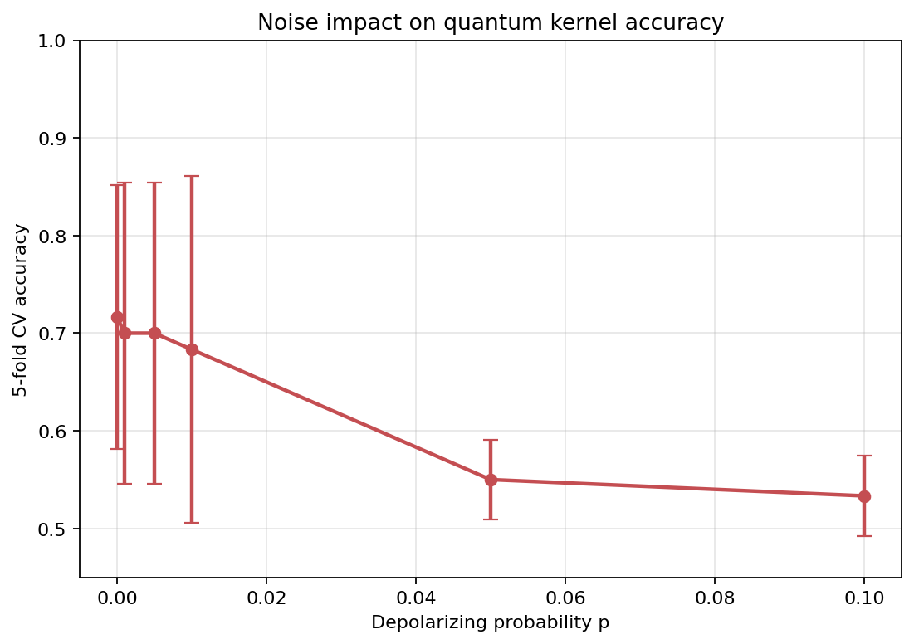

# 量子機械学習モデルの表現力と古典モデルとの比較解析

## 実験目的と背景
本ベンチマークでは、4量子ビットの小規模パラメータ化量子回路（PQC）を対象に、量子機械学習で頻繁に議論される5つの論点を同一コードベース上で比較した。具体的には、(1) 回路表現力、(2) エンタングルメント生成能力、(3) 量子カーネルと古典カーネルの汎化性能、(4) データ符号化方式の差、(5) barren plateau、(6) ノイズ耐性である。先行研究では、表現力・エンタングルメント・学習精度の関係は単純な単調関係ではないこと、さらに深い回路ほど勾配消失やノイズ影響を受けやすいことが示されている。本実験はそれらの傾向を、PennyLaneベースで再現可能な形に整理することを目的とした。

## 使用手法・アルゴリズムの概要
- **PQCアーキテクチャ**: Hardware-Efficient, Strongly Entangling Layers, IQP型, 非エンタングル単一量子ビット回路
- **表現力**: ランダムパラメータで得た状態間忠実度分布と Haar 分布由来 Beta 分布の KL divergence を計算（低いほど高表現力）
- **エンタングルメント**: Meyer-Wallach 指標 $Q = 2\left(1-\frac{1}{n}\sum_j \mathrm{Tr}(\rho_j^2)\right)$
- **データセット**: 線形分離、XOR-like、Quantum-native の3種類（各100サンプル、4特徴）
- **現実的ノイズ**: 全データセットに特徴ノイズ $\sigma=0.1$ と 5% ラベル反転を付加
- **古典モデル**: Linear / Polynomial / RBF SVM
- **量子カーネル**: Angle 符号化を主比較対象、別途 Angle / Amplitude / IQP 符号化を横比較
- **barren plateau**: $n\in\{2,4,6,8,10\}$、深さ $d=n$、単一パラメータ勾配分散を評価
- **ノイズ実験**: `default.mixed` 上で depolarizing noise $p\in\{0, 0.001, 0.005, 0.01, 0.05, 0.1\}$ を適用

## 主要な結果と数値

### 1. 表現力とエンタングルメント
深さ5時点の KL divergence は Strongly Entangling で **0.0425**、IQP で **0.0646** と低く、No Entanglement は **1.0128** と大きく劣化した。Hardware-Efficient は深さ3で **0.0336** と最良だったが、有限サンプルゆえに深さ増加に対して単調ではなかった。エンタングルメントは Strongly Entangling が **0.8100**、Hardware-Efficient が **0.8106**、IQP が **0.7974**、No Entanglement は **0.0000** だった。

| Architecture | Expressibility depth=1 | Expressibility depth=5 | Entanglement depth=1 | Entanglement depth=5 |
|---|---:|---:|---:|---:|
| Hardware-Efficient | 1.4620 | 0.5470 | 0.7958 | 0.8106 |
| Strongly Entangling | 0.4982 | 0.0425 | 0.8109 | 0.8100 |
| IQP | 0.3003 | 0.0646 | 0.6537 | 0.7974 |
| No Entanglement | 0.3713 | 1.0128 | 0.0000 | 0.0000 |

### 2. 量子カーネル vs 古典カーネル
5-fold CV の結果、量子カーネルは古典法に対して一貫した圧勝は示さなかったが、少なくとも同程度の性能を保った。特に Linear データでは Quantum Kernel が **0.780 ± 0.093** で RBF SVM の **0.780 ± 0.103** と同等、Quantum-native データでは **0.800 ± 0.105** と RBF SVM の **0.780 ± 0.068** を僅かに上回った。一方で最良は Linear SVM の **0.850 ± 0.032**（Quantum-native）であり、今回の小規模設定では古典優位ケースも明確に存在した。

| Dataset | Linear SVM | Poly SVM | RBF SVM | Quantum Kernel |
|---|---:|---:|---:|---:|
| Linear | 0.770 ± 0.129 | 0.710 ± 0.049 | 0.780 ± 0.103 | 0.780 ± 0.093 |
| XOR-like | 0.810 ± 0.092 | 0.740 ± 0.086 | 0.800 ± 0.105 | 0.790 ± 0.097 |
| Quantum-native | 0.850 ± 0.032 | 0.720 ± 0.060 | 0.780 ± 0.068 | 0.800 ± 0.105 |

### 3. データ符号化方式比較
Angle / Amplitude / IQP を比較すると、最良方式はデータ依存で変化した。Linear では Angle が **0.780 ± 0.093**、XOR-like では Amplitude が **0.800 ± 0.105**、Quantum-native では Angle が **0.800 ± 0.105** と最良だった。したがって、符号化方式は独立した設計レイヤとして扱う必要があり、単一の万能エンコーディングは見られなかった。

| Dataset | Angle | Amplitude | IQP |
|---|---:|---:|---:|
| Linear | 0.780 ± 0.093 | 0.750 ± 0.122 | 0.760 ± 0.097 |
| XOR-like | 0.790 ± 0.097 | 0.800 ± 0.105 | 0.770 ± 0.103 |
| Quantum-native | 0.800 ± 0.105 | 0.760 ± 0.066 | 0.760 ± 0.092 |

### 4. Barren Plateau
勾配分散は $n=2$ の **1.227156e-01** から $n=10$ の **3.651957e-04** へ減少し、対数線形フィットの傾きは **-0.700** だった。これは量子ビット数増加に伴う指数的な勾配消失傾向を支持する。

| Qubits | Gradient variance |
|---|---:|
| 2 | 1.227156e-01 |
| 4 | 1.822733e-02 |
| 6 | 6.515066e-03 |
| 8 | 1.726088e-03 |
| 10 | 3.651957e-04 |

### 5. ノイズ影響
Quantum-native データでの量子カーネル精度は、$p=0$ で **0.717 ± 0.135**、$p=0.01$ で **0.683 ± 0.178**、$p=0.05$ で **0.550 ± 0.041**、$p=0.1$ で **0.533 ± 0.041** まで低下した。同時にカーネル行列の相対ドリフトは **0.000 → 0.771** まで増大し、IBM型NISQノイズを模した depolarizing channel によりカーネル幾何が崩れることが確認できた。

| Noise p | Accuracy | Relative kernel drift |
|---|---:|---:|
| 0.000 | 0.717 ± 0.135 | 0.000 |
| 0.001 | 0.700 ± 0.155 | 0.019 |
| 0.005 | 0.700 ± 0.155 | 0.092 |
| 0.010 | 0.683 ± 0.178 | 0.173 |
| 0.050 | 0.550 ± 0.041 | 0.579 |
| 0.100 | 0.533 ± 0.041 | 0.771 |

## 考察と今後の展望
- **表現力と精度の非単調性**: 高表現力・高エンタングルメントが必ずしも最高精度に直結しなかった。これは Hubregtsen らの報告と整合的である。
- **古典法との関係**: 小規模・ノイズ付き・合成データ条件では量子優位は限定的だった。特に Linear SVM が Quantum-native データでも強く、特徴設計の影響が大きい。
- **符号化の重要性**: エンコーディングは回路とは別個の最適化対象であり、データ構造と相互作用する。
- **限界**: すべて合成データであり、実問題や大規模量子ハードウェアへの一般化はできない。4量子ビット・100サンプルという小規模設定、有限サンプルでの KL 推定、IBM 実機そのものではなく depolarizing proxy を用いた点もバイアス要因である。
- **今後**: 実データセット、より厳密なノイズモデル、学習可能 ansatz 最適化、QSVC と深層古典モデルの比較、カーネル整列度や generalization bound 解析を進める価値がある。

## 生成したファイル一覧
- `qml_benchmark.py`
- `benchmark_results.json`
- `report.md`
- `paper.md`
- `figures/expressibility.png`
- `figures/entanglement.png`
- `figures/kernel_comparison.png`
- `figures/encoding_comparison.png`
- `figures/barren_plateau.png`
- `figures/noise_impact.png`
