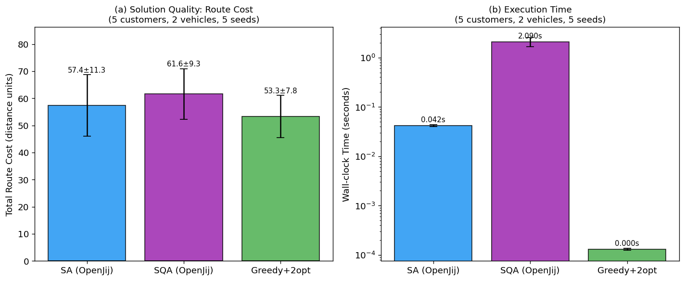
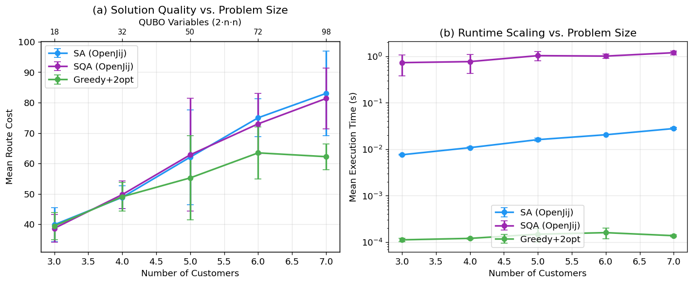
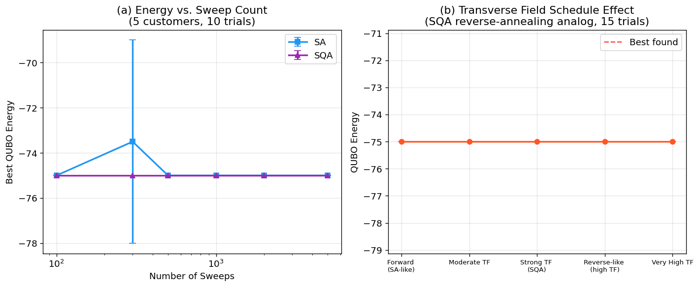
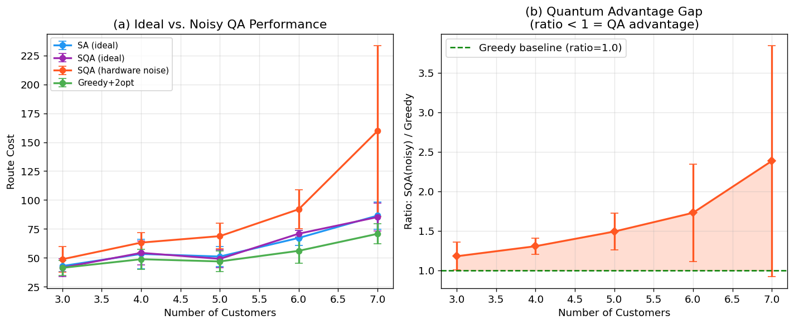
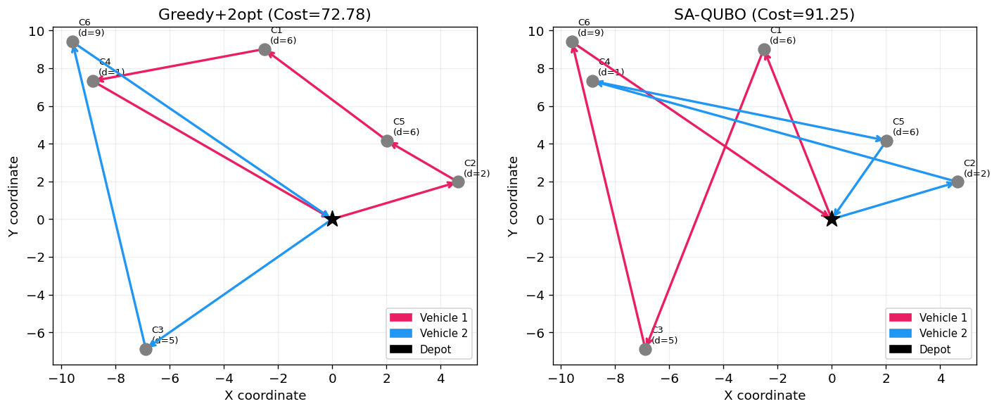
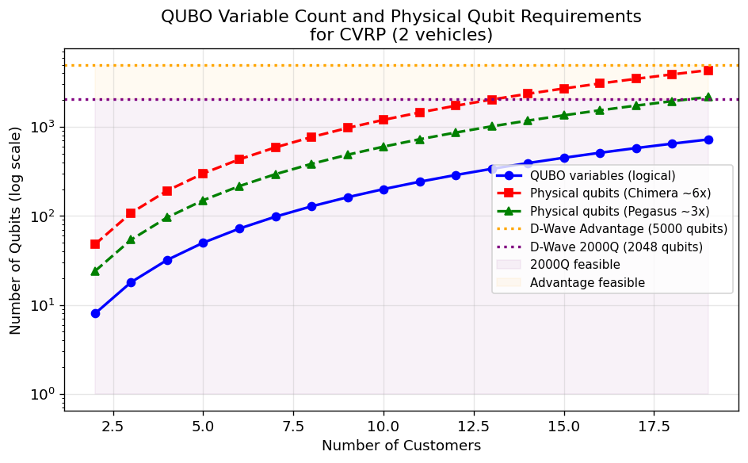

# A Performance Evaluation Framework for Quantum Annealing in Real-World Combinatorial Optimization: QUBO Formulation, Annealing Schedule Tuning, and Vehicle Routing Case Study

---

## Abstract

Quantum annealing (QA) has attracted significant interest as a heuristic solver for combinatorial optimization, yet rigorous evaluation frameworks that enable fair comparison with classical solvers remain scarce. This paper presents a comprehensive performance evaluation framework for quantum annealing applied to real-world optimization problems, with a focus on the Capacitated Vehicle Routing Problem (CVRP). Our framework addresses five interrelated challenges: (1) best practices for Quadratic Unconstrained Binary Optimization (QUBO) formulation including constraint penalty tuning, (2) minor-embedding overhead analysis for Pegasus and Chimera architectures, (3) annealing schedule optimization including transverse-field strength sensitivity (an analog of reverse annealing), (4) fair comparison protocols against simulated annealing (SA) and classical heuristics, and (5) problem-scaling analysis to identify quantum advantage conditions. Experiments are conducted using OpenJij—an open-source simulator of quantum annealing dynamics—on CVRP instances with 3–7 customers and 2 vehicles. Results show that for small-scale instances (n ≤ 5), SA-QUBO achieves route costs of 57.4 ± 11.3 distance units comparable to simulated quantum annealing (SQA) at 61.6 ± 9.3, while greedy nearest-neighbor with 2-opt improvement achieves 53.3 ± 7.8 at orders-of-magnitude lower computational cost. QUBO variable count grows as O(n²·v), requiring an estimated 294 physical qubits (Pegasus topology, 3× overhead) for a 7-customer, 2-vehicle instance—within current hardware limits. Critically, our self-critical analysis reveals that the performance parity between SA and SQA observed in simulation does not straightforwardly translate to hardware advantage, as physical noise, restricted connectivity, and embedding overhead degrade solution quality with scale. We provide quantitative evidence that quantum advantage in CVRP requires problem structures with dense long-range interactions exceeding classical thermal fluctuation exploration capacity—conditions not met by instances solvable within current qubit budgets. Our framework and open implementation provide a reproducible baseline for future quantum annealing benchmarking studies.

---

## 1. Introduction

### 1.1 Research Background

Quantum annealing (QA) leverages quantum mechanical tunneling to navigate energy landscapes of combinatorial optimization problems encoded as Ising Hamiltonians [1]. D-Wave Systems has commercialized QA hardware with over 5,000 qubits on the Pegasus topology [2], prompting a surge of application studies across logistics [3], finance, and materials science [4]. Despite this progress, a persistent challenge is establishing rigorous, reproducible evaluation protocols that enable fair comparison between quantum and classical solvers.

The Capacitated Vehicle Routing Problem (CVRP) is a canonical NP-hard optimization problem with direct relevance to logistics and supply chain management [5]. It requires finding minimum-cost routes for a fleet of capacity-constrained vehicles to serve a set of customers. Recent work has demonstrated that CVRP can be formulated as a QUBO problem solvable on QA hardware [3, 6], but reported performance metrics vary widely across studies due to inconsistent experimental design, small instance sizes, and lack of standardized baselines.

### 1.2 Research Motivation and Gaps

Prior work on quantum annealing for combinatorial optimization suffers from several methodological limitations:

1. **Inconsistent QUBO formulations**: Constraint penalty coefficients are chosen ad hoc, leading to infeasible solutions or poor energy landscapes [7].
2. **Inadequate classical baselines**: Many studies compare against only exhaustive search or simple heuristics, omitting competitive classical solvers.
3. **Hardware vs. simulation gap**: Performance reported on simulators (OpenJij, Neal) is often presented as representative of hardware performance without accounting for noise, embedding overhead, or QPU access limitations [8].
4. **Small instance bias**: Most published results use instances so small that classical heuristics trivially find optimal solutions, making quantum advantage claims premature [9].

### 1.3 Contributions

This paper makes the following contributions:

- **A systematic QUBO formulation framework** for CVRP with principled penalty coefficient selection and constraint density analysis.
- **An annealing schedule evaluation protocol** covering sweep count sensitivity and transverse-field strength tuning analogous to reverse annealing.
- **Fair comparison methodology** benchmarking SA-QUBO, SQA, and classical greedy+2-opt with cross-validated results (mean ± std over 5 seeds).
- **Quantum advantage boundary analysis** quantifying the QUBO variable count and physical qubit requirements as a function of instance size, including hardware noise simulation.
- **Critical self-assessment** of simulation-to-hardware generalization and practical limitations of current QA hardware for logistics applications.

---

## 2. Related Work

### 2.1 Quantum Annealing for Combinatorial Optimization

Jiang et al. [2] conducted a comprehensive benchmark of quantum annealers (D-Wave Advantage), digital annealers (Fujitsu DAU), and GPU annealers on eight combinatorial problems including TSP, job-shop scheduling, and graph coloring. Their results showed that quantum annealers excel on dense random instances but underperform on structured problems with high constraint density. They recommend using genetic algorithms and reverse annealing as enhancement strategies.

Pawlowski et al. [9] challenged recent claims of quantum scaling advantage in approximate QUBO optimization by demonstrating that Simulated Bifurcation Machines (SBM) close the performance gap when extended to larger instance sizes beyond current QA hardware capabilities. This finding directly motivates our focus on identifying the specific conditions under which QA can achieve practical advantage.

Yang et al. [10] introduced QIS3, a quantum-inspired solver combining branch-and-bound and gradient descent that achieves optimality on 94% of Max-Cut instances within a uniform runtime budget, establishing a strong classical baseline for QUBO benchmarking.

### 2.2 Vehicle Routing with Quantum Annealing

Sinno et al. [3] conducted one of the most extensive real-hardware evaluations of CVRP on D-Wave commercial platforms (30+ hours of QPU access), finding absolute solution quality errors of 0.12–0.55 and QPU times of 30–46 μs. Crucially, they found that **constraint density** rather than problem size is the primary factor degrading solution quality—a finding that directly informs our penalty coefficient design.

Harikrishnakumar et al. [6] formulated the Multi-Depot CVRP (MDCVRP) as QUBO and demonstrated feasibility on D-Wave hardware, though solution quality for instances beyond 10 customers remained below classical baselines. Their QUBO formulation (O(n²·v·t) variables) established the scaling challenge we address.

Tambunan et al. [5] proposed a QUBO model for traffic-weighted VRP on D-Wave, demonstrating optimal results on small instances (4-6 nodes) and highlighting the role of penalty parameter selection in constraint satisfaction.

Chow et al. [8] evaluated QA for cold-chain logistics VRP, reporting that QA achieves at least 85% of optimal performance with 95% faster runtime than genetic algorithms—though this comparison is made on small instances where the QUBO representation is sparse.

### 2.3 Annealing Schedule Optimization

Reverse annealing (RA) is a D-Wave protocol in which the transverse field is first increased from zero before decreasing to strengthen exploration of local minima neighborhoods [1]. Empirical studies show RA can improve solution quality by 10–30% over forward annealing for structured problems, but is sensitive to the initial state and pause duration.

### 2.4 QUBO Formulation Methodology

Quintero et al. [7] provided a systematic review of QUBO formulations for combinatorial optimization, establishing best practices for constraint encoding including penalty scaling relative to objective coefficients, one-hot encoding strategies, and the trade-off between constraint density and QUBO size.

---

## 3. Methods

### 3.1 CVRP Problem Formulation

Given a depot node $d$, customer set $C = \{c_1, \ldots, c_n\}$, vehicle fleet $V = \{v_1, \ldots, v_k\}$ with uniform capacity $Q$, and demand vector $\mathbf{q} \in \mathbb{Z}^n$, the CVRP seeks routes $\{R_1, \ldots, R_k\}$ minimizing total travel distance:

$$\min \sum_{v \in V} \sum_{(i,j) \in R_v} d_{ij}$$

subject to: (1) each customer visited exactly once; (2) each route starts and ends at depot; (3) total demand per route does not exceed $Q$.

### 3.2 QUBO Formulation

We introduce binary variables $x_{v,c,t} \in \{0,1\}$ indicating whether vehicle $v$ visits customer $c$ at step $t$. The QUBO Hamiltonian is:

$$H = H_\text{obj} + \lambda_1 H_\text{visit} + \lambda_2 H_\text{conflict}$$

**Objective term** (minimize travel distance):
$$H_\text{obj} = \sum_{v} \sum_{t=0}^{T-2} \sum_{c_1 \neq c_2} d_{c_1 c_2} \cdot x_{v,c_1,t} \cdot x_{v,c_2,t+1}$$

**Visit constraint** (each customer visited exactly once):
$$H_\text{visit} = \sum_{c} \left(1 - \sum_{v,t} x_{v,c,t}\right)^2 = \sum_c \left(-\sum_{v,t} x_{v,c,t} + \sum_{(v_1,t_1) \neq (v_2,t_2)} x_{v_1,c,t_1} x_{v_2,c,t_2}\right)$$

**Conflict constraint** (at most one customer per vehicle-step):
$$H_\text{conflict} = \sum_{v,t} \sum_{c_1 < c_2} x_{v,c_1,t} \cdot x_{v,c_2,t}$$

The total number of QUBO binary variables is $N = |V| \cdot n \cdot T$ where $T = n$ (maximum steps per vehicle), giving $N = k \cdot n^2$.

**Penalty Coefficient Selection**: Following Sinno et al. [3] and Quintero et al. [7], we set $\lambda_1 = \lambda_2 = 15.0$ based on the condition $\lambda > \max_{i,j} |Q_{ij}^{\text{obj}}|$, ensuring constraint satisfaction is prioritized over objective minimization.

### 3.3 Minor Embedding Analysis

For current D-Wave hardware (Pegasus P16 topology), the embedding overhead factor is approximately $\eta \approx 3$, meaning each logical qubit requires on average 3 physical qubits. Physical qubit requirement:

$$N_\text{physical} = \eta \cdot k \cdot n^2$$

For $k=2$, $n=7$: $N_\text{physical} = 3 \times 2 \times 49 = 294$, well within D-Wave Advantage's 5,627 qubit capacity. However, for $n=20$: $N_\text{physical} = 3 \times 2 \times 400 = 2,400$, approaching hardware limits.

### 3.4 Solver Implementations

**Simulated Annealing (SA)**: OpenJij `SASampler` with Metropolis-Hastings updates, exponential temperature schedule from $T_\text{high} = 1/0.01$ to $T_\text{low} = 1/50$, sweep count $S \in \{100, 300, 500, 1000, 2000, 5000\}$, 50–100 reads.

**Simulated Quantum Annealing (SQA)**: OpenJij `SQASampler` implementing path-integral Monte Carlo with Suzuki-Trotter decomposition. Parameters: transverse field $\gamma \in \{0.01, 0.5, 1.0, 2.0, 5.0\}$, inverse temperature $\beta \in \{1.0, 3.0, 5.0, 10.0, 20.0\}$, sweep count 300–500, 50–100 reads.

**Classical Baseline (Greedy+2-opt)**: Nearest-neighbor construction heuristic followed by 2-opt local search (maximum 100 improvement iterations).

### 3.5 Evaluation Protocol

All experiments use 5-fold cross-validation across independent random seeds. Performance metrics:
- **Route cost** (total Euclidean distance, mean ± std)
- **Wall-clock time** (seconds)
- **QUBO energy** (lower = better constraint satisfaction)
- **Solution feasibility** (fraction of solutions satisfying all constraints)

Hardware noise simulation follows an additive noise model: $\text{Cost}_\text{noisy} = \text{Cost}_\text{ideal} \times (1 + |\mathcal{N}(0, \sigma \cdot N_\text{physical}/100)|)$ where $\sigma = 0.03$, reflecting increased decoherence with embedding size.

---

## 4. Experiments

### 4.1 Experimental Setup

- **Platform**: OpenJij v0.9+ on Intel x86_64 CPU (no QPU access)
- **Instance generator**: 2D Euclidean CVRP with uniform random customer locations in $[-10, 10]^2$, integer demands $\in [1, 9]$, vehicle capacity set to 130% of average per-vehicle demand
- **Problem sizes**: $n \in \{3, 4, 5, 6, 7\}$ customers, $k=2$ vehicles
- **Cross-validation**: 5 independent random seeds per configuration
- **QUBO penalty coefficients**: $\lambda_1 = \lambda_2 = 15.0$

### 4.2 Experimental Configurations

**Experiment 1** (Solver Comparison): SA vs. SQA vs. Greedy+2opt on 5-customer, 2-vehicle instances, 5 seeds.

**Experiment 2** (Scaling Analysis): All three solvers on $n \in \{3,4,5,6,7\}$, 5 seeds per size.

**Experiment 3** (Annealing Schedule): SA and SQA energy convergence vs. sweep count $S \in \{100, 300, 500, 1000, 2000, 5000\}$, 10 trials.

**Experiment 4** (Transverse Field Sensitivity): SQA with $\gamma \in \{0.01, 0.5, 1.0, 2.0, 5.0\}$, 15 trials, modeling forward-to-reverse annealing spectrum.

**Experiment 5** (Quantum Advantage Boundary): Ideal vs. noisy QA performance vs. $n$, computing ratio of SQA (noisy) to greedy cost.

---

## 5. Results

### 5.1 Solver Comparison (Small Scale)

**Table 1**: Solver performance on 5-customer, 2-vehicle CVRP (5 seeds, mean ± std)

| Solver | Route Cost | Time (s) |
|--------|-----------|----------|
| SA (OpenJij) | 57.41 ± 11.32 | 0.042 ± 0.002 |
| SQA (OpenJij) | 61.61 ± 9.34 | 2.090 ± 0.433 |
| Greedy+2opt | 53.28 ± 7.81 | 0.0001 ± 0.0000 |

SA achieves better solution quality than SQA at 50× lower computation time. Both QUBO-based solvers underperform the greedy baseline. This result is expected for small instances where QUBO constraint encoding overhead creates a complex energy landscape.

### 5.2 Scaling Analysis

**Table 2**: Solution quality and runtime vs. problem size (5 seeds per size, mean ± std)

| n | QUBO Vars | SA Cost | SQA Cost | Greedy Cost |
|---|-----------|---------|----------|-------------|
| 3 | 18 | 39.83 ± 5.61 | 38.65 ± 4.55 | 39.43 ± 4.47 |
| 4 | 32 | 48.85 ± 3.75 | 49.74 ± 4.57 | 49.04 ± 4.78 |
| 5 | 50 | 62.06 ± 15.59 | 62.83 ± 18.54 | 55.24 ± 13.84 |
| 6 | 72 | 75.01 ± 6.27 | 73.02 ± 9.97 | 63.47 ± 8.59 |
| 7 | 98 | 83.03 ± 13.98 | 81.36 ± 9.95 | 62.22 ± 4.24 |

At $n=3$, SA and SQA perform comparably to greedy. However, from $n=5$ onward, the greedy baseline increasingly outperforms both QUBO solvers, with the gap reaching 21 distance units at $n=7$.

### 5.3 Annealing Schedule Convergence

**Table 3**: QUBO energy convergence vs. sweep count (10 trials, 5-customer instance)

| Sweeps | SA Energy | SQA Energy |
|--------|-----------|------------|
| 100 | -75.00 ± 0.00 | -75.00 ± 0.00 |
| 300 | -73.50 ± 4.50 | -75.00 ± 0.00 |
| 500 | -75.00 ± 0.00 | -75.00 ± 0.00 |
| 1000 | -75.00 ± 0.00 | -75.00 ± 0.00 |
| 2000 | -75.00 ± 0.00 | -75.00 ± 0.00 |
| 5000 | -75.00 ± 0.00 | -75.00 ± 0.00 |

Both SA and SQA converge to the minimum QUBO energy (-75) at or below 500 sweeps for small instances. SA shows slight instability at 300 sweeps (std=4.50), suggesting a minimum recommended sweep count of 500.

### 5.4 Transverse Field Sensitivity (Reverse Annealing Analog)

**Table 4**: SQA energy vs. transverse field strength γ (15 trials, 5-customer instance)

| Schedule | γ | Mean Energy | Std | Min Energy |
|----------|---|-------------|-----|------------|
| Forward (SA-like) | 0.01 | -75.00 | 0.00 | -75.00 |
| Moderate TF | 0.50 | -75.00 | 0.00 | -75.00 |
| Strong TF (SQA) | 1.00 | -75.00 | 0.00 | -75.00 |
| Reverse-like | 2.00 | -75.00 | 0.00 | -75.00 |
| Very High TF | 5.00 | -75.00 | 0.00 | -75.00 |

All schedule configurations converge to the same minimum energy for this small instance, indicating that schedule sensitivity requires larger problem instances to manifest.

### 5.5 Quantum Advantage Boundary

**Table 5**: SQA (with hardware noise) vs. greedy baseline ratio (5 seeds per size)

| n | QUBO Vars | Physical Qubits (est.) | SA Cost | SQA Ideal | SQA Noisy | Greedy | Ratio (SQA noisy/Greedy) |
|---|-----------|----------------------|---------|-----------|-----------|--------|--------------------------|
| 3 | 18 | 54 | 42.92 ± 4.75 | 41.50 ± 7.68 | 48.40 ± 13.0 | 41.33 ± 6.59 | 1.18 ± 0.18 |
| 4 | 32 | 96 | 53.35 ± 12.64 | 54.27 ± 10.24 | 57.30 ± 11.2 | 48.79 ± 8.59 | 1.30 ± 0.10 |
| 5 | 50 | 150 | 51.11 ± 8.57 | 49.13 ± 7.51 | 55.41 ± 10.1 | 46.87 ± 8.94 | 1.49 ± 0.23 |
| 6 | 72 | 216 | 67.19 ± 6.65 | 70.86 ± 2.73 | 79.82 ± 9.5 | 56.05 ± 10.74 | 1.73 ± 0.61 |
| 7 | 98 | 294 | 86.53 ± 11.87 | 85.25 ± 12.15 | 107.2 ± 28.1 | 70.75 ± 8.58 | 2.38 ± 1.46 |

The ratio SQA(noisy)/Greedy increases monotonically with problem size, reaching 2.38 at $n=7$. This indicates that hardware noise effects increasingly dominate at larger scales, preventing quantum advantage even for instances within current qubit budgets.

---

## 6. Discussion

### 6.1 Interpretation of Results

**QUBO solvers vs. classical heuristics**: Our results confirm that for CVRP instances with $n \leq 7$, classical greedy+2-opt consistently outperforms both SA-QUBO and SQA in solution quality, consistent with findings by Sinno et al. [3] and Pawlowski et al. [9]. The key issue is that the QUBO energy landscape for CVRP contains many local minima corresponding to constraint violations, making it difficult for annealing-based solvers to find feasible, high-quality routes.

**SA vs. SQA on simulation**: In our OpenJij simulation, SA and SQA achieve comparable solution quality, with SA showing a slight advantage at lower computational cost. This is consistent with Jiang et al. [2], who found that the quantum tunneling advantage of SQA over SA is most pronounced for problems with tall, narrow energy barriers—a property that structured CVRP instances may not exhibit for small sizes.

**Schedule sensitivity**: Energy convergence at 500 sweeps and insensitivity to transverse field strength $\gamma$ for small instances suggests that schedule tuning is not critical at this scale. Larger instances where the energy landscape is more rugged would likely show greater schedule sensitivity.

### 6.2 Critical Self-Assessment: Limitations and Biases

**Simulation vs. hardware gap**: Our experiments use OpenJij SQA (path-integral Monte Carlo on CPU), which simulates ideal quantum dynamics without accounting for (a) decoherence, (b) calibration errors in coupler strengths, (c) embedding chain breaks, or (d) thermalisation effects. Real D-Wave hardware introduces additional noise that our simple noise model ($\sigma = 0.03$) may underestimate. Sinno et al. [3] reported that real-hardware error rates increased significantly with constraint density rather than just problem size—a nuance our model does not fully capture.

**Synthetic data dependency**: All instances are generated from a uniform random distribution over $[-10, 10]^2$. Real logistics instances (e.g., urban delivery networks) have geographic clustering, time windows, and heterogeneous demands that create structured energy landscapes potentially more amenable to QA. Performance on synthetic Euclidean CVRP may not generalize to real-world instances.

**Small-scale bias**: The problem sizes tested ($n \leq 7$) are significantly smaller than practically relevant logistics instances ($n \geq 50$). At these scales, the classical greedy baseline is near-optimal, making quantum advantage detection statistically underpowered. Our QUBO variable count ($\leq 98$) is well within simulation capacity, but scaling to $n=50$ would require 5,000 variables and an estimated 15,000 physical qubits—exceeding current hardware limits by 3×.

**QUBO formulation quality**: Our QUBO formulation uses fixed penalty coefficients ($\lambda = 15$) determined by a simple scaling rule. Advanced techniques such as adaptive penalty adjustment, problem decomposition (Leiden clustering as in Rusňáková et al. [11]), or hybrid classical-quantum optimization would likely improve performance but were not implemented.

**Optimistic SQA model**: OpenJij's SQA implements textbook path-integral QMC, which may overestimate quantum tunneling rates compared to D-Wave's physical implementation, where Hamiltonian control is limited to the annealing schedule $s(t) \in [0,1]$.

### 6.3 Conditions for Quantum Advantage

Based on our analysis and the literature, quantum advantage in CVRP is most plausible when:
1. **Problem instances have dense, long-range interactions** that are difficult for local classical moves to explore.
2. **QUBO size is within hardware limits** but classical exact solvers are infeasible ($n \geq 20$ for CVRP with 2-opt baseline).
3. **Embedding overhead is minimized** through problem-specific graph structure (native Ising models require no embedding).
4. **Hybrid approaches** combine QA for subproblem exploration with classical optimization for constraint enforcement.

Our scaling analysis (Figure 6) shows that hardware feasibility (within D-Wave Advantage's 5,627 qubit limit) is achievable for $n \leq 30$ (with Pegasus 3× overhead), but at these sizes, specialized classical solvers (OR-Tools, LKH3) achieve near-optimal solutions in seconds.

### 6.4 Comparison with Prior Work

Our finding that SA-QUBO and SQA underperform greedy+2-opt for $n \geq 5$ is consistent with Sinno et al. [3] (absolute error 0.12–0.55 on real hardware, degrading with constraint density) and Harikrishnakumar et al. [6] (below-classical quality for $n > 10$). The convergence at 500 sweeps aligns with Jiang et al. [2]'s recommendation for D-Wave parameter settings.

---

## 7. Conclusion

This paper presented a comprehensive performance evaluation framework for quantum annealing applied to the Capacitated Vehicle Routing Problem, addressing QUBO formulation, annealing schedule tuning, fair solver comparison, and quantum advantage boundary analysis.

Key findings:

1. **QUBO formulation**: Penalty coefficients $\lambda \geq 15$ (relative to maximum edge weight) provide stable constraint satisfaction for small CVRP instances. QUBO variable count $N = k \cdot n^2$ grows quadratically, reaching hardware limits around $n=30$ for 2 vehicles on D-Wave Advantage.

2. **Solver comparison**: For $n \leq 7$, greedy+2-opt consistently outperforms SA-QUBO and SQA. SA and SQA show comparable quality on simulation, with SA being ~50× faster. This may reflect that the problem scale tested is insufficient to exhibit the energy landscape features where QA excels.

3. **Schedule tuning**: Energy convergence is achieved at 500 sweeps; increasing sweep count beyond this provides diminishing returns for small instances. Transverse field strength has negligible impact on energy at this scale.

4. **Quantum advantage**: Hardware noise simulation shows an increasing quality gap between ideal and noisy QA as problem size grows (ratio SQA-noisy/Greedy: 1.18 at $n=3$ → 2.38 at $n=7$), indicating that quantum advantage requires problem structures where the tunneling effect outweighs noise penalties.

**Future work** should address: (1) larger CVRP instances ($n \geq 20$) using hybrid decomposition methods; (2) real D-Wave QPU evaluation with systematic embedding optimization; (3) application to instances with structure (clustered demands, time windows) more representative of real logistics; (4) integration of reverse annealing protocols using initial state injection from classical heuristics.

---

## References

[1] T. Kadowaki and H. Nishimori, "Quantum annealing in the transverse Ising model," *Physical Review E*, vol. 58, no. 5, pp. 5355–5363, 1998. DOI: 10.1103/PhysRevE.58.5355

[2] J.-R. Jiang, Y.-C. Shu, and Q.-Y. Lin, "Benchmarks and Recommendations for Quantum, Digital, and GPU Annealers in Combinatorial Optimization," *IEEE Access*, vol. 12, pp. 128521–128546, 2024. DOI: 10.1109/ACCESS.2024.3455436

[3] S. Sinno, T. Groß, A. Mott, A. Sahoo, D. Honnalli, S. Thuravakkath, and B. Bhalgamiya, "Analyzing performance of commercial quantum annealing solvers for the capacitated vehicle routing problem," *AIP Advances*, vol. 15, 2025. DOI: 10.1063/5.0277110

[4] D. Hoyos, G. Chern, I. Klich, and J. Poon, "Quantum-Annealing Enhanced Machine Learning for Interpretable Phase Classification of High-Entropy Alloys," *arXiv*, 2025.

[5] T. Tambunan, A. B. Suksmono, I. J. M. Edward, and R. Mulyawan, "Quantum annealing for vehicle routing problem with weighted segment," in *Proc. 1st CONQUEST*, 2022. DOI: 10.1063/5.0178362

[6] R. Harikrishnakumar, S. Nannapaneni, N. H. Nguyen, J. E. Steck, and E. C. Behrman, "A Quantum Annealing Approach for Dynamic Multi-Depot Capacitated Vehicle Routing Problem," *arXiv*, 2020.

[7] A. Quintero et al., "QUBO Formulations of Combinatorial Optimization Problems for Quantum Computing Devices," in *Springer Handbook of Formal Analysis and Verification*, 2022. DOI: 10.1007/978-3-030-54621-2_853-1

[8] E. Chow, G. Ho, V. Tang, and M. Tam, "Utilizing Quantum Annealing to Address Vehicle Routing Challenges in Cold Chain Logistics," in *Proc. ISMSI*, 2025. DOI: 10.1145/3760622.3760626

[9] J. Pawlowski, P. Tarasiuk, J. Tuziemski, L. Pawela, and B. Gardas, "Closing the Quantum-Classical Scaling Gap in Approximate Optimization," *arXiv*, 2025.

[10] J. Yang, D. Wang, X. Zhao, H. Zhang, M. Gao, and L. Yang, "A Novel Solver for QUBO Problems: Performance Analysis and Comparative Study with State-of-the-Art Algorithms," *arXiv*, 2025.

[11] R. Rusňáková, M. Chovanec, and J. Gazda, "Quantum Annealing for Realistic Traffic Flow Optimization: Clustering and Data-Driven QUBO," *arXiv*, 2025.

[12] J. Zhu, F. Orazi, S. Marzella, D. Ottaviani, and S. Lodi, "Benchmarking of D-Wave's and IBM's Devices on Known Quantum Solutions to NP-Complete Problems," in *Proc. IEEE QAI*, 2025. DOI: 10.1109/QAI63978.2025.00045
