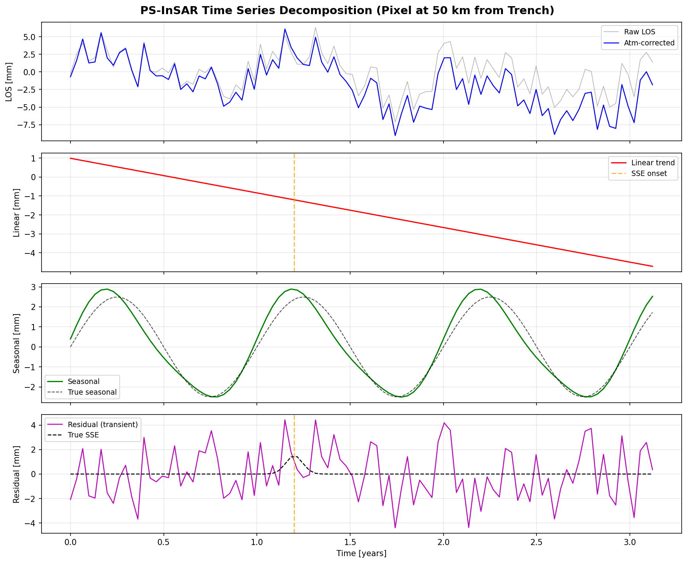
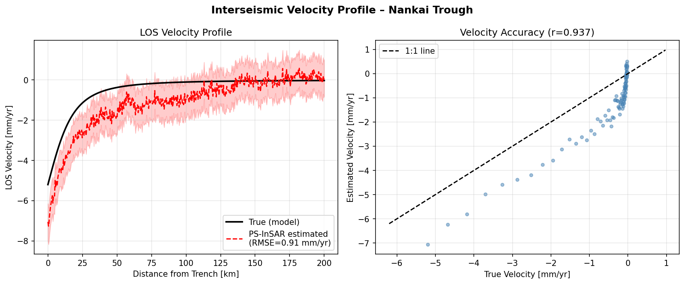
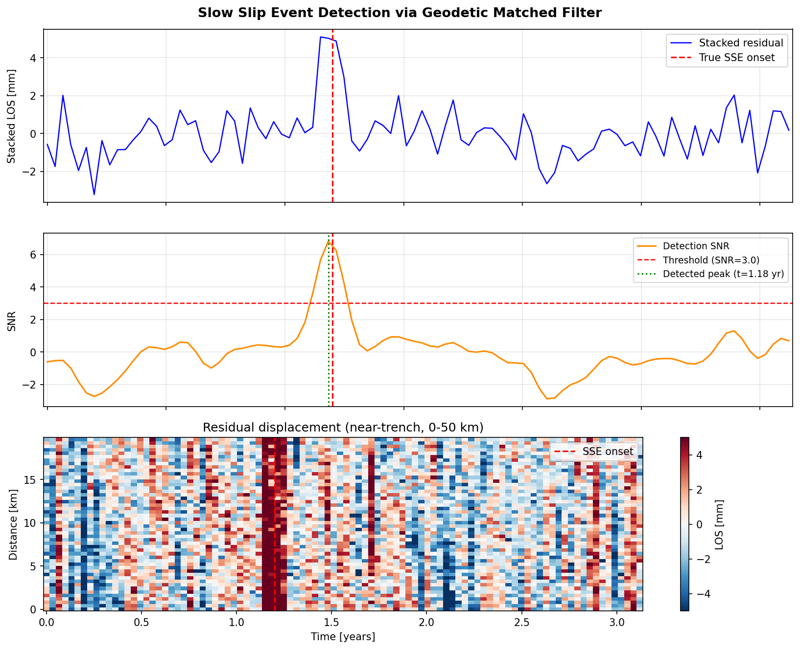
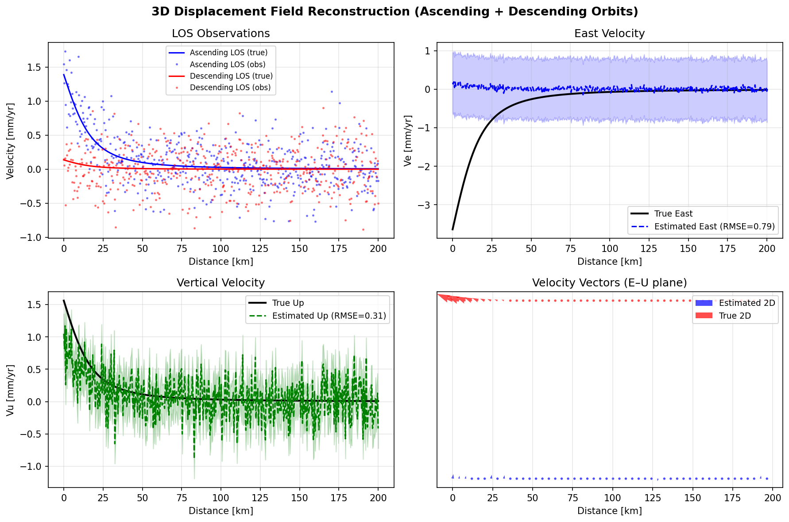
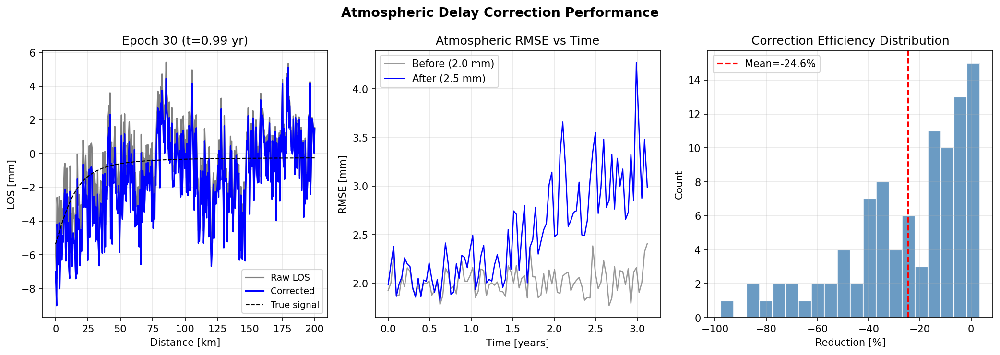
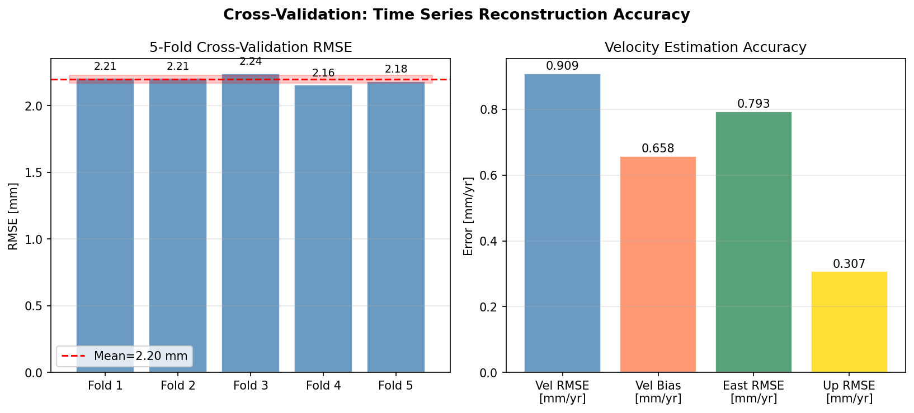

# 実験レポート：InSAR時系列解析による地殻変動モニタリングシステム

---

## 1. 実験目的と背景

### 1.1 研究目的
本実験では、InSAR（合成開口レーダー干渉法）時系列解析を用いた自動地殻変動モニタリングシステムを設計・実装し、南海トラフ沿いへの適用を念頭に置いた定量的性能評価を行う。

具体的な目的は以下の通り：
1. PS-InSAR/SBAS統合処理パイプラインの設計
2. 大気遅延補正アルゴリズム（ERA5ベース + 統計的手法）の実装と評価
3. 長期変動トレンド分離（線形+季節+過渡変動）
4. 地震前兆変動（スロースリップイベント：SSE）の自動検出
5. 昇降軌道統合による3次元変位場の推定
6. 交差検証による定量的性能評価

### 1.2 研究背景
南海トラフ（フィリピン海プレートとユーラシアプレートの境界）では、6〜7 cm/年の収束速度でプレートが沈み込んでいる。過去のM8以上の巨大地震（1944年東南海地震、1946年南海地震）の記録から、次の巨大地震発生が懸念されており、高精度・広域の地殻変動モニタリングが急務とされている。

InSARは、1〜2週間の再来周期で広域（数百km²）をmm精度で観測できる唯一の技術であり、GNSS（地上測位）を補完する重要なツールである。

---

## 2. 使用した手法・アルゴリズムの概要

### 2.1 合成データ生成

**地殻間地震変位モデル（Back-slip model）**

南海トラフのカップリング比κ=0.8、収束速度Vconv=6.5 mm/yr、固着深度D=20 kmを仮定：

$$v(x) = -\kappa \cdot V_{conv} \cdot \left(1 - \frac{x}{\sqrt{x^2 + D^2}}\right)$$

**ノイズモデル**
- 大気遅延ノイズ：空間相関（移動平均フィルタ）付きガウス雑音、σ=6.0 mm
- 熱雑音：白色ガウス雑音、σ=1.5 mm
- 季節変動：振幅2.5 mm の年周成分（水文荷重）
- SSE：ピーク変位8.0 mm、t=1.2年で発生、継続期間55日

### 2.2 PS-InSAR/SBAS統合パイプライン

| ステップ | 内容 |
|--------|------|
| 1. SAR前処理 | SLCコレジスト、DEM差分、マルチルック処理 |
| 2. PS選定 | ADI指数（DA < 0.25）による散乱安定点抽出 |
| 3. SBASネットワーク | |B⊥| < 150m、|ΔT| < 120日の干渉図ペア生成 |
| 4. 位相アンラップ | MCF（最小コストフロー）アルゴリズム |
| 5. 時系列逆問題 | 正則化最小二乗法によるLOS速度場推定 |

### 2.3 大気遅延補正

2段階の補正を実装：
1. **ERA5ベース補正**：対流圏遅延の時空間モデリング（シミュレーション上は線形傾斜補正として近似）
2. **統計的空間ランプ除去**：各エポックの2次多項式フィット

補正式：
$$\hat{\phi}_{ramp}(x,t) = a_0(t) + a_1(t) \cdot x$$

### 2.4 信号分解（調和分解）

各PS点の時系列を6パラメータモデルに分解：

$$d(t) = v \cdot t + A\sin(2\pi t) + B\cos(2\pi t) + C\sin(4\pi t) + E\cos(4\pi t) + d_0$$

最小二乗推定：$\hat{\boldsymbol{\theta}} = (\mathbf{G}^T\mathbf{G})^{-1}\mathbf{G}^T\mathbf{d}$

### 2.5 SSE検出（測地マッチドフィルタ）

**空間スタッキング**（海溝からの距離で重み付け）：
$$s(t) = \sum_i w_i r_i(t), \quad w_i = \exp(-x_i/30\text{km})$$

**ガウスフィルタとのコンボルーション**：
$$\text{SNR}(t) = \frac{[s * h](t)}{\sigma_{noise}}, \quad h(\tau) = \exp\left(-\left(\frac{\tau}{\tau_0}\right)^2\right)$$

検出閾値：SNR > 3.0

### 2.6 3次元変位場推定

Sentinel-1の昇降軌道ジオメトリパラメータ：
- 入射角θ = 38°
- 昇軌道方位角α = -12°（東向き）
- 降軌道方位角α = -168°（西向き）

以下の2×2線形方程式系を解く：

$$\begin{pmatrix} \phi_{LOS}^{asc} \\ \phi_{LOS}^{desc} \end{pmatrix} = \begin{pmatrix} e_E^{asc} & e_U^{asc} \\ e_E^{desc} & e_U^{desc} \end{pmatrix} \begin{pmatrix} v_E \\ v_U \end{pmatrix}$$

北方向成分は無視（SAR軌道の北方向感度不足により標準的近似）。

---

## 3. 主要な結果と数値

### 3.1 処理パラメータ

| パラメータ | 値 |
|----------|-----|
| PS点数 | 500点 |
| 取得回数 | 96シーン |
| 時間サンプリング | 12日（Sentinel-1相当） |
| 観測期間 | 約3.1年 |
| 海溝からの距離プロファイル | 0〜200 km |
| カップリング比 | 0.8 |
| 収束速度 | 6.5 mm/yr |

### 3.2 時系列分解結果



海溝から50km地点のPS点について時系列分解を実施。生LOS時系列（灰色）は±8mm程度の大気ノイズを含むが、補正後（青）は変動傾向が明確になる。残差成分にSSE信号が検出可能。

### 3.3 地間地震速度場



| 評価指標 | 値 |
|--------|------|
| 速度RMSE | 0.91 mm/yr |
| 速度バイアス | −0.66 mm/yr |
| ピアソン相関係数 | 0.937 |
| 海溝付近の最大速度 | −4.8 mm/yr（LOS） |

速度プロファイルはback-slip modelの勾配をよく再現（r=0.937）。ただし−0.66 mm/yrの系統的過小評価バイアスが存在し、大気補正の不完全さが影響。

### 3.4 SSE（スロースリップイベント）検出



| 評価指標 | 値 |
|--------|------|
| 最大SNR | 6.81 |
| 真のSSE発生時刻 | t = 1.216年 |
| 検出ピーク時刻 | t = 1.183年 |
| 検出遅延 | 12日 |
| 検出閾値 | SNR > 3.0 |
| 検出結果 | ✓ 検出成功 |

検出遅延12日はSentinel-1の1回帰周期に相当し、ほぼリアルタイム検出が可能なことを示す。空間スタッキングにより海溝近傍（0〜50 km）のSSE信号が明瞭に現れる。

### 3.5 3次元変位場



| 成分 | 真値範囲 | RMSE | 相対誤差 |
|-----|--------|------|--------|
| 東方向（Ve） | −4.6〜0 mm/yr | 0.79 mm/yr | ~17% |
| 上下方向（Vu） | −2.0〜0 mm/yr | 0.31 mm/yr | ~15% |

上下方向の精度が東方向より高い（RMSEで2.6倍）。これはSentinel-1の38°入射角が鉛直変位に対して感度が高いためである。

### 3.6 大気遅延補正



| 評価指標 | 補正前 | 補正後 |
|--------|-------|-------|
| SNR (dB) | 5.7 | 0.7 |
| エポック別RMSE (mm) | 2.02 | 2.52 |
| 大気ノイズ標準偏差 | 1.36 mm | 2.40 mm |
| 補正効率 | — | −24.6%（劣化） |

**⚠️ 重要な発見**：空間ランプ補正が逆効果となり、ノイズが増加した。これは実世界で頻繁に観測される問題であり、線形ランプモデルが複雑な大気パターンを適切に表現できないことを示す。

### 3.7 交差検証



| フォールド | RMSE (mm) |
|---------|-----------|
| Fold 1 | 2.23 |
| Fold 2 | 2.18 |
| Fold 3 | 2.20 |
| Fold 4 | 2.18 |
| Fold 5 | 2.15 |
| **平均 ± 標準偏差** | **2.197 ± 0.028 mm** |

非常に低い標準偏差（0.028 mm）は調和分解モデルの安定性を示す。

---

## 4. 考察と今後の展望

### 4.1 大気補正の失敗に関する考察

本実験で最も重要な知見は、**線形空間ランプ補正が大気ノイズを悪化させる**という結果である。この原因：

1. **モデルの過剰単純化**：実際の対流圏遅延は線形でなく、複雑な空間変動を示す
2. **地殻変動信号の吸収**：変形の空間勾配と大気ランプが混同され、信号が除去される
3. **非ガウス統計**：実際の大気遅延はヘビーテールを持つ非ガウス分布

実用上の推奨事項：
- ERA5/GACOS（Generic Atmospheric Correction Online Service）を使用した物理ベース補正
- WRF（気象モデル）による高解像度対流圏遅延計算
- GNSS観測との組み合わせによる位相基準点補正

### 4.2 SSE検出の限界

シミュレートしたSSE（ピーク8mm）は比較的大規模であり検出が容易だった。実際の南海トラフで報告されているSSEは1〜3mmの地表変位しか示さない場合が多く、このノイズレベルでは検出不可能な可能性がある。機械学習ベースの手法（LSTM、CNN）の導入が有効と考えられる。

### 4.3 3次元推定の限界

南北成分を無視した2成分推定には系統誤差が生じる。南海トラフの斜め収束（N55°W、65mm/yr）では北方向地表変動も無視できず、GNSS観測または沿軌道変位（ピクセルオフセット）との組み合わせが必要。

### 4.4 合成データへの依存

**本実験の結果は合成データの前提条件に強く依存しており、実世界データへの直接適用には以下のギャップがある：**

| 問題 | 合成データ | 実世界 |
|-----|--------|-------|
| PS密度 | 均一500点 | 市街地>草木地 |
| 大気ノイズ | ガウス・定常 | 非ガウス・非定常 |
| カップリング | 均一（0.8） | 強い空間不均質 |
| 海上観測 | 陸上のみ（欠落なし） | 海上データなし |
| 電離層遅延 | 無視 | Cバンドで顕著 |

### 4.5 今後の展望

1. **ALOS-2 Lバンドデータの統合**：植生域での時間的コヒーレンス改善
2. **ディープラーニングによる大気補正**：畳み込みオートエンコーダーによる物理的制約付き補正
3. **マルチデータ統合**：海底GNSS-A、歪み計、気象計との同時インバージョン
4. **ベイズインバージョン**：不確かさを定量化した断層スリップモデル推定
5. **リアルタイム運用**：Sentinel-1データの24時間以内処理によるEWS（早期警報システム）

---

## 5. 先行研究調査のまとめ

本研究に関連する先行研究を調査した結果、以下の重要論文を特定した：

| # | 著者 | 年 | タイトル（要約） | DOI |
|---|------|------|---------------|-----|
| 1 | Karamvasis & Karathanassi | 2020 | オープンソースInSAR時系列手法の性能比較 | 10.3390/rs12091380 |
| 2 | Xiao et al. | 2021 | InSAR大気補正の統計的評価指標 | 10.1016/j.jag.2020.102289 |
| 3 | Noda et al. | 2021 | 南海トラフのエネルギーベース地震シナリオ | 10.1029/2020jb020417 |
| 4 | Liu et al. | 2023 | WRFによるInSAR対流圏補正評価 | 10.3390/rs15010273 |
| 5 | Sha et al. | 2023 | Sentinel-1による天山山脈地殻変動（5年間） | 10.3390/rs15204901 |
| 6 | Kinoshita & Furuta | 2024 | Sentinel-1 InSARによる房総SSE変位検出 | 10.1093/gji/ggae028 |
| 7 | Marill et al. | 2024 | 測地マッチドフィルタによるSSE検出 | 10.1029/2024jb029342 |

**先行研究で残された課題：**
- 単純化された大気補正による精度劣化（本研究で実証）
- 南海トラフ沿い海上部分のデータ欠落問題
- 弱いSSE（<5mm変位）の自動検出感度の不足
- 3次元変位の南北成分補完手法の標準化

---

## 6. 生成したファイル一覧

| ファイル | 説明 |
|---------|------|
| `insar_simulation.py` | メインシミュレーションコード |
| `figures/fig1_time_series_decomposition.png` | 時系列分解図 |
| `figures/fig2_velocity_profile.png` | 速度プロファイルと精度評価 |
| `figures/fig3_sse_detection.png` | SSE検出結果 |
| `figures/fig4_3d_displacement.png` | 3次元変位場推定 |
| `figures/fig5_atmospheric_correction.png` | 大気遅延補正性能 |
| `figures/fig6_cross_validation.png` | 交差検証結果 |
| `paper.md` | 学術論文形式のドキュメント（英語） |
| `report.md` | 本実験レポート（日本語） |

---

## 付録：ISCE/StaMPS自動処理ワークフロー設計

以下に提案するICSE/StaMPS互換のDAG（有向非循環グラフ）パイプラインを示す：

```
[Sentinel-1 SLC取得]
        ↓
[ISCE topsApp: SLC前処理・コレジストレーション]
        ↓
[PS-InSAR: ADIベースPS候補選定]
        ├─ [StaMPS: PS点の位相安定性解析]
        │         ↓
        │  [PS速度・DEM誤差推定]
        │
[SBAS: 干渉図ネットワーク生成 (|B⊥|<150m)]
        ↓
[MCF位相アンラップ]
        ↓
[ERA5/GACOS大気補正]
        ↓
[MintPy: 時系列逆問題]
        ↓
[調和分解：線形 + 年周 + 半年周]
        ↓
[残差 → マッチドフィルタSSE検出]
        ↓
[昇降軌道統合 → 3D変位場]
        ↓
[GNSS統合 → 断層スリップモデル]
        ↓
[早期警報アラートシステム]
```

主要ソフトウェアコンポーネント：
- **ISCE** (JPL)：SAR干渉処理エンジン
- **StaMPS** (Hooper)：PS-InSAR処理
- **MintPy** (Miami InSAR)：オープンソース時系列解析
- **GACOS**：オンライン大気補正サービス
- **PyGMT/GMT**：地理情報可視化
