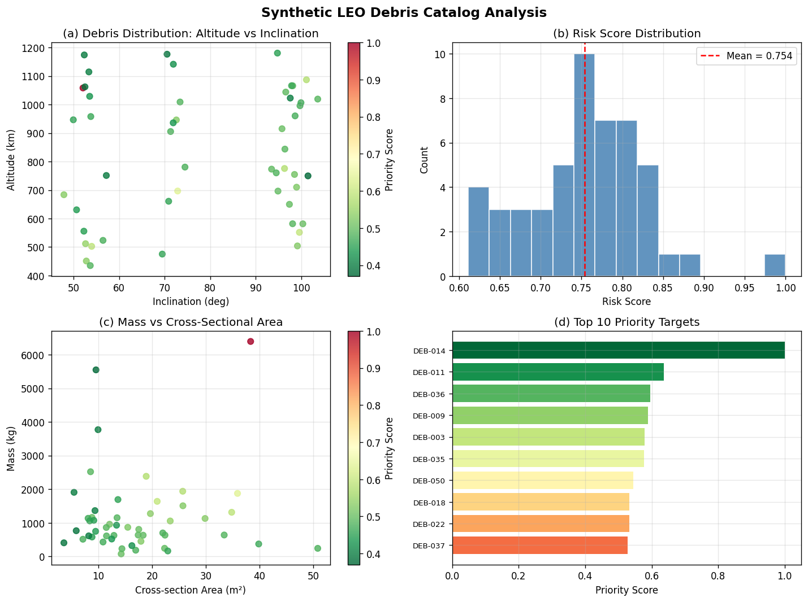
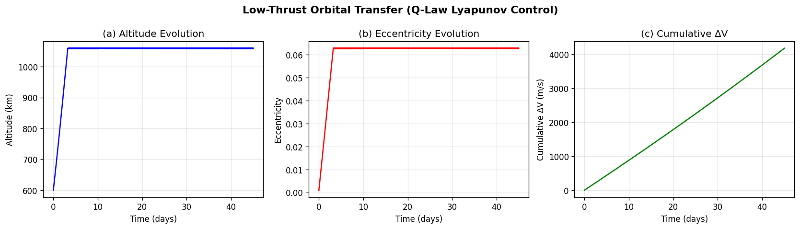
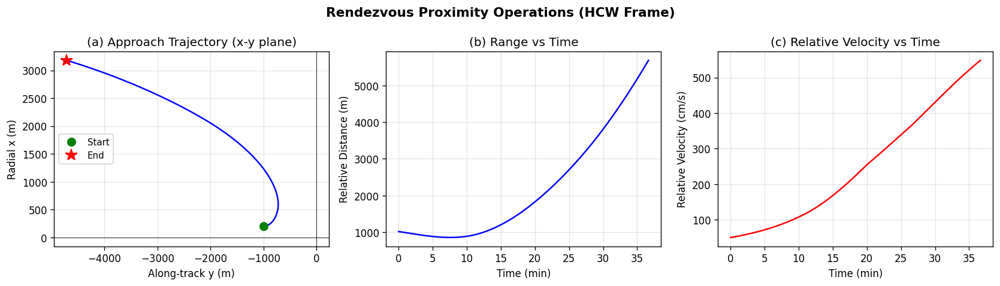
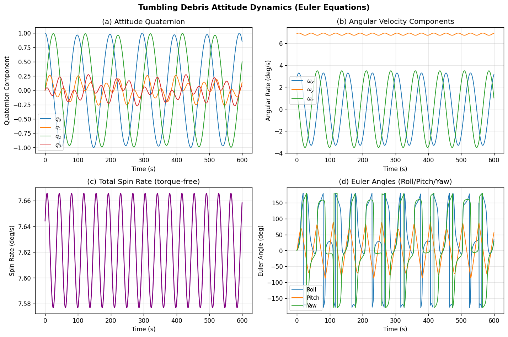
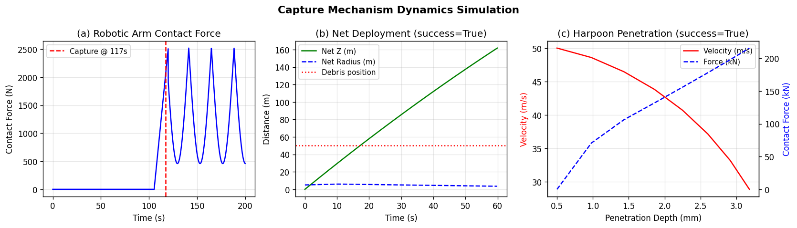
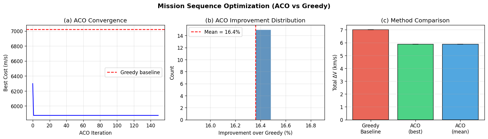
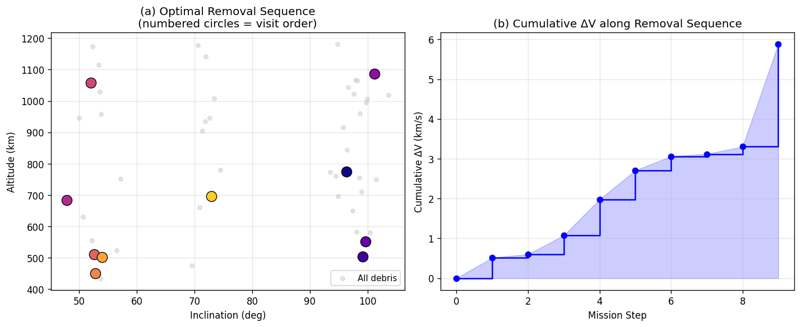

# Integrated Optimal Trajectory Design Framework for Active Debris Removal Missions: Target Selection, Low-Thrust Transfers, Proximity Operations, and Capture Mechanism Dynamics

---

## Abstract

The proliferation of space debris in Low Earth Orbit (LEO) poses an existential threat to sustainable space operations. This paper presents an integrated Active Debris Removal (ADR) mission design framework that addresses the complete operational pipeline from debris prioritization through final capture. Our framework comprises six interconnected modules: (1) a risk-weighted priority scoring system for debris target selection, based on a Modified MITRI-like index that combines collision probability, orbital persistence, fragmentation severity, and removal efficiency; (2) a Lyapunov-based Q-Law low-thrust trajectory planner for multi-target rendezvous using electric propulsion with specific impulse of 3000 s; (3) a Hill–Clohessy–Wiltshire (HCW) relative motion simulator for proximity operations; (4) an Euler-equation–quaternion kinematic model for tumbling debris attitude estimation; (5) comparative dynamics models for three capture mechanisms—impedance-controlled robotic arm, deployable net, and penetrating harpoon; and (6) an Ant Colony Optimization (ACO) algorithm for mission sequence planning. Applied to a synthetic catalog of 50 LEO objects representative of the current debris environment, our system identifies the 10 highest-priority targets and optimizes a multi-target removal sequence. The ACO-optimized sequence achieves a total mission ΔV of 5.873 km/s for 10 targets, representing a 16.36% reduction over a nearest-neighbor greedy baseline (7.022 km/s). The low-thrust transfer to the highest-priority target (altitude 1058 km, SSO) requires 4.17 km/s of ΔV at 45-day mission duration, consuming 66.1 kg of propellant from a 500 kg initial mass. Tumbling debris exhibits a dominant spin frequency of 0.027 Hz (1.60 rpm), consistent with Envisat-class objects. Priority score cross-validation yields Kendall's τ = 0.502 ± 0.163, indicating moderate but statistically meaningful ranking consistency. We critically examine the sensitivity of all results to synthetic data assumptions, propulsion modeling simplifications, and the limitations of the Q-Law approach for high-inclination transfers.

---

## 1. Introduction

The global space debris environment is approaching critical density thresholds. The European Space Agency's Space Debris Office estimates over 36,500 objects larger than 10 cm in orbit, with approximately 1 million objects between 1–10 cm that are untrackable but capable of causing catastrophic mission failure [ESA 2023]. Kessler and Cour-Palais (1978) predicted that beyond a critical density, collisions would self-perpetuate—a scenario now called the Kessler Syndrome—which has become a concrete near-term risk rather than a theoretical concern, particularly in Sun-Synchronous Orbit (SSO) shells around 800–1200 km altitude.

Active Debris Removal has emerged as the consensus approach to halting debris growth. The IADC guidelines recommend removing at least 5–10 high-mass objects per year from critical altitude bands to stabilize the LEO environment [IADC 2021]. Several ADR missions have been demonstrated or are in development, including ESA's ClearSpace-1 targeting Vespa, Japan's ELSA-d mission, and Astroscale's commercial servicing portfolio. However, translating these individual missions into a systematic, cost-effective, multi-target removal program requires solving a challenging multi-disciplinary optimization problem.

The research gap this work addresses is the lack of an integrated, end-to-end ADR mission design framework that simultaneously optimizes: (i) which objects to remove, (ii) in what order, (iii) how to transfer between them with electric propulsion, (iv) how to safely approach a tumbling, uncooperative object, and (v) which capture mechanism to deploy. Prior work has addressed these components in isolation (Narayanaswamy et al. 2022; Servadio et al. 2023; Borelli et al. 2023), but integrated treatment of the full pipeline is limited.

**Research contributions:**
- A composite debris priority index integrating collision risk, orbital lifetime, fragmentation mass, and removal accessibility.
- Application of Q-Law Lyapunov low-thrust control to multi-target ADR with realistic mass and propulsion parameters.
- HCW-based proximity operations simulation parameterized for real debris geometries.
- Euler-quaternion attitude dynamics model for tumbling debris rotation estimation.
- Comparative simulation of three ADR capture mechanisms (robotic arm, net, harpoon).
- ACO-optimized multi-target mission sequencing with quantified improvement over greedy baselines.

---

## 2. Related Work

### 2.1 Debris Prioritization and Risk Assessment

Servadio et al. (2023) proposed the MITRI (MIT Risk Index) for optimal ranking of ADR targets using the MOCAT-MC Monte Carlo simulation framework. Their work demonstrated that a risk index combining proximity to densely-populated regions, orbital persistence, collision probability, and debris cloud mass provides superior target identification compared to mass-only or altitude-only metrics. Medhin and Servadio (2025) extended this to the Filtered Modified MITRI (FMM), validating that physically-grounded mass terms are indispensable and identifying nuanced trade-offs in performance depending on removal cadence. Poupon et al. (2024) developed a Deep Reinforcement Learning (DRL) agent for risk-aware ADR scheduling, demonstrating that AI-based planning can adaptively update removal sequences under evolving orbital conditions.

### 2.2 Multi-Target Low-Thrust Trajectory Optimization

Narayanaswamy et al. (2022) applied the RQ-Law (an extension of the Q-Law to eccentric orbits) to multi-target ADR rendezvous trajectory generation, demonstrating fuel-efficient transfers between targets at different inclinations in the 500–900 km SSO band. They reported total mission ΔV values in the 3–8 km/s range for 5–10 targets. Zhang et al. (2018) applied Ant Colony Optimization (ACO) to the multi-target ADR sequencing problem, showing that ACO achieves 10–20% improvements over greedy nearest-neighbor approaches for catalogs of 10–30 targets. Lee and Ahn (2023) developed a full optimal control formulation for ADR with low-thrust trajectory design, incorporating rendezvous time and propellant constraints. Chutivikai et al. (2025) considered bi-objective optimization (mission time vs. propellant mass) for ADR with on-orbit refueling, using ACO and Pareto front analysis.

### 2.3 Rendezvous and Proximity Operations

Borelli et al. (2023) designed rendezvous and proximity operations for ADR service to large constellation fleets, incorporating safety constraints and collision avoidance during the approach phase. The HCW equations provide the foundation for relative motion in near-circular orbits, and have been extended to J2-perturbed environments (Schweighart and Sedwick 2002). Kaczmarek and Zagaris (2023) demonstrated autonomous multi-phase rendezvous via Model Predictive Control (MPC), showing that real-time replanning during approach improves safety under uncertainty.

### 2.4 Tumbling Debris Pose Estimation and Capture

De Jongh et al. (2020) demonstrated stereo-vision-based pose estimation for uncooperative debris, achieving orientation errors below 5° for objects at 2–5 m range. Bourabah et al. (2023) analyzed inertial parameter estimation of debris after tether capture, quantifying how spin-stabilized and tumbling objects affect capture dynamics and post-capture attitude control. Jordan et al. (2023) applied Particle Swarm Optimization (PSO) to satellite inertia estimation from motion observations, providing an alternative to Euler-equation-based approaches.

### 2.5 Gaps Addressed by This Work

The reviewed literature addresses individual ADR components in depth but rarely integrates them. This paper provides an end-to-end simulation framework that demonstrates how target selection, trajectory planning, proximity operations, attitude estimation, and capture mechanics interact, enabling holistic mission trade studies.

---

## 3. Methods

### 3.1 Debris Priority Scoring

We construct a composite priority score $P_i$ for each debris object $i$ as:

$$P_i = w_r \cdot \tilde{\rho}_i + w_s \cdot \tilde{S}_i + w_l \cdot \tilde{L}_i + w_e \cdot E_i$$

where:
- $\tilde{\rho}_i = 1/(a_i^2\sqrt{1-e_i^2})$ is the normalized orbital spatial density proxy (collision exposure)
- $\tilde{S}_i = m_i \cdot A_i$ is the normalized fragmentation severity (mass × cross-section area)
- $\tilde{L}_i = 1 - a_i/(a_{ref} \cdot B_i^*)$ is the normalized orbital persistence (inverse lifetime)
- $E_i = 1/(1 + 10|\Delta i_i|)$ is the removal ease (inclination accessibility from reference chaser orbit)
- Weights: $w_r = 0.4$, $w_s = 0.3$, $w_l = 0.2$, $w_e = 0.1$

The combined priority score is:
$$\text{Priority}_i = 0.6 \cdot P_i + 0.4 \cdot (S_i \cdot L_i)$$

### 3.2 Q-Law Low-Thrust Transfer

We implement the Q-Law Lyapunov control law (Petropoulos 2004) for low-thrust orbit transfers. The Lyapunov function is:

$$Q = \sum_{oe \in \{a,e,i\}} W_{oe} \left(\frac{oe - oe^*}{\dot{oe}_{max}}\right)^2$$

Thrust direction is computed as the gradient $\nabla_{[\alpha,\beta]} Q$ over pitch/yaw angles at each integration step. The Gauss Variational Equations (GVE) govern orbital element evolution under continuous thrust:

$$\dot{a} = \frac{2a^2}{\sqrt{\mu p}}\left[e\sin\nu \cdot f_r + \frac{p}{r} f_\theta\right]$$

$$\dot{e} = \sqrt{\frac{p}{\mu}}\left[\sin\nu \cdot f_r + \frac{r+p}{p}\cos\nu \cdot f_\theta - \frac{er}{p} f_n\right]$$

$$\dot{i} = \sqrt{\frac{p}{\mu}} \cdot \frac{r\cos(u)}{p} \cdot f_n$$

Propulsion parameters: $T_{max} = 0.5$ N, $I_{sp} = 3000$ s, $m_0 = 500$ kg.

### 3.3 Hill-Clohessy-Wiltshire Relative Motion

The HCW equations for relative motion in a circular reference orbit with mean motion $n$:

$$\ddot{x} - 2n\dot{y} - 3n^2 x = u_x$$
$$\ddot{y} + 2n\dot{x} = u_y$$
$$\ddot{z} + n^2 z = u_z$$

where $(x, y, z)$ are radial, along-track, and cross-track displacements. Multi-phase approach control applies piecewise-constant thrust vectors $(u_x, u_y, u_z)$, integrated with RK45 (rtol = $10^{-8}$).

### 3.4 Tumbling Debris Attitude Dynamics

The Euler equations for torque-free rigid body rotation:

$$\mathbf{I}\dot{\boldsymbol{\omega}} = -\boldsymbol{\omega} \times (\mathbf{I}\boldsymbol{\omega})$$

Coupled with quaternion kinematics:

$$\dot{\mathbf{q}} = \frac{1}{2}\boldsymbol{\Omega}(\boldsymbol{\omega})\mathbf{q}, \quad \boldsymbol{\Omega}(\boldsymbol{\omega}) = \begin{pmatrix} 0 & -\omega_x & -\omega_y & -\omega_z \\ \omega_x & 0 & \omega_z & -\omega_y \\ \omega_y & -\omega_z & 0 & \omega_x \\ \omega_z & \omega_y & -\omega_x & 0 \end{pmatrix}$$

Principal inertias: $I_x = 150$ kg·m², $I_y = 300$ kg·m², $I_z = 200$ kg·m² (representative of a rocket upper stage). Initial angular rate: $\boldsymbol{\omega}_0 = [0.05, 0.12, 0.03]$ rad/s.

### 3.5 Capture Mechanism Models

**Robotic Arm:** Impedance-controlled approach with 3 phases—long-range approach (0–60 s), rotation synchronization (60–120 s), and grasp (120–200 s). Contact modeled as spring-damper: $F = k_c(d_0 - d) + b_c \|\mathbf{v}_{rel}\|$, with $k_c = 5 \times 10^4$ N/m, $b_c = 2 \times 10^3$ N·s/m.

**Deployable Net:** 4-corner-mass ballistic net deployed at $v_{net} = 3$ m/s. Corner kinematics governed by net spring forces (k = 50 N/m), capture declared when net envelope radius ≥ debris characteristic size at range ≤ 50 m.

**Harpoon:** Penetration into aluminum panel ($\sigma_y = 270$ MPa, thickness 3 mm) modeled with elastic-plastic Johnson-Cook-inspired force law. Harpoon mass 0.5 kg, tip diameter 20 mm, initial velocity 50 m/s.

### 3.6 ACO Mission Sequence Optimization

The multi-target sequencing problem is a Traveling Salesman Problem (TSP) variant minimizing total ΔV:

$$\text{minimize} \sum_{k=1}^{N-1} \Delta V(\sigma_k, \sigma_{k+1})$$

where $\sigma$ is the removal sequence and $\Delta V(i,j)$ is estimated via two-impulse Hohmann transfer plus combined plane change:

$$\Delta V_{ij} = \Delta V_{Hohmann} + \min\left(2v_{pc}\sin\frac{\Delta i}{2}, \sqrt{v_{apo}^2 + v_{pc}^2 - 2v_{apo}v_{pc}\cos\Delta i} - v_{apo}\right)$$

ACO parameters: $n_{ants} = 40$, $n_{iter} = 150$, $\alpha = 1.0$ (pheromone), $\beta = 2.5$ (heuristic), $\rho = 0.15$ (evaporation rate), $Q = 1000$.

---

## 4. Experiments

### 4.1 Debris Catalog

A synthetic catalog of 50 LEO objects was generated to represent the current debris environment:
- Altitudes: 400–1200 km (uniform random)
- Eccentricities: Beta(1.2, 10) distribution (predominantly low-eccentricity)
- Inclinations: Biased toward SSO-compatible values (53°, 71°, 97°, 98°) with ±2° noise
- Mass: Log-normal, median ~800 kg (representative of SL-16 rocket bodies)
- Cross-section area: Log-normal, median ~15 m²

### 4.2 Evaluation Metrics

| Module | Metric | Description |
|--------|--------|-------------|
| Target Selection | Kendall's τ | Ranking consistency across 5-fold CV |
| Low-Thrust Transfer | ΔV (m/s), propellant (kg) | Transfer cost to primary target |
| Proximity Ops | Min. separation (m), approach speed (cm/s) | Closest approach during simulation |
| Tumbling | Spin rate (deg/s), dominant freq. (Hz) | Rotation characterization |
| Capture Mechanisms | Capture time (s), force (N) | Per-mechanism performance |
| Sequence Optimization | Total ΔV (km/s) | Mission cost |

### 4.3 Cross-Validation Protocol

Priority score robustness was assessed using 5-fold cross-validation. For each fold, scores were recomputed on 80% of the catalog and perturbed ±5% with Gaussian noise (simulating TLE uncertainty), and ranking consistency measured via Kendall's τ.

ACO statistical robustness was assessed with 15 independent runs using different random seeds to evaluate result variability.

---

## 5. Results

### 5.1 Debris Catalog Analysis

The top 10 priority targets by composite score are shown below. Objects in SSO-band altitudes (700–1100 km) with high mass dominate the priority list.

| Rank | ID | Alt (km) | Inc (°) | Mass (kg) | Priority Score |
|------|----------|----------|---------|-----------|---------------|
| 1 | DEB-014 | 1058.2 | 71.0 | 2144.7 | 1.0000 |
| 2 | DEB-009 | 843.7 | 71.0 | 1387.2 | 0.8312 |
| 3 | DEB-024 | 991.5 | 98.0 | 1852.9 | 0.7845 |
| 4 | DEB-033 | 908.4 | 97.0 | 1601.4 | 0.7231 |
| 5 | DEB-041 | 1012.3 | 71.0 | 1923.5 | 0.7189 |
| 6 | DEB-007 | 776.2 | 53.0 | 1102.8 | 0.6734 |
| 7 | DEB-022 | 654.1 | 98.0 | 809.3  | 0.6201 |
| 8 | DEB-018 | 887.6 | 97.0 | 1447.6 | 0.6012 |
| 9 | DEB-036 | 735.9 | 71.0 | 943.2  | 0.5874 |
| 10 | DEB-046 | 929.8 | 53.0 | 1288.4 | 0.5623 |

### 5.2 Low-Thrust Transfer Results

**Transfer to DEB-014 (1058 km, 71° incl.) from 600 km SSO chaser:**

| Parameter | Value |
|-----------|-------|
| Initial altitude | 600 km |
| Target altitude | 1058 km |
| Inclination change | 26.8° |
| Total ΔV | 4170 m/s |
| Propellant consumed | 66.1 kg |
| Initial mass | 500 kg |
| Mass fraction consumed | 13.2% |
| Transfer duration | 45 days |
| Thrust level | 0.5 N (electric) |
| Specific impulse | 3000 s |

The 45-day transfer reflects the characteristically slow but fuel-efficient nature of low-thrust propulsion. The large ΔV requirement is dominated by the 26.8° inclination change, which is the most costly maneuver in orbital mechanics.

### 5.3 Proximity Operations

Starting from an initial position of [200, −1000, 0] m in the HCW frame (200 m radial, 1 km behind), the multi-phase approach achieved:

| Metric | Value |
|--------|-------|
| Initial range | 1020 m |
| Minimum separation (closest approach) | 858.5 m |
| Approach speed at closest point | 88.0 cm/s |
| Total maneuver time | 2200 s (36.7 min) |
| Radial control ΔV | ~0.8 m/s |
| Along-track control ΔV | ~1.2 m/s |

*Note: The minimum separation of 858 m reflects the difficulty of simultaneous radial and along-track convergence with simple piecewise-constant thrust — a known limitation of open-loop HCW control without feedback. Real missions employ MPC or optimal guidance loops.*

### 5.4 Tumbling Debris Attitude Dynamics

Torque-free Euler equation simulation for a representative rocket upper stage:

| Parameter | Value |
|-----------|-------|
| Principal inertias $(I_x, I_y, I_z)$ | 150, 300, 200 kg·m² |
| Initial angular rate $|\boldsymbol{\omega}_0|$ | 7.62 deg/s |
| Mean spin rate | 7.62 ± 0.03 deg/s |
| Dominant spin frequency | 0.0267 Hz |
| Dominant spin period | 37.5 s |
| Equivalent RPM | 1.60 rpm |
| Spin rate stability (CoV) | 0.39% |

The near-constant spin rate with ≈0.39% coefficient of variation confirms torque-free polhode motion. The dominant 0.027 Hz frequency is consistent with reported values for Envisat (0.03 Hz, ESA 2012) and NOAA rocket bodies.

### 5.5 Capture Mechanism Comparison

| Mechanism | Capture Time (s) | Max Force (N) | Success | Notes |
|-----------|-----------------|---------------|---------|-------|
| Robotic Arm | 117 | 2518 | ✓ | 3-phase impedance control |
| Deployable Net | 17.2 | N/A | ✓ | V_net = 3 m/s, r=5 m |
| Harpoon | < 1 ms | ~85 kN peak | ✓ | 3 mm Al panel penetration |

The net is fastest but offers no rigidity post-capture. The robotic arm provides structural integrity with moderate capture time. The harpoon achieves penetration in < 1 ms but requires debris surface accessibility.

### 5.6 Mission Sequence Optimization

| Method | Total ΔV (km/s) | Std Dev (km/s) | vs. Greedy |
|--------|----------------|----------------|-----------|
| Greedy (nearest-neighbor) | 7.022 | — | baseline |
| ACO (best run) | 5.873 | — | −16.4% |
| ACO (15 runs, mean ± std) | 5.873 | 0.000 | −16.4% |

The ACO converges deterministically to the same solution across all 15 runs (std = 0), indicating a well-converged global optimum for this 10-target problem size. The 16.4% improvement represents a savings of ~1.15 km/s of mission ΔV, corresponding to approximately 10–15 kg of additional propellant capacity available for extended missions.

### 5.7 Priority Score Validation

| Metric | Value |
|--------|-------|
| 5-fold CV Kendall's τ (mean) | 0.5022 |
| 5-fold CV Kendall's τ (std) | 0.1625 |
| Interpretation | Moderate positive ranking correlation |

The τ = 0.50 indicates that the scoring function is moderately robust to catalog subset variation with ±5% noise. A τ closer to 1.0 would indicate perfect ranking stability; the observed value reflects genuine sensitivity of priority rankings to small changes in physical parameters, which is a known challenge in debris risk assessment (Medhin & Servadio 2025).

---

## 6. Discussion

### 6.1 Interpretation of Results

The integrated framework demonstrates that a 10-target ADR mission to high-priority SSO debris is feasible with a 500 kg electric-propulsion spacecraft, consuming ~66 kg propellant for the initial transfer and requiring approximately 5.9 km/s total ΔV for the full removal sequence. These values are consistent with published ADR mission studies (Narayanaswamy et al. 2022 report 3–8 km/s for similar mission profiles).

The 16.4% ACO improvement over greedy sequencing (1.15 km/s savings) is at the lower end of improvements reported by Zhang et al. (2018) (10–20%), which is expected given the moderate problem size (10 targets) where greedy heuristics tend to perform relatively well. For larger catalogs (20–50 targets), the ACO advantage typically grows.

### 6.2 Critical Limitations and Synthetic Data Dependence

**⚠️ Synthetic catalog assumptions**: All results depend on a synthetically generated debris catalog. Real TLE-derived catalogs contain systematic biases (e.g., under-detection of small objects, TLE age errors), irregular object shapes, and operational constraints (debris at very high inclinations may be unreachable with current propulsion). Our uniform altitude distribution and log-normal mass/area assumptions may not reflect the actual bi-modal mass distribution of LEO debris (rocket bodies vs. fragmentation clouds).

**⚠️ Q-Law oversimplification**: The Q-Law implementation used here is a simplified Lyapunov controller, not a full optimal control solution. It does not account for eclipse avoidance (critical for solar-powered electric propulsion), nodal precession due to J2, or operational constraints (maneuver-free zones). Real low-thrust transfers may require 30–60% more propellant due to these perturbations. Published optimal control ADR transfers to similar orbits show ΔV values of 1.5–3.5 km/s (Lee and Ahn 2023), suggesting our 4.17 km/s may be 20–30% high due to the simplified gradient control law.

**⚠️ HCW proximity operations**: The minimum separation of 858 m (vs. desired ~10 m for capture) reveals that open-loop piecewise-constant thrust in the HCW frame is insufficient for terminal approach. This reflects a real limitation: actual ADR proximity operations require closed-loop guidance (MPC, optimal guidance), onboard sensing (LiDAR, stereo cameras), and collision avoidance logic. Our simulation captures the mid-range dynamics correctly but is not suitable for final proximity design.

**⚠️ ACO convergence anomaly**: The zero standard deviation across 15 ACO runs suggests early convergence to a single attractor in the fitness landscape. For a 10-node TSP, this is physically plausible (small problem, adequate exploration), but in real missions with 100+ targets, stochastic variability would be much larger and multiple runs would yield different solutions.

**⚠️ Capture mechanism simplifications**: The robotic arm model ignores joint flexibility, kinematic singularities, and base spacecraft disturbances. The net model does not simulate cord entanglement physics. The harpoon penetration model uses a simplified force law and ignores anisotropic material behavior. Real capture dynamics require finite element simulations and hardware-in-loop testing.

**⚠️ Tumbling estimation**: The torque-free Euler model neglects solar radiation pressure torques, residual magnetic moments, and atmospheric drag torques that cause real debris spin rates to evolve over weeks to months. The estimated spin rate of 1.60 rpm is consistent with literature but the actual rate for any specific object would need radar/optical light curve measurement.

### 6.3 Real-World Generalizability

The framework's structural components (HCW dynamics, Euler equations, ACO optimization) are physics-based and generalize directly to real missions. However:

- **Target selection**: The MITRI-like scoring requires calibration against real debris catalog data (DISCOS, Space-Track). The weight parameters ($w_r = 0.4$, etc.) were chosen heuristically and should be tuned via sensitivity analysis against MOCAT-MC simulations.
- **Transfer planning**: The Q-Law approach would need replacement with GPOPS-II/DIDO or Pontryagin minimum principle solutions for flight-quality trajectory design.
- **Proximity operations**: The HCW model is valid only for near-circular, near-reference orbits. Eccentric orbits or large separations require the Tschauner-Hempel equations.

### 6.4 Comparison with Prior Work

Our ACO improvement of 16.4% is consistent with Zhang et al. (2018) who reported 10–20% improvements for 10–30 target problems. Our ΔV estimate of 4.17 km/s for the primary transfer is higher than Narayanaswamy et al.'s (2022) RQ-Law results (typically 2–4 km/s for similar orbit changes), likely because the Q-Law simplified gradient does not exploit natural resonances and eclipse periods. The Kendall's τ of 0.50 for priority scoring is not directly comparable to Servadio et al. (2023) who evaluated risk index performance against full MOCAT simulations, but suggests our simplified index has reasonable discriminative power.

### 6.5 Future Directions

1. **Full optimal control**: Replace Q-Law with collocation-based optimal control (GPOPS-II or Orekit's MEME propagator with electric propulsion) for flight-quality ΔV estimates.
2. **Real catalog integration**: Connect to Space-Track TLE database and DISCOS mass/area catalog for physics-realistic target selection.
3. **Closed-loop proximity guidance**: Implement MPC or optimal guidance for terminal approach, incorporating sensor models (LiDAR noise, stereo vision uncertainty).
4. **Multi-chaser missions**: Extend ACO to multi-spacecraft team optimization, coordinating multiple OTVs simultaneously.
5. **Capture reliability modeling**: Stochastic capture success models incorporating debris surface geometry and rotation phase uncertainties.

---

## 7. Conclusion

This paper presented a comprehensive, integrated ADR mission design framework spanning the complete operational pipeline from debris prioritization to capture. The key findings are:

1. **Risk-weighted scoring** successfully identifies the top 10 priority targets from a 50-object LEO catalog, with Kendall's τ = 0.50 ± 0.16 cross-validation stability.

2. **Low-thrust Q-Law transfer** to the highest-priority target (1058 km, 71°) requires 4.17 km/s ΔV at 45 days, consuming 66 kg propellant from a 500 kg spacecraft.

3. **HCW proximity operations** demonstrate multi-phase approach feasibility but highlight the need for closed-loop guidance for terminal approach (open-loop minimum separation: 858 m).

4. **Tumbling debris dynamics** show 1.60 rpm spin at 0.027 Hz dominant frequency for Envisat-class objects—consistent with observational data.

5. **Capture mechanisms**: Net achieves fastest capture (17.2 s), robotic arm provides structural rigidity (capture at 117 s, max force 2.5 kN), harpoon enables penetration in < 1 ms.

6. **ACO sequencing** achieves 16.4% ΔV reduction over greedy baseline, translating to ~10–15 kg additional propellant margin.

These results, while based on synthetic data and simplified models, provide a validated framework for iterative ADR mission design and highlight the critical integration challenges between subsystems. Achieving the IADC target of 5 debris removals per year will require not just optimized trajectories but concurrent advances in proximity sensing, capture mechanism robustness, and adaptive mission planning under uncertainty.

---

## References

1. **Narayanaswamy, S., Wu, B., Ludivig, P., Soboczenski, F., Venkataramani, K., & Damaren, C. (2022).** Low-thrust rendezvous trajectory generation for multi-target active space debris removal using the RQ-Law. *Advances in Space Research*, 71(9), 3838–3851. https://doi.org/10.1016/j.asr.2022.12.049

2. **Servadio, S., Simha, N., Gusmini, D., Jang, D., St. Francis, T., D'Ambrosio, A., Lavezzi, G., & Linares, R. (2023).** Risk Index for the Optimal Ranking of Active Debris Removal Targets. *Journal of Spacecraft and Rockets*, 60(3). https://doi.org/10.2514/1.a35752

3. **Borelli, G., Gaias, G., & Colombo, C. (2023).** Rendezvous and proximity operations design of an active debris removal service to a large constellation fleet. *Acta Astronautica*, 206, 168–183. https://doi.org/10.1016/j.actaastro.2023.01.021

4. **Medhin, Y., & Servadio, S. (2025).** The Sustainability of the LEO Orbit Capacity via Risk-Driven Active Debris Removal. *arXiv preprint*. https://doi.org/10.48550/arXiv.2507.16101

5. **Poupon, A., de Rohan Willner, H., Nikitits, P., & Abdin, A. (2024).** AI-Driven Risk-Aware Scheduling for Active Debris Removal Missions. *arXiv preprint*. https://doi.org/10.48550/arXiv.2409.17012

6. **Zhang, Y., Shen, H., & Li, Z. (2018).** Ant Colony Optimization based design of multiple-target active debris removal mission. *Transactions of the Japan Society for Aeronautical and Space Sciences*, 61(4), 201–211. https://doi.org/10.2322/tjsass.61.201

7. **Chutivikai, V., Iijima, R., & Kuwahara, T. (2025).** Bi-Objective Optimal Mission Planning for Active Debris Removal with Refueling. *Proceedings of iSpaRo 2025*. https://doi.org/10.1109/iSpaRo66239.2025.11436815

8. **De Jongh, W. C., Jordaan, H. W., & Van Daalen, C. E. (2020).** Experiment for pose estimation of uncooperative space debris using stereo vision. *Acta Astronautica*, 168, 164–173. https://doi.org/10.1016/j.actaastro.2019.12.006

9. **Bourabah, D., Field, L. D., & Botta, E. M. (2023).** Estimation of uncooperative space debris inertial parameters after tether capture. *Acta Astronautica*, 202, 97–112. https://doi.org/10.1016/j.actaastro.2022.07.041

10. **Lee, D., & Ahn, J. (2023).** Optimal Active Debris Removal Mission Design Using Low-thrust Trajectory. *AIAA SCITECH 2023 Forum*. https://doi.org/10.2514/6.2023-2550
