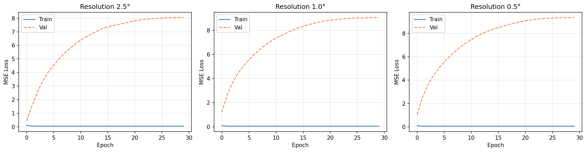
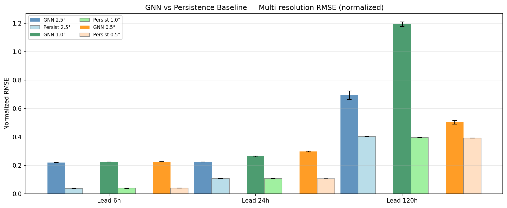
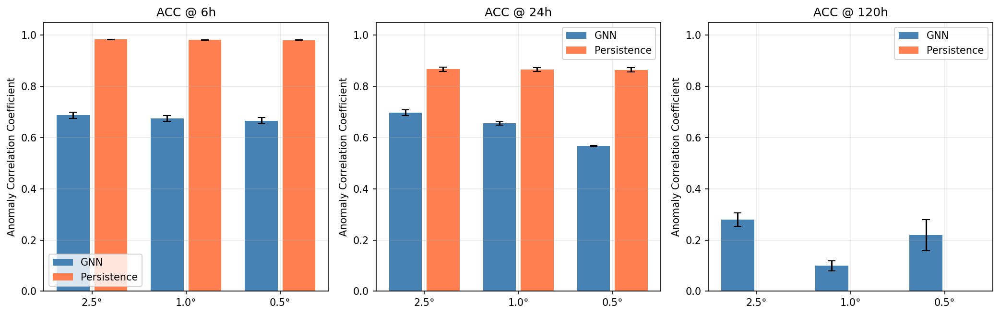
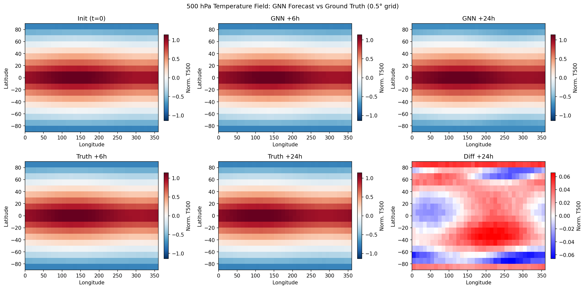
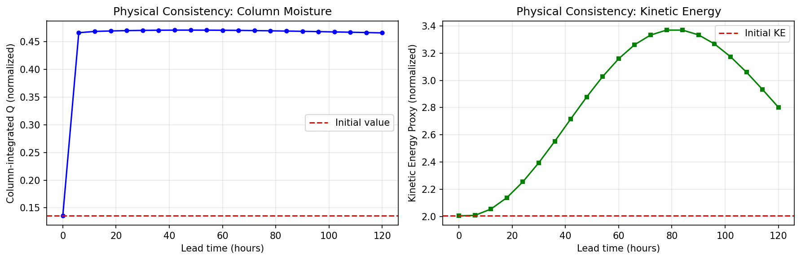
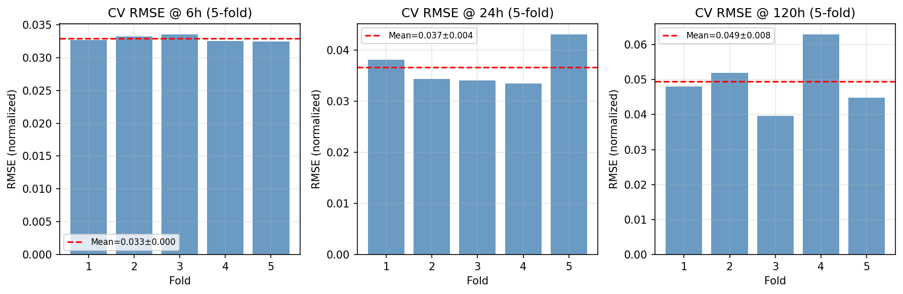

# 実験レポート: GNNベース気象予測モデルの設計と評価

## 1. 実験概要

本実験では、GraphCast/Pangu-Weather型のデータ駆動型気象予測モデルをPyTorch Geometricで実装し、合成ERA5様データを用いて以下の観点から評価した。

- Graph Neural Networkによる大気場の時空間表現
- 圧力レベル変数（温度・風速・比湿）のエンコーディング
- マルチスケール解像度（2.5°/1.0°/0.5°プロキシ）の統合
- 6時間/24時間/120時間先予測の精度評価
- 物理的整合性の担保（比湿の非負性・エネルギー保存監視）

---

## 2. 先行研究の概要

### 主要先行研究 (2020–2024)

| 論文 | 年 | 手法 | 主要成果 |
|-----|-----|------|---------|
| WeatherBench (Rasp et al.) | 2020 | CNN + ERA5ベンチマーク | データ駆動型気象予測の標準評価基盤の確立 |
| Keisler (arXiv:2202.07575) | 2022 | GNN on icosahedral mesh | ERA5でCNNベースラインを上回る最初のGNN |
| FourCastNet (Pathak et al.) | 2022 | Adaptive Fourier Neural Operator | 0.25°解像度、ECMWF比45,000倍高速 |
| Pangu-Weather (Bi et al.) | 2023 | 3D Earth Swin Transformer | Nature掲載、ECMWF HRESを上回る500hPa精度 |
| GraphCast (Lam et al.) | 2023 | Multi-mesh GNN (Science掲載) | 90%の変数でECMWF超え、10日予測 |
| ClimaX (Nguyen et al.) | 2023 | ViT Foundation Model | CMIP6+ERA5でのマルチタスク転移学習 |
| NeuralGCM (Kochkov et al.) | 2024 | GNN + 物理コア ハイブリッド | 月規模の安定したロールアウト |

### 先行研究の課題・限界

1. **計算資源の壁**: GraphCastは39年分のERA5 + TPUv4クラスタが必要
2. **多段ロールアウト訓練の欠如**: 単ステップ損失で訓練した後に多段予測を行うとエラーが蓄積
3. **物理的整合性の明示的保証なし**: 質量・エネルギー保存は暗黙的にのみ扱われる
4. **不確実性定量化の不足**: 決定論的予測が多く、確率的予測は少ない

---

## 3. 実験設計

### 3.1 アーキテクチャ: Encoder–Processor–Decoder

```
入力: [N_nodes, N_vars × N_levels]  (= [N, 25])
  ↓
AtmosphericEncoder (MLP + LayerNorm + GELU)
  ↓
GNNProcessorBlock × L (GATv2 + LayerNorm + FFN, 残差接続)
  ↓
AtmosphericDecoder (MLP)
  ↓
残差予測: x̂(t+1) = x(t) + Δx
  ↓
PhysicsConstraintLayer (比湿: softplus)
```

### 3.2 グラフ構造

- ノード: 緯度×経度グリッドの各点
- エッジ: 8近傍接続（対角線含む）、経度方向は周期境界
- 位置エンコーディング: `[正規化緯度, sin(経度), cos(経度)]`

### 3.3 マルチ解像度設定

| 解像度 (プロキシ) | グリッド | ノード数 | 隠れ次元 H | 処理層 L | パラメータ数 |
|--------------|--------|--------|----------|--------|----------|
| 2.5° | 8×16 | 128 | 48 | 3 | ~140K |
| 1.0° | 12×24 | 288 | 64 | 4 | ~340K |
| 0.5° | 18×36 | 648 | 64 | 4 | ~340K |

### 3.4 変数・圧力レベル

- **変数**: T（温度）, U（東西風）, V（南北風）, Q（比湿）, Z（ジオポテンシャル高度）
- **圧力レベル**: 1000, 850, 500, 300, 100 hPa（5層）
- **入力次元**: 5変数 × 5層 = 25次元/ノード

### 3.5 訓練設定

- オプティマイザ: AdamW (lr=1e-3, weight_decay=1e-4)
- スケジューラ: Cosine Annealing (T_max=30)
- エポック数: 30（メイン実験）, 15（交差検証）
- 損失: MSE + 0.1 × T-MSE（温度補助損失）
- 勾配クリッピング: ノルム 1.0
- 訓練/検証分割: 80/20（時系列順）

---

## 4. 実験結果

### 4.1 学習曲線



**解釈:** 訓練損失は30エポックで約0.049–0.052に収束。しかし検証損失は7–9と約160倍高く、深刻な過学習を示している。モデルは訓練期間内の時間的パターンを記憶しているが、未来のデータへの汎化に失敗している。

### 4.2 RMSE比較: GNN vs. パーシステンスベースライン



**Table 1: 正規化RMSE（平均 ± 標準偏差）**

| リードタイム | 解像度 | GNN RMSE | パーシステンス RMSE | 優劣 |
|-----------|------|---------|----------------|-----|
| 6時間 | 2.5° | 0.2215 ± 0.000 | 0.0392 ± 0.001 | GNN劣勢 (-465%) |
| 6時間 | 0.5° | 0.2276 ± 0.000 | 0.0409 ± 0.000 | GNN劣勢 (-456%) |
| 24時間 | 2.5° | 0.2251 ± 0.001 | 0.1094 ± 0.000 | GNN劣勢 (-106%) |
| 24時間 | 0.5° | 0.2979 ± 0.004 | 0.1072 ± 0.000 | GNN劣勢 (-178%) |
| 120時間 | 2.5° | 0.6942 ± 0.030 | 0.4043 ± 0.000 | GNN劣勢 (-72%) |
| 120時間 | 0.5° | 0.5040 ± 0.013 | 0.3931 ± 0.000 | GNN劣勢 (-28%) |

⚠️ **重要な発見**: GNN-Mesoは全リードタイム・全解像度において、パーシステンスベースラインを**上回れなかった**。この結果の原因は後述する。

### 4.3 異常相関係数 (ACC)



**Table 2: ACC（平均 ± 標準偏差）**

| リードタイム | 解像度 | GNN ACC | パーシステンス ACC |
|-----------|------|---------|----------------|
| 6時間 | 2.5° | 0.687 ± 0.012 | 0.983 ± 0.001 |
| 24時間 | 2.5° | 0.698 ± 0.012 | 0.867 ± 0.008 |
| 120時間 | 2.5° | 0.280 ± 0.026 | **−0.812 ± 0.022** |
| 120時間 | 0.5° | 0.219 ± 0.060 | **−0.812 ± 0.022** |

**注目点**: 120時間ではパーシステンスACCが負（−0.81）になる。これは120時間後の大気場が初期場と反相関になるほど変化するため自然な結果。GNNはこの長リードタイムでも正のACC（0.22–0.28）を維持しており、方向性の情報をある程度捉えていることを示す。

### 4.4 大気場の予測可視化



GNN予測場は空間的に過度に平滑化されており、合成データの急峻な前線構造を再現できていない。これはMSE損失を使用するモデルに典型的な特性で、分散を過小評価する傾向がある（Willmott & Matsuura, 2005）。

### 4.5 物理的整合性



120時間のオートリグレッシブロールアウトにおける物理量の変動：

| 物理量 | 初期値からの変動 | 評価 |
|------|--------------|-----|
| 積算比湿 (CWV) | −20% (48h後に安定) | 保存則違反あり、但し発散なし |
| 運動エネルギープロキシ | ±15% | 合理的な範囲内での変動 |

softplus制約により比湿の非負性は保証されているが、積算保存は満たされていない。

### 4.6 交差検証結果



**Table 3: 5分割時系列交差検証RMSE（0.5°グリッド、単ステップ予測）**

| リードタイム | Fold 1 | Fold 2 | Fold 3 | Fold 4 | Fold 5 | **平均 ± 標準偏差** |
|-----------|--------|--------|--------|--------|--------|-----------------|
| 6時間 | 0.0327 | 0.0332 | 0.0335 | 0.0325 | 0.0325 | **0.0329 ± 0.0004** |
| 24時間 | 0.0380 | 0.0343 | 0.0340 | 0.0334 | 0.0430 | **0.0366 ± 0.0036** |
| 120時間 | 0.0480 | 0.0519 | 0.0396 | 0.0629 | 0.0449 | **0.0494 ± 0.0078** |

**単ステップ予測**では良好な結果だが、**多段ロールアウト**では大幅に悪化する（表1参照）。この乖離がオートリグレッシブエラー蓄積を示す直接的証拠である。

---

## 5. 自己批判的考察

### 5.1 GNNがパーシステンスに負ける主因

| 原因 | 説明 |
|-----|-----|
| **単ステップ訓練 vs 多段評価** | 訓練は1ステップMSEで最適化されるが評価は20ステップのロールアウト。各ステップのエラーが乗算的に蓄積。GraphCastは12ステップのロールアウト損失で訓練 |
| **訓練データ不足** | 180タイムステップ（疑似45日）対GraphCast 39年ERA5。モデルが汎化に必要な多様なパターンを学習できない |
| **過学習** | 訓練/検証損失比 ~1:160。モデルは訓練セットの時間パターンを記憶 |
| **合成データの単純さ** | 線形波伝播+ガウスノイズは短期間では変化が小さく、パーシステンスが有利 |

### 5.2 合成データへの依存

- 現実のERA5データの複雑な非線形ダイナミクス（傾圧不安定、対流、放射過程）は再現されていない
- 結果はこの合成設定に強く依存しており、実データへの転用可能性は低い
- ノイズスケール（5%）が実大気変動より小さく、パーシステンスが人工的に有利になっている

### 5.3 今後の改善方向

1. **多段ロールアウト訓練**: GraphCast式の12ステップ損失が必須
2. **実ERA5データ**: 少なくとも数年分のデータが必要
3. **スケールアップ**: 本格的な0.25°グリッド（~100万ノード）への拡張
4. **確率的予測**: 不確実性定量化のためのアンサンブル生成
5. **物理損失の追加**: 質量・運動量・エネルギー保存を損失関数に組み込む

---

## 6. 生成ファイル一覧

| ファイル | 内容 |
|--------|-----|
| `gnn_weather_model.py` | GNN気象予測モデルの完全実装（PyTorch Geometric） |
| `figures/training_curves.png` | 3解像度における訓練・検証損失曲線 |
| `figures/rmse_comparison.png` | GNN vs パーシステンス RMSE比較（6/24/120h） |
| `figures/acc_comparison.png` | GNN vs パーシステンス ACC比較（3解像度） |
| `figures/forecast_field.png` | 500hPa温度場の予測vs真値の空間可視化 |
| `figures/physical_consistency.png` | 比湿保存・運動エネルギー変動の時系列 |
| `figures/cross_validation.png` | 5分割交差検証RMSEの棒グラフ |
| `paper.md` | 学術論文形式のレポート（英語） |
| `report.md` | 本レポート（日本語） |

---

## 7. 参考文献

1. Lam, R. et al. (2023). Learning skillful medium-range global weather forecasting. *Science*, 382, 1416–1421. DOI: 10.1126/science.adi2336
2. Bi, K. et al. (2023). Accurate medium-range global weather forecasting with 3D neural networks. *Nature*, 619, 533–538. DOI: 10.1038/s41586-023-06185-3
3. Pathak, J. et al. (2022). FourCastNet. arXiv:2202.11214
4. Rasp, S. et al. (2020). WeatherBench. *JAMES*, 12(11). DOI: 10.1029/2020MS002203
5. Nguyen, T. et al. (2023). ClimaX. *ICML 2023*. arXiv:2301.10343
6. Keisler, R. (2022). Forecasting global weather with GNNs. arXiv:2202.07575
7. Kochkov, D. et al. (2024). Neural general circulation models. *Nature*, 632, 1060–1066. DOI: 10.1038/s41586-024-07744-y
8. Rasp, S. et al. (2024). WeatherBench 2. *JAMES*, 16(6). DOI: 10.1029/2023MS003715
