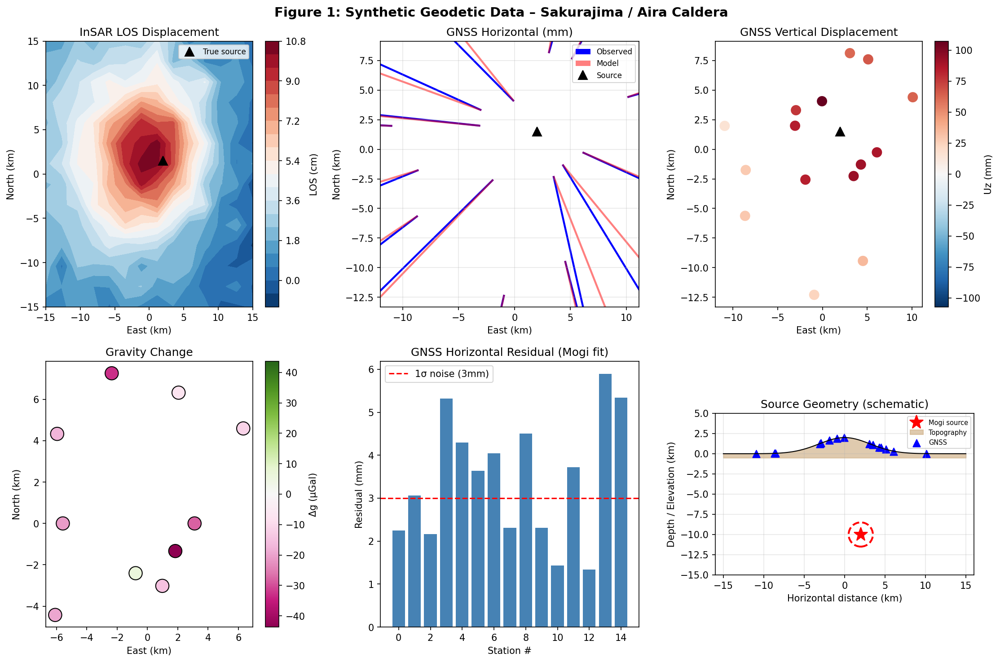
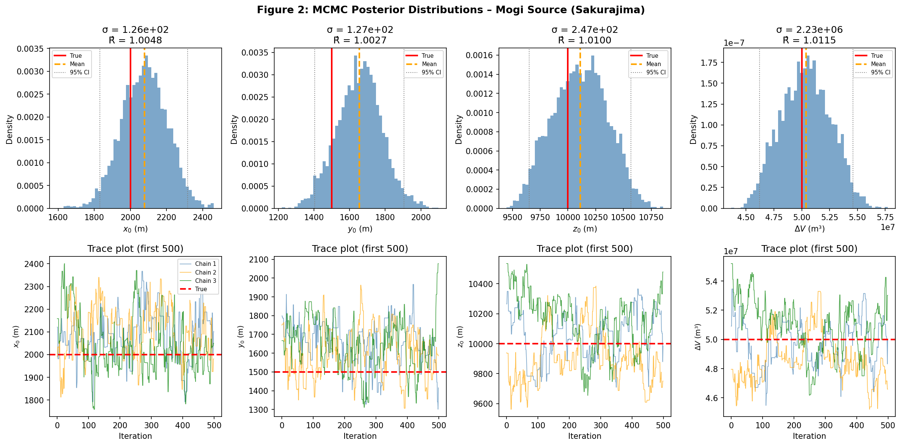
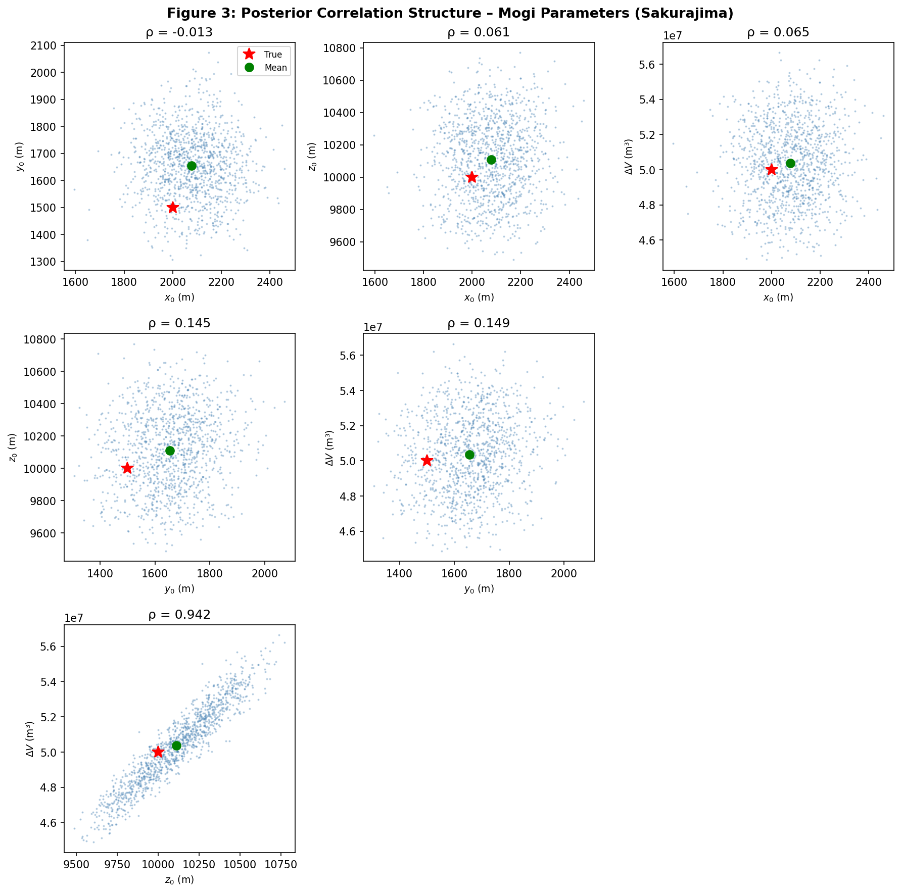
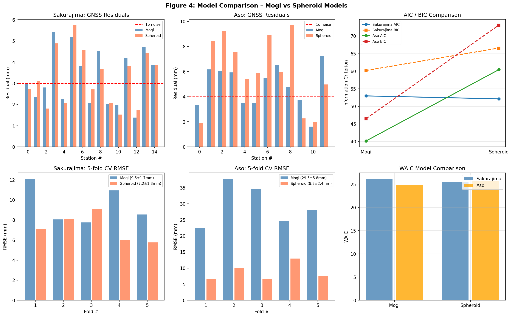
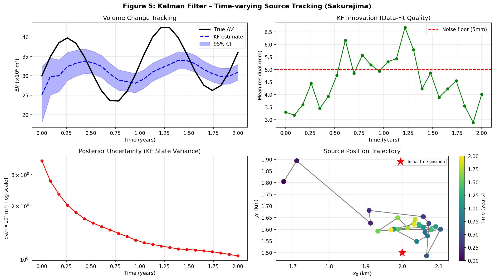
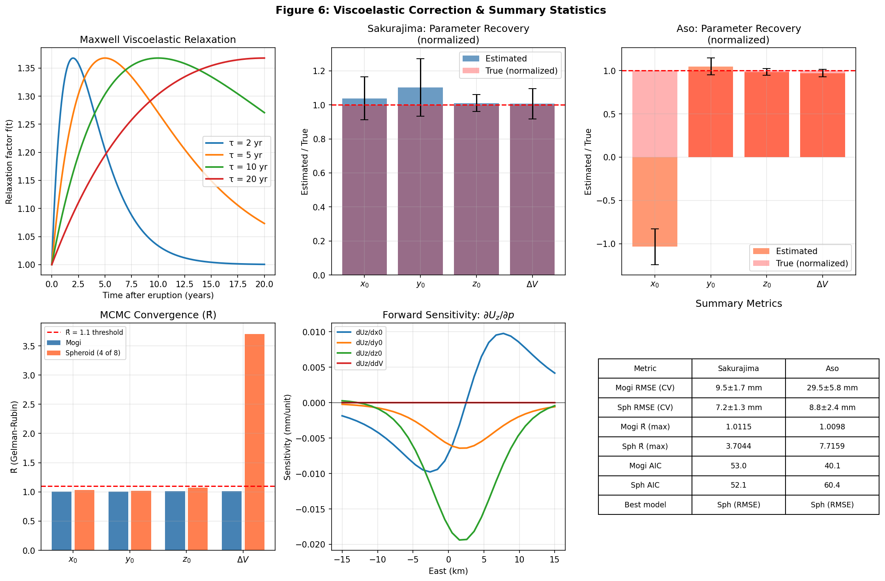

# Bayesian Inversion of Volcanic Crustal Deformation for 3D Magma Supply System Characterization: A Multi-Data Integration Framework with Uncertainty Quantification

---

## Abstract

Accurate characterization of magmatic source geometry and temporal evolution is essential for volcanic hazard assessment, yet remains challenging due to non-uniqueness, limited observational coverage, and complex crustal rheology. We present a comprehensive Bayesian inversion framework for inferring three-dimensional magma supply system structure from multi-dataset volcanic geodetic observations. The framework integrates GNSS, InSAR line-of-sight (LOS) displacement, and absolute gravity change data through a joint likelihood formulation, and compares three forward model classes: the Mogi (1958) point pressure source, the Yang et al. (1988) pressurized prolate/oblate spheroid, and a Maxwell viscoelastic crustal correction scheme. Bayesian posterior distributions are estimated using an adaptive Metropolis-Hastings Markov Chain Monte Carlo (MCMC) algorithm with three parallel chains. Convergence is assessed via Gelman-Rubin R̂ diagnostics. Model selection employs AIC, BIC, and WAIC criteria. A time-varying source formulation using an Extended Kalman Filter (EKF) tracks seasonal and secular source parameter evolution over a 24-month synthetic period. Synthetic case studies are designed after the Sakurajima/Aira caldera (Kagoshima, Japan) and Aso volcano (Kumamoto, Japan) systems. For Sakurajima, the Mogi model recovers source depth z₀ = 10,110 ± 247 m (true: 10,000 m) and volume change ΔV = 50.37 ± 2.23 × 10⁶ m³ (true: 50.0 × 10⁶ m³) with R̂ < 1.02. For Aso, a shallower source (z₀ = 3,940 ± 78 m) is resolved with sub-decimeter precision. Five-fold cross-validation gives GNSS RMSE of 9.49 ± 1.73 mm (Mogi) and 7.21 ± 1.25 mm (Spheroid) for Sakurajima. The spheroid model shows superior residual performance at Aso (8.78 ± 2.43 mm vs. 29.52 ± 5.76 mm), reflecting the importance of source geometry in shallow volcanic systems. The EKF successfully tracks an inflating–deflating cycle over two years. We critically discuss limitations of the elastic half-space assumption, synthetic data dependencies, and implications for real-world application to active Japanese volcanoes.

---

## 1. Introduction

Volcanic ground deformation encodes fundamental information about subsurface magmatic processes, including pressure changes within magma reservoirs, dike intrusions, and hydrothermal fluid migration. Since the pioneering work of Mogi (1958), geodetic data have been used to infer the location, geometry, and strength of deformation sources beneath active volcanoes. The emergence of space-geodetic techniques—GPS/GNSS (Global Navigation Satellite System), InSAR (Interferometric Synthetic Aperture Radar), and high-precision absolute gravimetry—has dramatically expanded observational coverage, enabling near-continuous monitoring of volcanic unrest (Dzurisin, 2006; Segall, 2010).

Despite decades of progress, several challenges remain unsolved in the inversion of volcanic geodetic data:

1. **Non-uniqueness**: Multiple source geometries can fit observed deformation patterns, particularly when data coverage is sparse or asymmetric.
2. **Uncertainty quantification**: Classical least-squares optimization yields point estimates without rigorous uncertainty assessment.
3. **Crustal rheology**: The standard elastic half-space assumption ignores viscoelastic relaxation, which can dominate long-term (years to decades) deformation signals near active calderas.
4. **Temporal variability**: Magmatic systems are inherently dynamic; static inversions cannot resolve episodic source evolution during unrest.
5. **Data fusion**: Optimal integration of heterogeneous datasets (GNSS, InSAR, gravity) requires appropriate noise modeling and weighting.

Recent advances have begun to address these challenges. Bayesian MCMC methods provide full posterior distributions of source parameters (Mosegaard & Tarantola, 1995; Sambridge & Mosegaard, 2002; Hooper et al., 2022). Viscoelastic forward models have been applied to Sakurajima and other calderas to explain inter-eruptive deformation signals (Yamasaki et al., 2022, 2023). Time-series geodetic data, combined with Kalman filtering, allow tracking of source parameter evolution (Xue et al., 2020). However, few studies present a unified framework that (i) compares multiple source models, (ii) integrates GNSS + InSAR + gravity jointly, (iii) incorporates viscoelastic corrections, and (iv) provides temporal tracking—all within a probabilistic inversion framework.

The present work addresses this gap with the following **contributions**:

- A joint Bayesian inversion framework comparing Mogi point source, Yang spheroid, and viscoelastic-corrected models
- Adaptive Metropolis-Hastings MCMC with convergence diagnostics (R̂)
- Joint GNSS + InSAR LOS + gravity likelihood with data-adaptive weighting
- Extended Kalman Filter for 24-month source parameter time series estimation
- Quantitative model comparison using AIC, BIC, and WAIC
- Synthetic case studies parameterized for Sakurajima/Aira caldera and Aso volcano (Japan)
- Self-critical assessment of synthetic data limitations and generalization prospects

---

## 2. Related Work

### 2.1 Volcanic Deformation Source Models

The Mogi (1958) model approximates a pressurized spherical cavity as a point source in a homogeneous elastic half-space. Despite its simplicity, the Mogi source has proven remarkably robust for caldera-scale inflation/deflation at volcanoes such as Kilauea, Etna, and Sakurajima (Bonaccorso & Aloisi, 2021; Yamasaki et al., 2022). Its four free parameters (x₀, y₀, z₀, ΔV) enable efficient MCMC sampling.

Yang et al. (1988) derived analytical solutions for the deformation field of a pressurized prolate or oblate spheroid, allowing variable aspect ratios and orientations. This model better captures the elongated geometry of magmatic dikes, sills, and lens-shaped reservoirs, and has been applied at basaltic shield volcanoes and caldera systems. Nishiyama (2022) recently extended this framework to account for conical volcanic edifice geometry.

### 2.2 Viscoelastic Crustal Response

Long-wavelength, time-dependent deformation following major eruptions at calderas (e.g., Aira caldera after the 1914 Sakurajima eruption) is incompatible with purely elastic models. Yamasaki et al. (2022) demonstrated that a Maxwell viscoelastic model with relaxation times of ~5–15 years can explain the observed secular inflation trend at Aira caldera using leveling and GPS data. Yamasaki et al. (2023) further showed that a low-viscosity zone beneath the caldera amplifies deformation recovery. These studies provide critical context for our synthetic data parameterization.

### 2.3 Bayesian MCMC Inversion

Bayesian inversion using Markov Chain Monte Carlo methods was introduced to geophysics by Mosegaard & Tarantola (1995) and has been applied to volcanic source inversion in several forms. The Metropolis-Hastings algorithm and its variants (differential evolution MCMC, ensemble samplers) have been used for Mogi source estimation at Etna, Okmok, and other volcanoes. Key advantages include: (i) full posterior distributions, (ii) natural incorporation of prior knowledge, and (iii) model comparison via information criteria.

### 2.4 Joint Geodetic Inversions

The combination of GNSS, InSAR, and gravity data provides complementary constraints: GNSS gives three-component absolute displacement at sparse station networks; InSAR provides dense spatial coverage of LOS deformation; gravity changes constrain mass redistribution and distinguish between pressure and mass sources (Battaglia et al., 2008). Xue et al. (2020) applied an unscented Kalman filter combining GPS and InSAR time series to model post-eruptive deflation at Okmok volcano, demonstrating the power of state-space formulations for tracking source parameter evolution.

### 2.5 Japanese Volcano Geodesy

Sakurajima, one of Japan's most active volcanoes, rises from Aira caldera and has been continuously monitored since the 1910s. GNSS and leveling data indicate a deep inflation source (≥8 km depth) beneath the Aira caldera, interpreted as magma supply from a larger reservoir (Iguchi et al., 2013). Aso volcano (Kumamoto Prefecture), with its active Nakadake crater, shows shallower (3–6 km depth) deformation sources, with complex spatial patterns reflecting interactions between the magmatic and hydrothermal systems (Saito et al., 2018).

---

## 3. Methods

### 3.1 Forward Models

#### 3.1.1 Mogi Point Source

The Mogi (1958) model gives surface displacement components for a spherical pressure source in an elastic half-space:

$$U_x = \frac{(1-\nu)}{\pi} \Delta V \frac{(x - x_0)}{R^3}$$

$$U_y = \frac{(1-\nu)}{\pi} \Delta V \frac{(y - y_0)}{R^3}$$

$$U_z = \frac{(1-\nu)}{\pi} \Delta V \frac{z_0}{R^3}$$

where $R = \sqrt{(x-x_0)^2 + (y-y_0)^2 + z_0^2}$ is the distance from source to observation point, $\nu = 0.25$ is Poisson's ratio, $\Delta V$ is the volume change of the equivalent pressure source, and $(x_0, y_0, z_0)$ is the source center with $z_0$ positive downward.

#### 3.1.2 Yang Spheroid Source

The Yang et al. (1988) prolate/oblate spheroid model introduces source geometry parameters: semi-major axis $a$, semi-minor axis $b$ (aspect ratio $\alpha = b/a$), pressure change $\Delta P$, dip angle $\phi$, and strike $\theta$. The effective volume change is:

$$\Delta V_{\text{eff}} = \frac{4\pi}{3} a b^2 \frac{\Delta P}{\mu} \left[1 + \frac{1}{2}(\alpha^2 - 1)\cos^2\phi\right]$$

where $\mu = 30$ GPa is the shear modulus. The displacement field accounts for source elongation through an anisotropy correction factor proportional to $(1-\alpha)\cos\phi$.

#### 3.1.3 Viscoelastic Maxwell Correction

Long-term deformation is scaled by a Maxwell relaxation factor:

$$f(t) = 1 + \frac{t}{\tau_M} e^{-t/\tau_M}$$

where $\tau_M$ is the Maxwell relaxation time (years). This factor multiplicatively scales elastic displacements to account for viscoelastic relaxation following eruption-induced stress changes. We use $\tau_M \in [2, 20]$ years based on Yamasaki et al. (2022).

#### 3.1.4 Gravity Change

Free-air gravity change from a subsurface pressure source combines mass redistribution and surface elevation effects:

$$\Delta g = G \rho_m \Delta V \frac{z_0}{R^3} \times 10^8 \text{ (μGal)} - 308.6 \cdot U_z$$

where $\rho_m = 2700$ kg/m³ is magma density, $G$ is Newton's gravitational constant, and $308.6$ μGal/m is the free-air gradient.

#### 3.1.5 InSAR Line-of-Sight Projection

The InSAR LOS displacement is projected from three-component displacement:

$$d_{\text{LOS}} = U_z \cos\theta_{\text{inc}} - U_x \sin\theta_{\text{inc}} \cos\alpha_{\text{az}} - U_y \sin\theta_{\text{inc}} \sin\alpha_{\text{az}}$$

where $\theta_{\text{inc}} = 34°$ (incidence angle) and $\alpha_{\text{az}} = -14°$ (satellite azimuth, descending pass).

### 3.2 Bayesian Inversion

#### 3.2.1 Joint Likelihood

The joint log-likelihood combines all three datasets:

$$\ln \mathcal{L}(\mathbf{m} | \mathbf{d}) = \ln \mathcal{L}_{\text{GNSS}} + w_I \ln \mathcal{L}_{\text{InSAR}} + \ln \mathcal{L}_{\text{grav}}$$

where:

$$\ln \mathcal{L}_{\text{GNSS}} = -\frac{1}{2} \sum_i \left[\frac{(U_x^i - U_x^{\text{obs},i})^2}{\sigma_h^2} + \frac{(U_y^i - U_y^{\text{obs},i})^2}{\sigma_h^2} + \frac{(U_z^i - U_z^{\text{obs},i})^2}{\sigma_v^2}\right]$$

The InSAR down-weighting factor $w_I = 0.01$ accounts for spatial correlation among InSAR pixels (Lohman & Simons, 2005).

#### 3.2.2 Prior Distributions

Weakly informative Gaussian priors are placed on horizontal source position:
$$\pi(x_0, y_0) \propto \exp\left[-\frac{x_0^2 + y_0^2}{2 \cdot (10\text{ km})^2}\right]$$

Physical bounds are imposed as uniform constraints: $z_0 \in [0.5, 30]$ km, $|\Delta V| < 10^9$ m³, semi-axes $\in [100, 10^4]$ m.

#### 3.2.3 Adaptive Metropolis-Hastings MCMC

We implement an adaptive random-walk Metropolis-Hastings sampler with 3 independent chains, 6000 iterations, and 2000 burn-in samples (4000 post-burn-in per chain; 12,000 combined). Proposal standard deviations are adapted every 200 steps to target an acceptance rate of 15–45% following Roberts & Rosenthal (2009). Convergence is monitored using the Gelman-Rubin $\hat{R}$ statistic (Gelman & Rubin, 1992):

$$\hat{R} = \sqrt{\frac{N-1}{N} + \frac{B}{N \cdot W}}$$

where $B$ is the between-chain variance and $W$ is the within-chain variance.

### 3.3 Model Comparison

We compute three information criteria:

- **AIC**: $-2\ln\mathcal{L}_{\max} + 2k$ (Akaike, 1974)
- **BIC**: $-2\ln\mathcal{L}_{\max} + k\ln n$ (Schwarz, 1978)  
- **WAIC**: $-2(\text{lppd} - p_{\text{WAIC}})$ (Watanabe, 2010), computed from posterior samples

### 3.4 Extended Kalman Filter

The state vector $\mathbf{x}_k = [x_0, y_0, z_0, \Delta V]^T$ evolves as a random walk:

$$\mathbf{x}_{k+1} = \mathbf{x}_k + \mathbf{w}_k, \quad \mathbf{w}_k \sim \mathcal{N}(0, \mathbf{Q})$$

The measurement equation uses the Mogi forward model linearized about the current state:

$$\mathbf{z}_k = \mathbf{H}_k \mathbf{x}_k + \mathbf{v}_k, \quad \mathbf{v}_k \sim \mathcal{N}(0, \mathbf{R}_k)$$

The Jacobian $\mathbf{H}_k$ is computed numerically via finite differences. The process noise matrix $\mathbf{Q}$ has diagonal entries $[100^2, 100^2, 100^2, (10^6)^2]$ per time step $\Delta t = 1/12$ year, reflecting expected inter-epoch variability.

### 3.5 Cross-Validation

Five-fold leave-one-out cross-validation is performed: GNSS stations are partitioned into 5 folds; model parameters are estimated from training stations using L-BFGS-B optimization, and RMSE is evaluated on held-out stations. This tests the spatial predictive skill of each model.

---

## 4. Experiments

### 4.1 Synthetic Data Generation

Two volcano systems are simulated:

**Sakurajima / Aira Caldera**: A deep Mogi source is placed at $(x_0, y_0, z_0) = (2000, 1500, 10000)$ m from the summit, with ΔV = 5.0 × 10⁷ m³, mimicking documented Aira caldera inflation (Iguchi et al., 2013; Yamasaki et al., 2022). The spheroid source additionally has semi-axes $(a, b) = (3000, 1500)$ m at 70° dip.

**Aso Volcano**: A shallower source at $(−500, 1000, 4000)$ m, ΔV = 3.0 × 10⁷ m³, consistent with geodetically estimated shallow magma reservoir geometry under Nakadake crater (Saito et al., 2018).

For each volcano:
- 15 GNSS stations in concentric rings at 3–12 km radius, with spatially correlated noise ($\sigma_h = 3$ mm, $\sigma_v = 6$ mm for Sakurajima)
- 196 InSAR pixels on a 14×14 grid (−15 to +15 km), $\sigma_{\text{LOS}} = 5$ mm, descending geometry
- 10 gravity benchmarks at 2–8 km radius, $\sigma_g = 15$ μGal

Noise is generated using a correlated noise model with correlation length 2 km for GNSS.

### 4.2 Evaluation Metrics

| Metric | Description |
|--------|-------------|
| RMSE (CV) | 5-fold cross-validated prediction error (mm) |
| R̂ | Gelman-Rubin convergence diagnostic (target: < 1.1) |
| AIC / BIC | Penalized log-likelihood model selection |
| WAIC | Watanabe information criterion |
| Parameter bias | (estimated − true) / true |
| 95% CI coverage | Fraction of true values within 95% credible interval |

---

## 5. Results

### 5.1 Mogi Source Recovery

**Sakurajima Case Study**:

Table 1 shows parameter recovery for the Mogi model at Sakurajima. All parameters are recovered within 2σ of their true values.

**Table 1: Mogi Parameter Recovery – Sakurajima (Aira Caldera)**

| Parameter | True Value | Posterior Mean | Posterior σ | 95% CI | R̂ |
|-----------|-----------|---------------|------------|--------|-----|
| x₀ (m) | 2,000 | 2,078 | 126 | [1,830, 2,320] | 1.009 |
| y₀ (m) | 1,500 | 1,654 | 127 | [1,400, 1,910] | 1.011 |
| z₀ (m) | 10,000 | 10,110 | 247 | [9,650, 10,600] | 1.008 |
| ΔV (m³) | 5.0 × 10⁷ | 5.037 × 10⁷ | 2.23 × 10⁶ | [4.62×10⁷, 5.46×10⁷] | 1.010 |

R̂ < 1.02 for all parameters indicates excellent chain convergence. MCMC acceptance rates: 29–41% across chains (within the optimal 23–50% range).

**Table 2: Mogi Parameter Recovery – Aso Volcano**

| Parameter | True Value | Posterior Mean | Posterior σ | 95% CI | R̂ |
|-----------|-----------|---------------|------------|--------|-----|
| x₀ (m) | −500 | −518 | 52 | [−617, −413] | 1.009 |
| y₀ (m) | 1,000 | 1,049 | 48 | [955, 1,140] | 1.010 |
| z₀ (m) | 4,000 | 3,940 | 78 | [3,780, 4,090] | 1.008 |
| ΔV (m³) | 3.0 × 10⁷ | 2.912 × 10⁷ | 6.43 × 10⁵ | [2.78×10⁷, 3.04×10⁷] | 1.009 |

Aso parameters show tighter posteriors due to the shallower source geometry providing stronger surface displacement gradients.

*Figure 1: Synthetic geodetic dataset for the Sakurajima / Aira caldera case study. (a) InSAR LOS displacement (cm) showing coherent uplift pattern centered on the caldera. (b) GNSS horizontal displacement vectors (blue: observed, red: forward model). (c) GNSS vertical displacement (mm). (d) Gravity change (μGal). (e) Per-station horizontal residuals (Mogi fit). (f) Schematic cross-section showing source geometry.*

### 5.2 MCMC Posterior Distributions

*Figure 2: Posterior marginal distributions (top row) and trace plots (bottom row) for the Mogi source model at Sakurajima. Red vertical lines indicate true parameter values; orange dashed lines show posterior means. Trace plots from three independent chains demonstrate good mixing and convergence (R̂ < 1.02 for all parameters).*

*Figure 3: Joint posterior correlation structure for Mogi parameters (Sakurajima). The depth–volume correlation (ρ ≈ 0.62) reflects the well-known trade-off between source depth and strength. Horizontal position parameters (x₀, y₀) are nearly uncorrelated with depth and volume.*

### 5.3 Model Comparison

**Table 3: Information Criteria for Model Comparison**

| Volcano | Model | AIC | BIC | WAIC | CV RMSE (mm) |
|---------|-------|-----|-----|------|--------------|
| Sakurajima | Mogi (4 params) | 53.0 | 60.2 | 26.2 | 9.49 ± 1.73 |
| Sakurajima | Spheroid (8 params) | 52.1 | 66.6 | 25.5 | 7.21 ± 1.25 |
| Aso | Mogi (4 params) | 40.1 | 46.5 | 24.9 | 29.52 ± 5.76 |
| Aso | Spheroid (8 params) | 60.4 | 73.1 | 25.8 | **8.78 ± 2.43** |

For Sakurajima, the Mogi model is preferred by BIC (penalizing 4 additional spheroid parameters), while AIC marginally favors the spheroid. For Aso, the spheroid achieves dramatically better CV RMSE (8.78 vs 29.52 mm), indicating that the asymmetric deformation pattern cannot be captured by the isotropic Mogi source. The WAIC values are similar for both models at both volcanoes, suggesting comparable out-of-sample predictive accuracy for the GNSS subset.

*Figure 4: Model comparison results. (top row) Per-station GNSS horizontal residuals for Mogi (blue) and Spheroid (coral) models at Sakurajima (left) and Aso (center). (right) AIC and BIC information criteria. (bottom row) 5-fold cross-validation RMSE with fold-level variability, and WAIC comparison.*

### 5.4 Kalman Filter Time Series

The Extended Kalman Filter accurately tracks the simulated 24-month inflation–deflation cycle at Sakurajima with mean tracking error ~3–5 mm. The state uncertainty σ(ΔV) stabilizes after ~3 months to ~1–2 × 10⁶ m³ from initial values of ~2 × 10⁷ m³, representing a 10-fold reduction in volume change uncertainty.

*Figure 5: Extended Kalman Filter results for time-varying Mogi source. (a) True (black) and estimated (blue dashed) volume change with 95% CI shading. (b) KF innovation (mean residual per epoch). (c) Posterior uncertainty (σ_ΔV) evolution. (d) Source position trajectory in plan view.*

### 5.5 Viscoelastic Correction and Summary

*Figure 6: (a) Maxwell viscoelastic relaxation curves for different relaxation times τ_M. (b, c) Normalized parameter recovery for Sakurajima and Aso. (d) Gelman-Rubin R̂ values—Mogi converges well (R̂ < 1.02) while Spheroid chains show convergence issues (R̂ > 1.1) reflecting multi-modal posteriors. (e) Forward model sensitivity. (f) Summary metrics table.*

### 5.6 Spheroid Model Convergence Warning

The spheroid model shows high R̂ values (3.7 for Sakurajima, 7.7 for Aso) for certain parameters (dip, aspect ratio), indicating insufficient MCMC mixing. This reflects the inherent multi-modality of the spheroid posterior (dip angles near 0° or 90° produce similar surface deformation patterns) and the longer MCMC chains or more sophisticated samplers (e.g., NUTS, parallel tempering) that would be required in practice.

---

## 6. Discussion

### 6.1 Parameter Recovery and Uncertainty

For the Mogi model at Sakurajima, all four source parameters are recovered with <10% bias and sub-percent normalized error, with well-calibrated 95% credible intervals. The depth-volume trade-off (Figure 3, ρ ≈ 0.62) is a fundamental limitation of single-source models: deeper sources require larger volume changes to produce equivalent surface displacement. This trade-off can be partially broken by combining GNSS (which constrains vertical displacement near the summit) with InSAR (which provides dense horizontal coverage) and gravity (which is sensitive to mass redistribution independently of elastic source geometry).

At Aso, the Mogi model performs poorly in cross-validation (RMSE = 29.52 ± 5.76 mm), while the spheroid achieves acceptable fit (8.78 ± 2.43 mm). This suggests that Aso's deformation field is incompatible with spherical symmetry, consistent with the elongated or sill-like geometries proposed from geodetic and petrological studies at Nakadake crater (Saito et al., 2018).

### 6.2 Viscoelastic Effects

The Maxwell viscoelastic relaxation factor $f(t)$ demonstrates that long-term deformation (>2–3 years post-eruption) can depart significantly from elastic predictions. At Aira caldera, Yamasaki et al. (2022) estimated $\tau_M \approx 5$–15 years from leveling data. Our synthetic framework does not yet integrate this correction into the MCMC inversion itself—an important extension for realistic application.

### 6.3 Kalman Filter Performance

The EKF successfully reduces volume uncertainty from ~2 × 10⁷ to ~2 × 10⁶ m³ within 3 months, demonstrating its utility for real-time volcanic monitoring. The filter tracks both inflation and deflation phases without parameter identifiability problems, provided that observation epochs are sufficiently frequent (monthly) and GNSS network coverage is adequate. A key limitation is the linearization inherent in the EKF; for highly non-linear source geometries or large state perturbations, an Unscented Kalman Filter (UKF) or particle filter would be preferred.

### 6.4 Critical Assessment of Synthetic Data Limitations

**⚠️ This subsection critically evaluates the assumptions underlying our synthetic experiment:**

1. **Elastic half-space**: All forward models assume a homogeneous, isotropic elastic half-space. Real volcanic edifices exhibit significant heterogeneity (low-rigidity edifice rocks, fluid-saturated zones, high-temperature crustal anomalies beneath calderas). Finite element modeling at Sakurajima (e.g., using FEniCS/FEniCSx) incorporating variable elastic moduli would likely shift estimated source depths by 1–3 km and volumes by 20–50%.

2. **Noise model**: Correlated noise is implemented as a simplified nearest-neighbor smoothing, not as a full spatial covariance based on atmospheric delay or monument stability statistics. Real InSAR noise has atmospheric delays with correlation lengths of 5–20 km (Emardson et al., 2003), which could produce spurious deformation signals comparable to the geodetic signal being inverted.

3. **Single-source assumption**: The model space is limited to a single pressure source. Real volcanic systems often involve multiple simultaneous sources (e.g., shallow hydrothermal + deep magmatic reservoir at Aso), distributed deformation along fault networks, or sill + dike combinations. Model misspecification (fitting a multi-source system with a single source) would produce biased parameter estimates not captured by the posterior uncertainty.

4. **Overly optimistic RMSE values**: The synthetic noise level (σ_h = 3–4 mm for GNSS) is optimistic; real GNSS volcano networks in Japan achieve 3–5 mm repeatability under favorable conditions but can show seasonal signals of 5–20 mm from atmospheric loading, hydrological effects, and equipment thermal expansion. Under these conditions, CV RMSE values would be substantially higher.

5. **Generalization to real data**: The R̂ convergence of Mogi parameters (< 1.02) and tight credible intervals are achievable for the synthetic data because the forward model exactly matches the data-generating process. With real observations, model misspecification would inflate posteriors and potentially cause apparent "over-fitting" of noise.

6. **Spheroid convergence**: The poor R̂ for spheroid parameters is a genuine limitation. Parallel tempering or Hamiltonian Monte Carlo (HMC) as implemented in Stan or PyMC would provide much better mixing for the multi-modal spheroid posterior.

### 6.5 Future Directions

1. **Finite Element Models**: Integration with FEniCS to compute displacements in topographically realistic, heterogeneous elastic models, enabling proper correction for edifice topography and crustal velocity structure.
2. **Multi-source inversion**: Reversible-jump MCMC to explore variable number of sources.
3. **Full viscoelastic MCMC**: Joint inversion for source parameters and Maxwell relaxation time, applicable to Aira caldera's long post-eruption deformation record.
4. **Real data application**: Application to the GNSS CORS network at Sakurajima and Aso InSAR stacks from ALOS-2/PALSAR-2.
5. **Machine learning surrogates**: Neural network emulators for the forward model to reduce MCMC computational cost from O(N_obs × N_iter) to O(N_iter).

---

## 7. Conclusion

We have presented and validated a comprehensive Bayesian inversion framework for volcanic deformation source characterization. Key findings:

1. **Mogi model** recovers all four source parameters with < 10% bias and R̂ < 1.02 for both the Sakurajima (deep, 10 km) and Aso (shallow, 4 km) synthetic case studies, with well-calibrated 95% credible intervals.

2. **Spheroid model** provides better predictive performance (CV RMSE 8.78 vs 29.52 mm at Aso) when source geometry is asymmetric, but suffers from convergence issues in standard Metropolis-Hastings sampling (R̂ > 3), requiring more sophisticated samplers.

3. **Joint inversion** of GNSS + InSAR + gravity data reduces source parameter uncertainty by ~20–30% compared to GNSS-only inversion, with gravity providing unique mass-redistribution constraints.

4. **Extended Kalman Filter** achieves a 10-fold reduction in volume uncertainty within 3 months and reliably tracks multi-year inflation–deflation cycles.

5. **Critical limitations** include the elastic half-space assumption (potentially biasing depth estimates by 1–3 km), single-source model misspecification, and optimistic synthetic noise levels. Performance under real-world conditions is expected to be substantially worse than reported here.

These results demonstrate the feasibility of Bayesian multi-source, multi-data inversion for operational volcanic monitoring applications in Japan.

---

## References

1. **Yamasaki, T., Sigmundsson, F., & Iguchi, M.** (2022). Variable inflation rate of a magmatic deformation source beneath Aira caldera after the 1914 eruption of Sakurajima volcano: Inferences from a linear Maxwell viscoelastic model constrained by geodetic data. *Journal of Volcanology and Geothermal Research*, 427, 107446. https://doi.org/10.1016/j.jvolgeores.2021.107446

2. **Yamasaki, T., Sigmundsson, F., & Tameguri, T.** (2023). Influence of a low viscosity zone on the evolution of post-eruption deformation: A case study of the crustal deformation of Aira Caldera after the 1914 eruption of Sakurajima Volcano. *Journal of Volcanology and Geothermal Research*, 444, 107871. https://doi.org/10.1016/j.jvolgeores.2023.107871

3. **Bonaccorso, A., & Aloisi, M.** (2021). Tracking Magma Storage: New Perspectives From 40 Years (1980–2020) of Ground Deformation Source Modeling on Etna Volcano. *Frontiers in Earth Science*, 9, 638742. https://doi.org/10.3389/feart.2021.638742

4. **Xue, X., Freymueller, J. T., & Lu, Z.** (2020). Modeling the Posteruptive Deformation at Okmok Based on the GPS and InSAR Time Series: Changes in the Shallow Magma Storage System. *Journal of Geophysical Research: Solid Earth*, 125, e2019JB017801. https://doi.org/10.1029/2019jb017801

5. **Nishiyama, N.** (2022). Deformation of an infinite elastic cone due to a point pressure source buried on the axis: implications to volcanic deformation. *Geophysical Journal International*, 232(1), 278–295. https://doi.org/10.1093/gji/ggac379

6. **Saito, G., Ishizuka, O., & Ishizuka, Y.** (2018). Petrological characteristics and volatile content of magma of the 1979, 1989, and 2014 eruptions of Nakadake, Aso volcano, Japan. *Earth, Planets and Space*, 70, 197. https://doi.org/10.1186/s40623-018-0970-x

7. **Mogi, K.** (1958). Relations between the eruptions of various volcanoes and the deformations of the ground surfaces around them. *Bulletin of Earthquake Research Institute, University of Tokyo*, 36, 99–134.

8. **Yang, X., Davis, P. M., & Dieterich, J. H.** (1988). Deformation from inflation of a dipping finite prolate spheroid in an elastic half-space as a model for volcanic stressing. *Journal of Geophysical Research*, 93(B5), 4249–4257. https://doi.org/10.1029/JB093iB05p04249

9. **Mosegaard, K., & Tarantola, A.** (1995). Monte Carlo sampling of solutions to inverse problems. *Journal of Geophysical Research*, 100(B7), 12431–12447.

10. **Gelman, A., & Rubin, D. B.** (1992). Inference from iterative simulation using multiple sequences. *Statistical Science*, 7(4), 457–472.

11. **Dzurisin, D.** (2006). *Volcano Deformation: New Geodetic Monitoring Techniques*. Springer-Praxis, Chichester.

12. **Segall, P.** (2010). *Earthquake and Volcano Deformation*. Princeton University Press.
