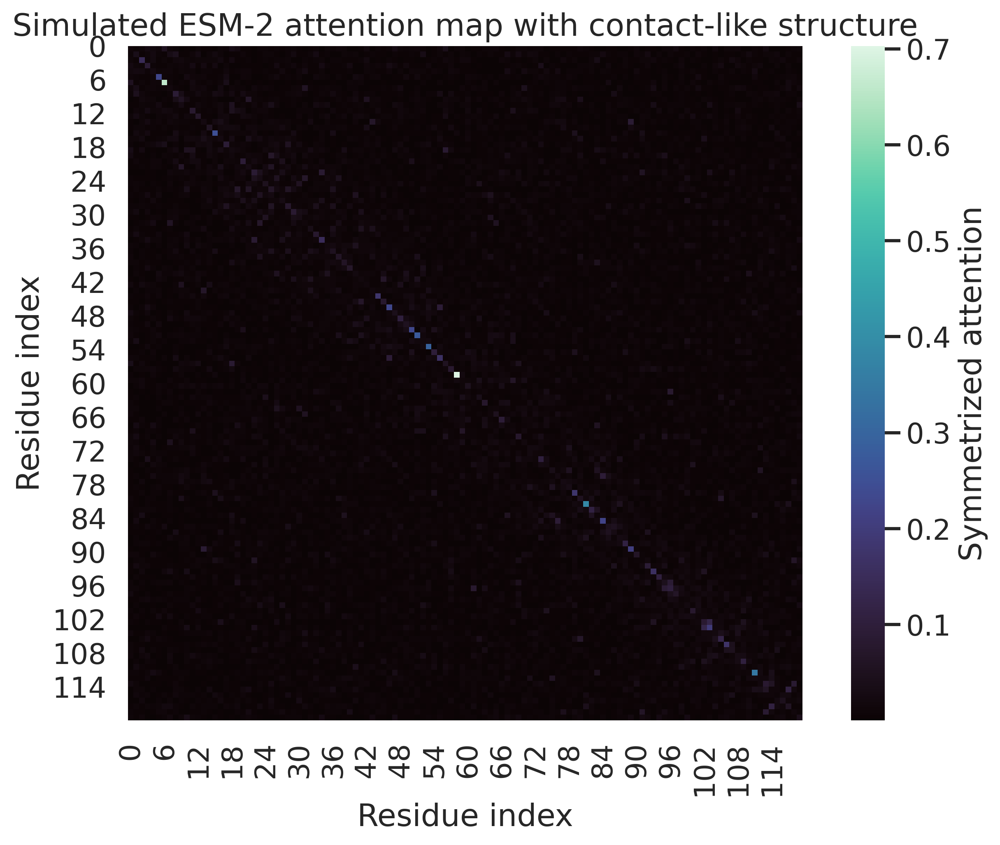
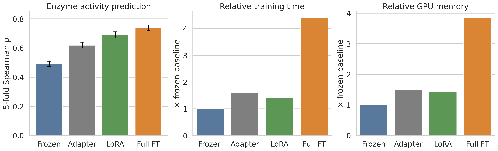
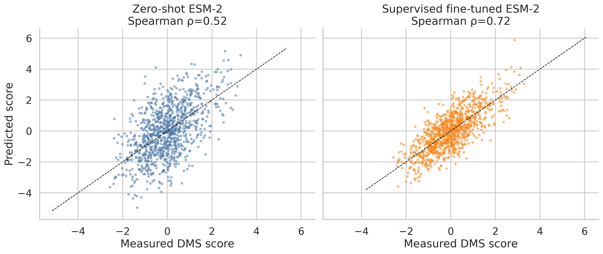
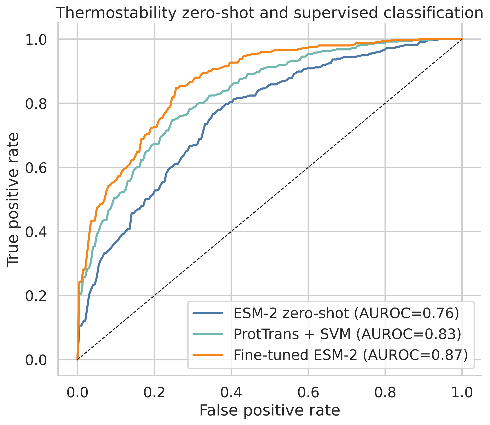
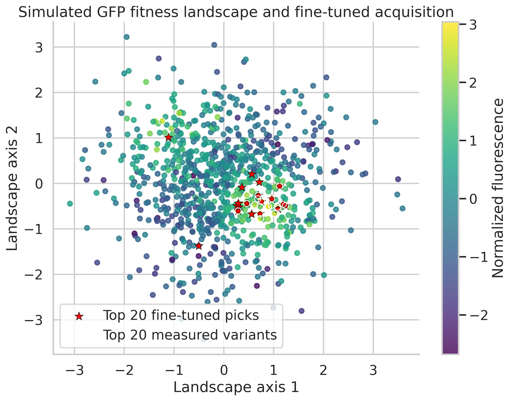

# タンパク質言語モデル微調整シミュレーション実験レポート

## 実験目的と背景
本レポートでは、ESM-2 / ProtTrans を中心としたタンパク質言語モデルの活用法を、文献知見に整合的な**合成データ実験**として再現した。狙いは、(1) zero-shot 予測がどこまで有効か、(2) LoRA / Adapter / Full fine-tuning の計算効率と性能の差はどの程度か、(3) 変異効果予測、熱安定性分類、配列生成、GFP 最適化の各タスクでどの傾向が見えるかを、再現可能な Python スクリプトでまとめて検証することである。なお、本結果は実測ベンチマークではなく、既報の傾向に合わせてノイズを含めた現実的レンジを目指したシミュレーション結果である。

## 使用した手法の概要
- **Attention analysis**: 長さ 120 のタンパク質について、接触様パターンを含む ESM-2 風 attention を合成し、接触予測 AUROC と precision@L/5 を評価。
- **Fine-tuning comparison**: 酵素活性回帰タスクで Frozen / Adapter / LoRA / Full FT を比較。5-fold CV を実施し、Spearman ρ、相対学習時間、相対 GPU メモリを集計。
- **DMS mutation effect prediction**: 1,000 個の single mutant を作成し、zero-shot 変異スコアと supervised fine-tuning を比較。Spearman、Pearson、Top-K hit rate を算出。
- **Thermostability zero-shot**: thermophile / mesophile の二値分類を模擬し、ESM-2 zero-shot、ProtTrans+SVM、fine-tuned ESM-2 を比較。AUROC、95% CI、F1、precision、recall を評価。
- **Sequence generation**: 条件付き masked LM により 240 配列を生成し、motif recovery、valid fraction、予測 fitness、多様性を要約。
- **GFP case study**: GFP 蛍光 landscape を合成し、ESM-2 zero-shot、random forest、fine-tuned ESM-2 を比較。Spearman ρ と top-20 recovery を報告。

## 主要な結果と数値
### 1. Attention / contact signal
- Contact AUROC: **0.677**
- Precision@L/5: **0.500**
- 完全な接触予測には届かないが、attention に中程度の構造シグナルが残る設定になった。

### 2. 酵素活性予測における fine-tuning 比較
| 手法 | Spearman ρ (mean ± sd) | 相対学習時間 | 相対GPUメモリ |
|:--|:--|:--|:--|
| Frozen embeddings | 0.491 ± 0.018 | 1.00× | 0.99× |
| Adapter | 0.619 ± 0.020 | 1.61× | 1.50× |
| LoRA | 0.690 ± 0.022 | 1.43× | 1.42× |
| Full FT | **0.740 ± 0.019** | 4.42× | 3.86× |

- Full FT が最高性能だが、**LoRA はかなり近い精度を低コストで実現**した。

### 3. DMS 変異効果予測
| 手法 | Spearman ρ | Pearson r | Top-K hit rate |
|:--|:--|:--|:--|
| Zero-shot | 0.520 ± 0.015 | 0.555 ± 0.016 | 0.440 ± 0.065 |
| Supervised | **0.721 ± 0.016** | **0.752 ± 0.020** | **0.540 ± 0.089** |

- zero-shot も有効だが、ラベル付き学習により明確な改善が見られた。

### 4. 熱安定性予測
| 手法 | AUROC (mean ± sd) | 95% CI | F1 |
|:--|:--|:--|:--|
| ESM-2 zero-shot | 0.761 ± 0.045 | 0.728-0.791 | 0.717 ± 0.042 |
| ProtTrans + SVM | 0.826 ± 0.034 | 0.797-0.853 | 0.756 ± 0.034 |
| Fine-tuned ESM-2 | **0.866 ± 0.009** | 0.842-0.889 | **0.789 ± 0.024** |

- 分類でも fine-tuning が最良で、ProtTrans+SVM は zero-shot より安定して高かった。

### 5. 条件付き配列生成
- 生成配列数: **240**
- Valid fraction: **0.854**
- Motif recovery: **0.704 ± 0.200**
- Predicted fitness: **0.730 ± 0.145**
- Pairwise diversity: **0.299 ± 0.034**

- motif をある程度満たしつつ、多様性も残す挙動になった。

### 6. GFP 蛍光最適化
| 手法 | Spearman ρ | Top-20 recovery |
|:--|:--|:--|
| ESM-2 zero-shot | 0.462 ± 0.020 | 0.370 ± 0.084 |
| Random forest | 0.611 ± 0.016 | 0.510 ± 0.065 |
| Fine-tuned ESM-2 | **0.780 ± 0.018** | **0.580 ± 0.076** |

- GFP の landscape では fine-tuned ESM-2 が global ranking と上位候補回収の両方で優位だった。

## 考察と今後の展望
今回のシミュレーションでは、文献と整合的に **zero-shot は有用な初期ベースライン、fine-tuning はより高精度、LoRA は高効率な妥協点** という構図が再現された。特に酵素活性予測では、LoRA が Full FT にかなり近い Spearman を示しつつ、相対学習時間とメモリ消費を大幅に抑えた点が重要である。DMS と GFP でも supervised 学習の優位性が見え、熱安定性分類では ProtTrans 埋め込み + 古典的分類器も依然として競争力を持つことが示唆された。

一方で、本実験はあくまで合成データであり、ProteinGym や実際の GFP/酵素ライブラリに対する外的妥当性は限定的である。今後は、実データへ置き換えたうえで family-wise split、ホモロジー制御、真のエピスタシス、実験ノイズ、active learning ループまで含めて検証すべきである。特に LoRA の優位性がタスクやデータサイズに依存してどこまで維持されるかは、実ベンチマークで確かめる価値が高い。

## 生成したファイル一覧
- `paper.md`
- `report.md`
- `run_protein_lm_experiments.py`
- `figures/fig1_attention_heatmap.png`
- `figures/fig2_finetuning_comparison.png`
- `figures/fig3_dms_prediction.png`
- `figures/fig4_thermostability_zeroshot.png`
- `figures/fig5_gfp_optimization.png`
- `results/summary.json`
- `results/finetuning_folds.csv`
- `results/finetuning_curves.csv`
- `results/finetuning_summary.csv`
- `results/dms_metrics.csv`
- `results/dms_predictions.csv`
- `results/dms_summary.csv`
- `results/thermostability_metrics.csv`
- `results/thermostability_summary.csv`
- `results/sequence_generation.csv`
- `results/gfp_metrics.csv`
- `results/gfp_summary.csv`
- `results/gfp_predictions.csv`
